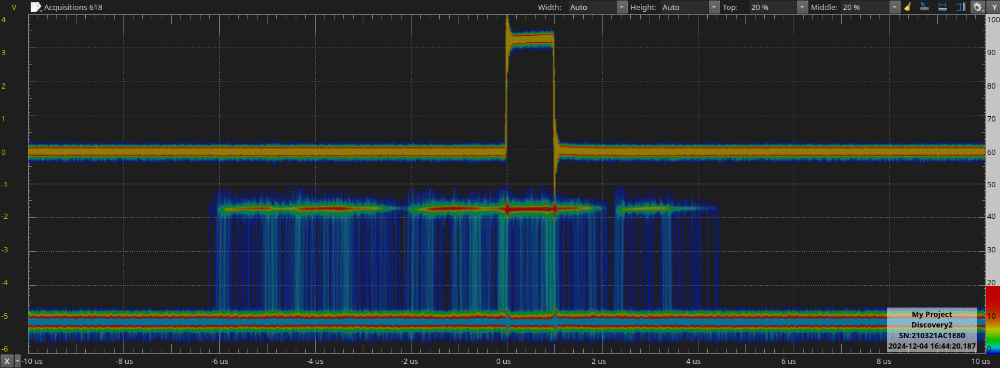
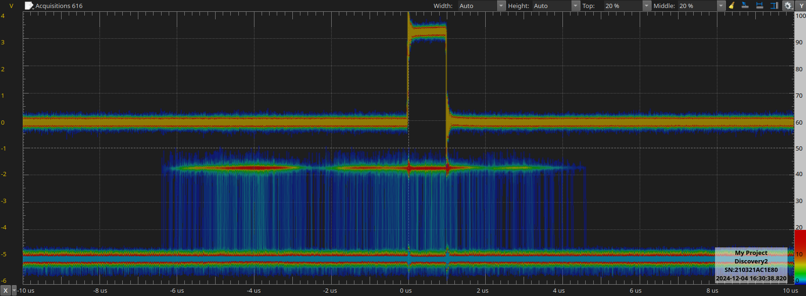
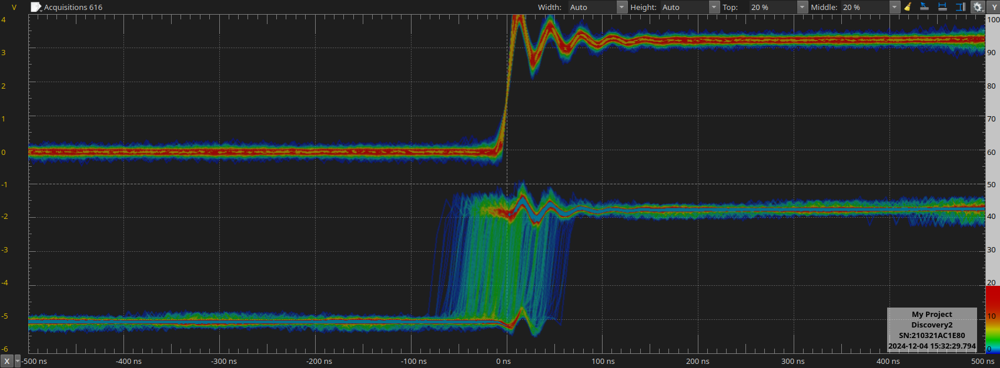
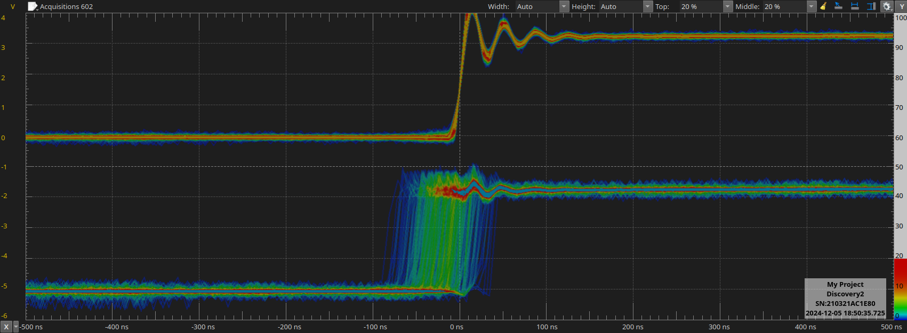
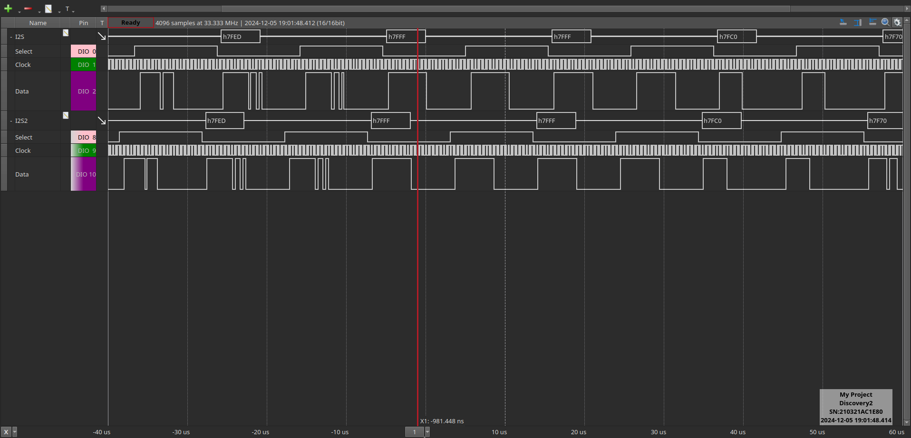

# -*- Mode: org -*-
# -*- coding: utf-8 -*-
#+STARTUP: overview indent inlineimages logdrawer hidestars
#+TITLE:       Research Journal
#+AUTHOR:      Thomas Rushton
#+LANGUAGE:    en
#+TAGS: noexport(n) MEETING(m) SUPERVISION(u) PRESENTATION(p) SOUTENANCE(F)
#+TAGS: BLOG(b) TRAINING(n) INSPO(i) DIY(d) TEACHING(h) REPRES(R) REVIEW(v)
#+TAGS: GSoC(G) CONFERENCE(C) WRITING(w) BRAINDUMP(B) VISIT(V)
#+TAGS: [ PROGRAMMING : R(r) PYTHON(P) JULIA(j) FAUST(f) CPP(c) ]
#+TAGS: [ TOOLS : EMACS(e) ORGMODE(o) GIT(g) ZOTERO(z) LATEX(l) ]
#+TAGS: [ AUDIO : SYNTHESIS(s) PHYSMOD(y) SPATIALAUDIO(S) NETWORKEDAUDIO(N) DDSP(D) ]
#+TAGS: [ HARDWARE : RPI(i) TEENSY(t) PTP(T) ]
#+EXPORT_SELECT_TAGS: BLOG
#+OPTIONS:   H:3 num:0 toc:t \n:nil @:t ::t |:t ^:{} _:{} -:t f:t *:t <:t
#+OPTIONS:   TeX:t LaTeX:nil skip:nil d:nil todo:t pri:nil tags:not-in-toc html-style:nil
#+EXPORT_SELECT_TAGS: export
#+EXPORT_EXCLUDE_TAGS: noexport
#+COLUMNS: %25ITEM %TODO %3PRIORITY %TAGS
#+SEQ_TODO: TODO(t) STARTED(s!) WAITING(w@) APPT(a!) | DONE(d!) CANCELLED(x!) DEFERRED(f!)
#+SEQ_TODO: UNREAD(u) | READ(r) | REVIEWED(v)
#+BIBLIOGRAPHY: references.bib

# HTML Export styles/scripts for theme 'readtheorg'
#+HTML_HEAD: <link rel="stylesheet" type="text/css" href="http://www.pirilampo.org/styles/readtheorg/css/htmlize.css"/>
#+HTML_HEAD: <link rel="stylesheet" type="text/css" href="http://www.pirilampo.org/styles/readtheorg/css/readtheorg.css"/>
#+HTML_HEAD: 
#+HTML_HEAD: 
#+HTML_HEAD: 
#+HTML_HEAD: 

* 2018
** 2018-02 March
*** 2018-02-12 Monday
**** Demonstrating Emacs/Orgmode shortcuts
These informations were gathered and first demonstrated in my [[https://github.com/alegrand/RR_webinars/blob/master/1_replicable_article_laboratory_notebook/index.org][First
webinar on reproducible research: litterate programming]].
***** Emacs shortcuts
Here are a few convenient emacs shortcuts for those that have never
used emacs. In all of the emacs shortcuts, =C=Ctrl=, =M=Alt/Esc or Cmd with MacOs= and
=S=Shift=.  Note that you may want to use two hours to follow the emacs
tutorial (=C-h t=). In the configuration file CUA keys have been
activated and allow you to use classical copy/paste (=C-c/C-v=)
shortcuts. This can be changed from the Options menu.
  - =C-x C-c= exit
  - =C-x C-s= save buffer
  - =C-g= panic mode ;) type this whenever you want to exit an awful
    series of shortcuts
  - =C-Space= start selection marker although selection with shift and
    arrows should work as well
  - =C-l= reposition the screen
  - =C-_= (or =C-z= if CUA keys have been activated)
  - =C-s= search
  - =M-%= replace
  - =C-x C-h= get the list of emacs shortcuts
  - =C-c C-h= get the list of emacs shortcuts considering the mode you are
    currently using (e.g., C, Lisp, org, ...)
  - With the "/reproducible research/" emacs configuration, ~C-x g~ allows
    you to invoke [[https://magit.vc/][Magit]] (provided you installed it beforehand!) which
    is a nice git interface for Emacs.
  There are a bunch of cheatsheets also available out there (e.g.,
  [[http://www.shortcutworld.com/en/linux/Emacs_23.2.1.html][this one for emacs]] and [[http://orgmode.org/orgcard.txt][this one for org-mode]] or this [[http://sachachua.com/blog/wp-content/uploads/2013/05/How-to-Learn-Emacs-v2-Large.png][graphical one]]).
***** Org-mode
  Many emacs shortcuts start by =C-x=. Org-mode's shortcuts generaly
  start with =C-c=.
  - =Tab= fold/unfold
  - =C-c c= capture (finish capturing with =C-c C-c=, this is explained on
    the top of the buffer that just opened)
  - =C-c C-c= do something useful here (tag, execute, ...)
  - =C-c C-o= open link
  - =C-c C-t= switch todo
  - =C-c C-e= export
  - =M-Enter= new item/section
  - =C-c a= agenda (try the =L= option)
  - =C-c C-a= attach files
  - =C-c C-d= set a deadline (use =S-arrows= to navigate in the dates)
  - =A-arrows= move subtree (add shift for the whole subtree)
***** Org-mode Babel (for literate programming)
  - =<s + tab= template for source bloc. You can easily adapt it to get
    this:
    #+BEGIN_EXAMPLE
      #+begin_src shell
      ls
      #+end_src
    #+END_EXAMPLE
    Now if you =C-c C-c=, it will execute the block.
    #+BEGIN_EXAMPLE
  #+RESULTS:
  | #journal.org# |
  | journal.html  |
  | journal.org   |
  | journal.org~  |
    #+END_EXAMPLE
  
  - Source blocks have many options (formatting, arguments, names,
    sessions,...), which is why I have my own shortcuts =<b + tab= bash
    block (or =B= for sessions).
    #+BEGIN_EXAMPLE 
  #+begin_src shell :results output :exports both
  ls /tmp/*201*.pdf
  #+end_src

  #+RESULTS:
  : /tmp/2015_02_bordeaux_otl_tutorial.pdf
  : /tmp/2015-ASPLOS.pdf
  : /tmp/2015-Europar-Threadmap.pdf
  : /tmp/europar2016-1.pdf
  : /tmp/europar2016.pdf
  : /tmp/M2-PDES-planning-examens-janvier2016.pdf
    #+END_EXAMPLE
  - I have defined many such templates in my configuration. You can
    give a try to =<r=, =<R=, =<RR=, =<g=, =<p=, =<P=, =<m= ...
  - Some of these templates are not specific to babel: e.g., =<h=, =<l=,
    =<L=, =<c=, =<e=, ...
* 2024
** 2024-04 avril
*** 2024-04-08 lundi
**** Just a new org capture.

- note 1
- note 2...
  
Entered on [2024-04-08 lun. 15:14]
  
  [[file:~/org/journal.org]]

*** 2024-04-09 mardi
**** RR-MOOC: Working With Others                        :TRAINING:REPRES:
***** Not straightforward
***** Creating a print-ready document from a computational document requires a well-set-up environment and some work.
***** *How to convince colleagues to adopt a new system/set of tools?*
****** If they're keen, teach them, but be prepared to provide tech-support.
****** If they're positive, but unable, delegate: perhaps colleagues edit the text, but leave the code and figures to you.
****** If they're unwilling, keep two documents: one computational, one /classical/.
***** *How to share with others?*
****** R: RPubs... but AWS links are ephemeral.
****** Dropbox? Longevity and access are the issues there.
****** GitHub/GitLab/etc.: better, but what if the repo history is embarrassing/compromising in some way (e.g. unkind comments about reviewers), or there are ethical issues around data or copyright?
****** Companion website: RunMyCode, personal site...
****** Open archive: HAL (article), Figshare/Zenodo (code/figures)

Entered on [2024-04-09 mar. 11:06]
**** Why does this always end up with a link attached?           :ORGMODE:
Anyway, I just want to see what happens if I type some stuff without
making everything a list.

What about this?

And =this verbatim bit=?

Entered on [2024-04-09 mar. 14:17]
  
  [[file:~/org/journal.org::*Open archive: HAL (article), Figshare/Zenodo (code/figures)][Open archive: HAL (article), Figshare/Zenodo (code/figures)]]
**** Comparison of Tools                                 :TRAINING:REPRES:

I like OrgMode, but maybe it's not the only game in town.
It depends on the type of document you want to create:
***** For teaching material, Jupyter might be a better bet.
****** Easy to use & fully dynamic document.
***** Blog/journal/lab-notebook: OrgMode.
****** Chronological or semantic organisation; searchable by tags.
******* =C-c /= (=M-x org-sparse-tree=) to filter by (regex) tag, todos, etc.
***** Reproducible article: OrgMode!

Entered on [2024-04-09 mar. 14:51]
**** Answer: because of the capture template.                    :ORGMODE:
I can change that, and add more capture templates that target other
files.

Entered on [2024-04-09 mar. 16:10]
  
[[file:~/org/journal.org::*Why does this always end up with a link attached?][Why does this always end up with a link attached?]]
*** 2024-04-12 vendredi
**** What is a replicable data analysis?                          :REPRES:
In traditional data analysis we focus on the results, with a
methodological summary of how they were achieved.

In a replicable data analysis the methodological summary is replaced
by the whole code used for calculations performed.

Requires more effort, but:
***** easier to redo;
***** easier to modify;
***** easier to inspect and verify

Entered on [2024-04-12 ven. 17:16]
*** 2024-04-15 lundi
**** R plotting in org-babel is temperamental           :REPRES:R:ORGMODE:
Not sure why, but stuff like this just refuses to produce a file and
display it:
#+begin_example
#+begin_src R :file cars.png :results file graphics
plot(cars)
#+end_src
#+end_example
What's daft is I'm quite sure this exact syntax was working fine as
recently as last week.
Remove ~graphics~ and R opens and displays a figure (in a separate
window), but it isn't saved so obviously nothing appears in the .org
file.
Good job I'm not planning to use R, but doesn't entirely inspire
confidence.
Entered on [2024-04-15 lun. 11:08]
**** It turns out R /is/ saving plots...                  :REPRES:R:ORGMODE:
But it's not putting them in the same directory as the open .org file.
When the R process starts, it asks for a working directory; this
doesn't happen if exporting, e.g. =C-c C-e h o=, i.e. R just picks the
directory it fancies. Nice.

Entered on [2024-04-15 lun. 16:43]
  
  [[file:~/org/journal.org::*R plotting in org-babel is temperamental][R plotting in org-babel is temperamental]]
*** 2024-04-16 mardi
**** REVIEWED SMC24: (16) Artificial Intelligence and Home Music Listening: An Overview and Future Directions :ML:SMC:REVIEW:
***** Summary
The authors introduce a systematic review of literature on AI and the
home music listening experience, taking the entirely reasonable
opening stance that such a review is warranted by the increasing
volume of published research in this domain over the past decade.

The title chosen doesn't entirely reveal the authors' intent however;
rather than focusing on "Home Music Listening", their exploration of
the selected literature seems more concerned with assistive
technologies, e.g. vibrotactile feedback. Ultimately, the connection
to artificial intelligence is quite tenuous — it is not made clear how
AI features in research on assistive technologies, nor how these
technologies necessarily assist with "home listening" in particular.

One is left with the suspicion that the initial literature search,
using the keywords "HCI," "AI," and "music", employed those keywords
independently, rather than honing in on their intersection. The
resulting text is largely well-composed (albeit not quite of scholarly
tone at times), but its argumentation is unclear, meandering, and
repetitive.

***** Notes
- Use of "I" rather than "we" (Page 2, line 36)
- Repetition of "Convolutional Neural Networks" (3, 53-68)
- "We conducted a This resulted in..." (4, 8-9)
- Near-verbatim repetition of "seamless integration into users' daily
  lives" in successive paragraphs (6, 86-104)
- Use of "music enthusiasts," "showcasing," and "seamless integration"
  read rather like advertising copy.
***** Proofreading
 
Entered on [2024-04-16 mar. 11:20]
**** Presentation: Craig Webb             :PHYSMOD:PRESENTATION:
- /NEMUS/ project Numerical Restoration of Historical Music Instruments
  ERC-funded. PI: Michele Ducchesci (sp.)
- Specifically looking at the harpsichord
  Ancient examples; can't withstand the forces subjected to them if
  one were to string them and bring the strings up to tension.
- No recordings of these old instruments...
  Guesswork required to reproduce their sound
- Idea to produce replica soundboard(s) in collaboration with a
  luthier as part of the exploratory work.
- Pleviously: /NESS/ project, Edinburgh (another ERC project)
  PI: Stefan Bilbao
  "Next generation sound synthesis"
- Simulation of 4 timpani in a room
  Even with GPU, takes all night to produce a second of audio
  output...
  Interface between drum skins and surrounding air; transfer of energy
  at the interfaces between the media of propagation of energy.
  Finite difference approach; modal is another matter.
- What about stuff that can run in real-time? This leads to /Physical
  Audio/.
  + /Modus/: Modal synthesis; strings coupled to a plate; plucked
    excitation.
  + /Preparation/: FDTD; two strings & a rattling element.
  + /Derailer/: FDTD; bars, strings, springs
  + Plate and Spring reverbs
  + All run on a single CPU core
  + 10% CPU acceptable for reverbs; 20-30% for instruments
- GPUs not so suitable for real-time applications
  + Compute-to-memory-access ratio important; compute needs to be much
    higher than memory access, ideally.
  + Stéphane mentions [[https://www.gpu.audio/][GPU Audio]]...
- Expensive models being updated to use less heavyweight solvers,
  e.g. non-iterative alternatives to Newton-Raphson.
- Vector operations, if using manual intrinsics, have to be rewritten
  for each target architecture.
  
Entered on [2024-04-16 mar. 15:56]
*** 2024-04-17 mercredi
**** Interesting article on a DIY GPS receiver        :INSPO:DIY:HARDWARE:
[[https://axleos.com/building-a-gps-receiver-part-1-hearing-whispers/]]
Entered on [2024-04-17 mer. 10:28]
**** REVIEWED SMC24: (126) Real-time Phychoacoustic Frequency Masking Compensation for Audio Signals with Overlapping Spectra :SMC:REVIEW:
***** Summary
The authors of this paper describe a system for
psychoacoustically-informed frequency masking compensation,
implemented as a real-time VST plugin. The plugin was evaluated via a
small user study.

Though a rather concise account of their work and its background, the
authors include pertinent references to literature on psychoacoustics
and automatic mixing. Indeed, the novelty in the authors' proposed
solution lies in its basis in psychoacoustic research, something
seemingly lacking in much of the state of the art.

The decision not to expose the full parameter space of their algorithm
to the end user is a sensible one, and results in a user interface
with an air of approachability. More detail on the "empirical" basis
behind some of the hard-coding decisions would have been appreciated,
however.

The usefulness of the proposed algorithm cannot be demonstrated beyond
doubt with such a small sample-size, but the results for
intelligibility are a positive indication and suggest that the plugin
could stand up to a more demanding evaluation. Overall, despite the
brevity of the paper, this is nicely-executed work and could be of
interest to the community, so I cautiously recommend it for
acceptance.
***** Notes
- Shouldn't the plugin be called /TheUnmasker/?
- The abstract lacks detail. No description of the evaluation is
  given, for example.
  + I expect the authors mean to be more confident than to say that
    their plugin "is thought" to handle the intended use-case; "is
    intended," or "seeks" perhaps?
- Source code unavailable for either the Matlab prototype or the VST
  plugin. No Linux build is provided. No supplementary audio/video
  examples are offered.
- The caption for figure 4 gives far too little detail; ideally, if
  accepted, authors should expand on this.
- No reference is given for the Intervention Limiting Function
  described in section 3.2.
***** Proofreading
Some non-idiomatic usage, but mostly well-written.
+ Page 2, line 6-7: "...that uses a 32 bands fixed-frequencies..." ->
  "...that uses a 32-band, fixed-frequency..."
+ 2, 35: "...32 bands filterbank..." -> "...32-band filterbank..."
+ 2, 61: "...1024-points 50%-overlap..." -> "...1024-point,
  50%-overlap..."
+ 3, 3: Text refers to /atan/ function, but equation (3) uses $\tanh$.
+ 4, 35: ''reference'' -> ``reference''
+ 4, 36-39: The latter part of this sentence is bordering on
  nonsensical and would benefit from a gentle rewrite.
Entered on [2024-04-17 mer. 11:13]
**** REVIEWED SMC24: (70) Three-Dimensional VBAP and Ambisonics in Spat: Implementation and Perceptual Evaluation in a Concert Setting :SPATIALAUDIO:SMC:REVIEW:
***** Summary
The authors of this paper compare VBAP and Ambisonics in an
acoustically unoptimised space, playing multichannel classical
recordings, and recordings of John Chowning's /Phoné/, /Stria/, etc. (with
moving sources) to groups of expert and non-expert
listeners. Subjective analysis focuses on listeners' assessments of
selected sonic characteristics for the two spatialisation approaches;
a modest preference for VBAP is reported for "spatial clarity,"
whereas ambisonics fares better for "envelopment," though the authors
concede that these differences could be explained by the influence of
room acoustics.

Clearer results emerge in the form of /rating consistency/, with expert
listeners exhibiting greater consistency than their non-expert
counterparts, but this wasn't the focus of the authors'
research. Indeed, the argumentation on display isn't always entirely
coherent and the text loses sight of the stated purpose of the study
at hand.

Ultimately the results of this study do not appear to satisfy the
stated aim of "optimizing spatial audio workflows and enhancing
immersive auditory experiences". The reader is offered little by way
of indication of how the results might inform future spatial audio
research, for example in selecting the spatialisation algorithm most
appropriate to the source material or audience.

The work is a good fit for this year's theme, but for the above
reasons, plus an absence of bibliographical references for certain
important concepts, I cannot recommend this paper for acceptance.
***** Notes
- There's a troubling lack of references or footnotes for some
  seemingly key ideas and tools, e.g.:
  + no reference is given for the Spat system itself;
  + the immersion-related research from which the properties of
    'Presence' and 'Envelopment' are taken (section 2.4);
  + a link to the source for the VBAP Max/MSP patch;
  + the subjective evaluation studies on panning methods that don't
    give details of spatialisation (section 3);
  + the ITU-R BS.1284 guidelines (this is reference [6], but that is
    not made clear);
  + G*Power software.
- Bibliography entries [4] and [6] are incomplete; [6] is one of the
  paper's key references, so this is an issue.
  + Explanation is not given of the evaluation metrics from [6], which
    are integral to the analysis given in the paper.
- It could be more clearly explained that negative CMOS values stand
  in favour of VBAP with positive values in favour of Ambisonics.
- Chowning's compositions are described as "Contemporary" works,
  despite being over forty years old.
- The "classical" pieces are not described; what era? What style?
- The terms "LFE", "ACN", the various ambisonics decoding options, and
  "sweet spot" are not explained.
- Figures 4 and 5 do little to help the reader, particularly with such
  brief captions.
***** Proofreading
- Affiliation superscripts don't match institutions.

Entered on [2024-04-17 mer. 11:30]
**** REVIEWED SMC24: (130) Multiple Rendering Factors in Audio Augmented Reality: an Exploratory Study in an Indoor Environment :SPATIALAUDIO:SMC:REVIEW:
***** Summary
Authors present the evaluation, via a bespoke MUSHRA interface, of an
audio augmented reality system comprising a scattered delay network
reverb, customised HRTFs derived from still images, and headphone EQ
compensation. This is an ambitious project, comprised of numerous
components supported by theory, code (albeit not accessible to the
reader) and a substantial trawl of the scholarly literature.

The authors emphasise the purported user-friendliness of their
evaluation interface (though figure 2 does not appear to support this
claim). They concede, however, in their conclusion that the interface
provided poor control over experimental conditions and may have
influenced their results.

Figure 4 and its caption do a very unsatisfactory job of presenting
the results of the user study. At best we can conclude from the large
interquartile ranges for almost all conditions, that users had a very
hard time assessing the similarity of the virtual stimulus and the
reference. This in turn points to flaws in methodology; the presence
of too many variables, the ecological setting, and perhaps the
adaptive EQ of the headphones (over which the authors had no control).

Ultimately there is an ambiguity hanging over the purpose of this
paper. The title, abstract, and introduction suggest that it is an
evaluation of the AR auralisation framework: "The goal was to evaluate
the impact of acoustic personalisation... on an AAR scenario." The
beginning of section 4 states, however, that "The main purpose of the
exploratory test was to assess the test procedure and the
[MUSHRA]". Further, the reader is provided with either too little
information about facets of the project (e.g. game engine
implementation of the AAR framework) or left questioning their
integrity (the bespoke MUSHRA interface).

I submit an evaluation of reject, as, in the form submitted, this
paper is not suitable for publication.
***** Notes
- Why use AirPods if they have an unbypassable adaptive EQ?
- Notation of equation (1), and explanation in the paragraph that
  follows, appear inconsistent. E.g. $H^{-1}$ in the equation seems to
  have been represented as $H^-1$; $\mathbf{D}(f)$ from the explanatory
  paragraph does not appear in the equation.
- Experimental procedure not clearly-described. Did participants hear
  the reference sound without AirPods, then put them in/on and listen
  to the virtual stimulus?
***** Proofreading
- Acronyms should be expanded on first use, e.g. MUSHRA (Page 1, 54),
  CIPIC (1, 13).
  
Entered on [2024-04-17 mer. 17:33]
*** 2024-04-18 jeudi
**** REVIEWED SMC24: (37) Mobile Loundspeakers as an Alter Ego :REVIEW:SPATIALAUDIO:SMC:
***** Summary
The authors present an audio spatialisation system based on mobile
loudspeakers. Speakers are mounted to motorised platforms and can be
driven via remote-control around the listening environment. With a
focus on concert applications, a notation for positioning the mobile
speakers, in tandem with conventional musical notation, is briefly
described.

This is an interesting idea, and a refreshing antidote to more
commonly-encountered spatial audio research on sound field synthesis,
etc., plus the authors connect their work to a history of moving
physical sound sources in electroacoustic music. Further, the project
represents a significant engineering challenge, one which could be of
interest to the SMC community — though more detail on the technical
underpinnings of the project would have been appreciated here.

The thrust of the paper — the "alter ego" mentioned in the title and
abstract — is not developed in a convincing manner, however. The
visitor survey conducted did not ask audience members whether, for
example, they viewed the moving speakers as an embodiment of the
composer or performers; nor are the views of composer or performers of
/Heldendämmerung/ given with regard to the success of the proposed
system in this respect. The "interesting ... theatrical and
choreographic interplay" described in the abstract, and the notion of
the "mediating role" of the mobile speakers are not scrutinised in a
meaningful way.

Though a competently-written paper for the greater part, section 6
(Conclusion) descends into bullet points and appears unfinished. 6.2
in particular seems composed of incomplete fragments. For this and the
above reasons, I recommend this paper for rejection.

***** Notes/proofreading
- Page 1, Line 32: "Chapter 2" -> "Section 2"
- 2, 34-35: Mentions Stockhausen's fifth parameter without describing
  the other four.
- 4, 30: "...a number of vehicle driver..." -> "...a number of vehicle
  drivers..."
- Figure 10: "very good" doesn't work as an answer to the question
  "have you perceived variable sound spaces?"
  + The caption for this figure is incomplete.
- 6, 41-44: As stated above, this paragraph (s. 6.2) seems unfinished.
  
Entered on [2024-04-18 jeu. 16:10]

*** 2024-04-22 lundi
**** Software-based clock sync                              :HARDWARE:PTP:
Where do Teensy and RPi (circle) keep time?
+ Teensy: ~micros(void)~ in =delay.c= eteensy4/delay.c:76 Computes the
  number of microseconds since startup. Appears to use clock cycles
  (~ARM_DWT_CYCCNT~) as part of the computation.
    
+ Circle: ~CTimer::GetClockTicks(void)~ in =timer.cpp=
  circle/lib/timer.cpp:211 Reads directly from the ~ARM_SYSTIMER_CLO~
  MMIO address, which provides the number of ticks of a 1 MHz counter.

But how relevant are these measures of time? The specific clock we
want to alter is the audio clock, not the main system clock (which,
for Teensy at least, is fixed at 24 MHz), so maybe we need to measure
time as represented by the audio clock... I'm really not sure about
this.

Entered on [2024-04-22 lun. 13:46]
**** How to set up a decent literature review template?          :ORGMODE:

Currently reading /Design Considerations for Software Only
Implementations of the IEEE 1588 Precision Time Protocol/, but not
clear on how to set up a nice capture such as used by Arnaud's
ex-student, with =PROPERTIES:= at the top and a BibTeX entry at the
bottom. [[https://github.com/yantar92/org-capture-ref][org-capture-ref]] maybe?

Entered on [2024-04-22 lun. 14:15]
*** 2024-04-23 mardi
**** Thesis Defence: Razvan Paisa                           :PRESENTATION:
/The musical touch — Exploring vibrotactile augmentation of music for CI users/

(NB. the feed wasn't available for the first twenty-five minutes or so)

- Amplitude perception of vibrotactile stimuli (at the hand?) is
  highly personal.
- Collaborative design with CI users on vibrotactile furniture,
  elements etc. for augmented concerts.
- Music for CI users is/can be an exhausting experience; concert
  exposure limited to fifteen minutes, predicted. With vibrotactile
  stimuli, users were keen to listen for much longer (like, twice as
  long).

***** Melodic contour identification
- Ascending, descending, undulating and arching contours.
- MCI training score improved modestly with vibrotactile device?...
  
***** Conclusions
- Work is exploratory, perhaps appearing to lack rigour (the man's own
  words!).
- Highly 'ecological' research.
- Plans to continue with the current approach.

***** Discussion
- Don't be afraid of Bayesian Analysis. Hanna's talk from DAFx '23.

Entered on [2024-04-23 mar. 10:55]
**** Looking for a way to read audio clock ticks         :HARDWARE:TEENSY:
Reading the i.MX RT1060 manual, chapter 37-38, for some clues about
how audio — synchronous audio interface (SAI), etc. — works on the
Teensy.

Specifically, whether, like the CPU, which increments a register,
=ARM_DWT_CYCCNT=, with the number of clock cycles elapsed since startup,
there's a way to read the number of cycles of the SAI1 clock.

The plan is something like:
- Read SAI1 clock ticks;
- Convert from ticks (at ~11.28 MHz) to µs;
- Compare with incoming PTP timestamps (in µs?) from the server;
- Adjust the PLL as necessary to bring the SAI1 clock into line with
  the server;
  + That's /just/ a case of following the PTP spec — piece of cake;
- Then we see how close a sync can be achieved, and how well the sync
  can be encouraged to settle down;
- How much of a problem is it if there's, e.g. (best case?) sub-sample
  movement?
  + OK, I'm getting ahead of myself;
- Even if audio clocks are nicely aligned, what about the network?
  + How much buffering required?
  + How to instruct the I2S output to output buffer $n$ at timestamp
    $t$?

Entered on [2024-04-23 mar. 18:19]
*** 2024-04-24 mercredi
**** Meeting with Romain — PhD committee             :MEETING:SUPERVISION:
- We need to spend money on equipment — soon — so we need to know what
  to buy.
- For the committee, talk about the state of the art, plan for the
  next six months (well, a year, I think).
- Maybe try an FPGA? Talk to Pierre about transferrable techniques
  re. clocks.
- Jens's book is too expensive. Buy a copy myself?
- Talk to Pierre about ergonomics lady at Inria.
  
Entered on [2024-04-24 mer. 10:23]
*** 2024-04-29 lundi
**** Setting the RPi audio clock with Circle                :HARDWARE:RPI:
Essentially this happens in =circle/lib/gipoclock.cpp= The constructor
to ~CSoundBaseDevice~ (=i2ssounddevice.cpp=) sets a member instance of
~CGPIOClock~ (l. 102):

#+begin_src cpp
m_Clock (GPIOClockPCM, GPIOClockSourcePLLD)
#+end_src

And a little later (l. 130) in the body of the constructor, having
calculated the appropriate clock divisors:

#+begin_src cpp
m_Clock.Start (nDivI, nDivF, nDivF > 0 ? 1 : 0);
#+end_src

Inside ~Start()~, two registers are written: ~nDivReg~ and
~nCtlReg~. Skipping some delays and stuff, here's the gist:

#+begin_src cpp
unsigned nCtlReg = ARM_CM_BASE + (m_Clock * 8);
unsigned nDivReg  = nCtlReg + 4;

write32 (nDivReg, ARM_CM_PASSWD | CLK_DIV_DIVI (nDivI) | CLK_DIV_DIVF (nDivF));
write32 (nCtlReg, ARM_CM_PASSWD | CLK_CTL_MASH (nMASH) | CLK_CTL_SRC (m_Source));
write32 (nCtlReg, read32 (nCtlReg) | ARM_CM_PASSWD | CLK_CTL_ENAB);
#+end_src

I should try setting some arbitrary clock speeds and check (with the
help of an oscilloscope), how accurately the audio clock is set, and
roughly how fine the resolution is.

What this doesn't tell me is whether it's possible to derive a
timestamp from this clock.

Entered on [2024-04-29 lun. 13:54]
*** 2024-04-30 mardi
**** Meeting with Pierre                                :MEETING:HARDWARE:
- Vivado configures clocks for the ARM and FPGA (Tanguy/Maxime added
  the latter?)
- Audio clock comes out to 256*48000; basically the same principle as
  Teensy.
- I should try to find equivalent clock config software for the Pi.
- Since Syfala just sets and forgets its clocks, there doesn't appear
  to be anything transferrable in terms of dynamic clock updates, or
  taking time(stamps) from a specific, PLL-dictated clock.

Entered on [2024-04-30 mar. 14:25]
**** Feels like I'm doing a bad job of note-taking.              :ORGMODE:
I should revisit the early notes from the MOOC, and that journal that
Arnaud shared with me.

Entered on [2024-04-30 mar. 17:00]
** 2024-05 mai
*** 2024-05-02 jeudi
**** RPi: Broadcom GPIO Clocks                              :HARDWARE:RPI:
From the [[https://datasheets.raspberrypi.com/bcm2835/bcm2835-peripherals.pdf][BCM2835 Peripherals]] manual (p. 105):

#+begin_quote
"[GPIOs] run from the peripherals clock sources and use clock
generators with noise-shaping MASH dividers... The fractional divider
operates by periodically dropping source clock pulses, therefore the
output frequency will periodically switch between:

\begin{equation*}
\frac{\text{sourceFrequency}}{\text{DIVI}} \quad \text{and} \quad
\frac{\text{sourceFrequency}}{\text{DIVI+1}}
\end{equation*}
#+end_quote

So essentially what this is saying is, when a fractional divider is
required, the GPIO clock in question will run at a *variable rate*,
with an *average frequency* close to the target. This doesn't appear
to bode well for deriving time from such a clock.

Entered on [2024-05-02 jeu. 10:54]
*** 2024-05-03 vendredi
**** RPi 3 model B+: clocks, GPIO pins                      :HARDWARE:RPI:
- GPIO pins are numbered — with HDMI port on the left, and ethernet at
  the bottom — as follows:

  | 1 | 2 |
  | 3 | 4 |
  | 5 | 6 |
  | 8 | 7 |
  |...|...|

- Pin 12 is the PCM clock, i.e. the one set by Circle's
  ~CI2SSoundBaseDevice~ constructor. This has a frequency of ~3.07 MHz
  (oscilloscope reads 3.07212 MHz), which is approximately 64x the
  target sampling rate.

- Speaking of which $F_s$ is on pin 35; oscilloscope reports
  48.0018-48.0019 kHz.

- I think GPCLK2 (PLLD, pin 31?), which is used to generate the PCM
  clock, is of too high a frequency (500 MHz) for the oscilloscope to
  measure it.

  + I do, however, see a weak clock signal on GPCLK0, pin 7 (~1.5
    MHz).
  
Resources
- [[https://pinout.xyz/][RPi GPIO pinout guide]]
- [[https://datasheets.raspberrypi.com/bcm2835/bcm2835-peripherals.pdf][Broadcom BCM2835 ARM Peripherals [pdf]​]]
  + [[https://elinux.org/BCM2835_datasheet_errata#p105_table][Relevant errata]]
- [[https://abyz.me.uk/rpi/pigpio/][pigpio]]
- [[https://github.com/arisena-com/rpi_src/tree/master][RPi I2S test app]]

Entered on [2024-05-03 ven. 11:46]
*** 2024-05-10 vendredi
**** Faust Package Manager                                    :FAUST:GSoC:
Meeting with Shehab
- Package managers: state of the art
  + NMP
  + Cargo
  + etc.
- Understand the theory: Yann to share papers
- How will the Faust package manager work?
  + Modular nature of the Faust language
- Agree on the technology to underpin the system
  + Produce a formal specification
- Shehab to prepare a presentation on SoTA and ideas for Faust
  + read about Faust's modularity
    * ~environment~ constructs, etc.
- Next meeting ** 2024-05-23 @ 14h

Entered on [2024-05-10 ven. 14:59]
**** Amati++                                             :JUCE:GSoC:FAUST:
First meeting with Tyler, Kamil, Stéphane and Grégoire.

- Tyler wants to use the [[https://github.com/sudara/pamplejuce][PampleJUCE]] template
- Stéphane suggests using the Faust/JUCE GUI builder
  + Also mentions a bunch of things, that have already been written,
    that could support the project
- Tyler asks, /what hasn't already been written?/
  + Editor improvements, says Grégoire
  + CLAP support, says Stéphane
- External editor support? Sooner rather than later?
  + But why? Wouldn't it be nice for it to be self-contained like the
    web IDE?
  + Kamil says: yes, but as projects grow, the ability to edit in a
    /real/ IDE, with keybindings etc. is desirable
  + Grégoire asks about Language Server Protocol support...
- Kamil suggests a feature-branch style approach to development and
  code review
- More straightforward to copy code from Amati to PampleJUCE template
  than to fork Amati
  + Kamil makes the case for the convenience of PampleJUCE: GitHub
    actions, tests, etc.
- Tyler to set up PampleJUCE template, copy from original Amati repo
  + First task is just to get O.G. Amati running under the new template
  + Credit Grégoire in the readme

Next meeting ** 2024-05-24 18h CEST

Entered on [2024-05-10 ven. 18:52]
*** 2024-05-14 mardi
**** CITI PhD Day 2024                                      :PRESENTATION:
***** Orégane Desrentes: Numerical Error in Floating Point Arithmetic: What You Should Look Out For
- Floating point numbers are chaos
- Subnormals are scary --- their inclusion in a computation can lead
  to very significant arithmetic errors.
- Overflow and underflow problems
***** Thomas Lebron: Exploring the Impact on Privacy of Avatar Sythetic Data Solution
- Anonymisation via synthetic data
- Not just a case of /adding one/ to every data-point...
- Trade-off of data quality vs privacy
- Synthetic Data as an alternative to /Differential Privacy/?
  + Why did we skip over this part so quickly?
- Variational autoencoder: two neural networks working in combination
  + Encoder and Decoder
  + Classic diagram of a funnel in, and funnel out, like so: |>-<|
- GANs\dots
- *Avatar Method*: Project data in a smaller multimensional space,
  identify k-nearest neighbours, generate 'avatar' in this space,
  /project back/ to original space.
  + I wonder how we assess how /realistic/ these avatars are.
- Data Privacy Analysis
  + Anonymeter, vs. attribute inference attack
- Plenty of potential attacks on the avatar method (like any other
  privacy scheme I guess), so need to tread carefully.
***** Pierre Marza: Task-conditioned Adaptation of Visual Features in Multi-task Policy Learning
- "Can we have a general vision model for robotics?"
- Pre-training a vision model on diverse visual data with /masked autoencoder/
***** Florian Rascoussier: Introduction to Routing Problem Diversity
- Travelling Salesman Problem, Seven Bridges of Königsberg
- Exact methods (branch-and-bound), heuristics (genetic algos),
  metaheuristics (simulated annealing), hybrids (genentic + local
  search)
- Many, many, /many/ variations on routing problems; hard to know what
  to tackle
- How to define a routing problem...
  + Constraints
  + Objective functions: decide what needs to be optimised in the RP
  + Decision variables: variables adjusted to optimise the objective
    function
  + /Meta-attributes/: attributes that change other attributes,
    e.g. time-dependent decisions
  + Resolution method: computational techniques used to solve the RP
- /"Object-oriented-based RP definition"/ --- expand on this?
- Objective functions: there are many, and papers aren't always clear
  on what they've used..? Weird.

Florian's slides were very nice; good typography, inverted
text/background contrast for section-indicating slides.
***** Alix Jeannerot: Optimization of Framed Slotted ALOHA Under Uncertainty
- Random access (RA) protocols: devices have _same_ a priori
  probability of being active and are independent of each other.
- Sensor networks in industry
  + /"Industry 4.0"/ is a new term for me, but I think I can glimpse
    its meaning; interesting.
- Frame model: devices choose time slots on which to transmit (all
  have to know the time)
- Frame Slotted ALOHA: one transmission per frame; no collisions
- IoT networks are not homogeneous
- Transmission slots chosen by probability distribution
- Ah, we channel likelihood of collisions toward devices that are
  active less of the time, and keep activation matrix slot dedicated
  to high-activity devices.
- Gradient /ascent/ to find stationary point (not maximum as such...)
  + What happens as device activity changes?

Entered on [2024-05-14 mar. 14:36]
*** 2024-05-15 mercredi
**** Séminaire Emeraude: Maxime Popoff                      :PRESENTATION:

Contributions
- Optimized Faust2FPGA compiler: /SyFaLa/
- Analysis of characteristics of an audio DPS + optimized FPGA
  implementation
- Methodolgy for writing C++ audio DSP for HLS
- ...

Faust \rightarrow SyFaLa \rightarrow FPGA

FPGA is configurable hardware, *configured* (programmed) using a
hardware description language (HDL).

- Parallelisation
- Pipelining to maximise throughput with same resource usage
- Low latency with high sampling rate
- Lots of GPIOs, so lots of audio input/output (hard to program)

HLS Methodologies
- Many parameters to take into account
- How to handle loops becomes an enormous conversation
  + Fully sequential, fully unrolled, or some combination of
    sequential and unrolled... respecting the limits of what can be
    done in one cycle.
  + Can't access 10 elements of a loop in one cycle for example...
- Ah, loops are the only way to control pipeline/parallelisation.

High channel counts
- TDM: Time Division Multiplexing
- Standard I^{2}S uses 4 pins: BCLK, WS, SD_TX, SD_RX
  + If many codecs are used with duplicate I^{2}S tranceiver, they will
    share clock and WS

SyFaLa supports four audio codecs at present. 11 \micro{}s latency with
Analog Devices ADAU1787.

Entered on [2024-05-15 mer. 15:08]
**** Sèminaire Emeraude: Orégane Desrentes                  :PRESENTATION:

This is about numerical precsion in floating point matrix
multiplications (I think). It's a bit too clever for me.

- There's an FP8 format, for machine learning
- The only agreed thing is that it is an 8-bit format
- Beyond that, all bets are off
- One implementation (E5M2) is cut-FP16
- Another (E4M3) is /exotic/: no =inf= or =nan=
- Should it be done? 🤷 Easy to do in hardware, but "hard to organise"

Entered on [2024-05-15 mer. 17:08]
*** 2024-05-16 jeudi
**** Séminaire Emeraude: Bastien Barbe                      :PRESENTATION:

- We want to compute the activations of a neurnal network
- Inference: weights and biases are constants (post-training)
- Linear layers can be computed with /shift-and-add/ graphs during
  inference
  + costly multiplications replaced with additions
  + E.g. 43X = (1X << 5) + 11X... integer linear programming,
    composition of shifts and additions, as the name suggests...
- We can combine graphs to generate multiple results, reusing
  operations (I suppose this is going to be useful on FPGAs)

- But we can't compute every combination with one add per layer, for
  example; so this is a resource battle --- how many adds/shifts per
  layer do we need to compute the weights/biases that we want?

- What if we want to calculate another layer/dimension, i.e. change
  the weights?
- PhD subject: design a /reconfigurable accelerator/, more efficient
  than an FPGA, more configurable than an ASIC

Entered on [2024-05-16 jeu. 10:26]
**** Séminaire Emeraude: Romain Michon                      :PRESENTATION:

- PLASMA project is ongoing
- Associate team with CCRMA
- France/Stanford program; funding; apply for next year for me to
  spend a couple of months at CCRMA; work with Nando
- Jonas Höpner working on high-performance, low-SNR sigma-delta DAC
  directly on FPGA for integration with SyFaLa.
  + High sampling rate affords limited additional hardware to achieve
    ideal filter
- Frugal spatial audio project --- multichannel spatial audio on FPGAs
  + WFS demonstrated; ambisonics to follow --- Rémi working on the
    physical structure of this
  + Jurek's work; audio over ethernet to FPGA
- Auralisation is a target implementation. Immersive virtual acoustics
  experiences using spatial audio techniques.
  + Auralisation calls for large number of efficient convolutions
  + Rémi also working on efficient convolutions on FPGA
  + Chauvet cave project; acoustical model of the environment for
    immersive reconstruction
- Recent funding applications were unsuccessful; ERC, PRCI :'(
- Next year, organising JIMs and LAC during last week of June 2025.
  + Establish who's doing what; involvement of GRAME, for example

Entered on [2024-05-16 jeu. 11:22]
*** 2024-05-17 vendredi
**** Séminaire Emeraude: Tanguy Risset: Mid/Long-term Research Projects :EMERAUDE:PRESENTATION:

Projects
- Holigrail: Florent 900k€, Bastient, Pierre, Romain
- FAST: ends mid-2025 6k€
- PLASMA: with CCRMA, ends 2024
- Bosch: 5k€/year
- Four ongoing PhDs
  
Projects we'd like to work on
- AI and embedded sound systems
  + GRAME, CIFRE grant, Benjamin to work on this
- Arithmetic & Faust/SyFaLa
  + Fluent interface between Faust & fixed-point, between SyFaLa and
    Flopoco
- Start-up project with Maxime
  + Use SyFaLa in a startup. Is this possible?
- Spatial audio with SyFaLa, Faust, and /Centrale/
- Active acoustic control
- /Faust Consortium/
- /OnDemand/ in Faust
  + New primitive that will take an expression and add a new input
    which is a clock signal, so we can control when the computation
    will take place.
  + Permit downsampling; enable things that we can't do efficiently
    at the moment, e.g. FFT.

More planned projects
- Collab with Ircam
- Cifre grant with NanoXplore, French FPGA provider for satellites

High-Risk High-Reward opportunities...
- Syfala, HLS and compilation; investigate more?
  + Other embedded platforms?
- AI and sound (/music/?) synthesis

Future
- No desire to split the team (dark/light side)
- Inria evaluation of theme 2026 "Architecture, languages and compilation"
- Need a permanent engineer
- HRDs for two undisclosed members...
- New paths
  + Compilation of audio?
  + Hardware for democratised spatial audio?
  + Frugal AI for embedded applications?
  + ...

Entered on [2024-05-17 ven. 10:54]
*** 2024-05-21 mardi
**** FaustNet --- DDSP                                        :GSoC:FAUST:
- Goal: make all Faust programs differentiable
- Tried at the signal stage of the compiler; limited success
- Project rebooted in the Faust language itself
- Advik to:
  + update his fork of =faust-ddsp=
  + read about Faust architectures
  + understand Faust's pattern matching feature
  + look for algorithms in the libraries for which to create
    differentiable counterparts
  + complete the set of differentiable primitives by filling the gaps
    needed to complete the implementations in the previous item
- Eventually:
  + create an architecture file for the learning phase?
  + real-time timbre transfer would be a cool implementation.

Next meeting ** 2024-05-28 @ 16h
  
Entered on [2024-05-21 mar. 15:23]
*** 2024-05-22 mercredi
**** Faust in Cables.gl                                       :GSoC:FAUST:
Participants: Stéphane, Tobias, Fay, Tommy

Tobias's introduction: musician, electroacoustic composer, experienced
with Cables.gl, as well as Max/MSP, Pd; Acedemy of Media Arts,
Cologne; privy to the Faust in cables demo created by Kirell Benzi.

Fay: creative coder -- shader art (inc. for NFTs), Clojure, Rust,
functional programming, full-stack development; modular synths.

Standalone Cables.gl in the works, says Tobias.

Tobias to create Faust Team in Cables.

Next meeting ** 2024-05-28 @ 17h

Entered on [2024-05-22 mer. 11:12]
**** REVIEWED Enhancement of cardiac and respiratory sounds for cellphone reproduction by means of digital sound processing methods :PAUC:REVIEW:
:PROPERTIES:
:AUTHORS:  Maria Belen Echenique, Eduardo J. Godoy, Rodrigo F. Càdiz, Marcelo E. Andia
:END:

Second revision of this paper. Previous notes in
~/Documents/reviews/pauc23

***** Summary
(Taken from my notes on the first draft)

In this submission, the authors make a case for smartphone-based
tele-auscultation of cardiac and respiratory sounds, and identify that
the use of smartphones could improve access to healthcare for
remotely-situated populations, while potentially easing the burden on
healthcare professionals for routine patient examinations. They
observe that sounds indicative of pathology are predominately
low-frequency in nature and suggest pitch-shifting recordings to bring
these sounds into a frequency range suitable for reproduction on
smartphone speakers, while maintaining clinical information.

This is an interesting idea, and certainly assessing whether
smartphones, equipped as they are with an array of sensors including
and in addition to microphones, can be used as diagnostic devices is
well worth exploring. So too is an investigation of the extent to
which clinical information is preserved when auscultation recordings
are processed, and a scheme for optimising these recordings for
diagnostic purposes would be of great value.

***** General notes
This is another step in the right direction, though a couple of the
changes made for this revision introduce new problems, which I detail
below.

One critical piece of missing information at this point concerns the
participants who contributed to the proprietary database. All we know
is that they provided informed consent; please tell us how many
participants there were, and provide some demographic information.

Another thing I feel the reader could benefit from is a clear sense of
to what extent the pitch of the recorded samples was altered. Perhaps
a figure containing representitave example pre- and post-processing
spectrograms.

I would urge greater caution in describing the strength of the
results. For traditional auscultation, reference [25] presents a
specificity of 89%; the 70-80% demonstrated here describes
preservation of clinical information, /not specificity/. Comparisons
such as "...similar to the values reported in the literature"
(page 11) are, as a result, potentially misleading.

***** Detailed observations
- Abstract, line 37: "against originals" \rightarrow "against original
  recordings"
  
(Page, column, line)
- 2, 2, 5: "...an estimated 7 billion users worldwide". The reference
  to the number of devices that I found in the cited source was "El
  número de dispositivos móviles a nivel global ya alcanzó los 7,9 mil
  millones, más que personas hay en la Tierra."  I.e. that's the
  number of devices in existence, not the number of users.
- 2, 2, 27/28: "...coughs, allergies, and sneezes". The cited source
  is concerned with the sensing of coughs, not sneezes, and /one/
  participant exhibited a cough caused by an allergy --- the study
  does not aim to detect allergies per se.
- 3, 1, 10: Section 1 is very long; the paragraph beginning "Modern
  auscultation involves using..." has the feel of a new subsection;
  consider adding a new heading here.
- 3, 1, 42/43: As above; the text shifts to focus on ways in which
  sound can be described, which in turn suggests a new subsection.
- 3, 1, 42/43: "Sound is intricately defined by three primary physical
  parameters". The cited source actually describes five parameters in
  total, adding "harmony", and "dissonance" (which would perhaps
  better bundled under /degree of harmonicity/). It would be
  preferable to say "Sound /can be/ intricately defined...".
- 3, 2, 6-9: "pitch can be used" appears twice in rapid
  succession. Also, it is not made clear how pitch can be used as a
  timbral identifier; perhaps this refers to the way the authors of
  reference [28] use "pitch" to describe /unpitched/ sounds like
  rhonchus, which have a low "dominant frequency" (or dominant
  /formant region/ perhaps), but resemble snoring (i.e. they're
  inharmonic).
- 3, 2, 48-50: A frequency response may /exhibit/ attenuation, but it
  doesn't /do/ the attenuation itself. It might be preferable to
  emphasise, as stated in [31], that "[phone speaker] playback was
  centered around the human vocal range" --- though [31] also states
  that this has changed since the late 2010s (perhaps moreso for
  high-end models).
- 4, 1, 24-26: As I noted for the previous revision, pitch shifting
  algorithms can shift down as well as up, so prefer something like
  "These algorithms can [allow/facilitate/etc.] pitch changes across a
  wide frequency range without..."
- Fig. 3: I may be wrong about what is deemed the anterior and
  posterior projections of the lungs, but the right panel shows what
  looks like the back (posterior) of the torso and the left panel the
  front (anterior).
- 7, 2, 2-5: The target readership does not need an explanation of the
  Fast Fourier Transform.
- Table 1, Table 2: Please indicate, in their respective captions,
  which database(s) each table refers to.
- Table 5: "Murmurs represent abnormal ones" --- Not all of the
  pathologies are murmurs. Why not use "Normal"/"Pathological"
  instead?
- 10, 1, 40: "they did hold clinical information to the ears of
  physicians" --- Is this strictly what you mean? Presumably 100% of
  the processed sounds /held/ clinical information, but 73.7% were
  rated as /maintaining/ the clinical information represented by their
  unprocessed counterparts. This sentence could be ended after the
  word "positively".
- 11, 2, 48/49: remove "and perception" (headphones don't perceive).
  
***** Proofreading
The writing is much improved over the initial submission; most of my
comments refer to relatively minor matters. Some of the following may
come across as nitpicking on my part, but my aim is to suggest more
comfortable wording where possible.

- 3, 2, 53...: "there are several ways to improve these sounds to
  allow them to be played on a smartphone" \rightarrow "there are ways to
  optimise these sounds for reproduction on a smartphone"
- 4, 1, 2/3: "a method that allows for the change in the pitch" \rightarrow "a
  technique that permits the alteration of the pitch"
- 6, 2, 45: "This is done" \rightarrow "This was done"
- 7, 1, 8-10: There is no need to supply mathematical notation for
  maximum attack and release times (e.g. T_{A_{max}}).
- 7, 1, 41-42: "the recordings" \rightarrow "recordings" or "audio recordings"
  (you're referring to what the algorithm is designed to do in
  general).
- 7, 1, 42: "maintaining a subjective quality" \rightarrow "maintaining their
  subjective quality"
- 7, 2, 31-32: "SoundTouch is an audio processing library open source"
  \rightarrow "SoundTouch is an open source audio processing library"
- 7, 2, 34-35: "independent" \rightarrow "independently"
- Table 1: "Tracheal sound" \rightarrow "Tracheal breath sound"
- 10, 1, 40: "e.g." \rightarrow "i.e." (as stated above, however, this sentence
  could be ended after "positively").
- 11, 1, 51-53 + 11, 2, 1-6: This sentence is very long, and difficult
  to follow. Try adding a comma after "for them" and "pathological
  lung sounds".
- 12, 1, 38: "...to compare, in future studies, the diagnostic..."
- References: these look good for the most part; [36] features some
  errant quotation marks, e.g. /Shelvock"/ and /"2012"/.

Entered on [2024-05-22 mer. 11:19]
*** 2024-05-23 jeudi
**** Investigating time, DMA, and GPIO in Circle            :HARDWARE:RPI:
- ~CI2SSoundBaseDevice~ is supported by underlying TX and RX
  ~CDMASoundBuffers~ instances
  + These are in turn supported by the interrupt system, specifically
    by its ~ConnectIRQ~ method
  + So this doesn't rely on the lone FIQ handler...
- I want to look into whether I can use ~CGPIOPin~ or ~CGPIOPinFIQ~,
  in combination with the ~CGPIOManager~, to trigger an interrupt on
  each (rising) edge of the I^{2}S clock, and use that as a timer...
  + ...without that interfering with any other functionality that's
    reliant on that clock.

Circle samples to run/investigate:
- 01-gpiosimple
- 04-timer
- 11-gipoclock
  + Features a function, implemented in assembly, that returns the
    run time in \micro{}s
- 18-ntptime
- 30-gpiofiq
- 40-irqlatecency
  + Features use of buffered screen output

Then I should contact Rene Stange.

Entered on [2024-05-23 jeu. 11:05]
*** 2024-05-27 lundi
**** Comité de Suivi Individuel                                  :MEETING:
First year thesis follow-up.

Present:
 - Leonardo Cardoso (MARACAS)
 - Jens Ahrens (Chalmers, Sweden, remote)
 - Romain Michon
 - Tanguy Risset

Format:
- 20 min presentation
- 20 min questions with full panel
- 10 min with candidate and external panel members
- 10 min with external and internal panel members

Presentation went reasonably well; "accessible," said Jens. As Leo
later remarked, I should've made better reference to the state of the
art. Leaving things light on this front was a calculated decision on
my part, albeit based on the fact that I didn't have a good hold on
Belloch et al. and Devonport & Foss during my talk at the Emeraude
seminar.

The weakest part of my contribution was when Jens asked about
perceptual evaluation and I couldn't think of much beyond further
assessment of subjects' ability to localise virtual sound sources. He
recommended I read Hagen Wierstorf's 2014 PhD thesis /"Perceptual
assessment of sound field synthesis"/, and added that localisability
alone doesn't give the full picture.

Jens also mentioned the /Sphere/ in Las Vegas, and the 167,000-speaker
(!) WFS/beam-forming system created by [[https://holoplot.com/][Holoplot]]. He also suggested I
secure access, at some point, to a centralised system, tweaked
to simulate jitter, against which to compare my distributed system.

Leo suggested meeting with Cyrille Morin (MARACAS) to discuss clock
conditioning/sharing; he also mentioned Jean-Michel Friedt, who Tanguy
later emailed about a meeting (set for 11/06 @ 10h). He offered the
opinion that in terms of the time I have, I'm far from badly placed in
terms of progress, but that I should get my doctoral training out of
the way asap!

*Think about types of (perceptual) evaluation*

*Remember the "academic component"*
Keep on top of the literature hunt, and SoTA. Come up for air every
once in a while and /read/.

Theses that I should read:
- Hagen Wierstorf
- Marije Baalman
- Edwin Verheijen
- Peter Vogel

Entered on [2024-05-27 lun. 16:45]
*** 2024-05-28 mardi
**** JackTrip client issues              :NETWORKEDAUDIO:AUDIO:RPI:TEENSY:
Both of the following are broken:
- The Circle-based JackTrip client
- The Teensy-based JackTrip client

I'm getting garbage at the client side. Different kinds of garbage!
Sending a sine wave (441 Hz, I guess... I'm tricking JackTrip into
thinking that Teensy is running at 48 kHz), I get the following for
Teensy:

[[./images/20240528/osc_teensy.jpg]]

And this for Circle:

[[./images/20240528/osc_circle.jpg]]

Circle output looks a bit more sane. Since I thought I hadn't touched
the Circle-based client since some time in December, and I probably
haven't touched =jacktrip-teensy= since early 2023, this is most
likely either due to:

- Some kind of change in how JackTrip operates
  + I think previously I was running v1.9 [correction: that was the
    version of JACK; I must've been running something like JackTrip
    v1.6]
- Some difference in how I'm running JackTrip, and audio in general
  + I'm using Pipewire now, for instance, and at 48 kHz, which I
    wasn't previously

Nonetheless, the latest version of JackTrip (2.3.0) behaves pretty
badly, crashing whenever a client disconnects:

#+begin_example
Fatal glibc error: malloc.c:2599 (sysmalloc): assertion failed:
    (old_top == initial_top (av) && old_size == 0) ||
    ((unsigned long) (old_size) >= MINSIZE &&
        prev_inuse (old_top) &&
        ((unsigned long) old_end & (pagesize - 1)) == 0)
#+end_example

But this might be because I'm running the cmake build that I made
locally instead of whatever's available via =pacman=. I actually can't
remember; need to take better notes.

***** Update
Uninstalling my home-rolled JackTrip and installing the =pacman=
version instead (v2.2.5-1) yields precisely the same results.

***** Next step
Send a ramp; use wireshark to isolate the problem to either JackTrip
or the clients.

Entered on [2024-05-28 mar. 20:18]

*** 2024-05-29 mercredi
**** JackTrip/Pipewire weirdness               :LINUXAUDIO:NETWORKEDAUDIO:
My JackTrip clients may not be broken after all.

Although reporting the desired buffer size, etc...

#+begin_example
---------------------------------------------------------
The Sampling Rate is: 44100
---------------------------------------------------------
The Audio Buffer Size is: 32 samples
                      or: 128 bytes
---------------------------------------------------------
The Number of Channels is: 2
---------------------------------------------------------
#+end_example

It looks like JackTrip is only sending a packet once every 1.1 ms or
so.

This is borne out by the stats reported by Teensy:

#+begin_example
        |   Total   |   Last Timestamp    | Last SeqNum | TS delta min/mean/max     | SN delta min/mean/max
receive |     53846 | 1716969888129614    |       53845 | 10982/11610.3750/12170 µs | 1/1.0000/1
   send |    861511 | 1716969888066353    |        9533 | 670/725.3398/782 µs       | 1/1.0000/1
  delta |   -807665 |            63261 µs |      -21224
  ratio | 0.0625018
#+end_example

That send/receive ratio of ~0.0625, i.e. 1/16, the mean timestamp
delta (11.6 ms), and the fact that sequence numbers are consecutive,
are indicative of JackTrip operating as if the buffer size is 512
samples.

Is this a problem with the interaction between Pipewire and JackTrip?

***** Let's try to reinstall JACK.

This might be as simple as:

#+begin_src shell :noeval
sudo pacman -Syu jack2
#+end_src

#+begin_example
...
looking for conflicting packages...
:: jack2-1.9.22-1 and pipewire-jack-1:1.0.5-1 are in conflict (jack). Remove pipewire-jack? [y/N] y
...
:: Processing package changes...
(1/1) removing pipewire-jack                                    [###################################] 100%
(1/1) installing jack2                                          [###################################] 100%
Optional dependencies for jack2
    a2jmidid: for ALSA MIDI to JACK MIDI bridging [installed]
    libffado: for firewire support using FFADO
    jack-example-tools: for official JACK example-clients and tools
    jack2-dbus: for dbus integration
    jack2-docs: for developer documentation
    realtime-privileges: for realtime privileges
...
#+end_example

And indeed it is (1: Teensy; 2: Circle):

[[./images/20240529/osc_teensy_circle.jpg]]

***** Let's switch back to Pipewire

I have a feeling that the buffer size for =pipewire-jack= is
configured separately from the =clock.quantum= setting accessed via
=pw-metadata=.

#+begin_src shell :noeval
sudo pacman -Syu pipewire-jack
#+end_src

Copying =/usr/share/pipewire/jack.conf= to
=~/.config/pipewire/jack.conf=, and setting =jack.properties= to the
following, both clients work with pipewire-jack:

#+begin_example
jack.properties = {
     node.latency       = 32/48000
     node.rate          = 1/48000
     node.quantum       = 32/48000
     ...
#+end_example

NB. With this pw-jack config applied, JackTrip no longer crashes.

NB. 32 frames is a bit too tight for my work machine (Dell
Precision 5570).

Pipewire-JACK documentation: [[https://gitlab.freedesktop.org/pipewire/pipewire/-/wikis/Config-JACK][here]]

Entered on [2024-05-29 mer. 09:56]

*** 2024-05-30 jeudi
**** RPi clock adjustments                                  :HARDWARE:RPI:
I have verified that the Pi's I^{2}S PCM clock can be adjusted
on-the-fly.

I did so in Circle by inheriting from ~CTask~ and copying the clock
setup from the ~CI2SSoundBaseDevice~ constructor into the ~Run~
method, with a few modifications:

#+begin_src c++ :noeval
class CClockTask : public CTask
{
public:
    CClockTask() : m_Clock(GPIOClockPCM, GPIOClockSourcePLLD) {}

    ~CClockTask(void) override = default;

    void Run(void) override {
        unsigned nSampleRate{SAMPLE_RATE};
        unsigned nClockFreq =
                CMachineInfo::Get ()->GetGPIOClockSourceRate (GPIOClockSourcePLLD); // 500 MHz
        CBcmRandomNumberGenerator rand;

        while (true)
        {
            CScheduler::Get()->MsSleep(5000);

            nSampleRate += (rand.GetNumber() % 1000 - 500);

            if (8000 <= nSampleRate && nSampleRate <= 192000) {
	        return;
	    }

            unsigned nDivI = nClockFreq / (32*2) / nSampleRate; // 162(.76...)
            unsigned nTemp = nClockFreq / (32*2) % nSampleRate; // 36500
            unsigned nDivF = (nTemp * 4096 + nSampleRate/2) / nSampleRate; // 3115(.166...)
            assert (nDivF <= 4096);
            if (nDivF > 4095)
            {
                nDivI++;
                nDivF = 0;
            }

            CLogger::Get()->Write("clocktask", LogDebug, "Setting Fs: %u, DivI: %u, DivF: %u",
                                  nSampleRate, nDivI, nDivF);

	    // max,avg,min: src/DIVI, src/(DIVI + DIFF / 4096), src/(DIVI + 1)
            m_Clock.Start (nDivI, nDivF, nDivF > 0 ? 1 : 0);
        }
    }

private:
    CGPIOClock m_Clock;
};
#+end_src

I ran this task by calling ~m_pClockTask = new CClockTask();~ in
~CJackTripClient::Initialize~.

So, jumps of up to at least \pm500 Hz are possible. The resolution with
which modifications can be effected is not clear; all adjustments made
by the code above are by integer values; further experimentation
required.

NB. Oscilloscope reported 1-2 Hz higher than the target specified by
the program.

[[./images/20240530/circle_log.jpg]]

[[./images/20240530/circle_osc.jpg]]

Entered on [2024-05-30 jeu. 11:32]
  
  [[file:~/org/journal.org::*RPi 3 model B+: clocks, GPIO pins][RPi 3 model B+: clocks, GPIO pins]]
**** Circle/RPi system clock, realtime                      :HARDWARE:RPI:
- It [[https://github.com/rsta2/circle/blob/master/doc/realtime.txt][turns out]] Circle is running the processor of the Pi (v3) at 600
  MHz
- That's the same speed as Teensy runs its NXP CPU
  + The Pi obviously has a lot more memory
  + 1 GB on the 3 B+

From the documentation for the ~CCPUThrottle~ class (which can be
employed to run the CPU faster):

#+begin_src c++ :noeval
/// \warning CCPUThrottle cannot be used together with code doing I2C or SPI transfers.\n
///	     Because clock rate changes to the CPU clock may also effect the CORE clock,\n
///	     this could result in a changing transfer speed.
#+end_src

Perhaps what that really means is if one changes the CPU clock, one
just has to make commensurate adjustments to the CORE clock. Might not
be a problem if we never use I2C.

Entered on [2024-05-30 jeu. 13:44]
**** Michele Pagani: Applying Programming Language Theory to Automatic Differentiation :DDSP:PRESENTATION:
 - Gives example of a simple function of arithmetic operations, with
   gradient computed by ~jax.grad()~

 Questions/assumptions:
 - Is the transformation correct?
 - What assumptions have been made?
 - What primitives are supported? Recursion? Branching conditions?
   etc.

Desirable:

#+begin_example
grad(let y = G in H) -> let y' = grad(G) in grad(H)
#+end_example

\[
\partial(h \circ g)(x) = \partial{}h(g(x)) \cdot \partial{}g(x)
\]

- Forward & backward propagation modes
\[
J_{\overrightarrow{x}}(k \circ h \circ g) = J_{h(g(\overrightarrow{x}))}(k) \cdot
J_{g(\overrightarrow{x})}(h) \cdot J_{\overrightarrow{x}}(g)
\]
- First and second terms are backward mode; second and third are
  forward mode
- Same result, different performance
  + Backward better when inputs outnumber outputs
  + Vice versa for forward mode
    * Backward probably better for audio problems then
    * Michele suggested that it doesn't matter on the order of
      magnitude of parameters:outputs that we're dealing with in
      Faust, audo problems in general
    * I think running ineffecient forward mode is ultimately not
      sufficiently /frugal/, nor as computationally elegant as
      Yann/Stéphane would likely prefer

***** Some resources on reverse-mode AD:

#+begin_src bibtex :noeval
@article{wengert_simple_1964,
	title = {A simple automatic derivative evaluation program},
	volume = {7},
	issn = {0001-0782},
	url = {https://dl.acm.org/doi/10.1145/355586.364791},
	doi = {10.1145/355586.364791},
	number = {8},
	urldate = {2024-05-31},
	journal = {Communications of the ACM},
	author = {Wengert, R. E.},
	month = aug,
	year = {1964},
	pages = {463--464},
}

@article{radul_you_2023,
	title = {You {Only} {Linearize} {Once}: {Tangents} {Transpose} to {Gradients}},
	volume = {7},
	shorttitle = {You {Only} {Linearize} {Once}},
	url = {https://dl.acm.org/doi/10.1145/3571236},
	doi = {10.1145/3571236},
	number = {POPL},
	urldate = {2024-05-31},
	journal = {Proceedings of the ACM on Programming Languages},
	author = {Radul, Alexey and Paszke, Adam and Frostig, Roy and Johnson, Matthew J. and Maclaurin, Dougal},
	month = jan,
	year = {2023},
	keywords = {automatic differentiation, decomposition, partial evaluation, transpose},
	pages = {43:1246--43:1274},
}

@article{pearlmutter_reverse-mode_2008,
	title = {Reverse-mode {AD} in a functional framework: {Lambda} the ultimate backpropagator},
	volume = {30},
	issn = {0164-0925},
	shorttitle = {Reverse-mode {AD} in a functional framework},
	url = {https://dl.acm.org/doi/10.1145/1330017.1330018},
	doi = {10.1145/1330017.1330018},
	number = {2},
	urldate = {2024-05-31},
	journal = {ACM Transactions on Programming Languages and Systems},
	author = {Pearlmutter, Barak A. and Siskind, Jeffrey Mark},
	month = mar,
	year = {2008},
	keywords = {Closures, derivatives, forward-mode AD, higher-order AD, higher-order functional languages, Jacobian, program transformation, reflection},
	pages = {7:1--7:36},
}

@article{brunel_backpropagation_2020,
	title = {Backpropagation in the simply typed lambda-calculus with linear negation},
	volume = {4},
	issn = {2475-1421},
	url = {https://dl.acm.org/doi/10.1145/3371132},
	doi = {10.1145/3371132},
	language = {en},
	number = {POPL},
	urldate = {2024-05-31},
	journal = {Proceedings of the ACM on Programming Languages},
	author = {Brunel, Aloïs and Mazza, Damiano and Pagani, Michele},
	month = jan,
	year = {2020},
	pages = {1--27},
}

@article{smeding_efficient_2023,
	title = {Efficient {Dual}-{Numbers} {Reverse} {AD} via {Well}-{Known} {Program} {Transformations}},
	volume = {7},
	url = {https://dl.acm.org/doi/10.1145/3571247},
	doi = {10.1145/3571247},
	number = {POPL},
	urldate = {2024-05-31},
	journal = {Proceedings of the ACM on Programming Languages},
	author = {Smeding, Tom J. and Vákár, Matthijs I. L.},
	month = jan,
	year = {2023},
	keywords = {automatic differentiation, functional programming, source transformation},
	pages = {54:1573--54:1600},
}

@article{wang_demystifying_2019,
	title = {Demystifying differentiable programming: shift/reset the penultimate backpropagator},
	volume = {3},
	issn = {2475-1421},
	shorttitle = {Demystifying differentiable programming},
	url = {https://dl.acm.org/doi/10.1145/3341700},
	doi = {10.1145/3341700},
	language = {en},
	number = {ICFP},
	urldate = {2024-05-31},
	journal = {Proceedings of the ACM on Programming Languages},
	author = {Wang, Fei and Zheng, Daniel and Decker, James and Wu, Xilun and Essertel, Grégory M. and Rompf, Tiark},
	month = jul,
	year = {2019},
	pages = {1--31},
}

@article{vakar_reverse_2021,
	title = {Reverse {AD} at {Higher} {Types}: {Pure}, {Principled} and {Denotationally} {Correct}},
	shorttitle = {Reverse {AD} at {Higher} {Types}},
	url = {http://arxiv.org/abs/2007.05283},
	doi = {10.48550/arXiv.2007.05283},
	urldate = {2024-05-31},
	publisher = {arXiv},
	author = {Vákár, Matthijs},
	month = jan,
	year = {2021},
	note = {arXiv:2007.05283 [cs]},
	keywords = {Computer Science - Programming Languages},
}

@inproceedings{kerjean_partial_2024,
	title = {\${\textbackslash}partial\$ is for {Dialectica}},
	url = {https://inria.hal.science/hal-04583978},
	language = {en},
	urldate = {2024-05-31},
	author = {Kerjean, Marie and Pédrot, Pierre-Marie},
	month = jul,
	year = {2024},
}
#+end_src

Also to be found in my Zotero.

- Forward and reverse mode are extremes; one could combine them; not
  much literature on this.

- [[https://github.com/IBM/probzelus][ProbZelus]] is "a synchronous probabilistic programming language," a
  DSL, with AD support; could be a useful reference. [[https://zelus.di.ens.fr/][Zélus]] itself is
  developed by the PARKAS team at Inria Paris.
 
Entered on [2024-05-31 ven. 10:19]
*** 2024-05-31 vendredi
**** Superivision Meeting with Romain                :MEETING:SUPERVISION:
- Develop a comprehensive plan of experiments to be conducted with RPi
  and Teensy in order to establish our candidate hardware platform.
  + I have until September, realistically, to carry out the
    experiments, at which point we need to order equipment.
- 24/32-bit output from Teensy may not be so far out of reach, with a
  custom audio shield designed by Maxime, for example.
  + RAM however, is still an issue.

- Maybe don't submit to IFC on =faust-ddsp=; rather save for something
  with more "academic value" in the spring.
  + Otherwise, submit something, but leave enough left over for SMC,
    etc. next year.
  + Romain and I to discuss this with Stéphane. 

- Prepare some slides for the meeting with Jean-Michel Friedt (11/06 @
  10h).
  + 10 minutes-ish; focus on technical problem.

Entered on [2024-05-31 ven. 10:20]
** 2024-06 juin
*** 2024-06-02 dimanche
**** Hardware Investigations/Questions               :HARDWARE:RPI:TEENSY:
This non-comprehensive list should guide my investigations over the
next couple of months:

***** TODO Add to this list
- Can =faust2circle= be made to work?
- How well does [[https://github.com/smuehlst/circle-stdlib][circle-stdlib]] work?
- How can we produce 24/32-bit audio with Teensy?
- Can clock ticks be derived from the audio subsystem via Pipewire (or
  JACK)?
- Can clock ticks be derived from GPIO on Circle, or Teensy for that
  matter?
- Can we exploit the Pi's multicore capabilities in a bare-metal
  scenario (i.e. with audio ops on one core, networking on another)?
  
Entered on [2024-06-02 dim. 14:53]
*** 2024-06-04 mardi
**** GSoC: Mentor Welcome Talk                                      :GSoC:
- "[Have] a chat with contributors 2-4 times a week".
  + Not a problem with Advik; Tyler also pretty engaged.
  + DONE Check in with Fay and Shehab tomorrow.
- Encourage contributors to ask questions; but encourage them to guide
  the answer-finding process.
- Host a "GSoC Welcome Meet" with all contributors & mentors.
  + 2-3 across the coding period.
  + One soon; get people engaged with the idea of continuing in the
    community.
- Collect regular status reports (meeting notes suffice?).
- Track milestones, adjust tasks/deadlines.
  + Keep an eye on proposal timelines for the above.
  + If the plan changes, ideally this should be driven by the
    contributor.
- MIDTERM EVALUATION: DON'T MISS THE DEADLINE, July 12th.
  + Establish, with Stéphane, the /primary mentor/ for each project.
- When to fail a project\dots
  + Contributors should never be surprised that their project fails.
  + Signs that a project should be failed:
    * Contributor not communicating;
    * Quality of work is poor & not improving;
    * Contributor not adjusting based on feedback;
    * Contributor not dedicating enough time to their project.
  + But remember that they don't have to hit all their proposal
    milestones; plus they're new/young and their work likely won't be
    perfect.
- If scope is wrong...
  + Easier to descope than it is to scope up...
    * Fay's project might suffer from the latter...

Entered on [2024-06-04 mar. 16:59]
*** 2024-06-05 mercredi
**** Jonas Höpner: A 5th Order Sigma-Delta DAC on an FPGA   :PRESENTATION:
- Sigma-Delta: low-bit, high-sample-rate DAC, using oversampling
- Moves noise into high frequency bands
- "Corrects" quantisation error via feeback loops

- Oversampling means quantisation noise, which resides in the
  baseband, is distributed over a wider baseband, improving the SNR.
- But doubling the sample rate only yields a 3 dB improvement in SRN.
- ...via PCM, which does no noise-sharing;
- but Sigma-Delta does, achieving 9 dB for 1st order, 15 dB for
  second...
- Orders of magnitude improvement in required F_{s}; MHz instead of GHz.
- But this assumes ideal filterns, no other source of noise, etc.

- Sigma-Delta filters come in various architectures;
- Different combinations of feedback/feedforward components and
  coefficients, integrators/resonators...
  + Coefficients provided by MATLAB sigma-delta toolbox.

- Not a lot of state-of-the-art in this area.
- Bachelors thesis from 1999; filtering for radar systems
  (FPGA-based?)
- FPGA-based sigma-delta DAC, 2003, for audio. 140 dB SNR.
  + Actual results, not simulation.
- Rewrite of the previous (2004), in VHDL, but results
  simulation-only.
- 2008, 1-bit and 5-bit DAC, VHDL-based, implementation results
  "comparable" to simulations (140 dB SNR).
- Something from 2009 too.
- (OK, so there's a bit of material out there)

- Approaches/Results
- Floating-point, after MATLAB simulations... but too heavy on FPGA
- 5th order CIFB Sigma-Delta DAC - cascade-of-integrators, feedback
  form — fixed-point.
- Available oversampling rate ~520 for 48 kHz.
- Simulation suggests ~115 dB SNR
  + Oscilloscope not accurate enough to measure this...

- Outlook
- Interpolation filter for upsampling (how does this work without one?!).
  + (I think he's duplicating samples rather than zero-stuffing.)
- Fixed-point optimisations; use FloPoCo.

Entered on [2024-06-05 mer. 10:00]
*** 2024-06-06 jeudi
**** RR-MOOC: L'enfer des données                                 :REPRES:
Two new problems emerge when we use "real" data:
- Data comes in a variety of types (text, numbers, images...);
  + Data is rarely /heterogeneous/.
- Data occupies a lot of memory.

Numbers stored as text take up more space than numbers stored in
binary form; so, we may wish to use a binary format to store all of
our data; this also removes the overhead of converting from text to
binary format during computation.

Some traits of text format are attractive, however. Metadata, for
example, is vital for reproducible research. Text formats are
(somewhat) universal, i.e. they can be read on different machines,
architectures, operating systems, without issue. Binary formats may
fall victim to endianness mismatches between architectures.

Our ideal binary format should:
- let us work with sizeable data of various types/natures;
- allow us to specify metatada;
- specify its endianness.

Two main formats exist: *FITS* and *HDF5*.

FITS:
- /Flexible Image Transport System/;
- c. 1981
- One or more segments, named /header and data units/ (HDUs);
- Header contains key-value metadata pairs;
- Data in the form of binary arrays with 1-999 dimensions, or
  two-dimensional tables in text or binary format;
- Support in C, Python, R, Julia...

HDF5:
- /Hierarchical Data Format/;
- More recent than FITS;
- Internal structure less rigid than FITS, analogous to filesystem
  tree structure;
- Directories — "Groups" — can be interlinked (like symlinks?)
- Metadata can be added at any point in the tree;
- Support in C, but more complex than FITS;
  + Navigable/viewable with /HDFView/;
- Support in Python (=h5py=), R, Julia...

In either case, where to store the data? Not in GitHib/Lab. Research
institutes may offer file storage services. Other options include
/Zenodo/ (CERN) and /figshare/ (private); upload and share.

Entered on [2024-06-06 jeu. 14:07]
*** 2024-06-07 vendredi
**** Meeting with Romain: Frontiers Article Revisions :MEETING:SUPERVISION:
My Frontiers review forum says the following:
#+begin_quote
You are pending to respond to Reviewer 1 and/or resubmit a new version
of your manuscript.

Reviewer 2 endorsed publication of this manuscript.
#+end_quote
***** Reviewer 1
- Re-emphasise purpose of article; state it earlier;
  + Check \sect1.5 for current "first place where objective is stated";
- Be less pedagogical; (1)
  + Less repetition of content from SoTA/references;
    * Leave it a bit more to the reader to follow those threads;
  + Go less hard with the literature review; (2)
  + Spend less time on explaining the difference between transport
    layer protocols;
- Conclusion: more future work, follow-up opportunities & open
  questions; less repetition of the abstract/intro.
***** Reviewer 2
- (1) Reviewer 2 disagrees.
- Add more SoTA in terms of SPAT, WFSCollider, etc.
- Revisit perceptual evaluation (Verheijen); remember Jens's comments
  from the CSI;
- State some specific applications of the technology:
  + Think I've already emphasised institutions, exhibition spaces,
    concert spaces, individual researchers/artists;
  + A good one to emphasise is /auralisation/;
    * Virtual acoustics, calling for the computation of many
      convolutions; not just a good application of distributed spatial
      audio, but also a way to distribute the convolutions.
- Less emphasis on HOA in \sect1/SoTA.
- (2) Separate literature review? See comments.

Reduce the thing in length (it's close to the 12,000-word limit), make
some minor modifications to shorten/simplify any outrageous sentences
and that might appease reviewer 1.
***** Remaining points to address
****** CANCELLED Reduce emphasis on perceptual evaluation?
:LOGBOOK:
- State "CANCELLED"  from "TODO"       [2024-06-25 mar. 11:47]
:END:
****** DONE Less repetition in Conclusion
:LOGBOOK:
- State "DONE"       from "TODO"       [2024-06-25 mar. 16:34]
:END:
****** CANCELLED Move system overview to beginning of Method
:LOGBOOK:
- State "CANCELLED"  from "TODO"       [2024-06-24 lun. 17:48]
:END:
****** CANCELLED Buffer paragraph at beginning of Background
:LOGBOOK:
- State "CANCELLED"  from "TODO"       [2024-06-25 mar. 11:33]
:END:
****** DONE UPDATE WORDCOUNT
:LOGBOOK:
- State "DONE"       from "TODO"       [2024-06-25 mar. 16:34]
:END:
****** DONE UPLOAD NEW FIGURE
:LOGBOOK:
- State "DONE"       from "TODO"       [2024-06-26 mer. 16:55]
:END:
  
Entered on [2024-06-07 ven. 11:37]
**** RR-MOOC: L'enfer du logiciel                        :TRAINING:REPRES:
***** Scaling up
Code developed to illustrate a simple example may not scale well as
complexity increases; even a solid computational document may not give
a good overview of the information that it seeks to convey.

Org-Mode documents may be capable of giving a better overview (in
Emacs, with sections folded/unfolded by heading), but ultimately the
linear organisation of the information in the file makes it difficult
to digest in one go. This problem is only exacerbated by the
employment of mulitple languages within one such document.

Using a /workflow engine/ may help abstract away some of this
undesired complexity, allowing branching and parallel or distributed
execution, encouraging reusability, etc. But one inevitably loses the
/narrative/ inherent to a computational document/notebook. Existing
workflow engines include Galaxy, Kepler, Taverna, Pegasus, Collective
Knowledge, and VisTrails, complex tools developed for specific
research communities. Lighter alternatives include makefiles, dask,
drake, swift, snakemake... and the hybrid (prototype) SOS-notebook.
***** Costly computations
Another issue is that of costly, long-running computations. Certain
solutions exist for linking, e.g., JupyterHub to supercomputers, but
these are works-in-progress. Including calculation checkpoints can be
helpful, and specifying these may come more naturally in a
workflow-based structure. There is a large investment, however,
inherent to adopting a workflow strategy; start with notebooks and
consider moving to a more sophisticated tool as and when a problem
demands it.
***** Complex environments
What dependencies do our dependencies have? Distribution-specific
Python libraries are the tip of the iceberg. Thanks to the multitude
of package managers on different platforms/OSs, replicating an
environment may be tantamount to impossible. And then there are all
the assumptions one may have made about the software upon which a
project depends (think JACK/Pipewire, GNOME's network manager,
etc.). It will likely be necessary to create a /controlled
environment/.

This could be a virtual machine, a container, etc. One can either try
to capture all the sofware, files and dependencies on an existing
system (with CDE, ReproZip), or start with a pristine enviroment and
describe all the necessary files and dependencies (with Docker,
Singularity, Guix/Nix).
***** The test of time
Inconsistencies in behaviour between versions of software and
libraries may give rise to annoyance at best, and outright chaos at
worst. Example given of division in python giving fundamentally
different results between v2 and v3, matplotlib default appearance
changing. Worse example given of numbers returned by /FreeSurfer/
software (cortical thickness measurements) differing between execution
on Mac and PC due to different third-party dependencies (libc
versions?).

We can fall victim to /rapid development/. Bugs may be rapidly
addressed, but others may be introduced equally as quickly; features
may change. Rapid development is driven by continuous integration, and
some suggest implementing CI in reproducible research is the way to
go. Tools like Popper encourgae this, but are themselves subject to
the vagaries of rapid development. An alternative is to take the
slackware approach and only use /very/ stable, old software, only code
written in C, reinventing the wheel, etc.

Then there's archiving and distributing one's research. GitHub and
GitLab... are they stable, open? Who owns them and might pull the
plug? Google Code, for example, was closed with little
warning. /Software Heritage/ (Roberto di Cosmo) is a noteworthy
alternative (aimed at archiving all the software produced by
humanity), as is HAL (Hyper Archive en Ligne). What migth become of
Dockerhub, the Nix repository, etc. in the years to come? Even a
container itself, its operability in 10 years, 20, 30...

Entered on [2024-06-07 ven. 16:59]
*** 2024-06-10 lundi
**** RR-MOOC: L'enfer du calcul                          :TRAINING:REPRES:
Floating-point rounding errors are another nice problem. (Orégane
is well abreast of this.)

#+begin_example
round(round(a + b) + c) != round(a + round(b + c))
#+end_example

For a reproducible calculation, the order of operations must be
preserved. Sounds simple enough\dots but a compiler (or interpreter too, I
suppose) may change the order for efficiency's sake, according to
rules that are likely not made explicit to the programmer.

To address this issue:
- Insist that the compiler respects the order of operations specified
  in code; possible in Fortran (2003) (what about C? Maybe not);
- Specify the precise version of the compiler used and the options
  provided to it.

Parallel computation is another source of variation in the order of
operations; results produced will be affected by number of
processors/cores. How best to mitigate for this kind of error is an
open topic of research.

A calculation is not just whatever definition resides in code; it is
the hardware, the the language, the compiler, the data\dots To wit, the
platform. The platform defines how the software is interpreted,
e.g. how integers are represented, how errors are managed, etc.

Other hellish calculations: those involving (pseudo-)random
numbers. The default seed to a PRNG is often a timestamp, so one must
be sure not to permit this default behaviour. Same seed, same
algorithm: same sequence of random numbers\dots Except, maybe not with
floating point numbers (and it's not a good idea to use ~==~ as a
comparator for floats).

Entered on [2024-06-10 lun. 10:39]
**** More about audio clock adjustments              :HARDWARE:RPI:TEENSY:
It looks like Teensy's NXP chip permits more accurate adjustments of
its SAI1 clock, than the Pi's Broadcom chip does for its I^{2}S clock.

***** NXP MIMXRT1062xxxxB
The NXP chip starts by multiplying the source oscillator frequency,
then applies divisors, i.e.:

#+begin_example
  CLK_SRC * PLL4 / SAI1_CLK_PRED / SAI1_CLK_PODF
= CLK_SRC * (DIV + NUM/DENOM) / SAI1_CLK_PRED / SAI1_CLK_PODF
#+end_example

E.g.:

#+begin_example
  24'000'000 * (28 + 2240/10000) / 4 / 15
= 11'289'600
= 256 * 44100
#+end_example

Or:

#+begin_example
  24'000'000 * (30 + 7200/10000) / 4 / 15
= 12'288'000
= 256 * 48000
#+end_example

Changing =NUM= and =DENOM= to 7201 and 10001 respectively yields an
output F_{s} of 48000.044..., or a resolution of about 1/23 Hz --- though
perhaps there are other permutations of the registers above to achieve
finer adjustments.

***** Broadcom BCM2835
The Broadcom chip just takes a source oscillator at 500 MHz and just
applies a divisor --- albeit with the potential for a 0th-3rd order \Sigma\Delta
noise-shaping (MASH) divider. The resulting clock as an /average/
frequency described thus:

#+begin_example
source / (DIVI + DIVF/4096)
#+end_example

E.g.:

#+begin_example
  500'000'000 / (162 + 3115/4096)
= 3'071'998.464...
= 64 * 47999.976...
#+end_example

Setting =DIVF= to 3114 results in a sampling rate of 48000.048..., so
resolution here (it will be different at, e.g. \sim44100) is around
1/14 Hz.

***** Observations
- Teensy can produce very good integer audio clock
  frequencies... which is nice and everything, but clock drift renders
  that a novelty at best.
- That being said, with that 1/23 Hz resolution, say the clock
  authority was actually running at 48000.022 Hz, then we're within
  0.5 ppm.
- For the Pi, and a clock authority that's running at 48000.012 Hz, we
  have about 0.75 ppm.
- Let's make a conservative estimate of 1 ppm, that means for each
  second we're drifting by 1 \micro{}s, so with T_{s} @ 48 kHz \approx 21 \micro{}s, we're
  dealing with about 21 seconds to drift by one sample.
- According to [[https://endruntechnologies.com/pdf/PTP-1588.pdf][this non-authoritative source]], PTP sync messages are
  typically transmitted once every two seconds, so, fine, we only
  drift by a couple of microseconds at worst between syncs.
  + And as conditioning improves that'll decrease.
- But... in a software-only implementation, jitter complicates matters
  immensely. As I recall, round trip times are on the order of 1.5 ms,
  and packet reception intervals for 32 frames, with an average
  expected arrival interval of 726 \micro{}s, could be greater than 2 ms.
- Perhaps dedicating a core of the Pi to synchronisation would help
  matters.

I would like to re-run my drift results for =jacktrip-teensy=, and see
whether I can replicate them.

Entered on [2024-06-10 lun. 16:49]
**** Faust DDSP: Reverse mode & neural networks               :DDSP:FAUST:
***** Reverse mode
So Prof. Pagani's references are useful, if a bit heavy on computer
science theory for me to understand entirely. There's [[https://rufflewind.com/2016-12-30/reverse-mode-automatic-differentiation][this guide to
reverse mode]], however, and I think I have a sense of how it might be
implemented in Faust. There may be a way to create a /tape/ with a
~rec~ block; alternatively, it'd be necessary to dig back into the box
stage of the compiler and build one there. Or perhaps one of the other
approaches (e.g. that in /You Only Linearize Once/ (Radul et
al., 2023) would work.

***** Neural networks
Magenta's DDSP implementation is based on (reverse mode) autodiff, via
TensorFlow's ~tf.GradientTape()~, but what's being differentiated
isn't just simple primitives; rather, as far as I can tell, it's a
neural network of various layers, which encompass the underlying
primitives. I think the purpose of the neural network, and its layered
structure, is to prevent overfitting, i.e. for the naive examples in
=faust-ddsp=, there's extreme overfitting due to the fact that there's
one deterministic source of training data. As I read in one of the
TensorFlow [[https://www.tensorflow.org/tutorials/keras/overfit_and_underfit][examples]]:

#+begin_quote
...[D]eep learning models tend to be good at fitting to the training
data, but the real challenge is generalization, not fitting.
#+end_quote

Julius Smith's [[https://faustcloud.grame.fr/doc/examples/index.html#dnn][Faust DNN example]] gives us the structure of an
autoencoder (which is what =magenta/ddsp= is based on), but without the
dot products described in [[https://www.coursera.org/lecture/neural-networks-deep-learning/computing-a-neural-networks-output-tyAGh][this Coursera video]].

I think we need to experiment with creating some basic neural network
layers, probably dense ones to begin with. Then there's convolutional
layers to consider, regularization, activation... in its /training/
notebook example, =magenta/ddsp= uses an autoencoder-based model with
inputs for loudness and f_{0}, a decoder consisting of an =RnnFcDecoder=
with 256 dimensions, a Gated Recurrent Unit (GRU) layer, 1 /fully
connected/ (FC) layer per stack, a leaky ReLU activation
function... this is fundamentally built upon the following class:

#+begin_src python
@gin.register
class Fc(tf.keras.Sequential):
  """Makes a Dense -> LayerNorm -> Leaky ReLU layer."""

  def __init__(self, ch=128, nonlinearity='leaky_relu', **kwargs):
    layers = [
        tfkl.Dense(ch),
        tfkl.LayerNormalization(),
        tfkl.Activation(get_nonlinearity(nonlinearity)),
    ]
    super().__init__(layers, **kwargs)
#+end_src

Entered on [2024-06-10 lun. 18:30]
*** 2024-06-12 mercredi
**** Meeting: Jean-Michel Friedt                                 :MEETING:
(Actually took place yesterday.)

Present: Jean-Michel Friedt, Romain, Tanguy, me.

Opened with a 10-15 mintue presentation of the distributed spatial
audio problem space, state of the art, prior work, outstanding
challenges, etc.

- J-M mentioned the RPi CM4, whose ethernet PHY supports hardware PTP;
  + shared a [[http://jmfriedt.free.fr/glmf_ptp_eng.pdf][paper]] with us: "Network synchronization of computers for
    timestamping under GNU/Linux : NTP, PTP and GPS on Raspberry Pi
    Compute Module 4".
- He uses an open source system called [[https://ohwr.org/project/white-rabbit/-/wikis/home][White Rabbit]], which offers
  sub-nanosecond synchronization with the help of GPS;
  + this is way beyond what we need, both in terms of precision and
    cost.
- Many/most "university grade" 10 GB switches support hardware PTP,
  but not their consumer grade couterparts;
- Mentioned oven-controlled oscillators;
- Mentioned Gaël Matten, and Vibiscus, noise reduction technology,
  with clock and payload in the same signal;
  + this isn't AoE, however.
- *Maybe bare-metal isn't necessary*
  + J-M uses Linux, with a performance-tuned kernel;
  + Default interrupt frequency is quite low (250 Hz for Debian?);
  + I should try a Linux-based approach and see what we get in terms
    of synchronicity;
  + J-M was circumspect/wary of a bare-metal PTP implementation.
- Does the RPi 5 support PTP like the CM4? Only [[https://www.canuckaudiomart.com/forum/viewtopic.php?t=66865][anecdotal suggestions]]
  that this is the case;
- How much does a 32-port PTP switch cost? Less than a grand?
- Tanguy suggests developing something with hardware PTP support if
  it's provided, with software as a fallback.

Entered on [2024-06-12 mer. 10:10]
*** 2024-06-13 jeudi
**** "Lerp Smoothing Is Broken"                                    :INSPO:
Fun/interesting [[https://youtu.be/LSNQuFEDOyQ?si=HZkWxfaahJqe7tfX][talk]] by Freya Holmér.

Takeaways:
- My previous approach(es) to parameter smoothing have probably been
  sampling-rate-dependent.
- I should use exponential decay, a parameter-update rule like...
  #+begin_example
a = b+(a-b)*exp(-decay*dt)
  #+end_example
- Or maybe the one-pole filter approach from Faust's =si.smooth= is
  already doing this (I think I ported that to C++ at one point).
- What a gorgeous presentation she gave; typographically
  easy-on-the-eye, and with excellent interactive widgets. At one
  stage there's the suggestion that this was a web-based affair. Looks
  a little like reveal.js, but much nicer.

Here's a little demo:

#+begin_src python :results file link :var figdir="./images/20240613" :exports both
import matplotlib.pyplot as plt
import os
import numpy as np
import math

if not os.path.isdir(figdir):
    os.makedirs(figdir)

def expDecay(a, b, decay, dt):
    return b + (a - b) * math.exp(-decay * dt)
    
figfile = f'{figdir}/lerp.png'
N = 1000
decay = 1.5e3
Ts = 1/48000

a = np.zeros(N)
b = np.ones(N)
b[int(N/2):] = 0
b[int(3*N/4):] = np.linspace(0, 2/3, int(N/4))

for xx in range(1, N):
    a[xx] = expDecay(a[xx-1], b[xx], decay, Ts)

x = np.linspace(0, N-1, N)

plt.figure(figsize=(6, 2.5))
plt.plot(x, b)
plt.plot(x, a)
plt.tight_layout()

plt.savefig(figfile)
return figfile
#+end_src

#+RESULTS:
[[file:./images/20240613/lerp.png]]

(Irritating that the above doesn't find matplotlib, etc. installed via
pacman. I had to use pip.)

Entered on [2024-06-13 jeu. 15:35]
*** 2024-06-15 samedi
**** RPi: crystal oscillator tuning                         :HARDWARE:RPI:
It emerges that Jean-Michel's method involved making direct hardware
modifications to the CM4, attaching a varicap to the crystal
oscillator (XO), essentially, to modify its frequency.

- JM suggests using a Direct Digital Synthesiser (DDS) as the clock
  source.
  + [[https://fr.aliexpress.com/item/32810411866.html]]
- Projects like [[https://raspberrypi.stackexchange.com/questions/74482/switch-out-the-x1-oscillator-on-a-rpi-2-3][this one]], which similarly involve swapping out the XO
  for an external (and more reliable) clock source by surgical means,
  are useful for reference (or just to disprove the viability of the
  approach).
  + Impressive clock stability achieved there, with NTP alone,
    apparently.
- Do we even have the equipment (do I even have the ability) for
  precision soldering such as this requires?
- Isn't this all just beyond the realms of accessibility?

Entered on [2024-06-15 sam. 21:11]
  
  [[file:~/org/journal.org::*Meeting: Jean-Michel Friedt][Meeting: Jean-Michel Friedt]]
*** 2024-06-18 mardi
**** Frontiers article revisions
Just working on the revisions of late.
I need to remember to state the potential uses of the system, with one
or two supporting references for auralisation and archaeoacoustics,
and an accompanying mention of the benefits of distributed computing
with regard to convolution-heavy algorithms.

Entered on [2024-06-18 mar. 18:05]
**** Meeting: Christof Ressi                                     :MEETING:
Christof maintains the Audio Over OSC (AOO) project.

***** Questions
- Has AOO been implemented on any embedded platforms?
- Has it been employed in any spatial audio applications?
- If so, beyond employing a DLL, have any synchonisation mechanisms
  been attempted?

***** Meeting
- AOO originated with Winfried Ritsch's work on /message based audio
  systems/.
- Christof began working on AOO (v2) in 2020.
- Development has been slow, but approaching a stable release.
- Projects already using the alpha version.
- Not much literature out there on AOO; maybe a paper next year.
  + [[https://lac.linuxaudio.org/2014/papers/36.pdf][Winfried Ritsch's paper]] (LAC 2014)
  + [[https://www.soundingfuture.com/en/article/aoo-low-latency-peer-peer-audio-streaming-and-messaging][Article in Sounding Future]] (2024)
- AOO designed for flexibility, multiple usecases, spatial audio
  entirely possible.
- different codecs supported.
  + Raw PCM (for LAN).
  + Opus (WAN,low bandwidth).
  + Soon: [[https://qoaformat.org/][QOA]] ("Quite OK Audio" Format) — Fast, Lossy compression
- Running on ESP32.
  + Code: [[https://git.iem.at/ressi/esp32_aoo_test]]
- The second "O" in AOO is a bit of a lie...
  + control data is OSC, but audio transmitted as binary data.
  + BUT messages can be embedded in the audio stream at
    sample-accurate position.
    * This entails a variable packet size!
    * AOO fragments packets itself, respecting the MTU of the
      transmission medium.
    * Host audio system & network stream are separated (via
      intermediate buffer? Need to investigate).
- AOO implements packet-control mechanisms, such as re-send.
- [[https://sonobus.net/][SonoBus]] project uses AOO's C++ API.
- No multicast model; like JackTrip, AOO is pseudo-connectionful, and
  thread-based; peer-to-peer model.
  + Connectionless is on the roadmap (maybe).
- No sync-focused implementations to speak of yet.
  + BUT users have requested timestamps embedded in the audio stream,
    so this functionality is already available.
  + Look for ~kAooEventStreamTime~; =aoo_events.h= and
    =aoo_receive.cpp= in the codebase.

***** Other resources
- [[https://drive.google.com/drive/folders/1Q2DRcb0xTf_doTtv3dRSVqFm9iltPXwG][Recent presentation on AOO]] + Pd patches.
  + [[https://docs.google.com/presentation/d/188OlFnJTD2fEn2gdGAmfI7w7UTVNmCRc80KIkUrTbsQ/edit?usp=sharing][slides]] imported into Google slides (access from Inria Google
    account)
- [[https://medias.ircam.fr/x68e59d_audio-over-osc][Ircam presentation]]
- [[http://christofressi.com/][Christof's personal site]]
- [[https://git.iem.at/cm/aoo][AOO gitlab]]
  
Entered on [2024-06-18 mar. 18:08]

*** 2024-06-26 mercredi
**** Just a little progress report
- Frontiers article revised and submitted
- I need to document the supporting code repositories
  
Entered on [2024-06-26 mer. 16:52]
*** 2024-06-27 jeudi
**** Latest on faust-ddsp                                :DDSP:GSoC:FAUST:
- Advik has created a frequency-domain loss function that sort of works.
  + His commit-message style is bad, however: "spectral loss works" is
    neither informative nor completely true.
    * I guess it's better than "tada".
- It's only stable and free from local minima between ~200-1200 Hz.
- He hasn't used a norm of any kind, and has yet to provide a
  compelling rationale for this.
- He's going to investigate momentum; I suggested parameter
  normalisation too.
- He also has a w.i.p. neuron, but it doesn't compile.
  
Entered on [2024-06-27 jeu. 11:07]
**** Amati++ issues                                            :JUCE:GSoC:
Submitted two issues to Tyler's AmatiPP repo:
- Entering Faust code for an oscillator with frequency and gain
  controls, the frequency control appears to be labouring under some
  expectation that its value will be normalised. I.e. this works...
  #+begin_src faust
import("stdfaust.lib");
freq = hslider("freq", .5, 0, 1, .01);
gain = hslider("gain", .5, 0, 1, .01);
process = os.osc(freq*20000),gain : *;
  #+end_src
  ...but this doesn't:
  #+begin_src faust
import("stdfaust.lib");
freq = hslider("freq", 440, 20, 20000, .01);
gain = hslider("gain", .5, 0, 1, .01);
process = os.osc(freq),gain : *;
  #+end_src
  Specifically, the latter produces a subsonic frequency, until the
  slider is moved, at which point it becomes supersonic (or too high
  in frequency for my rubbish écouteurs to reproduce).
- For the plugin build, after clicking /Compile/, upon navigating back
  to the /Editor/ tab, the editor is unresponsive. Closing the plugin
  interface and reopening it restores it to operation (until the next
  compilation).
Entered on [2024-06-27 jeu. 11:40]
** 2024-07 juillet
*** 2024-07-01 lundi
**** Documenting NetJUCE                                  :NETWORKEDAUDIO:
- Why did I assign sixteen channels to a track hosting the plugin?
  + Because, for sync tests, each of the eight clients returns two
    channels to the multicast group.
- The console app is broken.
  + Seems to default to a buffer size of 512 frames, and setting
    ~AudioDeviceSetup::bufferSize~ to 64 doesn't appear to take effect.
    * That's because I'm trying to set
      ~AudioDeviceSetup::outputDeviceName~ to =system=, which doesn't
      exist on my current machine.
  + Half (or more) of the time it crashes, with =free(): invalid
    pointer=.
- Moving the call to ~AudioAppComponent::setAudioChannels~ back to the
  beginning of the ~MainComponent~ constructor appears to have got it
  sort of working, besides a failure to respect the target 44.1 kHz
  sample rate.
  + That's pipewire-related. To remedy:
    #+begin_src shell :results output :exports both
pw-metadata -n settings 0 clock.force-rate 44100 
    #+end_src
Entered on [2024-07-01 lun. 11:47]
*** 2024-07-02 mardi
**** Emeraude: Stagières SyFaLa                             :PRESENTATION:
***** Rémi Jeunehomme: Real Time Auralization on FPGAs
- 1D-convolution between input signal and an FIR (i.e. the
  room/space).
- Time-domain: $O(N)$ complexity.
- Freq-domain: $O(\log{}K)$ complexity, with $K$ FFT length, but risk of time
  aliasing.
- Overlap-Add (OLA): partial, overlapping outputs, summed to produce
  output; memory intensive.
- Overlap-Save (OLS): /inputs/ overlap instead; no need to store and
  sum partial outputs.
- IR convolution can be uniform or non-uniform.
- Uniform, in freq-domain, implies that block size equals FFT size...
- (Time|Frequency)-domain Uniformly Partitioned Overlap Save
  ((T|F)UPOLS)
- What'll fit on the Zybo?
- Hardware optimisations: loop pipelining, unrolling...
- Bursts: merging DDR access requests, which must be contiguous.
- Trade-offs regarding whether it'll fit; depending on fixed vs
  floating point, algorithm may use more DSP or more LUT, etc.
***** Benjamin Quiédeville: C++ Optimisation in the Context of High-Level Synthesis on FPGA
- Understand how HLS performs different optimisations
- Test cases: NLMS and FDTD algorithms
- FPGA, 125 MHz clock, 48 kHz Fs, 20.8 \micro{}s min latency (2604 cycles)
- NLMS — Normalised Least Mean Square filter; used for noise
  reduction, filter matching etc.
  + /Covered this in SMSA; gradient descent, (Wiener filter?).../
  + Not much to optimise here... there's a running sum that doesn't
    need to be recomputed in its entirety each time, just subtract
    oldest sample and add newest.
- FDTD plate reverb
  + 100x84 grid, really low resource usage (<20 %) on FPGA, but
    terrible latency (130x realtime).
  + /Partitioning/ the grid, computed in batches, leads to much higher
    resource usage (~200-400 %), but significant reductions in
    latency... still, far (2-4x) in excess of realtime.
  + ...And partitioning may lead to an unstable simulation, if
    partition edges aren't handled carefully...
  + Benjamin to try a smaller grid, perhaps a simpler model (e.g. 2D
    wave).
Entered on [2024-07-02 mar. 14:05]
**** Documenting netjuce-teensy                    :NETWORKEDAUDIO:TEENSY:
Whether to use truncation or interpolation (or no resampling) should
be a config-level decision, or a matter of the high-level API of the
client. More maintable would be to make it either a constructor
parameter or a property with a setter\dots The former is complicated by
how many parameters there already are (IPs, port numbers). Maybe
passing some kind of config struct into a ~setConfig~ function would
be a decent way to go.

Entered on [2024-07-02 mar. 14:10]
  
  [[file:~/org/journal.org::*Documenting NetJUCE][Documenting NetJUCE]]
*** 2024-07-05 vendredi
**** More =netjuce-teensy= documentation           :NETWORKEDAUDIO:TEENSY:
- Switched to a dedicated ~ClientSettings~ object, backed up by
  compiler flags for setting options like debug and resampling modes.
  + Fine to set ~WAIT_FOR_SERIAL~ that way too.
- Current setup doesn't like to run at 32 frames. Resorted to 64.
  + Remember the example of AOO, and separating the timing of audio
    and networking operations.
- Had some distortion problems testing with AudioPluginHost, Amati++,
  and PHYSICAL EDUCATION. Thought it was resampling dodginess; can't
  say for sure, because I wasn't running the rw-delta visualiser, but
  I'm confident that it was just a matter of the transmitted signal
  being too hot.
- Anyway, now to actually document the thing...
Entered on [2024-07-05 ven. 18:36]
  
  [[file:~/org/journal.org::*Documenting netjuce-teensy][Documenting netjuce-teensy]]
*** 2024-07-08 lundi
**** Further =netjuce-teensy= documentation        :NETWORKEDAUDIO:TEENSY:
- Consolidated more settings into ~ClientSettings~ struct.
- Tried clock adjustments every two seconds; seems to mitigate large
  adjustments. Still, sometimes there's a lot of jitter and resulting
  adjustments reciprocate around an average sampling rate but fail to
  converge on that average.
  + Added a build flag to enable/disable clock adjustments.
- A mysterious error occurs if using =platform-teensy= >4.17.0. Here's
  the damage:

#+begin_example
CrashReport:
  A problem occurred at (system time) 19:56:43
  Code was executing from address 0x0
  CFSR: 401
        (IACCVIOL) Instruction Access Violation
        (IMPRECISERR) Data bus error but address not related to instruction
  Temperature inside the chip was 61.91 °C
  Startup CPU clock speed is 600MHz
#+end_example

- OK, turns out this was because I wasn't returning anything from
  ~bool NetJUCEClient::begin()~.
- NB. Teensy 5.0.0 was [[https://github.com/platformio/platform-teensy/releases/tag/v5.0.0][released]] in February 2024, but platformio pulls
  the previous version, 4.18.0, as the latest stable version.
  
Tomorrow: send response to Frontiers reviewer 2.

Entered on [2024-07-08 lun. 18:35]
*** 2024-07-09 mardi
**** Additional =netjuce-teensy= observations      :NETWORKEDAUDIO:TEENSY:
- Setting a really short clock update interval, and taking a running
  block send/receive count, rather than resetting each time, the
  sampling rate of the Teensy I'm working with oscillates between
  ~44080 and ~44140.
- Turning off clock adjustments, setting a buffer size of 8 *
  ~AUDIO_BLOCK_SAMPLES~ (i.e. 32), a rw-delta window of 1/3, and
  setting the smoothness of ~readPosIncrement~ to .9995, things sound
  quite a lot better than before.
  + Setting the filter coefficient that high means occasionally the
    read-position escapes the delta window and oscillates for a while
    before settling down.
  + For now, I'm settling on a rw-delta window width of 25%, and a
    smoothness of .999.
  + Kind of works nicely for width 10% or lower, with higher
    smoothness.
- None of this is good, or really /good enough/, but I should probably
  avoid spending too much time on it, and just submit the review
  response.
  
Entered on [2024-07-09 mar. 11:09]
*** 2024-07-10 mercredi
**** Presentation, Thésards Emeraude                :MEETING:PRESENTATION:
Reported my progress since Peyrusse. Orégane suggested putting a
corrected version of my master's thesis on Arxiv.

Orégane presented on accuracy of floating point calculations,
specifically the idea of rounding to the nearest available floating
point value. /Faithful/ vs. /correct/ rounding (the former potentially
giving rise to non-monotonic output for certain (linear?) functions),
piecewise linear approximation to functions, etc. Accuracy is
guaranteed for correct, but most implementations use faithful (because
it's quicker?) and that means rounding is architecture-specific.

Bastien mentioned some PhD training he'd done and spoke at greater
length about how the arithmetic problem of his thesis has become
something more like an optimisation problem; one of /[[https://en.wikipedia.org/wiki/Constraint_programming][constraint
programming]]/. Christine Solnon, who is joining Emeraude from the
autumn, will be a useful person to have on the team, and for Bastien
to discuss this with.

Bastien and Orégane suggested I should write the IFC paper.

Bastien to share slides from the teaching /formation/ that he did.

Entered on [2024-07-10 mer. 13:29]
*** 2024-07-11 jeudi
**** GSoC Meetings                                                  :GSoC:
- Shehab has a working PoC of the package publishing mechanism;
  + A node/express web app; user submits URL of package, authenticates
    with GitHub, and a branch is automatically created in the registry
    repo.
- Advik wants to know if it's possible to read a CSV file in Faust;
  + I'm quite sure the answer is no;
  + Unless one were to do something awful with the ~soundfile~
    primitive;
  + Better to embed the Faust compiler, and read CSV in C++.
  
Entered on [2024-07-11 jeu. 17:51]
*** 2024-07-12 vendredi
**** Meeting with Romain                             :MEETING:SUPERVISION:
- Don't spend too long on the IFC paper;
  + But do submit something; a short, demo-like affair.
- Re. sync; making a more costly, PTP-based system, may be fine if
  such a system affords greater computational power and number of
  output channels than a centralised alternative;
  + Some accessibility lost, but much gained if a distributed system
    can do something that a centralised one --- even a very powerful
    one --- cannot.
Entered on [2024-07-12 ven. 15:44]
*** 2024-07-13 samedi
**** Faust Autodiff: loss function improvements               :DDSP:FAUST:
Watching the Coursera video, [[https://www.coursera.org/lecture/neural-networks-deep-learning/derivatives-with-a-computation-graph-0VSHe][Derivatives with a Computation Graph]], I
realised that differentiating the graph end-to-end automatically
entails differentiating the loss function automatically. Thus far,
we've been doing this symbolically.

For target output \(y\), predicted output \(\hat{y}\) and L1 norm
(absolute error) loss function, \(\mathcal{L}(y, \hat{y}) = ||y -
\hat{y}||\):

\begin{equation*}
\frac{\partial\mathcal{L}}{\partial \mathbf{x}} =
\frac{\partial y}{\partial \mathbf{x}}\frac{y - \hat{y}}{|y - \hat{y}|},
\end{equation*}

since:

\begin{equation*}
\frac{\partial}{\partial u}|u| = \frac{u}{|u|}.
\end{equation*}

This can be implemented quite nicely in Faust, within the
differentiable environment, using the differentiable ~abs~ primitive:

#+begin_src faust
lossL1(learningRate, y, yHat) = error,par(i,vars.N,_)
    : diff(abs) // This computes both the loss and gradients
    : _,scaleGrads
with {
    error = yHat,y : -;
    scaleGrads = par(i, vars.N, _,learningRate : *);
};
#+end_src

Generalising, including a windowing function time-domain smoothing,
and adding meters so loss and gradients become visible in the UI, an
L2 norm loss function can be implemented too:

#+begin_src faust
losses = environment {
    L1 = lossFunction(diff(abs));
    L2 = lossFunction((diff(_),diff(2) : diff(^)));
} with {
    lossFunction(function, windowSize, learningRate, y, yHat) = error,par(i,vars.N,_)
        : window
        : function 
        : meter 
        : _,scaleGrads
    with {
        window = par(i, vars.N+1, ba.slidingMean(windowSize));
        error = yHat,y : -;
        meter = (_ <: attach(hbargraph("[100]loss",0.,.05))),
            par(i, vars.N, _ <: attach(hbargraph("[101]gradient %i",-.5,.5)));
        scaleGrads = par(i, vars.N, _,learningRate : *);
    };
};
#+end_src

Entered on [2024-07-13 sam. 11:43]
*** 2024-07-17 mercredi
**** IFC Paper                                                :DDSP:FAUST:
I've been working, since the weekend, on a paper for IFC24, on
differentiable DSP in Faust. So far I've described the implementation,
but I haven't written any of the other sections. Reasons I shouldn't
spend much longer on it:
- =faust-ddsp= is a side-project;
- DDSP/ML in Faust is not what I'm paid to work on, and it'll likely
  be the work of another PhD student from the autumn;
- The work is a demo, if anything; I needn't go too hard on the
  literature.

The submission deadline has been pushed back to 26/07.

Things to mention:
- Ambiguity between symbolic and automatic differentiation;
  + Particularly symbolic and forward-mode AD;
- Difficulty of implementing reverse-mode AD in a functional language;
  + Not impossible, however (cf. Pearlmutter and Siskind);
- Use the term /chain rule/ at some point;
- Applications of AD to audio problems;
- Recursion, and why it makes sense to treat the derivative of the
  body of a recursion as if it were forward in time;
- Limitations of the current approach;
  + Time-domain loss; difficulty of frequency-domain due to current
    FFT implementation in Faust;
  + Derivative of the ~@~ primitive; difficulty associated with
    differentiating delay in general; asymmetric time derivative;
    * Advantage of modelling delay as convolution with an impulse
      response;
  + Derivative expressions functions with poorly-defined or
    discontinuous primals/tangets; ~floor~, ~ceil~, bitshifts, tables,
    etc.
  + Deterministic nature of input; lack of generality from parameter
    optimisation to prediction;
    * If input is periodic, a phase shift prevents optimisation; also
      related to frequency-domain loss;
    * Necessity to implement a neural network structure;
  + SGD implemented; what about other optimisers, learning rate
    schedulers, etc.?

Entered on [2024-07-17 mer. 10:08]
**** Teensy: Adjust the ARM PLL? Stop/start audio?                :TEENSY:
The Teensy forum got me thinking that /maybe/ it'd be possible to
adjust the main CPU clock in fine increments, but it looks like
over/underclocking is only possible in 12 MHz leaps.

And indeed, this doesn't affect the audio clock. Interestingly (and
intuitively) though, halving the CPU/PLL1 speed results in an
approximate doubling of CPU load:

#+begin_example
set_arm_clock 600000000
result: 600000000
Audio memory in use: 4 blocks; processor 2.881200 %
set_arm_clock 300000000
result: 300000000
Audio memory in use: 4 blocks; processor 5.791800 %
#+end_example

***** The audio subsystem

Audio /can/ be paused and restarted on demand, by updating the
~CCM_ANALOG_PLL_AUDIO~ register. To pause/stop:

#+begin_src c++
CCM_ANALOG_PLL_AUDIO_CLR = CCM_ANALOG_PLL_AUDIO_ENABLE;
#+end_src

To start:

#+begin_src c++
CCM_ANALOG_PLL_AUDIO_SET = CCM_ANALOG_PLL_AUDIO_ENABLE;
while (!(CCM_ANALOG_PLL_AUDIO & CCM_ANALOG_PLL_AUDIO_LOCK)) {};
#+end_src

Alternatively, ~SET/CLR~ can updated with
~CCM_ANALOG_PLL_AUDIO_POWERDOWN~.

Entered on [2024-07-17 mer. 14:56]

*** 2024-07-19 vendredi
**** Faust-DDSP: A differentiable neuron                 :FAUST:DDSP:GSoC:
Advik's start on a fully-connected layer had something nagging at
me. Turns out it's the absence of automatic-differentiability.

I had a crack at it with =diff.lib=; the result:

#+begin_src faust
process = X : (Z : Y) ~ (!,si.bus(v.N));
#+end_src

So that's \(\mathbf{X}\), a vector of inputs (~hslider~s), going into
\(\mathbf{Z}\), where

\begin{equation}
\mathbf{Z} = \mathbf{W}\mathbf{X} + b
\end{equation}
where \(\mathbf{W}\) is a vector of weights, and \(b\) is a bias.

\(\mathbf{Y}\) is a sigmoid activation function:

\begin{equation}
\mathbf{Y} = \frac{1}{1 + \e^{-Z}}
\end{equation}
and that's implemented differentiably thus:

#+begin_src faust
activations = environment {
    // 1 / (1 + e^{-u})
    sigmoid = diff(0),diff(_)
        : diff(-)
        : diff(1),diff(exp),diff(1)
        : diff(_),diff(+)
        : diff(/);
};
#+end_src

Entered on [2024-07-19 ven. 15:00]
**** Teensy: Counting Audio interrupts                            :TEENSY:
I duplicated ~AudioOutputI2S~, creating a class called ~OutputI2S~,
and adding a ~volatile static uint64_t~ member called ~isrCounter~ and
a method ~uint64_t getIsrCounter()~. The counter is incremented at
each call to ~OutputI2S~. I added an ~elapsedMicros~ instance to
=main.cpp=; in ~loop()~, every 1,000,000 \micro{}s, I call ~getIsrCounter~
and print the result. I see, e.g.:

#+begin_example
...
ISR Count: 2756
ISR Count: 2756
ISR Count: 2757
...
#+end_example

So I'm getting two interrupts per audio buffer, at 32 frames. As per
[[https://forum.pjrc.com/index.php?threads/setting-up-custom-i2s-communication.65229/#post-263104][Paul Stoffregen's post]] on setting up I2S, the DMA handles the buffer
one half at a time, so this is to be expected. This sort of resolution
isn't good enough. I need to ask on the forum whether it's possible to
access the SAI1 master clock somehow.

Entered on [2024-07-19 ven. 17:09]
  
  [[file:~/org/journal.org::*The audio subsystem][The audio subsystem]]
*** 2024-07-21 dimanche
**** Teensy supports IEEE 1588                                    :TEENSY:
My post on the Teensy forum has yielded one response so far,
encouraging me to look at a library called =teensy-ntp=, which I
nearly dismissed out of hand (NTP too coarse, how to actually use this
to condition hardware clocks, doesn't address my question about
deriving time from SAI1) but it turns out this library uses IEEE 1588,
which, it emerges, is supported by the iMX RT1060. =teensy-ntp= also
implements a Proportional Integral Derivative (PID) controller (not
dissimilar to a DLL) to omtimise synchronicity.

I followed up with a couple of questions about how to actually use
this functionality to meaningfully adjust SAI1, which is where most
advice on PTP falls down, i.e. in terms of the practical aspects of
conditioning a hardware clock in response to incoming timing
information.

Other observations:
- Unmanaged switches should send PTP packets through without issue;
- PTP can work on [[https://blog.meinbergglobal.com/2016/03/11/ptp-networks-without-timing-support/][networks with no timing support]];
- Transparent PTP clocks (PTP-enabled switches) may be as much a
  hindrance as a help (according to this [[https://www.reddit.com/r/networking/comments/1c2w77h/comment/kzfx5kn/][anecdotal report from
  Reddit]]).

Say we get PTP, and SAI1 sync, working on Teensy. Then there are the
issues of audio fidelity and memory; perhaps we try to design a
higher-quality codec for the Teensy, with some audio memory built
in... Or we transfer what we've learnt about Teensy to the Pi.

I don't think I ever state in the Frontiers paper that Teensy
/doesn't/ support hardware timestamping, so I shouldn't have anything
to worry about there 🤞

Resources:
- My [[https://forum.pjrc.com/index.php?threads/precise-measurement-adjustment-of-sai1_clk_root.75483/][thread]] on the Teensy forum.
- [[https://github.com/ddrown/teensy-ntp][teensy-ntp]], Dan Drown's [[https://forum.pjrc.com/index.php?threads/teensy-4-1-ntp-server.61581/][thread]] about it.
  + =teensy-ntp= also uses [[https://github.com/FabioBatSilva/ArduinoFake][ArduinoFake]] for tests/mocking.
- [[https://github.com/ddrown/teensy41_ethernet][teensy41_ethernet]], Dan Drown's fork of ~NativeEthernet~ with IEEE
  1588 support.
- Fabian Renn-Giles' [[https://www.youtube.com/watch?v=8jHLusUVa2Y][talk]] from ADC21; mentions PID and linear
  regression/least squares clock conversion algorithms.
- §41 of the iMX RT1060 reference manual for info on ENET and IEEE
  1588 support.
- Another Teensy [[https://forum.pjrc.com/index.php?threads/writing-directly-to-sgtl5000-codec-dacs.63243/#post-261684][forum post]], by J_Sanders, demonstrating generating
  audio output without ~AudioStream~, setting an I2S TX buffer with
  length 2.

Entered on [2024-07-21 dim. 13:07]
*** 2024-07-24 mercredi
**** Differentiable variables                                 :FAUST:DDSP:
Working on a neuron implementation that uses =diff.lib=, I found that
the approach for creating differentiable variables wasn't working. For
a single neuron with multiple inputs, \(Z = WX + b\), \(W\) and \(X\)
are vectors of length \(N\). The obvious way to proceed is:

#+begin_src faust
W = par(i, NINPUTS, df.var(hbargraph("w%j", -5, 5)) with {j = i+1;});
X = par(i, NINPUTS, df.var(hbargraph("x%j", -5, 5)) with {j = i+1;});
b = df.var(hbargraph("b", -5, 5));
#+end_src

Attempting to access these however, poses a problem.

#+begin_src faust
v = df.vars((W,X,b));
process = v.var(1); // returns all of X, not x_1
#+end_src

~ba.take~ doesn't handle nested lists (parallel compositions)
well. The solution:

#+begin_src faust
take(i, L) = _ <: L:sel with {
    sel = par(j, i-1, !),_,par(j, outputs(L)-i, !); 
};
#+end_src

This essentially returns /all/ differentiable variables, routing its
incoming gradient to each of them, but it blocks output for all but
the \(i\)th variable.

Entered on [2024-07-24 mer. 09:36]
*** 2024-07-28 dimanche
**** Teensy 1588 clock investigation                              :TEENSY:
Investigating =teensy41_ethernet=.

In =lwip_t41.c=, uses ~t41_low_level_init()~ to set
~CCM_ANALOG_PLL_ENET~ register; see reference manual v3, p. 1112-3,
§14.8.14. The main takeaway is ~CCM_ANALOG_PLL_ENET_DIV_SELECT~ can
take one of four values, each relating to a frequency of the "ethernet
reference clock"; 25 MHz (0), 50 MHz (1), 100 MHz (2), 125 MHz
(3). =NativeEthernet=, =QNEthernet=, and =teensy41_ethernet= all set
that value to 1, with the comment "Configure PLL6 for 50 MHz".

Running the =lwip_1588_timer= example from =teensy41_ethernet= (with
some modifications), I see the following serial output:

#+begin_example
Ethernet 1588 Timer Test
------------------------

PLL6 = 80202001 (should be 80202001)
24987978 at 1000
24999999 at 1000
25000000 at 1000
25000001 at 1000
24999999 at 1000
25000001 at 1000
25000000 at 1000
...
#+end_example

The first line prints the contents of the ~CCM_ANALOG_PLL_ENET~
register; the last digit contains the ~...DIV_SELECT~ value.

Anyway, roughly twenty-five million increments of the ~ENET_ATVR~
Timer Value Register (see §41.3.10, IEEE 1588 functions) per second
(1000 [ms] as derived from PLL1). So, either that timer isn't derived
from PLL6, or setting ~CCM_ANALOG_PLL_ENET_DIV_SELECT(3)~ has no
effect. Likely I've misunderstood, or I'm doing something wrong; I
should ask on the forum.

NB. The first reading is lower, presumably because of some delay
between instantiating an instance of ~elapsedMillis~ and starting
whatever clock ~ENET_ATVR~ is derived from.

=teensy41_ethernet= features two other interesting examples:
- =lwip_1588_input=, which uses GPS input (presumably 1 PPS) on pin 35
  to trigger an interrupt that sets ~ENET_TCSR0~ (to itself...), the
  Timer Control Status Register (§41.5.1.95). This register appears to
  be able to respond to an input signal; presumably something like a 1
  PPS input. I'll probably use it in ~TMODE~ /Output Compare -
  software only/.
- =etherraw=, which demonstrates setting up the ethernet interface
  from scratch, establishing TX/RX buffers, etc. I ran it on two T41's
  and they successfully exchanged ARP (Address Resolution Protocol)
  packets.

Entered on [2024-07-28 dim. 19:51]
  
  [[file:~/org/journal.org::*Teensy supports IEEE 1588][Teensy supports IEEE 1588]]
*** 2024-07-29 lundi
**** Meeting with Romain (CW31)                      :MEETING:SUPERVISION:
- Nando used PTP-enabled USB ethernet dongles to support one of his
  projects.
- Doesn't this act as a bridge for an internal ethernet PHY with
  timestamping functionality?
- Does the ethernet PHY of my work machine (Dell Precision 5570)
  support this?
  + Based on the output of ethtool, it seems not:
#+begin_example
❯ sudo ethtool -T enp4s0u2u4
Time stamping parameters for enp4s0u2u4:
Capabilities:
        software-receive
        software-system-clock
PTP Hardware Clock: none
Hardware Transmit Timestamp Modes: none
Hardware Receive Filter Modes: none
#+end_example
- That being said, however, I would like to find out what the ethernet
  chip is, but that's not readily apparent via [[https://dl.dell.com/content/manual8004583-precision-5570-setup-and-specifications.pdf][Precision 5570 Setup &
  Spec.]]

Entered on [2024-07-29 lun. 12:02]
** 2024-08 août
*** 2024-08-02 vendredi
**** The Hunt for a Functioning PTP Implementation                :TEENSY:
Having run the =teensy41_ethernet= examples, I investigated Shawn
Silverman's 1588 [[https://github.com/ssilverman/QNEthernet/tree/ieee1588-2][branch]] of QNEthernet; drew some general conclusions
about how to set up the hardware ethernet timer. I downloaded the
MCUXpresso IDE, and the SDK examples for the iMXRT10xx evaluation
board, which includes a /PTP transfer/ example. While searching for an
updated version of NXP's application note on implementing PTP, I found
a paper by a quartet from Institute of Microelectronic Systems Leibniz
University Hannover, /"Sub-Microsecond Time Synchronization for
Network-Connected Microcontrollers"/, which details implementing PTP
on Teensy 4.1 using a modified version of QNEthernet.

So, there's a working PTP implementation for Teensy. Master and slave
(I need to come up with better names for those) remain synchonised to
as little as a few nanoseconds (direct ethernet connection) or several
hundred (via an unmanaged switch). My job will be to interpret this
ethernet clock sync to establish an audio clock sync, something that
isn't demonstrated in =t41-ptp=.

***** Resources
- The Teensy Forum [[https://forum.pjrc.com/index.php?threads/ptp-ieee-1588-library.27467/#post-292475][thread]] that mentions the NXP /application note/ on
  implementing IEEE 1588 V2.
- The aforementioned [[https://www.nxp.com/docs/en/nxp/application-notes/AN12149.pdf][application note]]: "Implementing an IEEE 1588 V2
  on i.MX RT Using PTPd, FreeRTOS, and lwIP TCP/IP stack".
- NXP [[https://community.nxp.com/pwmxy87654/attachments/pwmxy87654/lpc/40504/1/lwIP%20TCPIP%20Stack%20and%20MCUXpresso%20SDK%20Integration%20Users%20Guide.pdf][documentation]] on their lwIP examples.
- The Hannover [[https://www.repo.uni-hannover.de/bitstream/handle/123456789/16688/2024_IEEE_ICCE_Sub-Microsecond_PTP-accepted.pdf?sequence=1][paper]] and associated GitHub [[https://github.com/IMS-AS-LUH/t41-ptp][repository]].

Entered on [2024-08-02 ven. 23:10]

*** 2024-08-04 dimanche
**** Citation and cross-reference hell                     :EMACS:ORGMODE:
The situation (dire) appears to be thus:

- =org-cite= is built into Org Mode, handles citations nicely enough,
  but doesn't do a great job of \LaTeX style cross-references,
  automatically enclosing equation numbers in brackets, or referencing
  lines in an ~align~ environment.
- =org-ref= departs from Org Mode style somewhat, but does support
  cross references in a really satisfying-looking way, including
  ([[https://github.com/jkitchin/org-ref/issues/1099#issuecomment-1790704055][apparently]]) cross-referencing lines in ~align~ environments. For
  bibliography completion, however, =org-ref= seems to depend on =ivy=
  or =helm= (which Prot seems to [[https://protesilaos.com/emacs/ef-themes][eschew]] in favour of =vertico=, which
  I've been using happily for months now) for compeltion, and tries to
  be an all-in-one literature hunt apparatus, whereas I'm quite
  content using Zotero (for now?..)
- =citar= is a pretty interface for =org-cite= as far as I can
  tell. Works nicely with =vertico=. Here's some [[https://kristofferbalintona.me/posts/202206141852/#citar][info]].

So, perhaps I could just use =org-ref= for cross-references --- some
suggestion that would work, [[https://github.com/jkitchin/org-ref?tab=readme-ov-file#what-about-org-cite][here]] ("You can still use the org-ref
cross-reference links if you use org-cite citations. These packages
should be able to co-exist without issue.") --- and =org-cite=/=citar=
for citations.

Entered on [2024-08-04 dim. 17:34]
*** 2024-08-05 lundi
**** More citation junk                       :ZOTERO:LATEX:EMACS:ORGMODE:
- As advised [[https://kristofferbalintona.me/posts/202206141852/#zotero][here]], I installed the /[[https://retorque.re/zotero-better-bibtex/][Better BibTeX]]/ Zotero
  plugin. Looks fine. Need to make sure I don't change citation keys
  too often or I'll cause myself a headache at some point. BBT is
  scriptable, including such useful features as easily ommitting
  fields, [[https://retorque.re/zotero-better-bibtex/exporting/scripting/index.html#use--in-file-paths-to-avoid-the-bib-file-being-different-on-different-computers][exporting PDF paths relative to the home directory]], etc. The
  latter means one can =M-x embark-act= on a citation in an org file
  and view the PDF, and do the same on another machine where one's
  org files and Zotero library are synced.

- =org-ref='s =M-x org-ref-instert-link= (with one prefix, =C-u C-c
  ]=, inserts a cross reference) is fantastic. Fills the minibuffer
  with available cross reference candidates, and =vertico=,
  =orderless=, and =marginalia= do the rest. Coupled with the [[https://texlive.mycozy.space/macros/latex/contrib/cleveref/cleveref.pdf][cleveref]]
  \LaTeX package, one can output cross-references rather
  elegantly. Very cool.

  + HTML export is kind of garbage, however. Probably needs a lot of
    config to get mixed =org-ref=/=org-cite= usage to work with
    =org-refproc=. =org-ref= also fills the =C-c C-e= export menu with
    entries, which is a little annoying (certainly configurable,
    however). /Org-ref export/, incidentally, is clever enough to
    insert correct image paths in its HTML export.

  + Oh, and it turns out that =org-ref-refproc= (or whatever) needs
    more configuration (I guess?) to work reliably. I'm getting broken
    references when I try to refer to elements identified with
    ~#+NAME~ or ~CUSTOM_ID~ or ~<<mylabel>>~, i.e., in the generated
    .tex file:

    #+begin_src latex
\section{A Nice Section}
\label{sec:org75e76e2}
\dots
In \cref{a-nice-section} things are rather nice.
    #+end_src

  + OK, turns out sections need a ~CUSTOM_ID~; ~#+NAME~ doesn't
    work. Also, I had a separate issue whereby I needed to add the
    following to =org-ref='s =:config=:

    #+begin_src emacs-lisp
  (setq org-latex-prefer-user-labels t)
    #+end_src

    This helps =org-ref= find individually-labelled equations in
    ~align~ environments, for example.
    
- It emerges that examples demonstrating =citar='s icon config are
  largely out of date. Current guidance (for =nerd-icons=) is [[https://github.com/emacs-citar/citar/wiki/Indicators#nerd-icons][here]],
  with the caveat that one needs to ~(setq citar-indicators ...)~ as
  described in the [[https://github.com/emacs-citar/citar/wiki/Indicators#all-the-icons][following section]] of the wiki article.
  
Entered on [2024-08-05 lun. 10:44]
  
  [[file:~/org/journal.org::*Citation and cross-reference hell][Citation and cross-reference hell]]
*** 2024-08-12 lundi
**** Notes, note-taking, Emacs config                              :EMACS:
Having recently installed =citar=, I am preparing to start using
=denote=, and =citar-denote=, for literature review, reviewing papers,
and general note-taking. My suspicion is that the monolithic journal
may be good for a general overview, but, for detail, dedicated notes
(with backlinks) may be the better, more-accessible approach. I'll
give it a try and see how it goes.

Why not =org-roam=? Gut-feeling, I suppose. [[https://github.com/org-roam/org-roam-ui][org-roam-ui]] may have been
the tipping point; gorgeous as the visualisations of one's
knowledge-base are, they're an indulgence (something I have enough of
in my life as it is) and distraction (same). I find [[https://protesilaos.com/][Prot]]'s Emacs
philosophy (e.g. delegating to =vertico=, =consult=, etc.) appealing
in its frugality; much of my =init.el= is borrowed from his (albeit
not tangled from an org file, as it should be, eventually).

Let's see what happens. I can always switch to =org-roam= if things
don't work out with =denote=.

Entered on [2024-08-12 lun. 12:53]
**** Autodiff notes                                           :FAUST:DDSP:
So, typing up notes on forward mode took all afternoon/evening. I
guess it's more complicated, or harder to be precise about than I
thought. Established a nice way of expressing the propagation of
forward mode seed values as a sparse vector. OK, I'll write up reverse
mode tomorrow.

Entered on [2024-08-12 lun. 21:14]
  
[[denote:20240812T142629][Forward Mode Autodiff]]
*** 2024-08-13 mardi
**** Advik's latest DDSP work                            :GSoC:FAUST:DDSP:
Rambling documentation and inextensible code characterise [[https://github.com/BitC3t/faust-ddsp/commit/89b4b4a8dd043f4a53215f0f90fe6330ac36722a][recent]]
[[https://github.com/BitC3t/faust-ddsp/commit/4f037e8095e7a2114f08ffbd777b8a402a126373][commits]]. I spent over an hour trawling the readme and adding
comments. We have a call this afternoon; hopefully an opportunity to
encourage him to slow down, plan, and execute with a bit more
direction.

Entered on [2024-08-13 mar. 11:11]
*** 2024-08-14 mercredi
**** Autodiff, GSoC, Emacs
- The call with Advik was awkward; he really doesn't want to
  compromise on his approach. Told him I think he'd be better off
  doing things the autodiff way; added that that was the last I'd say
  on the matter. His documentation is not something I want to merge,
  but I guess we'll see where we are in two weeks' time.
- Finished writing up [[denote:20240813T115157][Reverse Mode Autodiff]]; got some decent material
  for the IFC paper, if I can ever get around to finishing that.
- Speaking of that paper, I got around the awkward problem of either
  being able to generate LaTeX previews in Emacs, or being able to
  export my Org file to PDF, but not both; ~#+LATEX_HEADER_EXTRA:~ to
  the rescue (includes header in export, but not in preview
  generation).
- Got to [[file:tasks.org_archive::*Review PAUC manuscript][review the PAUC
  paper]] by Monday.

Entered on [2024-08-14 mer. 11:12]
**** Investigating =t41-ptp=                                  :PTP:TEENSY:
- Bit of a heart-in-mouth moment when I tried to upload to some
  Teensies and received a =tcgetattr= error via both =pio= and Arduino
  IDE. Tried refreshing udev rules, but I'd just updated a load of
  system packages and concluded (correctly) that the solution was to
  reboot.
- Main finding this afternoon is that the purported PPS output,
  produced by the /master/ and /slave/ example implementations, isn't
  produced.
  + I attached a probe to Teensy pin 24, as indicated in the example
    code (and the image in the github repo), but nothing doing.
  + I basically tried /all/ of the pins, one by one for signs of life;
    nothing.
  + I also tried detaching the audio shield, in case that was
    interfering with something. No difference made.
  + I /also/ tried switching from the authors' ~L3PTP~ class to their
    ~L2PTP~ implementation; not sure why both of these exist (I should
    ask); anyway, no change.
  + I guess this isn't essential, but I'd like to be on firm ground
    before I proceed with attempts at PLL4 adjustment.
- Better post about the =t41-ptp= repo in my Teensy forum thread, and
  email the Hannover guys; fingers crossed they're not all on vacation.

Entered on [2024-08-14 mer. 17:27]
*** 2024-08-15 jeudi
**** Teensy PTP: Measuring PPS                                :TEENSY:PTP:
It turns out I hadn't applied the correct settings on the
oscilloscope. After a bit of experimentation I found the appropriate
ones (the main thing was the trigger mode, which should be /Normal/).

See [[denote:20240815T192111][Teensy PTP sync measurements]] for more details. No need to email
the Hannover chaps (for now). Next job: see whether I can run the
audio shield at the same time (pin conflicts could be an issue?),
then (assuming no issues):

- set up an audio 1 PPS signal in software, low-level (no Teensy Audio
  Library);
- run it on both teensies;
- first up, just try to observe drift;
  + scope probes attached post DAC? Or capture the I2S signal?
  + might need to periodically (once per minute, relative to the PTP
    clock?) restart the audio subsystem;
  + that'd be a useful feasibility test for syncing audio interrupts;
- then try to adjust PLL4 using a smiliar mechanism to that used to
  condition the PTP clock
  + that'd be time to borrow the PID controller code from =t41-ptp=.

Entered on [2024-08-15 jeu. 18:53]
**** Gradient-descent weirdness                               :FAUST:DDSP:
Just having a bit of a weird time trying to set up non-audio gradient
descent tests, e.g.

#+begin_src faust :results none
df = library("diff.lib");

process = df.backprop(truth, estimate, d.losses.L2(1, 1e-4))
with {
    truth = hslider("x", .5, 0, 5, .01),2 : ^;
    
    d = df.env((df.var(hbargraph("\hat{x}", 0, 5))));

    estimate = d.var(1) : d.diff(sin),d.diff(2) : d.diff(^);
};
#+end_src

I.e. \(y = x^{2}\). Handful of issues:

- Seems ~df.var~ doesn't like to start from zero.
- \(\hat{x}\) tracks \(x\), but a little too high.
- \(\hat{x}\) gets completely lost/stuck at ~1.5 once \(x\) exceeds
  ~1.15.
  + At that point, although loss is high, non-zero gradients aren't
    produced.
  + Same happens, more-or-less, for ~losses.L1~.

Can a simple algorithm, with a constrained input domain, have
a weird loss landscape? Likely I'm doing something daft... or Faust
doesn't like doing non-audio things like this? I checked the compiled
output and nothing looks untoward.

Entered on [2024-08-15 jeu. 19:47]
*** 2024-08-16 vendredi
**** Reverse mode: gradient descent                           :FAUST:DDSP:
I've been trying to implement gradient descent in reverse mode. This
entails backpropagating through the loss function. It occurred to me,
doesn't that subtraction in the loss function need to be
differentiated too? If so, that would apply to forward mode. The
forward mode examples /work/, so perhaps either:
- the subtraction doesn't need to be differentiable, or;
- the derivative resolves to something that doesn't affect the output.

In any case, I'm going to leave that for a bit and work on PTP instead.

Entered on [2024-08-16 ven. 13:24]
**** Introducing audio to the PTP situation                   :PTP:TEENSY:
Not a great day for work on my actual thesis topic, but:

- It's possible to run the audio subsystem alongside the PTP clock.
- I set up a rough 1 PPS impulse just by counting audio interrupts,
  with a two-sample buffer, and setting the TX buffer's left channel
  high (\(x[n] = (1<<15) - 1\)) for one sample.
- Attaching a probe to Teensy pin 7, that gives me what looks to be a
  3.3V pulse of 5ns duration.
- Next step is to try to set a sample high when IRQ_ENET_TIMER
  occurs. That'll be more difficult.

Entered on [2024-08-16 ven. 17:44]
  
  [[file:~/org/journal.org::*Teensy PTP: Measuring PPS][Teensy PTP: Measuring PPS]]
*** 2024-08-18 dimanche
**** REVIEWED PAUC article review                                 :REVIEW:
Finally got around to reading the latest revision of the
cardiac/respiratory sound enhancement paper for Personal and
Ubiquitous Computing. Apart from the beginning of the discussion, and
a handful of typos, I think it's just about ready.

Entered on [2024-08-18 dim. 16:01]
**** Differentiable delay, recursion                                :DDSP:
This was actually the morning's work, but in any case I found what
feels like a solid enough mathematical rationale for the derivative of
delay being the way it is. All my notes are on paper at the moment; I
will transfer these (very soon, all being well) to my [[denote:20240813T191939][note]] on the
subject.

Entered on [2024-08-18 dim. 16:05]
**** Synchronised audio startup on two Teensies               :PTP:TEENSY:
OK, this is a bit of an exaggeration, but essentially I've got two
Teensies whose audio subsystems are resetting at /about the same
time/, i.e. to within a few microseconds of each other (as little as
something on the order of hundreds of nanoseconds).

The setup:
- Two Teensies connected directly via RJ45;
- A program that uses ~IRQ_ENET_TIMER~ on ~TCSR1~ to get the timestamp
  when the timer wraps around (I think);
- Checks, during the interrupt whether ~seconds % 10 == 9~; if so,
  and audio is on, switches audio off; if not, and audio is off,
  switches audio on;
- Sends an impulse on channel 1 every 88200 audio ISRs, i.e. 1 PPS;
- Teensies connected to oscilloscope on pin 7; oscilloscope trigger
  following clock authority;
- Every 10 s, clock subscriber/follower resets to approximate parity
  to the authority, then (in this case) drifts fast (right to left),
  approx. 3 ppm.
- "Approximate parity" is a bit of a stretch at this stage, as that
  can be anything from sub-microsecond to up to 20 us.
  
It's a start. Much more to be done.

Entered on [2024-08-18 dim. 20:14]
*** 2024-08-21 mercredi
**** Teensy: PTP and PLL4                                     :PTP:TEENSY:
Hard-coding a value for ~CCM_ANALOG_PLL_AUDIO_NUM~ for the clock
follower, I've managed to reduce drift to something on the order of
less than 1 ppm. It turns out that the values for that and
~CCM_ANALOG_PLL_AUDIO_DENOM~ used in ~AudioOutputI2S::config_i2s~
don't (need to) use the full depth of precision afforded by those
registers.

For the default 44.1 kHz sample rate,
~CCM_ANALOG_PLL_AUDIO.DIV_SELECT~ should be 28 (assuming SAI1 divisors
of /4 and /15); ~config_i2s~ uses ~denom = 10000~, and finds ~num =
2240~. There's actually no need for the extra zero here; I'd assumed
that these values needed to be on the order of \(1\times10^{4}\), but this
isn't the case. The quotient, ~num/denom~ would be just as valid with
values ~num = 224~ and ~denom = 1000~. Per §14.8.9-10 of the i.MX
RT1060 reference manual (v3), that the corresponding registers offer
30 bits of precision, i.e. a maximum value of:

#+begin_src python :results output :exports both
print(1 << 30)
#+end_src

#+RESULTS:
: 1073741824

i.e. enough precision to adjust ~SAI1_CLK_ROOT~ in parts per billion.

Entered on [2024-08-21 mer. 13:06]
*** 2024-08-23 vendredi
**** GSoC Drawing to a Close                                        :GSoC:
Final submissions are due on Monday (18:00 UTC). Evaluations are due
on September 2nd.

***** Shehab --- [[https://gist.github.com/shehab299/0e0b9810f3b21f3874d0509ea30eeb39][Package Manager]]
Probably this year's best work. No concerns about the quality or
scope, and he's on top of his final submission, though I'd like to see
another draft. Yann seems happy with what Shehab has achieved.

***** Fay --- [[https://github.com/FayCarsons/Cables-Faust-Plugin][Faust in Cables.gl]]
Fay has already made her final submission. Stéphane isn't happy with
how much she's actually done, and I agree. Apparent lack of ambition
on her part; not a huge amount to show for three months' toil. It's
/fine/, but for someone as smart and creative as she, there should be
more to show; bit of an air of self-satisfaction to her, and
insufficient drive. She has promised some more examples, which might
cast a more favourable light upon things in the end.

***** Tyler --- [[https://github.com/Orisu179/AmatiPP][Faust VST]]
Tyler has a bad habit of not asking for help, and, it seems, for
leaving things to the last minute. Plugin development can be a messy
affair, but he's had three months with four mentors around (Kamil
quietly vanished, to be fair) and what he's produced is buggy,
unstable, and a bit scattershot frankly. He spent weeks with an audio
config issue on his system that he thought was a problem with his
code. Anyway, I hope he produces a submission in time for us to give
feedback.

***** Advik --- [[https://github.com/FloofCat/faust-ddsp/tree/main][Faust DDSP]]
Advik is very bright, but inflexible, arrogant and frequently rude; I
concede, however, that he may not be fully aware of how his behaviour
comes across, and there's an extent to which I'm just salty because
I've failed to convince him of how the chain rule and backpropagation
should work in forward mode. Anyway, his documentation is garbage;
haphazard, tonally bizarre, passive aggressive in places. I expect
that I'll have to merge his work out of courtesy, but unless he has a
complete change of personality I don't think I'm going to like the
result.

Entered on [2024-08-23 ven. 12:42]

*** 2024-08-28 mercredi
**** GSoC, Autodiff notes, Teensy clocking              :GSoC:DDSP:TEENSY:
- GSoC is just about over. I need to submit Advik's evaluation and,
  eventually, merge his PR; he's keen, apparently, to continue
  work. We'll probably meet with Tyler on Friday; he probably needs to
  go back to basics if he wants to continue with Amati++.
- Finished writing up my automatic differentiation [[denote:20240812T140652][notes]] for the time
  being; I can turn my attention back to the IFC paper.
- I finally have a little Julia program for computing the coarse clock
  register settings for Teensy, given a target sample rate. See my
  [[denote:20240821T132619][note]] on the topic.
  
Entered on [2024-08-28 mer. 15:32]
**** Teensy: conditioning the audio clock                     :TEENSY:PTP:
Tried using the ethernet clock drift figures to condition the audio
clock, but I need to take a more sophisticated approach. I think
what's required is a measure of all-time drift, derived from
per-second drift; given an evolving average drift, it should be
possible to find an appropriate value for the PLL4 divider numerator;
a value that will probably vary wildly at first, then settle down and
be subject only to very small adjustments.

Additionally, whatever adjustments are required could, in a manner
similar to the ethernet clock itself, be smoothed over a second using
(audio) interrupts as an opportunity to make corrections in a gradual
fashion. Then there's the matter of implementing a PID; more
investigation/research required.

Entered on [2024-08-28 mer. 21:13]
*** 2024-08-29 jeudi
**** Teensy Synced                                            :TEENSY:PTP:
...with caveats/provisos. So, this is all over a direct ethernet
connection; doesn't perform so well via an unmanaged switch.

Anyway, I modified ~PTPBase~ such that it has a member ~nspsAdjust~,
so what was formerly a variable local to ~PTPBase::updateController~
is now accessible via a method ~PTPBase::getAdjust~. ~nspsAdjust~ is
the proportional-integral nanoseconds-per-second adjustment that's
delivered straight to the function that adjusts the 1588 timer. As a
figure, it represents the number of nanoseconds by which the clock
needs to be adjusted that second, so divide it by 10^{9} and you've got
the proportion by which the audio sample rate needs to be adjusted,
i.e.

\[
\bar{F}_{s} = F_{s} \cdot \left(1 + \frac{\text{Adjust}}{10^{9}}\right)
\]

From that, given otherwise fixed dividers, it's straightforward to
calculate the PLL4 numerator.

Take note: I tried delaying setting up the audio subsystem entirely
until after the 1588 clock is established, but that seems
unstable. Seems more reliable to start the audio subsystem during
~setup()~, but leave PLL4 bypassed.

***** DONE Type up proper notes on nsps adjustment applied to PLL4
:LOGBOOK:
- State "DONE"       from "TODO"       [2025-03-06 jeu. 12:38]
:END:

Entered on [2024-08-29 jeu. 19:14]

** 2024-09 septembre
*** 2024-09-03 mardi
**** Meeting with Romain                             :MEETING:SUPERVISION:
- Internet of Sounds
  + Grame to pay for hotel and travel
  + Inria to cover registration & expenses
    * Arrange with Anouchka to make registration payment
  + Register /mission/ with Inria
- Frontiers article
  + Wait for Frontiers to find another reviewer
  + Tell editor: "if it can't be published before the end of the year
    I will have to withdraw it for budgetary reasons"

Entered on [2024-09-03 mar. 09:19]
*** 2024-09-09 lundi
**** More PLL4/SAI1 stuff                                     :TEENSY:PTP:
- Numerical precision is an issue when trying to calculate clock
  dividers in C++. Took a different approach to my python/julia
  script, which rested on the assumption that those languages are
  opinionated when it comes to precsion.
- Maybe my class(es) for managing the audio subsystem should be
  singletons? Compare with =QNEthernet=.
- Turns out it helps to set the ~CCM_ANALOG_PLL_AUDIO~ register to
  ~0x0~ as a first step, otherwise there's a good chance of there
  being obstructive garbage in there.

Entered on [2024-09-09 lun. 14:33]
*** 2024-09-10 mardi
**** Meeting with Romain                             :SUPERVISION:MEETING:
- Stanford
  + Inria stipend!
  + Should take day off during week since we'll be working Sunday.
  + Key people to meet: Nando, Matt Wright (technical director CCRMA).
  + Maybe Chris Chafe, but he's the chair of the dept. so could be too
    busy.
    * Maybe not for dinner, however. Could meet Julius Smith, John
      Chowning, etc.
  + Sunday: Faust workshop; I'm to lead the morning session.
    * Start with something practical; writing something in the Web
      IDE; demonstrate that you can export; then build something
      slightly more advanced; talk about the semantics, block
      diagrams, etc. Focus on key concepts that people will be most
      likely to remember later.
    * Start at 10; basically a half day, so don't go nuts with
      content.
    * Lunch at 12; resume 13h30; finish around 16h. Romain to take
      over with an hour or so to go to talk current research
      directions.
    * Assume a good level of understanding in the audience (it's CCRMA
      after all).
- Teensy
  + Try a sine wave
  + Try to implement the full thing (!) --- better not to just be
    working on the low level problem; also attempt the global problem,
    a couple of Teensies, networked audio, etc.
  + Remember to try to do something fun every once in a while.
  + Try a convolution algorithm; assess capabilities of the platform.
  
Entered on [2024-09-10 mar. 09:48]
*** 2024-09-11 mercredi
**** Teensy Audio Mysteries                                       :TEENSY:
I encapsulated audio clock setup from Teensy's =imxrt_hw.cpp= and
=output_i2s.cpp= into dedicated classes that control hardware
registers. What I think I've discovered so far is that the Analog
Audio PLL Control Register prefers to be powered up precisely
once. It's not that audio data isn't sent to pin 7 as expected
following a power cycle, but rather that the audio shield doesn't
appear to make any sound. This suggests, perhaps, that there's some
consequence of power cycling the PLL that means the audio shield needs
to be reconfigured, or maybe that something else in audio subsystem
setup needs to be renewed.

I tried to investigate just how far out of sync my master/slave
(leader/follower) audio subsystems are, by sending
distinctively-shaped pulses as output, e.g.
#+begin_example
i2s_tx_buffer[0] = ((1 << 16) - 1) ^ (((1 << 2) - 1) << 7);
#+end_example
But that didn't yield impressive results. It wasn't until I reverted
to my old approach of counting ten seconds at a time, stopping leader
and follower's audio subsystems on nine and restarting on ten, that
I achieved anything approaching synchronicity. Sample rates are close
(the follower appears to drift /very slightly/ fast on average; need
to address that), but audio interrupts appear to be out of sync on the
order of 20-40 \micro{}s.

Entered on [2024-09-11 mer. 14:23]
*** 2024-09-13 vendredi
**** New project: =teensy-audiosync=                          :TEENSY:PTP:
Created a new repository for the Teensy PTP project:
=teensy-audiosync=.
- Made an attempt to get away from the master/slave naming convention
  (if only so I can avoid the earworm that is /Savant/ by Oceansize
  (but also for more compelling reasons of cultural baggage)). For
  now, I'm going with *authority* and *subscriber*, though *leader*
  and *follower* could work.
- I've more-or-less nicely encapsulated the idea of a processor
  register in an abstract class, ~IMXRT1060Register~. Concrete
  registers inherit from this class, and writes (and set/clear/toggle
  for SCT (or /bitband/) registers) are encapsulated in a method that
  dereferences a pointer to the register address, which is quite
  pleasant --- entails less preprocessor abuse.
  + I started down this route by emulating the approach taken in
    =QNEthernet=, which also employs the singleton pattern, an
    approach that I followed in turn. Of course, singletons don't lend
    themselves well to testing, and the =QNEthernet= approach involves
    inserting a reference to the ~instance_~ of each concrete class at
    the top of its .cpp file. I could use a template-based singleton
    approach instead, but I think I'd be better off trying dependency
    injection or something of that sort.

NB. Sometimes ~nspsAdjust~ evaluates to some enormous number that
results in a suggested adjustment of greater than 2x; thus invalid PLL
numerators are computed, and sample rate parity is not achieved; I'm
not sure what causes this, and it seems to be non-deterministic (or at
least due to factors that are out of my hands); at some point I'll
have to investigate further.

NB. It seems that clock setup needs to conclude with setting ENABLE,
unsetting POWER_DOWN, and unsetting BYPASS. Not necessarily in that
order, but apparently that can't wait until later (further
investigation required). Interestingly, removing these from a method
that's ultimately called from ~setup()~ and rebuilding/rebooting may
result in the appearance of all being well, but /following a
hard-restart, no audio output will be produced/.
  
Entered on [2024-09-13 ven. 10:58]
**** Org Babel: Faust                                        :FAUST:EMACS:
Just a reminder that I should put some more work into [[https://github.com/hatchjaw/ob-faust/tree/main][ob-faust]] at some
point.

[[https://github.com/shg/ob-julia-vterm.el/blob/master/ob-julia-vterm.el][ob-julia-vterm]] is a fairly simple Org Babel language support extension
from which I could purloin ideas.

Entered on [2024-09-13 ven. 17:45]
*** 2024-09-18 mercredi
**** Meeting: Romain                                 :MEETING:SUPERVISION:
- Oct 15th funding dealine:
  + Buy Teensies!
  + But... check convolution for viability; need to have a clear view
    on memory usage.
- Port the old multicast client.
- Prioritise getting a /working demo/ running.
  
Entered on [2024-09-18 mer. 09:04]
*** 2024-09-19 jeudi
**** Indecision: How to approach the next bit?                    :TEENSY:
I don't fully understand how ~AudioStream~ handles interrupt-based
audio system updates.

Specifically, there's the virtual ~update()~ method, which I know well
enough (having implemented it a few times previously) --- what I don't
know is where it's called from. In ~AudioOutputI2S~, for example,
which has a static ~dma~ class member (which is the approach I'm
taking in ~AudioSystemManager~), a static fuction, ~isr~, is passed to
~DMAChannel::attachInterrupt~; in ~isr~, there's a call to
~AudioStream::update_all()~, which one would reasonably expect to call
~update~ for all ~AudioStream~ descendents. What it actually does is
update the ~IRQ_SOFTWARE~ /Interrupt Set-Pending Register/ (see
Armv7-M Architecture Reference Manual §B3.4.6).

#+begin_src c++
static void update_all(void) { NVIC_SET_PENDING(IRQ_SOFTWARE); }
#+end_src

My best guess at this stage is that this indicates that the interrupt
that calls ~update~ should be triggered at the soonest possible
subsequent time, to avoid overburdening ~AudioOutputI2S::isr~, which
is presumably supposed to do as little work as possible. Anyway,
further investigation required.

Entered on [2024-09-19 jeu. 18:10]
*** 2024-09-24 mardi
**** Meeting: Romain                                 :MEETING:SUPERVISION:
- Frontiers review: minor changes; feedback a bit vague; one week to
  respond.
- No need to give Tanguy project ideas.
- New associate team (replaces PLASMA); for a prospective extended
  visit to Stanford, it's useful that I'm mentioned in the proposal.
- Return to work after a short vacation; things to do:
  + PAUC review
  + IFC revisions
  + Frontiens revisions
  + Bureaucratic business; CVEC, Pegase
  + Synchronised audio POC --- equipment order ideas by 15/10
  
Entered on [2024-09-24 mar. 09:11]
**** DMA, logic analyser                                          :TEENSY:
Teensy's audio shield supports 16-bit output, but the audio library
uses a buffer of 32-bit integers. This seems to be because the I2S DAC
expects to receive interleaved samples; the first 16 bits of each
entry in the buffer is a left channel sample, the second 16 bits is a
right channel sample. Added convenience/transparency comes from being
able to count in /frames/ rather than samples, i.e. the buffer is
~AUDIO_BLOCK_SAMPLES~ in length, not ~AUDIO_BLOCK_SAMPLES * 2~.

Still, it's not clear what the advantage is of having two interrupts
per buffer period; this is the behaviour of the audio library, so I've
copied it. It entails setting both the TCD Control and Status
register's ~INTHALF~ and ~INTMAJOR~ fields. This entails, for a given
interrupt, checking the current source address reported by the DMA
controller, and only counting half the number of frames.

I switched from the oscilloscope to the Digilent logic analyser. This
was a good move, as I can now (in Logic mode, using the built-in I2S
profile), check the sample values reported on Teensy pin 7 (compared
against the LRCLK and BCLK signals); I can assess both synchronicity
and signal integrity, the latter numerically rather than by eye.

Entered on [2024-09-24 mar. 18:13]
*** 2024-09-25 mercredi
**** Sync Improvements; AudioStream workings                      :TEENSY:
Simply starting audio on the clock authority and the subscriber at t =
10 s achieves a pretty decent degree of synchronicity; sometimes
sub-10 \micro{}s; typically less than 100 \micro{}s. This only works, however, if
the subscriber is started at /around the same time/ as the authority;
if there's a large initial coarse time correction --- e.g. subscriber
t = 1 s, authority t = 15 s, subscriber jumps to t = 15 s --- then the
audio clock may be started "between" seconds, or so it appears from
logic analyser output. In any case, something that accounts for
arbitrary startup times (relative to the authority) will probably be
required.

This appears to hold for Teensy's default audio block size (128
frames). Early experiments essentially used a buffer size of 2, but
more recently I've been using 16/32 frames. My concern was that
running a longer buffer resulted in some authority/subscriber offset
between writing to the DMA memory and that memory being processed, but
that seems not to be an issue (for the time being).

I think I worked out what's going on with ~AudioStream::update~:
- ~AudioOutputI2S~ has a static member, ~update_responsibility~,
  which, in ~begin~ is set to the result of a call to a static method,
  ~update_setup~
- ~update_setup~ calls ~attachInterruptVector~ --- a global static
  function, defined alongside all the processor macros in =imxrt.h=
  --- with arguments ~IRQ_SOFTWARE~ and a pointer to a function that
  loops over all ~AudioStream~ instances and calls ~update~.
  + ~update_setup~ enables the ~IRQ_SOFTWARE~ interrupt
  + ~IRQ_SOFTWARE~ is IRQ number 70. This IRQ is listed as /Reserved/
    in the reference manual (this is a little bit confusing).
- Anyway, the purpose of ~update_responsibility~ appears to be to
  indicate whether a given ~AudioStream~ instance is responsible for
  triggering ~IRQ_SOFTWARE~ (by calling
  ~NVIC_SET_PENDING(IRQ_SOFTWARE)~).
- Far from clear whether I should emulate this approach. Maybe it's
  better than performing a lot of calculations on the audio
  ISR. Presumably that /PENDING/ situation introduces a delay over
  which I won't have much control...
  + There's also ~NVIC_TRIGGER_IRQ~, which might be [[https://forum.pjrc.com/index.php?threads/software-interrupt-setup-for-the-teensy-4-x.73330/post-329846][more performant]].
- Ultimately, this all seems to hinge on a static member of
  ~AudioStream~, a static pointer to an ~AudioStream~ instance called
  ~first_update~ (and associated, non-static ~next_update~
  pointer). That, and the fact that the function pointer passed to
  ~attachInterruptVector~ is defined globally, albeit within
  =AudioStream.cpp=. Perhaps there's no way around a static approach,
  though I can probably improve on what I've implemented for the sine
  wave generator.

Entered on [2024-09-25 mer. 16:19]
*** 2024-09-30 lundi
**** Frontiers; Internet of Sounds                    :WRITING:CONFERENCE:
Frontiers third revision submitted. Reviewer 3 used an LLM to
embellish their derisory review (It began "Here's an extended version
of the provided text:"; they neglected to remove that part). I made
some minor edits, reproduced some figures with text that was too
small. I requested that they elaborate on their requests for more on
the state-of-the-art, and recent research on multicast/scalable
client-server systems --- I think the manuscript contains what it
needs to in these regards, and that request was just the LLM parroting
the most probabilistically-likely thing.

I've been reading some IoS stuff (and should really take some proper
notes at some point); behind it there lies a /big/ drive to publish.
  
Entered on [2024-09-30 lun. 08:59]
**** Internet of Sounds (IS2): Opening remarks                :CONFERENCE:
- Internet of Sounds network is a nonprofit endeavour.
- 5th edition; 6th already planned
- It's an IEEE ComSoc thing; German/Italian section/chapter involved,
  plus WiE (Women in Engineering)
- Supported by Genelec, Qualcomm, Samsung, Sennheiser, etc.
- Held at Frounhofer IIS (Audio Labs), in partnership with FAU
  (Friedrich-Alexander-Universität)

Entered on [2024-09-30 lun. 09:12]
**** IS2: Keynote: Hanna Lukashevich                          :CONFERENCE:
Lord Kelvin on importance of measuring things.

#+begin_quote
"When you can measure what you are speaking about, and express it in
numbers, you know something about it, when you cannot express it in
numbers, your knowledge is of a meager and unsatisfactory kind; it may
be the beginning of knowledge, but you have scarely, in your thoughts
advanced to the stage of science."
#+end_quote

- Urban environment acoustic monitoring
  + public safety, traffic management, emergency services, noise
    pollution, urban wildlife
- "Sounds boring" -> yes it does
  + but clear that there are applications & tangible outcomes,
    difference to be made
- In addition to urban, industrial & natural environment...
  + industrial policy, timely maintenance, production adjustments
  + biodiversity, climate change, natural disaster early-warning
- Acoustic monitoring w/ human experience
  + perception is multimodal
  + auditory scene, source separation, localisation
  + "If I can hear it... it should be possible to train an AI to do
    it" --- "mostly true... sometimes not"
- /Computational Analysis of Sound Scenes and Events/, Virtanen,
  Plumbley, Ellis, eds.
- Acoustic monitoring
  + Pallete of sound characteristics much broader than speech/music
    * timbral range, stationary/dynamic, repetitive vs. unpredictable,
      /timescales/ --- extreme short/long
  + Use case restrictions: privacy, energy, etc.
    * synthetic daat, signal transformations...
  + Stakeholders/clients most important; NN architecture more
    exciting, but an ancillary concern.

Back to Kelvin: without data there's no way to influence
policy. Example of lack of funding for farmers for rewilding/meadowing
parts of their land to encourage pollinators.
**** IS2: Papers                                 :PRESENTATION:CONFERENCE:
***** RBS-based Time Synchronization Approach with Autonomous Acoustic Sensors – a Simulative Proof of Concept
Alexander Tessmer, Leonhard Brüggemann and Nils Aschenbruck
#+begin_quote
Low-cost Autonomous Recording Units (ARUs), like the AudioMoth, and
advances in AI-based classifiers have enabled researchers and
hobbyists to increase automation of the previously manual discipline
of species monitoring. Often, the evaluation of acoustic monitoring
still has to be done manually and one particular reoccurring challenge
in the automated evaluation is the clock drift of the distributed
ARUs. In this paper, we present a proof of concept for a time
synchronization approach based on Reference Broadcast Synchronization
(RBS) that uses random environmental sound events like bird calls to
synchronize the clocks of receiving recording units. The application
of RBS in the acoustic monitoring context is evaluated by simulation
with the TAWNS framework. Subsequently, a problem in using RBS with
sound events is identified and mitigated.
#+end_quote
Could I sync clocks via /random sound eventsl/, or maybe (more likely)
perform position calibration by some related approach?
** 2024-10 octobre
*** 2024-10-01 mardi
**** IS2: Keynote: Georg Hajdu                                :CONFERENCE:
- Telematic performance, CCRMA, using traditional scores nonetheless;
  what about streaming scores? (Not a popular idea?)
- God. /Everything Everywhere All at Once/ described as "paradigmatic"
  for telematic/hybrid music performance.
  + Why am I salty about this? Because I don't trust the film, and I
    think that's a flimsy analogy, but also because I would like to be
    making flimsy analogies of that sort (well, stronger ones, but
    having licence to do so).
- *The Ligeti Centre* --- Hamburg, named for the composer, also an
  acronym for /Labs for Innovation and General-audience Edification
  through the Translation of Ideas/. Consortium of universities.
- Liminal spaces! This just gets better. Telematic/hybrid performance
  as a liminal space.
- "As the players are separated by (large) geographical spaces, the
  relationshpis between them *need to be representede virtually*...";
  need for embodied representation. Metaverse stuff.
- /League of Automatic Music Composers/ (1978-1983)
- /[[https://www.kehrerverlag.com/en/zkm-hertz-lab-the-hub-pioneers-of-network-music-978-3-96900-041-0][THE HUB: Pioneers of Network Music]]/ (2021, Ludger Brümmer)
- Alvin Curran: /Crystal Psalms/ (1988), Telepresent, telematic
  performance.
- Miller Puckette: /Not Being There/ (2008)
- Ah! This is (one of) the guy(s) behind Quintet.net.
  + Multimedia instrument rather than ensemble
  + Cage's /Number/ pieces as compositional paradigm: time brackets
  + "Quintet", because that's how many great staves would fit on the
    screen at once (at the time).
  + 2000-2022 (R.I.P.)
  + So this worked as a MIDI streaming platform...
  + Liminality problems... lack of real-time interaction between
    performers, and artificial quality of MIDI synths
    used. "Artificial, machine-like, disembodied".
- Brown & Bischoff: /Indigenous to the Net/ (2002) --- kind of
  inaccessible.
- Talk not exactly running to time.
- The keyhole (of network transmission) has widened (literal,
  metaphorical bandwidth) considerably over the past 20
  years. Immediacy/sensation of. Space less liminal. Haptics, etc.
- But VR/holography brings its own set of problems.

Entered on [2024-10-01 mar. 09:10]
**** IS2: Papers                                 :PRESENTATION:CONFERENCE:
***** Holodeck: A Research Framework for Distributed Multimedia Concert Performances
Andrea Genovese, Marta Gospodarek, Zack Nguyen, Robert Pahle,
Agnieszka Roginska and Corinne Brenner Entered on

#+begin_quote
This paper presents the Holodeck project, a multi-room research
framework designed to support distributed multimedia concert
performances. Developed through an inter-lab collaboration at New York
University, the Holodeck platform leverages the Corelink engine, a
flexible and unitary data routing system that facilitates immersive,
interactive experiences across diverse networked environments. The
framework enables real-time streaming and synchronization of various
data types, including audio, video, and motion-capture data, thus
supporting the design and implementation of augmented Network Music
Performances (NMPs). Discussion around case studies of large-scale
distributed concerts illustrate the system's capabilities and
potential applications. In a pilot research exploration, the platform
has been used to gather preliminary data on the quality of experience
from both audiences and musicians. This research aims to enhance
telepresence and realism in remote collaborations, contributing to the
development of new methodologies and artistic practices in multimedia
performances. The paper also discusses the technical challenges and
solutions associated with implementing such a flexible and adaptive
system and future work regarding the platform and its usage in
multimedia immersive NMPs.
#+end_quote

Like [[*Meeting: Christof Ressi][AOO]], this might be a source of inspo --- or a component I could
reuse --- for networked audio transmission/reception.

[2024-10-01 mar. 13:53]
**** IS2: Keynote: Pieter-Jan Maes               :PRESENTATION:CONFERENCE:
/Virtual embodiment in music interaction: concepts, experiments and
applications/

Entrainment and spontaeous synchronisation. This is very interesting
embodied interaction stuff, in XR.

Mentioned the /[[https://en.wikipedia.org/wiki/Kuramoto_model][Kuramoto Model]]/, which describes synchronisation. Used
for syncing drumming avatar to human performer... Could such a model
be a nice alternative to a PID or least-squares appreach in clock
synchronisation?

Use of exoskeletons to aid with /learning fine sensorimotor skills/
(handwriting, music learning). Instructor and student each wear
exoskeleton; instructor moves, student given "force-feedback" in order
to control (inform?...) their physical movements. Is this a form of
torture? Or would repeated physical input result in faster adoption of
fine motor skills. Apparently the exoskeleton just "gives you a push".

- Virtual embodiment -> naturalistic action-perception
- Embodied virtual avatars/agents -> bodily presence in remote musical
  interactions
- Bridging realism to controllability -> social-cognitive music
  science
- Extension of human action/perception -> new opportunities for
  research & practical applications 

Entered on [2024-10-01 mar. 14:09]
*** 2024-10-02 mercredi
**** IS2: Keynote: Toon van Waterschoot                       :CONFERENCE:
/Distributed Audio Signal Processing in a Concensus Framework/

/SOUNDS/ --- Service-Oriented Ubiquitous Network-Driven Sound

- Audio as a service
- Exploiting multitude of devices
- Wireless acoustic sensor & actuator networks
- Sound processing; speech, music...

Paradigm shift from CPU to /LPU/ (L for /local/)

Use-cases: hearing assistance, smart home, voice, *spatial audio*

Lots of industrial involment (Oticon, B&O...) in addition to
academic...

Challenges:
- Transducer subset selection; which mics/speakers to use.
  + A. Lohmann et al. /Microphone subset selection for the weighted
    prediction error algorithm using a group sparsity penalty/ (2024)
  + V. Sathyapriyan et al. /Speech enhancement using binary estimator
    selection applied to hearing aids with a remote microphone/ (2023)
- Privacy; sharing mic signals may raise privacy concerns; removing
  identifiable info from speech improves privacy. Voice
  anonymisation; "neural audio codecs".
- Large, unknown, changing array geometries
  + J. Brooks-Park et al. /Room impulse response prototyping using
    receiver distance estimations for high quality room equalisation
    algorithms/ (2024)
  + A. Lohmann et al. /Dereverberation in acoustic sensor networks
    using weighted prediction error with microphone-dependent
    prediction delays/ (2023)
- Signal compression; wireless network; bandwidth & energy
  consumption; "linear signal compression".
  + P. Didier et al. /One-shot distributed node-specific signal
    estimation with non-overlapping latent subspaces in acoustic
    sensor networks/ (2024)
  + M. Blochberger et al. /Adaptive coding in wireless acoustic sensor
    networks for distributed blind system identification/ (2023)
- Low-latency coding
  + M. Bokaei et al. /Deep joint source-channel analog coding for
    low-latency speech transmission over Gaussian channels/ (2023)
- Synchronisation
  + P. Didier et al. /Sampling rate offset estimation and compensation
    for distributed adaptive node-specific signal estimation in
    wireless acoustic sensor networks/ (2023)
- Sound source localisation (SSL); SRP method; selection of
  "most-informative microphone pairs".
  + B. Çakmak Kenanli et al. /Microphone pair selection for sound
    source localization in massive arrays of spatially distributed
    microphones/ (2024)
  + Kaspar Müller, "Near-field steered response power (SRP) for
    speaker localization"
  + E. Grinstein et al. /The Neural-SRP Method for Universal Robust
    Multi-Source Tracking/ (2024)
- Room Impulse Response (RIR) estimation; handle dynamic transducer
  positions; avoid excessive data exchange, power usage...
  + M. Blochberger et al. /Distributed cross-relation-based
    frequency-domain blund sytem identification using Online-ADMM/ (2022)
  + J. Cadavid et al. /Spatial sampling versus acquisition.../
- Perceptual cues
  + P. N. Porysek Moreta et al. /Sensory evaluation of spatially
    dynamic audiovisual sound scenes: A review/ (2022)
  + V. Tokala et al. /Binaural speech enhancement using deep complex.../

"WASN: Wireless acoustic sensor network"
- Battern-driven mobile devices; minimise energy consumption.
- Architecture-dependent
- (energy req'd for 1 bit tx)/(energy req'd for 1 instruction) =
  1-3000, depending on device.
- *Favour local computations over data transmission* -- most
  energy-saving approach

Problems
- Parameter estimation
  + network-wide: T60 estimation, room geometry, sound source localisation
  + node/pair-specific: RIR estimation, cross-correlation, signal
    estimation
  + Distributed strategies: Centralised, Consensus, Diffusion, Local-only
  + A. H. Sayed, /Adaptive Networks/ (2014)
  + Consensus: Global consensus optimization; Consensus
    averaging. Loss functions; consensus parameter vectors.
    * S. Boyd et al. /Distributed optimization and statistical learning.../
  + B. Çakmak et al. /A distributed.../
  + Blind RIR estimation

/"Consensus optimization framework"/

Entered on [2024-10-02 mer. 09:04]
**** Politecnico Milano                               :MEETING:CONFERENCE:
Christina Rottondi introduced me to Alessandro Ilic Mezza and *Alberto
Bernardini* (see [[https://ispl.deib.polimi.it/people/][Image & Sound Processing Lab @ Politecnico di Milano]]).

Sounds like they're doing research that overlaps with what Romain and
I are interested in.

Check their [[https://ispl.deib.polimi.it/publications/][publications]] (non-exhaustive, check Scholar too). And
*email Alberto*.

**** IS2: Papers: Networked Immersive Audio                   :CONFERENCE:
- Jouni Paulus et al. (Nokia)
  + /Immersive Voice and Audio Services/ (IVAS); /Metadata-Assisted
    Spatial Audio/ (MASA)
  + Directional spatial metadata; directional sound properties in each
    time-freq tile... azimuth/elevation as "spherical index"
  + Common spatial metadata
  + Paper describes how to compute parameters from Ambisonics
    signal...
  + IVAS renderer available.
  + Probably way beyond my reach; imaginable to incorporate this as a
    supported format for my system?
- Patrick Cairns et al.
  + Metaverse concerts... JackTrip?
  + 6DoF Convolution... networked ambisonic rendering.
  + *Check /efficient convolution/ approach.*
- Robert Hupke et al.
  + /Impact of Extended Reality on the Quality of Experience/
  + Importance of spatial audio in immersive networked music
    performance (NMP)
  + Musicians tend not to use video link...(?)
  + But instrument and ancillary movement is important...
  + OK, just send movement metadata rather than full video? Avatar
    stuff; apparently it boosts overall with QoE.
  + Hupke et al. (2022) /Immersive Room Extension Environment for NMP/
    might be more relevant for me.
- Stefano Giacomelli et al.
  + /Remote Immersive Audio Production/
  + Performers, production, and audience in different places; attempt
    to provide seamless, high-quality experience.
  + Low-latency, minimal jitter, etc., etc.
  + Two spatialisation methods: MACH1 (Spatial PCM Sampling cubic
    periphony (!)); ambisonics.
  + Like the previous talk, incredibly complex system of many moving
    parts.
  + VPN tunnels for secure/reliable transmission. Dante-based. GPS
    sync. VPN also tricks Dante into thinking it's a local
    network. Interesting, that.
  + Dante imposes 40 ms latency limit... transmission mustn't exceed
    this.
  + Use Sonobus instead?
  
Entered on [2024-10-02 mer. 11:04]
**** STM32 thoughts                                             :HARDWARE:
Jurek was extolling the virtues, on Monday, of the STM range (plus
[[https://github.com/embassy-rs/embassy][embassy]], the Rust toolchain(s) for embedded devices). I thought the
most powerful smallish STM32 was clocked at 480 MHz, but I just saw a
presentation --- tinyVocos: Neural Vocoders on MCUs, Stefano Ciapponi
et al. --- that alluded to a 600 MHz model: [[https://www.st.com/en/evaluation-tools/stm32h7s78-dk.html][STM32H7S78-DK]]. Development
kit with 1 GB memory expansion (useful because it only has 620 KB
built-in!), I^{2}S audio codec, MEMS mic, RJ45 ethernet... but it's ~€95
(without the memory expansion).

Anyway, I should take another good look at the STM range.

Entered on [2024-10-02 mer. 14:12]
**** NIME Stuff: libmapper/mapperd                                  :NIME:
I don't recall Dan ever mentioning [[https://github.com/libmapper][libmapper]] during the NIME course;
that would've been incredibly useful. Anyway, T-Stick-derived library
for interoperable parameter mapping framework, now with a daemon,
=mapperd=, to "support mapping to and from a sandboxed browser
environment".

Matthew Peachey et al., /Extending Networked Mapping Research
Middleware Into the Browser Sandbox/.

Could be handy if I ever do NIMEy stuff again, or find myself called
upon to be a source of ideas/info on the topic.

Entered on [2024-10-02 mer. 14:37]
**** Room Impulse Response datasets
From Alessandro Mezza's talk, /Large-Scale Room Impulse Response
Dataset Compression With Neural Audio Codecs/, we have RIR datasets:

- MIT Acoustical Reverberation Scene Statistics Survey database
  + Traer & McDermott, 2016
- HOMULA-RIR
  + Miotello et al., 2024

I need material for testing convolutions on the Teensy (or whatever
other target hardware platform)...

...In fact, maybe (a distant maybe), the approach described in this
talk could have benefits in a memory-starved embedded setting:
"working with large databases of room acoustic measurements presents
significant challenges in terms of memory and bandwidth
requirements. To address this issue, we investigate neural audio
codecs as a means to achieve lossy RIR data compression... we show
that EnCodec, a recently proposed state-of-the-art neural audio codec
with bitrate as low as 1.5 kbps, is able to achieve a compression
ratio over two orders of magnitude larger than lossless coding"

Entered on [2024-10-02 mer. 14:48]
*** 2024-10-04 vendredi
**** IFC revisions                                                  :DDSP:
Tanguy doesn't like my "proof" of the time-invariance of the ideal
differentiator. I agree that my notational approach is a bit
ambiguous; need to revise it based on my old notes, and probably
update my denote notes too.

Entered on [2024-10-04 ven. 13:15]
*** 2024-10-07 lundi
**** The ARC Course                                             :TEACHING:
Tanguy invited me (email, 30/09/24) to co-TA the course, /Architecture
des circuits; Architecture des ordinateurs/. Attached to his email is
a PDF with teaching notes. Other resources:
- [[https://moodle.insa-lyon.fr/course/view.php?id=5227][INSA Moodle page]] for the ARC course
  + There's also what appears to amount to a textbook on the course
    (/[[https://moodle.insa-lyon.fr/pluginfile.php/132782/course/section/39170/poly.pdf][Poly cours Architecture]]/)
- A fun intro to [[https://practicalee.com/boolean-algebra/][Boolean Algebra]]
  
Entered on [2024-10-07 lun. 10:12]
*** 2024-10-08 mardi
**** Brain dump                                                :BRAINDUMP:
- Prepare for /Journée de Rentrée/, 24/10. Claire Goursaud sent a template
  for the slides (it isn't attractive). No word on how long to speak
  for. Slides due 15/10.
- Revise IFC paper again. Tanguy and Yann appear to be on board for
  the most part; I just need to change some of the notation, e.g. Yann
  doesn't like \(v = v(x)\), and make it clearer, wrt. differentiable
  delay, that we're starting with the continuous-time case.
- Incidentally, Yann asked if it'd be possible to optimise the phase
  increment parameter of a phasor, e.g.:
  #+begin_src faust
phasor = x : f ~ g
with {
    x = hslider("X", 0, -1e-5, 1e-5, 1e-9);
    f = + <: _,int : -;
    g = _;
}; 
  #+end_src
  Turns out no, it doesn't work (in the time domain), but, as with the
  case of the differentiable oscillator, the loss function (and in
  this case the output of ~estimate~) makes cool sounds; the gradient
  descent process has /emergent/ properties, etc.  I'm putting the
  following code here for reference (and in case something goes wrong
  in the web IDE (again) and I lose it); note that it uses the /old/
  version of =diff.lib= where ~vars~ is defined outside of the
  differentiable environment.
  #+begin_src faust
import("stdfaust.lib");
df = library("diff.lib");

process = df.backprop(target, estimate, d.losses.L1(1<<smooth, alpha)) : _,!,_
with {
    smooth = hslider("smooth", 0, 0, 10, 1);
    alpha = hslider("alpha [scale:log]", 1e-8, 1e-9, 1e-5, 1e-9);

    target = x : f ~ g
    with {
        x = hslider("X", 0, -1e-5, 1e-5, 1e-9);
        f = + <: _,int : -;
        g = _;
    }; 

    vars = df.vars((-~_ : +(1e-6) <: attach(hbargraph("x", 0, 1e-5))));
    d = df.env(vars);
    
    estimate = vars.var(1)
        : df.rec(f~g,0)
        with {
            f = d.diff(+) <: d.diff(_),d.diff(int) : d.diff(-);
            g = d.diff(_);
        };
};
  #+end_src
- Advik's pull request: I need to deal with that.
- Holiday vouchers: AGOS stuff. I would like to join the Pilates class
  too, but I need to know how much Inria can contribute towards that.
- Prepare for CCRMA: I have to deliver a Faust workshop. I should ask
  Yann for ideas.
- Email JM Friedt: He might like to know that Teensy (well, the NXP
  i.MXRT1060 MCU) supports PTP.
- Teensy forum: I should follow up on the thread I opened during the
  summer with an update, mentioning the work of the Hannover team, and
  (hopefully) demonstrating synced networked audio.
- Pay CVEC/Pégase: 💸
- Carte vital: Need to scan my /titre de séjour/, then ask Cecilia if
  she can help me send that off.
  
Entered on [2024-10-08 mar. 11:36]
**** IFC Revisions                                         :WRITING:FAUST:
OK, what to do about something like the following?

\begin{align*}
v_{1} &= x \\
v_{2} &= v_{2}(v_{1})
\end{align*}

Then, later...

\begin{equation*}
v_{2} = \sin(v_{1})
\end{equation*}

Shouldn't \(v_{1}\) be \(v_{1}(x)\)? And strictly \(v_{2}\) is also a function
of \(x\), so what is that?... (Ah, no, that's \(v_{2}(v_{1}(x))\) (or \((v_{2}
\circ v_{1})(x)\)), hence the chain rule, i.e. we differentiate /through/
\(v_{1}\), \(\frac{\partial{}v_{2}}{\partial{}v_{1}}\frac{\partial{}v_{1}}{\partial{}x}\)). Anyway...

So I decided to use barred arrow notation, \(f : x \mapsto x^{2}\).

Entered on [2024-10-08 mar. 13:04]
*** 2024-10-14 lundi
**** Machine update                                                :LINUX:
System stopped finding connected Teensies, so I decided it was time to
update/restart.

- Thunderbird now features native iCloud calendar sync, so no need for
  the TbSync extension.
- For updating, e.g. MCUXpresso config tools, whose installer is
  behind a login (thus cannot be automatically downloaded), it's
  necessary to download the .deb.bin file and copy it to
  =/var/tmp/pamac-build-tar/mcuxpresso-config-tools/=, i.e. the
  directory where =PKGBUILD= resides.

Entered on [2024-10-14 lun. 11:31]
**** Trying an intermediate audio buffer                      :TEENSY:PTP:
I'm really, really not happy with all the static variables I'm using,
but I've successfully put an intermediate buffer between the sine wave
generator and the DMA buffer, so I can do useless-but-illustrative
things like delay the clock subsciber's audio output by 100 samples
(half a period at 240 Hz).

Weirdly, trying to move the subscriber's output /ahead/ of the
authority's doesn't work. That's perplexing.

Anyway, next step is to use the audio buffer as the source for
outgoing networked audio packets from the clock authority, which will
double as an audio server.

Entered on [2024-10-14 lun. 19:27]
*** 2024-10-15 mardi
**** Bruno Bodin                                            :PRESENTATION:
/Hardware Synthesis of a Functional Programming Language with Kiter/

PhD student of Bruno's working on audio on FPGA with Faust.

Resource usage good, latency reasonable... what's the problem?
- Synthesis too complex --- takes a lot of RAM and time to compile,
  and may just crash.
- No flexibility --- in design generation; Vitis/Vivado make all the
  decisions.
- Zero transparency --- if design doesn't meet the constraints, no way
  to know what to do.

Cyclo-Static Dataflow Graphs (CSDFG)

Model-based frameworks:
- PREESM
- SDF3
- Kiter: https://github.com/bbodin/kiter

An XML file, compatible with Kiter, can be produced from a Faust
program. Kiter performs analysis and transformations on the
graph. Kiter generates VHDL code for any given graph, as long as the
basic operations are implemented.

Most Faust primitives implemented, but not all, e.g. tables. UI
elements treated as inputs.

Outputs floating point signals.

Bruno and student added =-sdf= flag to the compiler, to produce XML
output at the box stage.

Entered on [2024-10-15 mar. 14:00]
**** Discussion: derivative notation                  :MEETING:FAUST:DDSP:
- I think I finally understand precisely what's been bothering Tanguy;
  I've been using \(y\) to refer to an /output signal/, and
  \(\frac{dy}{dx}\) to refer to the derivative of \(y\) with respect
  to \(x\), but that's not strictly what forward mode autodiff is
  computing. \(y\) is actually /the expression (or *circuit*) that
  produces the output signal/.
  + If I'd read the Faust documentation more closely, and hadn't
    dismissed Yann's way of expressing numerical domains as being
    beyond my ken, I might've been more discriminating with my use of
    notation. For example, Yann uses \(\mathbb{C}\) to refer to a
    /circuit/, that maps some number of signals to some other number
    of signals:

\begin{align}
\mathbb{C} &: \mathbb{S}^{n} \to \mathbb{S}^{m} \\
\mathbb{S} &: \mathbb{Z} \to \mathbb{R}
\end{align}

    So, perhaps, for a specific example circuit, \(C\), with two
    parameters and one output signal, I should've used something
    like...

\begin{align}
&C : \mathbb{S}^{2} \to \mathbb{S}^{1} \\
&C : \mathbf{x} \mapsto C(\mathbf{x})
\end{align}

    or

\begin{equation}
C : \begin{cases}
  \mathbb{S}^{2} \to \mathbb{S}^{1} \\
  \mathbf{x} \mapsto C(\mathbf{x})
\end{cases}
\end{equation}

- I also need to say a little more about the loss function I mention
  in the text, i.e. that loss is calculated sample-by-sample in the
  time domain.

Entered on [2024-10-15 mar. 18:13]
*** 2024-10-16 mercredi
**** Emeraude Thésards                              :MEETING:PRESENTATION:
Gave progress report: Romain, to his great credit, had some
suggestions for /rate-synchronous programming/, formal sematics, etc.

***** Orégane
- Fixpoint and rounding functions...
- People doing activation functions wrong (/selon/ Florent).
  + Bad AI people using quadratic approximation of tanh, when a table
    would be much, much more efficient.
  + Bad AI peole computing rouding error, but not /approximation/
    error.

***** Bastien
- Neural networks; inference phase
- Activation function input is a Multiple Constant Multiplication
  (MCM) problem
  + Bits shifted and added to produce a given constant output
  + As opposed to /Single/ Constant Multiplication (SCM)
- What if MCM outputs /change/ during dynamically
  + Find design that minimises the number of configuration bits
  + Extremely difficult optimisation problem
  + Tried constraint programming; research space way too big
  + "Satisfiability (SAT) problem"
- Hardware Quantisation: /Quantisation Aware Training/
- Bastien has a side-project in /arithmetic/ (which was originally the
  primary focus of his PhD... it's turned into an optimisation topic).
- Turns out Bastien is not authorised to teach; admin stupidity as
  usual.

***** Romain
- Admin wranglings!
- Like Bastien, presenting work at RAIM, /2D and 3D norm/ stuff...
- PhD topic: very small number formats for efficient ML
- Waiting for an expensive laptop to start actual work; needs graphics
  card.
- LNS: /Logarithmic Number System/

***** Onyr
- TD-(C)VRP-TW
- Optimisation problems...
- Branch & Bound (B&B) for solving the Travelling Salesman Problem
  (TSP)...
- Constrained partitioning; not a good idea.
- Column generation?... (i.e. colmun in a matrix) lots of papers, but
  no good book on the topic.

Next time, Benjamin to go first? I'll put word out on WhatsApp to see
if anyone wants dedicated time for practicing a presentation.

Entered on [2024-10-16 mer. 10:38]

*** 2024-10-18 vendredi
**** Romain: Prep for CCRMA                                :MEETING:FAUST:
Romain has created a slideshow for the afternoon session of the CCRMA
Faust day. Yann will add some stuff about the Faust Consortium,
On-Demand computation, etc.

Romain would like me to add:
- ~3 slides on distributed spatial audio in Faust
- 15-20 mins worth of material on Faust DDSP

He knows I have a lot to do at the moment, and he could give a Faust
workshop in his sleep, so he's happy to take over the /Faust 101/ part
of the morning session if I feel like I have too much on my plate.

Entered on [2024-10-18 ven. 12:06]
*** 2024-10-21 lundi
**** Transmission Correction                                  :TEENSY:PTP:
I discovered over the weekend that the clock subscriber, receiving
audio packets over the network, was outputting garbage. After a bit of
investigation today, it emerged that this was not, as I initially
thought, due to a problem writing from the incoming packet stream to
the DMA buffer; rather it was due to a transmission error, or rather a
problem with how packets were being filled for the outgoing stream.

Using an intermediate frame buffer, I wasn't checking properly that
the read index for the frame buffer was in-range; consequently it
would periodically overflow --- sometimes giving rise to half-buffer
garbage, sometimes full-buffer, hence the idea that it might be
DMA-buffer-related. Anyway, adopting a strategy similar to JUCE's FIFO
class, with two start/length pairs, I resolved the issue. Assisting
the debugging process was the ~hexDump~ method from
~NetJUCEClient~. Now both the clock subscriber and the clock authority
(both using the packet buffer for audio output) produce a consistent
audio stream.

Next step is to try incorporating packet timestamps (thus far these
have been zeros), and comparing these with the ethernet clock.

Entered on [2024-10-21 lun. 22:47]
*** 2024-10-23 mercredi
**** StreamUnlimited Hardware Modules                           :HARDWARE:
Maybe a viable [[https://www.streamunlimited.com/hardware-modules/][platform]] for a wireless system?

The [[https://www.streamunlimited.com/wp-content/uploads/2024/08/Stream210-v6.0-1.pdf][Stream210]] has a 1.3 GHz dual core Cortex-A32, 2 Gb RAM, I^{2}S, WiFi,
but no ethernet. No mention of PTP, but Dante listed as a "technology
partner" on the site. Configurable via [[https://www.streamunlimited.com/streamsdk-lite/][StreamSDK]]; the more I look at
it, the more it looks like the platform is probably locked down in
some way; it's certainly geared toward commercial /Content Services/
like AirPlay, Spotify Connect, Dante, Google Cast, etc. Hackable,
maybe? The telltale is I don't see a reference manual for the
processor.

Entered on [2024-10-23 mer. 11:09]
**** Sample-Synchronous Networked Audio                       :TEENSY:PTP:
Well, not quite. There's sometimes some weirdness on startup, and half
the time the client starts its audio subsystem one sample out from the
server, but it's a milestone nonetheless.

Entered on [2024-10-23 mer. 18:18]
*** 2024-10-28 lundi
**** CCRMA: Hassan Estakhrian, CAVIAR demo    :VISIT:MEETING:SPATIALAUDIO:
[[https://ccrma.stanford.edu/people/hassan-estakhrian][Hassan]] demoed [[https://ccrma.stanford.edu/docs/studios/Recording-Studio.html#caviar][CAVIAR]] to Romain and I in the listening room at CCRMA. I
don't know how it works exactly (besides that statistically distinct
impulse responses are used) but the effect is to pick up ambient sound
using a pair of ceiling-mounted microphones, convolve the sound with
impulse responses, and produce the effect, using the speaker array (14
channels, I think) in the listening room of a dynamic/real reverberant
space --- /and/ with impeccable feedback cancelling. Very impressive
effect. Romain reckons Teensy should be able to handle something along
those lines, in distributed form.

Entered on [2024-10-28 lun. 16:12]
*** 2024-10-30 mercredi
**** Possible hardware setup                                  :TEENSY:PTP:
When I get back to Lyon, I should try:
- Run one Teensy as a USB audio interface.
  + Use that Teensy as the PTP clock authority.
- Run a regular computer, with the Teensy as its audio interface, as
  the audio/control data server.
- That /might/, with a bit of luck, mean that the computer doesn't
  drift relative to the clock subscribers.

So that entails two authoritative sources... one for time and one for
audio. If it works, it would eliminate the need to purchase
PTP-compliant network adaptor(s)/dongle(s).

Entered on [2024-10-30 mer. 17:13]
**** CCRMA: Meeting with Nando and Nils       :SPATIALAUDIO:VISIT:MEETING:
Demonstrated Teensy/PTP synchronised networked audio; framed the
situation in terms of its nature as a technical milestone, having a
number of caveats, scope for improvement, and being in need of a
use-case/demo to really make the case for it. Nando seemed very
interested, asked a number of questions, and went as far as to
congratulate me. He asked to be kept in the loop.

Entered on [2024-10-31 jeu. 10:40]
**** CCRMA Colloquium: György Ligeti retrospective    :PRESENTATION:VISIT:
Matt Wright and Jonathan Berger introduced the event. Not much to say
here besides that I heard Georg Hajdu speak for the [[*IS2: Keynote: Georg Hajdu][second time]] in a
month (enigmatic this time, and in video form), Martin Bresnick
speaking /at length/ about nearly working with Ligeti, then later
actually working with him (nine hour composition tutorials at
pre-CCRMA Stanford), and John Chowning being very humble indeed about
being the target of Ligeti's effusive praise when [[https://docs.google.com/document/d/1cAXuPWP-fyPiHRUpBDHqGh3VDQ4GlKGUV-AlkRuM1So/edit?usp=sharing][interviewed]] (text
taken from [[https://ccrma.stanford.edu/people/john-chowning][J.C.'s CCRMA page]]), in 1972, about his visit at that time
to Stanford.

Entered on [2024-10-31 jeu. 10:47]
*** 2024-10-31 jeudi
**** IFC Paper: Next steps                 :CONFERENCE:WRITING:FAUST:DDSP:
Romain advises:
- Produce a much-shortened version of the current paper for submission
  to IFC.
  + Dispense with the maths; focus on the implementation in Faust.
  + Save a bunch for future submissions.
- Next year, co-author something with Benjamin for [[https://aes2.org/events-calendar/2025-aes-international-conference-on-artificial-intelligence-and-machine-learning-for-audio/][AES AIMLA]] (deadline
  Feb 28th), drop more maths, etc.

Meanwhile, I should bother Yann some more over a rigorous semantic
foundation for the mathematical side of the work.

Short term, ideally Romain wants a version of the paper that he can
include in the proceedings before he goes on holiday next Wednesday.

Entered on [2024-10-31 jeu. 11:07]
**** SIVE Paper Submission           :WRITING:SPATIALAUDIO:NETWORKEDAUDIO:
Romain suggests that I submit something to SIVE 2025. Sonic
Interactive in Virtual Environments is an AAU thing, [[https://sive.create.aau.dk/][from the look of
it]]. Not a lot of work presented last time; maybe it's hard to have
work accepted.

Anyway, one of the proposed topics is /Sound spatialisation and
auralization/. The deadline for papers in January 12th. So, I pretty
much need to smash it through Nov/Dec and have something to write up
over Xmas.

Entered on [2024-10-31 jeu. 12:37]
**** CCRMA: Prof. Gerald Schuller                           :PRESENTATION:
/Perceptual and Higher Level Loss and Distance Functions for Audio and
Acoustics/

(Donald Knuth is here, and Julius Smith, and Marina Bosi.)

[[https://github.com/TUIlmenauAMS/Psychoacousticloss][SLIDES]]

Asilomar Conference on Signals, Systems & Computers. DSP for
media and communications. 2024 edition dedicated to
perceptual/higher-level loss functions.

Loss functions for audio; optimization-friendly loss functions;
property-focused loss functions.

Perceptually relevant loss functions may give favourable
results. Challenges: smoothness, continuity, convexity, few local
minima, focus on desired features; hard/impossible to satisfy all.

Gloria Del Santo et al. /Similarity Metrics for Late Reverberation/.

Linda Fabiani et al. /Time-Frequency Audio Similarity using Optimal
Transport/. Optimal transport theory applied to spectrograms. Enhanced
smoothness (somehow).

Tailoring Loss Functions to Specific Properties. Incorporating human
auditory models; improvements for compression/synthesis. Emphasis on
properties like timbre, pitch -- again, perceptually-relevant.

Schuller et al. /Psychoacoustic Loss Function Based on a
Psychoacoustic Model/. Focused on perceptual relevance over convexity,
so non-convnex optimization might be needed.

Psychoacoustic Masking: Zwicker & Fastl, 1999, MPEG-1 Layer III
model. MDCT ([[https://en.wikipedia.org/wiki/Modified_discrete_cosine_transform][Modified discrete cosine transform]]) domain for perceptual
comparison; compare spectral differences above masking threshold, thus
perceptually significant features.

Hm. Some of this seems a little... lacking in direction. Not clear
that the MUSHRA-based evaluation actually tells us anything
meaningful. Actually, it's not clear what the training data is, what
the model is, etc.

Yin Le et al. /Instrumental Timbre Transfer Based on Disentangled
Representation of Timbre and Pitch/. "Disentangled
representations". Loss function focusing on timbral characteristics.

Entered on [2024-10-31 jeu. 15:26]
** 2024-11 novembre
*** 2024-11-01 vendredi
**** CCRMA: Gloria dal Santo                                :PRESENTATION:
/Machine Learning based Artificial Reverberation/

PhD, Audio Signal Processing Team, Aalto University. ML based
artificial reverb. Vesa Välimäki supervising.

DDSP with /FLAMO/.

Energy decay curve; Schroeder backward integration; used to derive
reverb time \(T_{60}\).

Artificial reverbs aim to reproduce the psychoacoustic impact of
various reverb features of a target acoustic space. Schroeder reverb;
four comb filters in parallel, different delays, loop gain < 1. Jot
reverb; generalised comb-filter structure.

Feedback delay networks. Cost-effective; hard to tune, not physically
informed. Metallic. Can we use a machine learning to tune FDN params
to /reduce coloration artifacts/...

Differentiable FDN via frequency sampling. FIR approximation of IRI
filter. FIR approximation leads to time-aliasing. High computational
load for long responses.

Time sparseness is a problem; combination of spectral loss plus
/sparsity loss/, which forces the entries in the feedback matrix to be
dense.

End-to-end tuning: RIR2FDN. [[https://github.com/gdalsanto/rir2fdn]]

***** FLAMO: Frequency-sampling Library for Audio-Module Optimization.

[[https://github.com/gdalsanto/flamo]]

PyTorch library for training DDSP modules based on frequency sampling
of LTI systems.

Time-aliasing mitigated by sampling the frequency response outside the
unit circle by applying exponentially decaying function, \(\gamma^{n}\), and
later compensating for it... More details in the paper (on arXiv
/FLAMO: An Open-Source/ etc.)

Various DDSP modules implemented (including delays).

Entered on [2024-11-01 ven. 15:29]

*** 2024-11-13 mercredi
**** Autodiff notes; IFC presentation                       :WRITING:DDSP:
Been writing about dual number arithmetic, with a view to working some
of this stuff into my presentation for IFC:

- The usual =reveal.js=-based affair.
- Introduce fundamental, limit-based definition of the derivative.
  + Plot (interactive?) a function and its secant/tangent.
- Derive dual numbers from that definition.
- Demonstrate some cool properties of dual numbers/forward mode.
- Ideally some manner of interactive numerical derivative calculator.
- Then take it to Faust and demonstrate the implementation.
- Reverse mode too?

Entered on [2024-11-13 mer. 18:45]
*** 2024-11-18 lundi
**** IFC presentation                                   :CONFERENCE:FAUST:
That's what I've been working on lately. Reveal.js + MathJax (loaded
separately) + HTML ~<canvas>~. Plenty still to do.

Might need to be more careful about how MathJax is loaded; promises,
and doing dynamic retypesetting, mean sometimes things fail to display
as intended.

Entered on [2024-11-18 lun. 18:54]
*** 2024-11-21 jeudi
**** IFC24: Welcome (Stéphane, Romain, Francesco Mulassano) :CONFERENCE:FAUST:
- Francesco: IFC was supposed to immediately precede /Soundmit/, but
  the conditions for holding the latter weren't met. C'est la vie.
  + Francesco involved in [[https://alphalab.audio][alphalab.audio]] --- collaborative design and
    manufacture of DMIs.
- Romain: Not many topic submissions for the roundtables.
  + Faust is a community; please share your ideas!
- Proceedings: new for IFC; these will be published.

Entered on [2024-11-21 jeu. 09:04]
**** IFC: Pierre Lecomte                   :PRESENTATION:CONFERENCE:FAUST:
/Spatial Granual Synthesis With Ambitools & Supercollider/

"Grains swarm in HOA format of any order."

/The Granulator/ is part of Ambitools 1.3. Compiled from Faust to
Supercollider.

Partnership with IRCAM, composer José Miguel Fernandez.

Real-time HOA granulation within Antescollider, itself an integration
with Antescofo (electroacoustic music score/performance coordination
software).

Entered on [2024-11-21 jeu. 09:21]
**** IFC: MATSUURA Tomoya                  :PRESENTATION:CONFERENCE:FAUST:
/\lambda{}mmm: The Intermediate Representation for Synchronous Signal
Processing and Language Based on Lambda Calculus/

https://github.com/tomoyanonymous/mimium-rs

Semantics enspired by Faust's. Call-by-value \lambda-calculus that adds
"delay" and "feed" semantics... "Higher-order functions with stateful
functions".

(Formal programming language semantics, notated in the slides... for
an audience of audio/Faust people. Yann and Stéphane probably
understand, but that's probably it.)

Yann: This could be a language that uses Faust's signal or box API.

Entered on [2024-11-21 jeu. 10:38]
**** IFC: Obsoleszenz                                   :CONFERENCE:FAUST:
/Experiences with Faust & Rust/

Techno DJ + "tinkerer". Self-professed jack-of-all-trades.

Equis: Faust+Rust project; JACK application; DJ mixer as software.

LibreCDJ: Rust (no Faust); open source alternative to expensive
proprietary DJing software.

Rust has lots of nice things. "Joyful" experience, with some
painpoints. A "new way of programming".

https://codeberg.org/obsoleszenz/ifc24-slides

Entered on [2024-11-21 jeu. 15:39]
*** 2024-11-22 vendredi
**** IFC: David Fierro                                  :CONFERENCE:FAUST:
/Functional Stochastic Granulator/

Custom GUI. Runs in Max? Machine learning algorithm?

Filters \to feedback loop + delay \to envelope \to modulation \to grain
transposition \to spatialisation (ambisonics possible?) \to feedback
loop + transposition.

Sounds lovely, actually.

Envelope from raised cosine to sharkfin shape; logarithmic attack,
exponential decay.

Modulation: amplitude modulation applied to the envelope. Quite cool
(to look at). FM applied to amp mod; i.e. variable amp mod.

A 'one-layer perceptron' is the machine learning part; written in
Faust --- I wonder what the implementation looks like. David wants to
use =faust-ddsp= to enhance it. Alright; that's cool. I'd better get
to work on Advik's PR.

Entered on [2024-11-22 ven. 09:01]
**** IFC: Felix Holzmüller                              :CONFERENCE:FAUST:
/Assessment of Simulations in Faust and Tascar for the Development of
Audio Algorithms in Accoustic Environments/

- Active noise control (ANC) in time-variant environments.
- Hard real-time constraints.
- Thus difficult to evaluate/verify algorithms.
- Evaluate on hardware... bare-metal; time-consuming; hard to adapt.
- Conversion from higher-level language, e.g. via SyFaLa,
  instead... costly, dedicated hardware.
- Limits on replicability/repeatability.

Thus real-time simulation of real acoustic spaces. [[https://www.tascar.org/][TASCAR]]: /Toolbox for
Acoustic Scene Creation and Rendering/. Used in audiology, open
source, etc. 3D scan taken of two listening environments (one
quasi-anechoic, one anisotropic/reverberant), estimated absorption
coefficients for surfaces. Environments also measured with linear
microphone array.

Soundfield analysis. Amplitude distribution along array; spatial
coherence also.

Real-time simulation with Faust: feedforward ANC algo; FxLMS. Noise
and antinoise (remember CAVIAR...). Good accuracy in the
quasi-anechoic space; doesn't work well in the reverberant
space. Not a replacement for taking physical measurements.

Entered on [2024-11-22 ven. 10:05]
**** IFC: Landon McCoy & Martin Bartlett                :CONFERENCE:FAUST:
/Faust Plugins on the Chaos Audio Stratus/

Here's the €215 pedal: https://chaosaudio.com/products/stratus

It has a Bela inside it.

Here's a [[https://github.com/chaosaudio/Dev-Portal/wiki/Faust-and-the-Stratus-%E2%80%90-a-basic-tutorial][tutorial]] on writing a plugin. Hurdles:
#+begin_quote
You need to have signed up to the Chaos Stratus developer program, by
which means you will have been given the necessary password to access
your pedal's Linux system.

You need to have become a Beta tester for the Chaos Stratus Android or
IOS app - because that's where you will find the 9 Knob test effects.
#+end_quote

Entered on [2024-11-22 ven. 14:38]
**** IFC: Allan Weng                                    :CONFERENCE:FAUST:
/SHCdyna, a Dynamic and Interactive Application for Musical
Performance/

Continuation of =faust2smartphone= project. Smart Hand Computer (SHC)
(not /smart phone/). Musical gesture-based projects. First introduced
at IFC 2018.

SHCdyna: iOS app. Compile/execute Faust (JIT), and dynamically load
SHC projects. Includes =motion.lib= & customisable GUI. Creation of
bespoke multitouch interfaces. Uses motion sensors too. Cool
interactive demos.

***** Sensor metadata
I'm put in mind of [[https://faustdoc.grame.fr/manual/syntax/#sensors-control-metadatas][sensor control metadata]]. I should use that with
some progressive web app exports. Wouldn't that be fun? I should also
submit a PR to =faustdoc= to suggest "Sensor Control Metadata" as
opposed to "Sensors Control Metadatas".

Entered on [2024-11-22 ven. 14:59]
**** IFC: Michel Buffa                                  :CONFERENCE:FAUST:
/FAUST based Web Audio Modules in (sometimes unexpected) online hosts/
([[https://docs.google.com/presentation/d/1cpyOAl4iXzkP_XFn0RcNr1JvP2lZ-SavGvlehOny2nU/edit?pli=1#slide=id.g1e21fb8b13a_0_0][slides]])

/So easy/ to export from Faust IDE to web audio modules. Material from
his IS2 presentation (upon which I failed to take notes), "Can you DAW
it online?".

Impressive: WAM audio plugins, written in Faust, running in real-time
in a web-based DAW. Ah, this is the browser-based version of the 3D,
VR version of which Michel showed footage at IS2.

Collaborative music creation in https://sequencer.party. A room of us
connecting browser-based sequencers/synths/samplers.

Entered on [2024-11-22 ven. 15:37]
*** 2024-11-25 lundi
**** Back in the lab, post IFC                                 :BRAINDUMP:
Things I have to do:
- Doctoral training: Français + Ethics + ...
- Prepare something to submit to [[https://sive.create.aau.dk/][SIVE]]
  + This is "Sonic Interaction in Virtual Environments"
  + Papers: 4-6 pages + 5 min video if accepted.
  + Deadline: 20/12/24.
  + Or 14/02/25 for late-breaking reports...
- Teensy audiosync: try running one Teensy as a USB audio device.
- Accept/modify Advik's PR.
- Reply to WECAM email; suggest a project idea (=faust2pwa=).

Things I should do at some point:
- Orgify my Emacs config.
- Improve =ob-faust=.
- Submit a PR with config attributes for =faust-web-component=.
  
Entered on [2024-11-25 lun. 16:31]
*** 2024-11-27 mercredi
**** Emeraude Thésards                              :MEETING:PRESENTATION:
***** Orégane
- CIFRE company appears to be going bankrupt.
- Bad atmosphere; company putting obstacles in the way of Orégane
  working on his thesis.
- Writing a paper; attempting to avoid burnout.
  + Topic: matrix multiplication.
  + Last time, working alone, receiving unhelpful feedback, tight
    deadline.
  + This time, there's less time-pressure, better feedback (maybe?).
- Side-note: everyone should keep backups.

***** Romain
- Hard to find time to work on thesis...
- Was at RAIM in Perpignan.
- Neural Networks: followed DIY course from ENS.
  + PyTorch, backprop, CNNs, batch normalisation, gradient descent
    variants.
- Logarithmic Number Systems stuff. Interesting properties...
- ARITH 25: abstracts/papers due in the next 3-4 weeks.
  + 2D/3D Euclidean norm circuit genrator work.
  + Incl. CORDIC (coordinate rotation digital computer).
  + Florent improved naive 2D. Still scales poorly in terms of LUTs.

***** Bastien
- Uses /Mega/ for backups.
- Bastien was at RAIM too. 30 min talk on /Single Constant Multipliers/.
- Big improvements (LUTs, etc.) over previous work by one of Florent's old
  students (now at Intel).
  + But... frequency takes a big hit (500+ MHz \to 130 MHz)
  + Florent not keen to publish, as it doesn't bring anything new;
    combination of existing elements.
  + None of this on Bastien's PhD topic...
- Returning to PhD topic.
  + Idea: explore reinfocement learning + constraint programming.
  + Trying to match non-quantised coefs with RSCM coefs.
  + Investigating Kullback-Leibler divergence.
    * DONE send Bastien info on other measures of divergence.
- Bastien now allowed to teach... sort of? Yes, now a permanent
  teacher, not a "vacataire".
  + Been teaching /Archicture des Circuits/.
  + Boolean arithmetic, Von Neumann-based computer, etc.
  + Fun interactive demo in /[[https://github.com/hneemann/Digital][Digital]]/ software.

***** Onyr
- Also uses /Mega/ for backups.
- (External display not working on NixOS!)
- Past two months SoTA reading...
- Now working on part one of thesis manuscript.
  + Lots of nice stuff, in Obsidian; looks great.
  + Much improved mathematical understanding over last time;
    consolidated understanding of SoTA into mathematical progression
    in own notes --- column generation + branch & bound.
  + Pushing back against supervisor's doubts, and desire that Onyr
    reuse prior student's algorithm; with better understanding of the
    problem-space, Onyr knows that prior algorithm won't suffice.

Entered on [2024-11-27 mer. 10:07] 
*** 2024-11-28 jeudi
**** Another Brain Dump I guess                                :BRAINDUMP:
***** Faffing with =faust-web-component=
Finally committed my largely cosmetic changes to =faust-editor= so I
can use it in Reveal.js by including it as a package.json dependency;
better than copying the local build. I fixed a couple of issues that
might be worth a PR; e.g., having added an attribute to specify the
default tab to show when /Run/ is clicked, it emerged that if the UI
isn't displayed right away it's never drawn correctly --- text is
never displayed, for instance.
***** RPi CM5
...has been released. Supports IEEE 1588 like the CM4. Uses a Broadcom
[[https://www.raspberrypi.com/documentation/computers/processors.html#bcm2712][BCM2712]]; the internet isn't turning up a reference manual, but since
it "shares many common architectural features with other devices in
the BCM27xx family", I expect it has the same low-res (12-bit) PLL
divider as the RPi4/CM4.
***** Linear Algebra in Faust
David Braun wrote a [[https://github.com/grame-cncm/faustlibraries/blob/master/linearalgebra.lib][linear algebra library]]; calculates determinants,
inverses, does matrix multiplication, etc. Not available in
=stdfaust.lib= but one can copy the code from the link above to the
IDE and experiment with it. David doesn't appear to be aware of the
autodiff project, as he states, in the docs « Next step of making a
"Dense"/"Linear" layer from machine learning. » Not differentiably it
isn't, mate.

Entered on [2024-11-28 jeu. 15:23]
*** 2024-11-29 vendredi
**** MikroTik Cloud Router Switch                :NETWORKEDAUDIO:HARDWARE:
Finally fired up the [[https://mikrotik.com/product/crs326_24g_2s_in][MikroTik CRS326-246-2S+IN]].

Had a bit of trouble getting started; here's roughly how I got things
moving:
- Connected my computer (via USB hub/dongle) to port 1 of the switch.
  + NB. this is /not/ the =CONSOLE= port.
- In wired settings for Gnome's NetworkManager, set IPv4 to /Manual/
  and, address to 192.168.88.10 (netmask to 255.255.255.0) and gateway
  to 192.168.88.1, the latter being the switch's default IP.
- Accessed the switch via SSH:
  #+begin_src shell :noeval
ssh admin@192.168.88.1
  #+end_src
- Set a password.
- Then visited http://192.168.88.1 in a browser (to reach the /WebFig/
  interface) and, via /Quick Set/, changed the IP to 192.168.10.1.
- Back in NetworkManager, updated address and gateway to 192.168.10.10
  and 192.168.10.1 respectively.
  + This is just as a matter of convenience/personal preference, as
    192.168.10.1 is the gateway I've been using in my work to-date.
- Now I can access the switch either via http://192.168.10.1 or
  #+begin_src shell :noeval
ssh admin@192.168.10.1
  #+end_src

Interestingly, the device can act as a PTP master.

***** Resources
- [[https://help.mikrotik.com/docs/spaces/ROS/pages/64127015/Precision+Time+Protocol][PTP setup documentation]]
- [[https://help.mikrotik.com/docs/spaces/ROS/pages/328088/Queues][Queues documentation]] --- likely useful for prioritising PTP traffic.

Entered on [2024-11-29 ven. 17:09]
**** Three Teensies                            :NETWORKEDAUDIO:TEENSY:PTP:
OK, so it's been a long time coming, but I tried one clock authority
and two suscribers and:
- The PTP authority implementation works for multiple subscribers.
- Subscribers seem to stay more closely-synchronised with each other
  than they do with the authority.
  + Caveat: that's a purely anecdotal observation.
- There's still a fair bit of drift; we're well outside \pm5% of the
  reference frame.
  + I feel like it should be possible, with a managed switch, to
    prioritise traffic of a certain protocol (i.e. PTPv2), but I
    haven't yet found any obvious pointers in /WebFig/, in the docs
    for the switch, nor in the MicroTik forum.

Entered on [2024-11-29 ven. 19:46]
** 2024-12 décembre
*** 2024-12-03 mardi
**** Romain & Tanguy                                 :MEETING:SUPERVISION:
- Try pulse-per-halfsecond?
- Implementation: CAVIAR.
  + Romain and I to talk with Jonathan Abel about the algorithm.
- Set a limit on number of channels to support --- identify target
  implementation.
- Romain to send Chauvet impulse responses.
- Maybe use Grame as a space for testing... studio quite heavily-used
  though.
  + Or at /Centrale/ with Pierre Lecomte; more space there.
  + Or there's a room here, near the /Rotonde/.
- Fuck, I should be using an /additional/ PID, or something similar,
  when there's an unreliable switch in the way.
  
Entered on [2024-12-03 mar. 14:01]
*** 2024-12-04 mercredi
**** Teensies drifting via a switch                           :TEENSY:PTP:
This is to be expected. Perhaps less so given that it's a managed
switch, but perhaps I still haven't configured the MikroTik switch
correctly.
#+begin_quote
Side note: I did update the firmware (to v7.16.2), which granted me
access to some more PTP settings, including /aes67/ and /smpte/
profiles.
#+end_quote

In any case, it appears that, via the switch, clock subscribers tend
to run a little faster than the authority.

***** Test procedure
- Teensies running =t41-ptp=, outputting PPS on pin 24.
- Logic analyser probes connected to pin 24.
  + Channel 1 connected to clock authority.
  + Channel 2 connected to one of the clock subscribers.
- Using the /Scope/ view in /Waveforms/ in /Persistence/ mode, acquire
  ~600 readings (10 mins worth)

****** Via the managed switch

#+ATTR_ORG: :width 750

The heatmap suggests the subscriber skews early more of the time (I
should really plot a histogram at some point). The interval of
interrupt offsets is around 10 \micro{}s (-6 to +4).

****** Via an unmanaged switch

#+ATTR_ORG: :width 750

Results for the unmanaged switch (the HP thing I purloined from AAU)
are very much comparable; skewing early, distributed over about 10 \micro{}s
(again -6 to +4). This indicates either:
- that the managed switch is garbage.
- that there's more performance to be squeezed out of the
  aforementioned.

****** Connected directly

#+ATTR_ORG: :width 750

There's the suggestion of things skewing very sightly early here too,
but again, a histogram would give a clearer illustration. This setup
offers something on the order of magnitude described in
[cite:@schleusnerSubMicrosecond2024], with an interval of approx. -80
-- +60 ns; comparable with their figure 9b. There's also some
asymmetry on display in that figure; hard to say at a glance whether
its their client/slave that runs fast, as it appears to be with mine.

Entered on [2024-12-04 mer. 15:04]

*** 2024-12-05 jeudi
**** L2 PTP: Improved sync                                    :TEENSY:PTP:
OK, this is more like it. Based on the fact that it looked very much
like the managed switch was acting like the unmanaged one, I returned
to the available options for PTP configuration.

I observed that for the /trasport/ property in the [[https://help.mikrotik.com/docs/spaces/ROS/pages/64127015/Precision+Time+Protocol#PrecisionTimeProtocol-GeneralProperties][PTP > General
Properties]] part of the MikroTik Router OS documentation, we have the
following:

#+begin_quote
- ipv4 - uses the IPv4 multicast addresses 224.0.1.129 for PTP primary
  messages and 224.0.0.107 for PTP peer delay messages.
- l2-forwardable - uses the multicast MAC address 01-1B-19-00-00-00,
  which is being forwarded through PTP-unaware network equipment.
#+end_quote

Recalling that, in addition to the ~l3PTP~ class in =t41-ptp=, there's
an ~l2PTP~ class, I made a straight switch in the clock-authority and
clock-subscriber sketches. Then, in settings for the switch, I opted
for the "default" profile, with mode /e2e/ and transport /l2/:

#+begin_quote
[admin@MikroTik] > system ptp print
Flags: I - inactive, X - disabled
 0   name="ptp1" priority1=255 priority2=255 delay-mode=e2e transport=l2 profile=default domain=0
#+end_quote

Then it was a case of connecting the clock authority and
disabling/re-enabling the PTP profile on the switch. Without the
restart, this sort of daftness can arise:

#+begin_quote
[admin@MikroTik] > system ptp monitor 0
              name: ptp1
          clock-id: D4:01:C3:FF:FE:3A:F7:C6
         priority1: 255
         priority2: 255
           i-am-gm: no
       gm-clock-id: FF:FF:04:E9:E5:14:30:EC
      gm-priority1: 128
      gm-priority2: 128
   master-clock-id: FF:FF:04:E9:E5:14:30:EC
        slave-port: ether14
        freq-drift: 2147483647 ppb
            offset: 2128077962 ns
  slave-port-delay: 1898157126 ns
#+end_quote

Note the enormous figures for =freq-drift=, =offset=, and
=slave-port-delay=. After re-enabling PTP:

#+begin_quote
[admin@MikroTik] > system ptp monitor 0
                ...
        freq-drift: -18877 ppb
            offset: 5 ns
  slave-port-delay: 1071 ns
#+end_quote

Now, measuring pin 24 on the clock authority (top) and one of the
subscribers (bottom) I get the following persistence plot:

#+ATTR_ORG: :width 750

That appears to be even better than the equivalent plot for the [[*Connected directly][direct
connection]], albeit with the subscriber skewing more clearly
early. Nonetheless, the pin 13 LED lights up on my two connected
clients, indicating a consistent sub-100 ns offset. 

The situation clearly isn't quite perfect; for instance, comparing I^{2}S
data for two subscribers, I see one subscriber drift slightly fast:

#+ATTR_ORG: :width 750

The red reference line represents the offset ten minutes or so
earlier, at around ~1 \micro{}s, which, by the time I exported the above
image, lay at around 1.5 \micro{}s. We're slightly outside 5% of the
reference frame, so the AES wouldn't be happy, but we're in the right
ballpark.

***** Takeaways
- I need to better-understand ~l2PTP~ (and PTP in general).
- Why is it (sometimes?) necessary to restart PTP on the switch in
  order to get decent figures for =freq-drift=, =offset=, and
  =slave-port-delay=?
  + Perhaps ~l2PTP~ and the switch don't quite agree.
  + Does that mean the switch acts as a /boundary clock/?
- The Teensy audio subsystem one-sample startup offset issue is still
  present and a bit of a concern.

Entered on [2024-12-05 jeu. 18:51]

*** 2024-12-06 vendredi
**** Capturing L2 PTP messages                              :HARDWARE:PTP:
I was wondering why L2 PTP messages weren't showing up in Wireshark.
It emerges that traffic of this sort isn't available for capture
unless it's mirrored on the (physical) port to which my computer is
connected. To that end, I set up port based mirroring, mirroring
ingress and egress for ports 9, 10, 12 (to wich clock subscribers are
connected), and 14 (clock authority) and setting the mirror target to
port 1 (to which my computer is connected). Here are the CLI commands:

#+begin_example
[admin@MikroTik] > /interface/ethernet/switch/port/set ether9 mirror-egress=yes mirror-ingress=yes
<...same on other ports...>
[admin@MikroTik] > /interface/ethernet/switch/set switch1 mirror-target=ether1
#+end_example

Probably worthwhile, for performance reasons, disabling mirroring when
I don't need to monitor PTP traffic.

***** Resources
Since org mode doesn't like this enormous URL, I'll paste it here:
[[https://help.mikrotik.com/docs/spaces/ROS/pages/30474317/CRS3xx+CRS5xx+CCR2116+CCR2216+switch+chip+features#CRS3xx,CRS5xx,CCR2116,CCR2216switchchipfeatures-PortBasedMirroring]]

Entered on [2024-12-06 ven. 13:55]

*** 2024-12-09 lundi
**** Maxime Popoff: Répétition, soutenance de thèse         :PRESENTATION:
/Compilation of Real-Time Audio DSP on FPGA/

- 2/42: Embeded \to Embedded.
- 2: Actually, "embedded" could do with stronger definition.
- 8: \(1/f\) is the sample period (not frequency), isn't it?
- 9: "Non-inconvenient" is convoluted.
- 10: "On the field" \to "in the field".
- 15: "critial audio path" doesn't appear to be green in colour.
- 20: Maxime is saying, e.g. "everything will be script"; wants
  "scripted".
- 23: Maxime said at least 16-bit resolution for audio, but slide
  reads \leq 24-bit.
- 29-30: C++ implementations look strange. Where is ~*ftemp~ defined?

Entered on [2024-12-09 lun. 09:07]
*** 2024-12-10 mardi
**** Faust on the RPi Zero                            :FAUST:HARDWARE:RPI:
AndrewMarch on [[https://discord.com/channels/1078607704769179729/1078607704769179732/1315752524581699614][Discord]]:

#+begin_quote
With the rpi-zero-1 (Arm6) available now at unlimited volume for $15,
and having contacted raspberry pi and been told it will stay that way
for the foreseeable future, I decided to experiment with running Faust
code, bare-metal, using circle-rpi (https://github.com/rsta2/circle)
and the WM8960 codec (https://www.sparkfun.com/products/21250).  I was
able to get the Greyhole reverb running, at 48k, stereo, 24bit, with
buffers of 256 (about 2ms latency).  It sounds fantastic. This is also
a very powerful target for Faust. Running bare-metal, the pi-zero-1
boots in a few ms, and has 512 MB of RAM.  Here is my code example:
https://github.com/marchingband/wm8960-circle-tests Circle also
includes drivers for some OLED displays, HDMI, encoders, USB
(including MIDI and audio), etc., so I think a lot of Faust features
could be ported.
#+end_quote

Our friend used C as the target language for the Faust compiler, thus
obviating the need for anything from the C++ standard library,
something that caused the PIR group trouble in the end. No
architecture file, just calling ~computemydsp()~ from
~CAudio::GetChunk~.

***** Thoughts
- Attractive characteristics of the Pi Zero:
  + Cheap; good availability.
  + Lots of memory.
  + Fast.
  + Compatible with some nice audio hats (24/32-bit audio).
- Drawbacks:
  + No hardware PTP.
  + 12-bit audio clock dividers.

I decided to take [[denote:20241210T110606][another look]] at the audio-clock-resolution
situation.

Entered on [2024-12-10 mar. 09:42]

*** 2024-12-11 mercredi
**** Networked audio sync: Sample rate issue   :NETWORKEDAUDIO:TEENSY:PTP:
Well, isn't this hilarious?
- Running as a USB audio device, Teensy doesn't run at 48 kHz.
  + Well, it runs, but something's off with buffering (I think)
    because it sends audio with quasi-periodic silences over I^{2}S.
- Running at 44.1 kHz, I can have one T41 running as a USB-audio
  device + networked audio server + PTP authority, and three as PTP
  subscriber + networked audio client, and they're synced... but
  /only/ if the subscribers all start up during the same second.
  + This is because
    #+begin_src emacs-lisp
(/ 48000.0 128)
    #+end_src

    #+RESULTS:
    : 375.0

    whereas
    #+begin_src emacs-lisp
(/ 44100.0 128)
    #+end_src

    #+RESULTS:
    : 344.53125

    In fact there's no power of two greater than four by which 44100
    can be divided without a remainder.
  + Anyway, the upshot is if subscribers start during different
    seconds, it's vanishingly unlikely that they'll synchronise,
    because the audio subsytsem /interrupt interval/ isn't a
    whole-number divisor of one second.

***** Questions/next steps
- Can I rewrite Teensy's USB audio driver such that it respects a
  sample rate of 48 kHz?
- Even if I did, can I transmit more than two channels over USB (to
  then relay to the network)?
- If I instead run Teensy as a USB audio device + PTP clock authority
  but use a general purpose machine as the audio server, what
  reference do I use for packet timestamps on the general purpose
  machine?
  + The general purpose machine isn't strictly part of the PTP
    network, though it can probably access the L2 frames (if I [[*Capturing L2 PTP messages][mirror]]
    those on the port on which it's connected to the switch.
  + Even then, what would I do with the time received from the clock
    authority? Save it /once/ and add some number of nanoseconds to it
    each audio interrupt?

    #+begin_src emacs-lisp :results output
(princ (format "%f ns" (* 1e9 (/ 128.0 48000))))
    #+end_src

    #+RESULTS:
    : 2666666.666667 ns

    Doesn't look promising.
  + What about just using 'true' time from the general purpose
    machine? Could I just calculate a /sensible/ offset at the
    networked audio clients, e.g.
    #+begin_example
                    audio server -> audio client
11.12.2024 15:10:12::001:130:470 -> 01.01.1970 00:08:38::001:130:470
    #+end_example
    * What happens when (presumably) the NTP daemon updates the
      system time?
    
Entered on [2024-12-11 mer. 14:13]

*** 2024-12-12 jeudi
**** Faust IDE trouble                                             :FAUST:
Well, that's just short of a day lost because of a Faust IDE update.

Turns out the filesystem emulator, [[https://github.com/zen-fs/core][zenfs]], was updated, and that
rendered existing IndexedDB data (in Firefox fwiw), incompatible with
the IDE; that meant I'd lost a heap of my recent autodiff work,
inculding a formative autoencoder.

IndexedDB is ultimately a SQLite database, located at
=~/.mozilla/firefox/xxxxxx-default-release/storage/https+++faustide.grame.fr/idb=.
I tried accessing this via Python, but what I got back was garbage;
some code, mostly binary junk. For a few hours I thought it was a text
encoding issue, then I realised (comparing client-side JS in the Faust
IDE with that in Yann's [[https://orlarey.github.io/faustide/][github-based instance]]) that the structure of
the zenfs package had changed.

I created a little Vite-based web application, with =@zenfs/core= and
=@zenfs/dom= dependencies whose versions matched those for the
previous version of the Faust IDE. I copied
=.../https+++faustide.grame.fr= to =.../http+++localhost+5173= (Vite's
default server) and opened the .sqlite file in PHPStorm's database
viewer, changing the value of the =origin= field in the =database=
table from =https://faustide.grame.fr= to
=http://localhost:5173=. Accessing my little app in Firefox I was able
to iterate over files in the emulated root directory and print their
names and contents to the console. /Phind/ provided me with some code
for writing the contents to blobs and downloading those as text files
(with the appropriate names). Here's the typescript:

#+begin_src js :results none
import {configureSingle} from '@zenfs/core';
import {readdir, readFile} from '@zenfs/core/promises';
import {IndexedDB} from '@zenfs/dom';

await configureSingle({
    backend: IndexedDB,
    storeName: "FaustIDE" as any
});

// Display a filename, code, and download link.
const displayData = (data: BlobPart, fileName: string) => {
    const blob = new Blob([data], {type: 'application/octet-stream'});
    const url = window.URL.createObjectURL(blob);

    const h3 = document.createElement('h3');
    h3.innerText = fileName;
    document.body.appendChild(h3);
    const pre = document.createElement('pre');
    pre.innerText = data.toString();
    document.body.appendChild(pre);

    const a = document.createElement('a');
    a.href = url;
    a.download = fileName;
    a.innerText = `download ${fileName}`

    document.body.appendChild(a);
};

// Get the files.
const files = await readdir("/")

// Display some info for each file.
for (const f of files) {
    console.log(f)

    const content = await readFile(f, 'utf-8')
    console.log(content);
    displayData(content, f);
}

// Download 'em all in one go.
const button = document.getElementById("download-all")
button?.addEventListener('click', async () => {
    for (const f of files) {
        const content = await readFile(f, 'utf-8');
        const a = document.createElement('a');
        const blob = new Blob([content], {type: 'application/octet-stream'});
        const url = window.URL.createObjectURL(blob);
        a.href = url;
        a.download = f;
        document.body.appendChild(a);
        a.click();

        // setTimeout(() => {
            window.URL.revokeObjectURL(url);
            document.body.removeChild(a);
        // }, 0);
    }
})
#+end_src

Entered on [2024-12-12 jeu. 14:57]
*** 2024-12-13 vendredi
**** Soutenance de thèse: Maxime Popoff                       :SOUTENANCE:
Maxime did very well, but he spoke too quickly and mumbled a bit at
times. If he raced through it, perhaps that's in part because he had
so much ground to cover, and an imprssive publication history --- he
has been quite prolific during his 3+ years.

Andrew McPherson (ICL):
- loves the work; thinks it's great that there's something linking
  FPGA-audio and the audio-research commuinty.
- Asks whether Maxime has examples of audio algorithms that aren't
  well-suited to FPGAs, mentions FFT; Maxime agrees that CPU may be
  better for FFT.
- Maxime says non-linear, iterative approaches to virtual analog would
  be good FPGA candidates.
- Doesn't have an answer re. neural networks (fair enough, not his
  area) (to me, looking at the autoencoder block diagram I produced
  yesterday, that they appear highly parallelisable).
- Andrew challenges the idea that control I/O (sensors etc.) should be
  handled by the CPU rather than by the FPGA.
- What about other computing paradigms, besides Faust? What about
  dynamically-changing DSP graphs? Maxime says the hardware can't be
  dynamically-reconfigured.
- How can the compilation-flow be optimised to speed it up? 20-30 mins
  is a long time to wait. Maxime counters that Syfala can provide
  quick resource-usage estimates. But Andrew is asking about rapid
  prototyping, really (I'd say that's what the Faust IDE is for, or,
  depending on the project, an MCU rather than an FPGA).

Roselyne Chotin (Sorbonne Université):
- What concrete applications of /Ultra-Low Latency/ (\lt 1ms)? Maxime
  says /acoustic control/; when dealing directly with physical
  propagation of sound, 1 ms is 34 cm; acoustic control in headphones,
  for example, must be on the order of 10-100 \micro{}s.
  + Maxime using 'feedback' a little ambiguously (I didn't fully
    understand on Monday); he's referring not to feedback cancellation
    in this case, but auditory feedback following physical input,
    e.g. T(finger \to piano key \to hammer \to string \to sound in air \to ear).
- Why so few FPGA DSPs used by a 250-tap FIR? This is curious. This is
  just the nature of the beast in this instance, says Maxime.

Thomas Hélie (IRCAM Paris):
- Style of thesis very "professional"; quite unlike other PhD
  write-ups that he encounters.
- etc.

Christine Solnon (CITI):
- Noticed some confused example code in one of Maxime's
  examples. Amusing because it's something we brought up with him on
  Monday. Not a big problem, because it was only ever intended to be
  illustrative. Still, she noticed; intention-to-detail important.

Olivier Sentieys (Université de Rennes):
- How do you specify parallel filters in Faust? Maybe a missing
  example of how Faust code looks. Is there a for loop? Maxime: no (of
  course). But yeah, bit of an oversight for the uninitiated,
  perhaps... but I haven't read the manuscript.

Entered on [2024-12-13 ven. 10:33]
**** STM32 Nucleo-144 development board                         :HARDWARE:
[[https://www.cnx-software.com/][CNX Software]] turns up something interesting today: a [[https://www.cnx-software.com/2024/12/13/stmicro-releases-stm32n6-cortex-m55-mcu-series-with-in-house-npu-and-dedicated-computer-vision-pipeline/][new STM32]] with an
800 MHz ARM Cortex-M55 (not much SRAM though; 4.2 MB
embedded?). There's a development board (/[[https://www.st.com/en/evaluation-tools/nucleo-n657x0-q.html][STM32 Nucleo-144 development
board with STM32N657X0 MCU]]/) that goes for ~$60 (apparently). The
chip features:

- I^{2}S audio.
- PLLs with 24-bit clock dividers.
- Ethernet with IEEE 1588 support.

Details in the chip [[https://www.st.com/resource/en/reference_manual/rm0486-stm32n647657xx-armbased-32bit-mcus-stmicroelectronics.pdf][reference manual]].

Entered on [2024-12-13 ven. 16:33]
*** 2024-12-15 dimanche
**** SIVE 2025 requirements                           :CONFERENCE:WRITING:
- The field of /Sonic Interaction in Virtual Environments/ lies at the
  intersection of interaction design and sound and music computing.
- Limited research (traditionally) in the VR community on auditory
  feedback; greater emphasis on visual (predictably) and haptic
  feedback.
- Main goal of the workshop is "to increase awareness among the
  virtual reality community of the importance of sonic elements when
  designing [XR environments]."
- Topics can include... Sound spatialisation and auralization.
- Papers should be 4-6 pages in length and prepared using the IEEE
  Computer Society conference-style format described at
  https://tc.computer.org/vgtc/publications/conference/. For accepted
  papers, authors must prepare a 5 minutes video to be delivered
  during the workshop.

What, then, should the thrust of my paper be?
- Lowering the barrier of entry to large-scale spatial audio systems?
- Sample-synchronous distributed audio systems on a budget?
- Another step toward democratised, distributed spatial audio?

Entered on [2024-12-15 dim. 12:16]
**** Catching up on correspondence                              :HARDWARE:
***** Jean-Michel Friedt
I emailed JM with a short update on the progress I've made with
PTP+Teensy.
***** Nando
Also emailed Nando with the latest, adding a question about the
PTP-compliant ethernet dongle that Romain said he'd used at some
point. He replied with
#+begin_quote
The ethernet dongle we bought is this, but it is thunderbolt:
https://www.sonnettech.com/product/thunderbolt-avb-adapter/overview.html
(not cheap).
#+end_quote
He CC'd Nils, who suggested
#+begin_quote
For our friends in Europe this one might also be an option. At least
the AX88279 supports PTP.
https://www.delock.com/produkt/66045/dokumente.html
https://www.asix.com.tw/en/product/USBEthernet/Super-Speed_USB_Ethernet/AX88279
#+end_quote
The ASIX chip ([[https://www.asix.com.tw/en/product/USBEthernet/Super-Speed_USB_Ethernet/AX88279][AX88279]]) he linked to is one I'd been looking at
(there's a demo board). I found ASIX the other day via a search for
"usb network interface ptp", which led me, of all places, to a
[[https://www.linkedin.com/posts/ahmadexp_here-is-the-first-usb-to-ethernet-from-asix-activity-7151720398097649664-gwK2][LinkedIn post]] about the company in question and one of their
PTP-compliant ethernet chips. Anyway, this /DELOCK 66045/ device is
built around one such chip; must ask Saliha to [[https://www.reichelt.de/de/de/netzwerkkarte-usb-3-0-2-5-gigabit-ethernet-1x-rj45-delock-66045-p392342.html][order one]].

Nando also noticed that the CM4/5 are PTP compliant. I replied with my
observations re. clock divider resolution.
***** Leo Cardoso
Sent Leo a similar account to that with which I furnished
JM. Hopefully something that's at least of passing interest to him.
***** Misc
Just as a reminder, here's a [[https://github.com/jclark/rpi-cm4-ptp-guide/blob/main/switches.md][link]] to that guide to /Inexpensive
Switches with PTP Support/ that I found a while back, from
=jclark/rpi-cm4-ptp-guide=.

Entered on [2024-12-15 dim. 12:26]
*** 2024-12-16 lundi
**** Soutenance de thèse: Alix Jeannerot                      :SOUTENANCE:
/Uplink Resource Allocation Methods for Next-Generation Wireless
Networks/

- 2G-4G: mobile broadband; focus on data rate; 100k devices/km^{2} (4G).
- 5G: Enhanced mobile broadband (20 GBit/s), plus machine-type
  communications (1M devices/km^{2}), plus ultra-reliable (P_{success} =
  .99999) low-latency comms.
- 6G (2030): 1000 Gbit/s, 10M/km^{2}, even more reliable (.9999999).
- Objective: /semi-centralized random access protocols/ via MTC network.
- And: provide individualized and jointly-optimized transit parameters
  (eMBB network).
- Grant Free Random Access --- devices assumed independent/homogeneous
  & equally-likely to be active.
  + But IoT devices are /heterogeneous/; different levels of activity;
    might be correlated.
- /Frame slotted ALOHA with soft scheduling/.
- Gradient-based optimization possible for identifying available
  transmission slots.
- But gradient method is biased...
- Observed probability approximable via /Monte-Carlo estimation/.
- ADAGRAD instead of SGD for second method... (should look into that
  for DDSP).
  + Oh, it's a type of optimiser with per-parameter learning rates.

Entered on [2024-12-16 lun. 14:03]
*** 2024-12-18 mercredi
**** Meeting: Romain                                 :MEETING:SUPERVISION:
SIVE:
- I have a distributed spatial audio system + a plugin.
- Sending sources through the plugin.
- It's much better because it's way more scalable than the SotA.
- Difference now is the modules are in sync.
- New thing is the reliance on PTP --- now we have acceptable
  synchronicity. 1 column's worth of content on that topic.
- Frame the paper as a progress report
  + I had a system that worked, but wasn't sure about synchronicity.
  + I was interpolating like crazy.
  + Modules not necessarily in sync.
  + Now we can run without interpolation.
- Say a little about the clock-conditioning algorithm, but save the
  horrible plots for IEEE/IS2, etc.
- If someone wants to put together a distributed system for spatial
  audio rendering, now they can do it and it works.
- What I'm not going to be able to deliver by Friday: perceptual
  evaluation.
  + VR community would probably prefer something like this.
  + Don't do the evaluation, but just give the paper a try; high level
    affair; just say things are better than what we had before.
    
Entered on [2024-12-18 mer. 13:20]
* 2025
** 2025-01 janvier
*** 2025-01-07 mardi
**** Conference submission deadlines                             :WRITING:
I should target the following:

- [[https://aes2.org/contributions/2025-1st-aes-international-conference-on-artificial-intelligence-and-machine-learning-for-audio-call-for-contributions/][AES AI/audio]]: +February 28th+ March 15th (4-10 pages, [[https://easychair.org/account2/signin?l=7316581302252998218][EasyChair]]).
- [[https://smc25.iem.at/call/][SMC]]: March +3rd+ 12th (4-8 pages, [[https://easychair.org/account2/signin?l=8813818998001063168][EasyChair]]).
- [[https://internetofsounds2025.ieee-is2.org/][IS2]]: July 1st (5-10 pages, EasyChair).
  + There's also a satellite workshop, [[https://internetofsounds2025.ieee-is2.org/workshops/3rd-ieee-international-workshop-networked-immersive-audio][IEEE IWNIA]] (International
    Workshop on Networked Immersive Audio): July 1st (5-10 pages,
    EasyChair).
  + /And/ Cristina Rottondi recommended I propose a tutorial on Faust
    DDSP.

This means I can probably safely return to practical work until the
end of this month.

(This year's NIME will be held in Australia, and the submission
deadline is Feb 5th, so probably not worth considering.)

Entered on [2025-01-07 mar. 11:27]
*** 2025-01-10 vendredi
**** HDR: Romain Michon                          :PRESENTATION:SOUTENANCE:
/Embedded Real-Time Audio DSP – Improving Accessibility and Exploring
Opportunities/ ([[https://ccrma.stanford.edu/~rmichon/talks/HDR.pdf][slides]])

- Embedded Audio!
- ASIC (Application-specific integrated circuit, non-programmable),
  DSP (programmable), MCU (easier to program), CPU (general-purpose
  computer), GPU, FPGA...
- 12 years' work improving accessibility to programmable embedded
  audio with Faust at the heart of these efforts.
- 6 years at Stanford; 20 papers published during this time.
- =faust2android= came out of Romain's PhD work at Stanford.
  + Achieving low-latency audio on Android entailed liaising with the
    Android team at Google in Mountain View.
- MCUs with FPU appeared at the end of the 2010's --- Teensy, ESP32
  TTGO, etc.
  + Programmable in C++; perhaps not so easy for artists/makers/DIY
    folks.
  + One of Romain's [[https://web.archive.org/web/20200127172527/http://www.justinjayc.com/arnhenm-core/][fave projects]] from teaching with =faust2teensy=,
    etc.
- /Gramophone/ --- ESP32-based; intended as an enduring DMI. /Amstramgrame/
  project; backpacks of 30 Gramophones to be used in middle school
  classrooms.
- Now there's Daisy, BELA, RPi, etc.
  + ...and FPGAs.
- FAST project: 2021-24. Fast Audio Signal Processing Technologies on
  FPGA.
  + Spawned Syfala.
- Initial Syfala efforts saw audio running bare-metal; adaptation to
  an OS facilitated integration with MIDI, ethernet, etc.
- Maxime's boards; modular control interface (Popoffone) for FPGA,
  ultra low-latency (~11 \micro{}s) audio interface.
- Spatial audio applications.
  + FPGA-based; centralised WFS; up to 50 sound sources can be
    individually spatialised.
  + Also 17-channel ambisonics dome.
  + Drastic decrease in price; at least an order of magnitude over
    SoTA.
- 5th order \Sigma\Delta DAC (Jonas, Anastasia). 1 MHz sample rate, 124 dB SNR.
- Very, /very/ positive words about my work on synchronous distributed
  audio...
- Virtual acoustics; Chauvet. My work, of course, ties into this.
- Faust and AI.
- Future Work:
  + More of the above, plus...
  + Fixed-point efficiency improvements in Faust.
  + Porting HLS optimization techniques to Faust Syfala backend.
  + Faust-VHDL compiler. This would bypass HLS, which is proprietary.
  + AI + 3D soundscape rendering. Yes, I agree completely.
  + Coupled with embedded systems with NPUs, this is an area that's
    ripe for exploration.
- Conference chairing, teaching, etc.

- Stefania asks about the latest with DDSP; Romain a bit shaky on what
  the outlook is there.
  
Entered on [2025-01-10 ven. 09:58]
*** 2025-01-13 lundi
**** =faust-ddsp=: Advik's PR & Next Steps                    :FAUST:DDSP:
Remiss of me not to mention it sooner, but I've spent the past week
dealing with Advik's GSoC pull request. This entailed [[https://github.com/hatchjaw/faust-ddsp/commit/74634dd9c9eb2013dfdfb40430054022178f48b8][removing some
examples that didn't do anything useful or interesting]], then
accepting the rest of the changes. I've since created a [[https://github.com/hatchjaw/faust-ddsp/tree/neural-networks][new branch]] and
set about consolidating the ideas I've had since GSoC with Advik's
work, and replacing his neural network proposal with something that's
more composable/extensible.

Is this a bit mean-spirited? Well, I intend to credit him where credit
is indeed due, and in any case, his neural network wasn't addressing
parameters properly --- for multiple layers of multiple neurons, the
first weights/biases are always the ones whose values are updated and
displayed in the UI, i.e. multiple neurons may call ~weights(1)~, when
weights should in fact be uniquely indexed. It took a little while to
find a way to route gradients deep into the network (without any help
from widget modulation), but the [[https://github.com/hatchjaw/faust-ddsp/blob/806f891756a07005cd3227b6f624a41d73f0c4c4/examples/experiments/neural_network.dsp][example code]] I've produced is elegant
enough in its concision; it suffices to describe a network of dense
layers in terms of pairs of =neuronsPerLayer/weightsPerNeuron= values,
e.g.:

#+begin_src faust :results none
LAYERSPEC = ((2, 1, 3, 2, 1, 3));
#+end_src

Additionally, I wrote a new ~df.paramOpt~ function, which, like the
existing ~df.backprop~, encapsulates loss and gradient computation,
and backpropagation. It moves the target signal out of the backprop
circuit, however, makes less demands in terms of routing, and, most
importantly, encourages moving parameters and inputs /out/ of the
algorithm to be differentiated such that the more general
pattern-matching scheme (e.g. via ~fwdADInN~) can be used, rather than
the ~diff~ primitives. More /automatic/ this way, innit.

Outstanding matters:
- ~safediv~ (or just ~div~ as Advik called it) requires a couple of
  ~select2~ primitives to correctly prevent division by zero; a smooth
  approximation may be a better way to go.
- Advik's [[https://github.com/hatchjaw/faust-ddsp/blob/275d625d8ed7eaa54481bf13ef89ac151d4d2f1d/examples/gain_scheduler.dsp][learning rate scheduler]] doesn't appear to work as intended;
  not sure what's going on there.
- I started pursuing the idea of separating =diff.lib= into separate
  libraries:
  + =autodiff.lib= containing the differentiable environment,
    variables, primitives, etc.
  + =mathopt.lib= containing mathematical optimization utilities ---
    loss functions, activation functions, etc.
  + =machinelearning.lib= containing neural network apparatus.
  But separating things may not be straightforward; loss functions
  need to be /aware/ of the differentiable environment to produce the
  appropriate number of gradients, for example.

Entered on [2025-01-13 lun. 18:38]
*** 2025-01-15 mercredi
**** Emeraude Thésards                              :MEETING:PRESENTATION:
Honestly, not happy with how my presentation went, nor how I organised
the meeting, which started late and overran, even though only four of
us were present.

Regarding the presentation, I'm going to have to spend /significantly/
more time at some point, visualising the system of
PTP-clock/audio-clock/audio-transmission interaction.

***** Benjamin
- Dual number arithmetic in Julia.
- Operator overloading via /multiple dispatch/.
- There's a =ForwardDiff= package in Julia already; but important to
  understand how it all works by /reinventing the wheel/.
- Nonetheless, Benjamin has a package in progress that produces
  numerical partial derivatives in forward mode.
- Also working on a tape-based reverse mode implementation.
- Been reading about WaveNet and investigating Neural Amp Modeler.

***** Romain
- Slides from progress meeting with Florent & Anastasia.
- People using 8-bit integer formats for ML without loss of accuracy.
- Quantization Aware Training (QAT) --- aware of quantization of the
  number format.
- Moving on with doctoral training... /Méthodes et techniques de la
  pédagogie universitaire/ in progress.
- LNS: there's always a gap around zero; this is where
  subnormals/denormals come in.
  + Vanishing gradient problem is related to this!
  + For \(b > 1\) and \(LNS(b, m, l)\) (\(m\), MSB) the gap is \(d =
    2\cdot{}b^{-2^{m}}\), e.g.
    #+begin_src emacs-lisp
(let* ((m 4)
       (b 2)
       (d (* 2 (expt b (- (expt 2 m))))))
  (princ d))
    #+end_src

    #+RESULTS:
    : 3.0517578125e-05

  + Other bases, e.g. \(b = 3\) may give smaller \(d\), but at the
    expense of less resolution for higher numbers.
- In LNS, multiplication is cheap but addition is expensive ---
  because logarithmic.
- Looking at QAT now; LeNet on LNS... eventually running things on
  FPGA.

***** Orégane
- Trolling his own company into being useful/responsible.
- NVidia stuff using FP16 or BF16 ("Brain Float").
- 8-bit formats too; E5M2/E4M3 (Exponent/Mantissa).
- Recreating 32-bit numbers with 16-bit requires a representation that
  /more than doubles/ the number of bits used in order to recreate the
  desired *range* and *precision*.
- This is typically achieved on GPU in software; Orégane has convinced
  his company of the benefit of implementing this in hardware.
- Paper submitted to ARITH; patent submitted too... the latter might
  not go anywhere.

Entered on [2025-01-15 mer. 10:16]

*** 2025-01-16 jeudi
**** Delock 66045 LAN Adapter: driver installation & setup      :HARDWARE:
Ok, so the USB ethernet dongle, which /may/ support PTP,
arrived. ([[*Nando][Here]]'s some discussion of the chip on which it runs.)

Just plugging the thing in and scrutinising it via =ethtool=, there's
no evidence of hardware timestamping support:

#+begin_example
$ sudo ethtool -T enp4s0u2u3u3c2
Time stamping parameters for enp4s0u2u3u3c2:
Capabilities:
	software-transmit
	software-receive
	software-system-clock
PTP Hardware Clock: none
Hardware Transmit Timestamp Modes: none
Hardware Receive Filter Modes: none
#+end_example

***** Install the driver
There's a diver for download on the [[https://www.asix.com.tw/en/product/USBEthernet/Super-Speed_USB_Ethernet/AX88279][product page]] for the ASIX AX88279
ethernet chip. Expanding the archive, then, as instructed, in the Makefile, I
set =ENABLE_PTP_FUNC= to =y=. Then running =make=...

#+begin_example
~/tmp/ASIX_USB_NIC_Linux_Driver_Source_v3.4.0 $ make
make -C /lib/modules/6.6.65-1-MANJARO/build M=/home/tar/tmp/ASIX_USB_NIC_Linux_Driver_Source_v3.4.0 modules
make[1]: Entering directory '/home/tar/tmp/ASIX_USB_NIC_Linux_Driver_Source_v3.4.0'
make[1]: *** /lib/modules/6.6.65-1-MANJARO/build: No such file or directory.  Stop.
make[1]: Leaving directory '/home/tar/tmp/ASIX_USB_NIC_Linux_Driver_Source_v3.4.0'
make: *** [Makefile:75: all] Error 2
#+end_example

I need to install the Linux 6.6 headers:

#+begin_src shell :noeval
sudo pacman -Syu linux66-headers
#+end_src

Fine. =make= now produces, as promised, =ax_usb_nic.ko=. =sudo make
install= copies it to
/lib/modules/6.6.65-1-MANJARO/kernel/drivers/net/usb --- but doesn't
"backup the built-in ax88179_178a driver if it exists." Weird.

Anyway, so far it doesn't work; no change to what's returned by
=ethtool=. Nothing but software timestamping available for now. I
installed =linuxptp= (via pamac, but the repo is [[https://github.com/richardcochran/linuxptp][here]]) and tried
establishing a master clock with software timestamping (=-S=) using L2
transport (=-2=):

#+begin_src shell :noeval
sudo ptp4l -i enp4s0u2u3u3c2 -m -S -2
#+end_src

That successfully sets up a clock authority, but drift/offset reported
by the [[*MikroTik Cloud Router Switch][Mikrotik]] [[*L2 PTP: Improved sync][switch]] is all over the place.

***** Restart the machine
Turns out this is what was required. Now =lsmod= reports:

#+begin_src shell :results output :exports both
lsmod | grep ax
#+end_src

#+RESULTS:
: ax88179_178a           36864  0
: usbnet                 61440  5 cdc_mbim,r8153_ecm,cdc_ncm,cdc_ether,ax88179_178a
: ax_usb_nic            114688  0
: mii                    16384  4 usbnet,ax_usb_nic,r8152,ax88179_178a

which includes both the base driver (=ax88179_178a= I guess provided
by the distro) and the ASIX driver (=ax_usb_nic=).

Ethtool reports the rather more exciting:

#+begin_example
❯ ethtool -T enp4s0u2u3u3
Time stamping parameters for enp4s0u2u3u3:
Capabilities:
        hardware-transmit
        software-transmit
        hardware-receive
        software-receive
        software-system-clock
        hardware-raw-clock
PTP Hardware Clock: 0
Hardware Transmit Timestamp Modes:
        off
        on
        onestep-sync
        onestep-p2p
Hardware Receive Filter Modes:
        none
        ptpv1-l4-event
        ptpv1-l4-sync
        ptpv1-l4-delay-req
        ptpv2-l4-event
        ptpv2-l4-sync
        ptpv2-l4-delay-req
        ptpv2-l2-event
        ptpv2-l2-sync
        ptpv2-l2-delay-req
#+end_example

And the router attests to a very low offset indeed:

#+begin_example
[admin@MikroTik] /system/ptp> monitor 0
              name: ptp1
          clock-id: D4:01:C3:FF:FE:3A:F7:BD
         priority1: 255
         priority2: 255
           i-am-gm: no
       gm-clock-id: 6C:6E:07:FF:FE:03:05:95
      gm-priority1: 128
      gm-priority2: 128
   master-clock-id: 6C:6E:07:FF:FE:03:05:95
        slave-port: ether1
        freq-drift: -38828 ppb
            offset: -9 ns
  slave-port-delay: 561 ns
#+end_example

This is pretty good news.

Incidentally, stopping and restarting ptp41, the router seems to be
able to re-attain a good sync, unlike the situation where a Teensy
acts as the clock authority. Why? Perhaps the =t41-ptp= clock
authority imlementation sets up some faulty state when potential clock
subscribers have been running longer than it has.

***** Not out of the woods
What I didn't expect to see was this:

#+begin_example
...
ptp4l[2176.672]: timed out while polling for tx timestamp
ptp4l[2176.672]: increasing tx_timestamp_timeout or increasing kworker priority may correct this issue, but a driver bug likely causes it
ptp4l[2176.672]: port 1 (enp4s0u2u3u3): send sync failed
ptp4l[2176.672]: port 1 (enp4s0u2u3u3): MASTER to FAULTY on FAULT_DETECTED (FT_UNSPECIFIED)
ptp4l[2176.743]: port 1 (enp4s0u2u3u3): link down
ptp4l[2176.743]: selected local clock 6c6e07.fffe.030595 as best master
ptp4l[2176.743]: port 1 (enp4s0u2u3u3): assuming the grand master role
ptp4l[2176.745]: port 1 (enp4s0u2u3u3): link up
ptp4l[2176.786]: port 1 (enp4s0u2u3u3): FAULTY to LISTENING on INIT_COMPLETE
ptp4l[2177.821]: port 1 (enp4s0u2u3u3): link down
ptp4l[2177.821]: port 1 (enp4s0u2u3u3): LISTENING to FAULTY on FAULT_DETECTED (FT_UNSPECIFIED)
...
#+end_example

Either the switch or the dongle (I suspect the latter) had become
unresponsive; I couldn't access the switch's /Router OS/ to configure
it. This happened without intervention having been left to run for a
half hour or so.

***** Time-Sensitive Networking (TSN) info
There's some documentation [[https://tsn.readthedocs.io/timesync.html][here]]. I'll probably have to [[https://tsn.readthedocs.io/timesync.html#synchronizing-the-system-clock][synchronise the
system clock]] with the PTP clock; then I should be able to send
timestamped audio packets from my laptop.

Entered on [2025-01-16 jeu. 11:44]

*** 2025-01-17 vendredi
**** Sync not working with the dongle                         :TEENSY:PTP:
At present, I can't get Teensies to sync to the Delock dongle. Clock
subscribers wind up with huge drift values, e.g. here's what one
subscriber reports to serial:

#+begin_example
T2 Sync  receive timestamp=01.01.1970 00:41:41::432:106:223
T2 Sync  receive timestamp=01.01.1970 00:41:41::629:020:783
T1 Sync  send    timestamp=01.01.1970 00:41:41::629:032:480
T3 Delay send    timestamp=01.01.1970 00:41:41::629:329:783
T4 Delay receive timestamp=01.01.1970 00:41:41::629:348:315

T2diff:196914560.000000 T1diff:1000257230.000000
T2-T1:3617 T4-T3:18532
Delay:3417ns Offset:-15314ns Drift:803136079ns 
Coarse Filter NSPS:3218328568.020194
#+end_example

Or even...

#+begin_example
T4 Delay receive timestamp=01.01.1970 00:05:29::883:411:720

T4 Delay receive timestamp=01.01.1970 00:05:29::883:402:850

T2 Sync  receive timestamp=01.01.1970 00:05:29::535:324:746
...
T2 Sync  receive timestamp=01.01.1970 00:05:30::383:115:626
T1 Sync  send    timestamp=01.01.1970 00:05:30::883:209:660
T3 Delay send    timestamp=01.01.1970 00:05:30::383:320:826
T2diff:847790880.000000 T1diff:1000021460.000000
T2-T1:-500005805 T4-T3:-499917976
Delay:-500006005ns Offset:-88229ns Drift:152227313ns 
Coarse Filter NSPS:2276112583.737664
#+end_example

Taking the dongle out of the equation:

#+begin_example
T2 Sync  receive timestamp=01.01.1970 00:00:47::837:172:077
T1 Sync  send    timestamp=01.01.1970 00:00:47::837:170:826
T3 Delay send    timestamp=01.01.1970 00:00:47::837:763:553
T4 Delay receive timestamp=01.01.1970 00:00:47::837:764:395

T2diff:998936898.000000 T1diff:998936894.000000
T2-T1:1246 T4-T3:842
Delay:1046ns Offset:5ns Drift:-4ns 
Fine   Filter NSPS:-7358.349982 C:-7360.849982 P(1.000000):-5.000000 I(0.500000):7.500000
#+end_example

There's an extra Sync message in the first example, and it's off by a
couple of tenths of a second. What does wireshark say? Here's a
representative packet capture, sans dongle:

#+begin_example
...
3031	2.648590247	PjrcCom_14:30:a8	LLDP_Multicast	        PTPv2	60	Sync Message
3032	2.648633707	PjrcCom_14:30:a8	LLDP_Multicast	        PTPv2	60	Follow_Up Message
3033	2.648633773	PjrcCom_14:30:a8	LLDP_Multicast	        PTPv2	78	Announce Message
3058	2.669591346	Routerboardc_3a:f7:bd	IEEEI&MSocie_00:00:00	PTPv2	60	Sync Message
3332	2.910610941	Routerboardc_3a:f7:c5	IEEEI&MSocie_00:00:00	PTPv2	60	Delay_Req Message
3333	2.910611143	PjrcCom_14:30:a8	LLDP_Multicast	        PTPv2	68	Delay_Resp Message
3403	2.971373318	Routerboardc_3a:f7:c5	IEEEI&MSocie_00:00:00	PTPv2	60	Delay_Req Message
3404	2.971373719	PjrcCom_14:30:a8	LLDP_Multicast	        PTPv2	68	Delay_Resp Message
4058	3.547900647	Routerboardc_3a:f7:c6	IEEEI&MSocie_00:00:00	PTPv2	60	Sync Message
4059	3.548503078	Routerboardc_3a:f7:c6	IEEEI&MSocie_00:00:00	PTPv2	90	Follow_Up Message
4060	3.548503552	PjrcCom_14:30:ab	LLDP_Multicast	        PTPv2	60	Delay_Req Message
4061	3.548889523	Routerboardc_3a:f7:c6	IEEEI&MSocie_00:00:00	PTPv2	68	Delay_Resp Message
4176	3.648741410	PjrcCom_14:30:a8	LLDP_Multicast	        PTPv2	60	Sync Message
...
#+end_example

=PjrcCom_14:30:xx= are, of course, Teensies. =Routerboardc_3a:f7:c6=
is the MikroTik switch. =LLDP_Multicast= is /Link Local Multicast/
(=01:80:C2:00:00:0E=, non-forwardable); =IEEEI&MSocie_00:00:00= is
/Standard Ethernet Multicast/ (=01:1B:19:00:00:00=,
forwardable). (Incidentally IEEE I&M is the /Instrumentation &
Measurement Society/.)

Interesting that both the clock-authority Teensy /and/ the router and
sending sync and follow-up messages.

Equivalent with the dongle:

#+begin_example
...
195	8.848818768	CeLink_03:05:95	        IEEEI&MSocie_00:00:00	PTPv2	58	Sync Message
196	8.849008264	CeLink_03:05:95	        IEEEI&MSocie_00:00:00	PTPv2	60	Sync Message
197	8.849137157	CeLink_03:05:95	        IEEEI&MSocie_00:00:00	PTPv2	58	Follow_Up Message
198	8.849304739	CeLink_03:05:95	        IEEEI&MSocie_00:00:00	PTPv2	60	Follow_Up Message
199	8.849304878	PjrcCom_14:30:ab	LLDP_Multicast	        PTPv2	60	Delay_Req Message
200	8.849304956	PjrcCom_14:30:a8	LLDP_Multicast	        PTPv2	60	Delay_Req Message
201	8.849441740	CeLink_03:05:95	        IEEEI&MSocie_00:00:00   PTPv2	68	Delay_Resp Message
202	8.849506844	CeLink_03:05:95	        IEEEI&MSocie_00:00:00   PTPv2	68	Delay_Resp Message
203	8.849629804	CeLink_03:05:95	        IEEEI&MSocie_00:00:00   PTPv2	68	Delay_Resp Message
204	8.849629999	CeLink_03:05:95	        IEEEI&MSocie_00:00:00   PTPv2	68	Delay_Resp Message
205	8.850793142	Routerboardc_3a:f7:c5	IEEEI&MSocie_00:00:00	PTPv2	68	Delay_Resp Message
206	8.850824478	Routerboardc_3a:f7:c6	IEEEI&MSocie_00:00:00	PTPv2	68	Delay_Resp Message
207	8.961153962	Routerboardc_3a:f7:bd	IEEEI&MSocie_00:00:00	PTPv2	60	Delay_Req Message
208	8.961350986	CeLink_03:05:95	        IEEEI&MSocie_00:00:00	PTPv2	68	Delay_Resp Message
209	8.961518744	CeLink_03:05:95	        IEEEI&MSocie_00:00:00	PTPv2	68	Delay_Resp Message
210	8.971856028	Routerboardc_3a:f7:c6	IEEEI&MSocie_00:00:00	PTPv2	78	Announce Message
211	9.002018339	Routerboardc_3a:f7:c6	IEEEI&MSocie_00:00:00	PTPv2	60	Sync Message
212	9.222938987	Routerboardc_3a:f7:bd	IEEEI&MSocie_00:00:00	PTPv2	60	Delay_Req Message
213	9.223129692	CeLink_03:05:95	        IEEEI&MSocie_00:00:00	PTPv2	68	Delay_Resp Message
214	9.223289596	CeLink_03:05:95	        IEEEI&MSocie_00:00:00	PTPv2	68	Delay_Resp Message
215	9.223460944	Routerboardc_3a:f7:c5	IEEEI&MSocie_00:00:00	PTPv2	60	Sync Message
221	9.848915803	CeLink_03:05:95	        IEEEI&MSocie_00:00:00	PTPv2	58	Sync Message
...
#+end_example

=CeLink_03:05:95= is the ethernet dongle.

This is a bit messy. Maybe it's down to the default =ptp4l= config not
sufficing for my purposes. Or perhaps is a problem in the =t41-ptp=
implementation --- perhaps it's too permissive in accepting sync
messages (I imagine the authors did most of their testing against
their own MCU or GPS clock authority).

***** Both problems I just suggested: it's those
OK, so one fix is to call =ptp4l= as:

#+begin_src shell :noeval
sudo ptp4l -m -2 -i enp4s0u2u3u3 --ptp_dst_mac=01:80:C2:00:00:0E
#+end_src

But the question remains: why is the =t41-ptp= clock-subscriber
implementation checking for traffic with the MAC that =ptp4l=
associates with P2P peer delay messages?

Incidentally, with the above modification, we get a sync, and,
alarmingly perhaps, sample rate correction is on the order of *20
ppm*.

***** Would it be worth checking out P2P mode at some point?
[[https://blog.meinbergglobal.com/2013/09/19/end-end-versus-peer-peer/][Yes]]. And the whole [[https://help.mikrotik.com/docs/spaces/ROS/pages/64127015/Precision+Time+Protocol#PrecisionTimeProtocol-GeneralProperties][l2-forwardable vs l2-non-forwardable]] situation
needs some attention too; support for making the distinction between
those two was introduced in the latest version of MikroTik's Router OS
(7.17).

Entered on [2025-01-17 ven. 17:26]

*** 2025-01-18 samedi
**** Compatible PTP settings                                         :PTP:
Turns out there are a couple of viable permutations. Plus I found a
workaround for L2 PTP without having to muck about with
=--ptp_dst_mac= (essentially mucking about with it on the router
instead).

***** L3 PTP
- Teensy: build clock subscriber with ~l3PTP~ implementation.
- =ptp4l=: run without the =-2= flag, i.e.
#+begin_src shell :noeval
sudo ptp4l -m -i enp4s0u2u3u3
#+end_src
- RouterOS: Transport: ipv4 (all other settings as before, i.e. Delay
  Mode: e2e, Priority 1/2: 255, etc.)

Set up like this, it's possible to get a sync over IPv4. Wireshark
capture:

#+begin_example
...
81	4.000920093	192.168.10.10	224.0.1.129	PTPv2	86	Sync Message
82	4.001085533	192.168.10.10	224.0.1.129	PTPv2	86	Follow_Up Message
86	4.182851833	192.168.10.1	224.0.1.129	PTPv2	86	Sync Message
87	4.183188010	192.168.10.1	224.0.1.129	PTPv2	118	Follow_Up Message
88	4.183221329	192.168.48.168	224.0.1.129	PTPv2	86	Delay_Req Message
89	4.183424841	192.168.10.10	224.0.1.129	PTPv2	96	Delay_Resp Message
90	4.183963213	192.168.10.1	224.0.1.129	PTPv2	96	Delay_Resp Message
91	4.264119183	192.168.10.1	224.0.1.129	PTPv2	106	Announce Message
92	4.274334463	192.168.10.1	224.0.1.129	PTPv2	86	Sync Message
93	4.274883959	192.168.10.1	224.0.1.129	PTPv2	118	Follow_Up Message
94	4.274884107	192.168.48.171	224.0.1.129	PTPv2	86	Delay_Req Message
95	4.275143475	192.168.10.10	224.0.1.129	PTPv2	96	Delay_Resp Message
96	4.275429127	192.168.10.1	224.0.1.129	PTPv2	96	Delay_Resp Message
100	4.991221636	192.168.10.10	224.0.1.129	PTPv2	106	Announce Message
101	5.000950158	192.168.10.10	224.0.1.129	PTPv2	86	Sync Message
...
#+end_example

=192.168.10.10= is the ethernet interface (i.e. the dongle); =...10.1=
is the switch; the others are Teensies.

Sometimes it's a bit flaky, like L2 without the =--ptp_dst_mac= flag,
and subscribers don't achieve a lock.

***** L2 PTP
- Teensy: build with ~l2PTP~ implementation, with ~dstmac~ in
  ~l2PTP::sendPTPMessage~ set to =01:1B:19:00:00:00=,
  i.e. =LLDP_Multicast=.
- =ptp4l=: run with the =-2= flag; no need for the =--ptp_dst_mac=
  flag.
- RouterOS: Transport: l2-non-forwardable.

This last point keeps sync messages from =Routerboardc_3a:f7:c6f= out
of the way, and they don't confuse the clock subscribers as a result.

#+begin_example
...
189	9.017478151	CeLink_03:05:95	        IEEEI&MSocie_00:00:00	PTPv2	58	Sync Message
190	9.017634776	CeLink_03:05:95	        IEEEI&MSocie_00:00:00	PTPv2	58	Follow_Up Message
191	9.618965772	Routerboardc_3a:f7:c5	LLDP_Multicast	        PTPv2	60	Sync Message
192	9.619657564	Routerboardc_3a:f7:c5	LLDP_Multicast	        PTPv2	90	Follow_Up Message
193	9.619657760	PjrcCom_14:30:a8	IEEEI&MSocie_00:00:00	PTPv2	60	Delay_Req Message
194	9.619730432	CeLink_03:05:95	        IEEEI&MSocie_00:00:00	PTPv2	68	Delay_Resp Message
195	9.620216862	Routerboardc_3a:f7:c5	LLDP_Multicast	        PTPv2	68	Delay_Resp Message
196	9.660404862	Routerboardc_3a:f7:c6	LLDP_Multicast	        PTPv2	60	Sync Message
197	9.660957292	Routerboardc_3a:f7:c6	LLDP_Multicast	        PTPv2	90	Follow_Up Message
198	9.660957545	PjrcCom_14:30:ab	IEEEI&MSocie_00:00:00	PTPv2	60	Delay_Req Message
199	9.661159467	CeLink_03:05:95	        IEEEI&MSocie_00:00:00	PTPv2	68	Delay_Resp Message
200	9.661553308	Routerboardc_3a:f7:c6	LLDP_Multicast	        PTPv2	68	Delay_Resp Message
202	9.791831426	Routerboardc_3a:f7:bd	LLDP_Multicast	        PTPv2	60	Delay_Req Message
203	9.792017682	CeLink_03:05:95	        IEEEI&MSocie_00:00:00	PTPv2	68	Delay_Resp Message
207	10.001115694	CeLink_03:05:95	        IEEEI&MSocie_00:00:00	PTPv2	78	Announce Message
208	10.017696451	CeLink_03:05:95	        IEEEI&MSocie_00:00:00	PTPv2	58	Sync Message
...
#+end_example

Seems more reliable this way than with IPv4.

=t41-ptp= doesn't respond well at all to a change of clock authority,
however.

Entered on [2025-01-18 sam. 19:18]

*** 2025-01-20 lundi
**** AOO Investigation                                    :NETWORKEDAUDIO:
I need to set up an audio server. Rather than write yet another (bad)
one, I'm interested to see whether [[*Meeting: Christof Ressi][Audio Over OSC]] can help.

I got hold of the [[https://git.iem.at/aoo/aoo][code]], and after bashing my head against a wall for
a bit I got the =cpp_simple_peer= example to work by:

- Running =aooserver=.
- Running an instance of =cpp_simple_peer= with group =group1= and
  user =user1=.
- Running another instance of =cpp_simple_peer= with group =group1=
  and user =user2=.

Once they're both running, they swap audio streams and these are sent
to my laptop's default audio output. Sample rate as 44.1 kHz; not sure
why (the implementation uses PortAudio under the hood, so maybe
config?).

I don't know how =cpp_simple_sender= and =cpp_simple_receiver= are
supposed to work in tandem. I see a load of TCP traffic in wireshark,
but I don't hear any sound.

I discovered the =pw-top= utility which is very useful, e.g.

#+begin_example
S   ID  QUANT   RATE    WAIT    BUSY   W/Q   B/Q  ERR FORMAT           NAME
S   29      0      0    ---     ---   ---   ---     0                  Dummy-Driver
S   30      0      0    ---     ---   ---   ---     0                  Freewheel-Driver
S   53      0      0    ---     ---   ---   ---     0                  Midi-Bridge
R   59    512  48000 313,5us  45,9us  0,03  0,00   45    S32LE 2 48000 alsa_output...
R   75    512  48000  69,0us  29,2us  0,01  0,00    0    F32LE 2 48000  + Google Chrome
R   83    900  48000  98,8us  10,9us  0,01  0,00    0    F32LE 2 48000  + Firefox
R   99    900  48000 110,0us  10,5us  0,01  0,00    0    F32LE 2 48000  + Firefox
R  125   1024  44100 132,0us 152,1us  0,01  0,01    0    F32P 64 44100  + alsa_playback.simple_peer
R   94   1024  44100 132,0us 151,2us  0,01  0,01    0    F32P 64 44100  + alsa_playback.simple_peer
R   60     64  48000 204,8us   1,7us  0,15  0,00   93    S32LE 2 48000 alsa_input...
R  123     64  48000  24,3us   0,7us  0,02  0,00    0                   + PortAudio
R   96   1024  44100 111,6us  48,2us  0,08  0,04    0    F32P 64 44100  + alsa_capture.simple_peer
R   97     64  48000  17,2us   0,7us  0,01  0,00    0                   + PortAudio
R  101   1024  44100 148,3us  47,6us  0,11  0,04    0    F32P 64 44100  + alsa_capture.simple_peer
S   68      0      0    ---     ---   ---   ---     0                  bluez_midi.server
S   46      0      0    ---     ---   ---   ---     0                  v4l2_input...
S   67      0      0    ---     ---   ---   ---     0                  v4l2_input...
#+end_example

Entered on [2025-01-20 lun. 18:39]
*** 2025-01-22 mercredi
**** Meeting: Romain                                 :MEETING:SUPERVISION:
***** /Son/
They can hire me for 20 hours for the /Son/ course. It starts with a
workshop. Quite a big class --- 90 students! --- divided into four
groups; three full-timers, 1 part-time (apprentices). Students are /3
TC/ (bac+3); in practice it's their first year actually in engineering
school following two years of prépa.

First sessions happen in amphi. Difficult to manage so many students
in one big room. First lecture Feb 10th (2-6 pm). Romain introudces
DSP on the Teensy in C++ (with Teensyduino by default); Yann usually
gives a Faust lecture at some point.

After lectures they do practical work. They can work from home, or
they can use the TC rooms, which are booked for this purpose; this is
where I can help Romain with TA-ing. Be cautious when confronted with
project idea questions; they have /two weeks/ (full-time) to do the
practical, but not enough time for an enormous endeavour.

They'll be using sensors. Emphasis can be whatever; DSP, hardware,
interfaces, etc. Hard to manage people who want to use FFTs; demands
the use of Teensy's hardware accelerators. There's an issue with
IFFT... mismatched numerical resolution? Thus noise?...

***** France-Stanford Fund
Deadline March 3rd. Not a /huge/ amount to do for the application, but
I need to have a /project/ to propose. First need to run the idea by
Chris; need faculty to sponsor the request (Nando isn't
faculty). Don't send a ten-page proposal; just a title and abstract
will do. First things first, *write to Chris*. "I'd like to be a
visiting student/researcher" --- there's a [[https://ccrma.stanford.edu/academics/visiting-student-researcher][program]] for that at
CCRMA. Tell him what I'd like to work on; need to frame it around
auralization/spatial-audio/CAVIAR; complicating matters is *Jurek*
recently proposed something with a little overlap.

Necessary to ask for /the maximum/ ($10k) that the fund will
provide. Stanford is expensive; they'll take $5k of that.

- Write title/abstract.
- Contact Jonathan Abel/Hassan about CAVIAR. "It'd be an interesting
  use-case for my platform, and would make CAVIAR
  portable/practical... would it make sense to you guys?"
- Write to Chris in parallel. He'll probably talk about an /official
  proposal/.
- Then I'll need to send a proposal to Netty.
- /Then/ [[https://francestanford.stanford.edu/funding/visiting-student-researcher-fellowship][apply]] to France-Stanford.

***** Papers
AES: emphasis on DSL aspect; what =faust-ddsp= allows us/Faust
developers to do that they can't otherwise. AES people aren't computer
scientists --- don't go overboard with detail; doesn't have to be
heavy on formal semantics, etc.; high-level.

SMC: An update on distributed spatial audio, based on the SIVE
paper. /I can connect my computer to some teensies and everything
plays back in sync/. If I don't have a prototype by the time of the
submission, it's OK as long as I know it's going to be possible by the
summer...

IS2/IWNIA: Add RAM chip to Teensy, run convolutions. Auralization on
the horizon. And/or ambisonics? Or CAVIAR?

On thing to be careful of: what I'm doing is very technical
(engineering-focused); depending on what I want to do after the PhD,
things might look too technical for some places/people. Should aim to
have a couple of publications that emphasise research. Writing about a
tool is considered /engineering/ (technical). Write about a method,
that's /research/.
- E.g. a method for automatically distributing a DSP algorithm ---
  this would be something at the level of the Faust compiler,
  identifying whether, and if so to what extent, an algorithm can be
  paralellised. This would constitute computer-science research.
- E.g. a perceptual study. E.g. simulating the introduction of some
  drift or offset. At some point, write a paper on perceptual
  evaluation of secondary-source asynchronicity. And/or comparison
  with sample-dropping or resampling approaches. This would be a bit
  more HCI-focused.
  
***** WECAM
Whatever... let's see what happens.

Entered on [2025-01-22 mer. 14:32]

*** 2025-01-29 mercredi
**** Teensy sync still not quite there         :NETWORKEDAUDIO:TEENSY:PTP:
I think (hope) I've got I^{2}S (and interrupt) sync working reliably, by:
- moving calls to ~Serial.print~ out of the way of time-sensitive
  operations, like enabling up the audio PLL.
- Adding an arbitrary wait to the power-up step, since that appears to
  be the step that takes a non-deterministic period of time; now
  clients wait a full 300,000 CPU cycles before proceeding.

The above /might/ work, but I'm seeing a discrepancy between sync at
the I^{2}S level, and significant async (\micro{}s-order) an the level of the
analog output. Suggests I need to be careful about the timing of
powering up the SGTL5000.

Anyway, I was able to reach this stage by completely separating
~AudioSystemManager~ from networking and packet-buffer-management
logic. All good steps toward having a flexible system that's
straightforward to test and experiment with.

Entered on [2025-01-29 mer. 21:29]
*** 2025-01-30 jeudi
**** More Teensy interrupt timing              :NETWORKEDAUDIO:TEENSY:PTP:
I'm still seeing an intermittent I^{2}S offset of ~1 sample (~20 \micro{}s).

I've been measuring how long things take when setting up the audio
system:

#+begin_example
- Register setup took 3537 cycles (5895 ns).
- Pin setup took 2099 cycles (3498 ns).
- Clock setup took 320173 cycles (533621 ns).
- I2S setup took 1464 cycles (2440 ns).
- DMA setup took 657 cycles (1095 ns).
- Audio shield setup took 247734659 cycles (412891072 ns).
  - Begin took 3000011 cycles (5000018 ns).
  - Init took 1670931 cycles (2784885 ns).
  - Analog power took 278536 cycles (464226 ns).
  - Digital power took 240000010 cycles (400000032 ns).
  - Line out took 278582 cycles (464303 ns).
  - Clock took 556960 cycles (928266 ns).
  - Setup took 1392576 cycles (2320960 ns).
- Audio stop took 49 cycles (81 ns).
=== Setup took 248062638 cycles (413437728 ns).
#+end_example

In general, setup takes about that long; something on the order of
413,437,000 ns (here a little higher), i.e. ~0.4 s. A huge chunk of
that is the arbitrary wait for power to the digital parts of the
SGTL5000. I replaced the call to ~delay(400)~ with a CPU cycle count
check in the hope that this would be more reliable; from my modified
=SGTL5000.cpp=:

#+begin_src c++ :noeval
write(CHIP_DIG_POWER, 0x0073); // power up all digital stuff
// delay(400);
while (ARM_DWT_CYCCNT - cycPostAnPwr < 240'000'000) {}
#+end_src

Audio shield aside, setup takes something on the order of

#+begin_src emacs-lisp
(let ((time (- 413437000 412890000)))
  (format "%d ns\n%f s" time (/ time 1e9)))
#+end_src

#+RESULTS:
: 547000 ns
: 0.000547 s

About half a millisecond. Most of /that/ is the arbitrary wait of
300,000 cycles for the PLL to lock.

#+begin_src c++ :noeval
void AnalogAudioPllControlRegister::awaitLock() const
{
    const auto cycles{ARM_DWT_CYCCNT};
    while (!(getValue() & CCM_ANALOG_PLL_AUDIO_LOCK)) {}
    // Serial.printf("PLL4 lock took %" PRIu32 " cycles.\n", ARM_DWT_CYCCNT - cycles);
    while (ARM_DWT_CYCCNT - cycles < 300000) {}
}
#+end_src

I noticed that the lock tended to take on the order of 270,000 cycles,
so I made sure that the above method would take about
three-hundred-thousand to return. Anyway:

#+begin_src emacs-lisp
(format "%d cycles @ 600 MHz = %d ns" 300000 (* 300000 (/ 1e9 6e8)))
#+end_src

#+RESULTS:
: 300000 cycles @ 600 MHz = 500000 ns

That leaves odds and ends such as setting up the DMA controller (seems
to consistently take 1095 ns).

The matter I'm trying to address is interrupt-timing. When there's a
good enough (< 100 ns) PTP lock, the clock subscriber starts its audio
subsystem, e.g.

#+begin_example
Subscriber start audio clock 01.01.1970 02:17:42::999:999:880
#+end_example

Note well that the above timestamp is printed /after/ the clock is
enabled (using a timestamp taken early in the 1588 timer interrupt
callback).

This actually entails /restarting/ it, since it is configured during
~setup()~, then (at the time of writing) the PLL4 clock is both
/disabled/ and /bypassed/ (but not powered down); the restart entails
first enabling the clock, then /unbypassing/ it:

#+begin_src c++ :noeval
void AudioSystemManager::startClock() const
{
    s_FirstInterrupt = true;

    m_AnalogAudioPllControlRegister.setEnable(true);
    m_AnalogAudioPllControlRegister.setBypass(false);
    //...
#+end_src

A little while later we get our first interrupt:

#+begin_example
First interrupt time: 01.01.1970 01:57:44::000:437:274
#+end_example

That's quite a bit later:

#+begin_src emacs-lisp
(format "%d ns" (- 1000437274 999999880))
#+end_src

#+RESULTS:
: 437394 ns

One /interesting/ thing about that interval is it's roughly the amount
of time it took to configure the audio system, modulo one million.

#+begin_src emacs-lisp
(% 413437728 1000000)
#+end_src

#+RESULTS:
: 437728

But I guess that could be a coincidence. Anway, for the run that
generated the above first interrupt time for one clock subscriber, I
got the following for the other two that I was testing:

#+begin_example
First interrupt time: 01.01.1970 02:17:43::000:457:365
#+end_example
#+begin_example
First interrupt time: 01.01.1970 01:57:40::000:457:768
#+end_example

20 \micro{}s later, and, sure enough, in the /Waveforms/ logic view, those
two subscribers were about that interval behind the first one.

My guess is there's some kind of clock /latching/ problem, i.e. a
subscriber may miss the LR select clock and wind up waiting till the
next sample time to get going.

Ideas:
- A little delay to maybe help subscribers /latch/ to the right sample
  (seems suspect):
#+begin_src c++ :noeval
void AudioSystemManager::startClock() const
{
    s_FirstInterrupt = true;

    const auto cycles1{ARM_DWT_CYCCNT};
    m_AnalogAudioPllControlRegister.setEnable(true);
    while (ARM_DWT_CYCCNT - cycles1 < 12500) {}
    m_AnalogAudioPllControlRegister.setBypass(false);
#+end_src
- Check the first interrupt time against a selection of approved
  values; disable/enable audio if there's too great a delta.
  + This would entail moving some logic to ~loop~ and probably keeping
    a static ~firstInterruptTime~ member in ~AudioSystemManager~.
- Maybe power-up is the important, time-sensitive thing... so find a
  way to power up at a predictable time...

***** Addendum
Well I thought I'd cracked it. The interrupt schronisation part at
least. Turns out I can witness /many/ consecutive runs for which
client audio systems start up in sync, feel myself believing that I've
solved that problem... and then that one-sample offset will
re-appear. I'm not even seeing the offset reflected in =First
interrupt time= reports any more. I don't think this is just about
starting the clock; perhaps there's something in the DMA, or the SAI
FIFO, that I have to deal with (consult chapter 38 of the reference
manual).

Entered on [2025-01-30 jeu. 15:09]

*** 2025-01-31 vendredi
**** Reading Teensy's PTP timer                               :TEENSY:PTP:
The check I've been using, taken from =PTPMaster.ino= (from
=t14-ptp=), on the /channel compare value/ (TCCR) and
~timespec.tv_nsec~, has been bothering me. Essentially it boils down
to:

#+begin_src c++ :noeval
    if (ts.tv_nsec < 100 * 1000 * 1000 && t > 900 * 1000 * 1000) {
        interrupt_s = ts.tv_sec - 1;
    } else {
        interrupt_s = ts.tv_sec;
    }
#+end_src

What's this for? And does it mean I'm reading the timer incorrectly
elsewhere?

***** Investigation
Both the /master/ and /slave/ implementations configure pin 24 with
IOMUX mode 6

#+begin_src c++ :noeval
IOMUXC_SW_MUX_CTL_PAD_GPIO_AD_B0_12 = 6;
#+end_src

From §11.6.5 of the iMXRT1060 reference manual:

#+begin_quote
MUX_MODE

MUX Mode Select Field.  Select one of iomux modes to be used for pad:
GPIO_AD_B0_12.

000 ALT0...
...
110 ALT6 — Select mux mode: ALT6 mux port: ENET_1588_EVENT1_OUT of
instance: enet
#+end_quote

From §41.4 of the manual, specifically the table on ENET External
Signals:

#+begin_quote
1588_EVENT_OUT

Capture/compare block input/output event bus signal. When configured
for capture and a rising edge is detected, the current timer value
is latched and transferred into the corresponding ENET_TCCRn
register for inspection by software. When *configured for compare*, the
corresponding signal 1588_EVENT is asserted for one cycle *when the
timer reaches the compare value programmed in register ENET_TCCRn*. An
interrupt or DMA request can be triggered if the corresponding bit in
ENET_TCSRn[TIE] or ENET_TCSRn[TDRE] is set. NOTE: ENET_1588_EVENT0_OUT
has a *programmable output width*, see IOMUXC_GPR[CLK_STRET CH],
delayed one clock cycle in relation to all other EVENTx_OUT signals.
#+end_quote

And indeed, in the code:

#+begin_src c++ :noeval
qindesign::network::EthernetIEEE1588.setChannelCompareValue(1, NS_PER_S-60);
qindesign::network::EthernetIEEE1588.setChannelMode(1, ...TimerChannelModes::kPulseHighOnCompare);
qindesign::network::EthernetIEEE1588.setChannelOutputPulseWidth(1, 25);
#+end_src

So the TCCR1 (§41.5.1.96) is configured for compare (at 1e9 - 60 ns,
perhaps because "The compare occurs one 1588 clock cycle after the
IEEE 1588 Counter increments past the compare value in the 1588 clock
domain."), and TCSR1 (§41.5.1.95) is configured to pulse high on compare
with a pulse width of 25 (range is 1-32). Additionally, in my
subscriber implementation, I have

#+begin_src c++ :noeval
qindesign::network::EthernetIEEE1588.setChannelInterruptEnable(1, true);
#+end_src

which configures TCSR1 to enable an interrupt (on the compare event),
which I can use to inspect the PTP algorithm and adjust the audio
clock accordingly.

Why the offset of 60 ns? I'm not sure. With that offset, the channel
compare value is always reported as 999,999,880. Maybe Schleusner and
co. meant to /add/ 60 ns (which does indeed yield a channel compare
value of 0), since they later subtract 60 from the channel compare
value, before taking its modulo with 1e9.

***** Conclusion
So this check is just about assigning the correct second to the
interrupt timestamp, as derived from the channel compare value; it
isn't actually of material concern elsewhere, for my purposes, because
I'm using the ~enet_ieee1588_read_timer~ function, which reads
directly from the ~ENET_ATVR~ register and the ~ieee1588Seconds~
global variable when setting up the provided timespec.

Entered on [2025-01-31 ven. 10:10]

** 2025-02 février
*** 2025-02-01 samedi
**** I2S Sync                                            :HARDWARE:TEENSY:
The good news: I'm pretty sure I've solved the problem of
synchronising I^{2}S across multiple Teensies. This entailed writing a
hardware abstraction layer for the SAI1 control and configuration
registers (to build up some manner of understanding of what they're
all for, as much as anything), and moving the updates that enable the
transmiter/receiver and the bit clock and FIFO/DMA interaction to my
~AudioSystemManager::startClock~ method, which now looks like this:

#+begin_src c++ :noeval
void AudioSystemManager::startClock()
{
    m_AnalogAudioPllControlRegister.setPowerDown(false);
    m_AnalogAudioPllControlRegister.setBypass(false);
    m_AnalogAudioPllControlRegister.setEnable(true);

    m_SAI1TransmitControlRegister.setBitClockEnable(true);
    m_SAI1TransmitControlRegister.setFIFORequestDMAEnable(true);
    m_SAI1TransmitControlRegister.setTransmitterEnable(true);
    m_SAI1ReceiveControlRegister.setBitClockEnable(true);
    m_SAI1ReceiveControlRegister.setReceiverEnable(true);

    m_AudioShield.enable();
    m_AudioShield.volume(m_Config.k_Volume);

    s_FirstInterrupt = true;
}
#+end_src

So the audio PLL is powered up and its clock unbypassed and enabled,
the SAI1 transmitter and receiver are enabled, and the audio shield
configured and powered up. Remaining ppb drift, and occasional failure
of the PTP client to lock to the clock authority aside, the result is
a near-perfect sync.

The bad news: analog output from the SGTL5000 codec is /not/
synchronised; there can be as much as 15 \micro{}s offset. Presumably there's
some internal buffering going on, or some awkward delay caused by
updating registers over I2C (with the =Wire= library). I tried moving
the call to ~m_AudioShield.enable~ before bringing PLL4 online, but to
no avail. Likely another deep-dive required at some point.

Entered on [2025-02-01 sam. 17:11]
*** 2025-02-03 lundi
**** Réunion Emeraude                               :MEETING:PRESENTATION:
***** Xiao Peng
- A /graph invariant/ is a property that remains unchanged under
  /isomorphisms/.
- \(G\) and \(G'\) are isomorphic if there exists a permutation \(\pi\)
  such that \(A_{G}\pi = \pi(A_{G})\).
- Aim is to generate graphs, minimising the number of isomorphs (or
  duplicates, essentially) generated.
- There is a /canonical code/ that describes a graph in terms of the
  adjacency of its vertices.

***** Me
- Went fine I guess. Slow the fuck down, man.
- Tanguy made the pertinent observation that I should interact with
  people who are using state-of-the-art, centralised systems; look in
  detail at the costs, the capabilities, etc.
- Tanugy also mentioned that Maxime may be able to consult on codec
  capabilities (and to tell us the difference between a VCO and a
  VCXO).
- Florent (much later in the day) opined that it was difficult to
  follow the various units I employed; millimetres, nanoseconds,
  samples... he suggested (when speaking of time, at least, I guess)
  that I pick one and stick with that. What would help in this
  instance is a nice visualisation of:
  + Sampling an analog signal (sampling rate, sample period).
  + PTP time exchange (nanoseconds).
  + Digital to analog conversion, reproduction (propagation time,
    propagation distance per sample offset).

Entered on [2025-02-03 lun. 09:27]
**** SGTL5000 register investigation
Saw Maxime at lunch, described the situation regarding I^{2}S sync being
let down by asynchronicity at the level of the codec. Interested, he
offered to come and take a look. I demonstrated I^{2}S being synced to
within a few tens of nanoseconds, but analog output being 12-13 \micro{}s out
of sync, repeatedly rebooting the teensies to yield different
offsets. We verified the timing setup with the logic analyser (he
explained a little about how to read one of those scary-looking clock
diagrams that one encounters in chip reference manuals); he made the
suggestion of using one Teensy to drive two codecs in parallel to see
whether it really is a matter of nondeterministic behaviour.

We landed somehow on the matter of hard vs. soft power cycling. This
put me in mind of a situation last year in which I was updating my
code for configuring PLL4 and finding that what might work after a
reboot would not after a hard power cycle (so this has become
something that I check periodically). We tried a few hard power cycles
and, each time, the logic analyser reported analog output in sync.

There's a very good chance, then, that a soft power cycle (e.g. via my
=reboot.sh= script) doesn't clear all the expected registers. So,
let's see.

***** Register values

| Register          | Hard reboot | Soft reboot |
|-------------------+-------------+-------------|
| CHIP_DIG_POWER    |           0 |          73 |
| CHIP_CLK_CONTROL  |           8 |           8 |
| CHIP_I2S_CTRL     |          10 |          30 |
| CHIP_SSS_CTRL     |          10 |          10 |
| CHIP_ADCDAC_CTRL  |           0 |        323C |
| CHIP_DAC_VOL      |        3C3C |        3C3C |
| CHIP_PAD_STRENGTH |        555F |        555F |
| etc...            |             |             |

~CHIP_DIG_POWER~ stands out immediately as being problematic
(~CHIP_ADCDAC_CTRL~ is less so since it deals with volume
settings). From the SGTL5000 reference manual:

CHIP_DIG_POWER 0X0002
| BITS | FIELD           | RW | RESET | DEFINITION                  |
|------+-----------------+----+-------+-----------------------------|
| 15:7 | RSVD            | RO |   0x0 |                             |
|    6 | ADC_POWERUP     | RW |   0x0 | 0x0 = Disable; 0x1 = Enable |
|    5 | DAC_POWERUP     | RW |   0x0 | 0x0 = Disable; 0x1 = Enable |
|    4 | DAP_POWERUP     | RW |   0x0 | 0x0 = Disable; 0x1 = Enable |
|  3:2 | RSVD            | RW |   0x0 |                             |
|    1 | I2S_OUT_POWERUP | RW |   0x0 | 0x0 = Disable; 0x1 = Enable |
|    0 | I2S_IN_POWERUP  | RW |   0x0 | 0x0 = Disable; 0x1 = Enable |

So, 0X0073 corresponds with everything being powered up. In principle,
it should be effective to write =0x0000= to that register on startup
to make sure that power is down.

I tried doing this in a ~begin~ method, called from
~AudioSystemManager::begin~, but that didn't eradicate the
offset. Calling ~SGTL5000::enable~ from
~AudioSystemManager::startClock~ seems to do the trick. I don't like
overloading that method with too many register settings, nor the
arbitrary CPU-cycle-count delays I'm using, but it's an improvement.

Another option (Maxime's suggestion) would be to find a way (via
=tytools=?) to power the codec down /before/ issuing a reset command.

That said, for three clients I see the following in the startup
reports:

#+begin_example
Subscriber start audio clock 01.01.1970 04:33:31::000:000:000
First interrupt time: 01.01.1970 04:33:31::032:510:877

Subscriber start audio clock 01.01.1970 04:33:31::000:000:000
First interrupt time: 01.01.1970 04:33:31::032:510:351

Subscriber start audio clock 01.01.1970 04:33:30::000:000:000
First interrupt time: 01.01.1970 04:33:30::032:510:655
#+end_example

According to each clock subscriber's understanding of the PTP time
reference, that's /32.5 ms/ to start up audio, but with a spread
(seconds discounted) of only half a microsecond.

Entered on [2025-02-03 lun. 16:59]

*** 2025-02-05 mercredi
**** SON planning                                       :MEETING:TEACHING:
TP/TD sessions are not mandatory. Four rooms used in parallel; we need
to move from room and ask if anyone needs help. 20 students per room,
but not all will show up.

Group G4 are the /apprentices/; nicer, as a rule, but less good.

If they want to use sensors, they need to buy their own.

They can focus on DSP or on programming. Thery're graded on overall
effort/endeavour, but they needn't necessarily create a cool physical
prototype. Students rarely fail, but some 10s and 11s get doled out.

Entered on [2025-02-05 mer. 10:59]
**** CCRMA Application                                    :PLANNING:VISIT:
No word from Jonathan Abel re. CAVIAR, but Chris Chafe agreed to
sponsor my /Visiting Student Researcher/ application.

OK... lots to do here.

***** CCRMA
[[https://ccrma.stanford.edu/academics/visiting-student-researcher][Requirements]]:
****** DONE Decide when I want to go.
:LOGBOOK:
- State "DONE"       from              [2025-02-12 mer. 17:56]
:END:
Line it up with one of the 2025-26 /quarters/. [[https://studentservices.stanford.edu/calendar/academic-dates/future-academic-calendars][Here]] are the dates, but
I guess either Winter (Jan 5th — March 20th) or Spring (March 30th —
June 10th). Leave a few days either side. [[https://en.wikipedia.org/wiki/Stanford,_California#Climate][Weather]] wouldn't be
/terrible/ Jan-Mar, but, as Romain said, better conditions for being
outdoors Mar-Jun. 
****** DONE Write a letter to Netty
:LOGBOOK:
- State "DONE"       from              [2025-02-12 mer. 17:58]
:END:
...with the dates, and a summary of the work I want to do. "This is
your opportunity to explain why conducting your research is mutually
beneficial for both you and for CCRMA."
****** CANCELLED Visiting Student Researcher form.
:LOGBOOK:
- State "CANCELLED"  from              [2025-02-12 mer. 17:58]
:END:
The link on the requirements page is broken --- turns out this form is
no longer required.
****** DONE Biographic pages of my passport.
:LOGBOOK:
- State "DONE"       from              [2025-02-12 mer. 17:59]
:END:

****** WAITING SEVIS DS2019 [[http://ccrma.stanford.edu/info/3.%20SEVIS_DS2019_request.pdf][Form]].
:LOGBOOK:
- State "WAITING"    from              [2025-02-12 mer. 17:59] \\
  This is probably the form Nette mentioned the /Non-Degree Admissions
  folks/ will send me, but check at some point if it's not clear.
:END:

***** France-Stanford Institute
Remember to refer to it as the /France-Stanford Institute for
Interdisciplinary Studies/. F-S Fund Application portal is
[[https://stanfordglobalstudies.slideroom.com/][here]]. Requirements ([[https://francestanford.stanford.edu/sites/francestanford/files/media/file/visiting_student_researcher_fellowship_guidelines_2025-26.pdf][pdf]]):

****** DONE Application form?
:LOGBOOK:
- State "DONE"       from "TODO"       [2025-03-01 sam. 16:54]
:END:
I guess that's just the online form. Fingers crossed.

****** DONE A letter to France-Stanford's director
:LOGBOOK:
- State "DONE"       from "TODO"       [2025-03-01 sam. 15:19]
:END:
...describing my research project and plans. This letter should
identify Chris as my sponsor. Indicate the length of my visit. 1-2
pages.

****** DONE Letter of endorsement from my sponsor.
:LOGBOOK:
- State "DONE"       from "TODO"       [2025-02-27 jeu. 17:47]
:END:
Chris asked me to draft this. 1-2 pages.

****** DONE CV
:LOGBOOK:
- State "DONE"       from "TODO"       [2025-03-01 sam. 11:50]
:END:

****** DONE Letter of recommendation from home institution advisor
:LOGBOOK:
- State "DONE"       from "TODO"       [2025-03-01 sam. 11:34]
:END:

****** DONE "Unofficial academic transcript"
:LOGBOOK:
- State "DONE"       from "TODO"       [2025-03-01 sam. 11:50]
:END:

****** DONE Budget requested.
:LOGBOOK:
- State "DONE"       from "TODO"       [2025-03-01 sam. 11:51]
:END:
Ten grand?

****** DONE "Budget details"
:LOGBOOK:
- State "DONE"       from "TODO"       [2025-03-01 sam. 16:54]
:END:
1 page.

Assuming all goes well, I'll need a [[https://travel.state.gov/content/travel/en/us-visas/study/exchange.html][J-1 visa]]. Update: Nette adds:

#+begin_quote
We'll be requesting a short-term (less than 6 months) J1 visa for you,
which (at the moment...) allows entry into the US up to 30 days prior
to the start of your appointment, and you may remain in the US for up
to 30 days after the end, so it is quite flexible, and does not carry
the 24 month bar that the long-term J scholar visa has.
#+end_quote

That sounds great, and like she has that part under control.

Entered on [2025-02-05 mer. 18:26]
**** Parts-per-billion drift                                  :TEENSY:PTP:
I should be writing, but I fancied having a crack at the remaining
drift after applying the nsps PTP adjustment as a ratio to Teensy's
sample rate (well, its fractional phase locked loop numerator
register).

I started trying to implement a proportional-integral controller, but
didn't do a great job of it (the resulting ratio kept increasing). I
decided that since the adjustment is already subject to a
PI-controller, that I was probably on the wrong track. Thinking about
it, there's a difference between how the adjustment is used for PTP
--- as a periodic augmented/diminished per-cycle timer increment ---
and how it's used for the audio sample rate --- as a multiplier to a
frequency. For the PTP timer, it's sort of like a resampler; insted of
incrementing 40 ns per cycle, every \(n\) cycles, we increment by 41
or 39 depending on the polarity of the adjustment. E.g.

#+begin_src elisp
(let* ((nsps 1e9) ; 1 billion nanoseconds per seecond
       (enetTimer 25e6) ; 25 Mhz
       (adjust 12500) ; nanoseconds
       (increment 41) ; since 1234 >= 0
       (interval (round (/ enetTimer adjust)))
       (tick 0)
       (nsCounted 0))
  (while (< tick enetTimer)
    (setq nsCounted (if (eq (% tick interval) 0)
                        (+ nsCounted increment)
                      (+ nsCounted 40)))
    (setq tick (1+ tick)))
  (format "Increment %d ns every %.0f cycles\nTotal ns: %d" increment interval nsCounted))
#+end_src

#+RESULTS:
: Increment 41 ns every 2000 cycles
: Total ns: 1000012500

How about applying a similar idea to the audio clock? The sample
period at 48 kHz is

#+begin_src emacs-lisp
(format "%f ns" (/ 1e9 48000))
#+end_src

#+RESULTS:
: 20833.333333 ns

For the same adjustment as above (clock-subscriber running slow)

#+begin_src emacs-lisp
(let* ((nsps 1e9)
       (adjust 12500)
       (totalNs (+ nsps adjust))
       (fs 48000)
       (samplePeriod (/ nsps fs))
       (fsExact (/ totalNs samplePeriod)))
  (format "Target sample rate: %f" fsExact))
#+end_src

#+RESULTS:
: Target sample rate: 48000.600000

That should be easy enough to achieve via the [[denote:20240821T132619][clock divider equation]] I
derived.

#+begin_src emacs-lisp
(let* ((Dd 1e9)
       (fsExact 48000.6)
       (sai1 (* 3 19))
       (Ds 29)
       (XO 24e6)
       (Dn (* (/ Dd 1e6)
              (- (/ (* (lsh 1 8) fsExact sai1)
                    (/ XO 1e6))
                 (* 1e6 Ds)))))
  (format "Numerator: %f" Dn))
#+end_src

#+RESULTS:
: Numerator: 184364799.999997

OK, close. Rounding error maybe.

In fact, it's rounding error that I started to consider. E.g. for an
adjustment of 16260 (1000016260 ns) I was seeing a reported target
sample rate of 48000.78050, when one would expect to see

#+begin_src emacs-lisp
(let* ((nsps 1e9)
       (fs 48000)
       (samplePeriod (/ nsps fs))
       (adjust 16260)
       (fsExact (/ (+ nsps adjust) samplePeriod)))
  (format "Target Fs: %f" fsExact))
#+end_src

#+RESULTS:
: Target Fs: 48000.780480

Maybe there really is some rounding error.

/Maybe/ I could be adjust the denominator instead of/as well as the
numerator.

Then again, maybe the ~290 ns (measured) it takes to calculate and set
the new numerator is throwing off the application of the resulting
value anyway. (Although, wouldn't that just wind up as a reasonably
predictable offset every time the numerator is recalculated?) I tried
some magic numbers as ratios applied to the nsps adjustment, and
landed on this:

#+begin_src c++ :noeval
audioSystemManager.adjustClock(ptp.getAdjust() * .998333333);
#+end_src

Now we're drifting something like a microsecond over twenty minutes in
the most egregious case. Might be good enough (for now). I still feel
like there should be some factor of the average drift that should be
applied... but I don't know how to do it yet. Maybe a PI-controller
really is the way to go...

Entered on [2025-02-05 mer. 19:59]
**** Email exchange with Nando                                     :INSPO:
Nando says he's still interested in hearing how things develop. He
also more-or-less confirmed what I was more-or-less convinced of
anyway, which is that PTP time isn't going to affect audio interface
timing. An interface has its own XO, so, unless it's possible to set
the interface's audio clock as accurately as I can the Teensy's
(unlikely), it'll drift relative to PTP, and any timestamps I attempt
are going to be wishful at best, and possibly complete garbage.

Still, I should have another go at getting system time to track PTP
(with =pmc= and =phc2sys=) so I can use the TAI clock to generate
timestamps (or a one-off first-packet timestamp) rather than the PTP
timer itself, which requires root access.

Entered on [2025-02-05 mer. 21:32]
*** 2025-02-11 mardi
**** Meeting: Romain                                 :MEETING:SUPERVISION:
- Up to me what time I apply to visit CCRMA.
  + Spring quarter more likely to be writing-focused.
  + Winter likely to be more practical.
  + Weather obviously better in spring...
  + Not necessarily going to make more technical progress there; more
    the applications.
  + Perhaps the later the better, that being the case.
  + So, change dates, send letter to Nette, request link to form.
  + Talk to Maxime about France-Stanford preparations --- budget, etc.
- Drafts for papers a week in advance of deadlines, please.
  
Entered on [2025-02-11 mar. 11:07]
*** 2025-02-26 mercredi
**** Emeraude Thésards
AES paper: Orégane suggests either:
- linking to code on an anonymous platform.
- saying /artefacts deliverable on condition of acceptance/.

Other stuff:
- Romain had a paper accepted. Nice. Going to Texas.
- Benjamin finished the Planche. Back to ML asap.
- Orégane working on thesis. Not stressful, but it's draining.
  + Worrying lack of responses regarding future postdoc position.
- Bastien working on a paper for Compas'2025 on shift-and-add stuff.

Entered on [2025-02-26 mer. 10:45]
** 2025-03 mars
*** 2025-03-06 jeudi
**** Hello                                                     :BRAINDUMP:
It's been a little while.
***** What have I been up to?
(And why haven't I been journalling?)

I finished the AES paper on autodiff. I submitted my application to
the France-Stanford Fund. I completed a paper on synchronous
distributed audio for SMC. I wrote my reviews for this year's NIME
conference. I probably didn't sleep or eat enough. In parallel I was
helping with SON; the students had some really interesting ideas, and
did some things with Teensy that I wasn't previously aware of, such as
using it as a HID device and controlling it with a web app, or running
an FFT/IFFT library on it.

It emerges that the deadline for both conferences have been pushed
back; AES AIMLA till the 15th, SMC till the 12th. So there's time for
feedback and revisions, which I wasn't expecting. In practical terms I
have until the 13th, pusique je suis en congé à partir du 14 mars.

I was so busy, and commensurately stressed out, that I started
ignoring my emails and stopped journalling, but I should be able to
start doing both of those things again now. I guess. Well, I kind of
like journalling/note-taking; I'm less into email.

***** What's next?
****** CANCELLED Submit Inria /demande de cumul/ form
:LOGBOOK:
- State "CANCELLED"  from "TODO"       [2025-04-04 ven. 15:59]
:END:
Anouchka informs me (email 20/02/25) that this is a legal requirement; probably
something I should've done around assisting with that PIR group last
year. The form is [[https://inria.iterop.cloud/#tasks/view/all/list][here]]. I'm going to need some help.

Update: I decided to ignore it and wait to see whether I get in trouble.
****** DONE Set things up to pay tax
:LOGBOOK:
- State "DONE"       from "TODO"       [2025-04-04 ven. 16:00]
:END:
This won't take care of itself. I have an email draft with some of the
details I think. Maybe ask Tina for help.

Update: never mind; sent to sip.lyon2@dgfip.finances.gouv.fr
****** DONE Revise AES paper
:LOGBOOK:
- State "DONE"       from "TODO"       [2025-04-04 ven. 16:00]
:END:
A few comments to address here, from Tanguy (largely postiive), Yann
(some notational disagreements, but "a nice paper") and Stéphane
("Sois plus positif" en gros).

Stéphane is (still!) a bit unconvinced by the rationale behind the
derivative of recursion, so I'm toying with the idea of sharing the
full derivation, with [cite:@shynkAdaptive1989] as a reference. Might
take too long, who knows. I would like to update my autodiff notes,
e.g. [[denote:20240819T103529][Derivative property of the Fourier transform]].
****** DONE Revise SMC paper
:LOGBOOK:
- State "DONE"       from "TODO"       [2025-04-04 ven. 16:00]
:END:
Tanguy made a couple of remarks, but once again was quite positive
about the work.

Refer to [[*Conference submission deadlines][submission info]] as necessary.
***** Other stuff
I would like to spend some time trying:
- gnuplot (cf. Hagen Wierstorf's [[https://github.com/hagenw/phd-thesis][thesis]]).
- to find out what's wrong with ob-julia-vterm.
- guix/nix.
- a C++ LSP in Emacs.

(P.S. Wierstorf rarely commits at the weekend. How /northern
European/.)

Entered on [2025-03-06 jeu. 12:32]
*** 2025-03-07 vendredi
**** AES AIMLA paper comments                                    :WRITING:
***** Yann
Yann isn't very happy about my use of \(t\) in the semantic
schemes. Perhaps if I push back, explaining to the team what I mean,
then he'll see it my way; might just be digging my own grave, however.
****** DONE Mention pattern matching in intro
:LOGBOOK:
- State "DONE"       from "TODO"       [2025-03-13 jeu. 11:08]
:END:
****** DONE Be more positive in the intro
:LOGBOOK:
- State "DONE"       from "TODO"       [2025-03-13 jeu. 11:08]
:END:
****** DONE §2.2 mention ~environment~ and parameter enumeration
:LOGBOOK:
- State "DONE"       from "TODO"       [2025-03-13 jeu. 10:59]
:END:
****** DONE Add signal labels to figure 2
:LOGBOOK:
- State "DONE"       from "TODO"       [2025-03-12 mer. 14:10]
:END:
****** DONE Add clarifying parenthesis to equations (23) and (38)
:LOGBOOK:
- State "DONE"       from "TODO"       [2025-03-12 mer. 17:00]
:END:
Spacing around composition operators increased to improve legibility. 
****** DONE Clarify that \(J_{f} = \nabla{}f(\mathbf{s})\)
:LOGBOOK:
- State "DONE"       from "TODO"       [2025-03-13 jeu. 09:47]
:END:
****** DONE §4.1.3, speak specifically of /unapplied lambda abstractions/
:LOGBOOK:
- State "DONE"       from "TODO"       [2025-03-13 jeu. 11:18]
:END:
****** DONE A better description of pattern matching
:LOGBOOK:
- State "DONE"       from "TODO"       [2025-03-13 jeu. 10:59]
:END:
A good way to describe it is as a /source code transformation/
***** Tanguy
****** Suggests equation (14) could be easier to understand
Says he'd prefer \(\Delta_{N}\llbracket D \rrbracket = \Delta_{N}\llbracket D_{1}
\rrbracket \diamond \Delta_{N}\llbracket D_{2} \rrbracket\), but that wouldn't reflect
that the previous version of =diff.lib= essentially only supported
primal compositions of differentiated primitives, \(P\).
****** Question about equation (35)
I should reply with a clearer description of why, in equations
(35-36), \(\mathbf{s}\) and associated terms disappear if there's no
feedforward component, i.e. \(A\) in \(A ~ B\) has no inputs
\(\mathbf{s}(t)\), only inputs \(\mathbf{y}(t-1)\).
****** DONE Expand on caption of listing 3
:LOGBOOK:
- State "DONE"       from "TODO"       [2025-03-12 mer. 14:17]
:END:
Clarify that this is the definition in code of \(\chi\), the interleaving
function.
****** He asks about variable delays
I need to make it clear to the team that, while there's a strategy for
variable delays, it's not perfect, and I omit it strategically for
scope's sake.
***** Stéphane
"The new element is the more general approach to forward-mode
AD. Tommy has had to create differentiable substitutes for uses of the
~route~ primitive and unapplied lambda abstractions, which isn't
ideal. It seems to me that [the paragraph in the intro about
limitations of the current approach] is like giving up on the goal of
having a totally generic system before we've even tried to get there!"
****** DONE Remove all mention of limitations from the intro
:LOGBOOK:
- State "DONE"       from "TODO"       [2025-03-13 jeu. 11:36]
:END:
Save these for conclusion/known issues/future work.
****** DONE Remember the non-Faust specialists in the audience
:LOGBOOK:
- State "DONE"       from "TODO"       [2025-03-13 jeu. 17:00]
:END:
Not essential to go into details of current blockers in §4.1.1, for
example. Save that for the Faust community.
****** DONE Dedicate some space to a parameter optimisation example
:LOGBOOK:
- State "DONE"       from "TODO"       [2025-03-13 jeu. 21:22]
:END:
...instead of going into detail on limitations. The real-time aspect
is quite compelling.
****** DONE Add a reference for representation of a delay as convolution
:LOGBOOK:
- State "DONE"       from "TODO"       [2025-03-12 mer. 16:41]
:END:
Almost certainly [cite:@mcclellanSignal2003].
****** Like Tanguy, he would benefit from a word on variable delays
****** CANCELLED Maybe mention BPTT
:LOGBOOK:
- State "CANCELLED"  from "TODO"       [2025-03-12 mer. 16:41]
:END:
...in the context of the "difficulties" around recursion in machine
learning.
****** He's "perturbé par autant de simplicité" wrt. recursion
A bit of detail by email regarding the derivation might help.
****** There's nothing about ~abs~
I don't think I have space for that sort of thing.
****** DONE Add a word in the intro about being able to compute higher-order derivatives
:LOGBOOK:
- State "DONE"       from "TODO"       [2025-03-13 jeu. 11:33]
:END:
***** Me
****** DONE Check dimensions of Jacobians
:LOGBOOK:
- State "DONE"       from "TODO"       [2025-03-13 jeu. 11:18]
:END:
Might need to transpose those; I've been treating them as being
composed of columns of gradient vectors, but I think those should
[[https://math.stackexchange.com/questions/336640/gradient-and-jacobian-row-and-column-conventions][actually]] be rows.
***** Romain
****** DONE Typo
:LOGBOOK:
- State "DONE"       from "TODO"       [2025-03-12 mer. 14:21]
:END:
"Input variables must be identifiable so as create the appropriate" ->
as to?
****** DONE Fix discrepancies in title capitalisation
:LOGBOOK:
- State "DONE"       from "TODO"       [2025-03-12 mer. 14:22]
:END:
****** DONE Fix URL appearance in footnote 3
:LOGBOOK:
- State "DONE"       from "TODO"       [2025-03-12 mer. 14:27]
:END:
****** DONE §4.1.3 mention that unapplied lambdas aren't widely used
:LOGBOOK:
- State "DONE"       from "TODO"       [2025-03-13 jeu. 11:18]
:END:
****** DONE Future work to be expanded (space allowing)
:LOGBOOK:
- State "DONE"       from "TODO"       [2025-03-13 jeu. 21:23]
:END:
****** DONE Revisit references for uniformity
:LOGBOOK:
- State "DONE"       from "TODO"       [2025-03-12 mer. 16:40]
:END:

Entered on [2025-03-07 ven. 09:52]
**** SMC Comments                                                :WRITING:
***** Tanguy
****** DONE Maybe mention ESP32 in table 2 and §2.2
:LOGBOOK:
- State "DONE"       from "TODO"       [2025-03-09 dim. 13:04]
:END:
While the [[https://www.espressif.com/sites/default/files/documentation/esp32-wrover-b_datasheet_en.pdf][ESP32-WROVER-B]], SoC for the (discontinued) LyraT, doesn't
appear to support PTP, the LyraT-Mini's [[https://www.espressif.com/sites/default/files/documentation/esp32-wrover-e_esp32-wrover-ie_datasheet_en.pdf][ESP32-WROVER-E]] does (§5.2.13
/Ethernet MAC Interface/.
****** DONE Overhaul figure 1
:LOGBOOK:
- State "DONE"       from "TODO"       [2025-03-10 lun. 17:23]
:END:
"Represent what is enabled by your result: the system with the clock
authority server : just replacing WFS by MCU in the figure and have
the router, the server and the ethernet connections appearing."
****** He found my FPGA-switch remark interesting
and goes as far as to suggest we meet with people from ENS to discuss
feasibility.
***** Romain
****** CANCELLED Change the title?
:LOGBOOK:
- State "CANCELLED"  from "TODO"       [2025-03-10 lun. 17:52]
:END:
****** DONE Revisit the intro
:LOGBOOK:
- State "DONE"       from "TODO"       [2025-03-11 mar. 15:22]
:END:
It's too "abstract" at the beginning, then not exhaustive enough in
the second part. Would be nice to have a sentence on the fact that
spatial audio systems are used in industry as well as academia.
****** CANCELLED Break long sentence into two
:LOGBOOK:
- State "CANCELLED"  from "TODO"       [2025-03-10 lun. 17:41]
:END:
"The risks of buying into a closed, centralised system..." --- It
doesn't break easily, so I just simplified the wording a little.
****** DONE It /is/ possible to parallelise SFS algorithms
:LOGBOOK:
- State "DONE"       from "TODO"       [2025-03-09 dim. 13:17]
:END:
****** DONE First sectence of §2 is too long
:LOGBOOK:
- State "DONE"       from "TODO"       [2025-03-09 dim. 13:19]
:END:
****** DONE "they can [be] computed in distributed fashion"
:LOGBOOK:
- State "DONE"       from "TODO"       [2025-03-10 lun. 17:52]
:END:
****** DONE Maybe specify dates for prices in table 1h
:LOGBOOK:
- State "DONE"       from "TODO"       [2025-03-10 lun. 17:42]
:END:
****** DONE Be consistent about terminating comma in "i.e." and "e.g."
:LOGBOOK:
- State "DONE"       from "TODO"       [2025-03-09 dim. 13:14]
:END:
Actually, I think I am. Romain suggests comma after both, but Stack
Exchange offers [[https://english.stackexchange.com/questions/16172/should-i-always-use-a-comma-after-e-g-or-i-e][a more nuanced view]].
****** CANCELLED Global vision
:LOGBOOK:
- State "CANCELLED"  from "TODO"       [2025-03-11 mar. 11:16]
:END:
Talk about how the system would work from a practical standpoint in
§5. Mention multicast and DAW/laptop-based control system.  -> I've
already done this.

Entered on [2025-03-07 ven. 18:27]
**** More Julia Trouble                                            :TOOLS:
Post-submission, I ran some long-overdue updates on my
system. =ob-julia-vterm= stopped working and I could no longer export
my SMC paper. Here's the error:

#+begin_example
ERROR: Unable to load dependent library /home/tim/Julia/depot/juliaup/julia-1.11.3+0.x64.linux.gnu/bin/../lib/julia/libopenlibm.so
Message:/home/tim/Julia/depot/juliaup/julia-1.11.3+0.x64.linux.gnu/bin/../lib/julia/libopenlibm.so: cannot enable executable stack as shared object requires: Invalid argument
#+end_example

And [[https://github.com/JuliaLang/julia/issues/57250#issuecomment-2633453430][here]]'s a workaround:

#+begin_src shell :noexec
sudo pamac install execstack
execstack -c ~/.julia/juliaup/julia-[version]/lib/julia/libopenlibm.so
#+end_src

Entered on [2025-03-07 ven. 18:27]
*** 2025-03-11 mardi
**** Réunion Emeraude                               :MEETING:PRESENTATION:
- Romin to submit ANR project, /"Disrupting Immersive Sound With Distributed
  FPGAs"/.
- New director at GRAME, https://www.nadiaratsimandresy.com/.
- "SHS" and interdisciplinary collaborations; proximity with GRAME;
  concerts for LACS and JIM (June).
- /Barre de son 2/ --- collaboration with composer for Inria Grenoble
  showroom.
- Emeraude facing increasing /high-computation needs/ --- Syfala
  (hardware synthesis), Holigrail (GPU), FaustIDE (cloud), etc.
- Strong need for a permanent engineer with specific skills.
  + Pierre has these skills, and would be very difficult to replace.
  + We hope he can be hired as SED engineer.

***** Louis Ledoux
https://bynaryman.github.io/
- Dark silicon & power wall: push for specialised over general-purpose
  computing.
- Memory wall: gap between processor speeds and memory latency.
- Most effort/energy goes into communication, i.e. moving data, not
  into computation.

Entered on [2025-03-11 mar. 10:02]

*** 2025-03-25 mardi
**** Meeting: Romain                                 :MEETING:SUPERVISION:
- Being a senior academic can be a pain in the arse. Lots to read and
  write.
- My plan for the next couple of weeks:
  + SMC reviews.
  + Finish AES supplementary material.
  + Work toward a demo (in the humanities building).
- My technical contributions should be done with /by the end of this
  year/.
- Use the RAM chips; try convolutions; autoparallelisation.
- CSI coming up, but maybe don't worry too much about that. No action
  to be taken just yet.
- Stop working on DDSP.

***** CSI
Actually, I should send an email (to Romain, Tanguy, Jens, and Leo)
with proposed dates for my CSI.
  
Entered on [2025-03-25 mar. 10:00]

*** 2025-03-30 dimanche
**** Updating NXP Software Tools                                   :TOOLS:
I installed these via =pamac=. AUR packages exist for the following

- linkserver
- mcuxpresso-config-tools
- mcuxpresso-ide

but since a login is required to download the .deb.bin packages,
automatic updates aren't possible. To update, download the package (at
the appropriate version) and copy it to the same directory as
=PKGBUILD=, i.e. =/var/tmp/pamac-build-$(whoami)/[package-name]=

Entered on [2025-03-30 dim. 18:54]
*** 2025-03-31 lundi
**** Faust Support for Intellij IDEs                         :FAUST:TOOLS:
The past week or so haven't been the most productive of my life to
date. Far from indolent, however, I've been working on (yet another)
side-project: =intellij-faust=, a /custom language support/ plugin for
Intellij IDEs. The need for this (if any) may be obviated by a good
GSoC Language Server Protocol project, but in wrestling with this
endeavour I've learnt a fair bit about Faust syntax and the libraries,
and programming language grammars and parsing/lexing in general.

***** Features implemeted so far
- File type recognition.
- BNF grammar, lexer --- but no error recovery.
  + Frankly this is where most of the work has gone, but it forms the
    basis for a lot of other features; it's an investment.
- Syntax highlighting.
- Automatic commenter.
- Code folding.
- Brace/parenthesis-matching.
- Automatic Quote insertion (which almost works I guess).

***** Resources
- Intellij Platform Plugin SDK [[https://plugins.jetbrains.com/docs/intellij/custom-language-support.html][documentation]]
- The JetBrains Grammar-Kit IDE [[https://github.com/JetBrains/Grammar-Kit][plugin]] and Gradle [[https://plugins.jetbrains.com/docs/intellij/tools-gradle-grammar-kit-plugin.html][extension]].
  + Its readme links to a selection of projects that are based upon
    it, including...
- =intellij-rust=, which (while deprecated in favour of the
  /RustRover/ IDE) appears to implement just about every custom
  language support feature in the SDK --- a fine [[https://github.com/intellij-rust/intellij-rust][source]] of
  inspiration.
  + =matlab-Intellj-plugin= is also pretty [[https://github.com/kornilova203/matlab-IntelliJ-plugin][useful]].
- There's some unofficial documentation for (some of) the SDK classes,
  e.g. [[https://dploeger.github.io/intellij-api-doc/com/intellij/lang/PsiBuilder.html][here]].
- And a fun pair of articles on language plugin development [[https://dev.to/pyltsinm/how-to-write-your-own-language-plugin-for-idea-part-1-mfd][here]] and
  [[https://dev.to/pyltsinm/how-to-write-your-own-language-plugin-for-idea-part-2-50g5][here]].
- The [[https://suif.stanford.edu/dragonbook/][Dragon Book]] (Aho, Lam, Sethi & Ullman's /Compilers: Principles,
  Techniques, and Tools/) looks kind of interesting.

Entered on [2025-03-31 lun. 14:25]

** 2025-04 avril
*** 2025-04-07 mardi
**** Meeting: Romain                                 :MEETING:SUPERVISION:
- Might be a while before I hear from France-Stanford (Maxime
  corroborates); chill.
- Get an abstract to [[https://www.i3da2025.org/][I3DA]] (Immersive and 3D Audio) by April 15th.
  + About what, though? In principle I've no shortage of potential
    next steps; the paper deadline is June 15th, so I should select
    something I think I can complete by then.
- SMC has given me three difficult papers --- two ML-related, one
  misc, all a little way outside of my wheelhouse.
  
Entered on [2025-04-08 mar. 09:33]
*** 2025-04-08 mardi
**** Réunion Emeraude                                            :MEETING:
- Presentation by some Inria admin types.
- Peyrusse, seminaire; Benjamin & I to give talks on autodiff in
  Faust.
  + Not 100% clear whether it's 30 min each, or whether we're sharing
    the time.
  + Benjamin and I to meet next Thursday (17/04, 13h) to discuss.
    
Entered on [2025-04-08 mar. 10:47]
*** 2025-04-09 mercredi
**** Thésards Emeraude                              :MEETING:PRESENTATION:
*Thésard* (with an acute accent) is indeed the correct spelling!

***** Bastien
- Finishing a paper
- Interesting to be forced, by the format, to write more concisely.
- Working with Romain B. on QAT. =hatorch= --- Hardware Aware
  Torch. Needs a better name.

***** Romain
- ARITH Summer school in El Paso Texas, followed by holiday in Las
  Vegas.
- DATE: interesting talk on sustainability. Recycling not practical;
  /re-use/ via modularity better.
- LNS don't provide a zero, which is a problem for machine learning
  applications... but the LNS-to-ufix conversion table can provide
  one.

Entered on [2025-04-09 mer. 10:12]
**** CSI, =intellij-faust=, GSoC, CRO    :SUPERVISION:TEACHING:GSoC:FAUST:
Thanks to Tanguy speaking with Leo directly, and subject to Romain
confirming his availability (he's on holiday), my CSI should take
place at 8 a.m. on Tuesday May 27th. I need to provide the committee
with the requisite documentation (instructions [[http://edinfomaths.universite-lyon.fr/en/thesis/thesis-follow][here]]) by May 13th.

I put a little more time into =intellij-faust= this afternoon. Finally
got /Structure View/ working. Turns out I'd overlooked some supporting
implementation, described in an earlier [[https://plugins.jetbrains.com/docs/intellij/go-to-symbol-contributor.html][section]] of the tutorial, which
is why, although I'd set things up more-or-less correctly, definitions
weren't appearing in Structure View.

The deadline for GSoC proposals was yesterday. The guy who wanted to
work on the [[https://www.bespokesynth.com/][Bespoke]] integration, and with whom Stéphane was happy to
work, failed to submit his proposal on time --- he thought he didn't
have to do it himself (i.e. that we'd do it for him?!). Anyway, that
leaves Ryan on the LSP, and Facundo on CLAP support. We have 19
further proposals (which I intend to go through) and potentially
capacity for one more project.

Tanguy asked if I'd like to help with some teaching in
November/December --- the /CRO/ course, which is "C Langauge and
Programming Roots". I said yes, naturally. The course is in French, of
course, so I'll have my work cut out. Anyway, the course Moodle is
[[https://moodle.insa-lyon.fr/course/view.php?id=5199][here]], and Tanguy sent me an email with assignment corrections
attached.

Entered on [2025-04-09 mer. 17:20]
*** 2025-04-15 mardi
**** Reviews, I3DA                                        :REVIEW:WRITING:
So one of my SMC papers was kind of racist (see the [[denote:20250405T153234][review]]). I'm quite
frustrated that it's taken until today to finish reviewing all three,
but the problematic nature of the paper in question introduced an
additional burden. Now that I submit my 'hard reject' (-3), I am able
to see (which I wish I couldn't) that the other reviewer to have
submitted to-date gave the paper an 'accept' (+2). I don't imagine
I've heard the end of this one.

***** I3DA
It's the day of the deadline for abstracts, so let's write one. I'm
leaning toward auralisation, but is that too ambitious? A month or so
to revamp the implementation(s) (embedded and plugin) /and/:
- introduce the possibility of transmitting impulse responses to the
  multicast group.
- assess storage and retrieval capabilities of the Teensy platform
  vis-à-vis said IRs.
- actually implement a spatialisation algorithm that uses the IRs.

Then a month to write about it, while preparing for my CSI, the
séminaire, IS^{2}... Anyway:

****** Title
/Virtual Acoustics in a Distributed Setting: A Feasibility Study/
****** Abstract
Due to their cost and complexity, large scale systems for spatial
audio and virtual acoustics remain beset by barriers to
accessibility. Spatial audio algorithms can be parallelised, however,
and distributed amongst a network of synchronised, low-cost
microcontroller devices, each peforming signal processing for two
output channels. Powerful as modern embedded audio devices can be,
however, they remain resource constraied, particularly with regard to
memory, which, for buffering, delay lines, and impulse response
access, is an essential resource. Here, we investigate the
capabilities and limitations of one such embedded platform, and its
potential for application to virtual acoustics in a distributed
computational setting. We demonstrate that, with certain caveats, this
platform can serve as the basis for virtual acoustics installations at
significantly reduced cost-per-channel when compared with
state-of-the-art systems. The proposed distributed system is modular,
and scalable by small increments, rendering it mobile and adaptable to
a variety of potential auralisation applications.
****** Keywords
- Virtual Acoustics
- Distributed Computing
- Networked Audio
- Microcontroller

OK, it is done. Let's see how far that gets me.

Entered on [2025-04-15 mar. 15:56]
