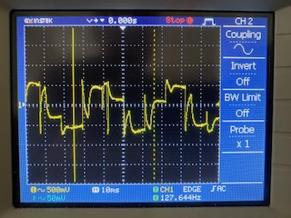
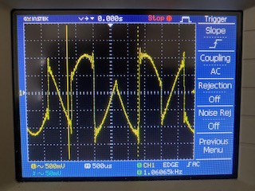
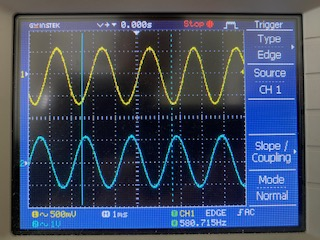
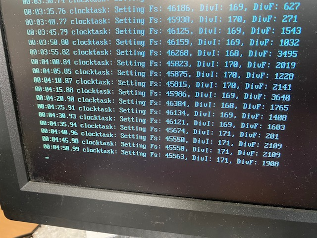
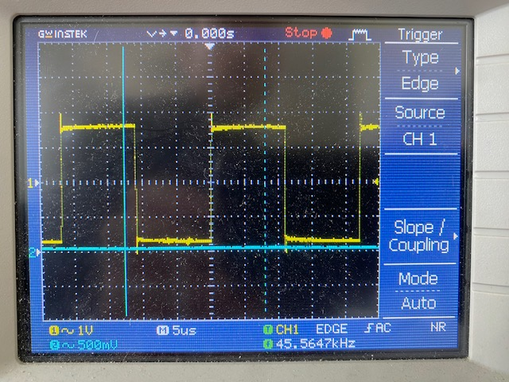
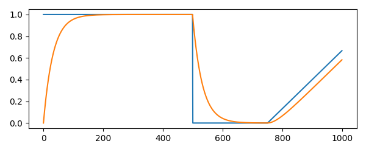

# -*- Mode: org -*-
# -*- coding: utf-8 -*-
#+STARTUP: overview indent inlineimages logdrawer hidestars
#+TITLE:       Research Journal
#+AUTHOR:      Thomas Rushton
#+LANGUAGE:    en
#+TAGS: noexport(n) MEETING(m) PRESENTATION(p) BLOG(b) TRAINING(T)
#+TAGS: INSPO(i) DIY(d) TEACHING(t) REPRES(R) REVIEW(v) GSoC(G)
#+TAGS: [ PROGRAMMING : R(r) PYTHON(P) JULIA(j) FAUST(f) CPP(c) ]
#+TAGS: [ TOOLS : EMACS(e) ORGMODE(o) GIT(g) ]
#+TAGS: [ AUDIO : SYNTHESIS(s) PHYSMOD(y) SPATIALAUDIO(S) NETWORKEDAUDIO(N) ]
#+TAGS: [ HARDWARE : RPI(R) TEENSY(e) ]
#+EXPORT_SELECT_TAGS: BLOG
#+OPTIONS:   H:3 num:0 toc:t \n:nil @:t ::t |:t ^:{} _:{} -:t f:t *:t <:t
#+OPTIONS:   TeX:t LaTeX:nil skip:nil d:nil todo:t pri:nil tags:not-in-toc html-style:nil
#+EXPORT_SELECT_TAGS: export
#+EXPORT_EXCLUDE_TAGS: noexport
#+COLUMNS: %25ITEM %TODO %3PRIORITY %TAGS
#+SEQ_TODO: TODO(t) STARTED(s!) WAITING(w@) APPT(a!) | DONE(d!) CANCELLED(x!) DEFERRED(f!)
#+SEQ_TODO: UNREAD(u) | READ(r) | REVIEWED(v)

# HTML Export styles/scripts for theme 'readtheorg'
#+HTML_HEAD: <link rel="stylesheet" type="text/css" href="http://www.pirilampo.org/styles/readtheorg/css/htmlize.css"/>
#+HTML_HEAD: <link rel="stylesheet" type="text/css" href="http://www.pirilampo.org/styles/readtheorg/css/readtheorg.css"/>
#+HTML_HEAD: 
#+HTML_HEAD: 
#+HTML_HEAD: 
#+HTML_HEAD: 

* 2018
** 2018-02 March
*** 2018-02-12 Monday
**** Demonstrating Emacs/Orgmode shortcuts
These informations were gathered and first demonstrated in my [[https://github.com/alegrand/RR_webinars/blob/master/1_replicable_article_laboratory_notebook/index.org][First
webinar on reproducible research: litterate programming]].
***** Emacs shortcuts
Here are a few convenient emacs shortcuts for those that have never
used emacs. In all of the emacs shortcuts, =C=Ctrl=, =M=Alt/Esc or Cmd with MacOs= and
=S=Shift=.  Note that you may want to use two hours to follow the emacs
tutorial (=C-h t=). In the configuration file CUA keys have been
activated and allow you to use classical copy/paste (=C-c/C-v=)
shortcuts. This can be changed from the Options menu.
  - =C-x C-c= exit
  - =C-x C-s= save buffer
  - =C-g= panic mode ;) type this whenever you want to exit an awful
    series of shortcuts
  - =C-Space= start selection marker although selection with shift and
    arrows should work as well
  - =C-l= reposition the screen
  - =C-_= (or =C-z= if CUA keys have been activated)
  - =C-s= search
  - =M-%= replace
  - =C-x C-h= get the list of emacs shortcuts
  - =C-c C-h= get the list of emacs shortcuts considering the mode you are
    currently using (e.g., C, Lisp, org, ...)
  - With the "/reproducible research/" emacs configuration, ~C-x g~ allows
    you to invoke [[https://magit.vc/][Magit]] (provided you installed it beforehand!) which
    is a nice git interface for Emacs.
  There are a bunch of cheatsheets also available out there (e.g.,
  [[http://www.shortcutworld.com/en/linux/Emacs_23.2.1.html][this one for emacs]] and [[http://orgmode.org/orgcard.txt][this one for org-mode]] or this [[http://sachachua.com/blog/wp-content/uploads/2013/05/How-to-Learn-Emacs-v2-Large.png][graphical one]]).
***** Org-mode
  Many emacs shortcuts start by =C-x=. Org-mode's shortcuts generaly
  start with =C-c=.
  - =Tab= fold/unfold
  - =C-c c= capture (finish capturing with =C-c C-c=, this is explained on
    the top of the buffer that just opened)
  - =C-c C-c= do something useful here (tag, execute, ...)
  - =C-c C-o= open link
  - =C-c C-t= switch todo
  - =C-c C-e= export
  - =M-Enter= new item/section
  - =C-c a= agenda (try the =L= option)
  - =C-c C-a= attach files
  - =C-c C-d= set a deadline (use =S-arrows= to navigate in the dates)
  - =A-arrows= move subtree (add shift for the whole subtree)
***** Org-mode Babel (for literate programming)
  - =<s + tab= template for source bloc. You can easily adapt it to get
    this:
    #+BEGIN_EXAMPLE
      #+begin_src shell
      ls
      #+end_src
    #+END_EXAMPLE
    Now if you =C-c C-c=, it will execute the block.
    #+BEGIN_EXAMPLE
  #+RESULTS:
  | #journal.org# |
  | journal.html  |
  | journal.org   |
  | journal.org~  |
    #+END_EXAMPLE
  
  - Source blocks have many options (formatting, arguments, names,
    sessions,...), which is why I have my own shortcuts =<b + tab= bash
    block (or =B= for sessions).
    #+BEGIN_EXAMPLE 
  #+begin_src shell :results output :exports both
  ls /tmp/*201*.pdf
  #+end_src

  #+RESULTS:
  : /tmp/2015_02_bordeaux_otl_tutorial.pdf
  : /tmp/2015-ASPLOS.pdf
  : /tmp/2015-Europar-Threadmap.pdf
  : /tmp/europar2016-1.pdf
  : /tmp/europar2016.pdf
  : /tmp/M2-PDES-planning-examens-janvier2016.pdf
    #+END_EXAMPLE
  - I have defined many such templates in my configuration. You can
    give a try to =<r=, =<R=, =<RR=, =<g=, =<p=, =<P=, =<m= ...
  - Some of these templates are not specific to babel: e.g., =<h=, =<l=,
    =<L=, =<c=, =<e=, ...
* 2024
** 2024-04 avril
*** 2024-04-08 lundi
**** Just a new org capture.

- note 1
- note 2...
  
Entered on [2024-04-08 lun. 15:14]
  
  [[file:~/org/journal.org]]

*** 2024-04-09 mardi
**** RR-MOOC: Working With Others                        :TRAINING:REPRES:
***** Not straightforward
***** Creating a print-ready document from a computational document requires a well-set-up environment and some work.
***** *How to convince colleagues to adopt a new system/set of tools?*
****** If they're keen, teach them, but be prepared to provide tech-support.
****** If they're positive, but unable, delegate: perhaps colleagues edit the text, but leave the code and figures to you.
****** If they're unwilling, keep two documents: one computational, one /classical/.
***** *How to share with others?*
****** R: RPubs... but AWS links are ephemeral.
****** Dropbox? Longevity and access are the issues there.
****** GitHub/GitLab/etc.: better, but what if the repo history is embarrassing/compromising in some way (e.g. unkind comments about reviewers), or there are ethical issues around data or copyright?
****** Companion website: RunMyCode, personal site...
****** Open archive: HAL (article), Figshare/Zenodo (code/figures)

Entered on [2024-04-09 mar. 11:06]
**** Why does this always end up with a link attached?           :ORGMODE:
Anyway, I just want to see what happens if I type some stuff without
making everything a list.

What about this?

And =this verbatim bit=?

Entered on [2024-04-09 mar. 14:17]
  
  [[file:~/org/journal.org::*Open archive: HAL (article), Figshare/Zenodo (code/figures)][Open archive: HAL (article), Figshare/Zenodo (code/figures)]]
**** Comparison of Tools                                 :TRAINING:REPRES:

I like OrgMode, but maybe it's not the only game in town.
It depends on the type of document you want to create:
***** For teaching material, Jupyter might be a better bet.
****** Easy to use & fully dynamic document.
***** Blog/journal/lab-notebook: OrgMode.
****** Chronological or semantic organisation; searchable by tags.
******* =C-c /= (=M-x org-sparse-tree=) to filter by (regex) tag, todos, etc.
***** Reproducible article: OrgMode!

Entered on [2024-04-09 mar. 14:51]
**** Answer: because of the capture template.                    :ORGMODE:
I can change that, and add more capture templates that target other
files.

Entered on [2024-04-09 mar. 16:10]
  
[[file:~/org/journal.org::*Why does this always end up with a link attached?][Why does this always end up with a link attached?]]
*** 2024-04-12 vendredi
**** What is a replicable data analysis?                          :REPRES:
In traditional data analysis we focus on the results, with a
methodological summary of how they were achieved.

In a replicable data analysis the methodological summary is replaced
by the whole code used for calculations performed.

Requires more effort, but:
***** easier to redo;
***** easier to modify;
***** easier to inspect and verify

Entered on [2024-04-12 ven. 17:16]
*** 2024-04-15 lundi
**** R plotting in org-babel is temperamental           :REPRES:R:ORGMODE:
Not sure why, but stuff like this just refuses to produce a file and
display it:
#+begin_example
#+begin_src R :file cars.png :results file graphics
plot(cars)
#+end_src
#+end_example
What's daft is I'm quite sure this exact syntax was working fine as
recently as last week.
Remove ~graphics~ and R opens and displays a figure (in a separate
window), but it isn't saved so obviously nothing appears in the .org
file.
Good job I'm not planning to use R, but doesn't entirely inspire
confidence.
Entered on [2024-04-15 lun. 11:08]
**** It turns out R /is/ saving plots...                  :REPRES:R:ORGMODE:
But it's not putting them in the same directory as the open .org file.
When the R process starts, it asks for a working directory; this
doesn't happen if exporting, e.g. =C-c C-e h o=, i.e. R just picks the
directory it fancies. Nice.

Entered on [2024-04-15 lun. 16:43]
  
  [[file:~/org/journal.org::*R plotting in org-babel is temperamental][R plotting in org-babel is temperamental]]
*** 2024-04-16 mardi
**** REVIEWED SMC24: (16) Artificial Intelligence and Home Music Listening: An Overview and Future Directions :ML:SMC:REVIEW:
***** Summary
The authors introduce a systematic review of literature on AI and the
home music listening experience, taking the entirely reasonable
opening stance that such a review is warranted by the increasing
volume of published research in this domain over the past decade.

The title chosen doesn't entirely reveal the authors' intent however;
rather than focusing on "Home Music Listening", their exploration of
the selected literature seems more concerned with assistive
technologies, e.g. vibrotactile feedback. Ultimately, the connection
to artificial intelligence is quite tenuous — it is not made clear how
AI features in research on assistive technologies, nor how these
technologies necessarily assist with "home listening" in particular.

One is left with the suspicion that the initial literature search,
using the keywords "HCI," "AI," and "music", employed those keywords
independently, rather than honing in on their intersection. The
resulting text is largely well-composed (albeit not quite of scholarly
tone at times), but its argumentation is unclear, meandering, and
repetitive.

***** Notes
- Use of "I" rather than "we" (Page 2, line 36)
- Repetition of "Convolutional Neural Networks" (3, 53-68)
- "We conducted a This resulted in..." (4, 8-9)
- Near-verbatim repetition of "seamless integration into users' daily
  lives" in successive paragraphs (6, 86-104)
- Use of "music enthusiasts," "showcasing," and "seamless integration"
  read rather like advertising copy.
***** Proofreading
 
Entered on [2024-04-16 mar. 11:20]
**** Presentation: Craig Webb             :PHYSMOD:PRESENTATION:
- /NEMUS/ project Numerical Restoration of Historical Music Instruments
  ERC-funded. PI: Michele Ducchesci (sp.)
- Specifically looking at the harpsichord
  Ancient examples; can't withstand the forces subjected to them if
  one were to string them and bring the strings up to tension.
- No recordings of these old instruments...
  Guesswork required to reproduce their sound
- Idea to produce replica soundboard(s) in collaboration with a
  luthier as part of the exploratory work.
- Pleviously: /NESS/ project, Edinburgh (another ERC project)
  PI: Stefan Bilbao
  "Next generation sound synthesis"
- Simulation of 4 timpani in a room
  Even with GPU, takes all night to produce a second of audio
  output...
  Interface between drum skins and surrounding air; transfer of energy
  at the interfaces between the media of propagation of energy.
  Finite difference approach; modal is another matter.
- What about stuff that can run in real-time? This leads to /Physical
  Audio/.
  + /Modus/: Modal synthesis; strings coupled to a plate; plucked
    excitation.
  + /Preparation/: FDTD; two strings & a rattling element.
  + /Derailer/: FDTD; bars, strings, springs
  + Plate and Spring reverbs
  + All run on a single CPU core
  + 10% CPU acceptable for reverbs; 20-30% for instruments
- GPUs not so suitable for real-time applications
  + Compute-to-memory-access ratio important; compute needs to be much
    higher than memory access, ideally.
  + Stéphane mentions [[https://www.gpu.audio/][GPU Audio]]...
- Expensive models being updated to use less heavyweight solvers,
  e.g. non-iterative alternatives to Newton-Raphson.
- Vector operations, if using manual intrinsics, have to be rewritten
  for each target architecture.
  
Entered on [2024-04-16 mar. 15:56]
*** 2024-04-17 mercredi
**** Interesting article on a DIY GPS receiver        :INSPO:DIY:HARDWARE:
[[https://axleos.com/building-a-gps-receiver-part-1-hearing-whispers/]]
Entered on [2024-04-17 mer. 10:28]
**** REVIEWED SMC24: (126) Real-time Phychoacoustic Frequency Masking Compensation for Audio Signals with Overlapping Spectra :SMC:REVIEW:
***** Summary
The authors of this paper describe a system for
psychoacoustically-informed frequency masking compensation,
implemented as a real-time VST plugin. The plugin was evaluated via a
small user study.

Though a rather concise account of their work and its background, the
authors include pertinent references to literature on psychoacoustics
and automatic mixing. Indeed, the novelty in the authors' proposed
solution lies in its basis in psychoacoustic research, something
seemingly lacking in much of the state of the art.

The decision not to expose the full parameter space of their algorithm
to the end user is a sensible one, and results in a user interface
with an air of approachability. More detail on the "empirical" basis
behind some of the hard-coding decisions would have been appreciated,
however.

The usefulness of the proposed algorithm cannot be demonstrated beyond
doubt with such a small sample-size, but the results for
intelligibility are a positive indication and suggest that the plugin
could stand up to a more demanding evaluation. Overall, despite the
brevity of the paper, this is nicely-executed work and could be of
interest to the community, so I cautiously recommend it for
acceptance.
***** Notes
- Shouldn't the plugin be called /TheUnmasker/?
- The abstract lacks detail. No description of the evaluation is
  given, for example.
  + I expect the authors mean to be more confident than to say that
    their plugin "is thought" to handle the intended use-case; "is
    intended," or "seeks" perhaps?
- Source code unavailable for either the Matlab prototype or the VST
  plugin. No Linux build is provided. No supplementary audio/video
  examples are offered.
- The caption for figure 4 gives far too little detail; ideally, if
  accepted, authors should expand on this.
- No reference is given for the Intervention Limiting Function
  described in section 3.2.
***** Proofreading
Some non-idiomatic usage, but mostly well-written.
+ Page 2, line 6-7: "...that uses a 32 bands fixed-frequencies..." ->
  "...that uses a 32-band, fixed-frequency..."
+ 2, 35: "...32 bands filterbank..." -> "...32-band filterbank..."
+ 2, 61: "...1024-points 50%-overlap..." -> "...1024-point,
  50%-overlap..."
+ 3, 3: Text refers to /atan/ function, but equation (3) uses $\tanh$.
+ 4, 35: ''reference'' -> ``reference''
+ 4, 36-39: The latter part of this sentence is bordering on
  nonsensical and would benefit from a gentle rewrite.
Entered on [2024-04-17 mer. 11:13]
**** REVIEWED SMC24: (70) Three-Dimensional VBAP and Ambisonics in Spat: Implementation and Perceptual Evaluation in a Concert Setting :SPATIALAUDIO:SMC:REVIEW:
***** Summary
The authors of this paper compare VBAP and Ambisonics in an
acoustically unoptimised space, playing multichannel classical
recordings, and recordings of John Chowning's /Phoné/, /Stria/, etc. (with
moving sources) to groups of expert and non-expert
listeners. Subjective analysis focuses on listeners' assessments of
selected sonic characteristics for the two spatialisation approaches;
a modest preference for VBAP is reported for "spatial clarity,"
whereas ambisonics fares better for "envelopment," though the authors
concede that these differences could be explained by the influence of
room acoustics.

Clearer results emerge in the form of /rating consistency/, with expert
listeners exhibiting greater consistency than their non-expert
counterparts, but this wasn't the focus of the authors'
research. Indeed, the argumentation on display isn't always entirely
coherent and the text loses sight of the stated purpose of the study
at hand.

Ultimately the results of this study do not appear to satisfy the
stated aim of "optimizing spatial audio workflows and enhancing
immersive auditory experiences". The reader is offered little by way
of indication of how the results might inform future spatial audio
research, for example in selecting the spatialisation algorithm most
appropriate to the source material or audience.

The work is a good fit for this year's theme, but for the above
reasons, plus an absence of bibliographical references for certain
important concepts, I cannot recommend this paper for acceptance.
***** Notes
- There's a troubling lack of references or footnotes for some
  seemingly key ideas and tools, e.g.:
  + no reference is given for the Spat system itself;
  + the immersion-related research from which the properties of
    'Presence' and 'Envelopment' are taken (section 2.4);
  + a link to the source for the VBAP Max/MSP patch;
  + the subjective evaluation studies on panning methods that don't
    give details of spatialisation (section 3);
  + the ITU-R BS.1284 guidelines (this is reference [6], but that is
    not made clear);
  + G*Power software.
- Bibliography entries [4] and [6] are incomplete; [6] is one of the
  paper's key references, so this is an issue.
  + Explanation is not given of the evaluation metrics from [6], which
    are integral to the analysis given in the paper.
- It could be more clearly explained that negative CMOS values stand
  in favour of VBAP with positive values in favour of Ambisonics.
- Chowning's compositions are described as "Contemporary" works,
  despite being over forty years old.
- The "classical" pieces are not described; what era? What style?
- The terms "LFE", "ACN", the various ambisonics decoding options, and
  "sweet spot" are not explained.
- Figures 4 and 5 do little to help the reader, particularly with such
  brief captions.
***** Proofreading
- Affiliation superscripts don't match institutions.

Entered on [2024-04-17 mer. 11:30]
**** READ SMC24: (130) Multiple Rendering Factors in Audio Augmented Reality: an Exploratory Study in an Indoor Environment :SPATIALAUDIO:SMC:REVIEW:
***** Summary
Authors present the evaluation, via a bespoke MUSHRA interface, of an
audio augmented reality system comprising a scattered delay network
reverb, customised HRTFs derived from still images, and headphone EQ
compensation. This is an ambitious project, comprised of numerous
components supported by theory, code (albeit not accessible to the
reader) and a substantial trawl of the scholarly literature.

The authors emphasise the purported user-friendliness of their
evaluation interface (though figure 2 does not appear to support this
claim). They concede, however, in their conclusion that the interface
provided poor control over experimental conditions and may have
influenced their results.

Figure 4 and its caption do a very unsatisfactory job of presenting
the results of the user study. At best we can conclude from the large
interquartile ranges for almost all conditions, that users had a very
hard time assessing the similarity of the virtual stimulus and the
reference. This in turn points to flaws in methodology; the presence
of too many variables, the ecological setting, and perhaps the
adaptive EQ of the headphones (over which the authors had no control).

Ultimately there is an ambiguity hanging over the purpose of this
paper. The title, abstract, and introduction suggest that it is an
evaluation of the AR auralisation framework: "The goal was to evaluate
the impact of acoustic personalisation... on an AAR scenario." The
beginning of section 4 states, however, that "The main purpose of the
exploratory test was to assess the test procedure and the
[MUSHRA]". Further, the reader is provided with either too little
information about facets of the project (e.g. game engine
implementation of the AAR framework) or left questioning their
integrity (the bespoke MUSHRA interface).

I submit an evaluation of reject, as, in the form submitted, this
paper is not suitable for publication.
***** Notes
- Why use AirPods if they have an unbypassable adaptive EQ?
- Notation of equation (1), and explanation in the paragraph that
  follows, appear inconsistent. E.g. $H^{-1}$ in the equation seems to
  have been represented as $H^-1$; $\mathbf{D}(f)$ from the explanatory
  paragraph does not appear in the equation.
- Experimental procedure not clearly-described. Did participants hear
  the reference sound without AirPods, then put them in/on and listen
  to the virtual stimulus?
***** Proofreading
- Acronyms should be expanded on first use, e.g. MUSHRA (Page 1, 54),
  CIPIC (1, 13).
  
Entered on [2024-04-17 mer. 17:33]
*** 2024-04-18 jeudi
**** REVIEWED SMC24: (37) Mobile Loundspeakers as an Alter Ego :REVIEW:SPATIALAUDIO:SMC:
***** Summary
The authors present an audio spatialisation system based on mobile
loudspeakers. Speakers are mounted to motorised platforms and can be
driven via remote-control around the listening environment. With a
focus on concert applications, a notation for positioning the mobile
speakers, in tandem with conventional musical notation, is briefly
described.

This is an interesting idea, and a refreshing antidote to more
commonly-encountered spatial audio research on sound field synthesis,
etc., plus the authors connect their work to a history of moving
physical sound sources in electroacoustic music. Further, the project
represents a significant engineering challenge, one which could be of
interest to the SMC community — though more detail on the technical
underpinnings of the project would have been appreciated here.

The thrust of the paper — the "alter ego" mentioned in the title and
abstract — is not developed in a convincing manner, however. The
visitor survey conducted did not ask audience members whether, for
example, they viewed the moving speakers as an embodiment of the
composer or performers; nor are the views of composer or performers of
/Heldendämmerung/ given with regard to the success of the proposed
system in this respect. The "interesting ... theatrical and
choreographic interplay" described in the abstract, and the notion of
the "mediating role" of the mobile speakers are not scrutinised in a
meaningful way.

Though a competently-written paper for the greater part, section 6
(Conclusion) descends into bullet points and appears unfinished. 6.2
in particular seems composed of incomplete fragments. For this and the
above reasons, I recommend this paper for rejection.

***** Notes/proofreading
- Page 1, Line 32: "Chapter 2" -> "Section 2"
- 2, 34-35: Mentions Stockhausen's fifth parameter without describing
  the other four.
- 4, 30: "...a number of vehicle driver..." -> "...a number of vehicle
  drivers..."
- Figure 10: "very good" doesn't work as an answer to the question
  "have you perceived variable sound spaces?"
  + The caption for this figure is incomplete.
- 6, 41-44: As stated above, this paragraph (s. 6.2) seems unfinished.
  
Entered on [2024-04-18 jeu. 16:10]

*** 2024-04-22 lundi
**** Software-based clock sync                              :HARDWARE:PTP:
Where do Teensy and RPi (circle) keep time?
+ Teensy: ~micros(void)~ in =delay.c= eteensy4/delay.c:76 Computes the
  number of microseconds since startup. Appears to use clock cycles
  (~ARM_DWT_CYCCNT~) as part of the computation.
    
+ Circle: ~CTimer::GetClockTicks(void)~ in =timer.cpp=
  circle/lib/timer.cpp:211 Reads directly from the ~ARM_SYSTIMER_CLO~
  MMIO address, which provides the number of ticks of a 1 MHz counter.

But how relevant are these measures of time? The specific clock we
want to alter is the audio clock, not the main system clock (which,
for Teensy at least, is fixed at 24 MHz), so maybe we need to measure
time as represented by the audio clock... I'm really not sure about
this.

Entered on [2024-04-22 lun. 13:46]
**** How to set up a decent literature review template?          :ORGMODE:

Currently reading /Design Considerations for Software Only
Implementations of the IEEE 1588 Precision Time Protocol/, but not
clear on how to set up a nice capture such as used by Arnaud's
ex-student, with =PROPERTIES:= at the top and a BibTeX entry at the
bottom. [[https://github.com/yantar92/org-capture-ref][org-capture-ref]] maybe?

Entered on [2024-04-22 lun. 14:15]
*** 2024-04-23 mardi
**** Thesis Defence: Razvan Paisa                           :PRESENTATION:
/The musical touch — Exploring vibrotactile augmentation of music for CI users/

(NB. the feed wasn't available for the first twenty-five minutes or so)

- Amplitude perception of vibrotactile stimuli (at the hand?) is
  highly personal.
- Collaborative design with CI users on vibrotactile furniture,
  elements etc. for augmented concerts.
- Music for CI users is/can be an exhausting experience; concert
  exposure limited to fifteen minutes, predicted. With vibrotactile
  stimuli, users were keen to listen for much longer (like, twice as
  long).

***** Melodic contour identification
- Ascending, descending, undulating and arching contours.
- MCI training score improved modestly with vibrotactile device?...
  
***** Conclusions
- Work is exploratory, perhaps appearing to lack rigour (the man's own
  words!).
- Highly 'ecological' research.
- Plans to continue with the current approach.

***** Discussion
- Don't be afraid of Bayesian Analysis. Hanna's talk from DAFx '23.

Entered on [2024-04-23 mar. 10:55]
**** Looking for a way to read audio clock ticks         :HARDWARE:TEENSY:
Reading the i.MX RT1060 manual, chapter 37-38, for some clues about
how audio — synchronous audio interface (SAI), etc. — works on the
Teensy.

Specifically, whether, like the CPU, which increments a register,
=ARM_DWT_CYCCNT=, with the number of clock cycles elapsed since startup,
there's a way to read the number of cycles of the SAI1 clock.

The plan is something like:
- Read SAI1 clock ticks;
- Convert from ticks (at ~11.28 MHz) to µs;
- Compare with incoming PTP timestamps (in µs?) from the server;
- Adjust the PLL as necessary to bring the SAI1 clock into line with
  the server;
  + That's /just/ a case of following the PTP spec — piece of cake;
- Then we see how close a sync can be achieved, and how well the sync
  can be encouraged to settle down;
- How much of a problem is it if there's, e.g. (best case?) sub-sample
  movement?
  + OK, I'm getting ahead of myself;
- Even if audio clocks are nicely aligned, what about the network?
  + How much buffering required?
  + How to instruct the I2S output to output buffer $n$ at timestamp
    $t$?

Entered on [2024-04-23 mar. 18:19]
*** 2024-04-24 mercredi
**** Meeting with Romain — PhD committee                         :MEETING:
- We need to spend money on equipment — soon — so we need to know what
  to buy.
- For the committee, talk about the state of the art, plan for the
  next six months (well, a year, I think).
- Maybe try an FPGA? Talk to Pierre about transferrable techniques
  re. clocks.
- Jens's book is too expensive. Buy a copy myself?
- Talk to Pierre about ergonomics lady at Inria.
  
Entered on [2024-04-24 mer. 10:23]
*** 2024-04-29 lundi
**** Setting the RPi audio clock with Circle                :HARDWARE:RPI:
Essentially this happens in =circle/lib/gipoclock.cpp= The constructor
to ~CSoundBaseDevice~ (=i2ssounddevice.cpp=) sets a member instance of
~CGPIOClock~ (l. 102):

#+begin_src cpp
m_Clock (GPIOClockPCM, GPIOClockSourcePLLD)
#+end_src

And a little later (l. 130) in the body of the constructor, having
calculated the appropriate clock divisors:

#+begin_src cpp
m_Clock.Start (nDivI, nDivF, nDivF > 0 ? 1 : 0);
#+end_src

Inside ~Start()~, two registers are written: ~nDivReg~ and
~nCtlReg~. Skipping some delays and stuff, here's the gist:

#+begin_src cpp
unsigned nCtlReg = ARM_CM_BASE + (m_Clock * 8);
unsigned nDivReg  = nCtlReg + 4;

write32 (nDivReg, ARM_CM_PASSWD | CLK_DIV_DIVI (nDivI) | CLK_DIV_DIVF (nDivF));
write32 (nCtlReg, ARM_CM_PASSWD | CLK_CTL_MASH (nMASH) | CLK_CTL_SRC (m_Source));
write32 (nCtlReg, read32 (nCtlReg) | ARM_CM_PASSWD | CLK_CTL_ENAB);
#+end_src

I should try setting some arbitrary clock speeds and check (with the
help of an oscilloscope), how accurately the audio clock is set, and
roughly how fine the resolution is.

What this doesn't tell me is whether it's possible to derive a
timestamp from this clock.

Entered on [2024-04-29 lun. 13:54]
*** 2024-04-30 mardi
**** Meeting with Pierre                                :MEETING:HARDWARE:
- Vivado configures clocks for the ARM and FPGA (Tanguy/Maxime added
  the latter?)
- Audio clock comes out to 256*48000; basically the same principle as
  Teensy.
- I should try to find equivalent clock config software for the Pi.
- Since Syfala just sets and forgets its clocks, there doesn't appear
  to be anything transferrable in terms of dynamic clock updates, or
  taking time(stamps) from a specific, PLL-dictated clock.

Entered on [2024-04-30 mar. 14:25]
**** Feels like I'm doing a bad job of note-taking.              :ORGMODE:
I should revisit the early notes from the MOOC, and that journal that
Arnaud shared with me.

Entered on [2024-04-30 mar. 17:00]
** 2024-05 mai
*** 2024-05-02 jeudi
**** RPi: Broadcom GPIO Clocks                              :HARDWARE:RPI:
From the [[https://datasheets.raspberrypi.com/bcm2835/bcm2835-peripherals.pdf][BCM2835 Peripherals]] manual (p. 105):

#+begin_quote
"[GPIOs] run from the peripherals clock sources and use clock
generators with noise-shaping MASH dividers... The fractional divider
operates by periodically dropping source clock pulses, therefore the
output frequency will periodically switch between:

\begin{equation*}
\frac{\text{sourceFrequency}}{\text{DIVI}} \quad \text{and} \quad
\frac{\text{sourceFrequency}}{\text{DIVI+1}}
\end{equation*}
#+end_quote

So essentially what this is saying is, when a fractional divider is
required, the GPIO clock in question will run at a *variable rate*,
with an *average frequency* close to the target. This doesn't appear
to bode well for deriving time from such a clock.

Entered on [2024-05-02 jeu. 10:54]
*** 2024-05-03 vendredi
**** RPi 3 model B+: clocks, GPIO pins                      :HARDWARE:RPI:
- GPIO pins are numbered — with HDMI port on the left, and ethernet at
  the bottom — as follows:

  | 1 | 2 |
  | 3 | 4 |
  | 5 | 6 |
  | 8 | 7 |
  |...|...|

- Pin 12 is the PCM clock, i.e. the one set by Circle's
  ~CI2SSoundBaseDevice~ constructor. This has a frequency of ~3.07 MHz
  (oscilloscope reads 3.07212 MHz), which is approximately 64x the
  target sampling rate.

- Speaking of which $F_s$ is on pin 35; oscilloscope reports
  48.0018-48.0019 kHz.

- I think GPCLK2 (PLLD, pin 31?), which is used to generate the PCM
  clock, is of too high a frequency (500 MHz) for the oscilloscope to
  measure it.

  + I do, however, see a weak clock signal on GPCLK0, pin 7 (~1.5
    MHz).
  
Resources
- [[https://pinout.xyz/][RPi GPIO pinout guide]]
- [[https://datasheets.raspberrypi.com/bcm2835/bcm2835-peripherals.pdf][Broadcom BCM2835 ARM Peripherals [pdf]​]]
  + [[https://elinux.org/BCM2835_datasheet_errata#p104_table][Relevant errata]]
- [[https://abyz.me.uk/rpi/pigpio/][pigpio]]
- [[https://github.com/arisena-com/rpi_src/tree/master][RPi I2S test app]]

Entered on [2024-05-03 ven. 11:46]
*** 2024-05-10 vendredi
**** Faust Package Manager                                    :FAUST:GSoC:
Meeting with Shehab
- Package managers: state of the art
  + NMP
  + Cargo
  + etc.
- Understand the theory: Yann to share papers
- How will the Faust package manager work?
  + Modular nature of the Faust language
- Agree on the technology to underpin the system
  + Produce a formal specification
- Shehab to prepare a presentation on SoTA and ideas for Faust
  + read about Faust's modularity
    * ~environment~ constructs, etc.
- Next meeting ** 2024-05-23 @ 14h

Entered on [2024-05-10 ven. 14:59]
**** Amati++                                             :JUCE:GSoC:FAUST:
First meeting with Tyler, Kamil, Stéphane and Grégoire.

- Tyler wants to use the [[https://github.com/sudara/pamplejuce][PampleJUCE]] template
- Stéphane suggests using the Faust/JUCE GUI builder
  + Also mentions a bunch of things, that have already been written,
    that could support the project
- Tyler asks, /what hasn't already been written?/
  + Editor improvements, says Grégoire
  + CLAP support, says Stéphane
- External editor support? Sooner rather than later?
  + But why? Wouldn't it be nice for it to be self-contained like the
    web IDE?
  + Kamil says: yes, but as projects grow, the ability to edit in a
    /real/ IDE, with keybindings etc. is desirable
  + Grégoire asks about Language Server Protocol support...
- Kamil suggests a feature-branch style approach to development and
  code review
- More straightforward to copy code from Amati to PampleJUCE template
  than to fork Amati
  + Kamil makes the case for the convenience of PampleJUCE: GitHub
    actions, tests, etc.
- Tyler to set up PampleJUCE template, copy from original Amati repo
  + First task is just to get O.G. Amati running under the new template
  + Credit Grégoire in the readme

Next meeting ** 2024-05-24 18h CEST

Entered on [2024-05-10 ven. 18:52]
*** 2024-05-14 mardi
**** CITI PhD Day 2024                                      :PRESENTATION:
***** Orégane Desrentes: Numerical Error in Floating Point Arithmetic: What You Should Look Out For
- Floating point numbers are chaos
- Subnormals are scary --- their inclusion in a computation can lead
  to very significant arithmetic errors.
- Overflow and underflow problems
***** Thomas Lebron: Exploring the Impact on Privacy of Avatar Sythetic Data Solution
- Anonymisation via synthetic data
- Not just a case of /adding one/ to every data-point...
- Trade-off of data quality vs privacy
- Synthetic Data as an alternative to /Differential Privacy/?
  + Why did we skip over this part so quickly?
- Variational autoencoder: two neural networks working in combination
  + Encoder and Decoder
  + Classic diagram of a funnel in, and funnel out, like so: |>-<|
- GANs\dots
- *Avatar Method*: Project data in a smaller multimensional space,
  identify k-nearest neighbours, generate 'avatar' in this space,
  /project back/ to original space.
  + I wonder how we assess how /realistic/ these avatars are.
- Data Privacy Analysis
  + Anonymeter, vs. attribute inference attack
- Plenty of potential attacks on the avatar method (like any other
  privacy scheme I guess), so need to tread carefully.
***** Pierre Marza: Task-conditioned Adaptation of Visual Features in Multi-task Policy Learning
- "Can we have a general vision model for robotics?"
- Pre-training a vision model on diverse visual data with /masked autoencoder/
***** Florian Rascoussier: Introduction to Routing Problem Diversity
- Travelling Salesman Problem, Seven Bridges of Königsberg
- Exact methods (branch-and-bound), heuristics (genetic algos),
  metaheuristics (simulated annealing), hybrids (genentic + local
  search)
- Many, many, /many/ variations on routing problems; hard to know what
  to tackle
- How to define a routing problem...
  + Constraints
  + Objective functions: decide what needs to be optimised in the RP
  + Decision variables: variables adjusted to optimise the objective
    function
  + /Meta-attributes/: attributes that change other attributes,
    e.g. time-dependent decisions
  + Resolution method: computational techniques used to solve the RP
- /"Object-oriented-based RP definition"/ --- expand on this?
- Objective functions: there are many, and papers aren't always clear
  on what they've used..? Weird.

Florian's slides were very nice; good typography, inverted
text/background contrast for section-indicating slides.
***** Alix Jeannerot: Optimization of Framed Slotted ALOHA Under Uncertainty
- Random access (RA) protocols: devices have _same_ a priori
  probability of being active and are independent of each other.
- Sensor networks in industry
  + /"Industry 4.0"/ is a new term for me, but I think I can glimpse
    its meaning; interesting.
- Frame model: devices choose time slots on which to transmit (all
  have to know the time)
- Frame Slotted ALOHA: one transmission per frame; no collisions
- IoT networks are not homogeneous
- Transmission slots chosen by probability distribution
- Ah, we channel likelihood of collisions toward devices that are
  active less of the time, and keep activation matrix slot dedicated
  to high-activity devices.
- Gradient /ascent/ to find stationary point (not maximum as such...)
  + What happens as device activity changes?

Entered on [2024-05-14 mar. 14:36]
*** 2024-05-15 mercredi
**** Séminaire Emeraude: Maxime Popoff                      :PRESENTATION:

Contributions
- Optimized Faust2FPGA compiler: /SyFaLa/
- Analysis of characteristics of an audio DPS + optimized FPGA
  implementation
- Methodolgy for writing C++ audio DSP for HLS
- ...

Faust \rightarrow SyFaLa \rightarrow FPGA

FPGA is configurable hardware, *configured* (programmed) using a
hardware description language (HDL).

- Parallelisation
- Pipelining to maximise throughput with same resource usage
- Low latency with high sampling rate
- Lots of GPIOs, so lots of audio input/output (hard to program)

HLS Methodologies
- Many parameters to take into account
- How to handle loops becomes an enormous conversation
  + Fully sequential, fully unrolled, or some combination of
    sequential and unrolled... respecting the limits of what can be
    done in one cycle.
  + Can't access 10 elements of a loop in one cycle for example...
- Ah, loops are the only way to control pipeline/parallelisation.

High channel counts
- TDM: Time Division Multiplexing
- Standard I^{2}S uses 4 pins: BCLK, WS, SD_TX, SD_RX
  + If many codecs are used with duplicate I^{2}S tranceiver, they will
    share clock and WS

SyFaLa supports four audio codecs at present. 11 \micro{}s latency with
Analog Devices ADAU1787.

Entered on [2024-05-15 mer. 15:08]
**** Sèminaire Emeraude: Orégane Desrentes                  :PRESENTATION:

This is about numerical precsion in floating point matrix
multiplications (I think). It's a bit too clever for me.

- There's an FP8 format, for machine learning
- The only agreed thing is that it is an 8-bit format
- Beyond that, all bets are off
- One implementation (E5M2) is cut-FP16
- Another (E4M3) is /exotic/: no =inf= or =nan=
- Should it be done? 🤷 Easy to do in hardware, but "hard to organise"

Entered on [2024-05-15 mer. 17:08]
*** 2024-05-16 jeudi
**** Séminaire Emeraude: Bastien Barbe                      :PRESENTATION:

- We want to compute the activations of a neurnal network
- Inference: weights and biases are constants (post-training)
- Linear layers can be computed with /shift-and-add/ graphs during
  inference
  + costly multiplications replaced with additions
  + E.g. 43X = (1X << 5) + 11X... integer linear programming,
    composition of shifts and additions, as the name suggests...
- We can combine graphs to generate multiple results, reusing
  operations (I suppose this is going to be useful on FPGAs)

- But we can't compute every combination with one add per layer, for
  example; so this is a resource battle --- how many adds/shifts per
  layer do we need to compute the weights/biases that we want?

- What if we want to calculate another layer/dimension, i.e. change
  the weights?
- PhD subject: design a /reconfigurable accelerator/, more efficient
  than an FPGA, more configurable than an ASIC

Entered on [2024-05-16 jeu. 10:26]
**** Séminaire Emeraude: Romain Michon                      :PRESENTATION:

- PLASMA project is ongoing
- Associate team with CCRMA
- France/Stanford program; funding; apply for next year for me to
  spend a couple of months at CCRMA; work with Nando
- Jonas Höpner working on high-performance, low-SNR sigma-delta DAC
  directly on FPGA for integration with SyFaLa.
  + High sampling rate affords limited additional hardware to achieve
    ideal filter
- Frugal spatial audio project --- multichannel spatial audio on FPGAs
  + WFS demonstrated; ambisonics to follow --- Rémi working on the
    physical structure of this
  + Jurek's work; audio over ethernet to FPGA
- Auralisation is a target implementation. Immersive virtual acoustics
  experiences using spatial audio techniques.
  + Auralisation calls for large number of efficient convolutions
  + Rémi also working on efficient convolutions on FPGA
  + Chauvet cave project; acoustical model of the environment for
    immersive reconstruction
- Recent funding applications were unsuccessful; ERC, PRCI :'(
- Next year, organising JIMs and LAC during last week of June 2025.
  + Establish who's doing what; involvement of GRAME, for example

Entered on [2024-05-16 jeu. 11:22]
*** 2024-05-17 vendredi
**** Séminaire Emeraude: Tanguy Risset: Mid/Long-term Research Projects :EMERAUDE:PRESENTATION:

Projects
- Holigrail: Florent 900k€, Bastient, Pierre, Romain
- FAST: ends mid-2025 6k€
- PLASMA: with CCRMA, ends 2024
- Bosch: 5k€/year
- Four ongoing PhDs
  
Projects we'd like to work on
- AI and embedded sound systems
  + GRAME, CIFRE grant, Benjamin to work on this
- Arithmetic & Faust/SyFaLa
  + Fluent interface between Faust & fixed-point, between SyFaLa and
    Flopoco
- Start-up project with Maxime
  + Use SyFaLa in a startup. Is this possible?
- Spatial audio with SyFaLa, Faust, and /Centrale/
- Active acoustic control
- /Faust Consortium/
- /OnDemand/ in Faust
  + New primitive that will take an expression and add a new input
    which is a clock signal, so we can control when the computation
    will take place.
  + Permit downsampling; enable things that we can't do efficiently
    at the moment, e.g. FFT.

More planned projects
- Collab with Ircam
- Cifre grant with NanoXplore, French FPGA provider for satellites

High-Risk High-Reward opportunities...
- Syfala, HLS and compilation; investigate more?
  + Other embedded platforms?
- AI and sound (/music/?) synthesis

Future
- No desire to split the team (dark/light side)
- Inria evaluation of theme 2026 "Architecture, languages and compilation"
- Need a permanent engineer
- HRDs for two undisclosed members...
- New paths
  + Compilation of audio?
  + Hardware for democratised spatial audio?
  + Frugal AI for embedded applications?
  + ...

Entered on [2024-05-17 ven. 10:54]
*** 2024-05-21 mardi
**** FaustNet --- DDSP                                        :GSoC:FAUST:
- Goal: make all Faust programs differentiable
- Tried at the signal stage of the compiler; limited success
- Project rebooted in the Faust language itself
- Advik to:
  + update his fork of =faust-ddsp=
  + read about Faust architectures
  + understand Faust's pattern matching feature
  + look for algorithms in the libraries for which to create
    differentiable counterparts
  + complete the set of differentiable primitives by filling the gaps
    needed to complete the implementations in the previous item
- Eventually:
  + create an architecture file for the learning phase?
  + real-time timbre transfer would be a cool implementation.

Next meeting ** 2024-05-28 @ 16h
  
Entered on [2024-05-21 mar. 15:23]
*** 2024-05-22 mercredi
**** Faust in Cables.gl                                       :GSoC:FAUST:
Participants: Stéphane, Tobias, Fay, Tommy

Tobias's introduction: musician, electroacoustic composer, experienced
with Cables.gl, as well as Max/MSP, Pd; Acedemy of Media Arts,
Cologne; privy to the Faust in cables demo created by Kirell Benzi.

Fay: creative coder -- shader art (inc. for NFTs), Clojure, Rust,
functional programming, full-stack development; modular synths.

Standalone Cables.gl in the works, says Tobias.

Tobias to create Faust Team in Cables.

Next meeting ** 2024-05-28 @ 17h

Entered on [2024-05-22 mer. 11:12]
**** REVIEWED Enhancement of cardiac and respiratory sounds for cellphone reproduction by means of digital sound processing methods :PAUC:REVIEW:
:PROPERTIES:
:AUTHORS:  Maria Belen Echenique, Eduardo J. Godoy, Rodrigo F. Càdiz, Marcelo E. Andia
:END:

Second revision of this paper. Previous notes in
~/Documents/reviews/pauc23

***** Summary
(Taken from my notes on the first draft)

In this submission, the authors make a case for smartphone-based
tele-auscultation of cardiac and respiratory sounds, and identify that
the use of smartphones could improve access to healthcare for
remotely-situated populations, while potentially easing the burden on
healthcare professionals for routine patient examinations. They
observe that sounds indicative of pathology are predominately
low-frequency in nature and suggest pitch-shifting recordings to bring
these sounds into a frequency range suitable for reproduction on
smartphone speakers, while maintaining clinical information.

This is an interesting idea, and certainly assessing whether
smartphones, equipped as they are with an array of sensors including
and in addition to microphones, can be used as diagnostic devices is
well worth exploring. So too is an investigation of the extent to
which clinical information is preserved when auscultation recordings
are processed, and a scheme for optimising these recordings for
diagnostic purposes would be of great value.

***** General notes
This is another step in the right direction, though a couple of the
changes made for this revision introduce new problems, which I detail
below.

One critical piece of missing information at this point concerns the
participants who contributed to the proprietary database. All we know
is that they provided informed consent; please tell us how many
participants there were, and provide some demographic information.

Another thing I feel the reader could benefit from is a clear sense of
to what extent the pitch of the recorded samples was altered. Perhaps
a figure containing representitave example pre- and post-processing
spectrograms.

I would urge greater caution in describing the strength of the
results. For traditional auscultation, reference [25] presents a
specificity of 89%; the 70-80% demonstrated here describes
preservation of clinical information, /not specificity/. Comparisons
such as "...similar to the values reported in the literature"
(page 11) are, as a result, potentially misleading.

***** Detailed observations
- Abstract, line 37: "against originals" \rightarrow "against original
  recordings"
  
(Page, column, line)
- 2, 2, 5: "...an estimated 7 billion users worldwide". The reference
  to the number of devices that I found in the cited source was "El
  número de dispositivos móviles a nivel global ya alcanzó los 7,9 mil
  millones, más que personas hay en la Tierra."  I.e. that's the
  number of devices in existence, not the number of users.
- 2, 2, 27/28: "...coughs, allergies, and sneezes". The cited source
  is concerned with the sensing of coughs, not sneezes, and /one/
  participant exhibited a cough caused by an allergy --- the study
  does not aim to detect allergies per se.
- 3, 1, 10: Section 1 is very long; the paragraph beginning "Modern
  auscultation involves using..." has the feel of a new subsection;
  consider adding a new heading here.
- 3, 1, 42/43: As above; the text shifts to focus on ways in which
  sound can be described, which in turn suggests a new subsection.
- 3, 1, 42/43: "Sound is intricately defined by three primary physical
  parameters". The cited source actually describes five parameters in
  total, adding "harmony", and "dissonance" (which would perhaps
  better bundled under /degree of harmonicity/). It would be
  preferable to say "Sound /can be/ intricately defined...".
- 3, 2, 6-9: "pitch can be used" appears twice in rapid
  succession. Also, it is not made clear how pitch can be used as a
  timbral identifier; perhaps this refers to the way the authors of
  reference [28] use "pitch" to describe /unpitched/ sounds like
  rhonchus, which have a low "dominant frequency" (or dominant
  /formant region/ perhaps), but resemble snoring (i.e. they're
  inharmonic).
- 3, 2, 48-50: A frequency response may /exhibit/ attenuation, but it
  doesn't /do/ the attenuation itself. It might be preferable to
  emphasise, as stated in [31], that "[phone speaker] playback was
  centered around the human vocal range" --- though [31] also states
  that this has changed since the late 2010s (perhaps moreso for
  high-end models).
- 4, 1, 24-26: As I noted for the previous revision, pitch shifting
  algorithms can shift down as well as up, so prefer something like
  "These algorithms can [allow/facilitate/etc.] pitch changes across a
  wide frequency range without..."
- Fig. 3: I may be wrong about what is deemed the anterior and
  posterior projections of the lungs, but the right panel shows what
  looks like the back (posterior) of the torso and the left panel the
  front (anterior).
- 7, 2, 2-5: The target readership does not need an explanation of the
  Fast Fourier Transform.
- Table 1, Table 2: Please indicate, in their respective captions,
  which database(s) each table refers to.
- Table 5: "Murmurs represent abnormal ones" --- Not all of the
  pathologies are murmurs. Why not use "Normal"/"Pathological"
  instead?
- 10, 1, 40: "they did hold clinical information to the ears of
  physicians" --- Is this strictly what you mean? Presumably 100% of
  the processed sounds /held/ clinical information, but 73.7% were
  rated as /maintaining/ the clinical information represented by their
  unprocessed counterparts. This sentence could be ended after the
  word "positively".
- 11, 2, 48/49: remove "and perception" (headphones don't perceive).
  
***** Proofreading
The writing is much improved over the initial submission; most of my
comments refer to relatively minor matters. Some of the following may
come across as nitpicking on my part, but my aim is to suggest more
comfortable wording where possible.

- 3, 2, 53...: "there are several ways to improve these sounds to
  allow them to be played on a smartphone" \rightarrow "there are ways to
  optimise these sounds for reproduction on a smartphone"
- 4, 1, 2/3: "a method that allows for the change in the pitch" \rightarrow "a
  technique that permits the alteration of the pitch"
- 6, 2, 45: "This is done" \rightarrow "This was done"
- 7, 1, 8-10: There is no need to supply mathematical notation for
  maximum attack and release times (e.g. T_{A_{max}}).
- 7, 1, 41-42: "the recordings" \rightarrow "recordings" or "audio recordings"
  (you're referring to what the algorithm is designed to do in
  general).
- 7, 1, 42: "maintaining a subjective quality" \rightarrow "maintaining their
  subjective quality"
- 7, 2, 31-32: "SoundTouch is an audio processing library open source"
  \rightarrow "SoundTouch is an open source audio processing library"
- 7, 2, 34-35: "independent" \rightarrow "independently"
- Table 1: "Tracheal sound" \rightarrow "Tracheal breath sound"
- 10, 1, 40: "e.g." \rightarrow "i.e." (as stated above, however, this sentence
  could be endede after "positively").
- 11, 1, 51-53 + 11, 2, 1-6: This sentence is very long, and difficult
  to follow. Try adding a comma after "for them" and "pathological
  lung sounds".
- 12, 1, 38: "...to compare, in future studies, the diagnostic..."
- References: these look good for the most part; [36] features some
  errant quotation marks, e.g. /Shelvock"/ and /"2012"/.

Entered on [2024-05-22 mer. 11:19]
*** 2024-05-23 jeudi
**** Investigating time, DMA, and GPIO in Circle            :HARDWARE:RPI:
- ~CI2SSoundBaseDevice~ is supported by underlying TX and RX
  ~CDMASoundBuffers~ instances
  + These are in turn supported by the interrupt system, specifically
    by its ~ConnectIRQ~ method
  + So this doesn't rely on the lone FIQ handler...
- I want to look into whether I can use ~CGPIOPin~ or ~CGPIOPinFIQ~,
  in combination with the ~CGPIOManager~, to trigger an interrupt on
  each (rising) edge of the I^{2}S clock, and use that as a timer...
  + ...without that interfering with any other functionality that's
    reliant on that clock.

Circle samples to run/investigate:
- 01-gpiosimple
- 04-timer
- 11-gipoclock
  + Features a function, implemented in assembly, that returns the
    run time in \micro{}s
- 18-ntptime
- 30-gpiofiq
- 40-irqlatecency
  + Features use of buffered screen output

Then I should contact Rene Stange.

Entered on [2024-05-23 jeu. 11:05]
*** 2024-05-27 lundi
**** Comité de Suivi Individuel                                  :MEETING:
First year thesis follow-up.

Present:
 - Leonardo Cardoso (MARACAS)
 - Jens Ahrens (Chalmers, Sweden, remote)
 - Romain Michon
 - Tanguy Risset

Format:
- 20 min presentation
- 20 min questions with full panel
- 10 min with candidate and external panel members
- 10 min with external and internal panel members

Presentation went reasonably well; "accessible," said Jens. As Leo
later remarked, I should've made better reference to the state of the
art. Leaving things light on this front was a calculated decision on
my part, albeit based on the fact that I didn't have a good hold on
Belloch et al. and Devonport & Foss during my talk at the Emeraude
seminar.

The weakest part of my contribution was when Jens asked about
perceptual evaluation and I couldn't think of much beyond further
assessment of subjects' ability to localise virtual sound sources. He
recommended I read Hagen Wierstorf's 2014 PhD thesis /"Perceptual
assessment of sound field synthesis"/, and added that localisability
alone doesn't give the full picture.

Jens also mentioned the /Sphere/ in Las Vegas, and the 167,000-speaker
(!) WFS/beam-forming system created by [[https://holoplot.com/][Holoplot]]. He also suggested I
secure access, at some point, to a centralised system, tweaked
to simulate jitter, against which to compare my distributed system.

Leo suggested meeting with Cyrille Morin (MARACAS) to discuss clock
conditioning/sharing; he also mentioned Jean-Michel Friedt, who Tanguy
later emailed about a meeting (set for 11/06 @ 10h). He offered the
opinion that in terms of the time I have, I'm far from badly placed in
terms of progress, but that I should get my doctoral training out of
the way asap!

*Think about types of (perceptual) evaluation*

*Remember the "academic component"*
Keep on top of the literature hunt, and SoTA. Come up for air every
once in a while and /read/.

Theses that I should read:
- Hagen Wierstorf
- Marije Baalman
- Edwin Verheijen
- Peter Vogel

Entered on [2024-05-27 lun. 16:45]
*** 2024-05-28 mardi
**** JackTrip client issues              :NETWORKEDAUDIO:AUDIO:RPI:TEENSY:
Both of the following are broken:
- The Circle-based JackTrip client
- The Teensy-based JackTrip client

I'm getting garbage at the client side. Different kinds of garbage!
Sending a sine wave (441 Hz, I guess... I'm tricking JackTrip into
thinking that Teensy is running at 48 kHz), I get the following for
Teensy:

And this for Circle:

Circle output looks a bit more sane. Since I thought I hadn't touched
the Circle-based client since some time in December, and I probably
haven't touched =jacktrip-teensy= since early 2023, this is most
likely either due to:

- Some kind of change in how JackTrip operates
  + I think previously I was running v1.9 [correction: that was the
    version of JACK; I must've been running something like JackTrip
    v1.6]
- Some difference in how I'm running JackTrip, and audio in general
  + I'm using Pipewire now, for instance, and at 48 kHz, which I
    wasn't previously

Nonetheless, the latest version of JackTrip (2.3.0) behaves pretty
badly, crashing whenever a client disconnects:

#+begin_example
Fatal glibc error: malloc.c:2599 (sysmalloc): assertion failed:
    (old_top == initial_top (av) && old_size == 0) ||
    ((unsigned long) (old_size) >= MINSIZE &&
        prev_inuse (old_top) &&
        ((unsigned long) old_end & (pagesize - 1)) == 0)
#+end_example

But this might be because I'm running the cmake build that I made
locally instead of whatever's available via =pacman=. I actually can't
remember; need to take better notes.

***** Update
Uninstalling my home-rolled JackTrip and installing the =pacman=
version instead (v2.2.5-1) yields precisely the same results.

***** Next step
Send a ramp; use wireshark to isolate the problem to either JackTrip
or the clients.

Entered on [2024-05-28 mar. 20:18]

*** 2024-05-29 mercredi
**** JackTrip/Pipewire weirdness               :LINUXAUDIO:NETWORKEDAUDIO:
My JackTrip clients may not be broken after all.

Although reporting the desired buffer size, etc...

#+begin_example
---------------------------------------------------------
The Sampling Rate is: 44100
---------------------------------------------------------
The Audio Buffer Size is: 32 samples
                      or: 128 bytes
---------------------------------------------------------
The Number of Channels is: 2
---------------------------------------------------------
#+end_example

It looks like JackTrip is only sending a packet once every 1.1 ms or
so.

This is borne out by the stats reported by Teensy:

#+begin_example
        |   Total   |   Last Timestamp    | Last SeqNum | TS delta min/mean/max     | SN delta min/mean/max
receive |     53846 | 1716969888129614    |       53845 | 10982/11610.3750/12170 µs | 1/1.0000/1
   send |    861511 | 1716969888066353    |        9533 | 670/725.3398/782 µs       | 1/1.0000/1
  delta |   -807665 |            63261 µs |      -21224
  ratio | 0.0625018
#+end_example

That send/receive ratio of ~0.0625, i.e. 1/16, the mean timestamp
delta (11.6 ms), and the fact that sequence numbers are consecutive,
are indicative of JackTrip operating as if the buffer size is 512
samples.

Is this a problem with the interaction between Pipewire and JackTrip?

***** Let's try to reinstall JACK.

This might be as simple as:

#+begin_src shell :noeval
sudo pacman -Syu jack2
#+end_src

#+begin_example
...
looking for conflicting packages...
:: jack2-1.9.22-1 and pipewire-jack-1:1.0.5-1 are in conflict (jack). Remove pipewire-jack? [y/N] y
...
:: Processing package changes...
(1/1) removing pipewire-jack                                    [###################################] 100%
(1/1) installing jack2                                          [###################################] 100%
Optional dependencies for jack2
    a2jmidid: for ALSA MIDI to JACK MIDI bridging [installed]
    libffado: for firewire support using FFADO
    jack-example-tools: for official JACK example-clients and tools
    jack2-dbus: for dbus integration
    jack2-docs: for developer documentation
    realtime-privileges: for realtime privileges
...
#+end_example

And indeed it is (1: Teensy; 2: Circle):

***** Let's switch back to Pipewire

I have a feeling that the buffer size for =pipewire-jack= is
configured separately from the =clock.quantum= setting accessed via
=pw-metadata=.

#+begin_src shell :noeval
sudo pacman -Syu pipewire-jack
#+end_src

Copying =/usr/share/pipewire/jack.conf= to
=~/.config/pipewire/jack.conf=, and setting =jack.properties= to the
following, both clients work with pipewire-jack:

#+begin_example
jack.properties = {
     node.latency       = 32/48000
     node.rate          = 1/48000
     node.quantum       = 32/48000
     ...
#+end_example

NB. With this pw-jack config applied, JackTrip no longer crashes.

NB. 32 frames is a bit too tight for my work machine (Dell
Precision 5570).

Pipewire-JACK documentation: [[https://gitlab.freedesktop.org/pipewire/pipewire/-/wikis/Config-JACK][here]]

Entered on [2024-05-29 mer. 09:56]

*** 2024-05-30 jeudi
**** RPi clock adjustments                                  :HARDWARE:RPI:
I have verified that the Pi's I^{2}S PCM clock can be adjusted
on-the-fly.

I did so in Circle by inheriting from ~CTask~ and copying the clock
setup from the ~CI2SSoundBaseDevice~ constructor into the ~Run~
method, with a few modifications:

#+begin_src c++ :noeval
class CClockTask : public CTask
{
public:
    CClockTask() : m_Clock(GPIOClockPCM, GPIOClockSourcePLLD) {}

    ~CClockTask(void) override = default;

    void Run(void) override {
        unsigned nSampleRate{SAMPLE_RATE};
        unsigned nClockFreq =
                CMachineInfo::Get ()->GetGPIOClockSourceRate (GPIOClockSourcePLLD); // 500 MHz
        CBcmRandomNumberGenerator rand;

        while (true)
        {
            CScheduler::Get()->MsSleep(5000);

            nSampleRate += (rand.GetNumber() % 1000 - 500);

            if (8000 <= nSampleRate && nSampleRate <= 192000) {
	        return;
	    }

            unsigned nDivI = nClockFreq / (32*2) / nSampleRate; // 162(.76...)
            unsigned nTemp = nClockFreq / (32*2) % nSampleRate; // 36500
            unsigned nDivF = (nTemp * 4096 + nSampleRate/2) / nSampleRate; // 3115(.166...)
            assert (nDivF <= 4096);
            if (nDivF > 4095)
            {
                nDivI++;
                nDivF = 0;
            }

            CLogger::Get()->Write("clocktask", LogDebug, "Setting Fs: %u, DivI: %u, DivF: %u",
                                  nSampleRate, nDivI, nDivF);

	    // max,avg,min: src/DIVI, src/(DIVI + DIFF / 4096), src/(DIVI + 1)
            m_Clock.Start (nDivI, nDivF, nDivF > 0 ? 1 : 0);
        }
    }

private:
    CGPIOClock m_Clock;
};
#+end_src

I ran this task by calling ~m_pClockTask = new CClockTask();~ in
~CJackTripClient::Initialize~.

So, jumps of up to at least \pm500 Hz are possible. The resolution with
which modifications can be effected is not clear; all adjustments made
by the code above are by integer values; further experimentation
required.

NB. Oscilloscope reported 1-2 Hz higher than the target specified by
the program.

Entered on [2024-05-30 jeu. 11:32]
  
  [[file:~/org/journal.org::*RPi 3 model B+: clocks, GPIO pins][RPi 3 model B+: clocks, GPIO pins]]
**** Circle/RPi system clock, realtime                      :HARDWARE:RPI:
- It [[https://github.com/rsta2/circle/blob/master/doc/realtime.txt][turns out]] Circle is running the processor of the Pi (v3) at 600
  MHz
- That's the same speed as Teensy runs its NXP CPU
  + The Pi obviously has a lot more memory
  + 1 GB on the 3 B+

From the documentation for the ~CCPUThrottle~ class (which can be
employed to run the CPU faster):

#+begin_src c++ :noeval
/// \warning CCPUThrottle cannot be used together with code doing I2C or SPI transfers.\n
///	     Because clock rate changes to the CPU clock may also effect the CORE clock,\n
///	     this could result in a changing transfer speed.
#+end_src

Perhaps what that really means is if one changes the CPU clock, one
just has to make commensurate adjustments to the CORE clock. Might not
be a problem if we never use I2C.

Entered on [2024-05-30 jeu. 13:44]
**** Michele Pagani: Applying Programming Language Theory to Automatic Differentiation :DDSP:PRESENTATION:
 - Gives example of a simple function of arithmetic operations, with
   gradient computed by ~jax.grad()~

 Questions/assumptions:
 - Is the transformation correct?
 - What assumptions have been made?
 - What primitives are supported? Recursion? Branching conditions?
   etc.

Desirable:

#+begin_example
grad(let y = G in H) -> let y' = grad(G) in grad(H)
#+end_example

\[
\partial(h \circ g)(x) = \partial{}h(g(x)) \cdot \partial{}g(x)
\]

- Forward & backward propagation modes
\[
J_{\overrightarrow{x}}(k \circ h \circ g) = J_{h(g(\overrightarrow{x}))}(k) \cdot
J_{g(\overrightarrow{x})}(h) \cdot J_{\overrightarrow{x}}(g)
\]
- First and second terms are backward mode; second and third are
  forward mode
- Same result, different performance
  + Backward better when inputs outnumber outputs
  + Vice versa for forward mode
    * Backward probably better for audio problems then
    * Michele suggested that it doesn't matter on the order of
      magnitude of parameters:outputs that we're dealing with in
      Faust, audo problems in general
    * I think running ineffecient forward mode is ultimately not
      sufficiently /frugal/, nor as computationally elegant as
      Yann/Stéphane would likely prefer

***** Some resources on reverse-mode AD:

#+begin_src bibtex :noeval
@article{wengert_simple_1964,
	title = {A simple automatic derivative evaluation program},
	volume = {7},
	issn = {0001-0782},
	url = {https://dl.acm.org/doi/10.1145/355586.364791},
	doi = {10.1145/355586.364791},
	number = {8},
	urldate = {2024-05-31},
	journal = {Communications of the ACM},
	author = {Wengert, R. E.},
	month = aug,
	year = {1964},
	pages = {463--464},
}

@article{radul_you_2023,
	title = {You {Only} {Linearize} {Once}: {Tangents} {Transpose} to {Gradients}},
	volume = {7},
	shorttitle = {You {Only} {Linearize} {Once}},
	url = {https://dl.acm.org/doi/10.1145/3571236},
	doi = {10.1145/3571236},
	number = {POPL},
	urldate = {2024-05-31},
	journal = {Proceedings of the ACM on Programming Languages},
	author = {Radul, Alexey and Paszke, Adam and Frostig, Roy and Johnson, Matthew J. and Maclaurin, Dougal},
	month = jan,
	year = {2023},
	keywords = {automatic differentiation, decomposition, partial evaluation, transpose},
	pages = {43:1246--43:1274},
}

@article{pearlmutter_reverse-mode_2008,
	title = {Reverse-mode {AD} in a functional framework: {Lambda} the ultimate backpropagator},
	volume = {30},
	issn = {0164-0925},
	shorttitle = {Reverse-mode {AD} in a functional framework},
	url = {https://dl.acm.org/doi/10.1145/1330017.1330018},
	doi = {10.1145/1330017.1330018},
	number = {2},
	urldate = {2024-05-31},
	journal = {ACM Transactions on Programming Languages and Systems},
	author = {Pearlmutter, Barak A. and Siskind, Jeffrey Mark},
	month = mar,
	year = {2008},
	keywords = {Closures, derivatives, forward-mode AD, higher-order AD, higher-order functional languages, Jacobian, program transformation, reflection},
	pages = {7:1--7:36},
}

@article{brunel_backpropagation_2020,
	title = {Backpropagation in the simply typed lambda-calculus with linear negation},
	volume = {4},
	issn = {2475-1421},
	url = {https://dl.acm.org/doi/10.1145/3371132},
	doi = {10.1145/3371132},
	language = {en},
	number = {POPL},
	urldate = {2024-05-31},
	journal = {Proceedings of the ACM on Programming Languages},
	author = {Brunel, Aloïs and Mazza, Damiano and Pagani, Michele},
	month = jan,
	year = {2020},
	pages = {1--27},
}

@article{smeding_efficient_2023,
	title = {Efficient {Dual}-{Numbers} {Reverse} {AD} via {Well}-{Known} {Program} {Transformations}},
	volume = {7},
	url = {https://dl.acm.org/doi/10.1145/3571247},
	doi = {10.1145/3571247},
	number = {POPL},
	urldate = {2024-05-31},
	journal = {Proceedings of the ACM on Programming Languages},
	author = {Smeding, Tom J. and Vákár, Matthijs I. L.},
	month = jan,
	year = {2023},
	keywords = {automatic differentiation, functional programming, source transformation},
	pages = {54:1573--54:1600},
}

@article{wang_demystifying_2019,
	title = {Demystifying differentiable programming: shift/reset the penultimate backpropagator},
	volume = {3},
	issn = {2475-1421},
	shorttitle = {Demystifying differentiable programming},
	url = {https://dl.acm.org/doi/10.1145/3341700},
	doi = {10.1145/3341700},
	language = {en},
	number = {ICFP},
	urldate = {2024-05-31},
	journal = {Proceedings of the ACM on Programming Languages},
	author = {Wang, Fei and Zheng, Daniel and Decker, James and Wu, Xilun and Essertel, Grégory M. and Rompf, Tiark},
	month = jul,
	year = {2019},
	pages = {1--31},
}

@article{vakar_reverse_2021,
	title = {Reverse {AD} at {Higher} {Types}: {Pure}, {Principled} and {Denotationally} {Correct}},
	shorttitle = {Reverse {AD} at {Higher} {Types}},
	url = {http://arxiv.org/abs/2007.05283},
	doi = {10.48550/arXiv.2007.05283},
	urldate = {2024-05-31},
	publisher = {arXiv},
	author = {Vákár, Matthijs},
	month = jan,
	year = {2021},
	note = {arXiv:2007.05283 [cs]},
	keywords = {Computer Science - Programming Languages},
}

@inproceedings{kerjean_partial_2024,
	title = {\${\textbackslash}partial\$ is for {Dialectica}},
	url = {https://inria.hal.science/hal-04583978},
	language = {en},
	urldate = {2024-05-31},
	author = {Kerjean, Marie and Pédrot, Pierre-Marie},
	month = jul,
	year = {2024},
}
#+end_src

Also to be found in my Zotero.

- Forward and reverse mode are extremes; one could combine them; not
  much literature on this.

- [[https://github.com/IBM/probzelus][ProbZelus]] is "a synchronous probabilistic programming language," a
  DSL, with AD support; could be a useful reference. [[https://zelus.di.ens.fr/][Zélus]] itself is
  developed by the PARKAS team at Inria Paris.
 
Entered on [2024-05-31 ven. 10:19]
*** 2024-05-31 vendredi
**** Superivision Meeting with Romain                            :MEETING:
- Develop a comprehensive plan of experiments to be conducted with RPi
  and Teensy in order to establish our candidate hardware platform.
  + I have until September, realistically, to carry out the
    experiments, at which point we need to order equipment.
- 24/32-bit output from Teensy may not be so far out of reach, with a
  custom audio shield designed by Maxime, for example.
  + RAM however, is still an issue.

- Maybe don't submit to IFC on =faust-ddsp=; rather save for something
  with more "academic value" in the spring.
  + Otherwise, submit something, but leave enough left over for SMC,
    etc. next year.
  + Romain and I to discuss this with Stéphane. 

- Prepare some slides for the meeting with Jean-Michel Friedt (11/06 @
  10h).
  + 10 minutes-ish; focus on technical problem.

Entered on [2024-05-31 ven. 10:20]
** 2024-06 juin
*** 2024-06-02 dimanche
**** Hardware Investigations/Questions               :HARDWARE:RPI:TEENSY:
This non-comprehensive list should guide my investigations over the
next couple of months:

***** TODO Add to this list
- Can =faust2circle= be made to work?
- How well does [[https://github.com/smuehlst/circle-stdlib][circle-stdlib]] work?
- How can we produce 24/32-bit audio with Teensy?
- Can clock ticks be derived from the audio subsystem via Pipewire (or
  JACK)?
- Can clock ticks be derived from GPIO on Circle, or Teensy for that
  matter?
- Can we exploit the Pi's multicore capabilities in a bare-metal
  scenario (i.e. with audio ops on one core, networking on another)?
  
Entered on [2024-06-02 dim. 14:53]
*** 2024-06-04 mardi
**** GSoC: Mentor Welcome Talk                                      :GSoC:
- "[Have] a chat with contributors 2-4 times a week".
  + Not a problem with Advik; Tyler also pretty engaged.
  + *TODO Check in with Fay and Shehab tomorrow.*
- Encourage contributors to ask questions; but encourage them to guide
  the answer-finding process.
- Host a "GSoC Welcome Meet" with all contributors & mentors.
  + 2-3 across the coding period.
  + One soon; get people engaged with the idea of continuing in the
    community.
- Collect regular status reports (meeting notes suffice?).
- Track milestones, adjust tasks/deadlines.
  + Keep an eye on proposal timelines for the above.
  + If the plan changes, ideally this should be driven by the
    contributor.
- MIDTERM EVALUATION: DON'T MISS THE DEADLINE, July 12th.
  + Establish, with Stéphane, the /primary mentor/ for each project.
- When to fail a project\dots
  + Contributors should never be surprised that their project fails.
  + Signs that a project should be failed:
    * Contributor not communicating;
    * Quality of work is poor & not improving;
    * Contributor not adjusting based on feedback;
    * Contributor not dedicating enough time to their project.
  + But remember that they don't have to hit all their proposal
    milestones; plus they're new/young and their work likely won't be
    perfect.
- If scope is wrong...
  + Easier to descope than it is to scope up...
    * Fay's project might suffer from the latter...

Entered on [2024-06-04 mar. 16:59]
*** 2024-06-05 mercredi
**** Jonas Höpner: A 5th Order Sigma-Delta DAC on an FPGA   :PRESENTATION:
- Sigma-Delta: low-bit, high-sample-rate DAC, using oversampling
- Moves noise into high frequency bands
- "Corrects" quantisation error via feeback loops

- Oversampling means quantisation noise, which resides in the
  baseband, is distributed over a wider baseband, improving the SNR.
- But doubling the sample rate only yields a 3 dB improvement in SRN.
- ...via PCM, which does no noise-sharing;
- but Sigma-Delta does, achieving 9 dB for 1st order, 15 dB for
  second...
- Orders of magnitude improvement in required F_{s}; MHz instead of GHz.
- But this assumes ideal filterns, no other source of noise, etc.

- Sigma-Delta filters come in various architectures;
- Different combinations of feedback/feedforward components and
  coefficients, integrators/resonators...
  + Coefficients provided by MATLAB sigma-delta toolbox.

- Not a lot of state-of-the-art in this area.
- Bachelors thesis from 1999; filtering for radar systems
  (FPGA-based?)
- FPGA-based sigma-delta DAC, 2003, for audio. 140 dB SNR.
  + Actual results, not simulation.
- Rewrite of the previous (2004), in VHDL, but results
  simulation-only.
- 2008, 1-bit and 5-bit DAC, VHDL-based, implementation results
  "comparable" to simulations (140 dB SNR).
- Something from 2009 too.
- (OK, so there's a bit of material out there)

- Approaches/Results
- Floating-point, after MATLAB simulations... but too heavy on FPGA
- 5th order CIFB Sigma-Delta DAC - cascade-of-integrators, feedback
  form — fixed-point.
- Available oversampling rate ~520 for 48 kHz.
- Simulation suggests ~115 dB SNR
  + Oscilloscope not accurate enough to measure this...

- Outlook
- Interpolation filter for upsampling (how does this work without one?!).
  + (I think he's duplicating samples rather than zero-stuffing.)
- Fixed-point optimisations; use FloPoCo.

Entered on [2024-06-05 mer. 10:00]
*** 2024-06-06 jeudi
**** RR-MOOC: L'enfer des données                                 :REPRES:
Two new problems emerge when we use "real" data:
- Data comes in a variety of types (text, numbers, images...);
  + Data is rarely /heterogeneous/.
- Data occupies a lot of memory.

Numbers stored as text take up more space than numbers stored in
binary form; so, we may wish to use a binary format to store all of
our data; this also removes the overhead of converting from text to
binary format during computation.

Some traits of text format are attractive, however. Metadata, for
example, is vital for reproducible research. Text formats are
(somewhat) universal, i.e. they can be read on different machines,
architectures, operating systems, without issue. Binary formats may
fall victim to endianness mismatches between architectures.

Our ideal binary format should:
- let us work with sizeable data of various types/natures;
- allow us to specify metatada;
- specify its endianness.

Two main formats exist: *FITS* and *HDF5*.

FITS:
- /Flexible Image Transport System/;
- c. 1981
- One or more segments, named /header and data units/ (HDUs);
- Header contains key-value metadata pairs;
- Data in the form of binary arrays with 1-999 dimensions, or
  two-dimensional tables in text or binary format;
- Support in C, Python, R, Julia...

HDF5:
- /Hierarchical Data Format/;
- More recent than FITS;
- Internal structure less rigid than FITS, analogous to filesystem
  tree structure;
- Directories — "Groups" — can be interlinked (like symlinks?)
- Metadata can be added at any point in the tree;
- Support in C, but more complex than FITS;
  + Navigable/viewable with /HDFView/;
- Support in Python (=h5py=), R, Julia...

In either case, where to store the data? Not in GitHib/Lab. Research
institutes may offer file storage services. Other options include
/Zenodo/ (CERN) and /figshare/ (private); upload and share.

Entered on [2024-06-06 jeu. 14:07]
*** 2024-06-07 vendredi
**** Meeting with Romain: Frontiers Article Revisions            :MEETING:
My Frontiers review forum says the following:
#+begin_quote
You are pending to respond to Reviewer 1 and/or resubmit a new version
of your manuscript.

Reviewer 2 endorsed publication of this manuscript.
#+end_quote
***** Reviewer 1
- Re-emphasise purpose of article; state it earlier;
  + Check \sect1.5 for current "first place where objective is stated";
- Be less pedagogical; (1)
  + Less repetition of content from SoTA/references;
    * Leave it a bit more to the reader to follow those threads;
  + Go less hard with the literature review; (2)
  + Spend less time on explaining the difference between transport
    layer protocols;
- Conclusion: more future work, follow-up opportunities & open
  questions; less repetition of the abstract/intro.
***** Reviewer 2
- (1) Reviewer 2 disagrees.
- Add more SoTA in terms of SPAT, WFSCollider, etc.
- Revisit perceptual evaluation (Verheijen); remember Jens's comments
  from the CSI;
- State some specific applications of the technology:
  + Think I've already emphasised institutions, exhibition spaces,
    concert spaces, individual researchers/artists;
  + A good one to emphasise is /auralisation/;
    * Virtual acoustics, calling for the computation of many
      convolutions; not just a good application of distributed spatial
      audio, but also a way to distribute the convolutions.
- Less emphasis on HOA in \sect1/SoTA.
- (2) Separate literature review? See comments.

Reduce the thing in length (it's close to the 12,000-word limit), make
some minor modifications to shorten/simplify any outrageous sentences
and that might appease reviewer 1.
***** Remaining points to address
****** CANCELLED Reduce emphasis on perceptual evaluation?
:LOGBOOK:
- State "CANCELLED"  from "TODO"       [2024-06-25 mar. 11:47]
:END:
****** DONE Less repetition in Conclusion
:LOGBOOK:
- State "DONE"       from "TODO"       [2024-06-25 mar. 16:34]
:END:
****** CANCELLED Move system overview to beginning of Method
:LOGBOOK:
- State "CANCELLED"  from "TODO"       [2024-06-24 lun. 17:48]
:END:
****** CANCELLED Buffer paragraph at beginning of Background
:LOGBOOK:
- State "CANCELLED"  from "TODO"       [2024-06-25 mar. 11:33]
:END:
****** DONE UPDATE WORDCOUNT
:LOGBOOK:
- State "DONE"       from "TODO"       [2024-06-25 mar. 16:34]
:END:
****** DONE UPLOAD NEW FIGURE
:LOGBOOK:
- State "DONE"       from "TODO"       [2024-06-26 mer. 16:55]
:END:
  
Entered on [2024-06-07 ven. 11:37]
**** RR-MOOC: L'enfer du logiciel                        :TRAINING:REPRES:
***** Scaling up
Code developed to illustrate a simple example may not scale well as
complexity increases; even a solid computational document may not give
a good overview of the information that it seeks to convey.

Org-Mode documents may be capable of giving a better overview (in
Emacs, with sections folded/unfolded by heading), but ultimately the
linear organisation of the information in the file makes it difficult
to digest in one go. This problem is only exacerbated by the
employment of mulitple languages within one such document.

Using a /workflow engine/ may help abstract away some of this
undesired complexity, allowing branching and parallel or distributed
execution, encouraging reusability, etc. But one inevitably loses the
/narrative/ inherent to a computational document/notebook. Existing
workflow engines include Galaxy, Kepler, Taverna, Pegasus, Collective
Knowledge, and VisTrails, complex tools developed for specific
research communities. Lighter alternatives include makefiles, dask,
drake, swift, snakemake... and the hybrid (prototype) SOS-notebook.
***** Costly computations
Another issue is that of costly, long-running computations. Certain
solutions exist for linking, e.g., JupyterHub to supercomputers, but
these are works-in-progress. Including calculation checkpoints can be
helpful, and specifying these may come more naturally in a
workflow-based structure. There is a large investment, however,
inherent to adopting a workflow strategy; start with notebooks and
consider moving to a more sophisticated tool as and when a problem
demands it.
***** Complex environments
What dependencies do our dependencies have? Distribution-specific
Python libraries are the tip of the iceberg. Thanks to the multitude
of package managers on different platforms/OSs, replicating an
environment may be tantamount to impossible. And then there are all
the assumptions one may have made about the software upon which a
project depends (think JACK/Pipewire, GNOME's network manager,
etc.). It will likely be necessary to create a /controlled
environment/.

This could be a virtual machine, a container, etc. One can either try
to capture all the sofware, files and dependencies on an existing
system (with CDE, ReproZip), or start with a pristine enviroment and
describe all the necessary files and dependencies (with Docker,
Singularity, Guix/Nix).
***** The test of time
Inconsistencies in behaviour between versions of software and
libraries may give rise to annoyance at best, and outright chaos at
worst. Example given of division in python giving fundamentally
different results between v2 and v3, matplotlib default appearance
changing. Worse example given of numbers returned by /FreeSurfer/
software (cortical thickness measurements) differing between execution
on Mac and PC due to different third-party dependencies (libc
versions?).

We can fall victim to /rapid development/. Bugs may be rapidly
addressed, but others may be introduced equally as quickly; features
may change. Rapid development is driven by continuous integration, and
some suggest implementing CI in reproducible research is the way to
go. Tools like Popper encourgae this, but are themselves subject to
the vagaries of rapid development. An alternative is to take the
slackware approach and only use /very/ stable, old software, only code
written in C, reinventing the wheel, etc.

Then there's archiving and distributing one's research. GitHub and
GitLab... are they stable, open? Who owns them and might pull the
plug? Google Code, for example, was closed with little
warning. /Software Heritage/ (Roberto di Cosmo) is a noteworthy
alternative (aimed at archiving all the software produced by
humanity), as is HAL (Hyper Archive en Ligne). What migth become of
Dockerhub, the Nix repository, etc. in the years to come? Even a
container itself, its operability in 10 years, 20, 30...

Entered on [2024-06-07 ven. 16:59]
*** 2024-06-10 lundi
**** RR-MOOC: L'enfer du calcul                          :TRAINING:REPRES:
Floating-point rounding errors are another nice problem. (Orégane
is well abreast of this.)

#+begin_example
round(round(a + b) + c) != round(a + round(b + c))
#+end_example

For a reproducible calculation, the order of operations must be
preserved. Sounds simple enough\dots but a compiler (or interpreter too, I
suppose) may change the order for efficiency's sake, according to
rules that are likely not made explicit to the programmer.

To address this issue:
- Insist that the compiler respects the order of operations specified
  in code; possible in Fortran (2003) (what about C? Maybe not);
- Specify the precise version of the compiler used and the options
  provided to it.

Parallel computation is another source of variation in the order of
operations; results produced will be affected by number of
processors/cores. How best to mitigate for this kind of error is an
open topic of research.

A calculation is not just whatever definition resides in code; it is
the hardware, the the language, the compiler, the data\dots To wit, the
platform. The platform defines how the software is interpreted,
e.g. how integers are represented, how errors are managed, etc.

Other hellish calculations: those involving (pseudo-)random
numbers. The default seed to a PRNG is often a timestamp, so one must
be sure not to permit this default behaviour. Same seed, same
algorithm: same sequence of random numbers\dots Except, maybe not with
floating point numbers (and it's not a good idea to use ~==~ as a
comparator for floats).

Entered on [2024-06-10 lun. 10:39]
**** More about audio clock adjustments              :HARDWARE:RPI:TEENSY:
It looks like Teensy's NXP chip permits more accurate adjustments of
its SAI1 clock, than the Pi's Broadcom chip does for its I^{2}S clock.

***** NXP MIMXRT1062xxxxB
The NXP chip starts by multiplying the source oscillator frequency,
then applies divisors, i.e.:

#+begin_example
  CLK_SRC * PLL4 / SAI1_CLK_PRED / SAI1_CLK_PODF
= CLK_SRC * (DIV + NUM/DENOM) / SAI1_CLK_PRED / SAI1_CLK_PODF
#+end_example

E.g.:

#+begin_example
  24'000'000 * (28 + 2240/10000) / 4 / 15
= 11'289'600
= 256 * 44100
#+end_example

Or:

#+begin_example
  24'000'000 * (30 + 7200/10000) / 4 / 15
= 12'288'000
= 256 * 48000
#+end_example

Changing =NUM= and =DENOM= to 7201 and 10001 respectively yields an
output F_{s} of 48000.044..., or a resolution of about 1/23 Hz --- though
perhaps there are other permutations of the registers above to achieve
finer adjustments.

***** Broadcom BCM2835
The Broadcom chip just takes a source oscillator at 500 MHz and just
applies a divisor --- albeit with the potential for a 0th-3rd order \Sigma\Delta
noise-shaping (MASH) divider. The resulting clock as an /average/
frequency described thus:

#+begin_example
source / (DIVI + DIVF/4096)
#+end_example

E.g.:

#+begin_example
  500'000'000 / (162 + 3115/4096)
= 3'071'998.464...
= 64 * 47999.976...
#+end_example

Setting =DIVF= to 3114 results in a sampling rate of 48000.048..., so
resolution here (it will be different at, e.g. \sim44100) is around
1/14 Hz.

***** Observations
- Teensy can produce very good integer audio clock
  frequencies... which is nice and everything, but clock drift renders
  that a novelty at best.
- That being said, with that 1/23 Hz resolution, say the clock
  authority was actually running at 48000.022 Hz, then we're within
  0.5 ppm.
- For the Pi, and a clock authority that's running at 48000.012 Hz, we
  have about 0.75 ppm.
- Let's make a conservative estimate of 1 ppm, that means for each
  second we're drifting by 1 \micro{}s, so with T_{s} @ 48 kHz \approx 21 \micro{}s, we're
  dealing with about 21 seconds to drift by one sample.
- According to [[https://endruntechnologies.com/pdf/PTP-1588.pdf][this non-authoritative source]], PTP sync messages are
  typically transmitted once every two seconds, so, fine, we only
  drift by a couple of microseconds at worst between syncs.
  + And as conditioning improves that'll decrease.
- But... in a software-only implementation, jitter complicates matters
  immensely. As I recall, round trip times are on the order of 1.5 ms,
  and packet reception intervals for 32 frames, with an average
  expected arrival interval of 726 \micro{}s, could be greater than 2 ms.
- Perhaps dedicating a core of the Pi to synchronisation would help
  matters.

I would like to re-run my drift results for =jacktrip-teensy=, and see
whether I can replicate them.

Entered on [2024-06-10 lun. 16:49]
**** Faust DDSP: Reverse mode & neural networks               :DDSP:FAUST:
***** Reverse mode
So Prof. Pagani's references are useful, if a bit heavy on computer
science theory for me to understand entirely. There's [[https://rufflewind.com/2016-12-30/reverse-mode-automatic-differentiation][this guide to
reverse mode]], however, and I think I have a sense of how it might be
implemented in Faust. There may be a way to create a /tape/ with a
~rec~ block; alternatively, it'd be necessary to dig back into the box
stage of the compiler and build one there. Or perhaps one of the other
approaches (e.g. that in /You Only Linearize Once/ (Radul et
al., 2023) would work.

***** Neural networks
Magenta's DDSP implementation is based on (reverse mode) autodiff, via
TensorFlow's ~tf.GradientTape()~, but what's being differentiated
isn't just simple primitives; rather, as far as I can tell, it's a
neural network of various layers, which encompass the underlying
primitives. I think the purpose of the neural network, and its layered
structure, is to prevent overfitting, i.e. for the naive examples in
=faust-ddsp=, there's extreme overfitting due to the fact that there's
one deterministic source of training data. As I read in one of the
TensorFlow [[https://www.tensorflow.org/tutorials/keras/overfit_and_underfit][examples]]:

#+begin_quote
...[D]eep learning models tend to be good at fitting to the training
data, but the real challenge is generalization, not fitting.
#+end_quote

Julius Smith's [[https://faustcloud.grame.fr/doc/examples/index.html#dnn][Faust DNN example]] gives us the structure of an
autoencoder (which is what =magenta/ddsp= is based on), but without the
dot products described in [[https://www.coursera.org/lecture/neural-networks-deep-learning/computing-a-neural-networks-output-tyAGh][this Coursera video]].

I think we need to experiment with creating some basic neural network
layers, probably dense ones to begin with. Then there's convolutional
layers to consider, regularization, activation... in its /training/
notebook example, =magenta/ddsp= uses an autoencoder-based model with
inputs for loudness and f_{0}, a decoder consisting of an =RnnFcDecoder=
with 256 dimensions, a Gated Recurrent Unit (GRU) layer, 1 /fully
connected/ (FC) layer per stack, a leaky ReLU activation
function... this is fundamentally built upon the following class:

#+begin_src python
@gin.register
class Fc(tf.keras.Sequential):
  """Makes a Dense -> LayerNorm -> Leaky ReLU layer."""

  def __init__(self, ch=128, nonlinearity='leaky_relu', **kwargs):
    layers = [
        tfkl.Dense(ch),
        tfkl.LayerNormalization(),
        tfkl.Activation(get_nonlinearity(nonlinearity)),
    ]
    super().__init__(layers, **kwargs)
#+end_src

Entered on [2024-06-10 lun. 18:30]
*** 2024-06-12 mercredi
**** Meeting: Jean-Michel Friedt                                 :MEETING:
(Actually took place yesterday.)

Present: Jean-Michel Friedt, Romain, Tanguy, me.

Opened with a 10-15 mintue presentation of the distributed spatial
audio problem space, state of the art, prior work, outstanding
challenges, etc.

- J-M mentioned the RPi CM4, whose ethernet PHY supports hardware PTP;
  + shared a [[http://jmfriedt.free.fr/glmf_ptp_eng.pdf][paper]] with us: "Network synchronization of computers for
    timestamping under GNU/Linux : NTP, PTP and GPS on Raspberry Pi
    Compute Module 4".
- He uses an open source system called [[https://ohwr.org/project/white-rabbit/-/wikis/home][White Rabbit]], which offers
  sub-nanosecond synchronization with the help of GPS;
  + this is way beyond what we need, both in terms of precision and
    cost.
- Many/most "university grade" 10 GB switches support hardware PTP,
  but not their consumer grade couterparts;
- Mentioned oven-controlled oscillators;
- Mentioned Gaël Matten, and Vibiscus, noise reduction technology,
  with clock and payload in the same signal;
  + this isn't AoE, however.
- *Maybe bare-metal isn't necessary*
  + J-M uses Linux, with a performance-tuned kernel;
  + Default interrupt frequency is quite low (250 Hz for Debian?);
  + I should try a Linux-based approach and see what we get in terms
    of synchronicity;
  + J-M was circumspect/wary of a bare-metal PTP implementation.
- Does the RPi 5 support PTP like the CM4? Only [[https://www.canuckaudiomart.com/forum/viewtopic.php?t=66865][anecdotal suggestions]]
  that this is the case;
- How much does a 32-port PTP switch cost? Less than a grand?
- Tanguy suggests developing something with hardware PTP support if
  it's provided, with software as a fallback.

Entered on [2024-06-12 mer. 10:10]
*** 2024-06-13 jeudi
**** "Lerp Smoothing Is Broken"
Fun/interesting [[https://youtu.be/LSNQuFEDOyQ?si=HZkWxfaahJqe7tfX][talk]] by Freya Holmér.

Takeaways:
- My previous approach(es) to parameter smoothing have probably been
  sampling-rate-dependent.
- I should use exponential decay, a parameter-update rule like...
  #+begin_example
a = b+(a-b)*exp(-decay*dt)
  #+end_example
- Or maybe the one-pole filter approach from Faust's =si.smooth= is
  already doing this (I think I ported that to C++ at one point).
- What a gorgeous presentation she gave; typographically
  easy-on-the-eye, and with excellent interactive widgets. At one
  stage there's the suggestion that this was a web-based affair. Looks
  a little like reveal.js, but much nicer.

Here's a little demo:

#+begin_src python :results file link :var figdir="./images/20240613" :exports both
import matplotlib.pyplot as plt
import os
import numpy as np
import math

if not os.path.isdir(figdir):
    os.makedirs(figdir)

def expDecay(a, b, decay, dt):
    return b + (a - b) * math.exp(-decay * dt)
    
figfile = f'{figdir}/lerp.png'
N = 1000
decay = 1.5e3
Ts = 1/48000

a = np.zeros(N)
b = np.ones(N)
b[int(N/2):] = 0
b[int(3*N/4):] = np.linspace(0, 2/3, int(N/4))

for xx in range(1, N):
    a[xx] = expDecay(a[xx-1], b[xx], decay, Ts)

x = np.linspace(0, N-1, N)

plt.figure(figsize=(6, 2.5))
plt.plot(x, b)
plt.plot(x, a)
plt.tight_layout()

plt.savefig(figfile)
return figfile
#+end_src

#+RESULTS:

(Irritating that the above doesn't find matplotlib, etc. installed via
pacman. I had to use pip.)

Entered on [2024-06-13 jeu. 15:35]
*** 2024-06-15 samedi
**** RPi: crystal oscillator tuning                         :HARDWARE:RPI:
It emerges that Jean-Michel's method involved making direct hardware
modifications to the CM4, attaching a varicap to the crystal
oscillator (XO), essentially, to modify its frequency.

- JM suggests using a Direct Digital Synthesiser (DDS) as the clock
  source.
  + [[https://fr.aliexpress.com/item/32810411866.html]]
- Projects like [[https://raspberrypi.stackexchange.com/questions/74482/switch-out-the-x1-oscillator-on-a-rpi-2-3][this one]], which similarly involve swapping out the XO
  for an external (and more reliable) clock source by surgical means,
  are useful for reference (or just to disprove the viability of the
  approach).
  + Impressive clock stability achieved there, with NTP alone,
    apparently.
- Do we even have the equipment (do I even have the ability) for
  precision soldering such as this requires?
- Isn't this all just beyond the realms of accessibility?

Entered on [2024-06-15 sam. 21:11]
  
  [[file:~/org/journal.org::*Meeting: Jean-Michel Friedt][Meeting: Jean-Michel Friedt]]
*** 2024-06-18 mardi
**** Frontiers article revisions
Just working on the revisions of late.
I need to remember to state the potential uses of the system, with one
or two supporting references for auralisation and archaeoacoustics,
and an accompanying mention of the benefits of distributed computing
with regard to convolution-heavy algorithms.

Entered on [2024-06-18 mar. 18:05]
**** Meeting: Christof Ressi                                     :MEETING:
Christof maintains the Audio Over OSC (AOO) project.

***** Questions
- Has AOO been implemented on any embedded platforms?
- Has it been employed in any spatial audio applications?
- If so, beyond employing a DLL, have any synchonisation mechanisms
  been attempted?

***** Meeting
- AOO originated with Winfried Ritsch's work on /message based audio
  systems/
- Christof began working on AOO (v2) in 2020
- Development has been slow, but approaching a stable release
- Projects already using the alpha version
- Not much literature out there on AOO; maybe a paper next year
  + [[https://lac.linuxaudio.org/2014/papers/36.pdf][Winfried Ritsch's paper]] (LAC 2014)
  + [[https://www.soundingfuture.com/en/article/aoo-low-latency-peer-peer-audio-streaming-and-messaging][Article in Sounding Future]] (2024)
- AOO designed for flexibility, multiple usecases, spatial audio
  entirely possible
- different codecs supported
  + Raw PCM (for LAN)
  + Opus (WAN,low bandwidth)
  + Soon: [[https://qoaformat.org/][QOA]] ("Quite OK Audio" Format) — Fast, Lossy compression
- Running on ESP32
  + Code: [[https://git.iem.at/ressi/esp32_aoo_test]]
- The second "O" in AOO is a bit of a lie...
  + control data is OSC, but audio transmitted as binary data
  + BUT messages can be embedded in the audio stream at
    sample-accurate position
    * This entails a variable packet size!
    * AOO fragments packets itself, respecting the MTU of the
      transmission medium
    * Host audio system & network stream are separated (via
      intermediate buffer? Need to investigate)
- AOO implements packet-control mechanisms, such as re-send
- [[https://sonobus.net/][SonoBus]] project uses AOO's C++ API
- No multicast model; like JackTrip, AOO is pseudo-connectionful, and
  thread-based; peer-to-peer model
  + Connectionless is on the roadmap (maybe)
- No sync-focused implementations to speak of yet
  + BUT users have requested timestamps embedded in the audio stream,
    so this functionality is already available
  + Look for ~kAooEventStreamTime~; =aoo_events.h= and
    =aoo_receive.cpp= in the codebase

***** Other resources
- [[https://drive.google.com/drive/folders/1Q2DRcb0xTf_doTtv3dRSVqFm9iltPXwG][Recent presentation on AOO]] + Pd patches
  + [[https://docs.google.com/presentation/d/188OlFnJTD2fEn2gdGAmfI7w7UTVNmCRc80KIkUrTbsQ/edit?usp=sharing][slides]] imported into Google slides.
- [[https://medias.ircam.fr/x68e59d_audio-over-osc][Ircam presentation]]
- [[http://christofressi.com/][Christof's personal site]]
- [[https://git.iem.at/cm/aoo][AOO gitlab]]
  
Entered on [2024-06-18 mar. 18:08]

*** 2024-06-26 mercredi
**** Just a little progress report
- Frontiers article revised and submitted
- I need to document the supporting code repositories
  
Entered on [2024-06-26 mer. 16:52]
