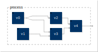

#+title:      Forward Mode Autodiff
#+date:       [2024-08-12 lun. 14:26]
#+filetags:   :autodiff:
#+identifier: 20240812T142629
#+latex_header: \usepackage{cancel}
#+latex_header: \usepackage{cleveref}
#+latex_header: \usepackage[inkscapelatex=false]{svg}

This note addresses the problem of forward (or tangent) mode [[denote:20240812T140652][Automatic
Differentiation]]. Consider a (\textsc{Faust}) program with a block
diagram that looks like this:

#+begin_src faust :results file svg :file "20240812T142629--block-diagram__faust_autodiff.svg" :exports results
N = 5;
// Just create something that the compiler will bundle into an
// abstraction in the block diagram.
S(j) = sum(i,N,((i+j) : sqrt)/N);
process = (v0 <: _,_),v1 : v2,v3 : v4
with {
    v0 = S(0);
    v1 = S(1);
    v2 = _,S(2) : +;
    v3 = +,S(3) : +;
    v4 = +,S(4) : +;
};
#+end_src

#+RESULTS:

This program consists of a number of what we will consider /primitive/
operations, \(v_{n}\). The program features \(N = 2\) input primitives
each taking its value from a vector, \(\mathbf{x} = \begin{bmatrix}x_{1}
& x_{2}\end{bmatrix}\), of input variables:

\begin{align}
v_{0} &= x_{1}_{}, \label{eq:v0} \\
v_{1} &= x_{2}, \label{eq:v1}
\end{align}
and produces one output signal, the output of the final primitive in
the graph:

#+NAME: eq:output
\begin{equation}
y = v_{4}.
\end{equation}

\(v_{4}\) performs some primitive operation on two input signals, so it
can be characterised as a function, \(f\):

#+NAME: eq:prim1
\begin{equation}
v_{4} = f(v_{2}, v_{3}),
\end{equation}
which acts on the outputs of primitives \(v_{2}\) and \(v_{3}\), which can
also be expressed as functions of their inputs:

#+NAME: eq:prim2
\begin{align}
v_{3} &= g(v_{0}, v_{1}), \\
v_{2} &= h(v_{0}).
\end{align}

Using the definitions in [[cref:eq:v0,eq:v1]], \(y\) can be defined as
follows:

#+NAME: eq:out-func
\begin{equation}
y = f(h(x_{1}), g(x_{1}, x_{2})).
\end{equation}
This describes the /primal expression/ of our program.

Symbolically, we can find the partial derivatives of \(y\) with
respect to \(x_{1}\) and \(x_{2}\) using the chain rule:

\begin{align}
\frac{\partial{}y}{\partial{}x_{1}} &= \frac{\partial{}h}{\partial{}x_{1}}\frac{\partial{}f}{\partial{}h} +
  \frac{\partial{}g}{\partial{}x_{1}}\frac{\partial{}f}{\partial{}g}, \label{eq:symbolic-x1} \\
\frac{\partial{}y}{\partial{}x_{2}} &= \cancel{\frac{\partial{}h}{\partial{}x_{2}}\frac{\partial{}f}{\partial{}h}} +
  \frac{\partial{}g}{\partial{}x_{2}}\frac{\partial{}f}{\partial{}g} \label{eq:symbolic-x2},
\end{align}
the first term of [[cref:eq:symbolic-x2]] cancelling since \(h\) does not
depend on \(x_{2}\).

The symbolic approach is dependent on knowing the structure of the
graph as a whole, however, and for an arbitrary program this is not
practical. To differentiate the program --- or indeed any program ---
/automatically/, we employ the chain rule at the level at each
primitive operation, passing the results on to successive primitives.

In forward mode autodiff, differentiating each primitive is a case of
producing a vector of partial derivatives with respect to the
parameter vector \(\mathbf{x}\). For example, the input primitive
\(v_{0}\) returns as its derivative:

#+NAME: eq:dv0-dx
\begin{equation}
\frac{\partial{}v_{0}}{\partial{}\mathbf{x}} = \begin{bmatrix}\frac{\partial{}v_{0}}{\partial{}x_{1}} \\ \frac{\partial{}v_{0}}{\partial{}x_{2}}\end{bmatrix}.
\end{equation}

Of course, per [[cref:eq:v0]], this simplifies to \(\begin{bmatrix}1 &
0\end{bmatrix}^{T}\), but the point of automatic differentiation is not
to simplify, or take shortcuts, but to allow derivatives to emerge
automatically (hence the name) via differentiation rules provided by
each primitive.

By that token, the partial derivatives, or /tangents/, of primitive
\(v_{2}\) are, via the chain rule:

#+NAME: eq:dv2-dx
\begin{equation}
\frac{\partial{}v_{2}}{\partial{}\mathbf{x}} = \begin{bmatrix}
  \frac{\partial{}v_{0}}{\partial{}x_{1}}\cdot\frac{\partial{}v_{2}}{\partial{}v_{0}} \\
  \frac{\partial{}v_{0}}{\partial{}x_{2}}\cdot\frac{\partial{}v_{2}}{\partial{}v_{0}}
\end{bmatrix},
\end{equation}
notwithstanding the fact that \(v_{0}\) (and by extension \(v_{2}\)) does
not depend on \(x_{2}\).

\(v_{3}\) is a multivariate primitive, so the chain rule for multivariate
functions comes into play:

#+NAME: eq:dv3-dx
\begin{equation}
\frac{\partial{}v_{3}}{\partial{}\mathbf{x}} = \begin{bmatrix}
  \frac{\partial{}v_{0}}{\partial{}x_{1}}\cdot\frac{\partial{}v_{3}}{\partial{}v_{0}} + \frac{\partial{}v_{1}}{\partial{}x_{1}}\cdot\frac{\partial{}v_{3}}{\partial{}v_{1}} \\
  \frac{\partial{}v_{0}}{\partial{}x_{2}}\cdot\frac{\partial{}v_{3}}{\partial{}v_{0}} + \frac{\partial{}v_{1}}{\partial{}x_{2}}\cdot\frac{\partial{}v_{3}}{\partial{}v_{1}}
\end{bmatrix}.
\end{equation}

Combining and extending [[cref:eq:dv2-dx,eq:dv3-dx]] we can produce a
derivative expression for \(v_{4}\):

#+NAME: eq:dv4-dx
\begin{equation}
\frac{\partial{}v_{4}}{\partial{}\mathbf{x}} = \begin{bmatrix}
  \left(
    \frac{\partial{}v_{0}}{\partial{}x_{1}}\cdot
    \frac{\partial{}v_{2}}{\partial{}v_{0}}\cdot
    \frac{\partial{}v_{4}}{\partial{}v_{2}}
  \right) +
  \left(
    \frac{\partial{}v_{0}}{\partial{}x_{1}}\cdot
    \frac{\partial{}v_{3}}{\partial{}v_{0}}\cdot
    \frac{\partial{}v_{4}}{\partial{}v_{3}} +
    \frac{\partial{}v_{0}}{\partial{}x_{1}}\cdot
    \frac{\partial{}v_{3}}{\partial{}v_{1}}\cdot
    \frac{\partial{}v_{4}}{\partial{}v_{3}}
  \right) \\
  \left(
    \frac{\partial{}v_{0}}{\partial{}x_{2}}\cdot
    \frac{\partial{}v_{2}}{\partial{}v_{0}}\cdot
    \frac{\partial{}v_{4}}{\partial{}v_{2}}
  \right) +
  \left(
    \frac{\partial{}v_{0}}{\partial{}x_{2}}\cdot
    \frac{\partial{}v_{3}}{\partial{}v_{0}}\cdot
    \frac{\partial{}v_{4}}{\partial{}v_{3}} +
    \frac{\partial{}v_{0}}{\partial{}x_{2}}\cdot
    \frac{\partial{}v_{3}}{\partial{}v_{1}}\cdot
    \frac{\partial{}v_{4}}{\partial{}v_{3}}
  \right)
\end{bmatrix},
\end{equation}
and that, in effect, gives us an expression for
\(\frac{\partial{}y}{\partial{}\mathbf{x}}\), a Jacobian matrix.

The aim of automatic differentiation is not, however, to produce
derivative expressions, but numerical outputs. To calculate the
derivative of \(y\) with respect to \(x_{i}\), we begin by differentiating
\(\mathbf{x}\) with respect to \(x_{i}\):

#+NAME: eq:partial-x1
\begin{equation}
\frac{\partial{}\mathbf{x}}{\partial{}x_{i}}
= \begin{bmatrix}\frac{\partial{}x_{1}}{\partial{}x_{i}} & \frac{\partial{}x_{2}}{\partial{}x_{i}}\end{bmatrix}.
\end{equation}

We then propagate this tangent vector through the graph, producing the
/forward tangent output/ of the program. On paper this looks like a
vector product (a /Jacobian vector product/ in fact
[cite:@baydinAutomatic2018]), and simply extracts the first element of
the vector in [[cref:eq:dv4-dx]]; for example:

#+NAME: eq:vec-prod
\begin{align}
\frac{\partial{}y}{\partial{}x_{1}} &= \frac{\partial{}\mathbf{x}}{\partial{}x_{1}}\frac{\partial{}y}{\partial{}\mathbf{x}} \nonumber \\
&= \begin{bmatrix}1 & 0\end{bmatrix}\frac{\partial{}y}{\partial{}\mathbf{x}} \nonumber \\
&= \left(
    \frac{\partial{}v_{0}}{\partial{}x_{1}}\cdot
    \frac{\partial{}v_{2}}{\partial{}v_{0}}\cdot
    \frac{\partial{}v_{4}}{\partial{}v_{2}}
  \right) +
  \left(
    \frac{\partial{}v_{0}}{\partial{}x_{1}}\cdot
    \frac{\partial{}v_{3}}{\partial{}v_{0}}\cdot
    \frac{\partial{}v_{4}}{\partial{}v_{3}} +
    \frac{\partial{}v_{0}}{\partial{}x_{1}}\cdot
    \frac{\partial{}v_{3}}{\partial{}v_{1}}\cdot
    \frac{\partial{}v_{4}}{\partial{}v_{3}}
  \right).
\end{align}
To compute \(\frac{\partial{}y}{\partial{}x_{2}}\), we find \(\frac{\partial{}\mathbf{x}}{\partial{}x_{2}}
= \begin{bmatrix}0 & 1\end{bmatrix}\) and proceed as above.

To give an example, let's assign some actual functions to \(v_{n}\):

#+NAME: eq:funcs
\begin{equation}
v_{2} = \sin(v_{0}), \quad v_{3} = v_{0} + v_{1}, \quad v_{4} = v_{2}v_{3},
\end{equation}
and substitute these into [[cref:eq:vec-prod]] (and the equivalent for
\(x_{2}\)):

#+NAME: eq:concrete-fwd
\begin{align}
\frac{\partial{}y}{\partial{}x_{1}} &= \left(1\cdot\cos(v_{0})\cdot{}v_{3}\right) + \left(1\cdot1\cdot{}v_{2} + 0\cdot1\cdot{}v_{2}\right) \nonumber \\
  &= v_{3}\cos(v_{0}) + v_{2} \nonumber \\
  &= (x_{1} + x_{2})\cos(x_{1}) + \sin(x_{1}), \\
\frac{\partial{}y}{\partial{}x_{2}} & = \left(0\cdot\cos(v_{0})\cdot{}v_{3}\right) + \left(0\cdot1\cdot{}v_{2} + 1\cdot1\cdot{}v_{2}\right) \nonumber \\
  &= v_{2} \nonumber \\
  &= \sin(v_{0}) \nonumber \\
  &= \sin(x_{1}),
\end{align}
which are exactly the results one would achieve with the symbolic
expressions in [[cref:eq:symbolic-x1,eq:symbolic-x2]].

Of course, this means that \(N\) passes are required to compute all of
the partial derivatives of \(y\).
