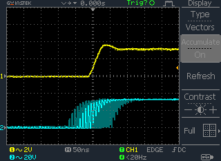

#+title:      Teensy PTP sync measurements
#+date:       [2024-08-15 jeu. 19:21]
#+filetags:   :ptp:teensy:
#+identifier: 20240815T192111

* Oscilloscope settings

- Acquire: Normal
- Channels:
  + Coupling: AC or DC (not sure why)
  + Invert: Off
  + BW Limit: Off
  + Probe: x1
- Trigger:
  + Type: Edge
  + Source: CH 1 (whichever the master is connected to)
  + Slope/Coupling:
    * Slope: rising edge
    * Coupling: DC
    * Rejection: Off
    * Noise Rej: Off
  + Mode: *Normal* (only update when a trigger event occurs)

Then set VOLTS/DIV to 2V, set the trigger level to ~1V, adjust the
channels' vertial position and away we go.

* Capturing sync information

Here's a screenshot of the oscilloscope capturing the master (top)
against the slave (bottom) with 250 ns divisions, and /Display ->
Accumulate/ set to /On/:

[[./20240815T151716--oscilloscope-screenshot-t41-ptp-250ns__ptp_teensy.png]]

This was a couple of minutes of accumulation. Teensy ethernet adaptors
were directly connected with an RJ45 cable. They stay synced to what
looks to be within about \pm50 ns.

With 50 ns divisions, things get a little weird:

Setting CH 2 as the trigger source, the situation is reversed,
i.e. the visual interference is present on CH 1 instead. I think this
is a limitation of the oscilloscope for very low TIME/DIV values, but
perhaps I should run it by Maxime.

Anyway, the sync interval looks to be around \pm75 ns. Still very
promising indeed.
