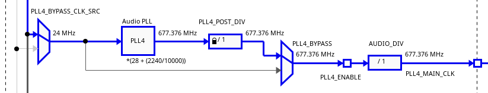
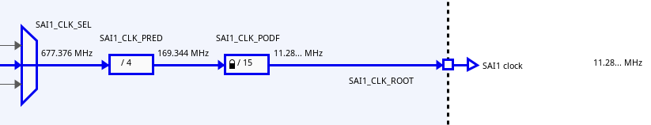

#+title:      Teensy PLL4 and SAI1 clock frequency
#+date:       [2024-08-21 mer. 13:26]
#+filetags:   :teensy:
#+identifier: 20240821T132619
#+export_file_name: export/20240821T132619

#+begin_src julia :session :results none :exports none
using Printf, Format
#+end_src

* Reference Manual Resources

*i.MX RT1060 Processor Reference Manual rev3*

** §14.7.10

*CCM Clock Divider Register (~CCM_CS1CDR~)*
Relevant fields:
- ~SAI1_CLK_PRED~
  + ~000~ divide by 1
  + ...
  + ~111~ divide by 8
- ~SAI1_CLK_PODF~
  + "The input clock to this divider should be lower than 300Mhz,
    the predivider can be used to achieve this."
  + ~000000~ divide by 1
  + ...
  + ~111111~ divide by 2^{6}
      
** §14.8.8

*Analog Audio PLL control Register (~CCM_ANALOG_PLL_AUDIOn~)*
#+begin_quote
The register is named ~...AUDIOn~ in the reference manual, implying
that there are multiple such registers, but only one is used in the
Teensy codebase.
#+end_quote
Relevant fields:
- ~ENABLE~
- ~POWERDOWN~
  + Not clear, at the time of writing, how these fields differ;
    i.e. whether ~ENABLE~ is safer at runtime that ~~POWERDOWN~.
- ~BYPASS~
  + Bypassing the PLL is a case of sending the 24 MHz source through
    unmodified, so probably isn't that useful.
- ~POST_DIV_SELECT~
  + "These bits implement a divider after the PLL, but before the
    enable and bypass mux."
- ~DIV_SELECT~
  + Called ~DIV~ in MCUXpresso Config Tools.
  + "This field controls the PLL loop divider. Valid range for
    ~DIV_SELECT~ divider value: 27~54."
      
** §14.8.9

*Numerator of Audio PLL Fractional Loop Divider Register
 (~CCM_ANALOG_PLL_AUDIO_NUM~)*
- Called ~NUM~ in MCUXpresso Config Tools
- Signed number (not according to Config Tools)
- "30 bit numerator of fractional loop divider."
- "Absolute value should be less than denominator"
    
** §14.8.10

*Denominator of Audio PLL Fractional Loop Divider Register
 (~CCM_ANALOG_PLL_AUDIO_DENOM~)*
- Called ~DENOM~ in MCUXpresso Config Tools
- Unsigned number
- "30 bit denominator of fractional loop divider."

** §14.8.19

*Miscellaneous Register 2 (~CCM_ANALOG_MISC2n~)*
Register for controlling miscellaneous analog blocks.
Relevant fields:
- ~AUDIO_DIV_MSB~
  + "MSB bit value pertains to the first bit, please program the LSB
    bit as well to change divider value"
- ~AUDIO_DIV_LSB~
  + "LSB bit value pertains to the last bit, please program the MSB
    bit as well, to change divider value"
- ~00~ divide by 1 (default)
- ~01~ divide by 2
- ~10~ divide by 1 (!)
- ~11~ divide by 4

* Default setup

Here's the block diagram for the PLL4 clock, taken from MCUXpresso
Config Tools for the MIMXRT1062xxxxB chip:

The output of the above is the input for the following, which
describes the SAI1 clock:

Pictured above are the registers and fields used by Teensy. The ones
of interest are:

- Audio PLL
  - ~DIV~: 28
  - ~NUM~: 2240
  - ~DENOM~: 10000
- ~SAI1_CLK_PRED~: 4
- ~SAI1_CLK_PODF~: 15

Plus maybe:
- ~PLL4_POST_DIV~: 1
- ~AUDIO_DIV~: 1

** Audio Clock Generation

Let's assume that the clock source isn't bypassed, and that
~PLL_BYPASS = 0~ and ~PLL4_ENABLE = 1~. 

- The 24 MHz clock source (OSC 24M) is the input to Audio PLL;
- Audio PLL multiplies its input by ~DIV + NUM/DENOM~
  + In this case we have:
#+begin_src julia :session :results output :exports both :eval never-export
OSC_24M = 24e6
DIV = 28
NUM = 2240
DENOM = 10000
PLL4 = OSC_24M * (DIV + NUM/DENOM)
@printf "PLL4 Frequency: %s Hz" cfmt("%'d", PLL4)
#+end_src

#+RESULTS:
: PLL4 Frequency: 677,376,000 Hz

- ~POST_DIV_SELECT~ and ~AUDIO_DIV~ are applied, but these both take a
  value of 1 in this case, so no change.
- The synchronous audio interface, SAI1, receives the PLL4 clock and
  divides it, first by ~SAI1_CLK_PRED~, then by ~SAI1_CLK_PODF~, and
  produces ~SAI1_CLK_ROOT~:
#+begin_src julia :session :results output :exports both :eval never-export
SAI1_CLK_PRED = 4
SAI1_CLK_PRED_FREQ = PLL4 / SAI1_CLK_PRED
SAI1_CLK_PODF = 15
SAI1_CLK_ROOT = SAI1_CLK_PRED_FREQ / 15
@printf "SAI1_CLK_ROOT Frequency: %s Hz" cfmt("%'d", SAI1_CLK_ROOT)
#+end_src

#+RESULTS:
: SAI1_CLK_ROOT Frequency: 11,289,600 Hz
Which is \(2^{8}\) times the target sampling rate:
#+begin_src julia :session :results output :exports both :eval never-export
audioSampleRate = SAI1_CLK_ROOT / 1<<8
@printf "Audio sample rate: %s Hz" cfmt("%'d", audioSampleRate)
#+end_src

#+RESULTS:
: Audio sample rate: 44,100 Hz

* Audio clock capabilities

Let's set off in reverse; ~SAI1_CLK_ROOT~ (\(F_{I}\)) should equal 256
times the target sample rate (\(F_{s}\)):[fn:1]

#+NAME: eq:sai1-freq1
\begin{equation}
F_{I} = 2^{8}\cdot{}F_{s}
\end{equation}

Config Tools says \(F_{I}\) must be lower than or equal to 66 MHz, so:

#+begin_src julia :session :results output :exports both :eval never-export
FsMax = 66e6/1<<8
@printf "Fs <= %s Hz" cfmt("%'d", FsMax)
#+end_src

#+RESULTS:
: Fs <= 257,812 Hz

\(F_{I}\) is found by dividing the frequency of ~PLL4_MAIN_CLK~
(\(F_{M}\)) by the ~SAI1_CLK_PRED~ (\(D_{a}\)) and ~SAI1_CLK_PODF~
(\(D_{b}\)) fields of the ~CCM_CS1CDR~ register:

#+NAME: eq:sai1-freq1
\begin{equation}
F_{I} = \frac{F_{M}}{D_{a}D_{b}}
\end{equation}

\(F_{M}\) is found by dividing \(F_{P}\), the frequency of PLL4, by
~POST_DIV_SELECT~ (\(D_{p}\)) and ~AUDIO_DIV~ (\(D_{A}\)):

#+NAME: eq:pll4-main
\begin{equation}
F_{M} = \frac{F_{P}}{D_{p}D_{A}}
\end{equation}

\(F_{P}\) is the result of the multiplying the 24 MHz clock source
(\(F_{X}\)) by the PLL4 divider, \(D_{P}\), which is the sum of the /PLL
loop divider/, the ~DIV_SELECT~ field of ~CCM_ANALOG_PLL_AUDIO~
(\(D_{S}\)) with the quotient of the /PLL fractional loop divider/
numerator (~CCM_ANALOG_PLL_AUDIO_NUM~, \(D_{N}\)) and denominator
(~CCM_ANALOG_PLL_AUDIO_DENOM~, \(D_{D}\)) registers:

#+NAME: eq:pll4-freq
\begin{align}
F_{P} &= F_{X}D_{P} \\
  &= F_{X}\left(D_{S} + \frac{D_{N}}{D_{D}}\right)
\end{align}

The ~DIV_SELECT~ field has a valid range of \(27 \leq D_{S} \leq 54\), and
\(|D_{N}| < D_{D}\), so \(D_{P}\) describes (in theory) a number in the
following range:

\[
\left(26 + \frac{1}{D_{D}}\right) \leq D_{P} \leq \left(54 + \frac{D_{D}-1}{D_{D}}\right),
\]
with \(1 \leq D_{D} \leq 2^{30}\); effectively, \(26 < D_{P} < 55\). MCUXpresso Config
Tools, and the reference manual (see §13.3.2.2 and §14.6.1.3.4),
indicate, however, that the output frequency range for PLL4 is "from
650 MHz to 1.3 GHz", plus Config Tools contradicts the manual and
states that \(D_{N}\) must be a /positive/ 30 bit integer, so:

#+begin_src julia :session :results output :eval never-export :exports both
DpMin = 650e6/24e6
DpMax = 1300e6/24e6
@printf "%f <= PLL4 divider <= %f" DpMin DpMax
#+end_src

#+RESULTS:
: 27.083333 <= PLL4 divider <= 54.166667

\[
\left(27 + \frac{1}{12}_{}\right) \leq D_{P} \leq \left(54 + \frac{1}_{}{6}\right).
\]

Setting extreme values for \(D_{x}\), we can find the minimal valid
\(F_{s}\):

#+begin_src julia :session :results output :eval never-export :exports both
POST_DIV_SELECT = 4
AUDIO_DIV = 4
pll4Div = POST_DIV_SELECT * AUDIO_DIV
SAI1_CLK_PRED = 8
SAI1_CLK_PODF = 64
sai1Div = SAI1_CLK_PRED * SAI1_CLK_PODF
FsMin = (OSC_24M * DpMin)/(pll4Div*sai1Div*1<<8)
@printf "%s Hz <= Fs <= %s Hz" cfmt("%'d", FsMin) cfmt("%'d", FsMax)
#+end_src

#+RESULTS:
: 310 Hz <= Fs <= 257,812 Hz

* Setting a different audio sample rate

Say we want to set a sample rate of 48 kHz. Our target \(F_{I}\) is:

#+begin_src julia :session :results output :exports both :eval never-export
Fs = 48000
Fi = Fs * 1<<8
@printf "Target SAI1_CLK_ROOT: %s Hz" cfmt("%'d", Fi)
#+end_src

#+RESULTS:
: Target SAI1_CLK_ROOT: 12,288,000 Hz

Options:
- *(30+(72/100))/(1*1*4*15)
- *(40+(96/100))/(2*1*5*8)
- *(51+(2/10))/(2*1*5*10)

* Footnotes

[fn:1] The presence of \(2^{8}\) in that equation is probably to do with
the word size employed by the audio interface.
