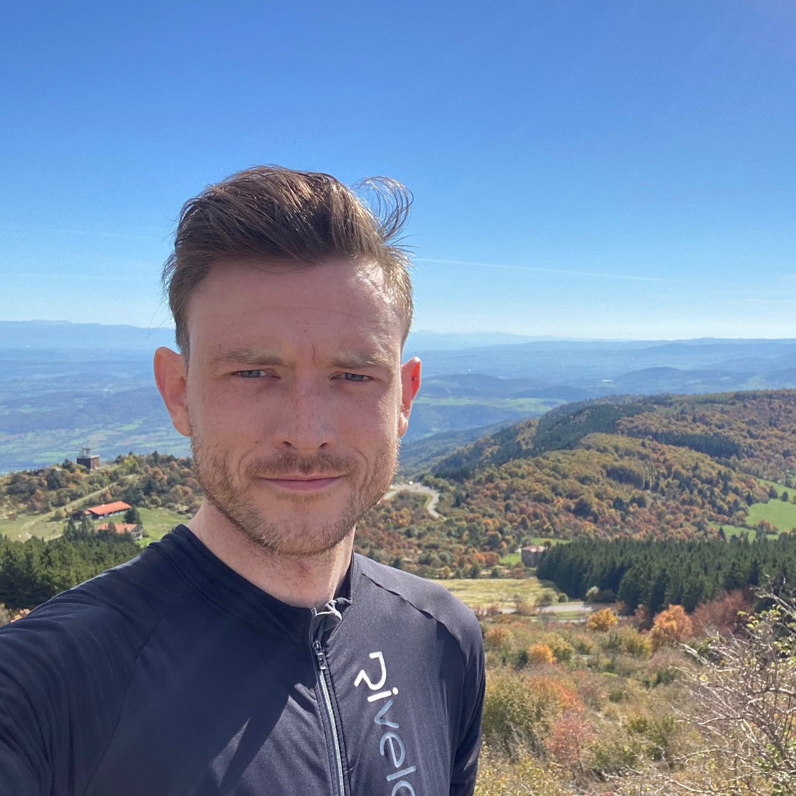
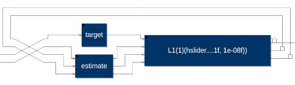

#+title:      IFC Bio and Session Description
#+date:       [2024-10-28 lun. 01:24]
#+filetags:   :conference:faust:
#+identifier: 20241028T012429

* Bio

A graduate of the Sound and Music Computing masters program at Aalborg
University, Copenhagen, Thomas Rushton is a member of Inria's embedded
research team, Emeraude, and a PhD candidate at Lyon's Institut
National des Sciences Appliquées (INSA), developing a thesis entitled
"Enabling Distributed Spatial Audio".

He has acted as both contributor and mentor for Faust projects as part
of the annual Google Summer of Code, and recently gave an introductory
Faust workshop at the Centre for Computer Research in Music and
Acoustics (CCRMA) at Stanford University.

* Session

Differentiable programming is the creation of computer programs whose
derivatives can be found, and the sensitivity of their outputs to
changes in their parameters computed. Automatic differentiation is a
differentiable programming technique whereby derivatives are found via
composition of differentiable instances of the primitive operations
that make up the program. Differentiable Digital Signal Processing
(DDSP) is the application of differentiable programming to audio
tasks, and is key to a variety of problems at the intersection of
audio and machine learning.

A convenient, composable scheme is explored for forward mode automatic
differentiation in the Faust language. This scheme can be applied to a
variety of parameter optimisation problems, and could serve as the
basis for tackling machine learning tasks in Faust, opening the door
to novel approaches to DDSP problems.
