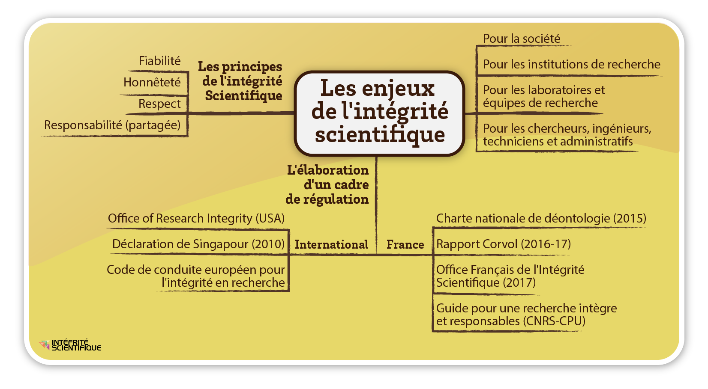
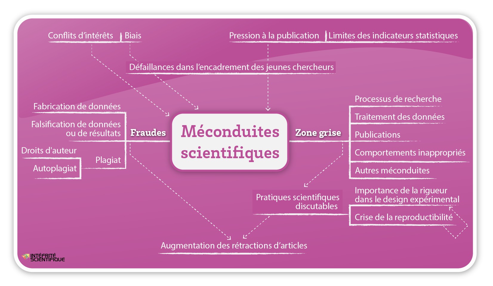

#+title:      Intégrité scientifique dans les métiers de la recherche
#+date:       [2025-08-07 jeu. 15:33]
#+filetags:   :phd:training:
#+identifier: 20250807T153316

* Ethique / Intégrité / Déontologie
/Ethics / Integrity / Code-of-conduct/

- Ethics: big questions posed by scientific progress and its sociatal
  repecussions.
- Integrity: rules that govern research practice.
  + Integral: fair, raw data, metadata.
  + Open: pre-prints, publication costs.
- Code-of-conduct: moitoring of /conflicts of interest/ and /multiple
  roles/ amongst civil servants.

* Module 1
Aims:
- Show the importance and the diversity of issues behind scientific
  integrity.
- Describe the relevant reference documents at the disposal of the
  scientific community.
- Present case studies demonstrating scientific fraud, underlining the
  consequences for science, for society, for the scientific community,
  and for the fraudsters themselves.

- A series of examples of *misconduct*: /fake research/, fake peer
  reviews, fact-fabrication and data-manipulation, plagiarism
  (/plagiat/), fraud, conflicts of interest, etc.
- Sociology of science introduce by Robert Merton. Writing in 1942, he
  described a situation whereby the norms of scientific integrity
  were, at that time, /known/ somehow, but tacit in nature.
- According to Yannick Lung, three main types of scientific
  misconduct/fraud:
  + data fabrication (making up data in the first place, I suppose).
  + falsification of data and results (modification versus
    fabrication).
  + plagiarism.
- Spectrum of scientific practice, from /Good Research Practices/, via
  /Questionable Practices/ such as sloppiness, unconscious bias and
  conscious bias, to *falsification*, outright *fabrication* and
  *plagiarism*.
- Regarding questionable practices (« zone grise »), choosing data
  favourable to a hypothesis, for example, 1 in 3 researchers confess
  to having strayed into such practices.
- Merton proposed four values:
  + Universalism (science transcends nations/borders).
  + Communalism (not to be appropriated by private interests).
  + Altruism/disinterest (standing on the shoulders of giants).
  + Organised skepticism (impartiality in the face of politics,
    religion, and economic influences).

*** Principles of scientific integrity
Extract from [[http://www.fun-mooc.fr/asset-v1:ubordeaux+28007+session01+type@asset+block@FR_ALLEA_Code_de_conduite_europeen_pour_lintegrite_en_recherche.pdf][European code of conduct for research integrity]]:

- *Trustworthiness*: to guarantee the quality of research through its
  conception, methodology, analysis and use of resources.
- *Honesty*: to devise, undertake, evaluate and disseminate research in
  a transparent, fair, complete and objective manner.
- *Respect*: for colleagues, participants, society, ecosystems, cultural
  heritage and the environment.
- *Responsibility*: for research activities, from ideation to
  publication, their management and organisation, training,
  supervision and mentoring, and for the general implications of
  research.

*** Shared responsibilty
Responsibility for scientific integrity is communal, at the level of
/the laboratory/ --- i.e. institutionally, as well as amongst the more
abstract notion of the /scientific community/ --- and it is individual
at the level of /the researcher/. OK, this is fairly
straightforward... communal responsibility arises from a sense of
solidarity that's integral to the strength of individual
responsibility.

*** Summary
- We've defined some breaches (/manquements/) of scientific integrity.
- We've defined some good practices for preserving scientific
  integrity.
- We've also covered some regulations for guiding it (which I may not
  have mentioned above)
  + The [[https://www.wcrif.org/guidance/singapore-statement][Singapore Statement on Research Integrity]] (2010) --- which
    "...is intended to challenge governments, organizations and
    researchers to develop more comprehensive standards, codes and
    policies to promote research integrity both locally and on a
    global basis." --- seems to be the guiding reference on the
    matter.
  + It's actually quite a short document. A set of four /principles/
    (honesty, accountability, professional courtesy and fairness, and
    good stewardship) and fourteen /responsibilities/.

* Module 2
Aims:
- Present, more precisely, breaches of scientific integrity and their
  principal factors.
- Present the three principal types of breach:
  + Fabrication of data.
  + Falsification of data and results.
  + Plagiarism (and self-plagiarism).
    * Particular focus on plagiarism in this module.
- Other types of breaches from the so-called « zone grise » will be
  discussed. Breaches of rigour; the question of reproducibility.
- To finish, the module will address the factors that may drive such
  breaches:
  + Academic competition as it may affect both individuals and
    institutions.
  + Conflicts of interest, whether arising from partnership
    arrangements, or between scientific concensus on the one hand and
    the opinions of individual researchers on the other.
  + Failure in the direction of young researchers.

** Fraud, grey areas, and reproducibility
*** Fraud
- Direct attempt on the part of a reseracher to deceive or mislead.
- Fabrication and falsification are damaging in particular in that, if
  such fraudulent research is referred to by other researchers, it
  leads to a propagation effect. Further, if used in public policy
  decision-making, for example fraudulent research can have
  deleterious societal consequences.
- There are obviously also consequences for those who commit fraud in
  the first place, their colleagues, their institutions, institutional
  partners, etc.
- Fraud concerns all scientific domains, but particularly (?)
  experimental sciences (I guess if we're talking about domains in
  which data is generated, and thus can be fabricated or falsified).
- Examples: manipulation of a dataset to produce a desired linear
  regression; planting objects to be later unearthed as part of an
  archaeological investigation; illicit manipulation of images.
- All-in-all, fraud is a marginal issue, but with wide-ranging
  consequences for science, provoking negative media interest, etc.

*** Grey areas
- Errors of methodology. Methodolgy isn't really taught in French
  universities, apparently.
- Disrespect for rules, e.g. wrt. experimentation on animals,
  e.g. tumor diameter. Due to error or lack of knowledge, such rules
  may be breached, and this constitutes, in effect, falsification of
  data.
- Then there's carelessness; e.g. inversion of images of biological
  specimen rendering a paper fit only for the bin.
- Mentors/directors/supervisors must lead the way in preventing
  grey-area behaviour.
- Not all grey area cases arise from intentional manipulations; they
  can arise, unwittingly, particularly from negligence.
  + Inappropriate methods.
  + Misconceived (experimental) protocol.
  + Violation of ethical rules.
  + Discarding raw data.
  + Poor data-management.
  + Faulty (data?) storage.
  + Reusal to share data with other researchers.
  + Poor maintenance of equipment as a source of error.
  + Attribution of authors who made no contribution to the research.
  + On the contrary, omission of a contributing author.
  + "Salami slicing" --- artificially spreading results amongst a
    selection of papers/articlse to inflate publication-count.
  + Failure to correct bibliographical errors.
  + Then we have personal breaches; relationships, harrassment,
    failures of mentorship, failure to take into account
    social/cultural norms.
  + Non-declaration of conflicts of interest.
  + Misuse of funding.
  + Unfounded allegations against colleagues.
- Rigour:
  + Problem of reproducibility.
  + /Experimental design/ is the key element where rigour is concerned.
  + Double-blind is the way to go (in a medical test); neither the
    patient, nor the medical practitioner, ought to know who is taking
    the real medication, versus the placebo.
- Reproducibility. Two kinds: acceptable difficulty in reproducing,
  e.g. samples in life sciences; and unacceptable use of incorrect
  experimental procedure, inappropriate analysis, or manifestations of
  intentional bias.

** Plagiarism
- *Plagiarism is theft.*
- Comes in different forms, however. C+P text from other works without
  citation; reformulation of text from other works (without citation).
- Text plagiarism is the most common, most evident.
- Theft of /ideas/ is also something that may occur, however. Research
  is a social affair; we toss (/brasse/) ideas around, and unscrupulous
  individuals may capitalise on ideas without giving due credit.
- No real judicial protection for cases of "it was my idea first". the
  scientific community sort of has to police itself in this regard.
- /Autoplagiarism/: publishing, several times, the same results, the
  same ideas, for publication-list inflation. A step beyond
  salami-slicing into straight-up duplication. It is, amongst other
  things, a waste of the resources of the scientific community.
- Seems to be lack of awareness of scientific lineage that leads to
  plagiarism amongst doctoral students. They don't understand that
  they're part of a scientific community.
- There's also pressure to cross some difficult moment, during which
  the student doesn't (or doesn't feel able to) reach out for support,
  but compromises themselves, feeling that they have no choice but to
  commit fraud or plagiarism in order to succeed. "No-one will notice!"
- If not stopped, this is something that can marr an entire career.
- Where there /is/ some legal basis is in the /right of the author/, when
  confronted with /une œurve d'esprit/. The existence of such a work
  hinges on two conditions: that a work has actually been realised (in
  addition to simply having been conceived), and that the work is
  original in some way (being a reflection of the author's
  personality).
  + Applies to a sculpture, a painting, a scientific article, a
    thesis, a memoire, a photograph, a map...
  + Moral rights: it is not permitted to publish something without an
    author's consent, to fail to cite the origin of a photo, for
    example. Nor is it permitted to modify a work not belonging to a
    given author, nor use it in an inappropriate/misleading context.
  + The above risk facing penal/civil sanctions.

** Evolution of fraud...
- Increase in recent rates of article retraction. 10x over ten years.
- Estimated that 1/5000 articles is retracted; 45% of those for
  reasons of fraud (rates higher in biomedical science).
- Conflicts of interest: scientific-industrial partnerships are at the
  heart of c-of-i problems. Such arrangements are mutually beneficial,
  and certainly benefit institutions, but they put researchers in a
  position of dependence wrt. the industrial partner.
  + Profit motive is the issue. And bias toward industrial
    partner. Changes of experimental protocol due to pressure,
    falsification of results. All avoidable; it rests to remain
    conscious of such pitfalls.
  + Tobacco industry is the classic example. Pharmaceutical industry
    too. /Ghost writing/: convincing/paying a researcher to put their name
    to a paper written in-house, favouring a given medication, for
    example. Fossil-fuel industry too.
- Bias: selection, performance, detection, attrition, declaration,
  experimentor, confirmation.
- Individual researchers? Susceptible to bias, and thus conflict of
  interest. In social sciences we have the difficulty for researchers
  to separate their convictions as citizens from their attitudes as
  scientists. Important to test counter-hypotheses.
- H-index. Bad thing.

* Prevention
Aims:
- Provide tips for avoiding various breaches of scientific
  integrity, by recalling /good practice/.
- Pose questions:
  + In what sort of environment is a young reseracher trained?
  + What issues of transparency and tracability, beyond published
    results, permit the sharing of research steps with the scientific
    community?
  + Who authors scientific publications?
  + What voice does the researcher have in the public forum?

** Collective work & mentoring
- *Research is a collective practice.*
- Less and less individual; more and more collective. Partly
  technologically-driven; need for engineers, technicians, researchers
  of different specialisms.
  + Law and the humanities to a lesser extent.
- To work together one must have trust, but not a naive trust, in
  those with whom one works.
- Since PIs tend to be more concerned with seeking funding, etc., it
  is postdocs, PhDs, and other young researchers upon whom the weight
  of good practice falls. This occurs, hopefully, under good
  supervision by PIs, lab directors, supervisors, etc., busy as they
  may be, to whom it falls to share their values as a form of
  /on-the-job training/.
- The CSI serves to satisfy some of this role too.

** Tracability and data-management
- The laboratory notebook: an extremely rich
  resource... indispensable.
- Not a new phenomenon; used by Pasteur, Curie, etc.
- I know some of this stuff from the /Reproducible Research/ MOOC.
- The lab notebook is a collective source of information; it belongs
  not just to the individual, but to the team, the institution... so
  says the preamble in the CNRS 'official' lab notebook I've seen
  kicking around the place.
  + (Mine should really be public...)
- C'est la /pierre angulaire/ de la collection des données
  scientifiques.
- Digital data should be available in raw form, as well as in the form
  of finalised results.
- Tension between data retention, and deletion (or anonymisation) of
  sensitive data.
