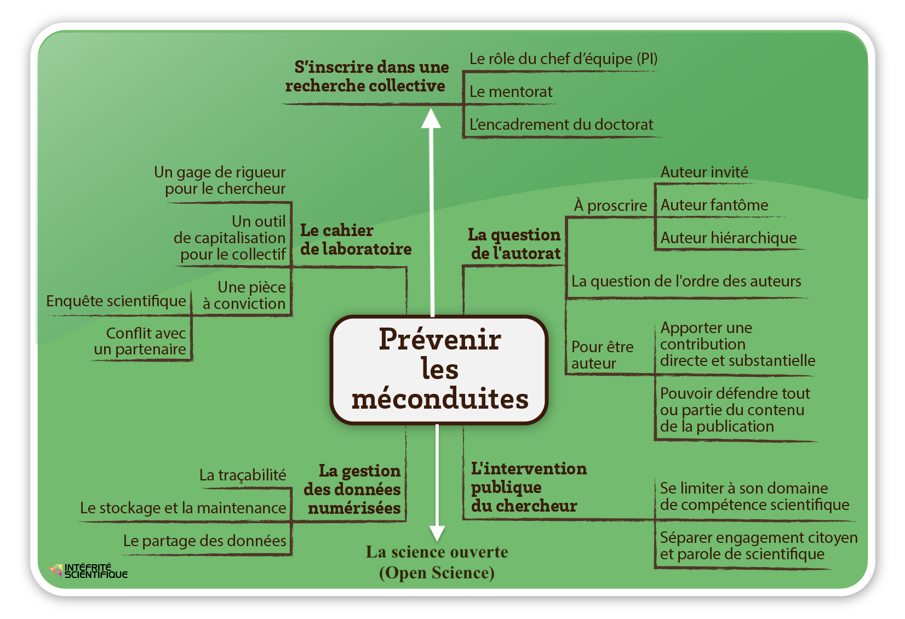
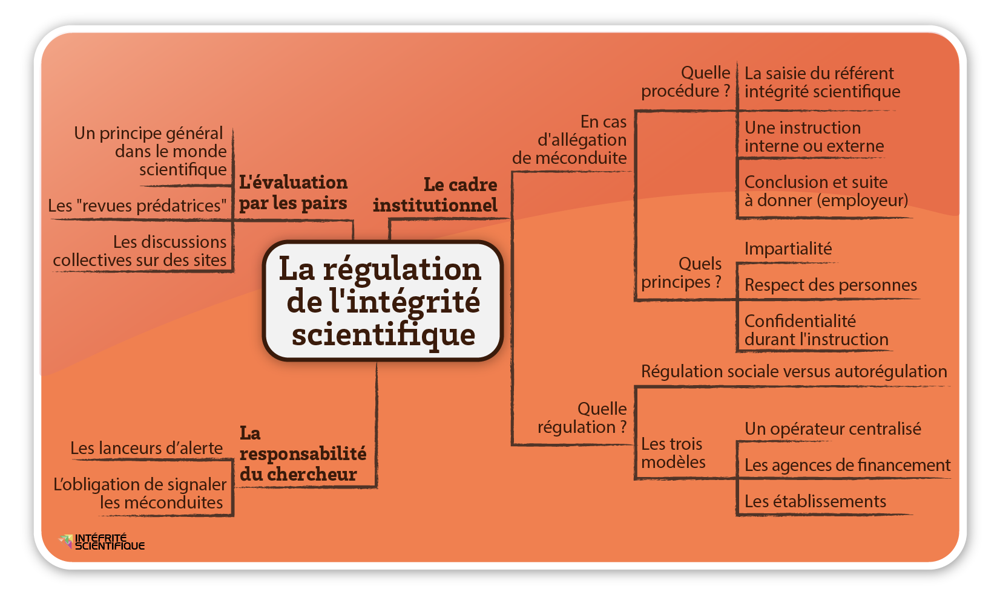

#+title:      Intégrité scientifique dans les métiers de la recherche
#+date:       [2025-08-07 jeu. 15:33]
#+filetags:   :phd:training:
#+identifier: 20250807T153316

* Ethique / Intégrité / Déontologie
/Ethics / Integrity / Code-of-conduct/

- Ethics: big questions posed by scientific progress and its sociatal
  repecussions.
- Integrity: rules that govern research practice.
  + Integral: fair, raw data, metadata.
  + Open: pre-prints, publication costs.
- Code-of-conduct: moitoring of /conflicts of interest/ and /multiple
  roles/ amongst civil servants.

* Module 1: Issues
Aims:
- Show the importance and the diversity of issues behind scientific
  integrity.
- Describe the relevant reference documents at the disposal of the
  scientific community.
- Present case studies demonstrating scientific fraud, underlining the
  consequences for science, for society, for the scientific community,
  and for the fraudsters themselves.

- A series of examples of *misconduct*: /fake research/, fake peer
  reviews, fact-fabrication and data-manipulation, plagiarism
  (/plagiat/), fraud, conflicts of interest, etc.
- Sociology of science introduce by Robert Merton. Writing in 1942, he
  described a situation whereby the norms of scientific integrity
  were, at that time, /known/ somehow, but tacit in nature.
- According to Yannick Lung, three main types of scientific
  misconduct/fraud:
  + data fabrication (making up data in the first place, I suppose).
  + falsification of data and results (modification versus
    fabrication).
  + plagiarism.
- Spectrum of scientific practice, from /Good Research Practices/, via
  /Questionable Practices/ such as sloppiness, unconscious bias and
  conscious bias, to *falsification*, outright *fabrication* and
  *plagiarism*.
- Regarding questionable practices (« zone grise »), choosing data
  favourable to a hypothesis, for example, 1 in 3 researchers confess
  to having strayed into such practices.
- Merton proposed four values:
  + Universalism (science transcends nations/borders).
  + Communalism (not to be appropriated by private interests).
  + Altruism/disinterest (standing on the shoulders of giants).
  + Organised skepticism (impartiality in the face of politics,
    religion, and economic influences).

*** Principles of scientific integrity
Extract from [[http://www.fun-mooc.fr/asset-v1:ubordeaux+28007+session01+type@asset+block@FR_ALLEA_Code_de_conduite_europeen_pour_lintegrite_en_recherche.pdf][European code of conduct for research integrity]]:

- *Trustworthiness*: to guarantee the quality of research through its
  conception, methodology, analysis and use of resources.
- *Honesty*: to devise, undertake, evaluate and disseminate research in
  a transparent, fair, complete and objective manner.
- *Respect*: for colleagues, participants, society, ecosystems, cultural
  heritage and the environment.
- *Responsibility*: for research activities, from ideation to
  publication, their management and organisation, training,
  supervision and mentoring, and for the general implications of
  research.

*** Shared responsibilty
Responsibility for scientific integrity is communal, at the level of
/the laboratory/ --- i.e. institutionally, as well as amongst the more
abstract notion of the /scientific community/ --- and it is individual
at the level of /the researcher/. OK, this is fairly
straightforward... communal responsibility arises from a sense of
solidarity that's integral to the strength of individual
responsibility.

*** Summary
- We've defined some breaches (/manquements/) of scientific integrity.
- We've defined some good practices for preserving scientific
  integrity.
- We've also covered some regulations for guiding it (which I may not
  have mentioned above)
  + The [[https://www.wcrif.org/guidance/singapore-statement][Singapore Statement on Research Integrity]] (2010) --- which
    "...is intended to challenge governments, organizations and
    researchers to develop more comprehensive standards, codes and
    policies to promote research integrity both locally and on a
    global basis." --- seems to be the guiding reference on the
    matter.
  + It's actually quite a short document. A set of four /principles/
    (honesty, accountability, professional courtesy and fairness, and
    good stewardship) and fourteen /responsibilities/.

[[./20250811T110822--enjeux-de-lintégrité-scientifique__phd_training.png]]

* Module 2: Types of breaches
Aims:
- Present, more precisely, breaches of scientific integrity and their
  principal factors.
- Present the three principal types of breach:
  + Fabrication of data.
  + Falsification of data and results.
  + Plagiarism (and self-plagiarism).
    * Particular focus on plagiarism in this module.
- Other types of breaches from the so-called « zone grise » will be
  discussed. Breaches of rigour; the question of reproducibility.
- To finish, the module will address the factors that may drive such
  breaches:
  + Academic competition as it may affect both individuals and
    institutions.
  + Conflicts of interest, whether arising from partnership
    arrangements, or between scientific concensus on the one hand and
    the opinions of individual researchers on the other.
  + Failure in the direction of young researchers.

** Fraud, grey areas, and reproducibility
*** Fraud
- Direct attempt on the part of a reseracher to deceive or mislead.
- Fabrication and falsification are damaging in particular in that, if
  such fraudulent research is referred to by other researchers, it
  leads to a propagation effect. Further, if used in public policy
  decision-making, for example fraudulent research can have
  deleterious societal consequences.
- There are obviously also consequences for those who commit fraud in
  the first place, their colleagues, their institutions, institutional
  partners, etc.
- Fraud concerns all scientific domains, but particularly (?)
  experimental sciences (I guess if we're talking about domains in
  which data is generated, and thus can be fabricated or falsified).
- Examples: manipulation of a dataset to produce a desired linear
  regression; planting objects to be later unearthed as part of an
  archaeological investigation; illicit manipulation of images.
- All-in-all, fraud is a marginal issue, but with wide-ranging
  consequences for science, provoking negative media interest, etc.

*** Grey areas
- Errors of methodology. Methodolgy isn't really taught in French
  universities, apparently.
- Disrespect for rules, e.g. wrt. experimentation on animals,
  e.g. tumor diameter. Due to error or lack of knowledge, such rules
  may be breached, and this constitutes, in effect, falsification of
  data.
- Then there's carelessness; e.g. inversion of images of biological
  specimen rendering a paper fit only for the bin.
- Mentors/directors/supervisors must lead the way in preventing
  grey-area behaviour.
- Not all grey area cases arise from intentional manipulations; they
  can arise, unwittingly, particularly from negligence.
  + Inappropriate methods.
  + Misconceived (experimental) protocol.
  + Violation of ethical rules.
  + Discarding raw data.
  + Poor data-management.
  + Faulty (data?) storage.
  + Reusal to share data with other researchers.
  + Poor maintenance of equipment as a source of error.
  + Attribution of authors who made no contribution to the research.
  + On the contrary, omission of a contributing author.
  + "Salami slicing" --- artificially spreading results amongst a
    selection of papers/articlse to inflate publication-count.
  + Failure to correct bibliographical errors.
  + Then we have personal breaches; relationships, harrassment,
    failures of mentorship, failure to take into account
    social/cultural norms.
  + Non-declaration of conflicts of interest.
  + Misuse of funding.
  + Unfounded allegations against colleagues.
- Rigour:
  + Problem of reproducibility.
  + /Experimental design/ is the key element where rigour is concerned.
  + Double-blind is the way to go (in a medical test); neither the
    patient, nor the medical practitioner, ought to know who is taking
    the real medication, versus the placebo.
- Reproducibility. Two kinds: acceptable difficulty in reproducing,
  e.g. samples in life sciences; and unacceptable use of incorrect
  experimental procedure, inappropriate analysis, or manifestations of
  intentional bias.

** Plagiarism
- *Plagiarism is theft.*
- Comes in different forms, however. C+P text from other works without
  citation; reformulation of text from other works (without citation).
- Text plagiarism is the most common, most evident.
- Theft of /ideas/ is also something that may occur, however. Research
  is a social affair; we toss (/brasse/) ideas around, and unscrupulous
  individuals may capitalise on ideas without giving due credit.
- No real judicial protection for cases of "it was my idea first". the
  scientific community sort of has to police itself in this regard.
- /Autoplagiarism/: publishing, several times, the same results, the
  same ideas, for publication-list inflation. A step beyond
  salami-slicing into straight-up duplication. It is, amongst other
  things, a waste of the resources of the scientific community.
- Seems to be lack of awareness of scientific lineage that leads to
  plagiarism amongst doctoral students. They don't understand that
  they're part of a scientific community.
- There's also pressure to cross some difficult moment, during which
  the student doesn't (or doesn't feel able to) reach out for support,
  but compromises themselves, feeling that they have no choice but to
  commit fraud or plagiarism in order to succeed. "No-one will notice!"
- If not stopped, this is something that can marr an entire career.
- Where there /is/ some legal basis is in the /right of the author/, when
  confronted with /une œurve d'esprit/. The existence of such a work
  hinges on two conditions: that a work has actually been realised (in
  addition to simply having been conceived), and that the work is
  original in some way (being a reflection of the author's
  personality).
  + Applies to a sculpture, a painting, a scientific article, a
    thesis, a memoire, a photograph, a map...
  + Moral rights: it is not permitted to publish something without an
    author's consent, to fail to cite the origin of a photo, for
    example. Nor is it permitted to modify a work not belonging to a
    given author, nor use it in an inappropriate/misleading context.
  + The above risk facing penal/civil sanctions.

** Evolution of fraud...
- Increase in recent rates of article retraction. 10x over ten years.
- Estimated that 1/5000 articles is retracted; 45% of those for
  reasons of fraud (rates higher in biomedical science).
- Conflicts of interest: scientific-industrial partnerships are at the
  heart of c-of-i problems. Such arrangements are mutually beneficial,
  and certainly benefit institutions, but they put researchers in a
  position of dependence wrt. the industrial partner.
  + Profit motive is the issue. And bias toward industrial
    partner. Changes of experimental protocol due to pressure,
    falsification of results. All avoidable; it rests to remain
    conscious of such pitfalls.
  + Tobacco industry is the classic example. Pharmaceutical industry
    too. /Ghost writing/: convincing/paying a researcher to put their name
    to a paper written in-house, favouring a given medication, for
    example. Fossil-fuel industry too.
- Bias: selection, performance, detection, attrition, declaration,
  experimentor, confirmation.
- Individual researchers? Susceptible to bias, and thus conflict of
  interest. In social sciences we have the difficulty for researchers
  to separate their convictions as citizens from their attitudes as
  scientists. Important to test counter-hypotheses.
- H-index. Bad thing.

[[./20250811T162738--méconduites-scientifiques__phd_training.png]]

* Module 3: Prevention
Aims:
- Provide tips for avoiding various breaches of scientific
  integrity, by recalling /good practice/.
- Pose questions:
  + In what sort of environment is a young reseracher trained?
  + What issues of transparency and tracability, beyond published
    results, permit the sharing of research steps with the scientific
    community?
  + Who authors scientific publications?
  + What voice does the researcher have in the public forum?

** Collective work & mentoring
- *Research is a collective practice.*
- Less and less individual; more and more collective. Partly
  technologically-driven; need for engineers, technicians, researchers
  of different specialisms.
  + Law and the humanities to a lesser extent.
- To work together one must have trust, but not a naive trust, in
  those with whom one works.
- Since PIs tend to be more concerned with seeking funding, etc., it
  is postdocs, PhDs, and other young researchers upon whom the weight
  of good practice falls. This occurs, hopefully, under good
  supervision by PIs, lab directors, supervisors, etc., busy as they
  may be, to whom it falls to share their values as a form of
  /on-the-job training/.
- The CSI serves to satisfy some of this role too.

** Tracability and data-management
- The laboratory notebook: an extremely rich
  resource... indispensable.
- Not a new phenomenon; used by Pasteur, Curie, etc.
- I know some of this stuff from the /Reproducible Research/ MOOC.
- The lab notebook is a collective source of information; it belongs
  not just to the individual, but to the team, the institution... so
  says the preamble in the CNRS 'official' lab notebook I've seen
  kicking around the place.
  + (Mine should really be public...)
- C'est la /pierre angulaire/ de la collection des données
  scientifiques.
- Digital data should be available in raw form, as well as in the form
  of finalised results.
- Tension between data retention, and deletion (or anonymisation) of
  sensitive data.

** Open science
- 2003 [[https://openaccess.mpg.de/Berlin-Declaration][Berlin Declaration]] on Open Acces to Knowledge in the Sciences
  and Humanities. Emphasis on the impact of the internet on the
  "practical and economic realities of distributing scientific
  knowledge".
- First French initiative in 2018, followed by a second national
  initiative for 2021-24. Le Comité de la science ouverte (CoSO) leads
  work on this stuff. L'Agence Nationale de la Recherche (ANR) put in
  place a data management plan in 2019.
- L'Office français de l'intégrité scientifique (OFIS) held its first
  colloquium in 2019 and identified two principle axes: data sharing,
  according to four principles (FAIR):
  + Findable.
    * Data has a PID such as a DOI; metadata aims to facilitate the
      search for data, and contains, amongst other things, the PID;
      data to be stored in an open-access data store.
  + Accessible.
    * Use of standardised, open communication protocols (HTTP, FTP,
      etc.); avoidance of closed ones (Skype, etc.); use of
      authentification --- /"as open as possible, as closed as
      necessary"/ --- to protect sensitive data, i.e. use of /secure/
      protocols e.g. HTTPS; preserve access to metadata to mitigate
      /data degradation/, even if the data itself becomes inaccessible.
  + Interoperable.
    * Use predefined vocabulary to minimise ambiguity when classifying
      data; common language, itself following FAIR principles; linked
      metadata --- global network of scientific information; objects
      of subjects can become subjects of other objects, etc.
  + Reusable
    * Metadata with attributes; version of software used, where/when
      observations were made, who created the data, etc.; licencing,
      e.g. CC-BY; provenance of data; community standards, the
      following of conventions for data and metadata formats.
- and open access to the results of research; obligatory open access
  to the results of all research supported by public funds. Think HAL,
  etc. The aim with both axes is to maximise the impact of publicly
  funded work, i.e. to make the money go as far as it possibly can.

** Who/what is an author
- What does the fact of being author or co-author of a scientific
  publication represent? Well, it's an important milestone,
  particularly in the career of a young researcher.
- What's the problem of authorship? Co-authorship is kind of nuts
  nowadays, particularly in Physics, e.g. Higgs' Boson work falling
  under the names of more than five thousand authors: physicists,
  technicians, etc.
- Authorship conflicts: can these drive misconduct? H-index,
  etc. causing pressure to introduce authors who weren't really
  involved. Inviting friends (who in turn invite friends); honorary
  authorship, perhaps with the aim of swaying reviewers by way of
  reputation; hierarchical authorship, i.e. the inclusion of
  director(s) de thèse or lab directors whether they had any
  direct involvement or not.
  + Interesting /double-bind/ problem: PIs spend all their time trying
    to secure funding, at the expense of their doing hands-on
    research, and yet they need (or feel they need) to be cultivating
    their H-index/number of publications in order to give their
    funding applications a greater chance of success.
  + Important to include authorship rules up-front when definiting a
    program of research so as to avoid conflicts down the line.
- CNRS states three conditions for authorship (particular relevance
  to biomedicine):
  + To have played a substantial role in the conception of the project
    and experimental protocol.
  + To have written the first version of the article or to have
    participated in the revision of intellectual content.
  + To have approved the final version and assumed responsibility for
    the content.
- The above conditions may hold in other domains of research.
- COMETS-CNRS adds (2016) that an "author must be able to defend part
  or all of the publication content"
- Order of authors: (interesting, I didn't know that, by convention,
  the PI/director typically appears last.) To avoid conflicts this
  should /simply/ be discussed at the level of the team, lab,
  etc. (again, putting guidelines it in the initial research plan
  sounds like common sense...)
- Significant contribution: now we're presented with the argument,
  quite contrary to some of those that preceded it, that social
  factors lend significance to contributions too. Those who aid in
  creating links between teams, between laboratories --- directors,
  etc. --- are welcome to sign on as co-authors, as without those
  links the research could not go ahead.

** Researchers' public interventions
- Public interventions can transgress rules of scientific integrity.
- Singapore declaration states, for example, that researchers should
  only intervene in their domain of competence.
- Separation to be made between a researcher's knowledge on the one
  hand, and their opinions on the other.
- Difficulty lying in the fact that high-profile researchers are
  routinely called upon by society and the media to give their views
  on contentious topics.
- Relationship with the media: distortion by researchers themselves
  (inflation, exaggeration, diminution of work that disagrees);
  distortion in press releases; distortion in the process of
  scientific production
- Stanford experiment example (/une escroquerie (swindle)
  scientifique?/).
- INRAE adopted a /charter of public expression/ in 2022.

* Module 4: Regulations
Aims:
- Present methods for regulating scientific integrity on both a
  collective and an individual level, emphasising the responsibilty of
  the researcher.
- At the collective level, present instances and procedures planned by
  the state and institutions for handling allegations of
  misconduct. Peer review is also discussed on this level.
- Individual responsibility is addressed on three axes:
  + In public interventions, emphasising scientific legitimacy.
  + By providing information on the role of whistleblowers.
  + By addressing the behaviour that researchers can adopt if
    confronted by cases of breaches of scientific integrity.

Being apprised of the above, the aim is the community may
autoregulate.

** The institutional framework
- Scientific integrity has become a matter of French law. In December
  2020, the French parliament introduced legislation, /la Loi de
  Programmation de la Recherche/, making explicit mention of scientific
  integrity.
- There are efforts, on an international level, for avoiding breaches;
  the OECD applied a bit of pressure by saying, essentially, that
  institutions should have procedures in place for preventing and
  exposing breaches.
- Procedures:
  + Referral: witness to the breach should be referred by the
    institution to the relevant scientific council or integrity
    officer; must be clear and well-defined.
  + Investigation: there must be an enquiry to establish if there has
    indeed been a breach. Such an enquiry can be internal or external;
    in general an external enquiry is recommended.
  + Action: if a breach has been established, the action to be taken
    must be considered by the employer of the person(s) responsible,
    either via internal committees, or, depending on the severity, via
    referral to the courts and/or institutional partners.
- Principles to respect: impartiality; respect for the rules and
  procedures; transparency; confidentiality.
- Sensitivity must be applied in applying procedures in cases of
  outright fraud versus those of grey-area misconduct; different
  procedures may apply in respective cases.
- Approaches differ internationally; in the US there's an independent
  legislative body for handling cases of misconduct; in the UK and
  Germany there's a rule that in order to grant funding it must be
  proven that measures are in place to prevent and address misconduct
  should it occur; (actually the US combines the two;) in France, and
  in other countries, it seems the model relies on good-will. Yikes.
- In France, things are moving toward a more structured approach (see
  the introduction the 2020 law, above).The Corvol report of 2016
  contributed to this situation with a series of recommendations.
- Corvol himself explains the delay in France getting its act
  together. A logical concern or the reputation of the institution;
  difficulty in dealing with such issues formally when there exists no
  formal legal framework (ibid); temptation to sweep cases under the
  rug arising as a result of the above.
- L'OFIS (l'Office français de l'intégrité scientifique), established
  in 2017. Eleven researchers and one journalist make up
  the council. Five-yearly meetings with each research institute,
  university, doctoral school, etc. OFIS is not to be addressed
  directly, however with misconduct cases; rather it seeks to empower
  establishments to govern themselves, with scientific integrity
  "guardians" and training in place.
- The purpose of OFIS, unlike the US equivalent (Office of Research
  Integrity, ORI) which is primarily concerned with fraud, is to
  prevent, as far as possible, the occurrence of fraud. Pre-emptive,
  preventative, like.

** Peer review
- Separation of scientific review from political interference
  (contrast with Soviet practice)
- Avoids quantitative evaluation, by e.g. management, according to,
  e.g. impact score, H-index, etc.
- To review research, in order to know how to evaluate research ---
  and this is why peer-review is the dominant model --- one must be a
  researcher oneself.
- Predatory journals (/reveues prédatrices/): resemble, or present
  themselves as, good journals, but they aren't. /Publish or perish/
  drives researchers to consider publication in such journals.
  + "Open access", a benefit to the publishing researcher, demands
    that authors pay the exorbiant fees (perhaps 2000+ €) demanded by
    respected journals to make published work freely available,
    typically out of hard-won research budgets. The review process may
    also take a long time, on the order of months.
  + Predation comes in when other, (seemingly) competing journals
    propose submission, for a relatively inexpensive sum, and much
    more quickly than the alternative. The problem is there's probably
    no proper peer-review, and shoddy publication quality.
- Pseudo-science (/canulars/ --- hoaxes): use of these as a way to trap
  predatory (or just unscrupulous or stupid) journals, exposing them
  as failing to subject work to proper peer review. Particularly
  prevalent in the social sciences.
  + The Sokal Hoax: Alain Sokal wrote a an article of
    pseudo-scientific nonsense which was published in /Social Texts/
    in 1996. The article, /Transgressing the Boundaries: Towards a
    Transformative Hermeneutics of Quantum Gravity/, gave the illusion
    of sense, albeit to a reader with no real grounding in
    physics. (Sounds a cruel thing to do... did he just have too much
    time on his hands?) The journal was flattered to have the work of
    a /real physicist/ to publish, apparently, and didn't submit the
    text to any real evaluation. Anyway, the affair prompted social
    science journals to improve reviewing practice.
  + Still, it goes on. /Society/ published an article in 2014, submitted
    pseudonymously, on "postmodern cars", that was later publicly
    denounced by the authors under true names.
  + In the experimental sciences too. John Bohannon submitted a bogus
    article on a fictitious cancer-fighting molecule to 304
    open-access predatory journals, and more than half accepted the
    work.
  + "Get me off your fucking mailing list" example. Fun,
    that. Actually wound up accepted and published.
  + La Fontaine allusion: « ...ceux qui n'ont du monde aucune
    expérience sont aux moindres objets frappés d'etonnement ». This
    strikes me as rather mean-spirited.
- [[https://pubpeer.com/][PubPeer]]: open, anonymous comment-thread on any paper out there with
  a DOI. An autoregulation platform for the scientific community.

** The responsibility of the researcher
- Whistleblowers: France has put in place laws in recent years to
  define situations in which whistleblowers are legally protected ---
  cases of corruption, conflicts of interest, risk to public health,
  risk to the environment. The problem, however, is there's no one
  single definition of what constitutes a whistleblower.
- In the US, whistleblowers are automatically recognised by the ORI
  and their allegations investigated. In France, whether a
  whistleblower may receive legal protection depends on the type of
  misconduct reported.
- Baltimore affair: 1986-96; allegation of fraud made by a postdoc
  against senior figures, who lost their jobs at MIT and Rockefeller
  institue. Triggered the creation of the ORI.
- Questions (of a nebulous sort) raised by the phenomenon of
  participative and citizen science.
- Singapore statement describes an /obligation to report/ instances of
  misconduct to which one is a witness; to fail to do so renders one
  complicit.
  

1
