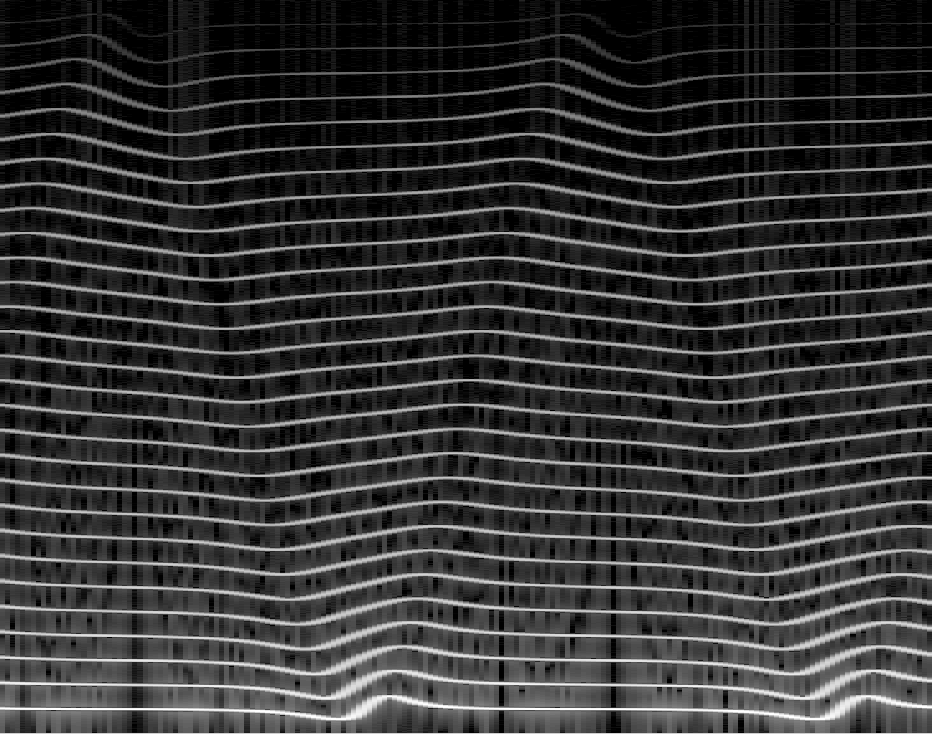

# -*- Mode: org -*-
# -*- coding: utf-8 -*-

#+title: Something Something Faust Differentiable Something
#+author: Thomas Rushton

#+startup: overview
#+export_file_name: out/aes-aimla-2025
#+options: toc:nil num:3 date:nil author:nil title:nil
#+latex_class: aes-aimla-2025
#+bibliography: refs.bib
#+cite_export: natbib
#+latex_header_extra: \RequirePackage[]{./out/aes-aimla-2025}

#+begin_export latex
\twocolumn[
\maketitle % MANDATORY!

\begin{onecolabstract}
Write the abstract here.
\end{onecolabstract}
]
#+end_export

* About                                                            :noexport:

* LaTeX Setup                                                      :noexport:
:PROPERTIES:
:header-args: :tangle out/aes-aimla-2025.sty :results silent
:END:

** Provide the package

#+begin_src latex
\ProvidesPackage{aes-aimla-2025}[2025/01/15 v0.1 Bundling AES 2025 AIMLA style]
#+end_src

** Packages

UTF-8 encoding is recommended but use one that works for you.

#+begin_src latex
\usepackage[utf8]{inputenc}
#+end_src

Highly recommended package for better looking text automatically.

#+begin_src latex
\usepackage{microtype}
#+end_src

Natbib is used for more control on citations. You can use other modern
bibliography packages but please try to match the provided style.

#+begin_src latex
\usepackage[numbers,square]{natbib}
#+end_src

These are useful for different purposes.

#+begin_src latex
\usepackage{booktabs}
\usepackage{color}
\usepackage{url}
#+end_src

More useful stuff

#+begin_src latex
\usepackage{hyperref}
\usepackage[noabbrev,capitalise]{cleveref}
#+end_src

** Figures

Graphics path.

#+begin_src latex
\graphicspath{{./}{figures/}}
#+end_src

** Authors

Put the authors in order here. The number in brackets define the
corresponding affiliation.

#+begin_src latex
\author[1]{John Smith}
\author[1,2]{Teri Jones}
\author[2]{John Maclane}
#+end_src

Affiliations go here.

#+begin_src latex
\affil[1]{First University}
\affil[2]{Second company}
#+end_src

Correspondece should include the corresponding author's name and
e-mail address

#+begin_src latex
\correspondence{John Smith}{john.smith@fakemail.com}
#+end_src

If there are many authors, please use the form "First author et al."
#+begin_src latex
\lastnames{Smith, Jones, and Maclane}
#+end_src

Short title should describe your topic but not be too long.
#+begin_src latex
\shorttitle{Something Something}
#+end_src

** Bibliography

#+begin_src latex
\bibliographystyle{jaes}
#+end_src

* Introduction

Introduce to the topic.

* Methods

Show your methods.

* Results

Present results.

* Discussion

Discuss the results.

* Examples

Here are a few examples on LaTeX.

** Citations

Citations can be used as follows, [cite/t:@Pulkki1997:VBAPbase] created
VBAP and DirAC [cite:@Pulkki2007:DirAC_JAES]. Notice the difference in
the reference types allowed by natbib-package.

** Equations

Equations are used often in text and cref:eq:firsteq shows an example
of this.

#+NAME: eq:firsteq
\begin{equation}
\cos(2\alpha)=e^{j2\pi}-2\sin^{2}(\alpha)
\end{equation}

** Tables & figures

Tables can be created in various ways and for various purposes. The
example in cref:tb:firsttb shows basic trigonometric values
using booktabs formatting.

#+name: tb:firsttb
#+caption: This table shows a few trigonometric values.
#+attr_latex: :booktabs t :center t :align ccc :placement [t]
|---------+----------------+----------------|
| \(\theta\)   | \(\sin(\theta)\)    | \(\cos(\theta)\)    |
|---------+----------------+----------------|
| \(\pi/4\) | \(\sqrt{2}/2\) | \(\sqrt{2}/2\) |
| \(\pi/3\) | \(\sqrt{3}/2\) | \(1/2\)        |
| \(\pi/2\) | \(1\)          | \(0\)          |
|---------+----------------+----------------|

There are also various ways to include and even draw figures in
LaTeX. The most common is to include them. As is shown with
cref:fg:sincplot and cref:fg:AESspec_jet. LaTeX places the figures in
the optimal place in the document by its typesetting rules but
appropriate location can be hinted with [t], [b], and [h] arguments
(corresponding to top, bottom, and here). Combination of these are
also allowed. AES instructions recommend only placing figures and
tables at the top or the bottom of the document but getting the
preferred result might require some tuning by hand.

#+name: fg:sincplot
#+caption: This is an example of using the pdf format showing means
#+caption: and confidence intervals of audiometric data.
#+attr_latex: :placement [t] :width 0.95\columnwidth
[[./results.pdf]]

#+attr_org: :width 500
#+name: fg:AESspec_jet
#+caption: This is a spectrogram of a spectral delay filtered
#+caption: sawtooth waveform using the png format.
#+attr_latex: :placement [t] :width 0.95\columnwidth

* Summary

Summarize your work and conclude.

Lorem ipsum dolor sit amet, consectetur adipiscing elit. Vestibulum
fermentum, libero nec scelerisque condimentum, libero mi porta dui,
sit amet varius enim dui nec nisi. Suspendisse nulla nibh, lacinia in
sapien at, tempus faucibus dolor. Cum sociis natoque penatibus et
magnis dis parturient montes, nascetur ridiculus mus. Ut facilisis
erat accumsan tempor faucibus. Suspendisse ac dolor id odio iaculis
sodales. Mauris nec arcu non tellus luctus mollis at vitae
mi. Curabitur posuere feugiat molestie. Curabitur ac lorem vel arcu
gravida volutpat.

Class aptent taciti sociosqu ad litora torquent per conubia nostra,
per inceptos himenaeos. In lacus est, accumsan non dictum nec,
volutpat non justo. Sed auctor scelerisque ante, vitae volutpat mauris
elementum sit amet. Etiam interdum felis id dignissim imperdiet. Proin
ullamcorper sit amet augue quis consequat. Nulla varius enim sed nisl
tempus, a ultricies sem finibus. Ut vel purus malesuada, sagittis
ligula ut, luctus velit. Suspendisse iaculis magna id est consectetur
condimentum. Nulla facilisi. Lorem ipsum dolor sit amet, consectetur
adipiscing elit. Fusce erat justo, auctor ut malesuada sed, ultrices
eu odio. Integer vitae facilisis eros, sed dapibus lacus. Sed
eleifend, risus ut congue tincidunt, nulla ipsum vestibulum diam, ut
laoreet metus erat auctor nunc. Donec nisi diam, aliquam eget pharetra
non, viverra non enim.

Integer facilisis elit id mauris laoreet gravida. Etiam dictum auctor
nibh, ac pharetra est aliquam et. Praesent a ligula ut turpis egestas
cursus vel non ante. Nam varius facilisis urna eget finibus. Duis
eleifend dui id lacus tempus aliquet. Praesent vel sodales
dolor. Suspendisse potenti.

Curabitur nisi felis, mollis non justo nec, sollicitudin ullamcorper
lorem. Nunc mattis ullamcorper vestibulum. Aenean vitae turpis vel
ipsum porttitor placerat. Etiam quis turpis quis nulla cursus
rhoncus. Cum sociis natoque penatibus et magnis dis parturient montes,
nascetur ridiculus mus. Sed auctor est sed vehicula dignissim. Sed vel
sem eget odio sagittis pharetra ut eu ex. Nullam fermentum ipsum non
lacinia sollicitudin. Vestibulum purus ex, volutpat rutrum velit
vitae, pulvinar ullamcorper mi. Maecenas tristique turpis ut justo
pellentesque, in hendrerit ligula commodo. Pellentesque eget dignissim
tellus.

#+print_bibliography:

* Local Variables                                                  :noexport:

# Local Variables:
# eval:   (add-to-list 'org-latex-classes '("aes-aimla-2025"
# "\\documentclass[conference,peer-reviewed,blind-review]{aesconf}
# [NO-DEFAULT-PACKAGES]"
# ("\\section{%s}" . "\\section*{%s}")
# ("\\subsection{%s}" . "\\subsection*{%s}")
# ("\\subsubsection{%s}" . "\\subsubsection*{%s}")
# ("\\paragraph{%s}" . "\\paragraph*{%s}")
# ("\\subparagraph{%s}" . "\\subparagraph*{%s}")))
# End:
