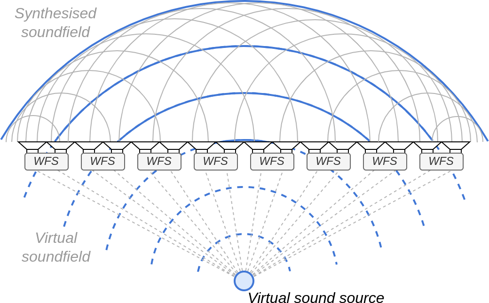

# -*- coding: utf-8 -*-
# -*- mode: org -*-

#+title: All Together Now: A Synchronous Platform for Distributed Spatial Audio
#+author: Thomas Rushton

#+startup: overview
#+export_file_name: out/sive2025
#+options: author:nil toc:nil num:3
#+latex_class: sive2025
#+bibliography: sive2025.bib
#+cite_export: biblatex
#+latex_header_extra: \RequirePackage[]{./out/sive2025}
#+refproc: :abbreviate nil

* About                                                            :noexport:

Org file describing a paper for submission to the 8th IEEE VR Workshop,
[[https://sive.create.aau.dk/][SIVE]] (Sonic Interaction in Virtual Environments) 2025.

Submission website: https://new.precisionconference.com/

** Reminder: abstract

Remember that the abstract is defined as part of the document style,
so it lives in [[*Abstract][LaTeX setup]] and needs to be re-tangled as and when it
is modified.

** What's the cost per channel again?

Excluding the cost of a computer, speakers and cables:

#+begin_src emacs-lisp
(let* ((teensy-cost 31.5)
       (audio-shield-cost 14.4)
       (ethernet-kit-cost 3.9)
       (switch-cost 200)
       (computer-cost 1500)
       (num-ports 24)
       (output-channels-per-port 2)
       (num-channels (* output-channels-per-port num-ports))
       (basic-cost (+ switch-cost
                      (* num-ports
                         (+ teensy-cost audio-shield-cost ethernet-kit-cost))))
       (cost-per-channel (/ basic-cost num-channels))
       (cost-per-channel-with-pc (/ (+ basic-cost computer-cost) num-channels)))
  (format
   (string-join '("€ %.2f %d-channel system"
                  "€ %.2f (incl. computer)"
                  "€ %.2f per channel"
                  "€ %.2f per channel (incl. computer)") "\n")
   basic-cost num-channels
   (+ basic-cost computer-cost)
   cost-per-channel
   cost-per-channel-with-pc))
#+end_src

#+RESULTS:
: € 1395.20 48-channel system
: € 2895.20 (incl. computer)
: € 29.07 per channel
: € 60.32 per channel (incl. computer)

** And how far does sound travel in, e.g., 1 \micro{}s?

#+begin_src emacs-lisp
(let* ((c 343.)
       (time-s 1e-6)
       (cmpm (/ 1. 1e-2))
       (mmpm (/ 1. 1e-3))
       (dist-m (* c time-s)))
  (format "%.2f m\n%.2f cm\n%.2f mm" dist-m (* dist-m cmpm) (* dist-m mmpm)))
#+end_src

#+RESULTS:
: 0.00 m
: 0.03 cm
: 0.34 mm

* LaTeX Setup                                                      :noexport:
:PROPERTIES:
:header-args: :tangle out/sive2025.sty :results silent
:END:

Remember to tangle, =C-c C-v t=.

** Fundamentals

#+begin_src latex
\ProvidesPackage{sive2025}[2024/12/09 v0.1 Bundling SIVE2025 LaTeX style]
#+end_src

** Packages

*** Typography

#+begin_src latex
\usepackage{times}                     % we use Times as the main font
\renewcommand*\ttdefault{txtt}         % a nicer typewriter font
#+end_src

#+begin_quote
We encourage the use of mathptmx for consistent usage of times font
throughout the proceedings. However, if you encounter conflicts
with other math-related packages, you may want to disable it.
#+end_quote

#+begin_src latex
\usepackage{mathptmx}                  % use matching math font
#+end_src

*** Demo content

#+begin_quote
Only used in the template examples. You can remove these lines.
#+end_quote

#+begin_src latex
\usepackage{tabu}                      % only used for the table example
\usepackage{booktabs}                  % only used for the table example
\usepackage{lipsum}                    % used to generate placeholder text
\usepackage{mwe}                       % used to generate placeholder figures
#+end_src

*** Maths & Numbers

#+begin_src latex
\usepackage{amsmath}
\usepackage{siunitx}
#+end_src

** Figures

#+begin_src latex
%% it is recomended to use ``\cref{sec:bla}'' instead of ``Fig.~\ref{sec:bla}''
\graphicspath{{figures/}{pictures/}{images/}{./}} % where to search for the images
#+end_src

** Metadata stuff

#+begin_quote
If you are submitting a paper to a conference for review with a double
blind reviewing process, please replace the value ``0'' below with your
OnlineID. Otherwise, you may safely leave it at ``0''.
#+end_quote

#+begin_src latex
\onlineid{0}
#+end_src

#+begin_quote
Declare the category of your paper, only shown in review mode
#+end_quote

#+begin_src latex
\vgtccategory{Research}
#+end_src

#+begin_quote
allow for this line if you want the electronic option to work properly
#+end_quote

#+begin_src latex
\vgtcinsertpkg
#+end_src

#+begin_quote
In preprint mode you may define your own headline. If not, the default
IEEE copyright message will appear in preprint mode.
#+end_quote

#+begin_src latex
%\preprinttext{To appear in an IEEE VGTC sponsored conference.}
#+end_src

#+begin_quote
This adds a link to the version of the paper on IEEEXplore
Uncomment this line when you produce a preprint version of the article 
after the article receives a DOI for the paper from IEEE
#+end_quote

#+begin_src latex
%\ieeedoi{xx.xxxx/TVCG.201x.xxxxxxx}
#+end_src

** Title

Just use the Org document title.

#+begin_src latex
%% \title{Global Illumination for Fun and Profit}
#+end_src

** Authors

Author and Affiliation (single author).

#+begin_src latex
\author{Thomas Rushton\thanks{e-mail: \href{thomas.rushton@inria.fr}{thomas.rushton@inria.fr}}
  \and Romain Michon\thanks{e-mail: \href{romain.michon@inria.fr}{romain.michon@inria.fr}}
  \and Tanguy Risset\thanks{e-mail: \href{tanguy.risset@inria.fr}{tanguy.risset@inria.fr}}}
\affiliation{\scriptsize Inria, INSA Lyon, CITI, EA3720 \\ 69621 Villeurbanne, France}
#+end_src

** Teaser figure

#+begin_src latex
%% A teaser figure can be included as follows
%% \teaser{
%%   \centering
%%   \includegraphics[width=\linewidth]{CypressView}
%%   \caption{In the Clouds: Vancouver from Cypress Mountain.}
%%   \label{fig:teaser}
%% }
#+end_src

** Abstract

The template takes a nonstandard approach to producing the abstract;
got to tangle any time I change the following:

#+begin_src latex
\abstract{ Despite significant ongoing research interest in spatial
  and immersive audio, the technology supporting large scale
  installations remains beset by accessibility challenges ---
  centralised systems are costly, scale poorly, and are often
  commercial or closed source. Recent scholarly work has demonstrated
  the feasibility of distributing spatial audio algorithms across a
  network of \textit{internet-of-things}-like devices, paving the way
  toward scalable, modular systems based on established, low-cost
  embedded computing platforms. Spatial audio algorithms are highly
  time-sensitive, however, and efforts to date have not addressed the
  problem of finding an authoritative source of time in a
  networked-audio context predicated on the use of ubiquitous
  networking equipment. Building on these efforts, we describe a
  distributed networked audio system, controllable with familiar audio
  tooling, and with synchronicity ensured to sub-sample accuracy via
  the precision time protocol (PTP), while maintaining a low
  cost-per-output-channel. }
  #+end_src

** Keywords

#+begin_quote
Keywords that describe your work. Will show as 'Index Terms' in
journal please capitalize first letter and insert punctuation after
last keyword.
#+end_quote

#+begin_src latex
\keywords{Spatial audio, immersive audio, distributed systems,
  embedded computing, internet of things, accessibility.}
#+end_src

** Bibliography

#+begin_src latex
\bibliographystyle{abbrv-doi}
#+end_src

* Introduction

Whether operating on a budget of millions, or being an individual or
institution of more modest means, the desire to establish a
large-scale multichannel audio system is one inevitably confronted by
difficult decisions, and one that is at the mercy of factors both
technological and commercial. Beyond the obvious technical concern,
that of /"will the system that I am designing serve the purpose I
intend?"/ lie less comfortable questions such as /"will it still work
in a decade's time?"/ /"what options do I have if I want to extend it
later?"/ and perhaps /"who really owns this?"/

Politics aside, the centralised nature of conventional systems for
spatial and immersive audio renders them inflexible, with limited
scalability and modularity, and costly, being dependent on high
channel-count commercial audio interfaces and machines capable of
performing demanding, real-time signal processing computations. In
short, such systems have an accessibility problem --- one that poses a
significant barrier to research and innovation.

Other, less conventional approaches are possible though, and have, in
recent years, and in various forms, been attempted. From networked
GPUs\nbsp[cite:@bellochPerformance2021] and
microcontrollers\nbsp[cite:@rushtonNetworked2024] to DIY ambisonics
domes\nbsp[cite:@mitterhuberOttosonics2022] and frugal wave field
synthesis arrays\nbsp[cite:@michonMaking2023], efforts are underway to
offer alternatives to the established order, bringing potential
benefits, in terms of cost and scalability, with them. More than mere
flash-in-the-pan hackerism, work of this sort aims to democratise
access to scholarly and creative practice in the sphere of spatial
audio.

In this paper, we present recent advancements to our work on
distributed spatial audio, the latest steps on the road toward an
accessible, scalable multichannel audio system with the strength to
stand as a viable alternative to the commercial state-of-the-art. In
cref:sec:bg we discuss prior work in distributed and frugal spatial
audio; in cref: we outline the key challenges associated with audio in
a distributed context, and our approach to establishing an
all-important /authoritative source of time/ in that context; in
cref:sec:impl we present some preliminary results based on the method
outlined in cref:; we conclude, in cref:sec:conclusion by describing
some outstanding challenges and sharing our aims for future research.

* Background
:PROPERTIES:
:CUSTOM_ID: sec:bg
:END:

The importance of sound in the immersive experience is
well-established\nbsp[cite:@buckEffect2022]; if, however, the auditory
aspect of virtual and extended reality remains comparatively neglected
when considered alongside other sensory
channels\nbsp[cite:@serafinReflections2020], this may be ascribed, in part
at least, to the complexity of, and expense associated with, [creating
immersive audio installations]. Large-scale, multichannel spatial
audio systems are typically very expensive affairs, reliant on
proprietary systems, costly hardware, specialist software and
[etc.]\nbsp[cite:@rushtonNetworked2024]. Particularly in the case of
virtual acoustics [not really...], in which one may wish for numerous
participants to experience the same auditory environment, unencumbered
by headsets and so on, an immersive acoustic environment is desirable,
and yet may lie out of reach, for practial purposes. Thus the
exclusivity of multichannel audio systems has a chilling effect on
research.

- Why spatial audio?
  - immersive auditory experiences, VR, virtual acoustics
- What are typical systems like?
  - MADI/AoE
  - point-to-point vs... multicast
- Why would an alternative be desirable?
- What attempts have been made?
  - Belloch et al., Devonport & Foss
  - Frugal WFS, Ottosonics, DIY/maker community
- Importance of synchronisation
- How to synchronise?
- The ideal platform: requirements
  - The switch too

#+begin_src emacs-lisp :exports none
(let* ((usd-eur .96)
       (cm5 51.72)
       (cm5io 18.07)
       (i2s-hat 18.91)
       (t41 31.5)
       (audio-shield 14.4)
       (ethernet-addon 3.9)
       (rpi (+ cm5 cm5io i2s-hat))
       (teensy (* usd-eur (+ t41 audio-shield ethernet-addon))))
  (format "RPi cost: € %.2f\nTeensy cost: € %.2f" rpi teensy))
#+end_src

#+RESULTS:
: RPi cost: € 88.70
: Teensy cost: € 47.81

#+name: tab:platforms
#+caption: Selected embedded computing platforms listed with their
#+caption: corresponding system on chip (SoC) and availaibility of
#+caption: selected functionality.
#+attr_latex: :float multicolumn :align lllllr
| Platform         | SoC              | Memory      | Ethernet | PTP | Cost |
|------------------+------------------+-------------+----------+-----+------|
| Raspberry Pi CM5 | Broadcom BCM2712 | 2 GB SDRAM  | Yes      | Yes | € 89 |
| Teensy 4.1       | NXP iMXRT1062    | 1024 KB RAM | Yes      | Yes | € 48 |
| Daisy Seed       | STM32H750IB      | 65 MB SDRAM | No       | Yes | € 25 |

What does it take synchronise playback on physically separate audio
devices?

[cite:@friedtSynchronisation2023]

At the risk of labouring the point, we remind the reader that whether
one has a budget of millions, or are compelled to pursue a more frugal
approach, decision-making around the not-inconsiderable endeavour of
establishing a large-scale audio system for research, entertainment, or
other purposes revolves around questions such as
- How well does this technology work?
- How much of a /sunk-cost/ does an installation based on this
  technology represent?
- Will this system still work in several years' time?

** Audio Over Ethernet

Ethernet has, for the past twenty years or so, been the de facto
standard for the transmission of multichannel digital audio
[cite:@bakkerIntroduction2014].

** ???

The greater part of the difficulty in such a project lies not
necessarily in the mathematics of sound field synthesis, nor in
writing the code to implement SFS algorithms, but in finding suitable
hardware on which to run the system. One may find, for example, a €30
development board such as the Daisy Seed, well known to the DIY/maker
audio community, well-appointed with memory, easily programmable with
Faust, and /even possessing a MCU with PTP support/, but having no
Ethernet chip, and thus no way to connect it to a network. There is a
sense in which, short of designing an manufacturing --- at scale --- a
printed circuit board of one's own, the stars must align.

** Precision Time Protocol

PTP is a UDP-based protocol for precise clock synchronisation between
networked devices... Though often associated with more expensive
networking equipment, support for PTP is offered by a number of
low-cost MCUs, including the Broadcom BCM2711/2712
[cite:@raspberrypiltd.BCM27112022], as found on the Raspberry Pi
Compute Module 4 [cite:@raspberrypiltd.Raspberry2023] and 5
[cite:@raspberrypiltd.Raspberry2024], STM32H750IB
[cite:@stmicroelectronicsSTM32H750VB2023] (Daisy Seed), and NXP
iMXRT1060 series [cite:@nxpsemiconductorsIMX2021], the microcontroller
utilised by the Teensy 4.1 development board. All of the above devices
are supported by the Faust programming language via architecture
files; =faust2alsa=, =faust2stm32=, and =faust2teensy=. In addition
certain low-cost network switches, chief amongst these the MikroTik
CRS326-24G-2S+ series, provide PTP suport.

** The Importance of Synchronisation

** Motivation

#+attr_org: :width 400
#+attr_latex: :width \linewidth
#+caption: The holophonic illusion of primary-source Wave Field Synthesis
#+caption: is created by applying an appropriate per-loudspeaker delay
#+caption: (indicated by the dashed grey lines) to a virtual sound source.
#+caption: Since the delays for each loudspeaker are independent, they can
#+caption: computed in distributed fashion. The integrity of the
#+caption: synthesised wavefront is contigent on synchronicity amongst the
#+caption: group of distributed processors.

* Implementation
:PROPERTIES:
:CUSTOM_ID: sec:impl
:END:

Teensy's 30-bit clock divider registers.

Taking the nsps ethernet clock adjustment, assuming safely that
ethernet and audio clocks are derived from the same master clock, and
adjust the audio clock accordingly to produce the corresponding
sampling frequency.

It's a simple case of applying the adjustment, \(a\), in nanoseconds, 

#+NAME: eq:fine-num-1
\begin{equation}
f_{s} = \hat{f}_{s}\left(1 + \frac{a}{\num{1e9}}\right)\;.
\end{equation}

For example, should a subscriber, running at a nominal \qty{48}{\kHz},
drift fast over a given second by \qty{1750}{\nano\second}, the new
sampling frequency to be applied should be

#+begin_src emacs-lisp :exports none
(let* ((fs 48e3)
       (drift -1750)
       (nsps 1e9)
       (ratio (+ 1 (/ drift nsps)))
       (newfs (* fs ratio))
       (frac-diff (/ 1. (- 48e3 newfs))))
  (format "Ratio: %.9f, new fs: %.9f Hz, fractional diff: 1/%.1f Hz" ratio newfs frac-diff))
#+end_src

#+RESULTS:
: Ratio: 0.999998250, new fs: 47999.916000000 Hz, fractional diff: 1/11.9 Hz

#+NAME: eq:fs-example
\begin{align*}
f_{s} &= \num{48000}\left(1 + \frac{-1750}{\num{1e9}}\right) \\
  &= \num{48000} \times \num{0.999998925} \\
  &= \qty{47999.916}{\Hz}\;,
\end{align*}
or about \(\frac{1}{12}\)\unit{\Hz} slower. 

* Results That I'm Not Going To Include                            :noexport:
:PROPERTIES:
:header-args: :session :exports results
:END:

#+begin_src julia :results none
using CSV, DataFrames, Plots

# t41lastBytes = [191, 203, 234]
# df = DataFrame()
# for b in t41lastBytes
#     for c in ["noptp", "unmanaged", "ptp"]
#         tmp = CSV.read("./data/$b-$c.csv", DataFrame; header=false).Column1
#         tmp = vcat(tmp, missings(610 - length(tmp)))
#         df[!, "$b-$c"] = tmp
#     end
# end
# CSV.write("./data/combined.csv", df, separator=',', header=true)

function plotDrift(dataCategory)
    t41lastBytes = [191, 203, 234]
    plot(legendtitle="IP address", yformatter=:scientific)
    xlabel!("Time (s)")
    ylabel!("Offset (s)");
    for b in t41lastBytes
        local data = CSV.read("./data/$b-$dataCategory.csv", DataFrame; header=["offset"], limit=600)
        data.offset .= data.offset .- data.offset[1]
        plot!(data.offset, label="...48.$b", linewidth=1.5)
    end

    savefig("./figures/$dataCategory.png")
end
#+end_src

#+begin_src julia :results file graphics :file noptp.png :output-dir ./figures
plotDrift("noptp")
#+end_src

#+RESULTS:
[[file:./figures/noptp.png]]

#+begin_src julia :results file graphics :file unmanaged.png :output-dir ./figures
plotDrift("unmanaged")
#+end_src

#+RESULTS:
[[file:./figures/unmanaged.png]]

#+begin_src julia :results file graphics :file ptp.png :output-dir ./figures
plotDrift("ptp")
#+end_src

#+RESULTS:
[[file:./figures/ptp.png]]

#+begin_src julia :results file graphics :file ptp-2.png :output-dir ./figures
plotDrift("ptp-2")
#+end_src

#+RESULTS:
[[file:./figures/ptp-2.png]]

* Discussion

If one were to identify a /weak link/ in the proposed system, that
might be the ethernet switch. Its manufacturer, Latvian enterprise
MikroTik, is not what one might call a household name,[fn:1] and it is
striking that their 24-port, PTP-compliant, managed switch is offered
at the comparatively low price of around €200 at the time of writing
--- Dante-enabled switches tend to be up to an order of magnitude more
expensive. To support more than a notional 48 output channels it would
be necessary to daisy-chain switches; from a technical perspective, it
is not known at the present time whether the PTP implementation on the
MikroTik device can function effectively in such a configuration.

* Conclusion and Future Work
:PROPERTIES:
:CUSTOM_ID: sec:conclusion
:END:

We did it.

One key area of research that we wish to explore in the future is that
of virtual acoustics and auralization. The creation of virtual
acoustic environments demands the execution of real-time
impulse-response convolutions, which in turn imposes the requirement
that a node in a distributed DSP system possess the computational
power to perform such a convolution, the memory required to store the
impulse respose, and sufficiently performant access to that memory for
real-time processing. 

* Footnotes

[fn:1] Boosting hopes of the continued availability of their very
useful ethernet switch, MikroTik has (according to its own reports)
existed as a company for over twenty years ---
[[https://mikrotik.com/aboutus]].

#+print_bibliography:

* Local Variables                                                  :noexport:

- Set up =sive2025= document class, based on =vgtc=.

# Local Variables:
# eval:   (add-to-list 'org-latex-classes '("sive2025"
# "\\documentclass{vgtc}
# [NO-DEFAULT-PACKAGES]"
# ("\\section{%s}" . "\\section*{%s}")
# ("\\subsection{%s}" . "\\subsection*{%s}")
# ("\\subsubsection{%s}" . "\\subsubsection*{%s}")
# ("\\paragraph{%s}" . "\\paragraph*{%s}")
# ("\\subparagraph{%s}" . "\\subparagraph*{%s}")))
# End:
