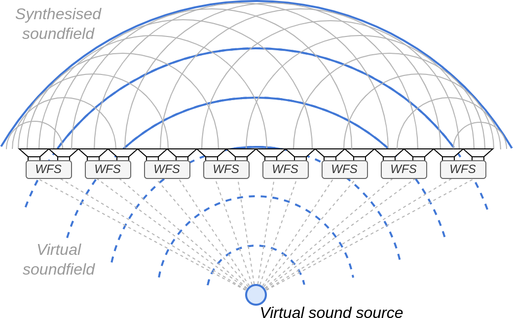

# -*- Mode: org -*-
# -*- coding: utf-8 -*-

#+title: All Together Now: A Synchronous Platform for Distributed Spatial Audio
#+author: Thomas Rushton

#+startup: overview
#+export_file_name: out/smc-2025
#+options: toc:nil num:3 date:nil author:nil
#+latex_class: smc-2025
#+bibliography: smc2025bib.bib
# Bastards want us to use bibtex. Got to create a separate,
# bibtex-compatible file for this paper.
#+cite_export: bibtex
#+latex_header_extra: \RequirePackage[]{./out/smc-2025}

#+begin_abstract
The abstract should be placed at the top left column and should contain about 150-200 words.
#+end_abstract

* About                                                            :noexport:

Org file describing a paper for submission to the 2025 Sound and Music
Computing conference. Submit on [[https://easychair.org/account2/signin?l=8813818998001063168][EasyChair]] by March 3rd.

** What's the cost per channel again?

Excluding the cost of a computer, speakers and cables:

#+begin_src emacs-lisp
(let* ((teensy-cost 31.5)
       (audio-shield-cost 14.4)
       (ethernet-kit-cost 3.9)
       (switch-cost 200)
       (computer-cost 1500)
       (num-ports 24)
       (output-channels-per-port 2)
       (num-channels (* output-channels-per-port num-ports))
       (basic-cost (+ switch-cost
                      (* num-ports
                         (+ teensy-cost audio-shield-cost ethernet-kit-cost))))
       (cost-per-channel (/ basic-cost num-channels))
       (cost-per-channel-with-pc (/ (+ basic-cost computer-cost) num-channels)))
  (format
   (string-join '("€ %.2f %d-channel system"
                  "€ %.2f (incl. computer)"
                  "€ %.2f per channel"
                  "€ %.2f per channel (incl. computer)") "\n")
   basic-cost num-channels
   (+ basic-cost computer-cost)
   cost-per-channel
   cost-per-channel-with-pc))
#+end_src

#+RESULTS:
: € 1395.20 48-channel system
: € 2895.20 (incl. computer)
: € 29.07 per channel
: € 60.32 per channel (incl. computer)

** And how far does sound travel in, e.g., 1 \micro{}s?

#+begin_src emacs-lisp
(let* ((c 343.)
       (time-s 1e-6)
       (cmpm (/ 1. 1e-2))
       (mmpm (/ 1. 1e-3))
       (dist-m (* c time-s)))
  (format "%.2f m\n%.2f cm\n%.2f mm" dist-m (* dist-m cmpm) (* dist-m mmpm)))
#+end_src

#+RESULTS:
: 0.00 m
: 0.03 cm
: 0.34 mm

** Want to calculate PPM?

E.g. -4 ms drift over the course of 600 seconds,
\(1\times10^{6}\frac{-4\times10{-3}}{600}\)

#+begin_src emacs-lisp
(format "%f ppm" (* (/ -4e-3 600) 1e6)) 
#+end_src

#+RESULTS:
: -6.666667 ppm

* LaTeX Setup                                                      :noexport:
:PROPERTIES:
:header-args: :tangle out/smc-2025.sty :results silent
:END:

** Provide the package

#+begin_src latex
\ProvidesPackage{smc-2025}[2025/01/15 v0.1 Bundling SMC 2025 style]
#+end_src

** Packages

The main smc2025 package.

#+begin_src latex
\usepackage{smc2025}
#+end_src

Modern replacement for =subfigure=

#+begin_src latex
\usepackage[caption=false, font=footnotesize]{subfig}
%% \usepackage{subcaption}
#+end_src

Extended list environemnts

#+begin_src latex
\usepackage{paralist}
#+end_src

Hyperref companion

#+begin_src latex
\usepackage[figure,table]{hypcap}
#+end_src

Use this if english is the only language/alphabet used in the document

#+begin_src latex
\usepackage[english]{babel}
#+end_src

I'd prefer to use cleveref.

#+begin_src latex
\usepackage[noabbrev]{cleveref}
#+end_src

Fancy tables (remember ~:booktabs t~).

#+begin_src latex
\usepackage{booktabs}
#+end_src

Microtype tends to be a good idea.

#+begin_src latex
\usepackage{microtype}
#+end_src

I'm going to need some unitz.

#+begin_src latex
\usepackage{siunitx}
\sisetup{
  mode=match
}
#+end_src

Inconsolata looks better.

#+begin_src latex
\usepackage{inconsolata}
#+end_src

** Line numbers

The following command enables line numbers and it is meant for Review
only. It must be removed/commented out for Camera Ready version.

#+begin_src latex
\pagewiselinenumbers
#+end_src

** Authors & Affiliations

#+begin_src latex
\author[1]{\mbox{\firstname{Thomas}\lastname{Rushton}\email{thomas.rushton@inria.fr}}}
\author[1]{\mbox{\firstname{Romain}\lastname{Michon}}}
\author[1]{\mbox{\firstname{Tanguy}\lastname{Risset}}}
\affil[1]{
  \institution{Inria, INSA Lyon}
  \city{CITI, EA3720, 69621 Villeurbanne}
  \country{France}
  \affiliationtype{Research}
}
#+end_src

** Wrap up

#+begin_src latex
\completesetup
#+end_src

* Introduction

Whether operating on a budget of millions, or being an individual or
institution of more modest means, the desire to establish a
large-scale multichannel audio system is one inevitably confronted by
difficult decisions, and one that is at the mercy of factors both
technological and commercial. Beyond the obvious technical concern,
that of /"will the system that I am designing serve the purpose I
intend?"/ lie less comfortable questions such as /"will it still work
in a decade's time?"/ /"what options do I have if I want to extend it
later?"/ and perhaps /"who really owns this?"/

Politics aside, the centralised nature of conventional systems for
spatial and immersive audio renders them inflexible, with limited
scalability and modularity, and costly, being dependent on high
channel-count commercial audio interfaces and machines capable of
performing demanding, real-time signal processing computations. In
short, such systems have an accessibility problem --- one that poses a
significant barrier to research and innovation.

Other, less conventional approaches are possible though, and have, in
recent years, and in various forms, been attempted. From networked
GPUs\nbsp[cite:@bellochPerformance2021] and microcontrollers
\nbsp[cite:@rushtonNetworked2024] to DIY ambisonics domes
\nbsp[cite:@mitterhuberOttosonics2022] and frugal wave field synthesis
arrays\nbsp[cite:@michonMaking2023], efforts are underway to offer
alternatives to the established order, bringing potential benefits, in
terms of cost and scalability, with them. Work of this sort aims to
democratise access to scholarly and creative practice in the sphere of
spatial audio.

In this paper, we present recent advancements to our work on
distributed spatial audio, the latest steps on the road toward an
accessible, scalable multichannel audio system with the strength to
stand as a viable alternative to the commercial state-of-the-art. In
cref:sec:bg we discuss prior work in distributed and frugal spatial
audio; in cref: we outline the key challenges associated with audio in
a distributed context, and our approach to establishing an
all-important /authoritative source of time/ in that context; in
cref:sec:impl we present some preliminary results based on the method
outlined in cref:; we conclude, in cref:sec:conclusion by describing
some outstanding challenges and sharing our aims for future research.

* Background
:PROPERTIES:
:CUSTOM_ID: sec:bg
:END:

The importance of sound in the immersive experience is
well-established\nbsp[cite:@buckEffect2022]; if, however, the auditory
aspect of virtual and extended reality remains comparatively neglected
when considered alongside other sensory
channels\nbsp[cite:@serafinReflections2020], this may be ascribed, in part
at least, to the complexity of, and expense associated with, [creating
immersive audio installations]. Large-scale, multichannel spatial
audio systems are typically very expensive affairs, reliant on
proprietary systems, costly hardware, specialist software and
[etc.]\nbsp[cite:@rushtonNetworked2024]. Particularly in the case of
virtual acoustics [not really...], in which one may wish for numerous
participants to experience the same auditory environment, unencumbered
by headsets and so on, an immersive acoustic environment is desirable,
and yet may lie out of reach, for practial purposes. Thus the
exclusivity of multichannel audio systems has a chilling effect on
research.

- Why spatial audio?
  - immersive auditory experiences, VR, virtual acoustics
- What are typical systems like?
  - MADI/AoE
  - point-to-point vs... multicast
- Why would an alternative be desirable?
- What attempts have been made?
  - Belloch et al., Devonport & Foss
  - Frugal WFS, Ottosonics, DIY/maker community
- Importance of synchronisation
- How to synchronise?
- The ideal platform: requirements
  - The switch too

#+begin_src emacs-lisp :exports none
(let* ((usd-eur .96)
       (cm5 51.72)
       (cm5io 18.07)
       (i2s-hat 18.91)
       (t41 31.5)
       (audio-shield 14.4)
       (ethernet-addon 3.9)
       (rpi (+ cm5 cm5io i2s-hat))
       (teensy (* usd-eur (+ t41 audio-shield ethernet-addon))))
  (format "RPi cost: € %.2f\nTeensy cost: € %.2f" rpi teensy))
#+end_src

#+RESULTS:
: RPi cost: € 88.70
: Teensy cost: € 47.81

#+name: tab:platforms
#+caption: Selected embedded computing platforms listed with their
#+caption: corresponding system on chip (SoC), availaibility of
#+caption: selected functionality, and approximate cost per unit.
#+attr_latex: :float multicolumn :align lllllr :booktabs t
| Platform         | SoC              | Memory      | Ethernet | PTP | Unit Cost |
|------------------+------------------+-------------+----------+-----+-----------|
| Raspberry Pi CM5 | Broadcom BCM2712 | 2 GB SDRAM  | Yes      | Yes | € 89      |
| Teensy 4.1       | NXP iMXRT1062    | 1024 KB RAM | Yes      | Yes | € 48      |
| Daisy Seed       | STM32H750IB      | 65 MB SDRAM | No       | Yes | € 25      |

What does it take synchronise playback on physically separate audio
devices?\nbsp[cite:@friedtSynchronisation2023]

At the risk of labouring the point, we remind the reader that whether
one has a budget of millions, or are compelled to pursue a more frugal
approach, decision-making around the not-inconsiderable endeavour of
establishing a large-scale audio system for research, entertainment, or
other purposes revolves around questions such as
- How well does this technology work?
- How much of a /sunk-cost/ does an installation based on this
  technology represent?
- Will this system still work in several years' time?

** Audio Over Ethernet

Ethernet has, for the past twenty years or so, been the de facto
standard for the transmission of multichannel digital audio
\nbsp[cite:@bakkerIntroduction2014].

** ???

The greater part of the difficulty in such a project lies not
necessarily in the mathematics of sound field synthesis, nor in
writing the code to implement SFS algorithms, but in finding suitable
hardware on which to run the system. One may find, for example, a €30
development board such as the Daisy Seed, well known to the DIY/maker
audio community, well-appointed with memory, easily programmable with
Faust, and /even possessing a MCU with PTP support/, but having no
Ethernet PHY,[fn:2] and thus no way to connect it to a network. There is a
sense in which, short of designing an manufacturing --- at scale --- a
printed circuit board of one's own, the stars must align.

** Precision Time Protocol

PTP is a UDP-based protocol for precise clock synchronisation between
networked devices... Though often associated with more expensive
networking equipment, support for PTP is offered by a number of
low-cost MCUs, including the Broadcom
BCM2711/2712\nbsp[cite:@raspberrypiltd.BCM27112022], as found on the
Raspberry Pi Compute Module 4\nbsp[cite:@raspberrypiltd.Raspberry2023] and
5\nbsp[cite:@raspberrypiltd.Raspberry2024],
STM32H750IB\nbsp[cite:@stmicroelectronicsSTM32H750VB2023] (Daisy Seed),
and NXP iMXRT1060 series\nbsp[cite:@nxpsemiconductorsIMX2021], the
microcontroller utilised by the Teensy 4.1 development board. All of
the above devices are supported by the Faust programming language via
architecture files; =faust2alsa=, =faust2stm32=, and
=faust2teensy=. In addition certain low-cost network switches, chief
amongst these the MikroTik CRS326-24G-2S+ series, provide PTP suport.

** The Importance of Synchronisation

** Motivation

#+attr_org: :width 400
#+attr_latex: :width \linewidth
#+caption: The holophonic illusion of primary-source Wave Field Synthesis
#+caption: is created by applying an appropriate per-loudspeaker delay
#+caption: (indicated by the dashed grey lines) to a virtual sound source.
#+caption: Since the delays for each loudspeaker are independent, they can
#+caption: computed in distributed fashion. The integrity of the
#+caption: synthesised wavefront is contigent on synchronicity amongst the
#+caption: group of distributed processors.

* Implementation
:PROPERTIES:
:CUSTOM_ID: sec:impl
:END:

Teensy's 30-bit clock divider registers.

Taking the nsps ethernet clock adjustment, assuming safely that
ethernet and audio clocks are derived from the same master clock, and
adjust the audio clock accordingly to produce the corresponding
sampling frequency.

It's a simple case of applying the adjustment, \(a\), in nanoseconds, 

#+NAME: eq:fine-num-1
\begin{equation}
f_{s} = \hat{f}_{s}\left(1 + \frac{a}{\num{1e9}}\right)\;.
\end{equation}

For example, should a subscriber, running at a nominal \qty{48}{\kHz},
drift fast over a given second by \qty{1750}{\nano\s}, the new
sampling frequency to be applied should be

#+begin_src emacs-lisp :exports none
(let* ((fs 48e3)
       (drift -1)
       (nsps 1e9)
       (ratio (+ 1 (/ drift nsps)))
       (newfs (* fs ratio))
       (frac-diff (/ 1. (- 48e3 newfs))))
  (format "Ratio: %.9f, new fs: %.9f Hz, fractional diff: 1/%.1f Hz" ratio newfs frac-diff))
#+end_src

#+RESULTS:
: Ratio: 0.999999999, new fs: 47999.999952000 Hz, fractional diff: 1/20833.3 Hz

#+NAME: eq:fs-example
\begin{align*}
f_{s} &= \num{48000}\left(1 + \frac{-1750}{\num{1e9}}\right) \\
  &= \num{48000} \times \num{0.999998925} \\
  &= \qty{47999.916}{\Hz}\;,
\end{align*}
or about \(\frac{1}{12}\)\unit{\Hz} slower. 

* Evaluation                         
:PROPERTIES:
:header-args: :session :exports none
:END:

#+begin_src julia :results none
using CSV, DataFrames, Plots, LaTeXStrings

function plotDrift(dataCategory)
    scalefontsizes(2)
    t41lastBytes = [191, 203, 234]
    maxOffset = 0
    yMax = 0
    # Hell, I had to download Times.
    plot(fontfamily="Times-Roman",
         size=(900, 600),
         margin=6Plots.mm,
         xlabel="Time (s)",
         xtickfontfamily="Computer Modern",
         ytickfontfamily="Computer Modern",
         legendtitle="IP address",
         legendfontsize=14,
         legendfont="Inconsolata-Regular",
         legendtitlefontsize=17,
         gridlinewidth=2);
    for b in t41lastBytes
        local data = CSV.read("./data/$b-$dataCategory.csv", DataFrame; header=["offset"], limit=600)
        data.offset .= data.offset .- data.offset[1]
        # Prevent `noptp` data for client 191 from wrapping.
        if b == 191 && dataCategory == "noptp"
            data.offset[391:end] .= data.offset[391:end] .+ (data.offset[390] - data.offset[391])
        end
        plot!(data.offset, label="x.x.48.$b", linewidth=3)

        # Get order-of-magnitude info
        max = maximum(abs.(data.offset))
        if max > maxOffset
            maxOffset = max
        end
        max = maximum(data.offset)
        if max > yMax
            yMax = max
        end
    end

    ordOfMag = floor(Int, log10(maxOffset))
    ordOffset = 7.5e-8
    if dataCategory == "noptp"
        ordOffset = 3.0e-4
        plot!(ylabel="Offset (s)")
    end
    annotate!(6, yMax + ordOffset, (latexstring("\$\\times10^{$(ordOfMag)}\$"), 18))
    plot!(yformatter=y -> string(y / 10.0^ordOfMag))

    savefig("./figures/$dataCategory.png")
    scalefontsizes()
end
#+end_src

#+begin_src julia :results file graphics :file noptp.png :output-dir ./figures
plotDrift("noptp")
#+end_src
#+attr_org: :width 400
#+RESULTS:
[[file:./figures/noptp.png]]

#+begin_src julia :results file graphics :file ptp.png :output-dir ./figures
plotDrift("ptp")
#+end_src
#+attr_org: :width 400
#+RESULTS:
[[file:./figures/ptp.png]]

#+name: fig:results
#+caption: Audio reproduction offsets for three MCU audio clients with respect to an MCU audio server.
#+caption: Server and clients reproducing a \qty{1}{\Hz} impulse train.
#+caption: Measurements triggered at the onset of the impulse produced by the server MCU,
#+caption: i.e. once per second for a total of ten minutes.
#+caption: For details of the test procedure, see cref:sec:setup.
\begin{figure*}[t]
    \subfloat[Without sampling frequency correction.]{\includegraphics[width=0.5\textwidth]{figures/noptp}\label{fig:noptp}}
    \subfloat[With sampling frequency correction.]{\includegraphics[width=0.5\textwidth]{figures/ptp}\label{fig:ptp}}
\end{figure*}

# #+name: fig:fig
# #+caption: plots of....
# #+begin_figure*
# #+name: fig:sfig1
# #+attr_latex: :options {0.4\textwidth}
# #+caption: Hi
# #+begin_subfigure
# #+attr_latex: :width 0.4\textwidth
# [[./figures/noptp.png]]
# #+end_subfigure
# #+name: fig:sfig2
# #+attr_latex: :options {0.4\textwidth}
# #+caption: Yo
# #+begin_subfigure
# #+attr_latex: :width 0.4\textwidth
# [[./figures/ptp.png]]
# #+end_subfigure
# #+end_figure*

** Measurement Setup
:PROPERTIES:
:CUSTOM_ID: sec:setup
:END:

Four MCUs, one running as clock authority, three as clock subscribers,
were connected to the MikroTik CRS326-24G-2S+IN ethernet switch, which
was configured to act as a PTP boundary clock. The clock authority
also acted as an audio server, generating a \qty{1}{\Hz} impulse train
and sending packets of audio data, timestamped \qty{1}{\ms} later than
the measured instant of transmission, to the network on a multicast
UDP address; additionally, the clock authority stored the outgoing
packets in a ring buffer for reproduction by its own audio
subsystem. Clock subscribers joined the multicast group, acting as
audio clients, receiving audio packets from the server and writing
these to their own respective ring buffers. On audio system startup,
server and clients selected the audio packet timestamped closest to
the instantaneous time reported by their own PTP reference clock;
subsequently, all MCUs reproduced packets sequentially.

A digital logic analyser (Digilent Analog Discovery 2) was connected
to the I^{2}S data pin of each MCU, and accompanying software (Digilent
/WaveForms/ v. 3.23.4) used for data capture; the software's /Logic/
mode was used, and set up to trigger a capture when the
server/clock-authority reproduced an impulse. At each capture, the
reproduction offset for each client/clock-subscriber relative to the
server was measured and written to a CSV file.

Two test conditions were employed. For the first test,
clock-subscribers did not apply PTP-derived audio sampling frequency
correction, simply running at a nominal \qty{48}{\kHz} as derived from
the frequency of their interal crystal oscillator. For the second,
sampling frequency adjustments were made according to the method
described in cref:sec:impl.

** Results

Measurements for the two test conditions are visualised in
cref:fig:results. In the absence of any manner of sampling frequency
correction, cref:fig:noptp essentially reports raw, quasi-linear clock
drift for the three clients relative to the server, with two running
faster than the server, the other slightly slower. The client with IP
address \texttt{x.x.48.234} exhibits the most significant drift,
\sim\qty{4}{\ms} over the course of ten minutes equating to around 6.7
ppm.[fn:3] Assuming a sound propagation speed of \qty{343}{\m\per\s},
in a practical application the inter-client spread of approaching
\qty{5}{\ms} at the end of the ten minutes would correspond with a
propagation discrepancy of roughly \qty{1.72}{\m}.

Cref:fig:ptp is the equivalent plot for clients with sampling rate
correction applied. While some drift remains, note that it is three
orders of magnitude less severe than in the correction-free case. Once
again, \texttt{x.x.48.234} displays the greatest asynchronicity; now,
however, its \qty{1}{\micro\s} over ten minutes represents less than 1.7
parts per /billion/. At the end of the test, the three clients are are
separated by an interval of just over \qty{1}{\micro\s}, corresponding to a
propagation discrepancy of less than half a millimetre; we have
improved from a scale comparable with the height of an adult human ---
sufficient to obliterate the integrity of any attempt at sound field
synthesis --- to an order of magnitude below the diameter of the
tympanic membrane.

Interestingly, and lending encouragement to the hope that further
improvements are within reach, the remaining audio drift appears to be
inversely proportional to the raw drift, with client
\texttt{x.x.48.191} now tending very slightly fast, whereas previously
it was lagging.

* Discussion

If one were to identify a /weak link/ in the proposed system, that
might be the ethernet switch. Its manufacturer, Latvian enterprise
MikroTik, is not what one might call a household name,[fn:1] and it is
striking that their 24-port, PTP-compliant, managed switch is offered
at the comparatively low price of around €200 at the time of writing
--- Dante-enabled switches tend to be up to an order of magnitude more
expensive. To support more than a notional 48 output channels it would
be necessary to daisy-chain switches; from a technical perspective, it
is not known at the present time whether the PTP implementation on the
MikroTik device can function effectively in such a configuration.

* Page size and format

The SMC 2025 proceedings will be formatted as portrait _A4-size papers
(21.0 cm x 29.7 cm)_. All material on each page should fit within a
rectangle of 17.2 cm x 25.2 cm, centered on the page, beginning 2.0 cm
from the top of the page and ending with 2.5 cm from the bottom. The
left and right margins should be 1.9 cm. The text should be in two
8.2 cm columns with a 0.8 cm gutter. All text must be in a two-column
format, and justified.  The maximum allowed length is *8 pages*
(for both lecture and poster presentations). However, a length of
*6 pages* is _strongly encouraged_.

* Floats and Equations 

** Equations

Equations sholud be placed on separated lines and numbered. The number
should be on the right side, in parentheses.

#+NAME: eq:BP
\begin{equation}
r = \sqrt[13]{3}
\end{equation}

Always refer to equations like this: "Cref:eq:BP is of
particular interest because..."

** Figures, Tables and Captions

#+name: tab:example
#+caption: Table captions should be placed below the table, like this.
#+attr_latex: :align |l|l| :placement [t]
|-------------+---------------|
| String Name | Numeric Value |
|-------------+---------------|
| Moin! SMC   |          2025 |
|-------------+---------------|

Always refer to tables and figures in the main text, for example:
"see Cref:fig:example and Cref:tab:example".

#+name: fig:example
#+caption: Figure captions should be placed below the figure, exactly like this.
#+attr_latex: :placement [t] :width 0.6\columnwidth
[[./figure.pdf]]

* Citations

All bibliographical references should be listed at the end, inside a
section named "REFERENCES". References must be numbered in order of
appearance. You should avoid listing references that do not appear in
the text.  Reference numbers in the text should appear within square
brackets, such as in\nbsp[cite:@Someone:00] or\nbsp[cite:@Someone:00;
@Someone:04; @Someone:09]. The reference format is the standard IEEE
one. We highly recommend you use BibTeX to generate the reference
list.

* Conclusion and Future Work
:PROPERTIES:
:CUSTOM_ID: sec:conclusion
:END:

One key area of research that we wish to explore in the future is that
of virtual acoustics and auralization. The creation of virtual
acoustic environments demands the execution of real-time
impulse-response convolutions, which in turn imposes the requirement
that a node in a distributed DSP system possess the computational
power to perform such a convolution, the memory required to store the
impulse respose, and sufficiently performant access to that memory for
real-time processing. 

#+print_bibliography:

* Footnotes
[fn:3] Which suggests that, for this collection of devices at least,
the Teensy 4.1 uses a reasonably high-quality crystal oscillator.

[fn:2] An ethernet PHY, or /physical layer interface/, facilitates the
connection between a SoC and the physical LAN bus --- a twisted-pair
cable or fiberoptic connection for
example\nbsp[cite:@stmicroelectronicsSTM32H750VB2023].

[fn:1] Boosting hopes of the continued availability of their very
useful ethernet switch, MikroTik has (according to its own reports)
existed as a company for over twenty years ---
[[https://mikrotik.com/aboutus]].

* Local Variables                                                  :noexport:

# Local Variables:
# org-latex-caption-above: nil
# org-latex-classes: (("smc-2025" "\\documentclass{article}
# [NO-DEFAULT-PACKAGES]"
# ("\\section{%s}" . "\\section*{%s}")
# ("\\subsection{%s}" . "\\subsection*{%s}")
# ("\\subsubsection{%s}" . "\\subsubsection*{%s}")
# ("\\paragraph{%s}" . "\\paragraph*{%s}")
# ("\\subparagraph{%s}" . "\\subparagraph*{%s}")))
# End:
