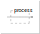
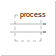
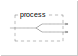
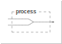
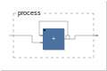
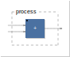
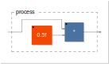

# -*- coding: utf-8 -*-
# -*- mode: org -*-

#+TITLE: Faust 101
#+AUTHOR: Thomas Rushton

#+OPTIONS: num:nil toc:nil reveal_width:1200 reveal_height:800 ^:{} ':t
#+EXPORT_FILE_NAME: index
#+PROPERTY: header-args:faust :line-numbers false
#+PROPERTY: header-args:css :tangle yes :results none :exports none
#+PROPERTY: header-args:js :tangle yes :results none :exports none
#+REVEAL_ROOT: ../reveal.js
#+REVEAL_THEME: white
#+REVEAL_PLUGINS: (math)
#+REVEAL_EXTRA_CSS: ccrma-2024.css
#+REVEAL_MIN_SCALE: 1.0
#+REVEAL_MAX_SCALE: 1.0
#+REVEAL_EXTRA_OPTIONS: hash: true, fragmentInURL: true
#+REVEAL_EXTRA_SCRIPTS: ("dist/ccrma.js")
#+REVEAL_TITLE_SLIDE: <h1>%t</h1><h2>%s</h2><h3>%a</h3>

* About This Presentation                                          :noexport:

This =org= file describes my Faust 101 workshop at CCRMA, delivered on
October 27th 22024.

** Dependencies

- =org-re-reveal= ([[https://gitlab.com/oer/org-re-reveal/-/tree/main][gitlab]]), which enables export support from Org to [[https://revealjs.com/][Reveal.js]].
- =faust-web-component.js=, which provides a customised version of the
  ~<faust-editor>~ [[https://github.com/grame-cncm/faust-web-component][web component]] with support for specifying
  attributes and styling the content area of the component.
  =package.json= was created by running ~npm create vite@latest~ and
  copying the resulting file into the directory containing /this/
  file, then running the following:
  #+begin_src shell :results none
  npm install --save https://github.com/hatchjaw/faust-web-component/tree/a85d131231ee95b0b94373433a71b85cf5c47743
  #+end_src
- =ob-faust= ([[https://github.com/hatchjaw/ob-faust][github]]), which adds (basic) support for Faust to Org Babel.
- Emacs =faust-mode=, modified slightly to fix syntax highlighting in
  source blocks.

** Running the Presentation

Tangle JS

#+begin_src js :results none :tangle ./vite.config.js
import { resolve } from 'path'
import { defineConfig } from 'vite'

export default defineConfig({
    build: {
        minify: false,
        lib: {
            entry: resolve(__dirname, "ccrma-2024.js"),
            name: "ccrma",
            fileName: () => "ccrma.js",
        },
        sourcemap: true,
    }
});
#+end_src

#+begin_src js
import '@grame/faust-web-component/src/main'

Reveal.on('slidechanged', () => document.querySelectorAll('faust-editor')
	   .forEach(f => f.shadowRoot.querySelector('#stop')
		    .dispatchEvent(new Event('click'))))
#+end_src

and CSS

#+begin_src css
.org-src-container > pre {
    padding: 1em;
    width: 66.6%;
}

.title-page > h2 {
    color: #ededed;
}

.faust-editor-wrap {
    font-size: 1.75rem;
}

faust-editor::part(editor) {
    height: 8em;
}
    #+end_src

Then, from the reveal.js directory (=../reveal.js=), run:

#+begin_src shell :noeval :exports code
npm start -- --root=../
#+end_src

Then navigate to [[localhost:8000/ccrma-2024/]].

* Whom?

#+ATTR_HTML: :width 600px :style margin: 0;

#+ATTR_REVEAL: :frag (appear)
- Born: Manchester, UK, 1985
- BMus Music Technology, The University of Edinburgh, 2009
- Musician, application developer, web developer
- MSc Sound & Music Computing, Aalborg University (Copenhagen) 2023
- PhD, /Enabling Distributed Spatial Audio/, INSA/Inria, Lyon 2023---

* Faust 101
:PROPERTIES:
:reveal_background: #141414
:reveal_extra_attr: class="title-page"
:END:

* What is Faust?

#+ATTR_REVEAL: :frag (appear)
- A /domain-specific language/ for real-time audio.
- A language of signals and signal processors.
- A functional paradigm language.
- A compiled language that produces highly optimized output.

* Why use Faust?

#+ATTR_REVEAL: :frag (appear)
- Dispense with boilerplate; just write audio code.
- Prototype code in the Web IDE (or embeddable web component).
- Export from the Web IDE:
  #+ATTR_REVEAL: :frag (appear)
  + JUCE projects
  + Microcontrollers, single-boards
  + Game engines
  + Rust, Julia, JSFX, CMajor...

* Writing Faust Code
:PROPERTIES:
:reveal_background: #141414
:reveal_extra_attr: class="title-page"
:END:

* A really basic Faust program

#+begin_src faust :results file svg :file images/wire.svg :exports both
process = _;
#+end_src
#+attr_html: :width 300px
#+RESULTS:

** Parallel composition
#+begin_src faust :results file svg :file images/stereo.svg :exports both
process = _,_;
#+end_src
#+attr_html: :width 300px
#+RESULTS:

** Sequential composition
#+begin_src faust :results file svg :file images/swap.svg :exports both
process = _,_ : +;
#+end_src
#+attr_html: :width 400px
#+RESULTS:
[[file:images/swap.svg]]

** Split composition
#+begin_src faust :results file svg :file images/mono-to-stereo.svg :exports both
process = _ <: _,_;
#+end_src
#+attr_html: :width 400px
#+RESULTS:

** Merge composition
#+begin_src faust :results file svg :file images/stereo-to-mono.svg :exports both
process = _,_ :> _;
#+end_src
#+attr_html: :width 400px
#+RESULTS:

** Recursive composition
#+begin_src faust :results file svg :file images/rec-add.svg :exports both
process = + ~ _;
#+end_src
#+attr_html: :width 500px
#+RESULTS:

** Arithmetic
Implicit
#+begin_src faust :results none
process = +;
#+end_src

Explicit
#+begin_src faust :results file svg :file images/add.svg :exports both
process = _,_ : + : _;
#+end_src
#+attr_html: :width 400px
#+RESULTS:

#+REVEAL: split
Infix syntax
#+begin_src faust :results none
process = _*(0.5);
#+end_src

Prefix syntax
#+begin_src faust :results none
process = *(0.5);
#+end_src

Core syntax
#+begin_src faust :results file svg :file images/gain.svg :exports both
process = _,0.5 : *;
#+end_src
#+attr_html: :width 600px
#+RESULTS:

** Add a UI

#+begin_src faust :results html :exports results :tab ui :sizes 50,50
process = hslider("gain", 0.5, 0, 1, .01),_ : *;
#+end_src

#+RESULTS:
#+begin_export html

<faust-editor sizes="[50,50]" tab="ui" lineNumbers="false">
<!--
process = hslider("gain", 0.5, 0, 1, .01),_ : *;
-->
</faust-editor>

#+end_export

** Use the Faust Libraries

#+begin_src faust :results html :exports results :tab ui :sizes 50,50
import("stdfaust.lib");
process = no.noise,hslider("gain", 0.1, 0, 1, .01) : *;
#+end_src

#+RESULTS:
#+begin_export html

<faust-editor sizes="[50,50]" tab="ui" lineNumbers="false">
<!--
import("stdfaust.lib");
process = no.noise,hslider("gain", 0.1, 0, 1, .01) : *;
-->
</faust-editor>

#+end_export

** Iterate

#+begin_src faust :results html :exports results :tab ui :sizes 50,50
import("stdfaust.lib");
N = 3;
freq = hslider("freq", 200, 100, 300, .01);
process = sum(i, N, os.osc((i + 1) * freq)) / N;
#+end_src

#+RESULTS:
#+begin_export html

<faust-editor sizes="[50,50]" tab="ui" lineNumbers="false">
<!--
import("stdfaust.lib");
N = 3;
freq = hslider("freq", 200, 100, 300, .01);
process = sum(i, N, os.osc((i + 1) * freq)) / N;
-->
</faust-editor>

#+end_export

* The Faust Web IDE

[[https://faustide.grame.fr]]

* Emacs setup                                                      :noexport:

# Local Variables:
# eval: (add-hook 'org-export-before-processing-functions
# (lambda (backend)
# (interactive)
# (message "building js...")
# (shell-command-to-string "npm run build")))
# End:
