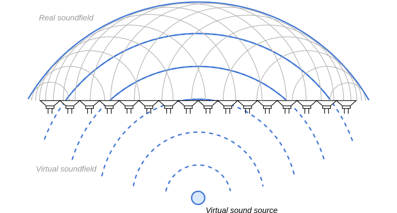
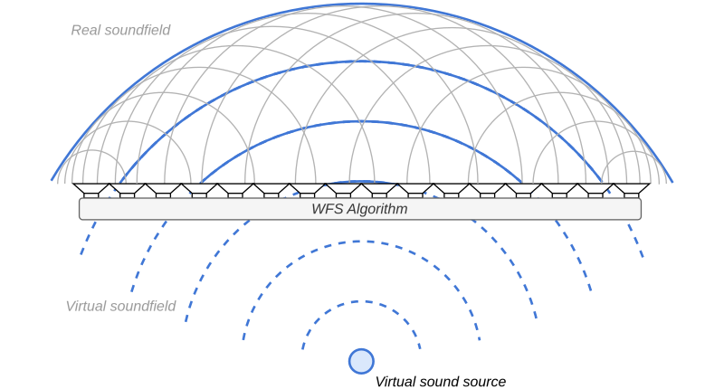
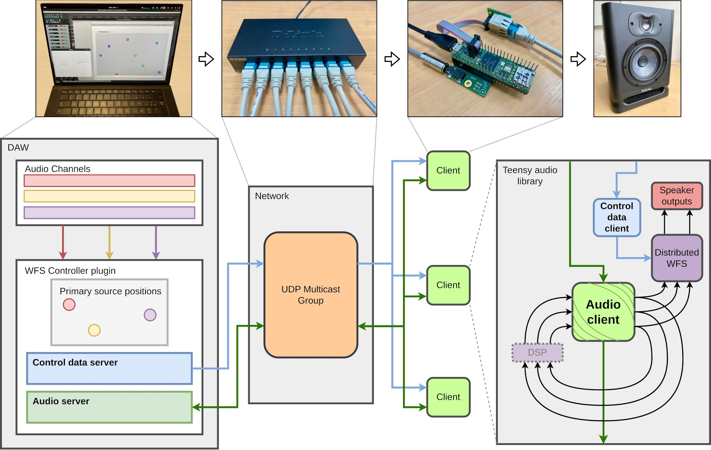
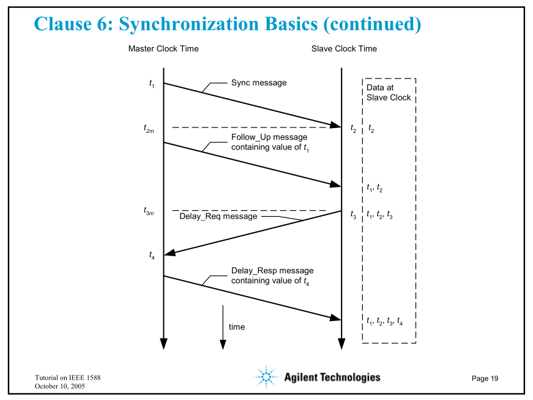
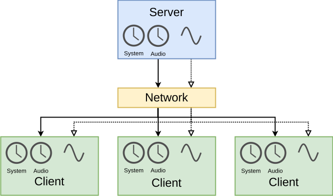
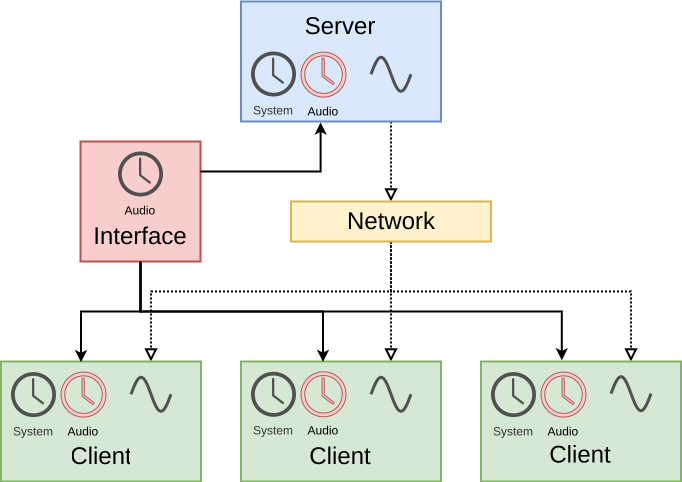

# -*- coding: utf-8 -*-
# -*- mode: org -*-

#+TITLE: Enabling Distributed Spatial Audio
#+SUBTITLE: Thesis Committee --- Year 1
#+AUTHOR: Thomas Rushton

#+OPTIONS: num:nil toc:1 ^:{} ':t
#+OPTIONS: reveal_width:1200 reveal_height:800 reveal_slide_number:c/t
#+EXPORT_FILE_NAME: index
#+REVEAL_ROOT: ../reveal.js
#+REVEAL_THEME: white
#+REVEAL_TRANS: slide
#+REVEAL_PLUGINS: (math)
#+REVEAL_EXTRA_CSS: style.css
#+REVEAL_MIN_SCALE: 1.0
#+REVEAL_MAX_SCALE: 1.0
#+REVEAL_EXTRA_OPTIONS: hash: true, fragmentInURL: true
#+REVEAL_TITLE_SLIDE: <h1>%t</h1><h2>%s</h2><h3>%a</h3>
#+REVEAL_TITLE_SLIDE_BACKGROUND: #141414
#+REVEAL_TITLE_SLIDE_EXTRA_ATTR: class="title-slide"

* About This Presentation                                          :noexport:

This =org= file describes my presentation for my first year /Comité de
Suivi Individuel/.

** Dependencies

- =org-re-reveal= ([[https://gitlab.com/oer/org-re-reveal/-/tree/main][gitlab]]), which enables export support from Org to [[https://revealjs.com/][Reveal.js]].

** Running the Presentation

From the reveal.js directory (=../reveal.js=), run:

#+begin_src shell :noeval :exports code
npm start -- --root=../
#+end_src

Then navigate to [[localhost:8000/csi-year1/]].

* About Me

#+ATTR_REVEAL: :frag (appear)
- Name: Thomas Albert Rushton
- Born: Manchester, UK, 1985
- BMus Music Technology, The University of Edinburgh, 2009
- Employment
  #+ATTR_REVEAL: :frag (appear)
  + Performing arts technician
  + Musician, bicycle mechanic
  + Computer programmer, print industry
  + Web application developer
  + Contractor, Freelancer
- MSc Sound & Music Computing, Aalborg University (Copenhagen) 2023
  #+ATTR_REVEAL: :frag (appear)
  + Internship, Inria/Emeraude, 2022

* Distributed Spatial Audio
:PROPERTIES:
:reveal_background: #141414
:reveal_extra_attr: class="title-slide"
:END:

** Wave Field Synthesis

Synthesise a wavefront via secondary point sources

#+ATTR_REVEAL: :frag t
/Holophony/

** Motivation

WFS systems are typically centralised, /in situ/ installations

#+ATTR_REVEAL: :frag t
Lots of output channels --- costly
#+ATTR_REVEAL: :frag t
€150-250/channel

#+REVEAL: split

[[./images/wfs3.svg]]

What if we could distribute the work?

#+ATTR_REVEAL: :frag t
/Synchronicity/ will be important

** A Distributed Alternative

#+begin_quote
"A distributed system is a collection of independent entities that
cooperate to solve a problem that cannot be individually solved."
#+end_quote
#+begin_export html
<small>
#+end_export
Kshemkalyani & Singhal, /Distributed Computing: Principles,
Algorithms, and Systems/, 2011.
#+begin_export html
</small>
#+end_export

#+ATTR_REVEAL: :frag (appear)
- Scalabale, modular
- Entities act independently
- Incrementally extensible
- Reduced cost-per-channel
- Improved accessibility

** Requirements

#+ATTR_REVEAL: :frag (appear)
- A source of audio and control data
  #+ATTR_REVEAL: :frag (appear)
  + General purpose computer
  + Standalone software/audio plugin
- A means of transmission
  #+ATTR_REVEAL: :frag (appear)
  + Ethernet is the standard for multichannel audio
  + UDP --- basis for OSC, RTP, PTP
  + AVB/AES67 --- suites of technical standards
- A collection of recipients for that data
  #+ATTR_REVEAL: :frag (appear)
  + Low-cost computing platform
  + Support for audio and ethernet
- An authoritative source of time
  #+ATTR_REVEAL: :frag (appear)
  + PTP... but enabled hardware increases costs
  + Possible as a software implementation?

* Prior Work
:PROPERTIES:
:reveal_background: #141414
:reveal_extra_attr: class="title-slide"
:END:

** First Iteration

#+ATTR_REVEAL: :frag (appear)
- Based on the /Teensy 4.1/ microcontroller development board
- Served by standalone software
- Audio server: JackTrip
  #+ATTR_REVEAL: :frag (appear)
  + Unicast only
  + Not truly cross-platform

#+ATTR_REVEAL: :frag t
T. A. Rushton, R. Michon, S. Letz, 2023, "A Microcontroller-Based
Network Client Towards Distributed Spatial Audio", /Proceedings of
the 2023 Sound and Music Computing Conference (SMC-23)/.

** Second Iteration

#+ATTR_REVEAL: :frag (appear)
- Teensy 4.1
- VST plugin
- Bespoke multicast server

#+REVEAL: split

#+ATTR_HTML: :width 1000px

#+REVEAL: split

T. A. Rushton, R. Michon, S. Serafin, T. Risset, S. Letz, "Networked
Microcontrollers for Accessible, Distributed Spatial Audio", /under
review/.

* Challenges
:PROPERTIES:
:reveal_background: #141414
:reveal_extra_attr: class="title-slide"
:END:

** Time

/Jitter/ and /clock drift/

#+ATTR_REVEAL: :frag t
Neither prior system featured a truly authoritative source of time

#+ATTR_REVEAL: :frag t
Time inferred from the rate of network transmission

#+ATTR_REVEAL: :frag t
Jitter compensation via a /delay-locked loop/

#+ATTR_REVEAL: :frag t
Clock drift compensation via PLL adjustments

#+REVEAL: split

Clients synchronised to ~500 \micro{}s, dependent on:
#+ATTR_REVEAL: :frag (appear)
- Sampling rate
- Buffer size
- Jitter buffer r/w delta

#+ATTR_REVEAL: :frag t
Assuming $c =$ 343 m/s, up to 17 cm propagation discrepancy

#+ATTR_REVEAL: :frag t
[[./images/wfs4.svg]]

#+REVEAL: split

Clients /experience/ clock drift and jitter differently

#+ATTR_REVEAL: :frag t
Relative inter-client temporal movement may cause audible phasing

#+ATTR_REVEAL: :frag t
Perhaps not sufficient to completely undermine the holophonic effect

** Potential Solutions
:PROPERTIES:
:reveal_background: #141414
:reveal_extra_attr: class="title-slide"
:END:

** Clock Conditioning

[[./images/conditioning1.svg]]

Server sends audio and clock data over the network
#+ATTR_REVEAL: :frag t
Client clocks are /conditioned/ to follow the server

#+REVEAL: split

#+ATTR_HTML: :width 700px

John C. Edison, 2005, "IEEE 1588 Basics", /Proceedings of the 2005
Conference on IEEE 1588 Standard for a Precision Clock Synchronization
Protocol for Networked Measurement and Control Systems/.

#+REVEAL: split

#+ATTR_REVEAL: :frag (appear)
- Audio and system clocks derived from the same crystal oscillator,
  but distinct
- Is it possible to count ticks of the server's audio clock?
- If so, can this be done in cross-platform fashion?
- For a software PTP implementation, how do we cope with the chaos of
  the network?

#+REVEAL: split

** Clock Sharing

#+ATTR_REVEAL: :frag (appear)
- Audio timing governed by a device whose audio clock we can access, and share with all clients
- Demands an extra cable per client
- Amplification of the clock signal

** Other Challenges

#+ATTR_REVEAL: :frag t
Difficult to develop and test
#+ATTR_REVEAL: :frag t
Certain fundamental assumptions of digital audio can no longer be
taken for granted
#+ATTR_REVEAL: :frag t
E.g. even with a shared clock, how do we synchronise interrupts?
  
* Outlook
:PROPERTIES:
:reveal_background: #141414
:reveal_extra_attr: class="title-slide"
:END:

** Establish Authoritative Source of Time

#+ATTR_REVEAL: :frag (appear)
- Identify candidate hardware platform
  #+ATTR_REVEAL: :frag (appear)
  + Bare-metal Raspberry Pi --- Circle
  + Better audio quality
  + More memory; longer jitter buffer
  + Can its clock be adjusted on the fly?
  + Can it be run as an audio interface?
  + Availability less of an issue; old models may suffice
  + No multicast (yet)
  + No =faust2circle= (yet)
- Make progress with software PTP...
- ...Or pursure clock sharing

** Then...

#+ATTR_REVEAL: :frag (appear)
- Improve software systems
  + Integrity of server and client implementations
  + Documentation, installation, workflow
  + Optimise reproducibility, accessibility
- Explore extensions to WFS
- Parallelisability of ambisonics

* Thank you
:PROPERTIES:
:UNNUMBERED: notoc
:END:
