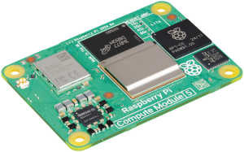
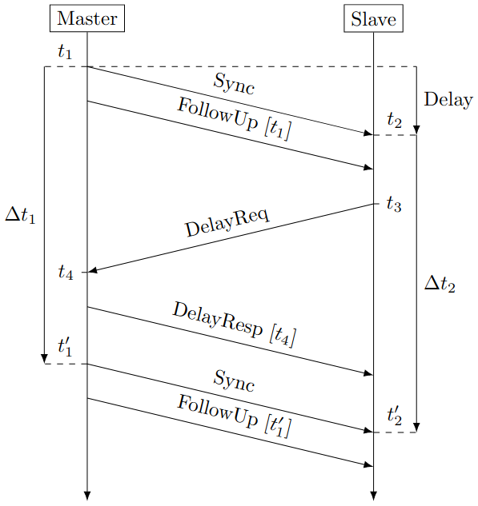
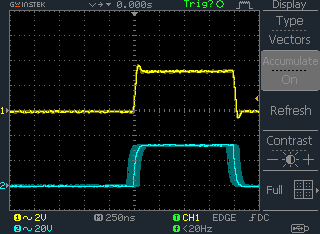
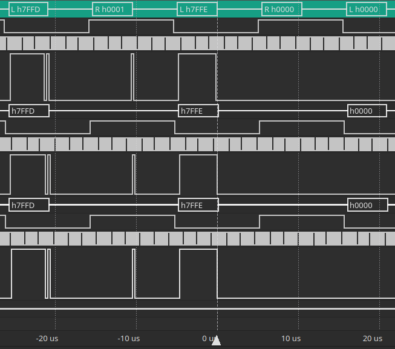
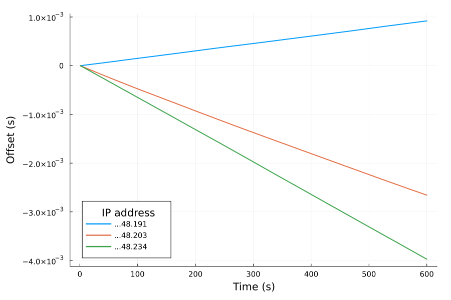
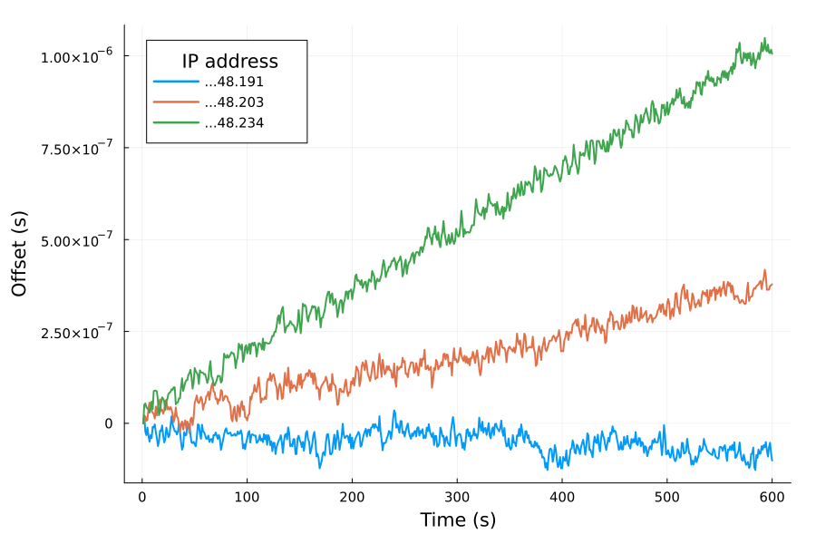
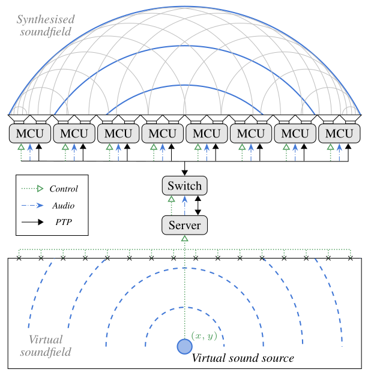

#+title: Enabling Distributed Spatial Audio
#+subtitle: Thesis Committee --- Year 2
#+author: Thomas Rushton

#+options: num:nil toc:nil
#+options: reveal_width:1500 reveal_height:1000 reveal_slide_number:c/t
#+export_file_name: index
#+property: header-args:css :results none :exports none :tangle ./style.css
#+reveal_root: ../reveal.js
#+reveal_theme: white_contrast_compact_verbatim_headers
#+reveal_trans: slide
#+reveal_plugins: (math)
#+reveal_extra_css: style.css
#+reveal_min_scale: 1.0
#+reveal_max_scale: 1.0
#+reveal_extra_options: hash: true, fragmentInURL: true
#+reveal_title_slide: <h1>%t</h1><h2>%s</h2><h3>%a</h3>
#+reveal_title_slide_background: #141414
#+reveal_title_slide_extra_attr: class="title-slide"

* About This Presentation                                          :noexport:

This =org= file describes my presentation for my second year /Comité de
Suivi Individuel/, to be held on May 27th 2025.

** Dependencies

- =org-re-reveal= ([[https://gitlab.com/oer/org-re-reveal/-/tree/main][gitlab]]), which enables export support from Org to [[https://revealjs.com/][Reveal.js]].

** Running the Presentation

From the reveal.js directory (=../reveal.js=), run:

#+begin_src shell :noeval :exports code
npm start -- --root=../
#+end_src

Then navigate to [[http://localhost:8000/csi-year2]].

* CSS                                                              :noexport:
** Symlink to =~/org/fonts=

#+begin_src emacs-lisp :results none :export none :eval yes
(dired-make-relative-symlink "../../fonts" "fonts" t)
#+end_src

** Typography

Define some fonts. Useful info [[https://www.digitalocean.com/community/tutorials/how-to-load-and-use-custom-fonts-with-css#loading-a-self-hosted-font-with-font-face][here]].

#+begin_src css
@font-face {
    font-family: "MyMinion";
    src:
        local("MinionPro-Regular"),
        url("fonts/minionpro/MinionPro-Regular.otf") format("opentype");
    font-weight: 400;
    font-style: normal;
}

@font-face {
    font-family: "MyMinion";
    src:
        url("fonts/minionpro/MinionPro-It.otf") format("opentype");
    font-weight: 400;
    font-style: italic;
}

@font-face {
    font-family: "MyMinion";
    src:
        url("fonts/minionpro/MinionPro-Semibold.otf") format("opentype");
    font-weight: 600;
    font-style: normal;
}

@font-face {
    font-family: "MyMinion";
    src:
        url("fonts/minionpro/MinionPro-Bold.otf") format("opentype");
    font-weight: 800;
    font-style: normal;
}
#+end_src

Now override some of reveal's variables.

#+begin_src css
:root {
    --r-main-font: "MyMinion";
    --r-main-font-size: 42px;
    --r-heading-font: "MyMinion";
    --r-code-font: "Iosevka Comfy Motion";
    --r-heading-text-transform: none;
}
#+end_src

*** Headings

Decorate my h2's and h3's.

#+begin_src css
.stack h2, .stack h3 {
    text-decoration: underline 3px #bbb;
}
#+end_src

*** Figures

#+begin_src css
.reveal figure {
    margin-top: 0;
}
#+end_src

*** Use old style numbers

#+begin_src css
body {
    font-variant-numeric: oldstyle-nums;
}
#+end_src

But not in code blocks

#+begin_src css
.reveal pre {
    font-variant-numeric: normal;
}
#+end_src

*** Font size utility classes

Captions

#+begin_src css
.caption {
    font-size: .6em;
}
#+end_src

Big equations

#+begin_src css
.big-eqn {
    font-size: 1.5em;
}

.huge-eqn {
    font-size: 2em;
}
#+end_src

** Code blocks

Improve code block appearance.

#+begin_src css
.reveal pre {
    padding: 1em;
    width: 66.6%;
    box-shadow: none;
    background: #efefef;
    font-size: .7em;
}
#+end_src

** Tables

#+begin_src css
.reveal table th, .reveal table td {
    text-align: center;
}

.reveal table td {
    border: none;
}
#+end_src

* Agenda
#+ATTR_REVEAL: :frag (appear)
- The search for a suitable hardware platform
- Time exchange \to Sampling frequency exchange
- A sample-synchronous, distributed audio system
- Hopes & concerns for future work

* Technical Foundations
:PROPERTIES:
:reveal_background: #141414
:END:

** Candidate Hardware Platforms
:PROPERTIES:
:reveal_extra_attr: data-auto-animate
:END:

| Raspberry Pi CM5 |  |
| Teensy 4.1       | [[./images/t41.png]] |

** Candidate Hardware Platforms
:PROPERTIES:
:reveal_extra_attr: data-auto-animate
:END:

|                  |                  | CPU     | Memory         | Cost |
|------------------+------------------+---------+----------------+------|
| Raspberry Pi CM5 |  | 1.5 GHz | 1 GB+          | € 89 |
| Teensy 4.1       | [[./images/t41.png]] | 600 MHz | 1 MB (+ 16 MB) | € 48 |

#+begin_quote
Cost includes networking and audio add-ons.
#+end_quote

** Candidate Hardware Platforms
:PROPERTIES:
:reveal_extra_attr: data-auto-animate
:END:

|  | [[./images/t41.png]] |

Both capable of dynamic audio clock adjustments.

#+ATTR_REVEAL: :frag t
Both support IEEE 1588 Precision Time Protocol...

** Candidate Hardware Platforms
:PROPERTIES:
:reveal_extra_attr: data-auto-animate
:END:

|                  | Programmable                        | PTP        |
|------------------+-------------------------------------+------------|
|  | Linux or bare metal (/Circle/)        | =linuxptp=   |
| [[./images/t41.png]] | RTOS/Zephyr or bare metal (/Arduino/) | Bare metal |

** Candidate Hardware Platforms
:PROPERTIES:
:reveal_extra_attr: data-auto-animate
:END:

|                  | I^{2}S Clock                   | Clock Resolution |
|------------------+-----------------------------+------------------|
|  | GPIO                        | 12 bits          |
| [[./images/t41.png]] | /Synchronous Audio Interface/ | 30 bits          |

#+ATTR_REVEAL: :frag t
#+begin_quote
Teensy core codebase uses a denominator register value of \(1\times10^{4}\); no
impediment to using \(1\times10^{9}\).
#+end_quote

** Candidate Hardware Platforms
:PROPERTIES:
:reveal_extra_attr: data-auto-animate
:END:

Broadcom BCM2835, 12-bit fractional clock divider register --- ~DIVF~ (\(D_{f}\))

#+ATTR_REVEAL: :frag t
\begin{equation}
F_{s} = \frac{500\times10^{6}}{2^{6}(D_{i} + \frac{D_{f}}{4096})}
\end{equation}

#+begin_src emacs-lisp :results output :exports results
(let ((divf 3111))
  (while (< divf 3119)
    (princ (format "DIVF = %d :: Fs = %.12f\n" divf
                   (/ (/ 500e6 (+ 162 (/ (float divf) 4096))) 64)))
    (setq divf (1+ divf)))))
#+end_src
#+ATTR_REVEAL: :frag t
#+attr_html: :style width: 20em
#+RESULTS:
#+begin_example
DIVF = 3111 :: Fs = 48000.264001452008
DIVF = 3112 :: Fs = 48000.192000768002
DIVF = 3113 :: Fs = 48000.120000299998
DIVF = 3114 :: Fs = 48000.048000048002
DIVF = 3115 :: Fs = 47999.976000012000
DIVF = 3116 :: Fs = 47999.904000192000
DIVF = 3117 :: Fs = 47999.832000588001
DIVF = 3118 :: Fs = 47999.760001199997
#+end_example

** Candidate Hardware Platforms
:PROPERTIES:
:reveal_extra_attr: data-auto-animate
:END:

[[./images/t41.png]]

NXP iMX.RT1060, 30-bit fractional clock divider register, ~NUM~ (\(D_{N}\))

#+ATTR_REVEAL: :frag t
\begin{equation}
F_{s} = \frac{24\times10^{6}}{2^{8}}\frac{D_{S}+\frac{D_{N}}{D_{D}}}{D_{p}D_{A}D_{I_{1}}D_{I_{2}}}
\end{equation}

#+begin_src emacs-lisp :results output :exports results
(let ((numerator 183999996))
  (while (< numerator 184000004)
    (princ
     (format "NUM = %d :: Fs = %.12f\n"
             numerator
             (* (/ 24e6 (lsh 1 8))          ;; 24 MHz XO, 2^8 wordsize
                (/ (+ 29 (/ numerator 1e9)) ;; DIV + NUM / DENOM
                   (* 3 19)))))             ;; SAI1 pre & post dividers
    (setq numerator (1+ numerator)))))
#+end_src
#+ATTR_REVEAL: :frag t
#+attr_html: :style width: 22em
#+RESULTS:
#+begin_example
NUM = 183999996 :: Fs = 47999.999993421057
NUM = 183999997 :: Fs = 47999.999995065795
NUM = 183999998 :: Fs = 47999.999996710525
NUM = 183999999 :: Fs = 47999.999998355263
NUM = 184000000 :: Fs = 48000.000000000000
NUM = 184000001 :: Fs = 48000.000001644737
NUM = 184000002 :: Fs = 48000.000003289475
NUM = 184000003 :: Fs = 48000.000004934212
#+end_example

** Candidate Hardware Platforms
:PROPERTIES:
:reveal_extra_attr: data-auto-animate
:END:

Approx. clock resolution @48 kHz

|     | [[./images/t41.png]]          |
| \(\frac{1}{14}\) Hz | \(\frac{1}{600\,000}\) Hz |

** Candidate Hardware Platforms
:PROPERTIES:
:reveal_extra_attr: data-auto-animate
:END:

[[./images/t41.png]]

Audio subsystem: powerful and flexible

Code in abundance; community input

PTP support at low-cost

#+ATTR_REVEAL: :frag t
Lack of memory an issue...

* Precision Time Protocol
:PROPERTIES:
:reveal_background: #141414
:END:

** Precision Time Protocol
:PROPERTIES:
:reveal_extra_attr: data-auto-animate
:END:

#+attr_org: :width 200

A time-exchange protocol capable of providing sub-microsecond
synchronisation

#+attr_html: :style font-size: .5em
#+begin_quote
Figure, Schleusner et al. 2024. ‘Sub-Microsecond Time Synchronization for
Network-Connected Microcontrollers’. In 2024 IEEE International
Conference on Consumer Electronics (ICCE), 1–6. Las Vegas, NV, USA
#+end_quote

** Precision Time Protocol
:PROPERTIES:
:reveal_extra_attr: data-auto-animate
:END:

#+begin_src emacs-lisp :exports none
(let* ((t1 0)
       (t2 1251)
       (t3 592727)
       (t4 593569)
       (t11 998936898)
       (t22 998938145)
       (deltat1 (- t11 t1))
       (deltat2 (- t22 t2))
       (drift (- 1 (/ (float deltat2) (float deltat1))))
       (delay (/ (- (- t4 t1) (- t3 t2)) 2.0))
       (offset (- t2 t1 delay)))
  (format "delta t1 %d\ndelta t2 %d\ndrift %.9f\ndelay %.9f\noffset %.9f"
          deltat1 deltat2 drift delay offset))
#+end_src

#+RESULTS:
#+begin_example
delta t1 998936898
delta t2 998936894
drift 0.000000004
delay 1046.500000000
offset 204.500000000
#+end_example

#+attr_html: :style font-size: .6em
| Clock Authority |                                           |                                             | Clock Subscriber |
| Message         | Action                                    | Action                                      | Message          |
|-----------------+-------------------------------------------+---------------------------------------------+------------------|
| Sync (Tx)       | Set \(\color{red} {t_{1}=0}\) ns             |                                             |                  |
| FollowUp (Tx)   | Transmit \(\color{red}{t_{1}}\)              |                                             |                  |
|                 |                                           | Set \(\color{green}{t_{2}=1\,251}\) ns         | Sync (Rx)        |
|                 |                                           | Receive \(\color{red}{t_{1}}\)                 | FollowUp (Rx)    |
|                 |                                           | Set \(\color{green}{t_{3}=592\,727}\) ns       | DelayReq (Tx)    |
| DelayReq (Rx)   | Set \(\color{red}{t_{4}=593\,569}\) ns       |                                             |                  |
| DelayResp (Tx)  | Transmit \(\color{red}{t_{4}}\)              |                                             |                  |
|                 |                                           | Receive \(\color{red}{t_{4}}\)                 | DelayResp (Rx)   |
| Sync (Tx)       | Set \(\color{red}{t'_{1}=998\,936\,898}\) ns |                                             |                  |
| FollowUp (Tx)   | Transmit \(\color{red}{t'_{1}}\)             |                                             |                  |
|                 |                                           | Set \(\color{green}{t'_{2}=998\,938\,145}\) ns | Sync (Rx)        |
|                 |                                           | Receive \(\color{red}{t'_{1}}\)                | FollowUp (Rx)    |

#+ATTR_REVEAL: :frag t
#+attr_html: :style font-size: .7em
\begin{gather}
\text{Drift} = 1 - \frac{\color{green}{t_{2}'}-\color{green}{t_{2}}}
  {\color{red}{t_{1}'}-\color{red}{t_{1}}} = 4\;\text{ns} \\[5pt]
\text{Delay} = \frac{(\color{red}{t_{4}} - \color{red}{t_{1}}) -
  (\color{green}{t_{3}} - \color{green}{t_{2}}) }{2} = 1046\;\text{ns} \\[5pt]
\text{Offset} = \color{green}{t_{2}} - \color{red}{t_{1}} - \text{Delay} = 204\;\text{ns}
\end{gather}

** Precision Time Protocol
:PROPERTIES:
:reveal_extra_attr: data-auto-animate
:END:

\begin{align}
\mathrm{Adjust} &= \mathrm{Drift} + \mathrm{PI}(\mathrm{Offset}) \\
  &= \mathrm{Drift} + K_{P}\times\mathrm{Offset} + K_{I}\times\int\mathrm{Offset}
\end{align}

#+ATTR_REVEAL: :frag t
\(\mathrm{Adjust}\) is a value in nanoseconds by which the PTP timer
should be corrected for the current interval

#+ATTR_REVEAL: :frag t
#+attr_html: :width 500

#+ATTR_REVEAL: :frag t
Two T41s via a direct ethernet connection...

** Precision Time Protocol
:PROPERTIES:
:reveal_extra_attr: data-auto-animate
:END:

Doesn't PTP rely on expensive hardware?..

#+ATTR_REVEAL: :frag t
[[./images/switch.png]]

#+ATTR_REVEAL: :frag t
€ 200

* Time Exchange \to Sampling Frequency Exchange
:PROPERTIES:
:reveal_background: #141414
:END:

** Time Exchange \to Sampling Frequency Exchange
:PROPERTIES:
:reveal_extra_attr: data-auto-animate
:END:

\(\mathrm{Adjust}\;\) nanoseconds \(\to a\;\) seconds

#+ATTR_REVEAL: :frag t
\begin{equation}
\hat{F}_{s} = F_{s}\left(1 + a\right)
\end{equation}

#+ATTR_REVEAL: :frag t
E.g. running fast, \(\mathrm{Adjust} = -124\,\mathrm{ns},\;a =
-1.24\times10^{-7}\,\mathrm{s}\)

#+begin_src emacs-lisp :exports none
(let* ((adjust -124)
       (fs 48e3)       
       (nsps 1e9)
       (drift (* adjust (/ 1 nsps)))
       (ratio (+ 1 drift))
       (newfs (* fs ratio))
       (frac-diff (/ 1. (- newfs fs))))
  (format "Ratio: %.9f, new fs: %.9f Hz, fractional diff: 1/%.1f Hz"
          ratio newfs frac-diff))
#+end_src

#+RESULTS:
#+begin_example
Ratio: 0.999999876, new fs: 47999.994048000 Hz, fractional diff: 1/-168.0 Hz
#+end_example

#+ATTR_REVEAL: :frag t
\begin{align}
\hat{F}_{s} &= 48\,000\left(1 - 1.24\times10^{-7}\right) \\
  &= 48\,000 \times 0.999\,999\,876 \\
  &= 47\,999.994\,048\;\mathrm{Hz}
\end{align}

** Time Exchange \to Sampling Frequency Exchange
:PROPERTIES:
:reveal_extra_attr: data-auto-animate
:END:

\begin{equation}
\hat{F}_{s} = \frac{24\times10^{6}}{2^{8}}\frac{D_{S}+\frac{D_{N}}{D_{D}}}{D_{p}D_{A}D_{I_{1}}D_{I_{2}}}
\end{equation}

#+ATTR_REVEAL: :frag t
\begin{equation}
D_{N} = D_{D}\left(\frac{2^{8}\hat{F}_{s}D_{p}D_{A}D_{I_{1}}D_{I_{2}}}{24\times10^{6}} - D_{S}\right)
\end{equation}

#+begin_src emacs-lisp :exports none
(* 1e9
   (- (/ (* (lsh 1 8) 3 19 47999.994048)
         24e6)
      29.0))
#+end_src

#+RESULTS:
#+begin_example
183996381.1840022
#+end_example

#+ATTR_REVEAL: :frag t
#+attr_html: :style margin-top: 2em
\(\hat{F}_{s} = 48\,000\quad\to\quad D_{N} = 184\,000\,000\)

#+ATTR_REVEAL: :frag t
#+attr_html: :style margin-top: 2em
\(\hat{F}_{s} = 47\,999.994\,048\quad\to\quad D_{N} \approx 183\,996\,381\)

* A Sample-Synchronous, Distributed Audio System
:PROPERTIES:
:reveal_background: #141414
:END:

** Frame-Synchronous Output
:PROPERTIES:
:reveal_extra_attr: data-auto-animate
:END:

Problem: Sampling rate parity \(\neq\) synchronous output

#+ATTR_REVEAL: :frag t
Solution: Start clock subscriber audio subsystem when PTP lock
achieved

#+ATTR_REVEAL: :frag t
Takes  ~10 seconds from boot for <100 ns offset

#+ATTR_REVEAL: :frag t
Works for nominal \(F_{s}\) that is an integer multiple of the buffer
size

#+begin_src emacs-lisp :exports none
(format "44.1/128: %f; 48/128: %f" (/ 44100.0 128) (/ 48000.0 128))
#+end_src

#+RESULTS:
#+begin_example
44.1/128: 344.531250; 48/128: 375.000000
#+end_example

#+ATTR_REVEAL: :frag t
\begin{gather}
\frac{44\,100}{128} = 344.531\,25 \\[1em]
\frac{48\,000}{128} = 375
\end{gather}

** Frame-Synchronous Output
:PROPERTIES:
:reveal_extra_attr: data-auto-animate
:END:

Achieved, in part, by turning code like this:
#+ATTR_REVEAL: :frag t
#+begin_src c++ :noeval
I2S1_RCSR |= I2S_RCSR_RE | I2S_RCSR_BCE;
I2S1_TCSR = I2S_TCSR_TE | I2S_TCSR_BCE | I2S_TCSR_FRDE;
#+end_src
#+ATTR_REVEAL: :frag t
Into code like this:
#+ATTR_REVEAL: :frag t
#+begin_src c++ :noeval
m_SAI1TransmitControlRegister.setBitClockEnable(true);
m_SAI1TransmitControlRegister.setFIFORequestDMAEnable(true);
m_SAI1TransmitControlRegister.setTransmitterEnable(true);
m_SAI1ReceiveControlRegister.setBitClockEnable(true);
m_SAI1ReceiveControlRegister.setReceiverEnable(true);
#+end_src

** Frame-Synchronous Output
:PROPERTIES:
:reveal_extra_attr: data-auto-animate
:END:

#+attr_org: :width 300

Three clients reproducing a stereo unipolar sawtooth signal with one
channel inverted; I^{2}S measurement triggered at the peak of the left
channel.

** Results
:PROPERTIES:
:reveal_extra_attr: data-auto-animate
:END:

#+header: :exports none :session
#+begin_src julia :results none :var thisdir=(format "%s" default-directory)
using CSV, DataFrames, Plots
cd(thisdir)

data = CSV.read(
    "../../notes/20241218T154907--teensy-ptp-drift-measurements-data__data_ptp_teensy.csv", DataFrame;
    limit=600
)

function plotDrift(dataCategory, plotFilepath)
    scalefontsizes(1.25)
    t41lastBytes = [191, 203, 234]
    plot(legendtitle="IP address", yformatter=:scientific,
         size=(900,600), margin=5Plots.mm);
    xlabel!("Time (s)")
    ylabel!("Offset (s)");
    for b in t41lastBytes
        column = data[!, "$b-$dataCategory"]
        # Remove initial offset
        column .= column .- column[1]
        # Prevent `noptp` data for client 191 from wrapping. 
        if b == 191 && dataCategory == "noptp"
            column[391:end] .= column[391:end] .+ (column[390] - column[391])
        end
        plot!(column, label="...48.$b", linewidth=2)
    end

    savefig(plotFilepath)
    scalefontsizes()
end
#+end_src

Without audio clock conditioning

#+begin_src julia :session :results file graphics :file images/noptp.png :exports results
plotDrift("noptp", "images/noptp.png")
#+end_src
#+attr_org: :width 300
#+RESULTS:

#+ATTR_REVEAL: :frag t
1-10 p.p.m.

** Results
:PROPERTIES:
:reveal_extra_attr: data-auto-animate
:END:

With audio clock conditioning

#+begin_src julia :session :results file graphics :file images/withptp.png :exports results
plotDrift("ptp", "images/withptp.png")
#+end_src
#+attr_org: :width 300
#+RESULTS:

#+ATTR_REVEAL: :frag t
1-10 p.p.b.

** Latest Work

#+ATTR_REVEAL: :frag t
T41-based audio-server replaced by general purpose computer
#+ATTR_REVEAL: :frag t

#+ATTR_REVEAL: :frag t
One MCU serves double-duty as USB audio device and clock-authority

* Outlook
:PROPERTIES:
:reveal_background: #141414
:END:

** Headlines

#+ATTR_REVEAL: :frag t
My work to-date represents a respectable technical/engineering
contribution.

#+ATTR_REVEAL: :frag t
I have yet to make a significant scientific contribution.

#+ATTR_REVEAL: :frag t
Much remains to be done to produce a system suitable for evaluation.

** Concerns

#+ATTR_REVEAL: :frag t
The switch is a /weak link/

#+ATTR_REVEAL: :frag t
Building a control system will take time

#+ATTR_REVEAL: :frag t
Can ambisonics work in a distributed setting?

#+ATTR_REVEAL: :frag t
Can Teensy run real-time convolutions?

#+ATTR_REVEAL: :frag t
How to evaluate the system from a user-centric perspective?

** Positives

#+ATTR_REVEAL: :frag t
SMC paper positively reviewed

#+ATTR_REVEAL: :frag t
Opportunity to submit to I3DA

#+ATTR_REVEAL: :frag t
Bonus concern: not much time to write a paper

* Thank You
:PROPERTIES:
:reveal_background: #141414
:END:

* Local Variables                                                  :noexport:

# Local Variables:
# org-babel-min-lines-for-block-output: 0
# End:
