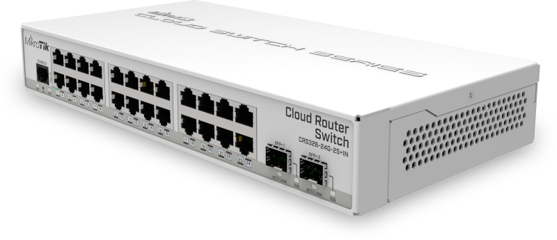
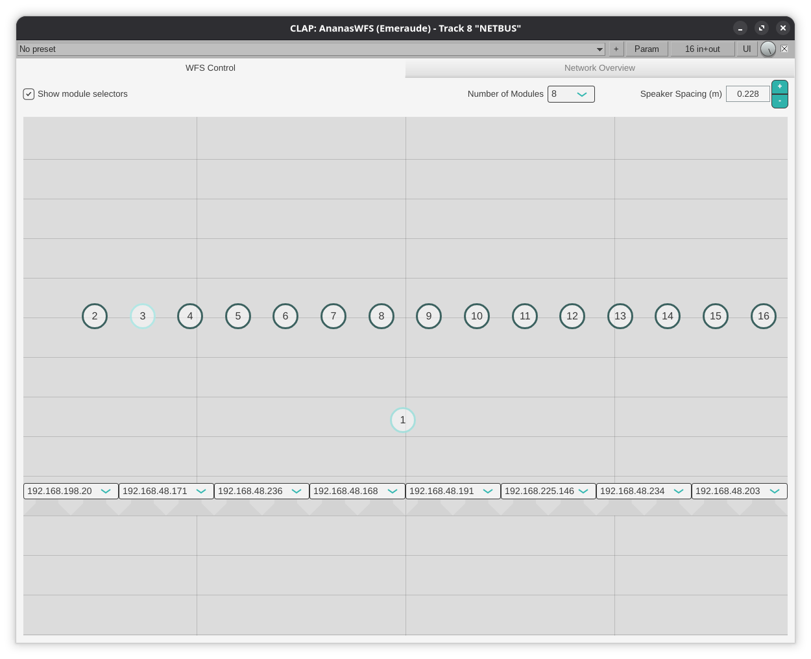
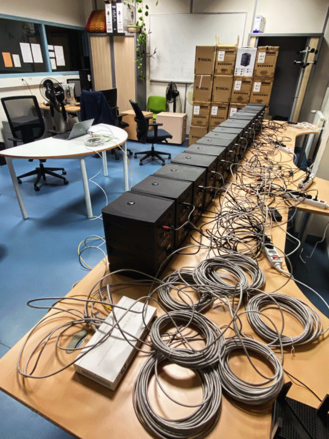

#+title: Enabling Distributed Spatial Audio
#+subtitle: Thesis Committee --- Year 3
#+author: Thomas Rushton

#+options: num:nil toc:nil
#+options: reveal_width:1500 reveal_height:1000 reveal_slide_number:c/t
#+export_file_name: index
#+property: header-args:css :results none :exports none :tangle ./style.css
#+reveal_root: ../reveal.js
#+reveal_theme: white_contrast_compact_verbatim_headers
#+reveal_trans: slide
#+reveal_plugins: (math)
#+reveal_extra_css: style.css
#+reveal_min_scale: 1.0
#+reveal_max_scale: 1.0
#+reveal_extra_options: hash: true, fragmentInURL: true
#+reveal_title_slide: <h1>%t</h1><h2>%s</h2><h3>%a</h3>
#+reveal_title_slide_background: #141414
#+reveal_title_slide_extra_attr: class="title-slide"

* About This Presentation                                          :noexport:

This =org= file describes my presentation for my third year /Comité de
Suivi Individuel/, to be held on May 20th 2026.

** Dependencies

- =org-re-reveal= ([[https://gitlab.com/oer/org-re-reveal/-/tree/main][gitlab]]), which enables export support from Org to [[https://revealjs.com/][Reveal.js]].

** Running the Presentation

From the reveal.js directory (=../reveal.js=), run:

#+begin_src shell :noeval :exports code
npm start -- --root=../
#+end_src

Then navigate to [[http://localhost:8000/csi-year2]].

* CSS                                                              :noexport:
** Symlink to =~/org/fonts=

#+begin_src emacs-lisp :results none :export none :eval yes
(dired-make-relative-symlink "../../fonts" "fonts" t)
#+end_src

** Typography

Define some fonts. Useful info [[https://www.digitalocean.com/community/tutorials/how-to-load-and-use-custom-fonts-with-css#loading-a-self-hosted-font-with-font-face][here]].

#+begin_src css
@font-face {
    font-family: "MyMinion";
    src:
        local("MinionPro-Regular"),
        url("fonts/minionpro/MinionPro-Regular.otf") format("opentype");
    font-weight: 400;
    font-style: normal;
}

@font-face {
    font-family: "MyMinion";
    src:
        url("fonts/minionpro/MinionPro-It.otf") format("opentype");
    font-weight: 400;
    font-style: italic;
}

@font-face {
    font-family: "MyMinion";
    src:
        url("fonts/minionpro/MinionPro-Semibold.otf") format("opentype");
    font-weight: 600;
    font-style: normal;
}

@font-face {
    font-family: "MyMinion";
    src:
        url("fonts/minionpro/MinionPro-Bold.otf") format("opentype");
    font-weight: 800;
    font-style: normal;
}
#+end_src

Now override some of reveal's variables.

#+begin_src css
:root {
    --r-main-font: "MyMinion";
    --r-main-font-size: 42px;
    --r-heading-font: "MyMinion";
    --r-code-font: "Iosevka Comfy Motion";
    --r-heading-text-transform: none;
}
#+end_src

*** Headings

Decorate my h2's and h3's.

#+begin_src css
.stack h2, .stack h3 {
    text-decoration: underline 3px #bbb;
}
#+end_src

*** Figures

#+begin_src css
.reveal figure {
    margin-top: 0;
}
#+end_src

*** Use old style numbers

#+begin_src css
body {
    font-variant-numeric: oldstyle-nums;
}
#+end_src

But not in code blocks

#+begin_src css
.reveal pre {
    font-variant-numeric: normal;
}
#+end_src

*** Font size utility classes

Captions

#+begin_src css
.caption {
    font-size: .6em;
}
#+end_src

Big equations

#+begin_src css
.big-eqn {
    font-size: 1.5em;
}

.huge-eqn {
    font-size: 2em;
}
#+end_src

** Code blocks

Improve code block appearance.

#+begin_src css
.reveal pre {
    padding: 1em;
    width: 66.6%;
    box-shadow: none;
    background: #efefef;
    font-size: .7em;
}
#+end_src

** Tables

#+begin_src css
.reveal table th, .reveal table td {
    text-align: center;
}

.reveal table td {
    border: none;
}
#+end_src

* Figures                                                          :noexport:
:PROPERTIES:
:header-args: :tangle csid3figs.sty :results silent :noeval
:END:

Let's re-use some figures from last year's SMC presentation.

** Setup

#+begin_src latex
\ProvidesPackage{csid3figs}
\usepackage{tikz}
\usetikzlibrary{shapes, positioning, arrows.meta}
\usepackage{fontspec}
\setmainfont[
  Mapping={tex-text}, 
  Numbers={OldStyle},
  Ligatures={Common},
  UprightFont=*-Regular,
  BoldFont=*-Bold,
  BoldItalicFont=*-BoldIt,
  ItalicFont=*-It,
  FontFace={sb}{n}{*-Semibold},
  FontFace={sb}{it}{*-SemiboldIt}
]{MinionPro}
#+end_src

** Common stuff

#+begin_src latex
\definecolor{ctrlColour}{HTML}{479955}
\definecolor{audioColour}{HTML}{4077D6}

\tikzset{
  device/.style={draw, fill=black!10, rounded corners=1mm, inner xsep=1.5mm},
  ctrl/.style={-{Triangle[open]}, densely dotted, ctrlColour, line width=.2mm},
  acn/.style={-{Stealth}, audioColour, densely dashdotted},
  audio/.style={-{Stealth}, audioColour},
  ptp/.style={{Triangle}-{Triangle}},
  legend/.style={font=\tiny\itshape},
  module/.style={device, fill=ctrlColour!35, font={\scriptsize}, transform shape},
}
#+end_src

** WFS

Bits with which to draw WFS diagrams.

#+begin_src latex
\newcommand*{\wfsptpWaveSpace}{.89}
\newcommand*{\wfsptpWidth}{8}
\newcommand*{\wfsptpNumWaves}{5}
\newcommand*{\wfsptpNumSecondary}{16}
\newcommand*{\wfsptpNumMCU}{8}

\tikzset{
  halfSecondaryWavefronts/.pic={
    \foreach \pos/\rad in {0/.18, 1/.615, 2/1.03, 3/1.42, 4/1.78, 5/2.07, 6/2.295, 7/2.42}
    \draw [black!40] (.25+.5*\pos, 0) circle (\rad);
  },
  secondaryWavefronts/.pic={
    \clip (0, 0) rectangle (\wfsptpWidth, 2.5);
    \pic {halfSecondaryWavefronts};
    \pic [xscale=-1] at (\wfsptpWidth, 0) {halfSecondaryWavefronts};
  },
  secondaryWavefrontsAsync/.pic={
    \clip (0, 0) rectangle (\wfsptpWidth, 2.5);
    \foreach \pos/\rad in {0/.18, 1/.615,
      2/0.83, 3/1.22,
      4/1.88, 5/2.17,
      6/1.295, 7/1.42,
      8/1.72, 9/1.595,
      10/0.41, 11/0.12,
      12/1.42, 13/1.03,
      14/0, 15/0}
    \draw [black!40] (.25+.5*\pos, 0) circle (\rad);
  },
  realWavefronts/.pic={
    \clip (0, 0) rectangle (\wfsptpWidth, 2.5);
    \foreach \i [evaluate=\i as \rad using \i*\wfsptpWaveSpace] in {1,...,\wfsptpNumWaves}
    \draw [thick, audioColour] (\wfsptpWidth/2-\rad, -2) arc [radius=\rad, start angle=180, end angle=0];
  },
  virtualWavefronts/.pic={
    \clip (-1, 0) rectangle (2*\wfsptpWaveSpace*\wfsptpNumWaves, 2);
    \foreach \i [evaluate=\i as \rad using \i*\wfsptpWaveSpace] in {1,...,\wfsptpNumWaves}
    \draw [thick, dashed, audioColour] (\wfsptpWidth/2-\rad, 0) arc [radius=\rad, start angle=180, end angle=0];
  },
  speaker/.pic={
    \path [draw=black, fill=white] (-.11, 0) rectangle (.11, .06);
    \path [draw=black, fill=white] (-.11, .06) -- (-.25, .2) -- (.25, .2) -- (.11, .06);
  },
  speakers/.pic={
    \foreach \i [
      evaluate=\i as \secondary using
      .25+(\i-1)*(\wfsptpWidth/\wfsptpNumSecondary)
    ] in {1,...,\wfsptpNumSecondary} {
      \pic at (\secondary, 0) {speaker};
    }
  },
  mcu/.pic = {
    \node [module] (-body) {dWFS};
    \draw [ptp] (0, -.6) -- (-body.south);
    \draw [audio] (-.25, -.6) -- ([xshift=-.25cm]-body.south);
    \draw [ctrl] (.25, -.6) -- ([xshift=.25cm]-body.south);
  },
  mcus/.pic = {
    \foreach \i [
      evaluate=\i as \xpos using .5+(\i-1)
    ] in {1,...,\wfsptpNumMCU}
    \pic at (\xpos, 0) {mcu};
  },
  wfs/.pic = {
    \node [minimum width=\wfsptpWidth{}cm, draw, fill=black!10, rounded corners=1mm] (wfs) at (\wfsptpWidth/2, -.44) {WFS};
    \draw [audio] (\wfsptpWidth/2, -1) -- (wfs.south)
  },
  primary/.pic = {
    \node [circle, draw=audioColour, fill=audioColour!50, thick] (primary) at (\wfsptpWidth/2, -2) {};
  },
  centralisedwfs/.pic = {
    \pic {secondaryWavefronts};
    \pic at (0, -2) {virtualWavefronts};
    \pic {primary};
    \pic {realWavefronts};
    \pic at (0, -.21) {speakers};
    \pic {wfs};
  },
  distributedwfs/.pic = {
    \pic {secondaryWavefronts};
    \pic at (0, -2) {virtualWavefronts};
    \pic {primary}
    \pic {realWavefronts};
    \pic at (0, -.21) {speakers};
    \pic at (0, -.42) {mcus};
  },
  asyncwfs/.pic = {
    \pic {secondaryWavefrontsAsync};
    \pic at (0, -2) {virtualWavefronts};
    \pic {primary};
    \pic at (0, -.21) {speakers};
    \pic at (0, -.42) {mcus};
  }
}
#+end_src

** Ambisonics

Bits with which to draw HOA diagrams.

#+begin_src latex
\tikzset{
  speakerhoa/.pic = {
    \draw (-.11, 0) rectangle (.11, .06);
    \draw (-.11, .06) -- (-.25, .2) -- (.25, .2) -- (.11, .06);
    \node (-body) at (0, 0) {};   % invisible anchor node
  },
  moduleN/.pic = {
    \node [module] (-body) {dHOA};
    \draw [ptp] (0, .6) -- (-body.north);
    \draw [acn] (-.25, .6) -- ([xshift=-.25cm]-body.north);
    \draw [ctrl] (.25, .6) -- ([xshift=.25cm]-body.north);
  },
  moduleS/.pic = {
    \node [module] (-body) {dHOA};
    \draw [ptp] (0, -.6) -- (-body.south);
    \draw [acn] (-.25, -.6) -- ([xshift=-.25cm]-body.south);
    \draw [ctrl] (.25, -.6) -- ([xshift=.25cm]-body.south);
  },
  hoa/.pic={
    % Azymuthal rings
    \draw [dashed, black!30] (0, 0) circle (3.5);
    \draw [dashed, black!30] (0, 0) circle (2.8);
    \draw [dashed, black!30] (0, 0) circle (1.9);
    \draw [dashed, black!30] (0, 0) circle (.8);
    % Speakers, ring 0
    \pic [rotate=180] (speaker0) at (0, 3.7) {speakerhoa};
    \pic [rotate=90] (speaker1) at (3.7, 0) {speakerhoa};
    \pic (speaker2) at (0, -3.7) {speakerhoa};
    \pic [rotate=-90] (speaker3) at (-3.7, 0) {speakerhoa};
    % Speakers, ring 1
    \pic [rotate=225] (speaker4) at (-2.125, 2.125) {speakerhoa};
    \pic [rotate=135] (speaker5) at (2.125, 2.125) {speakerhoa};
    \pic [rotate=45] (speaker6) at (2.125, -2.125) {speakerhoa};
    \pic [rotate=-45] (speaker7) at (-2.125, -2.125) {speakerhoa};
    % Speakers, ring 2
    \pic [rotate=180] (speaker8) at (0, 2.1) {speakerhoa};
    \pic [rotate=90] (speaker9) at (2.1, 0) {speakerhoa};
    \pic (speaker10) at (0, -2.1) {speakerhoa};
    \pic [rotate=-90] (speaker11) at (-2.1, 0) {speakerhoa};
    % Speakers, ring 3
    \pic [rotate=225] (speaker12) at (-.7, .7) {speakerhoa};
    \pic [rotate=135] (speaker13) at (.7, .7) {speakerhoa};
    \pic [rotate=45] (speaker14) at (.7, -.7) {speakerhoa};
    \pic [rotate=-45] (speaker15) at (-.7, -.7) {speakerhoa};
  },
  centralisedhoa/.pic={
    \pic{hoa};
    \node (hoa) [device] at (-2.75, 3.75) {HOA};
    \draw [audio] (hoa.south) -- ++(0,-.15) -- ++(-1.5,0) -- ++(0, -.3);
    \draw [audio] (hoa.south) -- ++(0,-.15) -- ++(-1.3,0) -- ++(0, -.3);
    \draw [audio] (hoa.south) -- ++(0,-.15) -- ++(-1.1,0) -- ++(0, -.3);
    \draw [audio] (hoa.south) -- ++(0,-.15) -- ++(-.9,0) -- ++(0, -.3);
    \draw [audio] (hoa.south) -- ++(0,-.15) -- ++(-.7,0) -- ++(0, -.3);
    \draw [audio] (hoa.south) -- ++(0,-.15) -- ++(-.5,0) -- ++(0, -.3);
    \draw [audio] (hoa.south) -- ++(0,-.15) -- ++(-.3,0) -- ++(0, -.3);
    \draw [audio] (hoa.south) -- ++(0,-.15) -- ++(-.1,0) -- ++(0, -.3);
    \draw [audio] (hoa.south) -- ++(0,-.15) -- ++(.1,0) -- ++(0, -.3);
    \draw [audio] (hoa.south) -- ++(0,-.15) -- ++(.3,0) -- ++(0, -.3);
    \draw [audio] (hoa.south) -- ++(0,-.15) -- ++(.5,0) -- ++(0, -.3);
    \draw [audio] (hoa.south) -- ++(0,-.15) -- ++(.7,0) -- ++(0, -.3);
    \draw [audio] (hoa.south) -- ++(0,-.15) -- ++(.9,0) -- ++(0, -.3);
    \draw [audio] (hoa.south) -- ++(0,-.15) -- ++(1.1,0) -- ++(0, -.3);
    \draw [audio] (hoa.south) -- ++(0,-.15) -- ++(1.3,0) -- ++(0, -.3);
    \draw [audio] (hoa.south) -- ++(0,-.15) -- ++(1.5,0) -- ++(0, -.3);
    % Speaker feeds, ring 0
    \draw [audio] ([yshift=.25cm]speaker0-body.north) --
    ([yshift=-.1cm]speaker0-body.north);
    \draw [audio] ([xshift=.25cm]speaker1-body.east) --
    ([xshift=-.1cm]speaker1-body.east);
    \draw [audio] ([yshift=-.25cm]speaker2-body.south) --
    ([yshift=.1cm]speaker2-body.south);
    \draw [audio] ([xshift=-.25cm]speaker3-body.west) --
    ([xshift=.1cm]speaker3-body.west);
    % Speaker feeds, ring 1
    \draw [audio] ([xshift=-.33cm,yshift=.25cm]speaker4-body.northwest)
    -- ([xshift=-.1cm,yshift=0cm]speaker4-body.northwest);
    \draw [audio] ([xshift=.16cm,yshift=.25cm]speaker5-body.northeast)
    -- ([xshift=-.1cm,yshift=0cm]speaker5-body.northeast);
    \draw [audio] ([xshift=.16cm,yshift=-.25cm]speaker6-body.southeast)
    -- ([xshift=-.1cm,yshift=0cm]speaker6-body.southeast);
    \draw [audio] ([xshift=-.33cm,yshift=-.25cm]speaker7-body.southwest)
    -- ([xshift=-.1cm,yshift=0cm]speaker7-body.southwest);
    % Speaker feeds, ring 2
    \draw [audio] ([yshift=.25cm]speaker8-body.north) --
    ([yshift=-.1cm]speaker8-body.north);
    \draw [audio] ([xshift=.25cm]speaker9-body.east) --
    ([xshift=-.1cm]speaker9-body.east);
    \draw [audio] ([yshift=-.25cm]speaker10-body.south) --
    ([yshift=.1cm]speaker10-body.south);
    \draw [audio] ([xshift=-.25cm]speaker11-body.west) --
    ([xshift=.1cm]speaker11-body.west);
    % Speaker feeds, ring 3
    \draw [audio] ([xshift=-.33cm,yshift=.25cm]speaker12-body.northwest)
    -- ([xshift=-.1cm,yshift=0cm]speaker12-body.northwest);
    \draw [audio] ([xshift=.16cm,yshift=.25cm]speaker13-body.northeast)
    -- ([xshift=-.1cm, yshift=0cm]speaker13-body.northeast);
    \draw [audio] ([xshift=.16cm,yshift=-.25cm]speaker14-body.southeast)
    -- ([xshift=-.1cm,yshift=0cm]speaker14-body.southeast);
    \draw [audio] ([xshift=-.33cm,yshift=-.25cm]speaker15-body.southwest)
    -- ([xshift=-.1cm,yshift=0cm]speaker15-body.southwest);
  },
  distributedhoa/.pic={
    \pic{hoa};
    % Modules
    \pic [rotate=-45] (module0) at (2.7, 2.7) {moduleN};
    \pic [rotate=-45] (module1) at (-2.7, -2.7) {moduleS};
    \pic (module2) at (0, 3.1) {moduleS};
    \pic (module3) at (0, -3.1) {moduleN};
    \pic (module4) [rotate=-45] at (1.55, 1.55) {moduleS};
    \pic (module5) [rotate=-45] at (-1.55, -1.55) {moduleN};
    \pic (module6) at (0, 1.1) {moduleN};
    \pic (module7) at (0, -1.1) {moduleS};
    % Audio
    \draw [audio] (module0-body.west) -- (speaker0-body.east);
    \draw [audio] (module0-body.east) --
    ([yshift=.125cm, xshift=.1cm]speaker1-body.west);
    \draw [audio] (module1-body.east) -- (speaker2-body.west);
    \draw [audio] (module1-body.west) --
    ([yshift=-.125cm, xshift=-.1cm]speaker3-body.east);
    \draw [audio] (module2-body.west) --
    ([yshift=.05cm]speaker4-body.east);
    \draw [audio] (module2-body.east) --
    ([yshift=.05cm]speaker5-body.west);
    \draw [audio] (module3-body.east) --
    ([yshift=-.05cm]speaker6-body.west);
    \draw [audio] (module3-body.west) --
    ([yshift=-.05cm]speaker7-body.east);
    \draw [audio] (module4-body.west) -- (speaker8-body.east);
    \draw [audio] (module4-body.east) --
    ([yshift=.125cm, xshift=.1cm]speaker9-body.west);
    \draw [audio] (module5-body.east) -- (speaker10-body.west);
    \draw [audio] (module5-body.west) --
    ([yshift=-.125cm, xshift=-.1cm]speaker11-body.east);
    \draw [audio] (module6-body.west) -- (speaker12-body.east);
    \draw [audio] (module6-body.east) -- (speaker13-body.west);
    \draw [audio] (module7-body.east) -- (speaker14-body.west);
    \draw [audio] (module7-body.west) -- (speaker15-body.east);
  }
}
#+end_src

** PTP

#+begin_src latex
\tikzset{
  role/.style={align=center, draw, inner sep=1mm, minimum height=1cm, rounded corners=.5mm},
  authorityMsg/.style={midway, above=-1mm, rotate=-13},
  subscriberMsg/.style={midway, above=-1mm, rotate=13},
  ptp/.pic={
    \node (auth) [role] at (0, 0) {Clock\\authority};
    \draw [-{Stealth}] (auth.south) -- +(0, -6.5);
    \node (sub) [role, right = 2cm of auth] {Clock\\subscriber};
    \draw [-{Stealth}] (sub.south) -- +(0, -6.5);
    
    \node (t1) [below left=2mm and -8mm of auth] {\(t_{1}\)};
    
    \draw [-{Stealth}] ([yshift=-5.5mm]auth.south) -- ([yshift=-13.5mm]sub.south) node [authorityMsg] {\ultratiny{Sync}};
    \draw [-{Stealth}] ([yshift=-10.5mm]auth.south) -- ([yshift=-18.5mm]sub.south) node [authorityMsg] {\ultratiny{FollowUp [\(t_{1}\)]}};

    \node (t2) [below right=11mm and -8mm of sub] {\(t_{2}\)};

    \node (t3) [below right=21.5mm and -8mm of sub] {\(t_{3}\)};

    \draw [-{Stealth}] ([yshift=-24mm]sub.south) -- ([yshift=-32mm]auth.south) node [subscriberMsg] {\ultratiny{DelayReq}};

    \node (t4) [below left=29mm and -8mm of auth] {\(t_{4}\)};

    \draw [-{Stealth}] ([yshift=-36mm]auth.south) -- ([yshift=-44mm]sub.south) node [authorityMsg] {\ultratiny{DelayResp [\(t_{4}\)]}};

    \node (t11) [below left=43mm and -8mm of auth] {\(t'_{1}\)};
    
    \draw [-{Stealth}] ([yshift=-47mm]auth.south) -- ([yshift=-55mm]sub.south) node [authorityMsg] {\ultratiny{Sync}};
    \draw [-{Stealth}] ([yshift=-52mm]auth.south) -- ([yshift=-60mm]sub.south) node [authorityMsg] {\ultratiny{FollowUp [\(t'_{1}\)]}};

    \node (t21) [below right=52mm and -8mm of sub] {\(t'_{2}\)};
  }
}
#+end_src

* Agenda
#+ATTR_REVEAL: :frag (appear)
- Recap: broad research goals
- Elimination of clock drift
- The /Ananas/ protocol
- Outlook and aims

* Recap
:PROPERTIES:
:reveal_background: #141414
:END:

** Recap
:PROPERTIES:
:reveal_extra_attr: data-auto-animate
:END:

#+begin_quote
To create spatial audio systems that are more accessible than the
state of the art.
#+end_quote

** Recap
:PROPERTIES:
:reveal_extra_attr: data-auto-animate
:END:

#+begin_quote
To create spatial audio systems that are more accessible than the
state of the art.
#+end_quote

#+begin_quote
To use a network of distributed signal processors to create spatial
audio systems that cost less, and are more flexible than, state of the
art installations.
#+end_quote

*** Centralised spatial audio systems
:PROPERTIES:
:reveal_extra_attr: data-auto-animate
:END:

#+header: :exports results :results file raw :file "./images/gen/centralisedwfs.png"
#+header: :imagemagick t :iminoptions -density 600 :imoutoptions -geometry 2000 -flatten :fit t
#+header: :headers '("\\usepackage{csid3figs}")
#+begin_src latex :eval no-export
\begin{tikzpicture}
  \pic{centralisedwfs};
\end{tikzpicture}
#+end_src
#+attr_org: :width 300
#+attr_html: :width 800
#+RESULTS:
[[file:./images/gen/centralisedwfs.png]]

#+ATTR_REVEAL: :frag (appear)
- A single, monolithic system of hardware and software
- Typically costly, single-purpose, in-situ

*** Centralised spatial audio systems
:PROPERTIES:
:reveal_extra_attr: data-auto-animate
:END:

#+header: :exports results :results file raw :file "./images/gen/centralisedhoa.png"
#+header: :imagemagick t :iminoptions -density 600 :imoutoptions -geometry 2000 -flatten :fit t
#+header: :headers '("\\usepackage{csid3figs}")
#+begin_src latex :eval no-export
\begin{tikzpicture}
  \pic{centralisedhoa};
\end{tikzpicture}
#+end_src
#+attr_org: :width 300
#+attr_html: :width 600
#+RESULTS:
[[file:./images/gen/centralisedhoa.png]]

#+ATTR_REVEAL: :frag (appear)
- Scales poorly; expensive to scale up
- Requires a powerful, centralised DSP system

*** Distributed spatial audio systems
:PROPERTIES:
:reveal_extra_attr: data-auto-animate
:END:

#+header: :exports results :results file raw :file "./images/gen/distributedwfs.png"
#+header: :imagemagick t :iminoptions -density 600 :imoutoptions -geometry 2000 -flatten :fit t
#+header: :headers '("\\usepackage{csid3figs}")
#+begin_src latex :eval no-export
\begin{tikzpicture}
  \pic{distributedwfs};
\end{tikzpicture}
#+end_src
#+attr_org: :width 300
#+attr_html: :width 800
#+RESULTS:
[[file:./images/gen/distributedwfs.png]]

#+ATTR_REVEAL: :frag (appear)
- A network of signal processors combining to produce an immersive
  auditory environment
- Lower cost-per-channel

*** Distributed spatial audio systems
:PROPERTIES:
:reveal_extra_attr: data-auto-animate
:END:

#+header: :exports results :results file raw :file "./images/gen/distributedhoa.png"
#+header: :imagemagick t :iminoptions -density 600 :imoutoptions -geometry 2000 -flatten :fit t
#+header: :headers '("\\usepackage{csid3figs}")
#+begin_src latex :eval no-export
\begin{tikzpicture}
  \pic{distributedhoa};
\end{tikzpicture}
#+end_src
#+attr_org: :width 300
#+attr_html: :width 600
#+RESULTS:
[[file:./images/gen/distributedhoa.png]]

#+ATTR_REVEAL: :frag (appear)
- Scales more easily
- DSP is distributed; lower per-device computational demand

*** The importance of synchronicity

#+header: :exports results :results file raw :file "./images/gen/asyncwfs.png"
#+header: :imagemagick t :iminoptions -density 600 :imoutoptions -geometry 2000 -flatten :fit t
#+header: :headers '("\\usepackage{csid3figs}")
#+begin_src latex :eval no-export
\begin{tikzpicture}
  \pic{asyncwfs};
\end{tikzpicture}
#+end_src
#+attr_org: :width 300
#+attr_html: :width 800
#+RESULTS:
[[file:./images/gen/asyncwfs.png]]

If devices are not synchronised, the synthesised soundfield will be destroyed.

* Time Exchange
:PROPERTIES:
:reveal_background: #141414
:END:

** IEEE 1588 Precision Time Protocol
:PROPERTIES:
:reveal_extra_attr: data-auto-animate
:END:

#+header: :exports results :results file raw :file "./images/gen/ptpflow.png"
#+header: :imagemagick t :iminoptions -density 600 :imoutoptions -geometry 2000 -flatten :fit t
#+header: :headers '("\\usepackage{csid3figs}")
#+begin_src latex :eval no-export
\begin{tikzpicture}
  \pic{ptp};
\end{tikzpicture}
#+end_src
#+attr_org: :width 300
#+attr_html: :width 500
#+RESULTS:
[[file:./images/gen/ptpflow.png]]

** IEEE 1588 Precision Time Protocol
:PROPERTIES:
:reveal_extra_attr: data-auto-animate
:END:

#+ATTR_REVEAL: :frag (appear)
- For best accuracy, requires physical-layer timestamping
- Devices with such support tend to be expensive
- Some rare exceptions do exist

#+ATTR_REVEAL: :frag (appear)
||[[./images/t41.png]]|

** The Teensy 4.1 microcontroller development board
:PROPERTIES:
:reveal_extra_attr: data-auto-animate
:END:

[[./images/t41.png]]

#+ATTR_REVEAL: :frag (appear)
- PTP Support
- Dedicated audio subsystem
- High-resolution audio clock divider registers
- Less than € 50 with audio and ethernet add-ons
- Programmable in Faust

** Elimination of clock drift
:PROPERTIES:
:reveal_extra_attr: data-auto-animate
:END:

#+ATTR_REVEAL: :frag (appear)
- At the time of the previous CSI we had a system exhibiting some
  residual /parts per billion/ clock drift.
- This ppb drift appeared to be inversely proportional to the raw,
  unconditioned drift.

** Elimination of clock drift
:PROPERTIES:
:reveal_extra_attr: data-auto-animate
:END:

#+begin_src julia :session drifty :results none :exports none
using CSV, DataFrames, Plots

data = CSV.read(
    "../../notes/20241218T154907--teensy-ptp-drift-measurements-data__data_ptp_teensy.csv", DataFrame;
    limit=600
)

function plotDrift(dataCategory, plotFilepath)
    scalefontsizes(1.25)
    t41lastBytes = [191, 203, 234]
    plot(legendtitle="IP address",
         yformatter=:scientific,
         size=(900,600),
         margin=5Plots.mm,
         fontfamily="Minion Pro Regular");
    xlabel!("Time (s)")
    ylabel!("Offset (s)");
    for b in t41lastBytes
        column = data[!, "$b-$dataCategory"]
        # Remove initial offset
        column .= column .- column[1]
        # Prevent `noptp` data for client 191 from wrapping. 
        if b == 191 && dataCategory == "noptp"
            column[391:end] .= column[391:end] .+ (column[390] - column[391])
        end
        plot!(column, label="...48.$b", linewidth=2)
    end

    savefig(plotFilepath)
    scalefontsizes()
end
#+end_src

#+begin_src julia :session drifty :results file graphics :file noptp.png :output-dir ./images/gen :exports none
plotDrift("noptp", "images/gen/noptp.png")
#+end_src
#+attr_org: :width 100
#+RESULTS:
[[file:./images/gen/noptp.png]]

#+begin_src julia :session drifty :results file graphics :file withptp.png :output-dir ./images/gen :exports none
plotDrift("ptp", "images/gen/withptp.png")
#+end_src
#+attr_org: :width 100
#+RESULTS:
[[file:./images/gen/withptp.png]]

|[[./images/gen/noptp.png]]|[[./images/gen/withptp.png]]|

#+ATTR_REVEAL: :frag (appear)
- Unconditioned case: ~1.5 m propagation discrepancy after ten minutes
- Conditioned case: ~\(\frac{1}{3}\) mm propagation discrepancy

** Elimination of clock drift
:PROPERTIES:
:reveal_extra_attr: data-auto-animate
:END:

#+ATTR_REVEAL: :frag (appear)
- Observing this apparent inverse proportionality, I tried to correct
  for it.
- My attempts were unsuccessful.
- Solution: take a reference /nanoseconds/ figure on audio subsystem
  startup and compare with it once per second, computing an additional
  correction to apply alongside PTP-derived correction.

** Elimination of clock drift
:PROPERTIES:
:reveal_extra_attr: data-auto-animate
:END:

#+begin_src julia :results file graphics :file synchro.png :output-dir ./images/gen :exports results
using CSV, DataFrames, Plots, LaTeXStrings, Statistics

# The number of datapoints, i.e. seconds, to plot
numData = 3600

# Read the data. Limit to 3600 data points, i.e. 1 hour's worth.
data = CSV.read(
"../../notes/20260303T221301--ananas-synchronicity-measurements-data__ananas_data_teensy.csv",
    DataFrame,
    limit=numData + 1
)

# Remove the initial offset (using I2S3 as the reference)
data = data .- data[1, 3]
# Calculate the range of offsets, i.e. the group asynchronicity, for
# each point in time.
groupAsync = maximum(Matrix(data), dims=2) - minimum(Matrix(data), dims=2)
meanAsync = mean(groupAsync)

# Create a vector of x values to plot against, i.e. seconds
x = 0:numData
plot(
    # Data
    x,
    Matrix(data),
    # Size
    size=(1800, 600),
    # Labels
    xlabel="Time (s)",
    ylabel="Offset (ns)",
    label=permutedims(names(data)),
    # Styling
    fontfamily="Minion Pro Regular",
    margin=10Plots.mm,
    gridlinewidth=2,
    linewidth=1.5,
    guidefontsize=18,
    tickfontsize=12,
    legendfontsize=11,
    xlims=(-numData * .005, numData * 1.005),
    # Y formatter
    yformatter=y -> string(Int(round(y / 10.0^-9)))
)

# Plot the mean offset too
plot!(x, groupAsync, label="Group asynchronicity", linewidth=2, c=:red)

hline!([meanAsync],
       label="Mean asynchronicity",
       linewidth=3,
       linestyle=:dot,
       c=:black)

savefig("./images/gen/synchro.png")
#+end_src
#+attr_html: :width 1200
#+RESULTS:
[[file:./images/gen/synchro.png]]

Clients synchronised for an hour to within 100 ns on average.

* The /Ananas/ protocol
:PROPERTIES:
:reveal_background: #141414
:END:

** The /Ananas/ protocol
:PROPERTIES:
:reveal_extra_attr: data-auto-animate
:END:

#+ATTR_REVEAL: :frag (appear)
- /"Ananas necessitates another networked audio system"/
- A protocol for networked audio and control data transmission, plus
  device discovery and synchronisation
- Also a system of supporting software: audio plugins and
  microcontroller firmware

** The /Ananas/ protocol
:PROPERTIES:
:reveal_extra_attr: data-auto-animate
:END:

#+attr_org: :width 300
#+attr_html: :width 900
[[./images/network-overview.png]]

** The /Ananas/ protocol
:PROPERTIES:
:reveal_extra_attr: data-auto-animate
:END:

#+attr_org: :width 300
#+attr_html: :width 900

** The /Ananas/ protocol
:PROPERTIES:
:reveal_extra_attr: data-auto-animate
:END:

#+attr_org: :width 300
#+attr_html: :width 500

* Outlook and aims
:PROPERTIES:
:reveal_background: #141414
:END:

** Outlook and aims

#+ATTR_REVEAL: :frag (appear)
- Demonstrate a HOA system based on /Ananas/
- Submit a paper on /Ananas/ to the Internet of Sounds Symposium
- Write my manuscript

* Thank You
:PROPERTIES:
:reveal_background: #141414
:END:

* Local Variables                                                  :noexport:

#+begin_example
Local Variables:
org-babel-min-lines-for-block-output: 0
org-latex-compiler: "xelatex"
End:
#+end_example
