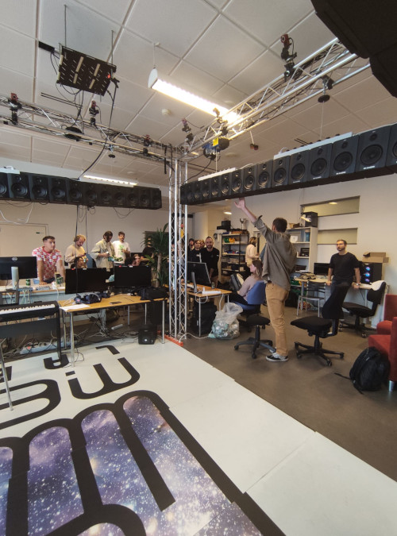
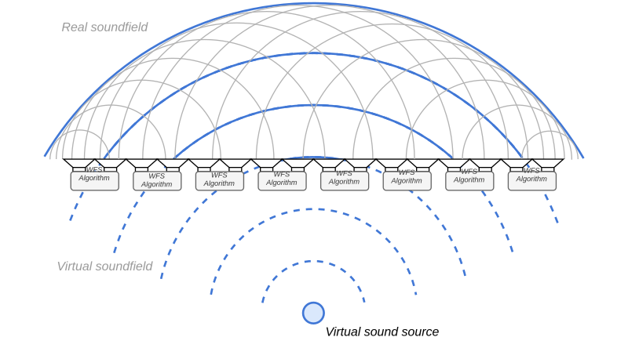
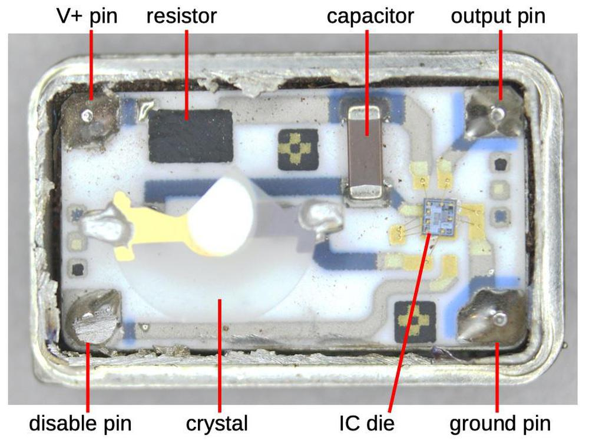
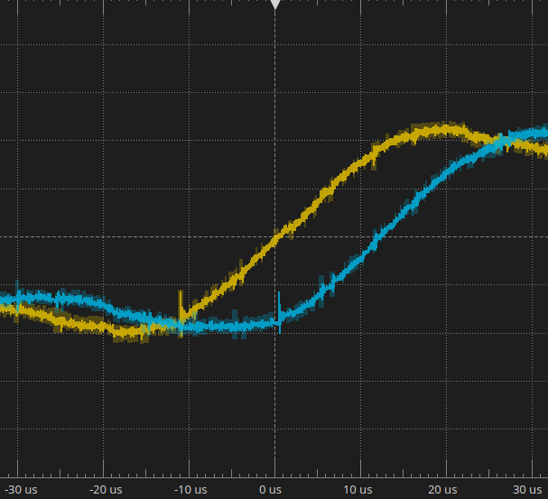

# -*- coding: utf-8 -*-
# -*- mode: org -*-

#+TITLE: All Together Now
#+SUBTITLE: Synchronous Networked Audio for Distributed Immersive Applications
#+AUTHOR: Thomas Rushton

#+startup: overview
#+OPTIONS: num:nil toc:1 ^:{} ':t
#+OPTIONS: reveal_width:1400 reveal_height:1000 reveal_slide_number:c/t
#+EXPORT_FILE_NAME: index
#+REVEAL_ROOT: ../reveal.js
#+REVEAL_THEME: white
#+REVEAL_TRANS: slide
#+REVEAL_PLUGINS: (math highlight)
#+REVEAL_EXTRA_CSS: style.css
#+REVEAL_MIN_SCALE: 1.0
#+REVEAL_MAX_SCALE: 1.0
#+REVEAL_EXTRA_OPTIONS: hash: true, fragmentInURL: true
#+REVEAL_TITLE_SLIDE: <h1>%t</h1><h2>%s</h2><h3>%a</h3>
#+REVEAL_TITLE_SLIDE_BACKGROUND: #141414
#+REVEAL_TITLE_SLIDE_EXTRA_ATTR: class="title-slide"

* Setup                                                            :noexport:

Tangle this CSS:

#+begin_src css :tangle style.css
.org-src-container > pre > code, pre.example {
    padding: 1em;
}
#+end_src

Then export. Finally, from the reveal.js directory (=../reveal.js=),
run:

#+begin_src shell :noeval :exports code
npm start -- --root=../
#+end_src

Then navigate to [[http://localhost:8000/emeraude-202502/]].

* What are we trying to achieve?
:PROPERTIES:
:reveal_background: #141414
:reveal_extra_attr: class="title-page"
:END:

** 

#+ATTR_REVEAL: :frag (appear)
- Spatial/immersive audio is a solved problem...
  #+ATTR_REVEAL: :frag t
  + ...If money is no object.
- Systems must produce *many output channels*.
- Massively multichannel audio equipment is expensive.
- Spatial audio algorithms are *computationally costly*.

#+REVEAL: split

Multisensory Experience Lab, AAU Copenhagen, 64 channels.

#+REVEAL: split

#+attr_org: :width 400
[[./images/tu-berlin.webp]]

WellenFeld H 104, TU Berlin, 2700 loudspeakers, 823 channels.

#+REVEAL: split

#+attr_org: :width 300
 [[./images/sphere2.jpg]]

The Sphere, Las Vegas, ~167,000 loudspeakers, >8000 channels. 

** There is another way

#+ATTR_REVEAL: :frag (appear)
- A *distributed approach* is possible.
- Improved modularity, scalability.
- Reduced cost-per-output-channel.
- Increased aggregate computing power.

#+REVEAL: split

#+attr_org: :width 400
#+attr_html: :width 1000

** What makes a distributed approach possible?

#+ATTR_REVEAL: :frag (appear)
- Ubiquitous high-speed networking.
- The availability of programmable embedded computing platforms.
  #+ATTR_REVEAL: :frag (appear)
  + With audio and networking support.
  + Teensy, RPi, Bela, STM32, ESP32...
- The Faust ecosystem.

#+REVEAL: split

The distributed approach is not without its challenges.

* We need to talk about time
:PROPERTIES:
:reveal_background: #141414
:reveal_extra_attr: class="title-page"
:END:

** 

#+attr_html: :style font-size: 2em
#+begin_quote
Time is an illusion. Lunchtime doubly so.
#+end_quote

Douglas Adams, /The Hitchhiker's Guide to the Galaxy/

#+REVEAL: split

#+attr_org: :width 400
#+attr_html: :width 1000
[[./images/wfs4.svg]]

In the absence of an authoritative source of time, all time is
illusory.

** Clock drift

The innards of a cystal oscillator (XO):

#+attr_org: :width 300
#+attr_html: :width 450

#+ATTR_REVEAL: :frag (appear)
- Tolerance: how much a quartz crystal may deviate from its nominal
  frequency (at room temperature).
- Stability: how consistent the frequency of the crystal is with
  variations in temperature.
- Ageing, load-capacitance, etc.

#+attr_html: :style font-size: .5em  
#+begin_quote
Image source:
https://www.righto.com/2021/02/teardown-of-quartz-crystal-oscillator.html
#+end_quote

*** Correcting Clock Drift

- *Synthonisation* --- frequency matching.
  + Likely impossible at the hardware level without direct
    modification.
- *Synchronisation* --- time exchange.
  + Adjustments to the value of a dedicated timer via two-way exchange
    of time information.
  + Assumes communication-channel symmetry.

*** Precision Time Protocol --- IEEE 1588

#+attr_org: :width 400
[[./images/ptp.png]]

A time-exchange protocol capable of providing sub-microsecond
synchronisation.

#+attr_html: :style font-size: .5em
#+begin_quote
Figure, Schleusner et al. 2024. ‘Sub-Microsecond Time Synchronization for
Network-Connected Microcontrollers’. In 2024 IEEE International
Conference on Consumer Electronics (ICCE), 1–6. Las Vegas, NV, USA
#+end_quote

#+REVEAL: split

#+begin_example
Clock Authority                                                            Clock Subscriber
===========================================================================================
     [Sync] [record t1]
 [FollowUp] [send t1] 10:41:41::837:170:826
                                                   10:41:41::837:172:077 [Sync] [record t2]
                                               10:41:41::837:170:826 [FollowUp] [record t1] 
                                        10:41:41::837:763:553 [DelayReq] [record & send t3]
 [DelayReq] [record t4]
[DelayResp] [send t4] 10:41:41::837:764:395
                                              10:41:41::837:764:395 [DelayResp] [record t4]
     [Sync] [record t1']
 [FollowUp] [send t1'] 10:41:42::836:107:724
                                                   10:41:42::836:108:971 [Sync] [record t2']
                                               10:41:42::836:107:724 [FollowUp] [record t1']
#+end_example

#+begin_src emacs-lisp :exports none
(let* ((t1 837170826)
       (t2 837172077)
       (t3 837763553)
       (t4 837764395)
       (t11 1836107720)
       (t22 1836108975)
       (deltat1 (- t11 t1))
       (deltat2 (- t22 t2))
       (drift (- 1 (/ (float deltat2) (float deltat1))))
       (delay (/ (- (- t4 t1) (- t3 t2)) 2.0))
       (offset (- t2 t1 delay)))
  (format "delta t1 %d\ndelta t2 %d\ndrift %.9f\ndelay %.9f\noffset %.9f" deltat1 deltat2 drift delay offset))
#+end_src

#+RESULTS:
: delta t1 998936894
: delta t2 998936898
: drift -0.000000004
: delay 1046.500000000
: offset 204.500000000

\begin{equation}
\text{Drift} = 1 - \frac{t_{2}'-t_{2}}{t_{1}'-t_{1}} = -4\;\text{ns}
\end{equation}
\begin{equation}
\text{Delay} = \frac{(t_{4} - t_{1}) - (t_{3} - t_{2}) }{2} = 1046\;\text{ns}
\end{equation}
\begin{equation}
\text{Offset} = t_{2} - t_{1} - \text{Delay} = 204\;\text{ns}
\end{equation}

#+REVEAL: split

Proportional-Integral controller applied to \(\text{Offset}\):

\begin{equation}
\text{Adjust} = \text{Drift} + K_{P}\text{Offset} + K_{I}\int\text{Offset}
\end{equation}

Resulting adjustment used to alter the per-cycle increment of the
dedicated timer.

#+ATTR_REVEAL: :frag (appear)
- Reliance on hardware capable of physical-layer timestamping.
- Such hardware is typically expensive --- notable exceptions exist.
  - We found a ~200 € ethernet switch, and a 30 € USB ethernet
    interface, both offering IEEE 1588 compliance.

*** PTP time \(\ne\) audio time

#+ATTR_REVEAL: :frag (appear)
- Use PTP clock correction to adjust audio clock frequency.
- Requires a system with high-resolution clock frequency control.

#+REVEAL: split

Raspberry Pi, Broadcom BCM2835, 12-bit fractional clock divider register.

\begin{equation}
F_{s} = \frac{1}{64}\frac{500\times10^{6}}{D_{i} + \frac{D_{f}}{4096}}\;,
\end{equation}

#+begin_src emacs-lisp :results output :exports results
(let ((divf 3110))
  (while (< divf 3120)
    (princ (format "DIVF = %d :: Fs = %.12f\n" divf
                   (/ (/ 500e6 (+ 162 (/ (float divf) 4096))) 64)))
    (setq divf (1+ divf)))))
#+end_src

#+RESULTS:
#+begin_example
DIVF = 3110 :: Fs = 48000.336002352014
DIVF = 3111 :: Fs = 48000.264001452008
DIVF = 3112 :: Fs = 48000.192000768002
DIVF = 3113 :: Fs = 48000.120000299998
DIVF = 3114 :: Fs = 48000.048000048002
DIVF = 3115 :: Fs = 47999.976000012000
DIVF = 3116 :: Fs = 47999.904000192000
DIVF = 3117 :: Fs = 47999.832000588001
DIVF = 3118 :: Fs = 47999.760001199997
DIVF = 3119 :: Fs = 47999.688002027986
#+end_example

#+begin_src emacs-lisp :exports results
(format "Resolution approx. 1/%.2f Hz" (/ 1. (- 48000.048000048 47999.976000012)))
#+end_src

#+REVEAL: split

Teensy 4.1, NXP iMX.RT1060, 30-bit fractional clock divider register.

\begin{equation}
F_{s} = \frac{24\times10^{6}}{2^{8}}\frac{D_{S}+\frac{D_{N}}{D_{D}}}{D_{p}D_{A}D_{I_{1}}D_{I_{2}}}
\end{equation}

#+begin_src emacs-lisp :results output :exports results
(let ((numerator 183999995))
  (while (< numerator 184000005)
    (princ
     (format "NUM = %d :: Fs = %.12f\n"
             numerator
             (* (/ 24e6 (lsh 1 8))          ;; 24 MHz XO, 2^8 wordsize
                (/ (+ 29 (/ numerator 1e9)) ;; DIV + NUM / DENOM
                   (* 3 19)))))             ;; SAI1 pre & post dividers
    (setq numerator (1+ numerator)))))
#+end_src

#+RESULTS:
#+begin_example
NUM = 183999995 :: Fs = 47999.999991776320
NUM = 183999996 :: Fs = 47999.999993421057
NUM = 183999997 :: Fs = 47999.999995065795
NUM = 183999998 :: Fs = 47999.999996710525
NUM = 183999999 :: Fs = 47999.999998355263
NUM = 184000000 :: Fs = 48000.000000000000
NUM = 184000001 :: Fs = 48000.000001644737
NUM = 184000002 :: Fs = 48000.000003289475
NUM = 184000003 :: Fs = 48000.000004934212
NUM = 184000004 :: Fs = 48000.000006578950
#+end_example

#+begin_src emacs-lisp :exports results
(format "Resolution approx. 1/%.2f Hz" (/ 1. (- 48000. 47999.999998355)))
#+end_src

** Frame misalignment

*** Clock synchronicity \(\ne\) synchronous reproduction

#+ATTR_REVEAL: :frag (appear)
- Start audio subsystems when a PTP lock of <100 ns is achieved.
  #+ATTR_REVEAL: :frag (appear)
  + Typically takes on the order of 10 seconds from boot.
#+ATTR_REVEAL: :frag t
Achieved, in part, by turning code like this:
#+ATTR_REVEAL: :frag t
#+begin_src c++ :noeval
I2S1_RCSR |= I2S_RCSR_RE | I2S_RCSR_BCE;
I2S1_TCSR = I2S_TCSR_TE | I2S_TCSR_BCE | I2S_TCSR_FRDE;
#+end_src
#+ATTR_REVEAL: :frag t
Into code like this:
#+ATTR_REVEAL: :frag t
#+begin_src c++ :noeval
m_SAI1TransmitControlRegister.setBitClockEnable(true);
m_SAI1TransmitControlRegister.setFIFORequestDMAEnable(true);
m_SAI1TransmitControlRegister.setTransmitterEnable(true);
m_SAI1ReceiveControlRegister.setBitClockEnable(true);
m_SAI1ReceiveControlRegister.setReceiverEnable(true);
#+end_src

* Latest results
:PROPERTIES:
:reveal_background: #141414
:reveal_extra_attr: class="title-page"
:END:the

** 

#+ATTR_REVEAL: :frag (appear)
- /The good/
  #+ATTR_REVEAL: :frag (appear)
  + Subscribers receiving time and audio data over ethernet.
  + Subscriber audio clocks conditioned to \pm2 ppb (XO rated to \pm5
    ppm).
  + I^{2}S startup synchronised to within 1 \micro{}s.
- /The bad/
  #+ATTR_REVEAL: :frag (appear)
  + I^{2}S time \(\ne\) codec time: codec introducing up to 20 \micro{}s frame
    misalignment.
    #+ATTR_REVEAL: :frag (appear)
    * Possible to address this via further code improvements?
    * Inherent to I^{2}C implementation?
  + Computer audio time and PTP time not aligned.

#+REVEAL: split

[[./images/logic.png]]

Three clients reproducing a stereo unipolar sawtooth signal with one
channel inverted; I^{2}S measurement triggered at the peak of the left
channel.

#+REVEAL: split

Two of the clients from the previous capture; probes attached to left
channel analog output.

** The system needs a name...

#+ATTR_REVEAL: :frag (appear)
- /All Together Now/
  + AlToNo
- /(Synchronous) Networked Audio for Distributed Immersive Applications/
  + (S)nadia
- /Another Networked Audio System/
  + Anas \to Ananas
  + /Ananas Necessitates Another Networked Audio System/
