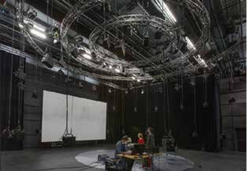
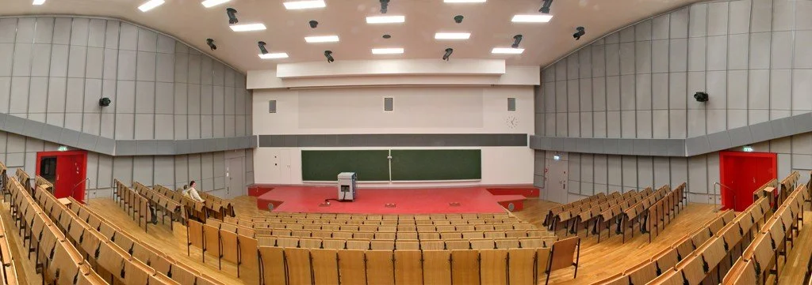
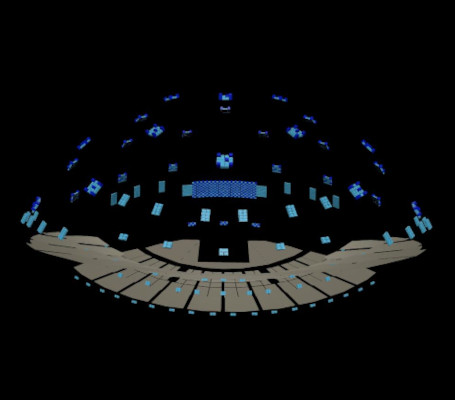
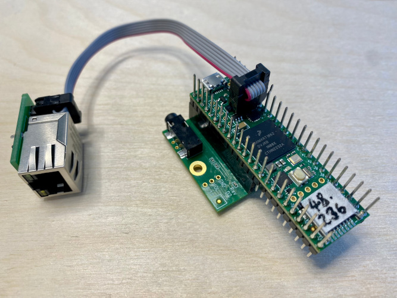

# -*- coding: utf-8 -*-
# -*- mode: org -*-

#+TITLE: Spatialisation du son sur systèmes distribués
#+AUTHOR: Thomas Rushton

#+OPTIONS: num:nil toc:1 ^:{} ':t
#+OPTIONS: reveal_width:1200 reveal_height:800 reveal_slide_number:c/t
#+LANGUAGE: fr
#+EXPORT_FILE_NAME: index
#+REVEAL_ROOT: ../reveal.js
#+REVEAL_THEME: white
#+REVEAL_TRANS: slide
#+REVEAL_PLUGINS: (math)
#+REVEAL_EXTRA_CSS: style.css
#+REVEAL_MIN_SCALE: 1.0
#+REVEAL_MAX_SCALE: 1.0
#+REVEAL_EXTRA_OPTIONS: hash: true, fragmentInURL: true
#+REVEAL_TITLE_SLIDE: <h1>%t</h1><h2>%s</h2><h3>%a</h3>
#+REVEAL_TITLE_SLIDE_BACKGROUND: #141414
#+REVEAL_TITLE_SLIDE_EXTRA_ATTR: class="title-slide"

* À propos de cette présentation                                   :noexport:

Ce fichier =org= décrit ma

** Dépendences

- =org-re-reveal= ([[https://gitlab.com/oer/org-re-reveal/-/tree/main][gitlab]]), qui permet d'exporter de Org à [[https://revealjs.com/][Reveal.js]].

** Exécution de la présentation

À partir du répertoir de reveal.js (=../reveal.js=), exécutez:

#+begin_src shell :noeval :exports code
npm start -- --root=../
#+end_src

Ensuite, naviguez vers [[localhost:8000/insa_francais/]].

* À propos de moi

#+ATTR_REVEAL: :frag (appear)
- Nom : Thomas Albert Rushton
- Né : Manchester, Royaume-Uni, 1985
- BMus Technologie Musicale, l'Université d'Édimbourg, 2009
- Travail
  #+ATTR_REVEAL: :frag (appear)
  + Musicien, technicien
  + Programmeur informatique
  + Développeur d'applications web
- MSc Informatique du Son et de la Musique, l'Universié d'Aalborg
  (Copenhague) 2023
  #+ATTR_REVEAL: :frag (appear)
  + Stage, Inria/Emeraude, Villeurbanne, 2022

* Son spatial distribué
:PROPERTIES:
:reveal_background: #141414
:reveal_extra_attr: class="title-slide"
:END:

** Synthèse du Champ d'Onde (WFS)

[[./images/wfs1.svg]]

Objectif : synthètiser un front d'onde à l'aide de sources sonores
secondaires

#+ATTR_REVEAL: :frag t
/« Holophonie »/

* L'état de l'art
:PROPERTIES:
:reveal_background: #141414
:reveal_extra_attr: class="title-slide"
:END:

** IRCAM, Paris

[[./images/ircam1.png]] 

[[https://www.ircam.fr/projects/pages/systeme-wfs-et-ambisonique-a-lespace-de-projection][Espace de Projection]], 339 haute-parleurs

** TU Berlin

WellenFeld H 104, 2700 haute-parleurs

** « The Sphere », Las Vegas

[[./images/sphere1.jpg]] 

167.000 haute-parleurs

* Motivation
:PROPERTIES:
:reveal_background: #141414
:reveal_extra_attr: class="title-slide"
:END:

** Motivation

[[./images/wfs2.svg]]

Les systèmes de spatialisation du son sont typiquement centralisés

#+ATTR_REVEAL: :frag t
Beaucoup de canaux de sortie audio --- chers, exclusifs

#+REVEAL: split

[[./images/wfs3.svg]]

Mais WFS est /parallélisable/

On pourra distribuer le travail

#+ATTR_REVEAL: :frag t
On pourrait créer un système plus accessible

#+ATTR_REVEAL: :frag t
La /synchronisation/ sera important

* Défis
:PROPERTIES:
:reveal_background: #141414
:reveal_extra_attr: class="title-slide"
:END:

** Trouver une plateform matérielle

On doit identifier un appareil peu coûteux, qui prend en charge
l'audio et l'ethernet

** Un moyen de synchronisation

[[./images/conditioning1.svg]]

Un réseau de données d'audio, de contrôle et de chronométrage

#+REVEAL: split

Si la synchronisation n'est pas assurée...

#+ATTR_REVEAL: :frag t
[[./images/wfs4.svg]]

* Merci de votre attention 🔊
:PROPERTIES:
:UNNUMBERED: notoc
:END:
