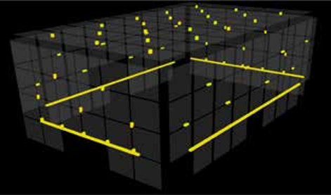
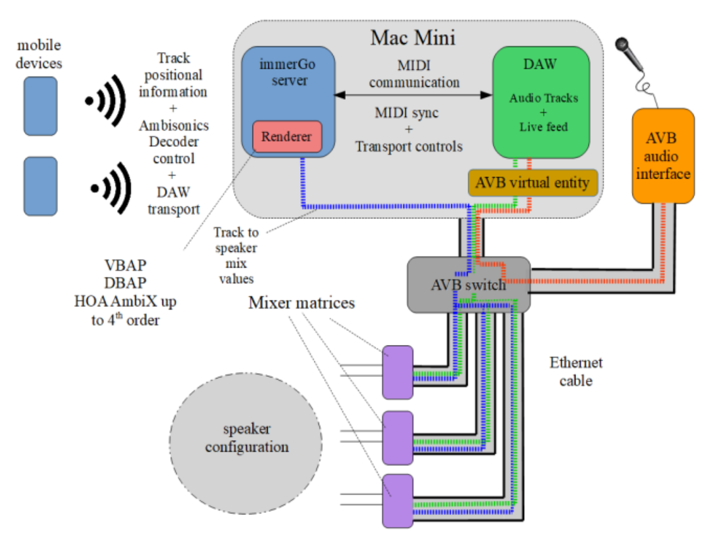
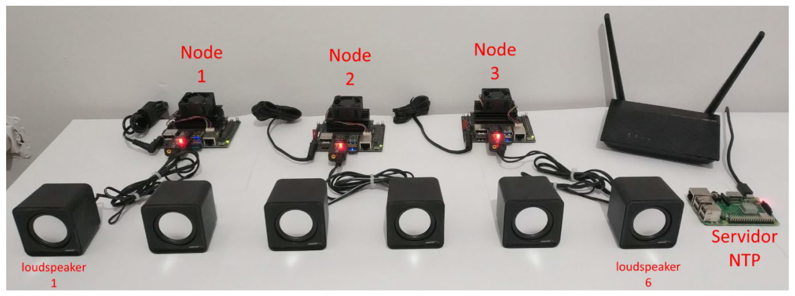
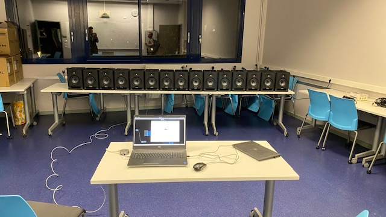
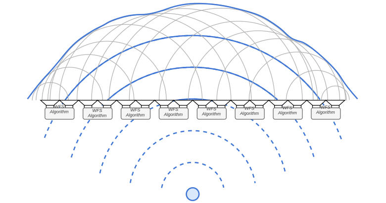
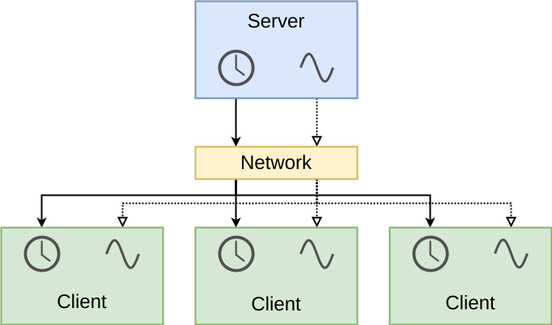

# -*- coding: utf-8 -*-
# -*- mode: org -*-

#+TITLE: Enabling Distributed Spatial Audio
#+AUTHOR: Thomas Rushton, INSA/Inria/Emeraude

#+OPTIONS: num:nil toc:1 ^:{} ':t
#+OPTIONS: reveal_width:1200 reveal_height:800 reveal_slide_number:c/t
#+EXPORT_FILE_NAME: index
#+REVEAL_ROOT: ../reveal.js
#+REVEAL_THEME: white
#+REVEAL_TRANS: slide
#+REVEAL_PLUGINS: (math)
#+REVEAL_EXTRA_CSS: style.css
#+REVEAL_MIN_SCALE: 1.0
#+REVEAL_MAX_SCALE: 1.0
#+REVEAL_EXTRA_OPTIONS: hash: true, fragmentInURL: true
#+REVEAL_TITLE_SLIDE: <h1>%t</h1><h2>%s</h2><h3>%a</h3>
#+REVEAL_TITLE_SLIDE_BACKGROUND: #141414
#+REVEAL_TITLE_SLIDE_EXTRA_ATTR: class="title-slide"

* About This Presentation                                          :noexport:

This =org= file describes my presentation for a meeting with
Jean-Michel Friedt.

** Dependencies

- =org-re-reveal= ([[https://gitlab.com/oer/org-re-reveal/-/tree/main][gitlab]]), which enables export support from Org to [[https://revealjs.com/][Reveal.js]].

** Running the Presentation

From the reveal.js directory (=../reveal.js=), run:

#+begin_src shell :noeval :exports code
npm start -- --root=../
#+end_src

Then navigate to [[localhost:8000/meeting-jmfriedt/]].
    
* Distributed Spatial Audio
:PROPERTIES:
:reveal_background: #141414
:reveal_extra_attr: class="title-slide"
:END:

** Wave Field Synthesis
[[./images/wfs1.svg]]

Aim: synthesise a wavefront via secondary point sources

#+ATTR_REVEAL: :frag t
/Holophony/

** Motivation

[[./images/wfs2.svg]]

WFS systems are typically centralised, /in situ/ installations

#+ATTR_REVEAL: :frag t
Lots of output channels --- costly, exclusive

** IRCAM, Paris

 [[./images/ircam2.png]]

Espace de Projection, 339 loudspeakers

** TU Berlin

[[./images/tu-berlin.webp]]

WellenFeld H 104, 2700 loudspeakers

** "The Sphere", Las Vegas

[[./images/sphere1.jpg]] [[./images/sphere2.jpg]]

167,000 loudspeakers

#+REVEAL: split

[[./images/wfs3.svg]]

WFS is /parallelisable/

What if we could distribute the work?

#+ATTR_REVEAL: :frag t
/Timing/ will be important

** A Distributed Alternative

#+begin_quote
"A distributed system is a collection of independent entities that
cooperate to solve a problem that cannot be individually solved."
#+end_quote
#+begin_export html
<small>
#+end_export
Kshemkalyani & Singhal, 2011, /Distributed Computing: Principles,
Algorithms, and Systems/.
#+begin_export html
</small>
#+end_export

#+ATTR_REVEAL: :frag (appear)
- Scalabale, with no performance penalty
- Modular: entities act independently
  + More overall computing power available
- Reduced cost-per-channel; incrementally extensible
- *Improved accessibility*

** Requirements

#+ATTR_REVEAL: :frag (appear)
- A source of audio and control data
  #+ATTR_REVEAL: :frag (appear)
  + General purpose computer
  + Standalone software/audio plugin
- A means of transmission
  #+ATTR_REVEAL: :frag (appear)
  + Ethernet is the standard for multichannel audio
  + UDP --- basis for OSC, RTP, PTP
  + AVB/AES67 --- suites of technical standards
- A collection of recipients for that data
  #+ATTR_REVEAL: :frag (appear)
  + Low-cost, programmable computing platform
  + Support for audio and ethernet
- An authoritative source of time
  #+ATTR_REVEAL: :frag (appear)
  + PTP... but enabled hardware increases costs
  + Possible as a software implementation?

* State of the Art
:PROPERTIES:
:reveal_background: #141414
:reveal_extra_attr: class="title-slide"
:END:

** Distributed ambisonics

#+ATTR_HTML: :width 600px

Devonport & Foss, /The Distribution of Ambisonic and Point Source
Rendering to Ethernet AVB Speakers/, 2019.

** Distributed WFS

#+ATTR_HTML: :width 600px

Belloch et al., /On the performance of a GPU-based SoC in a
distributed spatial audio system,/ 2021.

* Prior Work
:PROPERTIES:
:reveal_background: #141414
:reveal_extra_attr: class="title-slide"
:END:

** First Iteration

#+ATTR_REVEAL: :frag (appear)
- Based on the /Teensy 4.1/ microcontroller development board
- Served by standalone control software
- Audio server: JackTrip
  #+ATTR_REVEAL: :frag (appear)
  + Unicast only
  + Based on JACK: not truly cross-platform

#+REVEAL: split

#+ATTR_HTML: :width 750px

T. A. Rushton, R. Michon, S. Letz, 2023, "A Microcontroller-Based
Network Client Towards Distributed Spatial Audio", /Proceedings of
the 2023 Sound and Music Computing Conference (SMC-23)/.

** Second Iteration

#+ATTR_REVEAL: :frag (appear)
- Teensy 4.1
- VST plugin
- Bespoke multicast server

#+REVEAL: split

#+ATTR_HTML: :width 1000px
[[./images/system_overview.jpg]]

#+REVEAL: split

T. A. Rushton, R. Michon, S. Serafin, T. Risset, S. Letz, "Networked
Microcontrollers for Accessible, Distributed Spatial Audio", /under
review/.

* Challenges
:PROPERTIES:
:reveal_background: #141414
:reveal_extra_attr: class="title-slide"
:END:

** Time

/Jitter/ and /clock drift/

#+ATTR_REVEAL: :frag t
Neither prior system featured a truly authoritative source of time

#+ATTR_REVEAL: :frag t
Time inferred from the rate of network transmission

#+ATTR_REVEAL: :frag t
Jitter compensation via a /delay-locked loop/ and adaptive resampling

#+ATTR_REVEAL: :frag t
Clock drift compensation via PLL adjustments

#+REVEAL: split

Clients synchronised to ~500 \micro{}s, dependent on:
#+ATTR_REVEAL: :frag (appear)
- Sampling rate \rightarrow sample period
- Buffer size, packet size
  #+ATTR_REVEAL: :frag t
  + Dictates channel count, jitter sensitivity
- Jitter buffer r/w delta

#+ATTR_REVEAL: :frag t
Assuming $c =$ 343 m/s, up to ~17 cm propagation discrepancy

#+ATTR_REVEAL: :frag t

#+REVEAL: split

Clients /experience/ clock drift and jitter differently

#+ATTR_REVEAL: :frag t
Relative inter-client temporal movement may cause audible phasing

* Potential Solutions
:PROPERTIES:
:reveal_background: #141414
:reveal_extra_attr: class="title-slide"
:END:

** Clock Conditioning

Server sends audio and clock data over the network
#+ATTR_REVEAL: :frag t
Client clocks are /conditioned/ to follow the server

#+REVEAL: split

#+ATTR_HTML: :width 700px
[[./images/ptpflow.png]]

John C. Edison, 2005, "IEEE 1588 Basics", /Proceedings of the 2005
Conference on IEEE 1588 Standard for a Precision Clock Synchronization
Protocol for Networked Measurement and Control Systems/.

#+REVEAL: split

[[./images/conditioning2.svg]]

Audio and system clocks derived from the same crystal oscillator, but
distinct

#+ATTR_REVEAL: :frag (appear)
- Is it possible to count ticks of the server's audio clock?
- If so, can this be done in cross-platform fashion?
- For a software PTP implementation, how big a problem is jitter?

** Clock Sharing

#+ATTR_HTML: :width 550px
[[./images/sharing.svg]]

#+ATTR_REVEAL: :frag (appear)
- Audio timing governed by a device whose audio clock we can access
  and share
- Demands an extra cable per client, amplification of the clock signal
- Synchronisation of audio playback not guaranteed

** Candidate platforms

** Teensy 4.1

#+ATTR_HTML: :width 400px
[[./images/teensy.jpg]]

#+ATTR_REVEAL: :frag (appear)
- Powerful processor; limited memory, limited scalability
- Adjustable audio clock
  + In an ideal software PTP setup, < 0.5 ppm drift
- Accepts external clock; can be run as USB audio interface
- Audio shield only capable of 16-bit output

** Raspberry Pi

#+ATTR_REVEAL: :frag (appear)
- Operable as a /bare metal/ device
- Much more memory, (limited) multicore support
- 24 and 32-bit audio supported
- Clock also adjustable, < 0.75 ppm drift
- No support at present for running as audio interface; no UDP multicast
  
* Thank you
:PROPERTIES:
:UNNUMBERED: notoc
:reveal_background: #141414
:reveal_extra_attr: class="title-slide"
:END:
