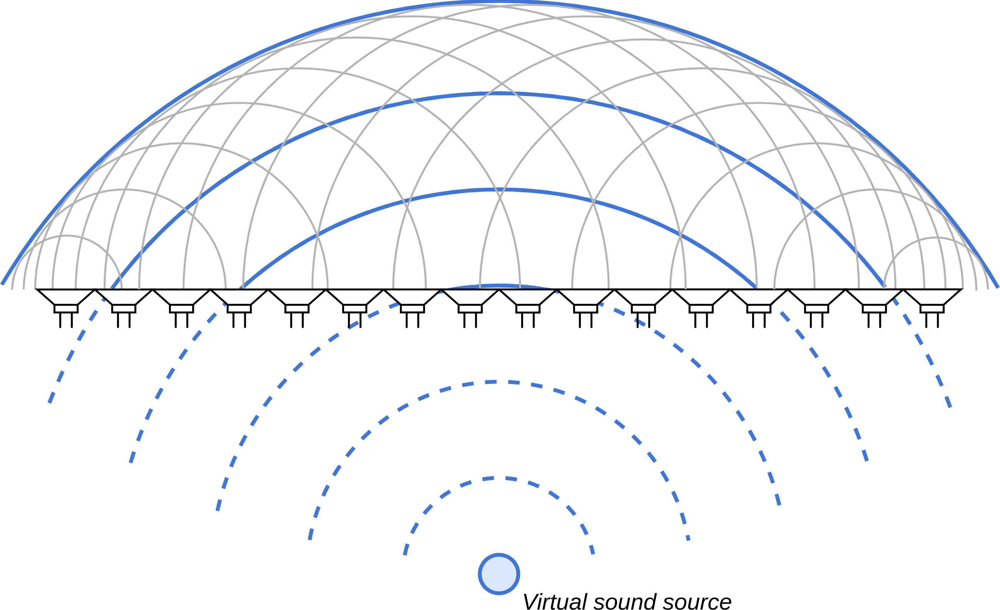
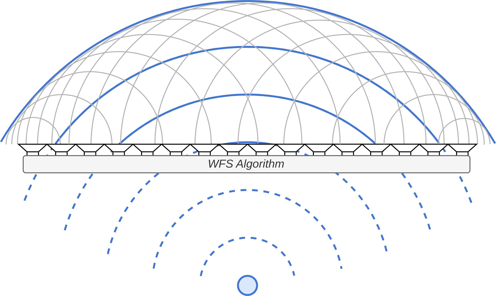
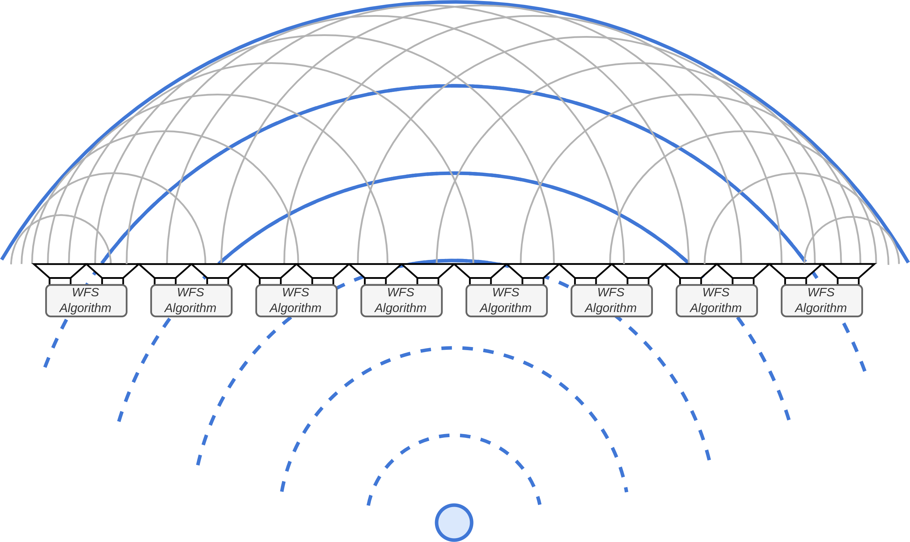
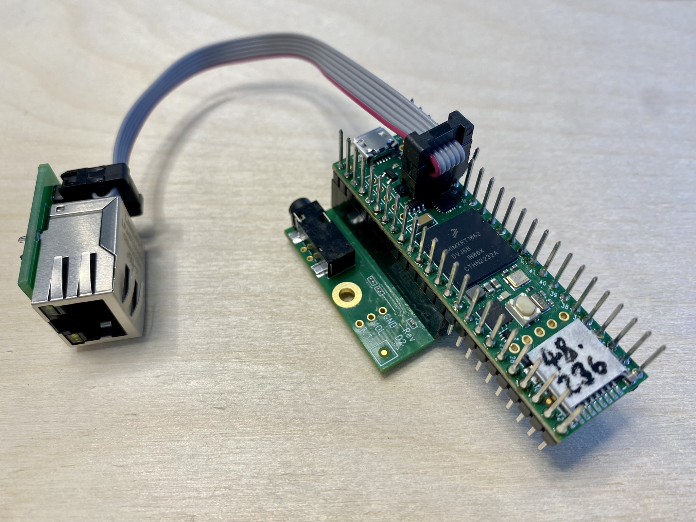
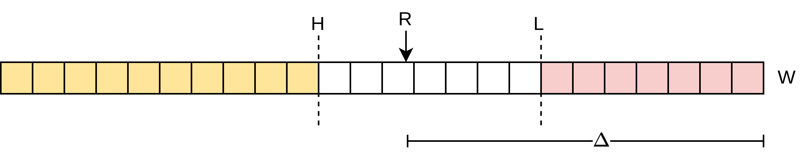
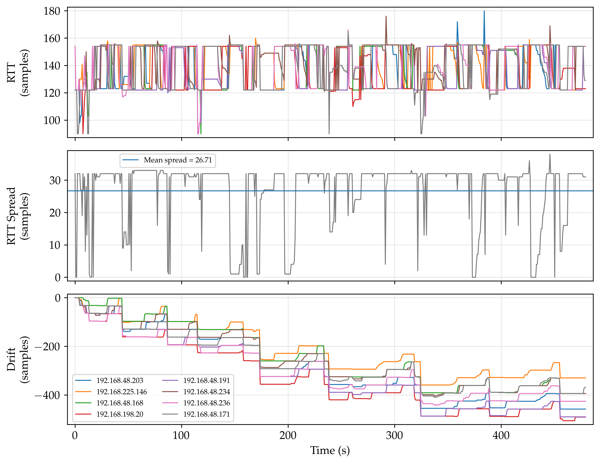
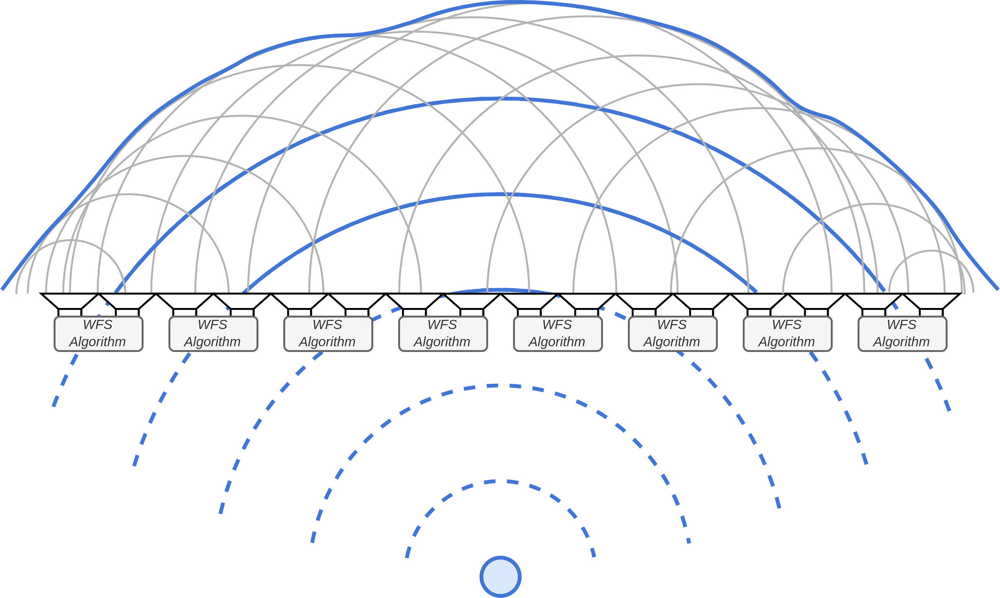
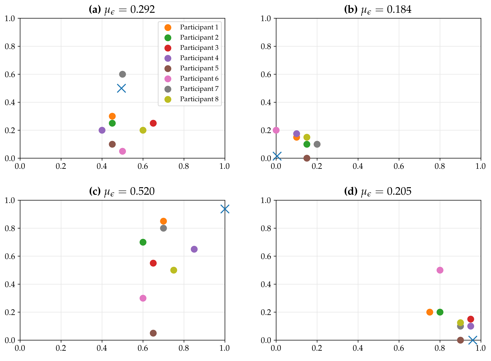

# -*- coding: utf-8 -*-
# -*- mode: org -*-

#+TITLE: Enabling Distributed Spatial Audio / Differentiable DSP in Faust
#+AUTHOR: Thomas Rushton

#+OPTIONS: num:nil toc:nil reveal_width:1200 reveal_height:800 ^:{} ':t
#+EXPORT_FILE_NAME: index
#+PROPERTY: header-args:faust :line-numbers false
#+PROPERTY: header-args:css :results none :exports none :tangle yes
#+REVEAL_ROOT: ../reveal.js
#+REVEAL_THEME: white
#+REVEAL_PLUGINS: (math)
#+REVEAL_EXTRA_CSS: seminaire-emeraude-2024.css
#+REVEAL_MIN_SCALE: 1.0
#+REVEAL_MAX_SCALE: 1.0
#+REVEAL_EXTRA_OPTIONS: hash: true, fragmentInURL: true
# #+REVEAL_HIGHLIGHT_CSS: %r/plugin/highlight/monokai.css
# #+REVEAL_HIGHLIGHT_CSS: %r/node_modules/highlight.js/styles/zenburn.css
# #+REVEAL_EXTRA_SCRIPTS: 
#+REVEAL_EXTRA_SCRIPTS: ("faust-web-component.js" "faust-stop-on-slidechanged.js")
#+REVEAL_TITLE_SLIDE: <h1>%t</h1><h2>%s</h2><h3>%a</h3>

* About This Presentation                                          :noexport:

This =org= file describes my presentation for the 2024 Emeraude Seminaire

** Dependencies

- =org-re-reveal= ([[https://gitlab.com/oer/org-re-reveal/-/tree/main][gitlab]]), which enables export support from Org to [[https://revealjs.com/][Reveal.js]].
- =faust-web-component.js=, which provides a customised version of the
  ~<faust-editor>~ [[https://github.com/grame-cncm/faust-web-component][web component]] with support for specifying
  attributes and styling the content area of the component.
  + This version of =faust-web-component.js= is a build of a [[https://github.com/hatchjaw/faust-web-component][fork]] of
    the original repository.
- =ob-faust= ([[https://github.com/hatchjaw/ob-faust][github]]), which adds (basic) support for Faust to Org Babel.
- Emacs =faust-mode=, modified slightly to fix syntax highlighting in
  source blocks.

** Running the Presentation

Tangle CSS...

#+begin_src css
.org-src-container > pre {
    padding: 1em;
    width: 66.6%;
}

.title-page > h2 {
    color: #ededed;
}

.faust-editor-wrap {
    font-size: 2rem;
}
#+end_src

Then, from the reveal.js directory (=../reveal.js=), run:

#+begin_src shell :noeval :exports code
npm start -- --root=../
#+end_src

Then navigate to [[http://localhost:8000/seminaire-emeraude-2024/]].

* Whom?

#+ATTR_REVEAL: :frag (appear)
- Name: Thomas Albert Rushton
- Born: Manchester, UK, 1985
- BMus Music Technology, The University of Edinburgh, 2009
- Life?...
  #+ATTR_REVEAL: :frag (appear)
  + Performing arts technician
  + Computer programmer, print industry
  + Musician, bicycle mechanic
  + Web application developer
  + Contractor, "full-stack" troubleshooter
  + Freelancer, web/software licensing
- MSc Sound & Music Computing, Aalborg University (Copenhagen) 2023

* ENABLING DISTRIBUTED SPATIAL AUDIO
:PROPERTIES:
:reveal_background: #141414
:reveal_extra_attr: class="title-page"
:END:

* Wave Field Synthesis

#+ATTR_HTML: :width 750px

- Synthesise a wavefront via secondary point sources
#+ATTR_REVEAL: :frag t
- /Holophony/

* Motivation

#+ATTR_HTML: :width 750px

WFS systems are typically centralised

#+ATTR_REVEAL: :frag t
Lots of output channels --- costly

#+REVEAL: split

#+ATTR_HTML: :width 750px

What if we could distribute the work?

#+ATTR_REVEAL: :frag t
/Synchronicity/ will be important

* Distributed Systems

#+begin_quote
"A distributed system is a collection of independent entities that
cooperate to solve a problem that cannot be individually solved."
#+end_quote
#+begin_export html
<small>
#+end_export
Kshemkalyani & Singhal, /Distributed Computing: Principles,
Algorithms, and Systems/, 2011.
#+begin_export html
</small>
#+end_export

** Desirable Qualities

#+ATTR_REVEAL: :frag (appear)
- Scalability
  #+ATTR_REVEAL: :frag t
  + Adding more entities /does not pose a bottleneck/ for the
    communication channel
- Modularity
  #+ATTR_REVEAL: :frag t
  + The performance of a given entity is /independent/ of that
    of other entities
- Improved cost/performance ratio
  #+ATTR_REVEAL: :frag t
  + A scalable, modular system is /incrementally extensible/ with
    /minimal redundancy/

** Undesirable Qualities

#+ATTR_REVEAL: :frag (appear)
- Complexity
  #+ATTR_REVEAL: :frag t
  + Harder to update and troubleshoot
- More potential points of failure
- Authoritative source of time not guaranteed
    
* Networked Audio

#+ATTR_REVEAL: :frag (appear)
- Audio over ethernet; OSC messages
- Many audio channels, and streams of control data, over one cable,
  bidirectionally
- UDP --- /connectionless/, /one-to-many/ --- is the way to go
- For synchronisation, PTP... but this may increase costs

* The Hardware Platform

#+ATTR_HTML: :width 500px

- Teensy 4.1
- Support for ethernet and audio
- Powerful, easily reprogrammable
- ~€45
- Faust support

* Research Questions

#+ATTR_REVEAL: :frag t
#+begin_quote
How can a network of microcontrollers be used to create a distributed
audio system suitable for managing scalable installations for spatial
and immersive audio?
#+end_quote

#+ATTR_REVEAL: :frag t
#+begin_quote
How can such a system be created and configured such that it maintains
inter-client synchronicity? What are the effects of loss of
synchronicity on distributed spatialisation algorithms?
#+end_quote

* Prior Art

#+REVEAL: split

#+ATTR_HTML: :width 600px
[[./images/devonport-foss2019.png]]

Devonport & Foss, /The Distribution of Ambisonic and Point Source
Rendering to Ethernet AVB Speakers/, 2019.

#+REVEAL: split

#+ATTR_HTML: :width 600px
[[./images/belloch2021.png]]

Belloch et al., /On the performance of a GPU-based SoC in a
distributed spatial audio system,/ 2021.

#+REVEAL: split

T. A. Rushton, R. Michon, S. Letz, 2023, "[[https://inria.hal.science/hal-04169238/document][A Microcontroller-Based
Network Client Towards Distributed Spatial Audio]]", /Proceedings of
the 2023 Sound and Music Computing Conference (SMC-23)/.

- JackTrip-based, unicast only

* Multicast System Overview

#+ATTR_HTML: :width 1000px
[[./images/system_overview.jpg]]

* Challenges & Mitigations

** Jitter

#+ATTR_REVEAL: :frag (appear)
- /Fluctuations in the rate of transmission/
- Clients write incoming audio data to a circular buffer
  #+ATTR_HTML: :width 700px
  
#+ATTR_REVEAL: :frag (appear)
- Aim to maintain a consistent read-write delta
- /Delay-locked loop/
- Fractional read-position increment
- Interpolate to yield sample amplitude
- /Adaptive resampling/

** Clock Drift

#+ATTR_REVEAL: :frag (appear)
- /No two clocks are identical/
- Compute ratio of packets received to packets sent
- Use ratio to determine sampling rate
- Adjust by setting Audio PLL
  
* Results

#+ATTR_HTML: :width 550px

- Clients move relative to each other...
- ...but remain within about one buffer's worth of samples

#+REVEAL: split

#+ATTR_HTML: :width 750px

- Asynchronicity will result in irregular wavefronts
- Rapid resampling adaptations will cause audible phasing

#+REVEAL: split

#+ATTR_HTML: :width 700px

- A degree of irregularity may not completely undermine the holophonic
  effect

** Conclusions

#+REVEAL_HTML: 

#+ATTR_REVEAL: :frag (appear)
- No appreciable timing improvement with multicast...
  #+ATTR_REVEAL: :frag t
  + Scalability improved, however
- Extensibility restricted by limited memory
#+REVEAL_HTML: 

#+REVEAL_HTML: 

#+ATTR_REVEAL: :frag (appear)
- Development of a multicast server for audio and control data
- Evidence that the distributed WFS algorithm produces localisable sound
#+REVEAL_HTML: 

** Outlook

#+ATTR_REVEAL: :frag (appear)
- Teensy lacks memory, and only handles 16-bit audio
- Raspberry Pi can be run /bare-metal/; much more memory and higher
  audio quality at comparable cost
  #+ATTR_REVEAL: :frag (appear)
  + No Faust support (yet) though
  + No standard library, kind of /fragile/
- Time still an issue
  #+ATTR_REVEAL: :frag (appear)
  + Share a clock signal?
  + Implement software-only PTP?
  + Jitter still a problem... investigate all causes
- Ambisonics; extensions to WFS
 
* DIFFERENTIABLE DSP IN FAUST
:PROPERTIES:
:reveal_background: #141414
:reveal_extra_attr: class="title-page"
:END:

* Differentiable Programming

- Differentiate a program (analytically) with respect to its inputs
  + Automatic differentiation (AD)
- Compute the sensitivity of a program's outputs to changes in its
  inputs
  
\begin{equation*}
\frac{\partial y}{\partial\mathbf{x}} = \begin{bmatrix}\frac{\partial y}{\partial x_1} \\
\vdots \\
\frac{\partial y}{\partial x_N}\end{bmatrix}
\end{equation*}

#+REVEAL: split

- Key to gradient-based optimisation problems
- Native support in some languages, e.g. Swift
- Support via libraries in Python, Julia, etc.

* Differentiable DSP

- Application of differentiable programming to audio tasks
  + Source separation
  + Timbre transfer
  + Parameter estimation, etc.
- Possible in Faust via the DawDreamer project
  + Transpilation of Faust to Python
  + AD via JAX

* DDSP in Faust

** A Differentiable Primitive

#+begin_src faust :results silent
process = +;
#+end_src

#+ATTR_REVEAL: :frag t
$y = u + v$

#+ATTR_REVEAL: :frag t
Differentiate wrt. $x$:
\[
\frac{dy}{dx} = \frac{d}{dx}\left(u + v\right) = \frac{du}{dx} +
\frac{dv}{dx}
\]

#+REVEAL: split

- We can represent the addition and its derivative in parallel

#+begin_src faust :results html :exports results :tab svg :sizes 0,100 :class dual-add
process = +,+;
#+end_src

#+RESULTS:
#+begin_export html
<faust-editor sizes="[0,100]" tab="svg" class="dual-add">
<!--
process = +,+;
-->
</faust-editor>
#+end_export

#+begin_src css
.dual-add::part(content)
{
    height: 6em;
}
#+end_src

#+ATTR_REVEAL: :frag t
\begin{align*}
\langle y, \frac{dy}{dx} \rangle
&= \langle u, \frac{du}{dx} \rangle + \langle v, \frac{dv}{dx} \rangle \\
&= \langle u + v, \frac{du}{dx} + \frac{dv}{dx} \rangle
\end{align*}

#+ATTR_REVEAL: :frag t
Dual number \rightarrow */Dual signal/*

** /Where's the derivative?/

#+REVEAL: split

It's assumed that each derivative has been calculated elsewhere

We need to define a derivative for /every/ primitive.

#+begin_src faust :results html :exports results :tab svg :sizes 0,100 :class dual-add-again
x = hslider("x", 0, -1, 1, .1);
u = _;
v = x;
dudx = 0;
dvdx = 1;
process = u,v,dudx,dvdx : +,+;
#+end_src

#+RESULTS:
#+begin_export html

<faust-editor sizes="[0,100]" tab="svg" lineNumbers="nil" class="dual-add-again">
<!--
x = hslider("x", 0, -1, 1, .1);
u = _;
v = x;
dudx = 0;
dvdx = 1;
process = u,v,dudx,dvdx : +,+;
-->
</faust-editor>

#+end_export

#+begin_src css
.dual-add-again::part(content)
{
    height: 10em;
}
#+end_src

** Making it /Automatic/

#+begin_src faust :results silent
diffInput = _,0;
diffSlider = hslider("x", 0, -1, 1, .1),1;
#+end_src

#+ATTR_REVEAL: :frag t
#+begin_src faust :results silent
diffAdd = route(4,4,(1,1),(2,3),(3,2),(4,4)) : +,+;
#+end_src

#+REVEAL: split

#+begin_src faust :results html :exports results :tab svg :sizes 0,100 :class dual-add-again
diffInput = _,0;
diffSlider = hslider("x", 0, -1, 1, .1),1;
diffAdd = route(4,4,(1,1),(2,3),(3,2),(4,4)) : +,+;
process = diffInput,diffSlider : diffAdd;
#+end_src

#+RESULTS:
#+begin_export html
<faust-editor sizes="[0,100]" tab="svg" class="dual-add-again">
<!--
diffInput = _,0;
diffSlider = hslider("x", 0, -1, 1, .1),1;
diffAdd = route(4,4,(1,1),(2,3),(3,2),(4,4)) : +,+;
process = diffInput,diffSlider : diffAdd;
-->
</faust-editor>
#+end_export

** Multivariate Problems

*** Variable gain and DC offset

#+begin_src faust :results html :exports results :tab svg :sizes 0,100 :class multivariate
x1 = hslider("gain", .5, 0, 1, .1);
x2 = hslider("dc", 0, -1, 1, .1);
process = _,x1 : *,x2 : +;
#+end_src

#+RESULTS:
#+begin_export html
<faust-editor sizes="[0,100]" tab="svg" class="multivariate">
<!--
x1 = hslider("gain", .5, 0, 1, .1);
x2 = hslider("dc", 0, -1, 1, .1);
process = _,x1 : *,x2 : +;
-->
</faust-editor>
#+end_export

#+begin_src css
.multivariate::part(content)
{
    height: 6.5em;
}
#+end_src

\[y = uv + w, \quad v = x_1, \quad w = x_2\]

#+ATTR_REVEAL: :frag t
\[
y' = \frac{\partial y}{\partial \mathbf{x}}
= \begin{bmatrix}\frac{\partial y}{\partial x_1} \\
\frac{\partial y}{\partial x_2}\end{bmatrix}
\]

*** Dual Signal Representation

\begin{align*}
\langle y,y' \rangle &=
\langle u,u' \rangle \langle v,v' \rangle + \langle w,w' \rangle \\
&= \langle uv,u'v + v'u \rangle + \langle w,w' \rangle \\
&= \langle uv + w,u'v + v'u + w'\rangle
\end{align*}

*** Implementation in Faust

#+begin_src faust :results html :exports results :tab svg :sizes 0,100 :class gain-dc
NVARS = 2;
x1 = diffSlider(NVARS,1,.5,0,1,.1);
x2 = diffSlider(NVARS,2,0,-1,1,.1);
process = diffInput(NVARS),x1 : diffMul(NVARS),x2 : diffAdd(NVARS);

diffInput(nvars) = _,par(i,nvars,0);

diffSlider(nvars,I,init,lo,hi,step) = hslider("x%I",init,lo,hi,step),par(i,nvars,i==I-1);

diffAdd(nvars) = route(nIN,nOUT,
        (u,1),(v,2), // u + v
        par(i,nvars,
            (u+i+1,dx),(v+i+1,dx+1) // du/dx_i + dv/dx_i
            with {
                dx = 2*i+3; // Start of derivatives wrt ith var
            }
        )
    ) with {
        nIN = 2+2*nvars;
        nOUT = nIN;
        u = 1;
        v = u+nvars+1;
    } : +,par(i, nvars, +);

diffMul(nvars) = route(nIN,nOUT,
        (u,1),(v,2), // u * v
        par(i,nvars,
            (u,dx),(dvdx,dx+1),   // u * dv/dx_i
            (dudx,dx+2),(v,dx+3)  // du/dx_i * v
            with {
                dx = 4*i+3; // Start of derivatives wrt ith var
                dudx = u+i+1;
                dvdx = v+i+1;
            }
        )
    ) with {
        nIN = 2+2*nvars;
        nOUT = 2+4*nvars;
        u = 1;
        v = u+nvars+1;
    } : *,par(i, nvars, *,* : +);
#+end_src

#+RESULTS:
#+begin_export html
<faust-editor sizes="[0,100]" tab="svg" class="gain-dc">
<!--
NVARS = 2;
x1 = diffSlider(NVARS,1,.5,0,1,.1);
x2 = diffSlider(NVARS,2,0,-1,1,.1);
process = diffInput(NVARS),x1 : diffMul(NVARS),x2 : diffAdd(NVARS);

diffInput(nvars) = _,par(i,nvars,0);

diffSlider(nvars,I,init,lo,hi,step) = hslider("x%I",init,lo,hi,step),par(i,nvars,i==I-1);

diffAdd(nvars) = route(nIN,nOUT,
        (u,1),(v,2), // u + v
        par(i,nvars,
            (u+i+1,dx),(v+i+1,dx+1) // du/dx_i + dv/dx_i
            with {
                dx = 2*i+3; // Start of derivatives wrt ith var
            }
        )
    ) with {
        nIN = 2+2*nvars;
        nOUT = nIN;
        u = 1;
        v = u+nvars+1;
    } : +,par(i, nvars, +);

diffMul(nvars) = route(nIN,nOUT,
        (u,1),(v,2), // u * v
        par(i,nvars,
            (u,dx),(dvdx,dx+1),   // u * dv/dx_i
            (dudx,dx+2),(v,dx+3)  // du/dx_i * v
            with {
                dx = 4*i+3; // Start of derivatives wrt ith var
                dudx = u+i+1;
                dvdx = v+i+1;
            }
        )
    ) with {
        nIN = 2+2*nvars;
        nOUT = 2+4*nvars;
        u = 1;
        v = u+nvars+1;
    } : *,par(i, nvars, *,* : +);
-->
</faust-editor>
#+end_export

#+begin_src css
.gain-dc::part(content)
{
    height: 17em;
}
#+end_src

** Gradient Descent

- Run a ground truth algorithm in parallel with a /learnable/ one
- Compare $y$ and $\hat{y}$ via a loss function
  + L1-norm, time-domain

\[
\mathcal{L}(y,\hat{y}) = ||y-\hat{y}||
\]

#+ATTR_REVEAL: :frag t
Our aim is to minimise the value produced by this loss function

#+REVEAL: split

- Gradient found as the derivative of the loss function
  wrt. $\mathbf{x}$ at time $t$
- Scaled gradients subtracted from parameters to get $\mathbf{x}_{t+1}$

\begin{align*}
\mathbf{x}_{t+1} &= \mathbf{x}_t - \alpha\frac{\partial\mathcal{L}}{\partial \mathbf{x}_t} \\
&= \mathbf{x}_t - \alpha\frac{\partial y}{\partial \mathbf{x}_t}\frac{y-\hat{y}}{|y-\hat{y}|}
\end{align*}

*** Differentiable variables

#+ATTR_REVEAL: :frag (appear)
- We take an inverted approach
- Now sliders are /ground truth/ variables, and bargraphs are
  /learnable/ variables

#+ATTR_REVEAL: :frag t
#+begin_src faust :resutls silent
diffVar(nvars,I,graph) = -~_
    <: attach(graph),par(i,nvars,i+1==I);
#+end_src

#+ATTR_REVEAL: :frag t
This handles the subtraction of the scaled gradient

*** A Grand Recursion

- Ground truth and learnable algorithms in parallel
- Gradients recursed back to the learnable algorithm

#+begin_src faust :results html :exports results :tab svg :sizes 0,100 :class gain-dc-full
import("stdfaust.lib");

process = os.osc(440.) 
    : hgroup("DDSP",(route(1+NVARS,2+NVARS,(1+NVARS,1),(1+NVARS,2),par(i,NVARS,(i+1,i+3))) 
        : hgroup("[0]Parameters",groundTruth,learnable)
        : route(2+NVARS,4+NVARS,(1,1),(2,2),(1,3),(2,4),par(i,NVARS,(i+3,i+5))) 
        : vgroup("[1]Loss & Gradients",loss,gradients)
    )) ~ (!,si.bus(NVARS))
with {
    groundTruth = vgroup("Hidden", 
        _,hslider("[0]gain",.5,0,1,.1) : *,hslider("[1]DC",-.5,-1,1,.1) : +
    );

    NVARS = 2;

    x1 = diffVar(NVARS,1,hbargraph("[0]gain", 0, 1));
    x2 = diffVar(NVARS,2,hbargraph("[1]DC", -1, 1));
    learnable = vgroup("Learned", diffInput(NVARS),x1,_ : diffMul(NVARS),x2 : diffAdd(NVARS));

    loss = ro.cross(2) : - : abs <: attach(hbargraph("[1]loss",0.,2));
    alpha = hslider("[0]Learning rate [scale:log]", 1e-4, 1e-6, 1e-1, 1e-6);
    gradients = (ro.cross(2): -),si.bus(NVARS)
        : route(NVARS+1,2*NVARS+1,(1,1),par(i,NVARS,(1,i*2+3),(i+2,2*i+2)))
        : (abs,1e-10 : max),par(i,NVARS, *)
        : route(NVARS+1,NVARS*2,par(i,NVARS,(1,2*i+2),(i+2,2*i+1)))
        : par(i,NVARS, /,alpha : * <: attach(hbargraph("gradient %i",-1e-2,1e-2)));
};

diffVar(nvars,I,graph) = -~_ <: attach(graph),par(i,nvars,i+1==I);

diffInput(nvars) = _,par(i,nvars,0);

diffSlider(nvars,I,init,lo,hi,step) = hslider("x%I",init,lo,hi,step),par(i,nvars,i==I-1);

diffAdd(nvars) = route(nIN,nOUT,
        (u,1),(v,2), // u + v
        par(i,nvars,
            (u+i+1,dx),(v+i+1,dx+1) // du/dx_i + dv/dx_i
            with {
                dx = 2*i+3; // Start of derivatives wrt ith var
            }
        )
    ) with {
        nIN = 2+2*nvars;
        nOUT = nIN;
        u = 1;
        v = u+nvars+1;
    } : +,par(i, nvars, +);

diffMul(nvars) = route(nIN,nOUT,
        (u,1),(v,2), // u * v
        par(i,nvars,
            (u,dx),(dvdx,dx+1),   // u * dv/dx_i
            (dudx,dx+2),(v,dx+3)  // du/dx_i * v
            with {
                dx = 4*i+3; // Start of derivatives wrt ith var
                dudx = u+i+1;
                dvdx = v+i+1;
            }
        )
    ) with {
        nIN = 2+2*nvars;
        nOUT = 2+4*nvars;
        u = 1;
        v = u+nvars+1;
    } : *,par(i, nvars, *,* : +);
#+end_src

#+RESULTS:
#+begin_export html
<faust-editor sizes="[0,100]" tab="svg">
<!--
import("stdfaust.lib");

process = os.osc(440.) 
    : hgroup("DDSP",(route(1+NVARS,2+NVARS,(1+NVARS,1),(1+NVARS,2),par(i,NVARS,(i+1,i+3))) 
        : vgroup("[0]Parameters",groundTruth,learnable)
        : route(2+NVARS,4+NVARS,(1,1),(2,2),(1,3),(2,4),par(i,NVARS,(i+3,i+5))) 
        : vgroup("[1]Loss & Gradients",loss,gradients)
    )) ~ (!,si.bus(NVARS))
with {
    groundTruth = vgroup("Hidden", 
        _,hslider("[0]gain",.5,0,1,.1) : *,hslider("[1]DC",-.5,-1,1,.1) : +
    );

    NVARS = 2;

    x1 = diffVar(NVARS,1,hbargraph("[0]gain", 0, 1));
    x2 = diffVar(NVARS,2,hbargraph("[1]DC", -1, 1));
    learnable = vgroup("Learned", diffInput(NVARS),x1,_ : diffMul(NVARS),x2 : diffAdd(NVARS));

    loss = ro.cross(2) : - : abs <: attach(hbargraph("[1]loss",0.,2));
    alpha = hslider("[0]Learning rate [scale:log]", 1e-4, 1e-6, 1e-1, 1e-6);
    gradients = (ro.cross(2): -),si.bus(NVARS)
        : route(NVARS+1,2*NVARS+1,(1,1),par(i,NVARS,(1,i*2+3),(i+2,2*i+2)))
        : (abs,1e-10 : max),par(i,NVARS, *)
        : route(NVARS+1,NVARS*2,par(i,NVARS,(1,2*i+2),(i+2,2*i+1)))
        : par(i,NVARS, /,alpha : * <: attach(hbargraph("gradient %i",-1e-2,1e-2)));
};
-->
</faust-editor>
#+end_export

#+begin_src css
.gain-dc-full::part(content)
{
    height: 8em;
}
#+end_src

\[
\mathcal{L}(y,\hat{y}) = ||y-\hat{y}|| \\
\mathbf{x}_{t+1} = \mathbf{x}_t - \alpha\frac{\partial y}{\partial \mathbf{x}_t}\frac{y-\hat{y}}{|y-\hat{y}|}
\]

We're /sonifying/ the loss function.

* Improvements

#+begin_src faust :results silent
df = library("diff.lib");
#+end_src

** Setting up a Differentiable Environment

#+begin_src faust :results silent
// diff.lib
vars(vars) = environment {
    N = outputs(vars);
    var(i) = ba.take(i,vars),pds(N,i)
    with {
        pds(N,i) = par(j,N,i-1==j);
    };
};

// my.dsp
df = library("diff.lib");

vars = df.vars((x1,x2))
with {
    x1 = -~_ <: attach(hbargraph("x1",0,1));
    x2 = -~_ <: attach(hbargraph("x2",0,1));
};

d = df.env(vars);
#+end_src

#+ATTR_REVEAL: :frag t
No longer necessary to pass ~NVARS~ to every primitive 👏

** Using the Differentiable Environment

#+begin_src faust :results silent
// Ground truth algorithm
groundTruth = _,gain,dc : *,_ : +
with {
    gain = hslider("[0]Gain", .5, 0, 2, .01);
    dc = hslider("[1]DC", .5, -1, 1, .01);
};

// Declare a list of differentiable variables 
vars = df.vars((gain,dc))
with {
    gain = -~_ <: attach(hbargraph("[5]Gain",0,2));
    dc = -~_ <: attach(hbargraph("[6]DC",-1,1));
};

// Build the environment
d = df.env(vars);

// Write a differentiable, learnable algorithm
learnable = d.input,vars.var(1),vars.var(2)
    : d.diff(*),d.diff(_)
    : d.diff(+);
#+end_src

Makes use of Faust's /pattern-matching/ feature

* More Examples

#+ATTR_HTML: :target _blank
[[https://faustide.grame.fr][🚀]]

* Limitations

#+ATTR_REVEAL: :frag (appear)
- Basic stochastic gradient descent
- All input is deterministic
  + ...though arbitrary input could be supplied
- All loss is time-domain
  + For oscillator-based examples, a phase-shift would make it much
    harder to minimise the loss function
- Learning the length of a delay isn't easy
  #+ATTR_REVEAL: :frag (appear)
  + Derivative of a delay wrt. $\mathbf{x}$ contains a derivative
    wrt. time
  + Important for some fairly foundational audio algorithms ---
    phaser, flanger
  + Delay could be modelled as an impulse response\dots inefficient

* Outlook

#+ATTR_REVEAL: :frag (appear)
- More loss functions, optimisers, momentum, parameter normalisation...
- Frequency-domain loss
- Reverse mode...
  + ...though Faust does a very good at optimising its compiled output
- Batched training data
- Offline training \rightarrow weights \rightarrow real-time inference
- To be developed further as a Google Summer of Code project

* Thanks ❤️
