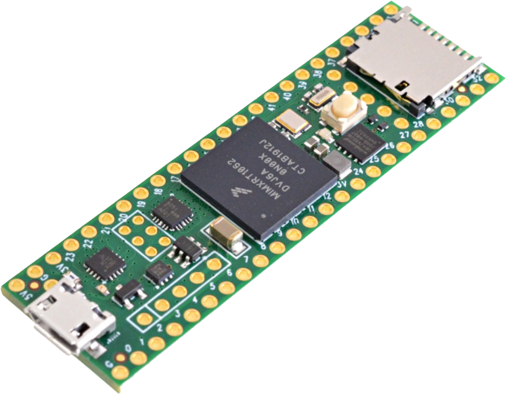
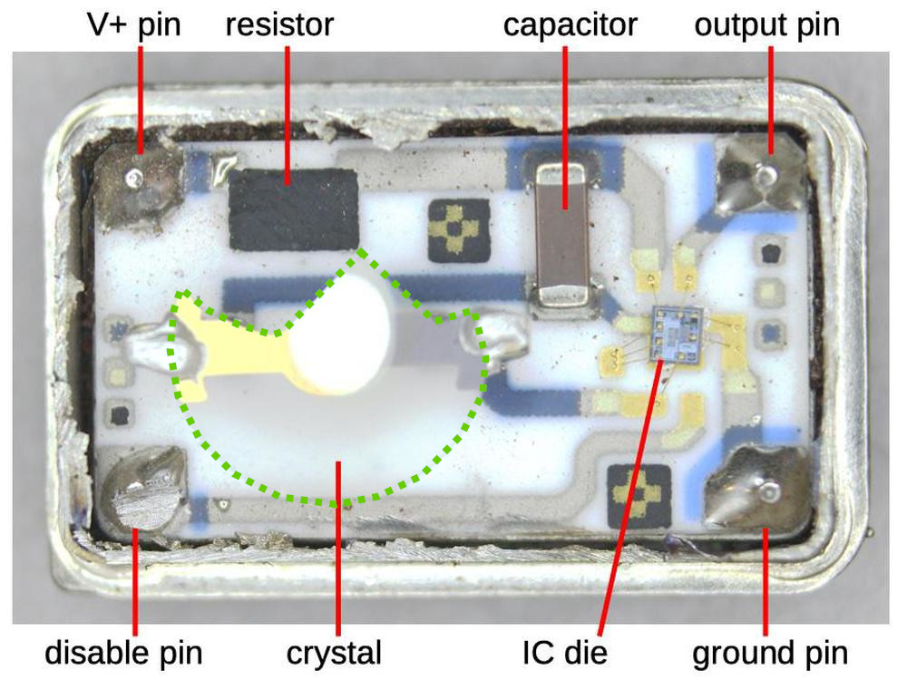

#+title: All Together Now
#+subtitle: A Synchronous Platform For Distributed Spatial Audio
#+author: Thomas Rushton, Romain Michon, Tanguy Risset
#+date: July 2025

#+property: header-args:typst :tangle out/theme-diatypst.typ :noeval
#+options: toc:nil num:nil
#+export_file_name: out/smc-2025-diatypst
#+include: "out/theme-diatypst.typ" export typst

* Typst setup                                                      :noexport:

** Symlink images

#+begin_src emacs-lisp :results none :export none :eval yes
(dired-make-relative-symlink "images" "out/images" t)
#+end_src
  
** Template

[[https://github.com/skriptum/diatypst][Diatypst]] is nice and simple, but a little too simple; I want to be
able to add some images to the title page. Perhaps I should've forked
it... but I really don't want to be learning more than superifical
Typst right now, thank you very much.

Most of the template follows unchanged:

#+begin_src typst
#let layouts = (
  "small": ("height": 9cm, "space": 1.4cm),
  "medium": ("height": 10.5cm, "space": 1.6cm),
  "large": ("height": 12cm, "space": 1.8cm),
)

#let slides(
  content,
  title: none,
  subtitle: none,
  footer-title: none,
  footer-subtitle: none,
  date: none,
  authors: (),
  layout: "medium",
  ratio: 4/3,
  title-color: none,
  bg-color: white,
  count: "dot",
  footer: true,
  toc: true,
  theme: "normal"
) = {

  // Parsing
  if layout not in layouts {
      panic("Unknown layout " + layout)
  }
  let (height, space) = layouts.at(layout)
  let width = ratio * height

  if count not in (none, "dot", "number") {
    panic("Unknown Count, valid counts are 'dot' and 'number', or none")
  }

  if theme not in ("normal", "full") {
      panic("Unknown Theme, valid themes are 'full' and 'normal'")
  }

  // Colors
  if title-color == none {
      title-color = blue.darken(50%)
  }
  let block-color = title-color.lighten(90%)
  let body-color = title-color.lighten(80%)
  let header-color = title-color.lighten(65%)
  let fill-color = title-color.lighten(50%)

  // Setup
  set document(
    title: title,
    author: authors,
  )
  set heading(numbering: "1.a")

  // PAGE----------------------------------------------
  set page(
    fill: bg-color,
    width: width,
    height: height,
    margin: (x: 0.5 * space, top: space, bottom: 0.6 * space),
#+end_src

*** Header

Make sure headings are top-left aligned.

#+begin_src typst
  // HEADER
    header: [
      #context {
        let page = here().page()
        let headings = query(selector(heading.where(level: 2)))
        let heading = headings.rev().find(x => x.location().page() <= page)

        if heading != none {
          set align(top + left)
          if (theme == "full") {
            block(
              width: 100%,
              fill: title-color,
              height: space * 0.85,
              outset: (x: 0.5 * space)
            )[
              #set text(1.4em, weight: "bold", fill: bg-color)
              #v(space / 2)
              #heading.body
              #if not heading.location().page() == page [
                #{numbering("(i)", page - heading.location().page() + 1)}
              ]
            ]
          } else if (theme == "normal") {
            set text(1.4em, weight: "bold", fill: title-color)
            v(space / 2)
            heading.body
            if not heading.location().page() == page [
              #{numbering("(i)", page - heading.location().page() + 1)}
            ]
          }
        }
    }
  // COUNTER
    #if count == "dot" {
      v(-space / 1.5)
      set align(right + top)
      context {
        let last = counter(page).final().first()
        let current = here().page()
        // Before the current page
        for i in range(1,current) {
          link((page:i, x:0pt,y:0pt))[
            #box(circle(radius: 0.08cm, fill: fill-color, stroke: 1pt+fill-color))
          ]
        }
        // Current Page
        link((page:current, x:0pt,y:0pt))[
            #box(circle(radius: 0.08cm, fill: fill-color, stroke: 1pt+fill-color))
          ]
        // After the current page
        for i in range(current+1,last+1) {
          link((page:i, x:0pt,y:0pt))[
            #box(circle(radius: 0.08cm, stroke: 1pt+fill-color))
          ]
        }
      }
    } else if count == "number" {
      v(-space / 1.5)
      set align(right + top)
      context {
        let last = counter(page).final().first()
        let current = here().page()
        set text(weight: "bold")
        set text(fill: white) if theme == "full"
        set text(fill: title-color) if theme == "normal"
        [#current / #last]
      }
    }
    ],
    header-ascent: 0%,
  // FOOTER
    footer: [
      #if footer == true {
        set text(0.7em)
        // Colored Style
        if (theme=="full") {
          columns(2, gutter:0cm)[
            // Left side of the Footer
            #align(left)[#block(
              width: 100%,
              outset: (left:0.5*space, bottom: 0cm),
              height: 0.3*space,
              fill: fill-color,
              inset: (right:3pt)
            )[
              #v(0.1*space)
              #set align(right)
              #smallcaps()[#if footer-title != none {footer-title} else {title}]
              ]
            ]
            // Right Side of the Footer
            #align(right)[#block(
              width: 100%,
              outset: (right:0.5*space, bottom: 0cm),
              height: 0.3*space,
              fill: body-color,
              inset: (left: 3pt)
            )[
              #v(0.1*space)
              #set align(left)
              #if footer-subtitle != none {
                  footer-subtitle
              } else if subtitle != none {
                  subtitle
              } else if authors != none {
                    if (type(authors) != array) {authors = (authors,)}
                    authors.join(", ", last: " and ")
                  } else [#date]
            ]
          ]
          ]
        }
        // Normal Styling of the Footer
        else if (theme == "normal") {
          box()[#line(length: 50%, stroke: 2pt+fill-color )]
          box()[#line(length: 50%, stroke: 2pt+body-color)]
          v(-0.3cm)
          grid(
            columns: (1fr, 1fr),
            align: (right,left),
            inset: 4pt,
            [#smallcaps()[
              #if footer-title != none {footer-title} else {title}]],
            [#if footer-subtitle != none {
                footer-subtitle
            } else if subtitle != none {
                subtitle
            } else if authors != none {
                  if (type(authors) != array) {authors = (authors,)}
                  authors.join(", ", last: " and ")
                } else [#date]
            ],

          )
        }
      }
    ],
    footer-descent:0.3*space,
  )

  // SLIDES STYLING--------------------------------------------------
  // Section Slides
  show heading.where(level: 1): x => {
    set page(header: none,footer: none, margin: 0cm)
    set align(horizon)
      grid(
        columns: (1fr, 3fr),
        inset: 10pt,
        align: (right,left),
        fill: (title-color, bg-color),
        [#block(height: 100%)],[#text(1.2em, weight: "bold", fill: title-color)[#x]]
      )

  }
  show heading.where(level: 2): pagebreak(weak: true) // this is where the magic happens
  show heading: set text(1.1em, fill: title-color)

  // ADD. STYLING --------------------------------------------------
  // Terms
  show terms.item: it => {
    set block(width: 100%, inset: 5pt)
    stack(
      block(fill: header-color, radius: (top: 0.2em, bottom: 0cm), strong(it.term)),
      block(fill: block-color, radius: (top: 0cm, bottom: 0.2em), it.description),
    )
  }

  // Code
  show raw.where(block: false): it => {
    box(fill: block-color, inset: 1pt, radius: 1pt, baseline: 1pt)[#text(it)]
  }

  show raw.where(block: true): it => {
    block(radius: 0.5em, fill: block-color,
          width: 100%, inset: 1em, it)
  }

  // Bullet List
  show list: set list(marker: (
    text(fill: title-color)[•],
    text(fill: title-color)[‣],
    text(fill: title-color)[-],
  ))

  // Enum
  let color_number(nrs) = text(fill:title-color)[*#nrs.*]
  set enum(numbering: color_number)

  // Table
  show table: set table(
    stroke: (x, y) => (
      x: none,
      bottom: 0.8pt+black,
      top: if y == 0 {0.8pt+black} else if y==1 {0.4pt+black} else { 0pt },
    )
  )

  show table.cell.where(y: 0): set text(
    style: "normal", weight: "bold") // for first / header row

  set table.hline(stroke: 0.4pt+black)
  set table.vline(stroke: 0.4pt)

  // Quote
  set quote(block: true)
  show quote.where(block: true): it => {
    v(-5pt)
    block(
      fill: block-color, inset: 5pt, radius: 1pt,
      stroke: (left: 3pt+fill-color), width: 100%,
      outset: (left:-5pt, right:-5pt, top: 5pt, bottom: 5pt)
      )[#it]
    v(-5pt)
  }

  // Link
  show link: it => {
    if type(it.dest) != str { // Local Links
      it
    }
    else {
      underline(stroke: 0.5pt+title-color)[#it] // Web Links
    }
  }

  // Outline
  set outline(
    // target: heading.where(level: 1),
    indent: auto,
  )

  show outline: set heading(level: 2) // To not make the TOC heading a section slide by itself

  // Bibliography
  set bibliography(
    title: none
  )
#+end_src

*** Title page

Again, as per the original template to start:

#+begin_src typst
  // CONTENT---------------------------------------------
  // Title Slide
  if (title == none) {
    panic("A title is required")
  }
  else {
    if (type(authors) != array) {
      authors = (authors,)
    }
    set page(footer: none, header: none, margin: 0cm)
    block(
      inset: (x:0.5*space, y:1em),
      fill: title-color,
      width: 100%,
      height: 60%,
      align(bottom)[#text(2.0em, weight: "bold", fill: bg-color, title)]
    )
    block(
      height: 30%,
      width: 100%,
      inset: (x:0.5*space,top:0cm, bottom: 1em),
      if subtitle != none {[
        #text(1.4em, fill: title-color, weight: "bold", subtitle)
      ]} +
      if subtitle != none and date != none { text(1.4em)[ \ ] } +
      if date != none {text(1.1em, date)} +
      align(left+bottom, authors.join(", ", last: " & "))
    )
#+end_src

*** Logos

With the addition of some logos in the header.

#+begin_src typst
    place(top + right, dx: -2em, dy: 2em)[
        #stack(
          dir: ltr,
          spacing: 2em,
          image("images/inria_blanc.png", height: 2.5em),
          image("images/insa_blanc_crop.png", height: 2.6em),
          image("images/citi_blanc.png", height: 3em)
        )
    ]
  }

  // Outline
  if (toc == true) {
    outline()
  }
#+end_src

*** Normal content

Vertically centre the content of normal slides.

#+begin_src typst
  // Normal Content
  set align(horizon + center)
  content
}
#+end_src

** Typography

#+begin_src typst
#set text(font: "Minion Pro", number-type: "old-style")
#show math.equation: set text(font: "New Computer Modern Math")
#show raw: set text(font: "Iosevka Comfy Motion", number-type: "lining")
#+end_src

** Slide setup

#+begin_src typst
#let subtitle = "A Synchronous Platform For Distributed Spatial Audio"

#context[
  #show: slides.with(
    title: text(style: "italic")[#document.title],
    subtitle: subtitle,
    authors: document.author.first(),

    title-color: red.darken(50%),
    ratio: 16/9,
    layout: "medium", // one of "small", "medium", "large"
    footer-subtitle: "Rushton, Michon, Risset",
    theme: "normal", // one of "normal", "full"
  )
#+end_src

* Figures                                                          :noexport:
:PROPERTIES:
:header-args: :tangle smc25figs.sty :results silent :noeval 
:END:

OK, let's define some figures, in Tikz, since I'm more familiar with
it, plus they might better lend themselves to re-use.

The idea is to write some Tikz functions, tangle them to a file, and
include them in LaTeX source blocks here, and in regular markup in
=poster.org=.

** Setup

#+begin_src latex
\ProvidesPackage{teensyfigs}
\usepackage{tikz}
\usetikzlibrary{shapes}
\usepackage{fontspec}
\setmainfont[
  Mapping={tex-text}, 
  Numbers={OldStyle},
  Ligatures={Common},
  UprightFont=*-Regular,
  BoldFont=*-Bold,
  BoldItalicFont=*-BoldIt,
  ItalicFont=*-It,
  FontFace={sb}{n}{*-Semibold},
  FontFace={sb}{it}{*-SemiboldIt}
]{MinionPro}
#+end_src

** Teensy

Describe a Teensy with a thought bubble, and an optional magnifying glass.

#+begin_src latex
\tikzset{
  bubbleline/.style={line width=.375mm},
  pics/teensythinks/.style={
    code={
      \tikzset{teensythinks/.cd, #1}

      \def\nomFS{\pgfkeysvalueof{/tikz/teensythinks/nominalfs}}
      \def\actFS{\pgfkeysvalueof{/tikz/teensythinks/actualfs}}
      
      \node [] at (0,0) {
        \includegraphics[width=3.5cm]{./images/t41_orig}
      };
      \draw [bubbleline, fill=white] (.275, .9) ellipse (1.8mm and .9mm);
      \draw [bubbleline, fill=white] (0, 1.2) ellipse (2.75mm and 1.5mm);
      \node [cloud, cloud ignores aspect, cloud puffs=9, cloud puff arc=96, draw, bubbleline, fill=white, align=center] () at (-.7, 1.95) {\large\nomFS\ kHz!};

      \pgfmathparse{\actFS > 0}
      \ifnum\pgfmathresult=1
        \node [magnifying glass, bubbleline, draw, fill=white, fill opacity=0.75, text opacity=1, align=center, inner sep=1.5mm] () at (.5,-.5) {\large\actFS\\\large{}kHz};
      \fi
    }
  },
  teensythinks/.cd,
  nominalfs/.initial=48,
  actualfs/.initial=0
}
#+end_src

** WFS

Bits with which to draw WFS diagrams.

#+begin_src latex
\definecolor{wfsptpWaveColour}{HTML}{4077D6}
\newcommand*{\wfsptpWaveSpace}{.89}
\newcommand*{\wfsptpWidth}{8}
\newcommand*{\wfsptpNumSecondary}{16}

\tikzset{
  halfSecondaryWavefronts/.pic={
    \foreach \pos/\rad in {0/.18, 1/.615, 2/1.03, 3/1.42, 4/1.78, 5/2.07, 6/2.295, 7/2.42}
    \draw [black!25] (.25+.5*\pos, 0) circle (\rad);
  },
  secondaryWavefronts/.pic={
    \clip (0, 0) rectangle (\wfsptpWidth, 2.5);
    \pic {halfSecondaryWavefronts};
    \pic [xscale=-1] at (\wfsptpWidth, 0) {halfSecondaryWavefronts};
  },
  wavefronts/.pic={
    \clip (0, 0) rectangle (\wfsptpWidth, 2.5);
    \foreach \i [evaluate=\i as \rad using \i*\wfsptpWaveSpace] in {1,...,5}
    \draw [thick, wfsptpWaveColour] (\wfsptpWidth/2-\rad, -2) arc [radius=\rad, start angle=180, end angle=0];
  },
  speaker/.pic={
    \draw (-.11, 0) rectangle (.11, .06);
    \draw (-.11, .06) -- (-.25, .2) -- (.25, .2) -- (.11, .06);
  },
  speakers/.pic={
    \foreach \i [
      evaluate=\i as \secondary using
      .25+(\i-1)*(\wfsptpWidth/\wfsptpNumSecondary)
    ] in {1,...,\wfsptpNumSecondary} {
      \pic at (\secondary, 0) {speaker};
    }
  }
}
#+end_src

* Distributed Spatial Audio

** A centralised approach

#+header: :exports results :results file raw :file "./images/gen/centralised.png"
#+header: :imagemagick t :iminoptions -density 300 :imoutoptions -geometry 1000 -flatten :fit t
#+header: :headers '("\\usepackage{smc25figs}")
#+begin_src latex :ezal no-export
\begin{tikzpicture}
  \pic {secondaryWavefronts};
  \pic {wavefronts};
  \pic at (0, -.225) {speakers};
  \node [minimum width=\wfsptpWidth{}cm, draw, fill=black!10, rounded corners=1mm] at (\wfsptpWidth/2, -.46) {WFS};
\end{tikzpicture}
#+end_src
#+attr_typst: :height 5cm
#+RESULTS:
[[file:./images/gen/centralised.png]]

** A distributed approach

[WFS figure, distributed]

** Motivation

Lower the barrier to entry; 

Lower cost per channel

Modular; scalable by small increments

Increased aggregate computing power

** The effect of asynchronicity

[diagram]

* The Hardware Platform

** A humble microcontroller development board

#+typst: #columns(2, [

#+attr_typst: :width 8cm

#+typst: #colbreak()
#+typst: #align(left)[

- Teensy 4.1 (~https://pjrc.com~)
- 600 MHz Arm Core-M7, FPU, DSP, SIMD
- MCU with dedicated audio subsystem
- Ethernet subsystem with IEEE 1588 PTP support
- \~€ 30  + \~€ 15 with ethernet and audio add-ons
- Memory-poor — 1024 kB (+ 16 MB PSRAM)

#+typst: ]])

** A humble microcontroller development board                     :noexport:

#+header: :exports results :results file raw :file "./images/gen/t41.png"
#+header: :imagemagick t :iminoptions -density 300 :imoutoptions -geometry 400 -flatten :fit t
#+header: :headers '("\\usepackage{smc25figs}")
#+begin_src latex :eval no-export
\begin{tikzpicture}
  \pic at (0, 0) {teensythinks={nominalfs=48, actualfs=48.001}};
\end{tikzpicture}
#+end_src
#+attr_org: :width 200
#+attr_typst: :width 5cm
#+RESULTS:
[[file:./images/gen/t41.png]]

** A collection of humble MCUs

#+header: :exports results :results file raw :file "./images/gen/t41-nominal.png"
#+header: :imagemagick t :iminoptions -density 300 :imoutoptions -geometry 1000 -flatten :fit t
#+header: :headers '("\\usepackage{smc25figs}")
#+begin_src latex :eval no-export
\begin{tikzpicture}
  \pic at (0, 0) {teensythinks={nominalfs=48}};
  \pic at (4, 0) {teensythinks={nominalfs=48}};
  \pic at (8, 0) {teensythinks={nominalfs=48}};
\end{tikzpicture}
#+end_src
#+attr_typst: :height 4cm
#+RESULTS:
[[file:./images/gen/t41-nominal.png]]

Each can be configured to run at a preferred audio sampling rate.

\begin{equation}
\hat{F}_{s} = \frac{24\times10^{6}}{2^{8}}\frac{D_{S}+\frac{D_{N}}{D_{D}}}{D_{p}D_{A}D_{I_{1}}D_{I_{2}}}
\end{equation}

Audio PLL numerator/denominator are 30-bit registers, i.e. \(D_{N}, D_{D} \in \{0,1,\dots,1\,073\,741\,823\}\).

** A collection of humble MCUs

#+header: :exports results :results file raw :file "./images/gen/t41-actual.png"
#+header: :imagemagick t :iminoptions -density 300 :imoutoptions -geometry 1000 -flatten :fit t
#+header: :headers '("\\usepackage{smc25figs}")
#+begin_src latex :eval no-export
\begin{tikzpicture}
  \pic at (0, 0) {teensythinks={nominalfs=48, actualfs=47.998}};
  \pic at (4, 0) {teensythinks={nominalfs=48, actualfs=48.001}};
  \pic at (8, 0) {teensythinks={nominalfs=48, actualfs=47.999}};
\end{tikzpicture}
#+end_src
#+attr_typst: :height 4.5cm
#+RESULTS:
[[file:./images/gen/t41-actual.png]]

Due to manufacturing tolerances, and operational stability, this will
not be the /true/ sampling frequency.

** What's a crystal oscillator?

#+typst: #columns(2, [

#+attr_typst: :height 5.5cm

#+typst: #colbreak()
#+typst: #align(left)[

- Present in just about any electronic circuit that requires a /source
  of time/.
- Features a vibrating sliver of quartz or some other piezoelectric
  material.
- *Tolerance*, in parts per million (ppm), describes how far it can
  diverge from its /nominal/ frequency.
- Stability can be affected by temperature, voltage, etc.
- Crystals also /age/.

#+typst: ]])

#+begin_quote
Image source:
https://www.righto.com/2021/02/teardown-of-quartz-crystal-oscillator.html
#+end_quote

** What's a part per million between friends?

#+typst: #text(size: 1.25em)[
*1 ppm*

\downarrow

\pm1 \micro{}s per second

\downarrow

\pm1 second every million seconds
#+typst: ]

/1 million seconds \approx 11.6 days/

** What are a few parts per million between friends?

#+typst: #text(size: 1.25em)[
*20 ppm*

\downarrow

\pm1 second every \~14 hours

\downarrow

\pm20 \micro{}s per second

!

Sampling period at 48 kHz \approx 21 \micro{}s
#+typst: ] #v(.5cm)

If, after one second, two audio devices are out of sync by one sample...

* Time Exchange

** Precision Time Protocol (IEEE 1588)

[PTP diagram]

** PTP (continued)

[PTP calculations. See CSI presentation]

** Sampling rate conditioning

[Example sampling rate computation]

["Media clock"]

** Reproduction simultaneity

["Presentation time"]

* Results

** Results

[Before and after drift plots]

* Outlook

** Next steps

fucking kill myself

* Thank you!

* Close the Typst ~context~ block                                      :ignore:

#+typst: ]

* Local variables                                                  :noexport:

#+begin_example
Local Variables:
org-latex-compiler: "xelatex"
End:
#+end_example
