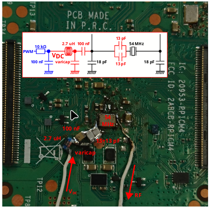

# -*- coding: utf-8 -*-
# -*- mode: org -*-

#+TITLE: Progress Report 07/2024
#+AUTHOR: Thomas Rushton

#+OPTIONS: num:nil toc:1 ^:{} ':t
#+OPTIONS: reveal_width:1200 reveal_height:800 reveal_slide_number:c/t
#+EXPORT_FILE_NAME: index
#+REVEAL_ROOT: ../reveal.js
#+REVEAL_THEME: white
#+REVEAL_TRANS: slide
#+REVEAL_PLUGINS: (math)
#+REVEAL_EXTRA_CSS: style.css
#+REVEAL_MIN_SCALE: 1.0
#+REVEAL_MAX_SCALE: 1.0
#+REVEAL_EXTRA_OPTIONS: hash: true, fragmentInURL: true
#+REVEAL_TITLE_SLIDE: <h1>%t</h1><h2>%s</h2><h3>%a</h3>
#+REVEAL_TITLE_SLIDE_BACKGROUND: #141414
#+REVEAL_TITLE_SLIDE_EXTRA_ATTR: class="title-slide"

* About This Presentation                                          :noexport:

This =org= file describes my presentation for the July 2024 meeting of
the Emeraude Thèsards.

** Dependencies

- =org-re-reveal= ([[https://gitlab.com/oer/org-re-reveal/-/tree/main][gitlab]]), which enables export support from Org to [[https://revealjs.com/][Reveal.js]].

** Running the Presentation

From the reveal.js directory (=../reveal.js=), run:

#+begin_src shell :noeval :exports code
npm start -- --root=../
#+end_src

Then navigate to [[localhost:8000/thèsards-emeraude-202407/]].

* Comité de Suivi Individuel
:PROPERTIES:
:reveal_background: #141414
:reveal_extra_attr: class="title-slide"
:END:

** Who's who?

#+ATTR_REVEAL: :frag (appear)
- Romain, Tanguy
- Leonardo Cardoso (MARACAS)
- Jens Ahrens (Chalmers University of Technology, Sweden)

** Feedback

#+ATTR_REVEAL: :frag (appear)
- Presentation was well received
- Not enough state-of-the-art, however
- Struggled when asked about perceptual evaluation
  #+ATTR_REVEAL: :frag (appear)
  + Read Hagen Wierstorf's 2014 PhD thesis /"Perceptual assessment of
    sound field synthesis"/
  + Jens also mentioned\dots

** "The Sphere", Las Vegas

[[./images/sphere1.jpg]] [[./images/sphere2.jpg]]

167,000 loudspeakers; >8000 audio channels

** Recommendations

- Meet with Jean-Michel Friedt
- Get doctoral training out of the way
- Remember the /academic component/; keep up the literature-hunt

* Meetings
:PROPERTIES:
:reveal_background: #141414
:reveal_extra_attr: class="title-slide"
:END:

** Jean-Michel Friedt

#+ATTR_REVEAL: :frag (appear)
- Researcher at FEMTO-ST Institute (/Franche-Comté Électronique
  Mécanique Thermique et Optique - Sciences et Technologies/)
- Does things like radar beam-forming, where /picosecond/ sync is
  required
- Sent a paper he wrote: /Network synchronization of computers for
  timestamping under GNU/Linux/ /: NTP, PTP and GPS on Raspberry Pi
  Compute Module 4/
- Main takeaway: RPi CM4 supports hardware PTP and main clock can be
  conditioned; all clocks derive from this clock

#+REVEAL: split

#+ATTR_REVEAL: :frag (appear)
- Problem: M Friedt made direct hardware modifications to the CM4

#+ATTR_REVEAL: :frag t

#+ATTR_REVEAL: :frag (appear)
- Even if using a Direct Digital Synthesiser instead of a varicap,
  this is not an /accessible/ approach
- He advised against using a shared clock over a physical link,
  however.

** Christof Ressi

#+ATTR_REVEAL: :frag (appear)
- Developer of /Audio Over OSC/ (AOO)
- The name is a small lie: audio transmitted as binary data, not OSC
  messages
- But AOO does interesting things like avoid packet fragmentation,
  respecting the MTU
  + /Audio buffer and network packet size are separate/
- No multicast, no sync
- But timestamps and control data can be embedded in the audio stream
- My bespoke system isn't very good; AOO could be adapted and
  incorporated into the server
  
* Publication(s)
:PROPERTIES:
:reveal_background: #141414
:reveal_extra_attr: class="title-slide"
:END:

** Frontiers Article

#+ATTR_REVEAL: :frag (appear)
- Submitted in February
- Received second of two reviews early June
- Reviewer 2 endorsed it for publication\dots
- \dots{}but gave it more challenging feedback than reviewer 1
- Revised manuscript submitted 26/06
- Reviewer 1 endorsed it\dots
- \dots{}but the editor wanted me to address reviewer 2's comments
- These included a request to comment the codebases
- Fortunately I was already doing that

** IFC Paper

#+ATTR_REVEAL: :frag (appear)
- Romain & Stéphane encouraging me to submit something on =faust-ddsp=
- Really don't know if I have time
- Really, /really/ need to get on with my actual job

* Other Activities
:PROPERTIES:
:reveal_background: #141414
:reveal_extra_attr: class="title-slide"
:END:

** Review(s)

Second revision of /Enhancement of cardiac and respiratory sounds for
cellphone reproduction by means of digital sound processing methods/,
submitted to journal /Personal and Ubiquitous Computing/.

** Google Summer of Code

#+ATTR_REVEAL: :frag (appear)
- Mentoring/co-mentoring four projects:
  #+ATTR_REVEAL: :frag (appear)
  + Faust in Cables.gl
  + Faust Package Manager
  + Amati++
  + *Faust DDSP*
- Coding period May 27th --- September 2nd
- Currently in midterm evaluation week

** Faust DDSP

#+ATTR_REVEAL: :frag (appear)
- Contributor knows his stuff re. machine learning
- He's taken to Faust quite well, but doesn't respect coding
  conventions

#+ATTR_REVEAL: :frag t
#+begin_src faust
bad = _, _;
good = _,_;
#+end_src

#+ATTR_REVEAL: :frag t
#+begin_src faust
process = good;
#+end_src

#+ATTR_REVEAL: :frag (appear)
- We have a frequency-domain loss function
- Schedulers, optimisers\dots
- Maybe the first neural network building-blocks on the way\dots

** Doctoral Training

#+ATTR_REVEAL: :frag (appear)
- I really must request my certificate for the /Reproducible Research/
  MOOC
- There's a French course that could count towards transverse skills

* Next Steps
:PROPERTIES:
:reveal_background: #141414
:reveal_extra_attr: class="title-slide"
:END:

** Write IFC Paper?

#+ATTR_REVEAL: :frag (appear)
- This would be on the /differentiable programming/ aspect of
  =faust-ddsp=, without any of the more recent developments
- Will it actually help me to publish to IFC?
- Won't Benjamin be taking over this project in the autumn anyway?

** Do my actual job

#+ATTR_REVEAL: :frag (appear)
- Romain wants a list of things to order before the money runs out in
  October
- I need to establish whether I can synchronise at least two
  computers/microcontrollers using software-timestamped packets
- Teensy and/or Raspberry Pi?\dots
- I'm more confident of being able to synchronise Teensies, and have
  them running stably
- But audio quality is lower, and memory is scant

** Recent experiments

#+ATTR_REVEAL: :frag (appear)
- Established that the audio subsystem clocks for both Teensy & RPi
  are adjustable
- Resolution better on Teensy (1/23 Hz, 0.5 PPM) than RPi (1/14 Hz,
  0.75 PPM)
