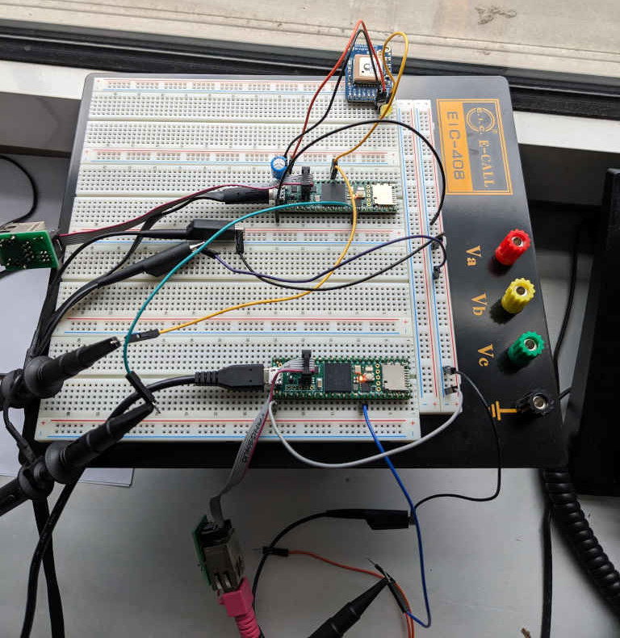

# -*- coding: utf-8 -*-
# -*- mode: org -*-

#+TITLE: Progress Report 10/2024
#+AUTHOR: Thomas Rushton

#+OPTIONS: num:nil toc:1 ^:{} ':t
#+OPTIONS: reveal_width:1200 reveal_height:800 reveal_slide_number:c/t
#+EXPORT_FILE_NAME: index
#+REVEAL_ROOT: ../reveal.js
#+REVEAL_THEME: white
#+REVEAL_TRANS: slide
#+REVEAL_PLUGINS: (math)
#+REVEAL_EXTRA_CSS: style.css
#+REVEAL_MIN_SCALE: 1.0
#+REVEAL_MAX_SCALE: 1.0
#+REVEAL_EXTRA_OPTIONS: hash: true, fragmentInURL: true
#+REVEAL_TITLE_SLIDE: <h1>%t</h1><h2>%s</h2><h3>%a</h3>
#+REVEAL_TITLE_SLIDE_BACKGROUND: #141414
#+REVEAL_TITLE_SLIDE_EXTRA_ATTR: class="title-slide"

* About This Presentation                                          :noexport:

This =org= file describes my presentation for the October 2024 meeting
of the Emeraude Thèsards.

** Dependencies

- =org-re-reveal= ([[https://gitlab.com/oer/org-re-reveal/-/tree/main][gitlab]]), which enables export support from Org to [[https://revealjs.com/][Reveal.js]].

** Running the Presentation

From the reveal.js directory (=../reveal.js=), run:

#+begin_src shell :noeval :exports code
npm start -- --root=../
#+end_src

Then navigate to [[localhost:8000/thèsards-emeraude-202410/]].

* Research
:PROPERTIES:
:reveal_background: #141414
:reveal_extra_attr: class="title-slide"
:END:

** Teensy + PTP = 💏

#+ATTR_REVEAL: :frag (appear)
- Teensy (well the iMX.RT1060 MCU) is PTP-compliant
- Except no-one had written the code to run it
- ...Until
  #+begin_quote
Schleusner J, Fahnemann C, Pfleiderer R, Blume H. *Sub-Microsecond Time
Synchronization for Network-Connected Microcontrollers*. In: 2024 IEEE
International Conference on Consumer Electronics (ICCE)
  #+end_quote
- I found that paper almost completely by accident

#+REVEAL: split

** Teensy + PTP = 🫂

#+ATTR_REVEAL: :frag (appear)
- Still, no audio sync implementation
- I forked =t41-ptp= to expose NSPS adjustment
- Wrote a HAL for controlling Teensy's audio subsystem
- Achieved sample rate parity
- Achieved (almost) sample synchronous playback
- But: no networked audio yet

* Publication(s)
:PROPERTIES:
:reveal_background: #141414
:reveal_extra_attr: class="title-slide"
:END:

** Frontiers Article

#+ATTR_REVEAL: :frag (appear)
- All looked good back in August
- One of the two reviewers wasn't qualified (no PhD)
- Their review was /revoked/
- A third reviewer was found
- Reviewer 3's feedback started with the words
  #+begin_quote
Here's an extended version of the provided text:
  #+end_quote

#+REVEAL: split

#+begin_quote
First, I suggest a thorough proofreading of the manuscript to ensure
clarity and precision. Minor language improvements can elevate the
readability and professionalism of the work. Additionally, the "State
of the Art" section would benefit from further elaboration...
#+end_quote

#+REVEAL: split

#+begin_quote
Moreover, I recommend updating the references to include more recent
studies and developments. This will demonstrate that the paper is
grounded in the latest research and trends, which will enhance its
credibility and relevance...
#+end_quote

#+REVEAL: split

#+begin_quote
One critical area where the paper can improve is in the comparison of
the proposed solution with existing alternatives. A more detailed
comparative analysis will highlight the unique advantages of your
approach...
#+end_quote

#+REVEAL: split

#+begin_quote
...If feasible, please consider enlarging the fonts used in the
figures, as this will improve readability and ensure that all
graphical elements are easy to interpret.
#+end_quote

** My reply

#+ATTR_REVEAL: :frag t
#+begin_quote
I would be very grateful if you could elaborate on a couple of the
points you raised:

"Additionally, the "State of the Art" section would benefit from
further elaboration." --- there are two such sections; do both of
these, in your view, require further attention?...
#+end_quote

** Result

#+ATTR_REVEAL: :frag t
#+begin_quote
Dear Dr Rushton,

I am pleased to inform you that your manuscript "Networked
Microcontrollers for Accessible, Distributed Spatial Audio" has been
approved for production and accepted for publication in Frontiers in
Virtual Reality, section Technologies for VR.
#+end_quote

** IFC Paper

#+ATTR_REVEAL: :frag (appear)
- Submitted & accepted
- Way too much time and effort for a side-project
- Useful maybe?
- Lesson: don't take liberties with notation
  #+ATTR_REVEAL: :frag t
  + Tanguy will:
    #+ATTR_REVEAL: :frag (appear)
    * Find you
    * Kill you

* Other Activities
:PROPERTIES:
:reveal_background: #141414
:reveal_extra_attr: class="title-slide"
:END:

** Review(s)

Third and fourth revisions of /Enhancement of cardiac and respiratory
sounds for cellphone reproduction by means of digital sound processing
methods/, for journal /Personal and Ubiquitous Computing/.

** Google Summer of Code

#+ATTR_REVEAL: :frag (appear)
- It was a lot of work
- The =faust-ddsp= guy was... difficult to work with at times.
- But he developed frequency-domain loss
- And neural network building blocks
- I need to merge his PR... but also make the code
  composable/extensible

** Doctoral Training

#+ATTR_REVEAL: :frag (appear)
- Got my certificate for the /Reproducible Research/ MOOC
- Started the French course
- Haven't had time for Ethics/Integrity

** IS^{2} Conference, Erlangen

#+ATTR_REVEAL: :frag (appear)
- Interesting keynotes
- Fun competition on /packet loss concealment/
  + No audio examples...
- Met some people doing networked audio and distributed audio systems
- Met Jurek, in the flesh

* Next Steps
:PROPERTIES:
:reveal_background: #141414
:reveal_extra_attr: class="title-slide"
:END:

** California

#+ATTR_REVEAL: :frag (appear)
- Faust workshop at CCRMA
- Help?

** Teensy + PTP = 🦾🦾

#+ATTR_REVEAL: :frag (appear)
- Get a networked, synced demo working
- Timestamped packets?
- Long-term, Teensy doesn't have enough memory to be the audio
  server...
