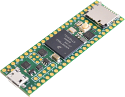
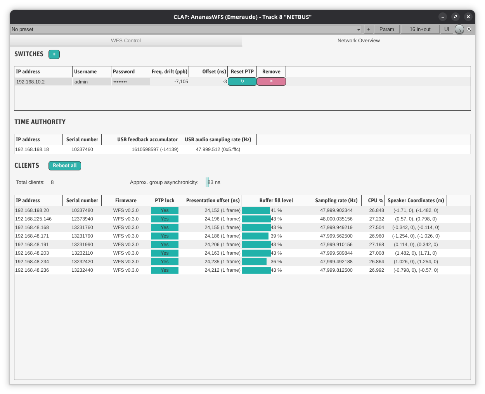

#+title: Accessible Spatial Audio Installations on a Network of Distributed Signal Processors
#+author: Thomas Rushton

#+options: num:nil toc:nil
#+options: reveal_width:1500 reveal_height:1000 reveal_slide_number:c/t
#+export_file_name: index
#+property: header-args:css :results none :exports none :tangle ./style.css
#+reveal_root: ../reveal.js
#+reveal_theme: white_contrast_compact_verbatim_headers
#+reveal_trans: slide
#+reveal_min_scale: 1.0
#+reveal_max_scale: 1.0
#+reveal_extra_options: hash: true, fragmentInURL: true
#+reveal_title_slide: <h1>%t</h1><h2><em>%s</em></h2><h4>%a</h4>

#+reveal_title_slide: 
#+reveal_title_slide: 
#+reveal_title_slide: 

#+reveal_title_slide_extra_attr: class="title-slide"
#+reveal_extra_css: style.css

* About This Presentation                                          :noexport:

This =org= file describes my presentation for a presentation at
Politecnico di Torino.

** Dependencies

- =org-re-reveal= ([[https://gitlab.com/oer/org-re-reveal/-/tree/main][gitlab]]), which enables export support from Org to [[https://revealjs.com/][Reveal.js]].

** Running the Presentation

Tangle, then, from the reveal.js directory (=../reveal.js=), run:

#+begin_src shell :noeval :exports code
npm start -- --root=../
#+end_src

Then navigate to [[http://localhost:8000/turin-2026/]].

* CSS                                                              :noexport:

v** Symlink to =~/org/fonts=

#+begin_src emacs-lisp :results none :export none :eval yes
(dired-make-relative-symlink "../../fonts" "fonts" t)
#+end_src

** Typography

Define some fonts. Useful info [[https://www.digitalocean.com/community/tutorials/how-to-load-and-use-custom-fonts-with-css#loading-a-self-hosted-font-with-font-face][here]].

#+begin_src css
@font-face {
    font-family: "MyMinion";
    src:
        local("MinionPro-Regular"),
        url("fonts/minionpro/MinionPro-Regular.otf") format("opentype");
    font-weight: 400;
    font-style: normal;
}

@font-face {
    font-family: "MyMinion";
    src:
        url("fonts/minionpro/MinionPro-It.otf") format("opentype");
    font-weight: 400;
    font-style: italic;
}

@font-face {
    font-family: "MyMinion";
    src:
        url("fonts/minionpro/MinionPro-Semibold.otf") format("opentype");
    font-weight: 600;
    font-style: normal;
}

@font-face {
    font-family: "MyMinion";
    src:
        url("fonts/minionpro/MinionPro-Bold.otf") format("opentype");
    font-weight: 800;
    font-style: normal;
}
#+end_src

Now override some of reveal's variables.

#+begin_src css
:root {
    --r-main-font: "MyMinion";
    --r-main-font-size: 42px;
    --r-heading-font: "MyMinion";
    --r-code-font: "Iosevka Comfy Motion";
    --r-heading-text-transform: none;
}
#+end_src

*** Headings

Decorate my h2's and h3's.

#+begin_src css
.stack h2, .stack h3 {
    text-decoration: underline 3px #bbb;
}
#+end_src

*** Figures

#+begin_src css
.reveal figure {
    margin-top: 0;
}
#+end_src

*** Use old style numbers

#+begin_src css
body {
    font-variant-numeric: oldstyle-nums;
}
#+end_src

But not in code blocks

#+begin_src css
.reveal pre, code {
    font-variant-numeric: normal;
}
#+end_src

*** Font size utility classes

Captions

#+begin_src css
.caption {
    font-size: .6em;
}
#+end_src

** Code blocks

Improve code block appearance.

#+begin_src css
.reveal pre {
    padding: 1em;
    width: 66.6%;
    box-shadow: none;
    background: #efefef;
    font-size: .7em;
}
#+end_src

** Logos on title slide

#+begin_src css
.title-slide > .logos {
    display: flex;
    justify-content: space-around;
    margin-top: 3em;
}
#+end_src

* Figures                                                          :noexport:
:PROPERTIES:
:header-args: :tangle turinFigs.sty :results silent :noeval
:END:

** Setup

Provide the package, use tikz, and setup typography.

#+begin_src latex
\ProvidesPackage{csid3figs}
\RequirePackage{tikz}
\usetikzlibrary{positioning, arrows.meta}
\RequirePackage{bytefield}
\RequirePackage{fontspec}
\setmainfont[
  Mapping={tex-text}, 
  Numbers={OldStyle},
  Ligatures={Common},
  UprightFont=*-Regular,
  BoldFont=*-Bold,
  BoldItalicFont=*-BoldIt,
  ItalicFont=*-It,
  FontFace={sb}{n}{*-Semibold},
  FontFace={sb}{it}{*-SemiboldIt}
]{MinionPro}
#+end_src

** Common stuff

Define some colours and some node and line styles.

#+begin_src latex
\definecolor{ctrlColour}{HTML}{479955}
\definecolor{audioColour}{HTML}{4077D6}
\definecolor{usbColour}{HTML}{D63E3E}

\tikzset{
  device/.style={draw, fill=black!10, rounded corners=1mm, inner xsep=1.5mm, align=center},
  ctrl/.style={densely dotted, ctrlColour, line width=.2mm},
  ctrlArrow/.style={ctrl, -{Triangle[open]}},
  acn/.style={-{Stealth}, audioColour, densely dashdotted},
  audio/.style={-{Stealth}, audioColour},
  ptp/.style={{Triangle}-{Triangle}},
  usb/.style={{Triangle[open]}-{Triangle[open]}, usbColour},
  legend/.style={font=\tiny\itshape},
  module/.style={device, fill=ctrlColour!35, font={\scriptsize}, transform shape},
  authority/.style={device, fill=usbColour!35}
}
#+end_src

** PTP

#+begin_src latex
\tikzset{
  role/.style={align=center, draw, inner sep=1mm, minimum height=1cm, rounded corners=.5mm},
  authorityMsg/.style={midway, above=-1mm, rotate=-13},
  subscriberMsg/.style={midway, above=-1mm, rotate=13},
  ptp/.pic={
    \node (auth) [role] at (0, 0) {Clock\\authority};
    \draw [-{Stealth}] (auth.south) -- +(0, -6.5);
    \node (sub) [role, right = 2cm of auth] {Clock\\subscriber};
    \draw [-{Stealth}] (sub.south) -- +(0, -6.5);
    
    \node (t1) [below left=2mm and -8mm of auth] {\(t_{1}\)};
    
    \draw [-{Stealth}] ([yshift=-5.5mm]auth.south) -- ([yshift=-13.5mm]sub.south) node [authorityMsg] {\ultratiny{Sync}};
    \draw [-{Stealth}] ([yshift=-10.5mm]auth.south) -- ([yshift=-18.5mm]sub.south) node [authorityMsg] {\ultratiny{FollowUp [\(t_{1}\)]}};

    \node (t2) [below right=11mm and -8mm of sub] {\(t_{2}\)};

    \node (t3) [below right=21.5mm and -8mm of sub] {\(t_{3}\)};

    \draw [-{Stealth}] ([yshift=-24mm]sub.south) -- ([yshift=-32mm]auth.south) node [subscriberMsg] {\ultratiny{DelayReq}};

    \node (t4) [below left=29mm and -8mm of auth] {\(t_{4}\)};

    \draw [-{Stealth}] ([yshift=-36mm]auth.south) -- ([yshift=-44mm]sub.south) node [authorityMsg] {\ultratiny{DelayResp [\(t_{4}\)]}};

    \node (t11) [below left=43mm and -8mm of auth] {\(t'_{1}\)};
    
    \draw [-{Stealth}] ([yshift=-47mm]auth.south) -- ([yshift=-55mm]sub.south) node [authorityMsg] {\ultratiny{Sync}};
    \draw [-{Stealth}] ([yshift=-52mm]auth.south) -- ([yshift=-60mm]sub.south) node [authorityMsg] {\ultratiny{FollowUp [\(t'_{1}\)]}};

    \node (t21) [below right=52mm and -8mm of sub] {\(t'_{2}\)};
  }
}
#+end_src

** System overview

#+begin_src latex
\tikzset{
  systemOverview/.pic={
    \node (auth) [authority] at (0, 0) {Time\\authority};
    \node (switch) [device, above=5mm of auth, inner xsep=10mm] {Switch};
    \node (server) [device, below=5mm of auth, inner xsep=10mm] {Server};
    \node (module0) [module, above left=5mm and -7mm of switch] {T41};
    \node (moduleN) [module, above right=5mm and -7mm of switch] {T41};
    \node [above=5mm of switch] {\(\cdots\)};

    % PTP between authority and switch
    \draw [ptp] (auth.north) -- (switch.south);

    % PTP between switch and modules
    \draw [ptp] ([xshift=-13.3mm]switch.north) --
    ([xshift=-2mm]module0.south);
    \draw [ptp] ([xshift=9.3mm]switch.north) --
    ([xshift=-2mm]moduleN.south);

    % USB audio
    \draw [usb] ([xshift=-4mm]auth.south) --
    ([xshift=-4mm]server.north);

    % PTP follow-up from authority to server
    \draw [-{Triangle}] ([xshift=4mm]auth.south) --
    ([xshift=4mm]server.north);

    % Audio from server to switch
    \draw [audio] ([xshift=-12.5mm]server.north) --
    ([xshift=-12.5mm]switch.south);

    % Ctrl from server to switch
    \draw [ctrlArrow] ([xshift=12.5mm]server.north) --
    ([xshift=12.5mm]switch.south);

    % Audio from switch to modules
    \draw [audio] ([xshift=-11.3mm]switch.north) -- (module0.south);
    \draw [audio] ([xshift=11.3mm]switch.north) -- (moduleN.south);

    % Ctrl from switch to modules
    \draw [ctrlArrow] ([xshift=-9.3mm]switch.north) --
    ([xshift=2mm]module0.south);
    \draw [ctrlArrow] ([xshift=13.3mm]switch.north) --
    ([xshift=2mm]moduleN.south);
  }
}
#+end_src

** WFS

#+begin_src latex
\newcommand{\wfsX}{4}
\newcommand{\wfsNumWaves}{5}
\newcommand{\wfsWaveSpace}{.89}
\newcommand{\wfsNumMCU}{8}
\newcommand{\wfsNumSecondary}{16}
\tikzset{
  cross/.pic = {
    \draw[rotate = 45] (-#1,0) -- (#1,0);
    \draw[rotate = 45] (0,-#1) -- (0, #1);
  },
  wfsModule/.pic = {
    \node [module] {dWFS};
  },
  speaker/.pic = {
    \draw (-.11, 0) rectangle (.11, .06);
    \draw (-.11, .06) -- (-.25, .2) -- (.25, .2) -- (.11, .06);
  },
  wavefronts/.pic={
    \foreach \pos/\rad in {0/.18, 1/.615, 2/1.03, 3/1.42, 4/1.78, 5/2.07, 6/2.295, 7/2.42} {
      \draw [black!25] (-\wfsX+.25+.5*\pos, 2) circle (\rad);
    }
  },
  wfs/.pic={
    % Virtual sound field
    \draw (-\wfsX, -.5) rectangle (\wfsX, 2);
    
    \begin{scope}
      \clip (-\wfsX, -.5) rectangle (\wfsX, 2);

      % Virtual sound source
      \node [circle, draw=audioColour, fill=audioColour!50, thick]
      (primary) at (0, 0) {};

      % Virtual wavefronts
      \foreach \i [
        evaluate=\i as \rad using \i*\wfsWaveSpace
      ] in {1,...,\wfsNumWaves} {
        \draw [thick, dashed, audioColour] (-\rad, 0)
        arc [radius=\rad, start angle=180, end angle=0];
      }

      % Labels
      \node [
        black!50, fill=white, align=center,
        font={\footnotesize\itshape}
      ] at (-3.15, 0) {Virtual\\soundfield};
      \node [
        below right=-1mm and -1mm of primary,
        font={\footnotesize\itshape}
      ] {Virtual sound source};

      \foreach \i [
        evaluate=\i as \secondary using
        -\wfsX+.25+(\i-1)*(2*\wfsX/\wfsNumSecondary)
      ] in {1,...,\wfsNumSecondary} {
        \node (\secondary) at (\secondary, 2) {};
      }

      % Virtual source co-ordinates and ctrl line
      \draw [ctrl] node [above right=.1mm, font=\tiny]
            {\((x, y)\)} (primary) -- (0, 2);
    \end{scope}

    % Infrastructure
    \begin{scope}[yshift=2cm]
      \node (server) [device, inner xsep=7.5mm] at (0, .75) {Server};
      \node (authority) [authority, above=4mm of server]
            {Time\\authority};
      \node (switch) [device, inner xsep=7.5mm, above=4mm of authority]
            {Switch};

      % USB arrow
      \draw [usb] ([xshift=-5mm] authority.south) --
      ([xshift=-5mm] server.north)

      % PTP arrows
      \draw [ptp] (authority.north) -- (switch.south);
      \draw [-{Triangle}] ([xshift=5mm] authority.south) --
      ([xshift=5mm] server.north);

      % Audio arrow
      \draw [audio] ([xshift=-10mm] server.north) --
      ([xshift=-10mm] switch.south);

      % Control arrow
      \draw [ctrlArrow] ([xshift=10mm] server.north) --
      ([xshift=10mm] switch.south);

      % Modules
      \foreach \i [
        evaluate=\i as \xpos using -\wfsX+.5+(\i-1)*(2*\wfsX/\wfsNumMCU)
      ] in {1,...,\wfsNumMCU} {
        \pic at (\xpos, 4.225) {wfsModule};
        
        \draw [audio] (\xpos-.2, 3.625) -- (\xpos-.2, 4.0);
        \draw [ctrlArrow] (\xpos, 3.625) -- (\xpos, 4.0);
        
        \ifnum\i=1
          \draw [-{Triangle}] (switch.north) +(0, .325) --
          (\xpos-.2, 3.625) (\xpos+.2, 3.625) -| (\xpos+.2, 4.0);
        \else
          \ifnum\i=\wfsNumMCU
            \draw [ptp] (switch.north) -- +(0, .325) -| (\xpos+.2, 4.0);
          \else
            \draw [-{Triangle}] (\xpos+.2, 3.625) -- (\xpos+.2, 4.0);
          \fi
        \fi
      }

      % Secondary sources
      \foreach \i [
        evaluate=\i as \secondary using
        -\wfsX+.25+(\i-1)*(2*\wfsX/\wfsNumSecondary)
      ] in {1,...,\wfsNumSecondary} {
        \pic at (\secondary, 0) {cross=2pt};
        
        \ifnum\i=1
          \draw [ctrl] (\secondary,0) -- +(0, .2) -|
          ([yshift=-3mm] server.south);
        \else
          \ifnum\i=\wfsNumSecondary
            \draw [ctrlArrow] (\secondary,0) --
            +(0, .2) -| (server.south);
          \else
            \draw [ctrl] (\secondary,0) -- +(0, .2);
          \fi
        \fi

        \pic at (\secondary, 4.445) {speaker};
      }

      \draw [ctrl] (0, 0) -- (0, .2);
    \end{scope}

    % Synthesised soundfield
    \begin{scope}[yshift=4.655cm]
      \clip (-\wfsX, 2) rectangle (\wfsX, 4.6);

      \foreach \i [evaluate=\i as \rad using \i*\wfsWaveSpace] in {1,...,\wfsNumWaves} {
        \draw [thick, audioColour] (-\rad, 0) arc [radius=\rad, start angle=180, end angle=0];
      }

      \pic {wavefronts};
      \pic [xscale=-1] {wavefronts};

      \node [black!50, align=center, font={\footnotesize\itshape}] at (-3.15, 4) {Synthesised\\soundfield};
    \end{scope}
  };
}
#+end_src

** HOA

#+begin_src latex
\tikzset{
  selector/.pic={
    \draw[rotate=45, very thick, ctrlColour] (-#1,0) -- (#1,0);
    \draw[rotate=45, very thick, ctrlColour] (0,-#1) -- (0, #1);
  },
  speakerHOA/.pic = {
    \draw (-.11, 0) rectangle (.11, .06);
    \draw (-.11, .06) -- (-.25, .2) -- (.25, .2) -- (.11, .06);
    \node (-body) at (0, 0) {};   % invisible anchor node
  },
  moduleN/.pic = {
    \node [module] (-body) {dHOA};
    \draw [ptp] (0, .6) -- (-body.north);
    \draw [acn] (-.25, .6) -- ([xshift=-.25cm]-body.north);
    \draw [ctrlArrow] (.25, .6) -- ([xshift=.25cm]-body.north);
  },
  moduleS/.pic = {
    \node [module] (-body) {dHOA};
    \draw [ptp] (0, -.6) -- (-body.south);
    \draw [acn] (-.25, -.6) -- ([xshift=-.25cm]-body.south);
    \draw [ctrlArrow] (.25, -.6) -- ([xshift=.25cm]-body.south);
  },
  hoa/.pic={
    \begin{scope}[yshift=11cm]
      % Synthesised soundfield
      \draw [thick] (-4, -4) rectangle (4, 4);
      % Azymuthal rings
      \draw [dashed, black!30] (0, 0) circle (3.5);
      \draw [dashed, black!30] (0, 0) circle (2.8);
      \draw [dashed, black!30] (0, 0) circle (1.9);
      \draw [dashed, black!30] (0, 0) circle (.8);
      % Speakers, ring 0
      \pic [rotate=180] (speaker0) at (0, 3.7) {speakerHOA};
      \pic [rotate=90] (speaker1) at (3.7, 0) {speakerHOA};
      \pic (speaker2) at (0, -3.7) {speakerHOA};
      \pic [rotate=-90] (speaker3) at (-3.7, 0) {speakerHOA};
      % Speakers, ring 1
      \pic [rotate=225] (speaker4) at (-2.1, 2.1) {speakerHOA};
      \pic [rotate=135] (speaker5) at (2.1, 2.1) {speakerHOA};
      \pic [rotate=45] (speaker6) at (2.1, -2.1) {speakerHOA};
      \pic [rotate=-45] (speaker7) at (-2.1, -2.1) {speakerHOA};
      % Speakers, ring 2
      \pic [rotate=180] (speaker8) at (0, 2.1) {speakerHOA};
      \pic [rotate=90] (speaker9) at (2.1, 0) {speakerHOA};
      \pic (speaker10) at (0, -2.1) {speakerHOA};
      \pic [rotate=-90] (speaker11) at (-2.1, 0) {speakerHOA};
      % Speakers, ring 3
      \pic [rotate=225] (speaker12) at (-.7, .7) {speakerHOA};
      \pic [rotate=135] (speaker13) at (.7, .7) {speakerHOA};
      \pic [rotate=45] (speaker14) at (.7, -.7) {speakerHOA};
      \pic [rotate=-45] (speaker15) at (-.7, -.7) {speakerHOA};
      % Modules
      \pic [rotate=-45] (module0) at (2.7, 2.7) {moduleN};
      \pic [rotate=-45] (module1) at (-2.7, -2.7) {moduleS};
      \pic (module2) at (0, 3.1) {moduleS};
      \pic (module3) at (0, -3.1) {moduleN};
      \pic (module4) [rotate=-45] at (1.55, 1.55) {moduleS};
      \pic (module5) [rotate=-45] at (-1.55, -1.55) {moduleN};
      \pic (module6) at (0, 1.1) {moduleN};
      \pic (module7) at (0, -1.1) {moduleS};
      % Audio
      \draw [audio] (module0-body.west) -- (speaker0-body.east);
      \draw [audio] (module0-body.east) -- ([yshift=.125cm, xshift=.1cm]speaker1-body.west);
      \draw [audio] (module1-body.east) -- (speaker2-body.west);
      \draw [audio] (module1-body.west) -- ([yshift=-.125cm, xshift=-.1cm]speaker3-body.east);
      \draw [audio] (module2-body.west) -- ([yshift=.05cm]speaker4-body.east);
      \draw [audio] (module2-body.east) -- ([yshift=.05cm]speaker5-body.west);
      \draw [audio] (module3-body.east) -- ([yshift=-.05cm]speaker6-body.west);
      \draw [audio] (module3-body.west) -- ([yshift=-.05cm]speaker7-body.east);
      \draw [audio] (module4-body.west) -- (speaker8-body.east);
      \draw [audio] (module4-body.east) -- ([yshift=.125cm, xshift=.1cm]speaker9-body.west);
      \draw [audio] (module5-body.east) -- (speaker10-body.west);
      \draw [audio] (module5-body.west) -- ([yshift=-.125cm, xshift=-.1cm]speaker11-body.east);
      \draw [audio] (module6-body.west) -- (speaker12-body.east);
      \draw [audio] (module6-body.east) -- (speaker13-body.west);
      \draw [audio] (module7-body.east) -- (speaker14-body.west);
      \draw [audio] (module7-body.west) -- (speaker15-body.east);
    \end{scope}
    \begin{scope}[yshift=5.5cm]
      % Switch
      \node[device, inner xsep=8mm, inner ysep=2.5mm](switch) at (0, .7) {Switch};
      % Time authority
      \node[authority, align=center](authority) at (0, -.6) {Time\\authority};
      % PTP
      \draw [{Triangle}-] (.5, -1.5) -- ([xshift=5mm] authority.south);
      \draw [ptp] (authority.north) -- (switch.south);
      \draw [ptp] (switch.north) -- (0, 1.5);
      % USB
      \draw [usb] (-.5, -1.5) -- ([xshift=-5mm] authority.south);
      % ACN-format
      \draw [acn] (-1, -1.5) -- ([xshift=-1cm] switch.south);
      \draw [acn] ([xshift=-1cm] switch.north) -- (-1, 1.5);
      % Coordinates
      \draw [ctrlArrow] (1, -1.5) -- ([xshift=1cm] switch.south);
      \draw [ctrlArrow] ([xshift=1cm] switch.north) -- (1, 1.5);
    \end{scope}
    \begin{scope}
      % DAW
      \draw [thick] (-4, -4) rectangle (4, 4);
      \node [] at (-3.25, 3.5) {DAW};
      % Virtual soundfield
      \draw [thick] (0, 0) circle (3.5);
      \node [black!75, align=center, font={\itshape}] at (-2.5, 0) {Virtual\\soundfield};
      % Azymuthal rings
      \draw [dotted, black!50] (0, 0) circle (2.8);
      \draw [dotted, black!50] (0, 0) circle (1.9);
      \draw [dotted, black!50] (0, 0) circle (.8);
      % Module selectors
      \pic at (2.475, 2.475) {selector=5pt};
      \pic at (-2.475, -2.475) {selector=5pt};
      \pic at (0, 2.8) {selector=5pt};
      \pic at (0, -2.8) {selector=5pt};
      \pic at (1.35, 1.35) {selector=5pt};
      \pic at (-1.35, -1.35) {selector=5pt};
      \pic at (0, .8) {selector=5pt};
      \pic at (0, -.8) {selector=5pt};
    \end{scope}
  }
}
#+end_src

* Agenda

#+ATTR_REVEAL: :frag (appear)
- Motivation: /why distribute spatial audio?/
- Choice of hardware platform
- Time exchange and synchronicity
- Distributing spatial audio algorithms
- The development of a new networked audio protocol

* Motivation
:PROPERTIES:
:reveal_background: #141414
:END:

** Motivation

#+ATTR_REVEAL: :frag (appear)
- Access to state-of-the-art spatial audio systems is limited by cost
  and complexity.
- Installing a spatial audio system represents a significant
  investment in money, time and expertise.
- State-of-the-art systems are centralised, scale poorly; highly
  multichannel audio interfaces are expensive.
- We're interested in lowering the barrier to entry.
- To do this, we offer an alternative that's decentralised, modular,
  scalable.

** Requirements

#+ATTR_REVEAL: :frag (appear)
- A low-cost hardware platform (MCU or SOC) that's powerful, has a
  decent amount of memory, and supports audio and ethernet.
- A way to synchronise distributed signal processors.
- A way to parallelise spatial audio algorithms.
- Supporting software (DAW plugins) and module firmware.

* The hardware platform
:PROPERTIES:
:reveal_background: #141414
:END:

** The Teensy 4.1 microcontroller development board

#+ATTR_REVEAL: :frag (appear)
- A lot of power in what is indeed a /teensy/ package.
- 600 MHz Core-M7
- Not much RAM: 1024 kB --- can be extended by up to 16 MB
- Dedicated ethernet and audio subsystems
- Programmable in Faust
- Costs less than € 50 with add-ons

* Time exchange
:PROPERTIES:
:reveal_background: #141414
:END:
** IEEE 1588 Precision Time Protocol
:PROPERTIES:
:reveal_extra_attr: data-auto-animate
:END:

#+ATTR_REVEAL: :frag (appear)
- Sub-microsecond synchronisation possible for compliant devices with
  support for hardware timestamping.
- Gold-standard in networked audio settings --- used by AVB, AES67,
  Dante...
- Typically only high-end networking equipment supports hardware
  timestamping; low-cost exceptions do exist.
- Teensy 4.1 (or rather its NXP IMXRT1062 MCU) features a PTP timer.

#+ATTR_REVEAL: :frag (appear)
|[[./images/switch.png]]||

** IEEE 1588 Precision Time Protocol
:PROPERTIES:
:reveal_extra_attr: data-auto-animate
:END:

#+header: :exports results :results file raw :file "./images/gen/ptpFlow.png"
#+header: :imagemagick t :iminoptions -density 600 :imoutoptions -geometry 2000 -flatten :fit t
#+header: :headers '("\\usepackage{turinFigs}")
#+begin_src latex :eval no-export
\begin{tikzpicture}
  \pic{ptp};
\end{tikzpicture}
#+end_src
#+attr_org: :width 200
#+attr_html: :width 500
#+RESULTS:
[[file:./images/gen/ptpFlow.png]]

** IEEE 1588 Precision Time Protocol
:PROPERTIES:
:reveal_extra_attr: data-auto-animate
:END:

Once the subscriber has \(t_{1}\), \(t_{2}\), \(t_{3}\) and \(t_{4}\) (and \(t'_{1}\)
and \(t'_{2}\)) it can begin to compute its drift, delay and offset relative to
the authority.

#+ATTR_REVEAL: :frag t
\begin{align}
\text{Drift} &= 1 - \frac{t'_{2} - t_{2}}{t'_{1} - t_{1}} \\[5pt]
\text{Delay} &= \frac{(t_{4} - t_{1}) - (t_{3} - t_{2})}{2} \\[5pt]
\text{Offset} &= t_{2} - t_{1} - \text{Delay}
\end{align}

** Media clock recovery
:PROPERTIES:
:reveal_extra_attr: data-auto-animate
:END:

Running these figures through a proportional integral controller, the
subscriber can derive sensible values by which it should adjust its
ethernet timer to maintain parity with the authority.

#+ATTR_REVEAL: :frag t
The nanoseconds-per-second adjustment, \(a\), is found as

#+ATTR_REVEAL: :frag t
\begin{equation}
a = \text{Drift} - K_{P}\text{Offset} + K_{I}\sum\text{Offset}
\end{equation}

#+ATTR_REVEAL: :frag t
To recover the media clock, i.e. find a sampling rate \(\hat{f}_{s}\) that "matches"
that of the time authority, using the nominal sampling rate \(f_{s}\),
e.g. 48 kHz

#+ATTR_REVEAL: :frag t
\begin{equation}
\hat{f}_{s} = f_{s}(1 + a)
\end{equation}

** Media clock recovery
:PROPERTIES:
:reveal_extra_attr: data-auto-animate
:END:

For example for \(a = -1750 \text{ns}\)

#+ATTR_REVEAL: :frag t
\begin{align}
\hat{f}_{s} &= 48\,000(1 - 1750 \times 10^{-9}) \\
  &= 48\,000 \times 0.999\,998\,925 \\
  &= 47\,999.916 \text{Hz}
\end{align}

#+ATTR_REVEAL: :frag t
In practice, this doesn't quite work, and some residual drift
remains. To compensate for that, take a reference nanoseconds figure
on audio system startup, \(t_{S}\), and compare it with the nanosecond
part of PTP time, \(t_{\text{PTP}}\), once per second (only works if the buffer
size is an integer divisor of the sampling rate)

#+ATTR_REVEAL: :frag t
\begin{equation}
O_{AP} = t_{\text{PTP}} - t_{S}
\end{equation}

#+ATTR_REVEAL: :frag t
Finally apply another PI controller

#+ATTR_REVEAL: :frag t
\begin{equation}
\hat{f}_{s} = f_{s}(1 + a + K_{P}O_{AP} + K_{I}\sum{}O_{AP})
\end{equation}

** The time authority
:PROPERTIES:
:reveal_extra_attr: data-auto-animate
:END:

#+ATTR_REVEAL: :frag (appear)
- One Teensy acts both as a PTP time authority /and/ as a USB audio
  device.
- Thus governs both audio timing on the /server/ machine, and PTP time
  for all capable devices on the network.
- The server reads its PTP /follow-up/ packets for timestamps to add to
  out-going audio packets.
- Depending on OS, may entail configuring network settings to allow
  reading on /privileged/ network ports, i.e. those below 1024.

** The time authority
:PROPERTIES:
:reveal_extra_attr: data-auto-animate
:END:

#+header: :exports results :results file raw :file "./images/gen/systemOverview.png"
#+header: :imagemagick t :iminoptions -density 600 :imoutoptions -geometry 2000 -flatten :fit t
#+header: :headers '("\\usepackage{turinFigs}")
#+begin_src latex :eval no-export
\begin{tikzpicture}
  \pic{systemOverview};
  \matrix [draw] at (3.75, 0) {
    \draw [ctrlArrow] (0,0) -- (.5,0); & \node [legend] {Control data (UDP)}; \\
    \draw [audio] (0,0) -- (.5,0); & \node [legend] {Audio (UDP)}; \\
    \draw [-{Triangle[open]}, usbColour] (0,0) -- (.5,0); & \node [legend] {USB audio}; \\
    \draw [-{Triangle}] (0,0) -- (.5,0); & \node [legend] {PTP}; \\
  };
\end{tikzpicture}
#+end_src
#+attr_org: :width 250
#+attr_html: :width 1000
#+RESULTS:
[[file:./images/gen/systemOverview.png]]

* Distributed spatial audio
:PROPERTIES:
:reveal_background: #141414
:END:

** Distributed wave field synthesis
:PROPERTIES:
:reveal_extra_attr: data-auto-animate
:END:

#+ATTR_REVEAL: :frag (appear)
- For now, let's assume a linear speaker array.
- Requires that the server knows the number of modules and the speaker
  spacing.
- From these, the server can compute co-ordinates for the pairs of
  loudspeakers (secondary sound sources) handled by the modules.
- Modules can be assigned secondary source co-ordinates via a DAW
  plugin interface.
- The modules need only know their secondary sound source co-ordinates
  and the co-ordinates of the virtual sound sources.
- Virtual sound source positions are also configurable via the plugin
  interface.
- Sound field dimensions limited by the amount of memory available on
  each module.

** Distributed wave field synthesis
:PROPERTIES:
:reveal_extra_attr: data-auto-animate
:END:

#+header: :exports results :results file raw :file "./images/gen/wfs.png"
#+header: :imagemagick t :iminoptions -density 600 :imoutoptions -geometry 2000 -flatten :fit t
#+header: :headers '("\\usepackage{turinFigs}")
#+begin_src latex :eval no-export
\begin{tikzpicture}
  \pic{wfs};
\end{tikzpicture}
#+end_src
#+attr_org: :width 300
#+attr_html: :width 650
#+RESULTS:
[[file:./images/gen/wfs.png]]

** Distributed higher order ambisonics
:PROPERTIES:
:reveal_extra_attr: data-auto-animate
:END:

#+ATTR_REVEAL: :frag (appear)
- Requires that the server knows the number of modules and speaker
  co-ordinates.
- The server computes the HOA decoding matrix.
- Once assigned a position, a module receives its rows of the decoding
  matrix over the network.
- Modules receive the HOA scene and perform their part of the decoding
  process.
- Ambisonics order limited by the MTU of the network, i.e. at 16
  frames per packet, fifth order --- 36 channels --- will fit in a UDP
  packet without fragmentation.

** Distributed higher order ambisonics
:PROPERTIES:
:reveal_extra_attr: data-auto-animate
:END:

#+header: :exports results :results file raw :file "./images/gen/hoa.png"
#+header: :imagemagick t :iminoptions -density 600 :imoutoptions -geometry 2000 -flatten :fit t
#+header: :headers '("\\usepackage{turinFigs}")
#+begin_src latex :eval no-export
\begin{tikzpicture}
  \pic{hoa};
\end{tikzpicture}
#+end_src
#+attr_org: :width 200
#+attr_html: :width 400
#+RESULTS:
[[file:./images/gen/hoa.png]]

* A new networked audio protocol
:PROPERTIES:
:reveal_background: #141414
:END:

** A new networked audio protocol
:PROPERTIES:
:reveal_extra_attr: data-auto-animate
:END:

#+ATTR_REVEAL: :frag (appear)
- /Why?/ What about JackTrip, AOO (SonoBus), Dante...?
- These systems are either proprietary or weren't created with
  time-sensitive, distributed applications in mind.
- Introducing: the /Ananas/ protocol (/"Ananas necessitates another
  networked audio system"/).
- UDP-based, describes audio and control data transmission, device
  discovery and synchronisation.
- Control data sent as OSC messages over multicast (virtual source
  positions for WFS) and unicast (secondary source positions for WFS,
  decoder co-efficients for HOA) UDP.

** A new networked audio protocol
:PROPERTIES:
:reveal_extra_attr: data-auto-animate
:END:

Ananas Audio Protocol

Address: =224.4.224.4:49152=

#+header: :exports results :results file raw :file "./images/gen/audioPacket.png"
#+header: :imagemagick t :iminoptions -density 600 :imoutoptions -geometry 2000 -flatten :fit t
#+header: :headers '("\\usepackage{turinFigs}")
#+begin_src latex :eval no-export
\begin{tikzpicture}
  \node (packet) at (0,0) {
    \begin{bytefield}[bitwidth=1cm,bitheight=1cm]{16}
      \bitheader{0-15} \\
      \bitbox{2}{Seq. num.} & \bitbox{8}{Timestamp} & \bitbox{1}{\scriptsize{Num. channels}} & \bitbox{2}{Num. frames} & \bitbox[lrt]{3}{} \\
      \wordbox[lr]{1}{Audio} \\
      \skippedwords \\
      \wordbox[lrb]{1}{} \\
    \end{bytefield}%
  };
\end{tikzpicture}
#+end_src

#+RESULTS:
[[file:./images/gen/audioPacket.png]]

** A new networked audio protocol
:PROPERTIES:
:reveal_extra_attr: data-auto-animate
:END:

Ananas Client Description Protocol

Address: =224.4.224.6:49172=

#+header: :exports results :results file raw :file "./images/gen/clientAnnouncePacket.png"
#+header: :imagemagick t :iminoptions -density 600 :imoutoptions -geometry 2000 -flatten :fit t
#+header: :headers '("\\usepackage{turinFigs}")
#+begin_src latex :eval no-export
\begin{tikzpicture}
  \node (packet) at (0, 0) {
    \begin{bytefield}[bitwidth=1cm, bitheight=1cm]{16}
      \bitheader{0-15} \\
      \bitbox{4}{Serial number} & \bitbox{1}{\footnotesize{Firmw. type}} & \bitbox{3}{Version number} & \bitbox{4}{Sampling rate} & \bitbox{4}{Percent CPU} \\
      \bitbox{4}{Presentation offset frames} & \bitbox{8}{Presentation offset ns} & \bitbox{4}{Audio-PTP offset ns} \\
      \bitbox{1}{Buffer fill \%} & \bitbox{1}{PTP lock} & \bitbox[ltb]{14}{Secondary source co-ordinates} \\
      \bitbox[rtb]{2}{}
    \end{bytefield}
  };
\end{tikzpicture}
#+end_src

#+RESULTS:
[[file:./images/gen/clientAnnouncePacket.png]]

** A new networked audio protocol
:PROPERTIES:
:reveal_extra_attr: data-auto-animate
:END:

Ananas Authority Description Protocol

Address: =224.4.224.6:49173=

#+header: :exports results :results file raw :file "./images/gen/authorityAnnouncePacket.png"
#+header: :imagemagick t :iminoptions -density 600 :imoutoptions -geometry 2000 -flatten :fit t
#+header: :headers '("\\usepackage{turinFigs}")
#+begin_src latex :eval no-export
\begin{tikzpicture}
  \node (packet) at (0, 0) {
    \begin{bytefield}[bitwidth=1cm, bitheight=1cm]{16}
      \bitheader{0-15} \\
      \bitbox{4}{Serial number} & \bitbox{4}{USB feedback accumulator} & \bitbox{4}{Num. underruns} & \bitbox{4}{Num. overflows} \\
    \end{bytefield}
  };
\end{tikzpicture}
#+end_src

#+RESULTS:
[[file:./images/gen/authorityAnnouncePacket.png]]

** /Ananas/ supporting software
:PROPERTIES:
:reveal_extra_attr: data-auto-animate
:END:

#+attr_org: :width 200
#+attr_html: :width 1000

** /Ananas/ supporting software
:PROPERTIES:
:reveal_extra_attr: data-auto-animate
:END:

#+attr_org: :width 200
#+attr_html: :width 1000
[[./images/wfs-control.png]]

** /Ananas/ in action

#+attr_org: :width 200
[[./images/59F8F47C-F6AD-4A9F-93E0-6F680A943D7E.jpg]]

* Thank you for your time

* Local Variables                                                  :noexport:

#+begin_example
Local Variables:
org-latex-compiler: "xelatex"
End:
#+end_example
