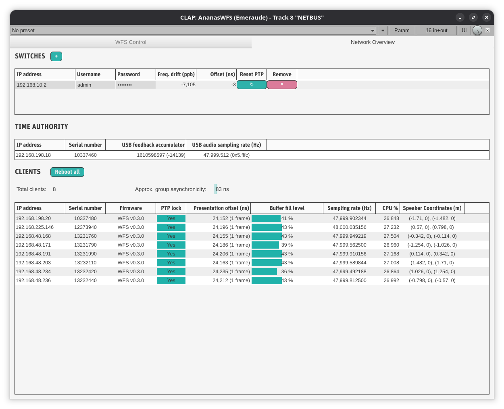
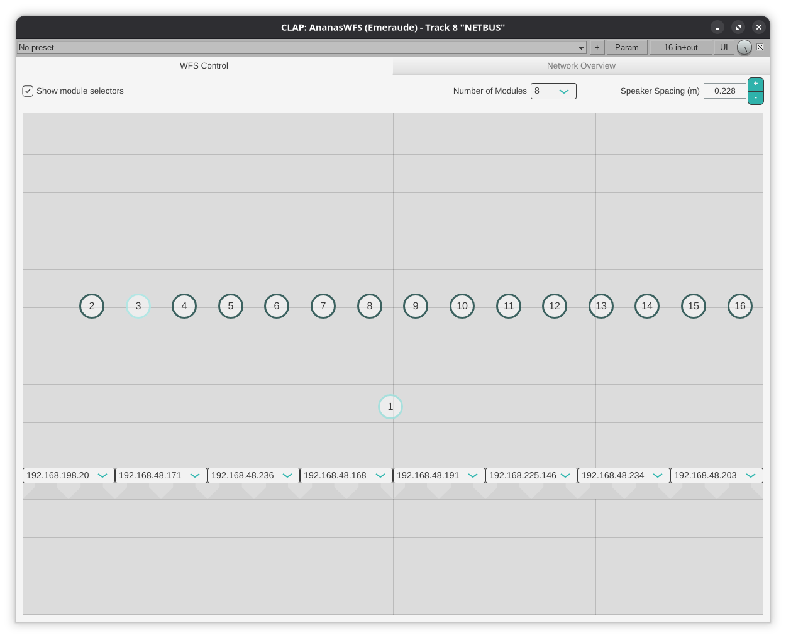

#+title: A Sample-Synchronous Distributed Audio System for Spatial and Immersive Applications
#+author: Thomas Albert Rushton

#+options: toc:nil num:4 h:4
#+export_file_name: out/thesis
#+latex_class: thesis
#+cite_export: biblatex
#+latex_header_extra: \RequirePackage[]{./out/thesis}

#+include: "frontmatter.tex" src latex

* About                                                            :noexport:

Org file describing my PhD thesis.

* LaTeX Setup                                                      :noexport:
:PROPERTIES:
:header-args: :tangle out/thesis.sty :results silent :noeval
:END:

** Provide the package

#+begin_src latex
\ProvidesPackage{thesis}
#+end_src

** Packages

*** Geometry

#+begin_src latex
\RequirePackage[
  a4paper,
  left=3cm,
  right=3cm,
  top=3cm,
  bottom=3cm
]{geometry}
#+end_src

*** Headers/footers

#+begin_src latex
\RequirePackage{fancyhdr}
#+end_src

*** Per-chapter tables of contents

#+begin_src latex
\RequirePackage{minitoc}
#+end_src

Number minitoc sections as deep as ~\subsubsection~

#+begin_src latex
\setcounter{minitocdepth}{3}
#+end_src

*** Graphics

#+begin_src latex
\RequirePackage[dvipsnames]{xcolor}
\RequirePackage{graphicx}
#+end_src

*** Colours

#+begin_src latex
\definecolor{tabED}{rgb}{0.90, 0.87, 0.93}
\definecolor{txtED}{rgb}{0.60, 0.28, 0.02}
\definecolor{siteED}{rgb}{0.04, 0.27, 0.47}
\definecolor{codeBG}{rgb}{.9, .9, .9}
#+end_src

*** Typography

The main serif typeface.

#+begin_src latex
\RequirePackage[cmintegrals,cmbraces]{newtxmath}
\RequirePackage{ebgaramond-maths}
\RequirePackage[T1]{fontenc}
#+end_src

A nicer sans-serif typeface.

#+begin_src latex
\RequirePackage{helvet}
#+end_src

A nicer monospaced typeface.

#+begin_src latex
\RequirePackage{inconsolata}
#+end_src

Just all-round better typography.

#+begin_src latex
\RequirePackage{microtype}
#+end_src

Fancy characters (typically) at the beginning of chapters.

#+begin_src latex
\RequirePackage{lettrine}
#+end_src

**** Quotes

#+begin_src latex
\makeatletter
\newenvironment{chapquote}[2][2em]
{\setlength{\@tempdima}{#1}%
  \def\chapquote@author{#2}%
  \parshape 1 \@tempdima \dimexpr\textwidth-2\@tempdima\relax%
\itshape}
{\par\normalfont\hfill--\ \chapquote@author\hspace*{\@tempdima}\par\bigskip}
\makeatother
#+end_src

*** Tables

#+begin_src latex
\RequirePackage{booktabs}
#+end_src

*** Maths

#+begin_src latex
\RequirePackage{amsmath}
\RequirePackage{amssymb}
\RequirePackage{amsfonts}
#+end_src

*** Units

#+begin_src latex
\RequirePackage{siunitx}
\sisetup{
  mode=match,
  per-mode=symbol
}
#+end_src

*** References

#+begin_src latex
\RequirePackage{hyperref}
\hypersetup{
  unicode,
  colorlinks,
  citecolor=black,
  filecolor=black,
  linkcolor=black,
  urlcolor=black,
  bookmarksnumbered,
  pdfstartview=XYZ
}
\RequirePackage[noabbrev]{cleveref}
#+end_src

*** Figures

#+begin_src latex
\RequirePackage{tikz}
\usetikzlibrary{positioning, arrows.meta}
\RequirePackage{bytefield}
#+end_src

*** Automatically include tof in contents

#+begin_src latex
%% \RequirePackage{tocbibind}
#+end_src

*** Algorithms

#+begin_src latex
\RequirePackage[ruled, vlined, linesnumbered]{algorithm2e}
\crefname{algocf}{algorithm}{algorithms}
\Crefname{algocf}{Algorithm}{Algorithms}
#+end_src

*** Code listings

#+begin_src latex
\RequirePackage{minted}
\setminted{
  fontsize=\footnotesize,
  linenos=true,
  breaklines=true,
  bgcolor=codeBG,
  frame=lines,
  framesep=1mm,
  framerule=1pt,
  rulecolor=\color{gray!50}
}
#+end_src

** Figures

*** PTP

#+begin_src latex
\tikzset{
  role/.style={align=center, draw, inner sep=1mm, minimum height=1cm, rounded corners=.5mm},
  authorityMsg/.style={midway, above=-1mm, rotate=-13},
  subscriberMsg/.style={midway, above=-1mm, rotate=13},
  ptp/.pic={
    \node (auth) [role] at (0, 0) {Clock\\authority};
    \draw [-{Stealth}] (auth.south) -- +(0, -6.5);
    \node (sub) [role, right = 2cm of auth] {Clock\\subscriber};
    \draw [-{Stealth}] (sub.south) -- +(0, -6.5);
    
    \node (t1) [below left=2mm and -8mm of auth] {\(t_{1}\)};
    
    \draw [-{Stealth}] ([yshift=-5.5mm]auth.south) -- ([yshift=-13.5mm]sub.south) node [authorityMsg] {\scriptsize{Sync}};
    \draw [-{Stealth}] ([yshift=-10.5mm]auth.south) -- ([yshift=-18.5mm]sub.south) node [authorityMsg] {\scriptsize{FollowUp [\(t_{1}\)]}};

    \node (t2) [below right=11mm and -8mm of sub] {\(t_{2}\)};

    \node (t3) [below right=21.5mm and -8mm of sub] {\(t_{3}\)};

    \draw [-{Stealth}] ([yshift=-24mm]sub.south) -- ([yshift=-32mm]auth.south) node [subscriberMsg] {\scriptsize{DelayReq}};

    \node (t4) [below left=29mm and -8mm of auth] {\(t_{4}\)};

    \draw [-{Stealth}] ([yshift=-36mm]auth.south) -- ([yshift=-44mm]sub.south) node [authorityMsg] {\scriptsize{DelayResp [\(t_{4}\)]}};

    \node (t11) [below left=43mm and -8mm of auth] {\(t'_{1}\)};
    
    \draw [-{Stealth}] ([yshift=-47mm]auth.south) -- ([yshift=-55mm]sub.south) node [authorityMsg] {\scriptsize{Sync}};
    \draw [-{Stealth}] ([yshift=-52mm]auth.south) -- ([yshift=-60mm]sub.south) node [authorityMsg] {\scriptsize{FollowUp [\(t'_{1}\)]}};

    \node (t21) [below right=52mm and -8mm of sub] {\(t'_{2}\)};
  }
}
#+end_src

* Acknowledgements
:PROPERTIES:
:UNNUMBERED: notoc
:END:

Unlike many of my doctoral peers, I have had the privilege of being
able to develop the work presented in this thesis for a full four
years; I began my doctorate with an internship, a master's thesis, and
a conference publication on the topic already under my belt. For this
I have my thesis co-director, Romain Michon, to thank, as well as
Stefania Serafin, who also co-supervised my master's thesis, for
inviting Romain to Aalborg University, Copenhagen twice a year to give
workshops on Faust, digital musical instrument development, and
physical modelling.

For welcoming me as an intern and later as a /doctorant/, I must thank
Inria, the research institute that it has been an honour to be a part
of since 2023. INSA Lyon, too, for having me as a PhD student, the CITI
laboratory more specifically for being my home from home, and my
colleagues and friends there.

Beyond that, the gratitude I wish to express is more personal in
nature than it is scholarly or professional. Romain and Tanguy, my
thesis co-directors, have shown me great support and also given me the
freedom to explore my ideas, including some entirely adjacent to my
main area of research. My Emeraude teammates, past and present: Pierre
Cochard, Maxime Popoff, Orégane Desrentes, Yann Orlarey, Stéphane
Letz, Romain Bouarah, Romain Fontaine, Bastien Barbe, Florian
Rascoussier, Louis Ledoux, Benjamin Quiédeville, Anastasia Volkova,
Florent de Dinechin, Théo Cantaloube, Clemens Wegener. Other doctoral
students from other teams (/on est tous en la même galère/): Alix
Jeannerot, Guillaume Marthe, Aurélien Delarge, Makhloud Mohamed El
Mehdi, Khiem Huynh, Antoine Bonneau, Julien Caposiena. Linda Soumari,
Cecilia Navarro and Anouchka Ronceray for tolerating my
slowly-improving French. Djurdjura Mehrad, Élise Denoyelle, Stéphanie
Wolska and Morgane Le Prince. Frédéric Le Mouël, Leonardo Cardoso and
Jens Ahrens; Cristoff Ressi, Shawn Silverman, and Jean-Michel Friedt.

Others, beyond the confines of the lab: Kimberly Hoole, Peggy
Domingeon, Irène Hontang, Myriam Boussaboua, Cristina Rottondi, Tomas
Poloniecki, Julie Darnat and Ghis Mirat, Alice Aniello, Matti Gardner,
Kate Fox, Anna Percy, Judy Knowles, Matt Rushton, Sally Rushton, Sally
Catmull, Ani Cammack, Dave Rushton, Andreas Friberg, Louise Smith,
Greg Chick, Anca Diana Axinia, Francesco Ganis, Razvan Paisa, Scott
Naylor, Mike Croft, Alex Calgaro, Laura Armstrong and Mahmoud Nadda.

I owe you all an enormous debt of gratitude.

Tommy

* Abstract
:PROPERTIES:
:UNNUMBERED: notoc
:END:

#+begin_abstract
This is what my work is about
#+end_abstract

#+latex: \mainmatter

* Introduction
:PROPERTIES:
:UNNUMBERED: t
:CUSTOM_ID: sec:intro
:END:

Hi there; let's go.

* Background and State of the Art
#+latex: \minitoc
#+latex: \newpage

\lettrine{A}{udio transmission} over packet-switched networks has
become the /de facto/ standard for a variety of applications over the
past three decades. Replacing the previous generation of cumbersome,
point-to-point installations, it was digital telephony and
videoconferencing that first embraced audio (and video) over the
internet protocol (IP)
suite\nbsp[cite:@hardmanReliable1995;@hardmanSuccessful1998;
@turlettiINRIA1994] and the broadcast industry that pioneered audio
over ethernet\nbsp[cite:@bakkerIntroduction2014]. Before embarking upon a
discussion of networked audio, however, it is worthwhile to review
some fundamental aspects of computer networking.

** Computer Networking

Computer networking is the discipline concerned with the
interconnection of computing systems to enable the exchange of data
and the sharing of resources. With its genesis in the
1960s\nbsp[cite:@bonaventureComputer2011] computer networking addresses
three fundamental concerns: how information is physically or logically
transmitted between nodes; how that transmission is organised and
managed reliably; and how applications address and locate one another
across potentially vast and heterogenous infrastructure.

The field rests on a layered architectural principle --- most famously
codified in the Open Systems Interconnection (OSI) reference model and
its more pragmatic counterpart, the TCP/IP
stack\nbsp[cite:@russellRough2006] --- whereby each layer provides
well-defined services to the layer above while abstracting the
complexity below. This separation of concerns allows physical media
(copper, fibre, radio), data-link protocols (ethernet, wi-fi),
network-layer routing (IP), transport-layer protocols (TCP, UDP),
and application-layer semantics to evolve largely independently.

From an engineering standpoint, networking is fundamentally about
managing contention, latency and failure. The shift from
circuit-switched to packet-switched paradigms was a defining
architectural choice; rather than dedicating a physical path for the
duration of a communication session, packet switching multiplexes
variable-length datagrams across shared infrastructure, trading
determinism for efficiency. This trade-off resurfaces throughout the
field --- in QoS mechanisms, congestion control algorithms, and real
time protocols such as IEEE 1588 Precision Time Protocol (PTP) where
bounded, deterministic delivery is a hard requirement.

*** Ethernet

Ethernet, first described in the mid 1970s and named for the
/luminiferous ether/ through which historically electromagnetic
radiation was said to propagate\nbsp[cite:@metcalfeEthernet1976], is the
dominant wired local area network technology, standardised under IEEE
802.3\nbsp[cite:@IEEE2018] and comprises the data-link layer foundation of
practically all modern LAN infrastructure. The defining abstraction of
ethernet is the /frame/, a variable-length packet containing source
and destination MAC addresses, an EtherType field indicating the
payload protocol, the payload itself, and a 32-bit cyclic redundancy
checksum for integrity checking.

Originally, ethernet operated over shared
media\nbsp[cite:@metcalfeEthernet1976], coaxial cable, and nodes would
listen before transmitting and back off randomly upon collision
detection. A later transition to switched, full-duplex ethernet
rendered the collision detection algorithm obsolete.

** The Internet Protocol Suite and the OSI Model

** Network Protocols

*** User Datagram Protocol

** Audio Over Computer Networks

The transmission of audio data over computer networks has
been a topic of research interest since the earliest days of computer
networking as it is recognised today, i.e. over packet-switched
networks, whereby data to be transmitted is grouped into packets ---
or "datagrams" --- each consisting of a header and a payload. Voice
transmission over ARPANET was being conducted as early as
1974\nbsp[cite:@schulzrinneVoice1992] and the first standard for vocoded
voice communication over packet-switched networks --- the Network
Voice Protocol (NVP) --- was released in
1977\nbsp[cite:@cohenSpecifications1977].

The NVP standard, with control messages for 'calling' and 'ringing',
was clearly intended for digital telephony, and communication was the
primary focus of networked audio research well into the 1990s. Efforts
on supporting real-time voice communication over wide area networks
(WAN) centred on quality of service (QoS), particularly with regard to
the perennial issues of latency, packet loss, and jitter ---
inconsistencies on the rate of packet
transmission\nbsp[cite:@hardmanSuccessful1998; @hardmanReliable1995]. Work
at this time dealt with streams of compressed audio data, and speech
coding algorithms to overcome the deleterious effects of dropped
packets over unreliable network paths and low-bandwidth connections.

Whereas the priority for digital telephony, and later voice over IP
(VoIP) systems, is intelligibility, for musical purposes fidelity is
of greater concern. The late 1990s, with the increasing availability
of high-speed internet connections, saw the beginning of research into
transmitting uncompressed audio data over the
internet\nbsp[cite:@xuRealTime2000; @chafeSimplified2000]. Work of this
sort was spearheaded by the /SoundWIRE/ project, developed by
researchers at McGill University and Stanford University, and took the
form of a wide variety of experiments with high quality audio
transmission over both WAN and local area networks (LAN). These
experiments included LAN-based real-time musical
performances\nbsp[cite:@chafeSimplified2000], concert streaming over
WAN\nbsp[cite:@chafeSimplified2000; @xuRealTime2000], and sonification of
QoS via a distributed digital waveguide dubbed the /Network
Harp/\nbsp[cite:@chafePhysical2002; @chafeSimplified2000].

** Protocols and Systems

VoIP research in the 1990s focused on audio codecs and data
compression\nbsp[cite:@hardmanSuccessful1998; @turlettiINRIA1994], seeking
a compromise with the /best-effort/ nature of internet service. The
SoundWIRE project, in search of high audio quality, turned its
attention directly to the basic transport layer protocols of the
Internet Protocol suite: Transmission Control Protocol (TCP) and User
Datagram Protocol (UDP). Chafe et al. characterised their
compression-free system as taking a "simplified approach" to networked
audio\nbsp[cite:@chafeSimplified2000], emphasising the importance of
delivering multichannel audio of at least CD quality (16-bit,
\qty{44.1}{\kHz}) with as little latency as possible.

SoundWIRE experiments included TCP-based concert streaming. TCP's
/connection-oriented/, one-to-one design enables packet flow control
mechanisms that guarantee packet ordering and protect against packet
loss\nbsp[cite:@al-dhiefPerformance2018; @schiavoniAlternatives2013]; at
the expense of increased latency, these mechanisms safeguard quality
of service, and thus audio fidelity; ideal for a remote concert
scenario. UDP by comparison provides no such safeguards, but equally
none of the associated computational or temporal overhead. Further,
due to its /connectionless/ model, /many-to-many/ (multicast) and
/one-to-many/ (broadcast) modes of transmission are possible via address
spaces reserved as part of the internet protocol
standard\nbsp[cite:@meyerIANA2010]. Via UDP, SoundWIRE was able to run as
a distributed digital waveguide over a WAN spanning around
\qty{4500}{\km}\nbsp[cite:@chafeSimplified2000].

From the SoundWIRE project emerged
/JackTrip/\nbsp[cite:@caceresJackTrip2010; @caceresJackTrip2010a], a hybrid
system that couples a TCP handshake with audio transmission over UDP,
thus sidestepping the overhead of TCP packet flow control. Rather than
relying on TCP's built-in mechanisms for stream integrity, JackTrip
supplements UDP with a selection of optional buffering strategies that
aim to optimise its operation in various network conditions. In this
sense it is more flexible than TCP, but in effect JackTrip moulds UDP
transmission into something akin to the connection-oriented model of
TCP, and, in its 'hub server' mode, into a kind of /multiple one-to-one/
design --- multicast transmission is not possible.

UDP has emerged as the protocol of choice for platforms enabling
remote musical collaboration, serving as the basis for
NetJACK\nbsp[cite:@carotNetjack2009], part of the JACK Audio Connection
Kit (a cross-platform audio host), the audiovisual performance
streaming platform LOLA\nbsp[cite:@drioliNetworked2013],
Jamulus\nbsp[cite:@fischerCase2015a],
Soundjack\nbsp[cite:@renaudNetworked2007], and other jamming-focused
platforms, plus more recent entrants, the closed-source but ultimately
UDP-based networking component of Elk Audio OS\nbsp[cite:@turchetElk2021],
for instance. UDP also plays a fundamental role in networked media
streaming, being the typical transport-layer protocol behind the
Real-time Transport Protocol (RTP), and it features in proprietary
networked audio systems such as Dante (Digital Audio Network Through Ethernet)\nbsp[cite:@danteWhat2022].

** AoE in the Audio Industry

In parallel with work being carried out in academia on SoundWIRE,
JackTrip and NetJACK, audio industry bodies --- the IEEE (Institute of
Electrical and Electronics Engineers) and AES (Audio Engineering
Society) standards groups, and companies like Audinate, the creators
of Dante --- were taking an interest in networked audio. Traditional
large-scale audio systems such as those used in broadcast, concert
venues and recording studios rely on the installation of unwieldy
combinations of analogue hardware and cabling, with many potential
points of failure. Seeking literally to lighten the load posed by
"hundreds of kilograms"\nbsp[cite:@bakkerIntroduction2014] of cabling in
analogue audio installations, in the 2000s audio companies were
looking to high speed ethernet as a means to simplify the provision of
high-quality, multichannel audio in industry settings.

Key to these efforts was the release, in 2002, of the IEEE 1588
standard for the Precision Time Protocol, a means by which networked
computer systems can achieve clock
synchronicity\nbsp[cite:@edisonIEEE15882002]. PTP (another protocol that
typically uses UDP for transport) superseded the lower-resolution
Network Time Protocol (NTP), and, under ideal conditionns, can achieve
sychronisation accuracy of sub-microsecond
order\nbsp[cite:@tongzhouResearch2022]. Synchronisation is achieved via
the exchange of timestamped packets, coupled with precise estimates
for send and receive times. Precision is best when timestamps can be
calculated at the /physical layer/ --- layer 1 of the OSI model, of
which the aforementioned transport layer (layer 3) is a component ---
i.e. by dedicated timers at the level of the physical network
interface. 

** The Need for a New Protocol

** Sound Field Synthesis

*** Psychoacoustics and Sound Localisation

*** Periphony

*** Wave Field Synthesis

*** Ambisonics

* Developing Digital Audio Systems
#+latex: \minitoc
#+latex: \newpage

** Embedded Audio Systems

*** Embedded Linux Systems

**** Raspberry Pi

**** Bela

**** Elk

*** Microcontroller Development Boards

**** ESP32

**** STM32

**** Teensy

**** PlatformIO

*** Field Programmable Gate Arrays

**** The SyFaLa Toolchain

** The Faust Programming Language

** Audio Plugins

*** Jules's Utility Class Extensions

*** The Clever Audio Plugin Format

* Differentiable DSP In Faust
#+latex: \minitoc
#+latex: \newpage 

* Time Exchange

\begin{chapquote}{Douglas Adams, \emph{The Hitchhiker's Guide to the Galaxy}}
Time is an illusion; lunchtime doubly so.
\end{chapquote}

#+latex: \minitoc
#+latex: \newpage

\lettrine{C}{onsider} a tuning fork, a steel, two-pronged resonator
which, when struck, vibrates at a reliable frequency. Just how
reliable is this frequency when all is said and done? Frequency, given
in \unit{\hertz}, can be said to describe the number of times a given
event occurs in one second. And how is a second defined? In terms of
the duration required for a caesium atom to vibrate a certain number
of times\nbsp[cite:@markowitzDefinition1961]. So, frequency is defined in
terms of time, and time in terms of frequency; it appears that we have
a tautology on our hands. Indeed, this is an inescapable reality by
which we are faced when we wrestle intimately with time, that most
illusory of concepts.

Returning to our tuning fork, each time it is struck, the steel from
which it is manufactured will deform ever so slightly. Some of the
physical energy imparted to it by the blow against a hard surface will
be transduced to heat, which changes the physical behaviour of its
material. Strike it on a cold day and it will vibrate more quickly
than on a hot day. And that is not even to mention the device against
which it was calibrated on the day it was manufactured. In short, a
tuning fork designed to produce a reliable \qty{440}{\hertz} frequency
/does not/, /has never/, and /will never/ produce precisely that
frequency. Indeed, given that atomic clocks are /only/ accurate to
parts per trillion [cite:@gillWhen2011;
@markowitzDefinition1961],[fn:1] the very idea of the quantity
\qty{440}{\hertz} is far from perfectly-defined.

Time in computer systems is, of course, subject to the same
vagaries. It is in fact something like a tuning fork that describes
the idea of time in the vast majority of digital systems. A crystal
oscillator (XO), is a sliver of piezoelectric quartz mineral or
ceramic, and, like a tuning fork, on receiving some energy (in this
case electrical) as input, vibrates at a more-or-less reliable
frequency. How accurate this frequency is (setting aside the
fallibility of the definition of a second) is typically defined in
/parts-per-million/ (ppm); a XO with a tolerance of 10 ppm can
reasonably be expected to vibrate up to 0.001 % faster or slower than
the frequency to which it is rated. Thus a 10 ppm XO manufactured to
vibrate at \qty{1}{\mega\hertz} my be expected to produce a frequency,
\(f\), in the range

#+NAME: eq:freq-range
\begin{equation}
999\,990 \leq f \leq 1\,000\,010\;.
\end{equation}
If, to the (audio) engineer's eye, those figures suddenly don't look
so reliable after all, that is entirely understandable. What of the
purity, the /truth/ of the audio sampling rate? Indeed, an audio
system governed by a 10 ppm XO, running at a nominal sampling
frequency of \qty{48}{\kilo\hertz} may run as slow as \(f_{s_{1}} = \)
\qty{47999.52}{\hertz} or as fast as \(f_{s_{2}} = \)
\qty{48000.48}{\hertz}. Is this sort of difference perceptible? By way
of context, that difference is analogous to having two A_{4} tuning
forks, one producing a frequency of \qty{439.9956}{\hertz} and another
at \qty{440.0044}{\hertz}, so a difference of less than one hundredth
of a cycle per second (one twentieth of a cent); this falls far, far
below the /just noticeable difference/ threshold for human pitch
perception\nbsp[cite:@zwickerPsychoacoustics2010]. The audio engineer
notes, however, that the devices running at \(f_{s_{1}}\) and \(f_{s_{2}}\)
will, after one second, be out of sync by almost the duration of one
full audio sample (\sim\qty{21}{\micro\second} at \qty{48}{\kilo\hertz}); the
DSP engineer notes that the sum two audio signals, \(x_{1}[n]\) and
\(x_{2}[n]\), where \(x_{2}[n] = x_{1}[n-1]\) is a one-zero low-pass
filter\nbsp[cite:@mcclellanSignal2003].

# So the footnote stays on the same page...
#+latex: \enlargethispage{\baselineskip}

This manner of /clock drift/ is inevitable in digital systems. To ensure
a sample-synchronous platform for spatial audio, it is necessary to
find a means to correct for it.

** Network Protocols for Time Exchange

*** Network Time Protocol

*** Precision Time Protocol

#+name: fig:ptp
#+caption: PTP packet flow.
\begin{figure}[t]
\centering
\begin{tikzpicture}
  \pic{ptp};
\end{tikzpicture}
\end{figure}

IEEE 1588 Precision Time Protocol (PTP) is a time exchange mechanism
consisting of the exchange of multicast network packets between a
clock authority and a clock subscriber\nbsp[cite:@leeProceedings2005;
@schleusnerSubMicrosecond2024]. PTP packet flow is illustrated in
cref:fig:ptp. Flow begins with the clock authority sending a /sync/
packet; the subscriber notes the time, \(t_{2}\), at which this packet
arrives. The authority then sends a /follow-up/ packet which is
timestamped, \(t_{1}\), with the time of transmission. With \(t_{1}\)
and \(t_{2}\) in hand, the subscriber sends a /delay request/ packet
and notes the time, \(t_{3}\) of transmission; the authority notes the
time, \(t_{4}\) of reception of this packet and sends it to the
subscriber in a final /delay response/ packet. The above process then
repeats for the next time period, typically a second, beginning with
the receipt time \(t'_{2}\)of the following sync packet and the
receipt of the next follow-up packet containing timestamp
\(t'_{1}\). Once the subscriber has the above timestamp information it
can begin to compute its drift, \(\alpha\), delay, \(\delta\), and
offset, \(\theta\) relative to the authority:

#+NAME: eq:ptp1
\begin{align}
\alpha &= 1 - \frac{t'_{2} - t_{2}}{t'_{1} - t_{1}}\;, \\
\delta &= \frac{(t_{4} - t_{1}) - (t_{3} - t_{2})}{2}\;, \\
\theta &= t_{2} - t_{1} - \delta\;.
\end{align}

Armed with the above figures, the subscriber can feed them into a
proportional integral (PI) controller to yield a number of nanoseconds
for second \(n\) by which it should adjust its internal clock,

#+NAME: eq:ptp-pi
\begin{equation}
a_{n} = \alpha - K_{P}\theta_{n} + K_{I}\sum_{t=0}^{n}\theta\;,
\end{equation}
where \(K_{P}\) and \(K_{I}\) are co-efficients to be applied to the
proportional and integral terms respectively; small co-efficients,
typically \(K_{I} < K_{P} < 1\). The adjustment value \(a_{n}\) can be used to
set, for example, the per-cycle increment of a hardware ethernet timer
register.

** Media Clock Recovery

Time exchange at the level of the ethernet subsystems of distributed
modules does not directly help us achieve audio sampling rate
parity. The time exchange information derived from PTP must be used to
condition the audio clocks of the modules such that sampling rate
parity is achieved; this is a process referred to as /media clock
recovery/\nbsp[cite:@crankshawMedia2021].

In the case of the iMXRT1062 MCU this process is achieved by using the
nanoseconds-per-second PTP-derived adjustment value at second \(n\),
\(a_{n}\), to adjust the sampling rate. For a nominal sampling rate
\(f_{s}\) (e.g. \qty{48}{\kHz}), the sampling rate, \(\hat{f}_{s,n}\) that
"matches" that of the time authority is found simply as

#+NAME: eq:sampling-rate-recovery-1
\begin{equation}
\hat{f}_{s,n} = f_{s}(1 + a_{n})\;.
\end{equation}
For example, if \(a_{n} = -1750\;\text{ns}\), we have

#+begin_src emacs-lisp :exports none
(let* ((fs 48000)
       (a -1750e-9)
       (proportion (+ 1 a))
       (fhats (* fs proportion)))
  (format "%.9f %f" proportion fhats))
#+end_src

#+RESULTS:
: 0.999998250 47999.916000

#+NAME: eq:adjust-example
\begin{align*}
\hat{f}_{s,n} &= f_{s}(1 - 1750 \times 10^{-9}) \\
  &= 48\,000 \times 0.999\,998\,25 \\
  &= 47\,999.916\;\text{Hz}\;.
\end{align*}
Inserting this value into cref:eq:general-fs, the expression for the
audio sampling rate of the iMXRT1062, yields

#+NAME: eq:adjusted-fs
\begin{equation}
47\,999.916 = \frac{24 \times 10^{6}}{2^{8}}\frac{D_{S} + \frac{D_{N,n}}{D_{D}}}{D_{p}D_{A}D_{I_{1}}D_{I_{2}}}\;,
\end{equation}
and rearranging, using cref:eq:unknown-dn-2 to find the appropriate
value for the PLL4 numerator register

#+NAME: eq:adjusted-dn
\begin{equation}
D_{N,n} = \frac{D_{D}}{1 \times 10^{6}}\left(
  \frac{2^{8} \times 47\,999.916 \times D_{p}D_{A}D_{I_{1}}D_{I_{2}}}{24} -
  1 \times 10^{6} D_{S}
\right)\;.
\end{equation}
Using the values derived in cref:sec:setting-the-sampling-rate yields

#+NAME: eq:adjusted-dn-2
\begin{align*}
D_{N,n} &= 1 \times 10^{3}\left(
  \frac{2^{8} \times 47\,999.916 \times 3 \times 19}{24} -
  29 \times 10^{6}
\right) \\
  &= 183\,948\,928\;,
\end{align*}
which can be used as a new value for the ~CCM_ANALOG_PLL_AUDIO_NUM~
register of the iMXRT1062 MCU.

In practice cref:eq:sampling-rate-recovery-1 does not suffice,
however, and some residual parts per billion drift remains (see
cref:fig:drift). The proposed solution is as follows: first, observing
that at a nominal sampling rate of \qty{48}{\kHz} for power of two
audio buffer sizes less than or equal to 128 there will be an integer
number, \(I\), of audio interrupts per second, take a representative
nanoseconds figure, \(t_{S}\), on audio system startup; second, every
\(I\) interrupts, reading the system's PTP timer, taking the
nanoseconds part, \(t_{\text{PTP}}\) and comparing with \(t_{S}\):

#+NAME: eq:audio-ptp-offset
\begin{equation}
\Delta_{n} = t_{\text{PTP}} - t_{S}\;;
\end{equation}
finally, applying another PI controller:

#+NAME: eq:sampling-rate-recovery-2
\begin{equation}
\hat{f}_{s,n} = f_{s}\left(
  1 + a_{n} + K_{P_{\Delta}}\Delta_{n} + K_{I_{\Delta}}\sum_{t=0}^{n}\Delta
\right)\;.
\end{equation}
These additional correction factors ensure reliable media clock
recovery indefinitely.

** Presentation Time Recovery

If media clock recovery is a question of parity of rate of
reproduction then presentation time recovery is one of simultaneity of
reproduction. If media clocks are synchronised but audio interrupts
are not, clients will reproduce audio at the same rate but with some
constant temporal offset. Once again, the solution to this problem
lies in judicious selection of sampling rate, \(f_{s}\), and audio buffer
size, \(N\), plus co-ordination via PTP.

Due to the way that DMA is configured, the iMXRT1062 generates two
interrupts per audio buffer, 

** A Synchronous, Distributed Audio System
*** Configuring the iMXRT1062 MCU

#+name: fig:imxrt1062-clock
#+caption: iMXRT1062 audio PLL and SAI1 clock divider registers.
\begin{figure}[t]
\centering
\begin{tikzpicture}
  \node [draw] (osc) {OSC 24M};
  \node [draw] (pll4) [right=.75cm of osc] {\(\times \left(D_{S} + \frac{D_{N}}{D_{D}}\right)\)};
  \node (pll4label) [above=0cm of pll4] {\small{PLL4}};
  \node [draw] (dp) [right=.75cm of pll4] {\(D_{p}\)};
  \node [draw] (dA) [right=.5cm of dp] {\(D_{A}\)};
  \node [draw] (dI1) [right=.75cm of dA] {\(D_{I_{1}}\)};
  \node [draw] (dI2) [right=2cm of dI1] {\(D_{I_{2}}\)};
  \node (fR) [right=1.5cm of dI2] {\(f_{R}\)};

  \draw [-{Triangle}] (osc.east) -- (pll4.west) node [above, midway] {\scriptsize{\(f_{XO}\)}};
  \draw [-{Triangle}] (pll4.east) -- (dp.west) node [above, midway] {\scriptsize{\(f_{P}\)}};
  \draw [-{Triangle}] (dp.east) -- (dA.west);
  \draw [-{Triangle}] (dA.east) -- (dI1.west) node [above, midway] {\scriptsize{\(f_{M}\)}};
  \draw [-{Triangle}] (dI1.east) -- (dI2.west) node [above, midway] {\scriptsize{\(\leq 300 \text{MHz}\)}};
  \draw [-{Triangle}] (dI2.east) -- (fR.west) node [above, midway] {\scriptsize{\(\leq 66 \text{MHz}\)}};
\end{tikzpicture}
\end{figure}

Before proceeding to a discussion of /time exchange/ mechanisms, it is
important to deal with how audio timing is configured on our target
hardware platform, the Teensy 4.1 and its NXP iMXRT1062 MCU.

The iMXRT1062 features a dedicated audio phase locked loop (PLL),
PLL4, and a /synchronous audio interface/, SAI1, the latter providing
I^{2}S output. By convention, the output frequency produced by SAI1,
~SAI1_CLK_ROOT~, \(f_{R}\), must be 256 times oversampled with respect
to the target audio sampling rate, \(f_{s}\):

#+NAME: eq:sai1-1
\begin{equation}
f_{R} = 2^{8}f_{s}\;.
\end{equation}

The NXP MCUXpresso Config Tools software\nbsp[cite:@MCUXpresso2018]
indicates that \(f_{R}\) must be lower than or equal to
\qty{66}{\MHz}, therefore

#+begin_src emacs-lisp :exports none
(format "Fs <= %f Hz" (/ 66e6 (lsh 1 8)))
#+end_src

#+RESULTS:
: Fs <= 257812.500000 Hz

#+NAME: eq:max-fs
\begin{equation}
f_{s} \leq 257\,812.5\;\text{Hz}\;.
\end{equation}
\(f_{R}\) is found by dividing the frequency of ~PLL4_MAIN_CLK~,
\(f_{M}\), by the ~SAI1_CLK_PRED~, \(D_{I_{1}}\), and ~SAI1_CLK_PODF~,
\(D_{I_{2}}\) fields of the ~CCM_CS1CDR~ register:

#+NAME: eq:sai1-2
\begin{equation}
f_{R} = \frac{f_{M}}{D_{I_{1}}D_{I_{2}}}\;.
\end{equation}
\(f_{M}\) is found by dividing \(f_{P}\), the frequency of PLL4, by
the ~POST_DIV_SELECT~, \(D_{p}\), and ~AUDIO _DIV~, \(D_{A}\), registers:

#+NAME: eq:pll4-main
\begin{equation}
f_{M} = \frac{f_{P}}{D_{p}D_{A}}\;.
\end{equation}
\(f_{P}\) is the result of multiplying the iMXRT1062's \qty{24}{\MHz}
clock source, \(f_{XO}\), by the PLL4 divider, \(D_{P}\):

#+NAME: eq:pll4
\begin{equation}
f_{P} = f_{XO}D_{P}\;,
\end{equation}
and \(D_{P}\) is, in turn, the sum of the /PLL loop divider/, the
~DIV_SELECT~ field of the ~CCM_ANALOG_PLL~ ~_AUDIO~ register, \(D_{S}\), with
the quotient of ~CCM_ANALOG_PLL_AUDIO_NUM~, \(D_{N}\), the /PLL
fractional loop divider/ numerator register and
~CCM_ANALOG_PLL_AUDIO_DENOM~, \(D_{D}\), the denominator register:

#+NAME: eq:pll4-divider
\begin{equation}
D_{P} = D_{S} + \frac{D_{N}}{D_{D}}\;.
\end{equation}
See cref:fig:imxrt1062-clock for a diagrammatic representation of the
effect of the audio PLL and clock divider registers on the
\qty{24}{\MHz} clock source.

The ~DIV_SELECT~ field has a valid range of \(27 \leq D_{S} \leq 54\),
and \(|D_{N}| < D_{D}\), so \(D_{P}\) describes (in theory) a number in the
following range:

#+NAME: eq:divider-range
\begin{equation}
\left(26 + \frac{1}{D_{D}}\right) \leq D_{P} \leq \left(54 + \frac{D_{D}-1}{D_{D}}\right)\;,
\end{equation}
with \(1 \leq D_{D} \leq 2^{30}\); effectively, \(26 < D_{P} <
55\). MCUXpresso Config Tools, and the iMXRT1062 reference
manual\nbsp[cite:@nxpsemiconductorsIMX2021 §13.3.2.2], indicate,
however, that the output frequency range for PLL4 is:

#+NAME: eq:pll4-range
\begin{equation}
650\,\text{MHz} \leq f_{P} \leq 1\,300\,\text{MHz}\;,
\end{equation}
plus Config Tools contradicts the reference manual and states that
\(D_{N}\) must be a /positive/ 30 bit integer, so:

#+begin_src emacs-lisp :exports none
(let ((DpMin (/ 650e6 24e6))
      (DpMax (/ 1300e6 24e6)))
  (format "%f <= PLL4 divider <= %f" DpMin DpMax))
#+end_src

#+RESULTS:
: 27.083333 <= PLL4 divider <= 54.166667

#+NAME: eq:true-divider-range
\begin{equation}
\left(27 + \frac{1}{12}\right) \leq D_{P} \leq \left(54 + \frac{1}{6}\right).
\end{equation}
Setting extreme (but valid) values for the divisors, we can find the
minimal valid \(f_{s}\):

#+begin_src emacs-lisp :exports none
(let* ((postDivSelect 4)
       (audioDiv 4)
       (pll4Div (* postDivSelect audioDiv))
       (sai1ClkPred 8)
       (sai1ClkPodf 64)
       (sai1Div (* sai1ClkPred sai1ClkPodf))
       (DpMin (/ 650e6 24e6))
       (fsMin (/ (* 24e6 DpMin) (* pll4Div sai1Div (lsh 1 8))))
       (fsMax (/ 66e6 (lsh 1 8))))
  (format "%f Hz <= Fs <= %f Hz" fsMin fsMax))
#+end_src

#+RESULTS:
: 309.944153 Hz <= Fs <= 257812.500000 Hz

#+NAME: eq:fs-range
\begin{equation}
309.9\;\text{Hz} \leq f_{s} \leq 257\,812.5\;\text{Hz}\;.
\end{equation}

**** A General Expression for the Sampling Rate

Bringing all of the above together, the general expression for
achieving a target sampling rate \(\hat{f}_{s}\) is

#+NAME: eq:general-fs
\begin{align}
\hat{f}_{s} &= \frac{f_{R}}{2^{8}} \nonumber \\
  &= \frac{f_{M}}{2^{8}D_{I_{1}}D_{I_{2}}} \nonumber \\
  &= \frac{f_{XO}D_{P}}{2^{8}D_{p}D_{A}D_{I_{1}}D_{I_{2}}} \nonumber \\
  &= \frac{24\times10^{6}}{2^{8}}\frac{D_{S}+\frac{D_{N}}{D_{D}}}{D_{p}D_{A}D_{I_{1}}D_{I_{2}}}\;.
\end{align}
This reckoning alone does not take into account certain constraints on
the system, however, such as cref:eq:pll4-range and the frequency at
the input of \(D_{I_{2}}\) being less than \qty{300}{\MHz} (see
cref:fig:imxrt1062-clock). There are too many free variables to solve
for any one of them, so an iterative approach to finding appropriate
register and field values is necessary.

**** Setting the Sampling Rate
:PROPERTIES:
:CUSTOM_ID: sec:setting-the-sampling-rate
:END:

#+name: alg:sampling-rate
#+caption: Algorithm for finding ideal divider register values for a
#+caption: given sampling rate.
\begin{algorithm}
  \tcc{Order of magnitude by which to scale calculations.}
  \(O_{m}= 1 \times 10^{6}\)

  \For{\(D_{S} \leftarrow 27\) \KwTo \(54\)}{
    \(D_{N} = 0\)

    \(D_{D} = O_{m}\)

    \(D_{I_{1}} = 1\)

    \(D_{I_{2}} = 1\)

    \(d_{e} = -1\) \tcc{Initial exact divider}
    \While{\(f_{I_{2}} \leq 300\;\text{MHz}\) and \(D_{I_{1}} < D_{I_{1},MAX}\)}{
      \(+\!+D_{I_{1}}\)
    }
    \While{\(d_{e}/O_{m} \neq D_{S}\)}{
      \(+\!+D_{I_{2}}\)

      \If{\(\hat{f}_{s} > f_{s,MAX}\) and \(D_{I_{1}} < D_{I_{1},MAX}\)}{
        \(+\!+D_{I_{1}}\)

        \(D_{I_{2}} = 1\)

        continue
      }
      \(d_{e} = 2^{8}\hat{f}_{s}D_{I_{1}}D_{I_{2}}/24\)

      \If{\(\lfloor{}d_{e}/O_{m}\rfloor \neq D_{S}\)}{
        \If{\(D_{I_{1}} < D_{I_{1},MAX}\)}{
          \(+\!+D_{I_{1}}\)

          \(D_{I_{2}} = 1\)

          continue
        } \Else {break}
      }

      \(D_{N} = d_{e} - O_{m}D_{S}\)

      \While{\(D_{N} \times 10 < D_{N,MAX}\) and \(D_{D} \times 10 < D_{D,MAX}\)}{
        \(D_{N}\;\ast\!= 10\)

        \(D_{D}\;\ast\!= 10\)
      }

      \If{\(f_{P}\) is valid and \(D_{D} = 1 \times 10^{9}\)}{
        \Return
      } \Else {break}
    }
  }
\end{algorithm}

Say we wish to set a sampling rate of \(f_{s} = 48\;\text{kHz}\); our
target \(f_{R}\), \(\hat{f}_{R}\) equals, as per cref:eq:sai1-1

#+NAME: eq:sai1-clk-root
\begin{equation}
\hat{f}_{R} = 48\,000 \times 2^{8} = 12\,288\,000\;\text{Hz}\;.
\end{equation}
Strategically leaving \(D_{p}\) and \(D_{A}\) set to their default
values of 1, cref:alg:sampling-rate can be used to find values for
\(D_{S}\), \(D_{N}\), \(D_{D}\), \(D_{I_{1}}\) and \(D_{I_{2}}\).

#+begin_src julia :results output :eval never-export :exports results
using Printf, Format

let
    # This will simplify some of the calculations, and should help
    # with getting accurate results, particularly in C++.
    MHz = 1e6
    oscMHz = 24;
    oscHz = oscMHz * MHz
    oversamplingRatio = 1 << 8
    Fs = 48000
    fR = Fs * oversamplingRatio
    # Adjustment to all figures so we can compare integer targets...
    cyclesPerOversample = oscHz/oversamplingRatio
    # Frequency limitaitions
    pll4Min = 650 * MHz
    pll4Max = 1300 * MHz
    sai1PostMaxInputFreq = 300 * MHz
    numMax = (1 << 29) - 1
    denomMax = (1 << 30) - 1

    @printf "Target sample rate:   %s Hz\n" cfmt("%'d", Fs)
    @printf "Target SAI1_CLK_ROOT: %s Hz\n\n" cfmt("%'d", fR)

    @printf "fXO * (DS + DN / DD)/(DA * Dp * DI1 * DI2) = %f Hz\n" fR

    for div in 27:54
        num = 0            # Initial numerator
        denom = 1e6        # Start with millionths
        sai1Pre = 1        # Initial SAI1 pre-divider
        sai1Post = 1       # and post-divider
        divExact = -1.0        

        pllFreq = oscHz * (div + num / denom)

        # Adjust first sai1 divider to get a valid input to the second
        # divider
        while pllFreq / sai1Pre > sai1PostMaxInputFreq && sai1Pre < 8
            sai1Pre += 1
        end

        while floor(divExact / MHz) != div
            # Adjust second sai1 divider to get a value below the target
            while cyclesPerOversample * div / (sai1Pre * sai1Post) > Fs && sai1Post < 64
                sai1Post += 1
            end

            # If target Fs is greater than the current achievable Fs,
            # try another combination of SAI1 dividers.
            if (Fs > ((div + 1)/(sai1Pre * sai1Post)) * cyclesPerOversample
                && sai1Pre < 8)
                sai1Pre += 1
                sai1Post = 1
                continue
            end

            # Divide by the main oscillator's frequency in MHz to get
            # a better-behaved number with which to calculate.
            divExact = Fs * oversamplingRatio * sai1Pre * sai1Post / oscMHz

            # If fractional and integer div don't have the same
            # integer part, something's wrong; try a different SAI1
            # predivider.
            if floor(divExact / MHz) != div
                if sai1Pre < 8
                    sai1Pre += 1
                    sai1Post = 1
                    continue
                else
                    break
                end
            end

            num = floor(divExact - div * MHz)

            # Scale num and denom to take greatest possible advantage
            # of the available numerical resolution.
            while num * 10 < numMax && denom * 10 < denomMax
                num *= 10;
                denom *= 10;
            end

            pll4Freq = oscHz * (div + num/denom)
            
            if pll4Freq > pll4Min && pll4Freq < pll4Max && denom == 1e9
                # Found a match
                @printf "24 MHz * (%d + %d/%d)" div num denom
                @printf "/(1 * 1 * %d * %d)" sai1Pre sai1Post
                @printf " = %f\n" 24e6 * (div + num / denom) / (sai1Pre * sai1Post)
            else
                break
            end
        end
    end
end
#+end_src

#+RESULTS:
#+begin_example
Target sample rate:   48,000 Hz
Target SAI1_CLK_ROOT: 12,288,000 Hz

fXO * (DS + DN / DD)/(DA * Dp * DI1 * DI2) = 12288000.000000 Hz
24 MHz * (29 + 184000000/1000000000)/(1 * 1 * 3 * 19) = 12288000.000000
24 MHz * (32 + 256000000/1000000000)/(1 * 1 * 3 * 21) = 12288000.000000
24 MHz * (35 + 328000000/1000000000)/(1 * 1 * 3 * 23) = 12288000.000000
24 MHz * (43 + 8000000/1000000000)/(1 * 1 * 4 * 21) = 12288000.000000
24 MHz * (45 + 56000000/1000000000)/(1 * 1 * 4 * 22) = 12288000.000000
24 MHz * (46 + 80000000/1000000000)/(1 * 1 * 5 * 18) = 12288000.000000
24 MHz * (47 + 104000000/1000000000)/(1 * 1 * 4 * 23) = 12288000.000000
24 MHz * (49 + 152000000/1000000000)/(1 * 1 * 4 * 24) = 12288000.000000
24 MHz * (50 + 176000000/1000000000)/(1 * 1 * 7 * 14) = 12288000.000000
24 MHz * (51 + 200000000/1000000000)/(1 * 1 * 5 * 20) = 12288000.000000
24 MHz * (52 + 224000000/1000000000)/(1 * 1 * 6 * 17) = 12288000.000000
#+end_example
In practice the first such result can be used yielding the following
values:

- \(D_{S} = 29\)
- \(D_{N} = 184\,000\,000\)
- \(D_{D} = 1\,000\,000\,000\)
- \(D_{I_{1}} = 3\)
- \(D_{I_{2}} = 19\)

**** Fine-Tuning the Sampling Rate

Say a set of divider register values has been established using
cref:alg:sampling-rate, and some manner of fine adjustment is desired,
e.g. to compensate for clock drift. Cref:eq:general-fs can be
rewritten to find an expression for an unknown \(D_{N}\):

#+NAME: eq:unknown-dn
\begin{equation}
D_{N} = D_{D}\left(
  \frac{2^{8}\hat{f}_{s}D_{p}D_{A}D_{I_{1}}D_{I_{2}}}{24 \times 10^{6}} - D_{S}
\right)\;.
\end{equation}
For very large \(D_{D}\) it may be advantageous to divide by the main
oscillator's frequency in \unit{\MHz} instead of \unit{\Hz}; to do so,
multiply the contents of the parenthesis in cref:eq:unknown-dn by one
million and divide the outside by one million to compensate:

#+NAME: eq:unknown-dn-2
\begin{equation}
D_{N} = \frac{D_{D}}{1 \times 10^{6}}\left(
  \frac{2^{8}\hat{f}_{s}D_{p}D_{A}D_{I_{1}}D_{I_{2}}}{24} - 1 \times 10^{6}D_{S}
\right)\;.
\end{equation}

** Distributed Spatial Audio Algorithms

*** Distributed Wave Field Synthesis
*** Distributed Higher Order Ambisonics
* Protocol and Software Systems

The heart of the system is /Ananas/, a networked audio system for
time-sensitive applications. Ananas, the French word for "pineapple",
is a recursive acronym: /"Ananas necessitates another networked audio
system"/. It consists of a networked audio server, protocols for audio
and control data transmission and device discovery, media clock and
presentation time recovery, plus microcontroller firmware and software
plugins for sound field synthesis control.

** The Audio Server

The Ananas audio server is a C++ library, written using the JUCE
framework, containing a class, ~ananas::Server::Server~, that inherits
from ~juce::AudioSource~ and encapsulates a collection (a
~juce::OwnedArray~) of threads. Each thread is responsible for a given
server task, be it sending audio data to the network, listening for
PTP timestamps, listening for client and time authority announcement
packets, sending client reboot instructions, or inspecting connected
switches.

#+name: lst:server-constructor
#+caption: Constructor of the ~ananas::Server::Server~ class.
#+begin_src c++
Server::Server(const uint numChannelsToSend) :
  numChannels(numChannelsToSend),
  fifo(numChannelsToSend)
{
  // Add all the threads.
  threads.add(new AudioSender(Sockets::AudioSenderSocketParams, fifo));
  threads.add(new TimestampListener(Sockets::TimestampListenerSocketParams));
  threads.add(new ClientListener(Sockets::ClientListenerSocketParams,
                                 clients, modules));
  threads.add(new AuthorityListener(Sockets::AuthorityListenerSocketParams,
                                    authority));
  threads.add(new RebootSender(Sockets::RebootSenderSocketParams,
                               clients));
  threads.add(new SwitchInspector(Threads::SwitchInspectorThreadParams,
                                  switches));
  
  // The server should listen for change messages sent by all threads.
  for (const auto &t: threads) {
    t->addChangeListener(this);
  }
}
#+end_src

Inheriting from ~juce::AudioSource~, the server implements the method
~getNextAudio Block~, which it uses as an opportunity to write samples to
an intermediate first-in-first-out (FIFO) buffer in preparation for
transmission to the network, and to check whether the outgoing packet
timestamp should be updated.

#+name: lst:get-next-audio-block
#+caption: The Ananas server's ~getNextAudioBlock~ method.
#+begin_src c++
void Server::getNextAudioBlock(const juce::AudioSourceChannelInfo &bufferToFill)
{
    // These checks are kind of overkill, since the order in which threads
    // were added to the OwnedArray is known, but as a sanity check...
    if (auto *s = dynamic_cast<AudioSender *>(threads[0])) {
        if (auto *t = dynamic_cast<TimestampListener *>(threads[1])) {
            // If a new timestamp is available, send it to the audio sender
            // to see whether the packet timestamp needs to be updated.
            if (t->isNewTimestampAvailable()) {
                s->setPacketTime(t->getTimestamp());
            }
        }
    }

    fifo.write(bufferToFill.buffer);
}
#+end_src

** the Ananas Protocol
*** The Ananas Audio Protocol

#+name: fig:audio-packet
#+caption: Structure of an Ananas audio packet.
\begin{figure}[t]
\centering
\begin{bytefield}[bitwidth=.9cm,bitheight=.9cm]{16}
  \bitheader{0-15} \\
  \bitbox{2}{\footnotesize{Seq. num.}} & \bitbox{8}{Timestamp} & \bitbox{1}{\tiny{Num. channels}} & \bitbox{2}{\scriptsize{Num. frames}} & \bitbox[lrt]{3}{} \\
  \wordbox[lr]{1}{Audio} \\
  \skippedwords \\
  \wordbox[lrb]{1}{} \\
\end{bytefield}
\end{figure}

*** The Ananas Authority Description Protocol
*** The Ananas Client Description Protocol
** Audio Plugins

#+name: fig:network-overview
#+caption: The network overview pane of the WFS plugin.
#+attr_org: :width 300

#+name: fig:wfs-control
#+caption: The WFS plugin control interface.
#+attr_org: :width 300

* Evaluation
#+latex: \minitoc
#+latex: \newpage
** Case Studies
* Conclusion
#+latex: \minitoc
#+latex: \newpage

This is my conclusion

#+include: "backmatter.tex" src latex

#+print_bibliography:

* Footnotes

[fn:1] Emphasis added because a one part-per-trillion clock will lose
one second on the order of once every thirty-two thousand years.

* Local Variables                                                  :noexport:

- Add the /thesis/ document class.
- Don't output the title; that's handled by =frontmatter.tex=.
- Add some export headline filters (see =.dir-locals.el=).
- Use =minted= for code listings.

#+begin_example
Local Variables:
org-latex-classes: (("thesis" "\\documentclass[a4paper, 12pt, table,
twoside]{book}
[NO-DEFAULT-PACKAGES]"
("\\chapter{%s}" . "\\chapter*{%s}")
("\\section{%s}" . "\\section*{%s}")
("\\subsection{%s}" . "\\subsection*{%s}")
("\\subsubsection{%s}" . "\\subsubsection*{%s}")
("\\paragraph{%s}" . "\\paragraph*{%s}")
("\\subparagraph{%s}" . "\\subparagraph*{%s}")))
org-latex-title-command: nil
org-export-filter-headline-functions: (tar/acks-as-section
tar/abstract-as-section tar/intro-in-toc)
org-latex-src-block-backend: minted
org-latex-pdf-process: ("latexmk -f -pdf -%latex \
  -interaction=nonstopmode -shell-escape -output-directory=%o %f")
End:

LocalWords: transduced periphony ambisonics microcontroller datagram
LocalWords: CITI Inria INSA Emeraude DMA datagrams sonification
LocalWords: waveguide ethernet Ananas
#+end_example

